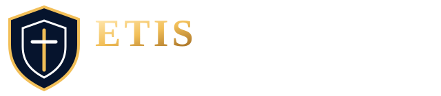
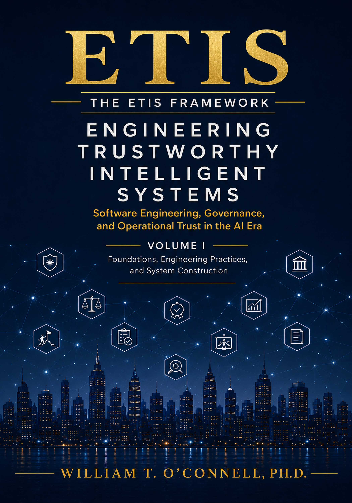
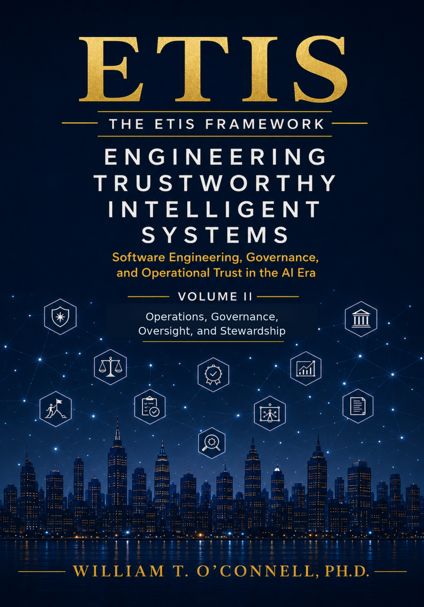
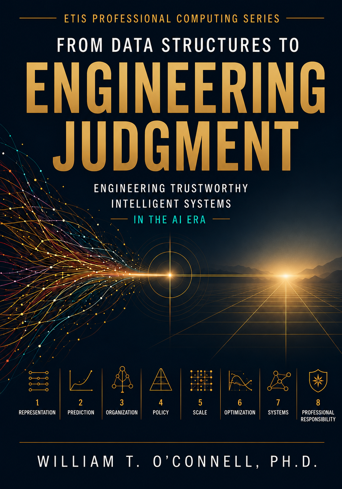

---
hide:
  - toc
---

<div style="text-align:center; margin-bottom:1.5rem;">
  
</div>

# ETIS Books

**Professional works for engineering judgment, trustworthy systems, and computing in the AI era**

ETIS Books form the long-form publishing foundation of the ETIS ecosystem.

The **ETIS Framework Reference Work, _Engineering Trustworthy Intelligent Systems_**, is the definitive two-volume professional treatment of the ETIS Framework and its software-engineering discipline for the AI era. It addresses how software and intelligent systems should be framed, engineered, verified, governed, operated, and stewarded—from requirements and architecture through construction, release, operational trust, oversight, learning, and long-term responsibility.

The **ETIS Professional Computing Series** extends that foundation through books that develop enduring professional capabilities aligned with ETIS. Its inaugural title, **_From Data Structures to Engineering Judgment_**, uses data structures and algorithms as the teaching vehicle for developing evidence-based engineering judgment, disciplined tradeoff reasoning, AI accountability, system thinking, and professional responsibility.

---

## The ETIS Book Architecture

| Publishing role | Work | Purpose |
|---|---|---|
| **ETIS Framework Reference Work** | *Engineering Trustworthy Intelligent Systems* | **Defines the ETIS Framework through a comprehensive two-volume treatment of software engineering in the AI era**, spanning requirements, architecture, construction, AI-assisted engineering, verification, release readiness, operations, security, governance, oversight, operational trust, organizational learning, and stewardship. |
| **ETIS Professional Computing Series** | *From Data Structures to Engineering Judgment* | **Develops professional engineering judgment using data structures and algorithms as the teaching vehicle**, connecting foundational computing to evidence, tradeoffs, AI accountability, system consequences, and professional responsibility. |

The Framework Reference Work answers:

> How should trustworthy intelligent systems be engineered, governed, operated, and stewarded across their lifecycle?

The Professional Computing Series asks:

> What enduring judgment must computing professionals develop to make consequential technical decisions responsibly?

Together, the two book roles connect professional formation with full-lifecycle engineering practice.

---

## ETIS Framework Reference Work

### Engineering Trustworthy Intelligent Systems

*Software Engineering, Governance, and Operational Trust in the AI Era*

<div style="display:grid; grid-template-columns:repeat(2,minmax(140px,230px)); justify-content:center; gap:1.5rem; width:100%; max-width:490px; margin:1.55rem auto .9rem auto;">
  <a href="../Volumes/Volume_I/" style="display:block; text-decoration:none;">
    
  </a>
  <a href="../Volumes/Volume_II/" style="display:block; text-decoration:none;">
    
  </a>
</div>

<p style="text-align:center; margin:.2rem 0 1.4rem 0;">
  <strong>ETIS Two-Volume Professional Edition</strong><br>
  <span style="font-size:.92rem;">One integrated framework. Two lifecycle movements.</span>
</p>

**_Engineering Trustworthy Intelligent Systems_ is the foundational reference work of the ETIS ecosystem.** Across 39 chapters in four parts and two integrated volumes, it presents the complete professional framework for software engineering, governance, operational trust, and stewardship in the AI era.

- **Volume I — Foundations, Engineering Practices, and System Construction** develops the engineering journey from foundations and intent through requirements, architecture, planning, construction, AI-assisted implementation, independent verification, release readiness, and release defense.
- **Volume II — Operations, Governance, Oversight, and Stewardship** continues that journey through sustained operations, observability, security, reliability, AI governance, human oversight, incident learning, organizational trust, and long-term stewardship.

The volumes are not separate works. They are complementary parts of one integrated framework reference.

[Explore the Framework Reference Work →](ETIS_Framework_Reference.md){ .md-button .md-button--primary }
[Explore the Two-Volume Edition →](../Volumes/ETIS_Two_Volume_Edition.md){ .md-button }
[Read ETIS Online →](../Front_Matter/01_Title_Page.md){ .md-button }

---

## ETIS Professional Computing Series

The series provides a durable home for future ETIS-aligned books that develop or apply professional computing judgment in foundational and domain-specific areas. New titles need not reproduce the ETIS Framework; they should extend its professional formation mission through a focused technical or engineering domain.

### Book 1 — From Data Structures to Engineering Judgment

<div style="display:flex; gap:1.5rem; align-items:flex-start; flex-wrap:wrap; margin:1rem 0 1.5rem 0;">
  <div style="flex:0 0 220px;">
    <a href="engineering-judgment/" style="display:block; text-decoration:none;">
      
    </a>
  </div>
  <div style="flex:1 1 320px; min-width:280px;">
    <p style="margin-top:0;"><strong>From Data Structures to Engineering Judgment</strong><br>
    <em>Professional Computing in the AI Era</em><br>
    William T. O'Connell, Ph.D.</p>

    <p>The inaugural title uses data structures and algorithms as the <strong>technical teaching vehicle</strong> for developing professional engineering judgment. Lists, trees, hashing, priority queues, sorting, graphs, and algorithm analysis are important in their own right, but the larger purpose is to teach readers to make explicit decisions, expose assumptions, protect invariants, evaluate evidence, understand tradeoffs, verify AI-assisted work, and own the consequences of what gets built.</p>

    <p>It is intentionally not a conventional data structures textbook, Java programming guide, or algorithms reference.</p>

    <p><strong>Status:</strong> Forthcoming · First Edition · 2026<br>
    <strong>PDF edition:</strong> Free website download<br>
    <strong>Amazon:</strong> Coming soon<br>
    <strong>ISBN:</strong> Coming soon</p>
  </div>
</div>

The book develops a cumulative professional formation arc through **Representation, Prediction, Organization, Scale, Priority, Choice, Systems, and Responsibility**.

[Explore the Professional Computing Series →](ETIS_Professional_Computing_Series.md){ .md-button .md-button--primary }
[Explore the Book →](engineering-judgment/index.md){ .md-button }
[Companion Resources →](engineering-judgment/companion-resources.md){ .md-button }

---

## How the Books Work Together

The relationship is cumulative rather than competitive.

```text
Professional Formation
From Data Structures to Engineering Judgment
        ↓
Engineering Judgment
Explicit decisions · Evidence · Boundaries · Tradeoffs · Accountability
        ↓
Full-Lifecycle Engineering
Engineering Trustworthy Intelligent Systems
        ↓
Requirements · Architecture · Construction · Verification
Operations · Governance · Oversight · Stewardship
```

*From Data Structures to Engineering Judgment* develops habits of mind for making technical decisions explicit, bounded, evidence-based, and accountable.

*Engineering Trustworthy Intelligent Systems* extends those habits across complete software lifecycles and intelligent systems that must remain understandable, reviewable, governable, observable, recoverable, and worthy of trust in operation.

Neither work replaces the other. Together they connect professional formation to full-lifecycle engineering practice.
