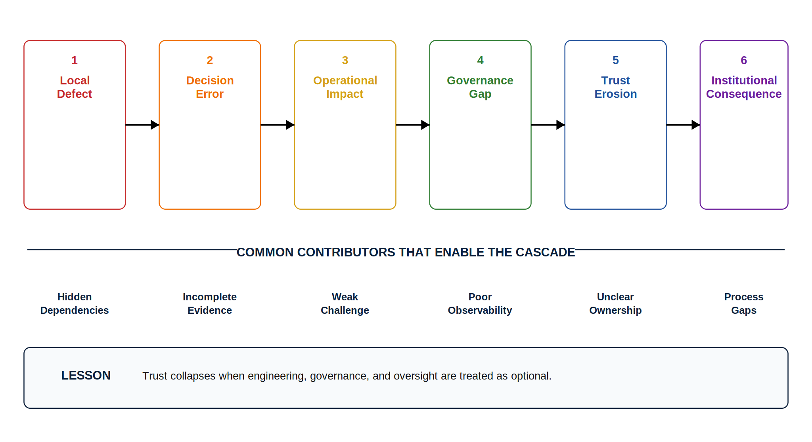
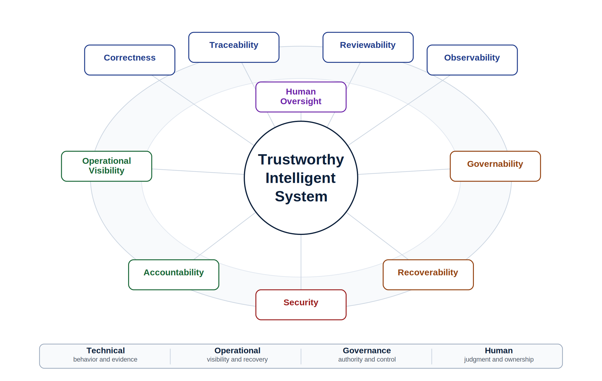
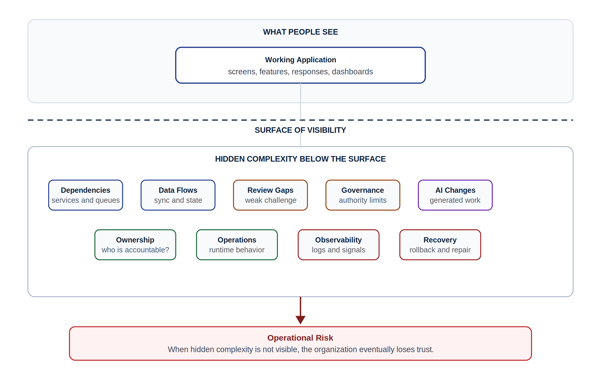
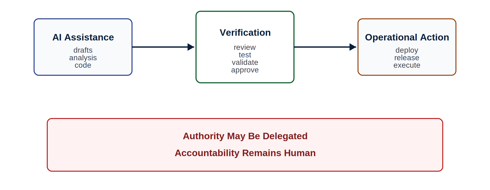
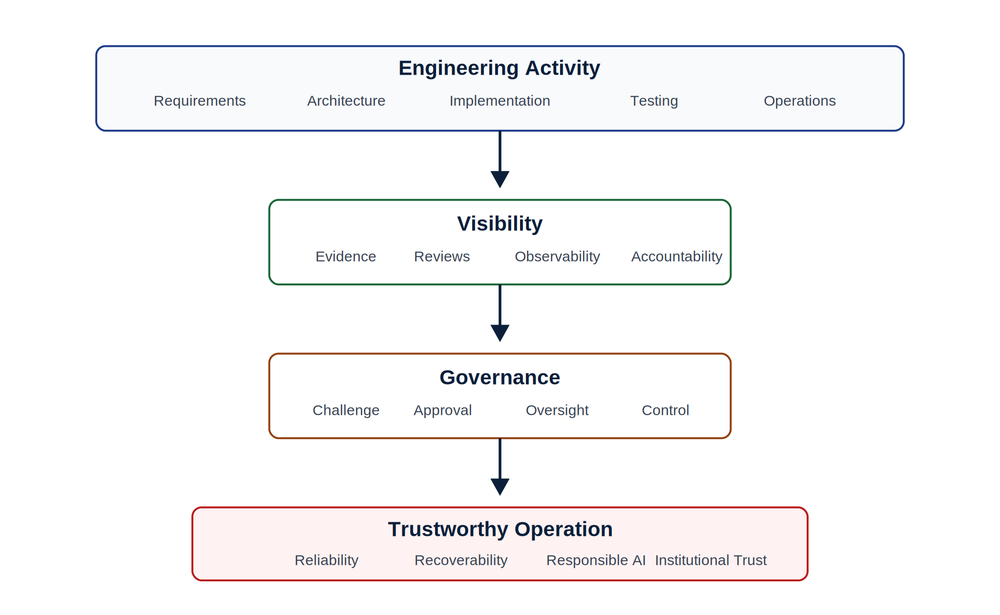

# Chapter 1 Engineering Trustworthy Intelligent Systems

## Opening Operational Scenario: When Working Software Stops Being Trusted

At 6:12 a.m. on a Monday morning, the registration systems at Lakeside Metropolitan University (LMU) began failing intermittently.

Students attempting to register for courses received inconsistent schedules. Some students appeared enrolled in courses that no longer existed. Others were locked out entirely. Advisors could not access current student records. The bursar's office began receiving payment disputes. By 7:15 a.m., social media posts were spreading rapidly across campus, and the university administration demanded immediate answers.

The engineering team initially believed the issue was a simple deployment defect. A recent AI-assisted code update had modified portions of the scheduling synchronization logic during an overnight release. The deployment pipeline showed all automated tests passing successfully. CI/CD workflows completed without error. No obvious infrastructure outage appeared in the dashboards.

Yet the operational reality was very different.

As engineers began investigating, deeper problems emerged. Several services depended on undocumented assumptions. Monitoring dashboards lacked visibility into one of the synchronization queues. A generated AI patch had passed code review without sufficient architectural analysis because the team was under deadline pressure to support an accelerated registration schedule. Multiple engineering groups assumed another team owned operational oversight of the affected subsystem.

The technical issue was eventually corrected. The larger organizational problem was not.

The outage exposed hidden complexity, weak operational visibility, unclear governance boundaries, insufficient review discipline, and excessive trust in accelerated automation. The university leadership did not primarily ask whether the engineers could fix the software. They asked a much more important question:

> How did we lose confidence in our ability to trust the system?

That question sits at the center of modern software engineering.

This book begins there because trustworthy intelligent systems are not defined by whether they produce output, compile successfully, pass a narrow test suite, or impress stakeholders in a demonstration. They are defined by whether they can be responsibly understood, reviewed, governed, observed, recovered, maintained, and owned over time.

*Figure 1.1 — The Trust Collapse: From Local Defect to Institutional Consequence*

---

## 1.1 The Real Nature of Software Engineering

Many students first encounter software as a personal act of construction. They write a program. They compile it. They run it. They submit it. If the output is correct, the work is considered successful.

That experience matters. Engineers must learn to build. They must learn programming languages, data structures, algorithms, interfaces, tests, tools, and technical reasoning. But professional software engineering begins when software stops being merely an artifact and becomes part of an operating organization.

Modern software systems do not live alone. They coordinate registration, billing, advising, facilities, public safety, medical care, transportation, logistics, hiring, communication, learning, research, and institutional decision-making. They connect departments, vendors, users, data stores, workflows, policies, cloud services, access controls, audit requirements, and human expectations.

A failure in such a system is not only a technical event. It may create operational disruption, financial cost, reputational damage, security exposure, compliance risk, governance failure, and loss of institutional trust.

That is why software engineering is different from simply writing code.

Software engineering is the disciplined practice of turning uncertain human intent into systems that can be built, reviewed, operated, governed, recovered, and evolved responsibly.

In the AI era, this distinction becomes more important. AI can accelerate artifact production. It can generate code, draft requirements, summarize meetings, suggest tests, propose designs, create documentation, and scaffold workflows. But artifact production is not the same as engineering. A generated artifact is not automatically correct. A passing test is not automatically sufficient. A fluent explanation is not automatically true. A working demo is not operational proof.

The modern engineer's value is not merely typing code faster. It is defining intent, shaping context, bounding authority, verifying output, challenging assumptions, preserving evidence, governing action, observing operational reality, explaining decisions, and owning outcomes.

The engineer is no longer merely a producer of software artifacts.

The engineer becomes a steward of operational trust.

That transition is the intellectual foundation of this book.

---

## 1.2 From Working Software to Trustworthy Systems

A system can work and still not be trustworthy.

It may produce the expected output for a common case but fail under realistic load. It may pass automated tests but hide a security weakness. It may implement a feature but lack rollback capability. It may support a demo but lack observability. It may use AI to recommend an action but fail to record why that recommendation was accepted. It may route work across departments but provide no clear accountability when the routing is wrong.

Working software is necessary.

It is not sufficient.

A trustworthy intelligent system must satisfy a broader standard. It must be understandable enough for humans to reason about. It must be reviewable enough for other engineers to challenge. It must be traceable enough to connect intent, change, evidence, and outcome. It must be observable enough to explain runtime behavior. It must be governable enough to control authority and action. It must be recoverable enough to respond when failure occurs. It must be secure enough to protect people, data, workflows, and institutional trust. It must preserve accountability so humans remain responsible for consequential decisions.

This book uses the phrase trustworthy intelligent systems deliberately. Trustworthiness is not a mood. It is not a marketing label. It is not a claim made by a team that feels confident. Trustworthiness is earned through evidence across the lifecycle.

Throughout this book, trustworthiness will be evaluated through recurring pillars:

- correctness,
- traceability,
- reviewability,
- observability,
- governability,
- recoverability,
- security,
- accountability,
- operational visibility,
- and human oversight.

These pillars are not a checklist to be mechanically satisfied at the end of a project. They are a way of thinking. They help engineers ask whether the system can be responsibly trusted, not merely whether it appears to work.

*Figure 1.2 — Trustworthy Intelligent Systems Framework*

---

## 1.3 Complexity Is Not Optional

Complexity is an unavoidable property of modern intelligent systems.

Organizations rarely operate simple systems for long. Success itself often increases complexity. More users create more use cases. More departments create more workflows. More integrations create more dependencies. More data creates more governance concerns. More automation creates more authority questions. More AI assistance creates more verification and oversight burden.

Complexity introduces hidden risk.

Many failures occur not because individual engineers lack intelligence or technical capability, but because organizations lose visibility into how systems behave operationally over time. Dependencies become difficult to understand. Ownership becomes unclear. Operational assumptions become implicit rather than documented. Teams optimize locally while unintentionally increasing systemic fragility globally.

The LMU registration failure was not just a bug. It was a failure of visibility. The team could not immediately see how the scheduling synchronization logic depended on hidden queues, undocumented assumptions, AI-assisted changes, review gaps, and unclear operational ownership.

That is what makes software systems sociotechnical.

The system includes code, but it also includes people, teams, workflows, policies, communication paths, review practices, repositories, logs, monitoring dashboards, governance rules, release procedures, AI tools, and institutional expectations.

The system is larger than the code.

Artificial intelligence accelerates this problem further. AI systems can increase development speed dramatically. They can generate code, summarize architecture, produce tests, recommend designs, and automate operational tasks. However, acceleration does not remove engineering responsibility. In many cases, acceleration increases the verification burden placed on engineers.

An engineer who deploys AI-generated code without disciplined review has not eliminated risk. The engineer has shifted risk into areas that may be harder to observe.

Trustworthy engineering therefore requires disciplined visibility. Organizations must preserve the ability to inspect systems, review decisions, understand architecture, observe runtime behavior, govern operational authority, recover from failure, and maintain accountable oversight.

Without visibility, organizations eventually lose operational trust.

*Figure 1.3 — Hidden Complexity and Operational Risk*

---

## 1.4 Engineering Trust Requires Evidence

Professional engineering organizations do not operate primarily on optimism. They operate on evidence.

This principle appears repeatedly throughout trustworthy engineering systems:

- repositories preserve engineering history,
- issues preserve work intent,
- branches isolate proposed changes,
- commits preserve meaningful units of change,
- pull requests preserve review discussions,
- CI/CD systems preserve validation evidence,
- tests preserve behavioral expectations,
- architecture decision records preserve reasoning,
- observability systems preserve runtime telemetry,
- release notes preserve readiness claims and limitations,
- postmortems preserve organizational learning,
- governance workflows preserve accountability.

These artifacts collectively create institutional engineering memory.

One of the strongest misconceptions among inexperienced developers is that repositories primarily store source code. In professional engineering, the repository increasingly functions as an operational evidence system. It preserves traceability, accountability, reviewability, and organizational understanding.

When a failure occurs in production, organizations rarely ask only, Who wrote the code?

They ask:

- What changed?
- Why did it change?
- What requirement or risk motivated the change?
- Who reviewed it?
- What evidence supported release?
- What assumptions existed?
- What tests were run?
- What operational visibility was available?
- What governance approvals occurred?
- What rollback plans existed?
- What monitoring gaps were present?
- What did AI help generate?
- What did humans verify?

Trustworthy engineering depends on the ability to answer those questions clearly and honestly.

The repository is therefore not just a storage location. It is the engineering system of record. It is the place where a team shows what it built, why it built it, how it changed, who reviewed it, what evidence supports it, what risks remain, and what still must be learned.

> Everything important leaves evidence.
>
> Trustworthy engineering depends on the ability to inspect that evidence.

That principle will appear throughout this book because it separates engineering from performance. A team may sound confident in a presentation. A demo may appear polished. A generated document may read professionally. But if the evidence does not exist, the claim remains weak.

---

## 1.5 AI Changes the Profession, But Not the Responsibility

The rise of AI has caused many organizations to rethink the role of engineers. Some narratives suggest that AI systems will largely replace engineering judgment. In practice, the opposite pressure is emerging.

As intelligent systems increase in capability, organizations require stronger governance, stronger review systems, stronger observability, stronger evidence practices, and stronger accountability mechanisms.

AI systems can be useful. They can draft, summarize, classify, suggest, explain, scaffold, and accelerate. They can help teams explore options. They can reduce blank-page friction. They can make routine artifact creation faster. Used responsibly, they can improve productivity and learning.

But AI systems can also hallucinate, omit assumptions, introduce subtle defects, create security risks, generate fragile abstractions, overstate confidence, and obscure operational reasoning.

Therefore, trustworthy engineering increasingly depends on disciplined human oversight.

Human oversight does not mean resisting automation. It means governing automation responsibly.

Professional engineers must understand:

- where AI systems are used,
- what context shaped their output,
- what authority AI systems possess,
- what evidence supports their outputs,
- how generated artifacts are verified,
- what escalation paths exist,
- what actions require human approval,
- what can be reversed,
- and how accountability is preserved.

AI proposes; engineers verify.

That does not mean every AI-assisted draft requires the same level of scrutiny. Risk matters. A generated first draft of meeting notes does not carry the same consequence as generated code that changes access control. A suggested CSS layout does not carry the same consequence as a workflow that automatically routes sensitive student information. Low-risk, isolated, easily reviewable assistance may require lightweight review. High-risk operational behavior requires stronger evidence, governance, observability, rollback, and human accountability.

AI delegation is an engineering risk-management decision, not a binary ideological position.

The engineer's role evolves from pure implementation toward governed operational stewardship. That role becomes more important as systems become more automated, more integrated, and more capable of influencing institutional action.

*Figure 1.4 — AI Proposes; Engineers Verify*

---

## 1.6 Governance Is Not Bureaucracy

Students sometimes perceive governance as unnecessary overhead. Reviews, approvals, operational readiness evaluations, release gates, and architecture boards can initially appear to slow development.

Mature organizations understand something different.

Governance exists because complexity creates invisible risk.

As systems scale, organizations require mechanisms that challenge assumptions, expose hidden dependencies, preserve accountability, validate operational readiness, bound authority, and reduce systemic fragility.

Governance is therefore not the opposite of engineering.

Governance is architecture.

A pull request review is not simply a formatting exercise. It is a structured challenge system.

An architecture review is not merely a meeting. It is an attempt to evaluate long-term survivability.

A release readiness review is not a ceremonial approval gate. It is an institutional trust evaluation.

An AI oversight review is not a symbolic human-in-the-loop claim. It is a control mechanism that asks whether humans can meaningfully understand, challenge, approve, reject, audit, and recover from AI-assisted behavior.

These systems become increasingly important as intelligent automation accelerates change.

Governance should not be treated as paperwork added after implementation. If a system can act, route, recommend, approve, notify, modify, prioritize, escalate, or expose information, then governance belongs in the requirements, architecture, implementation, review, testing, release, and operational phases.

The question is not whether governance slows engineering.

The question is whether the system can be trusted without it.

*Figure 1.5 — Engineering Trust Through Visibility and Governance*

---

## 1.7 The Repository Is the Engineering Memory

Every serious engineering effort needs memory.

Not private memory. Not a message buried in a chat thread. Not an explanation that only one developer understands. Not a decision that existed only in a meeting.

Engineering memory must be inspectable, persistent, reviewable, and connected to the work.

That is why the repository plays such a central role in this book.

A repository is not merely where code is stored. A mature repository shows the state of the engineering effort. It links requirements to issues, issues to branches, branches to commits, commits to pull requests, pull requests to reviews, reviews to tests, tests to release evidence, release evidence to known limitations, and operational incidents to learning.

The repository answers questions that matter:

- What problem are we solving?
- What are the current requirements?
- What assumptions remain open?
- What architecture decisions have been made?
- What risks are known?
- What tests support current claims?
- What AI assistance was used?
- What work was reviewed?
- What is ready for release?
- What is not ready?
- What will another engineer need to understand later?

In this book, repository-centered engineering is not a tooling preference. It is a trust mechanism.

GitHub will serve as the practical ecosystem because it supports versioning, issues, pull requests, reviews, CI/CD workflows, release evidence, documentation, and publication through GitHub Pages. But the principle is larger than one platform. The durable idea is that trustworthy engineering requires visible, reviewable, durable evidence.

The submitted document may summarize work.

The repository proves it.

That distinction will matter throughout the book.

---

## 1.8 The LMU Case: A Living Enterprise Environment

This book uses Lakeside Metropolitan University (LMU) as a recurring enterprise environment.

LMU is a fictional university, but the problems are realistic. The university operates across multiple campuses. It supports students, faculty, staff, advisors, facilities teams, operations teams, finance offices, public safety coordination, student services, and technology groups. Its systems are not clean-room examples. They include legacy dependencies, staffing limits, governance pressure, incomplete information, stakeholder urgency, and institutional trust concerns.

The central platform that will mature throughout the book is the Campus Operations and Incident Coordination Platform, or COICP.

COICP begins as a response to fragmented coordination. Different departments track incidents, requests, escalations, approvals, and communications in inconsistent ways. Some work happens through email. Some happens through spreadsheets. Some happens through ticketing systems. Some happens through private knowledge. Some depends on individuals remembering to notify the right people.

That environment is intentionally not a toy problem.

It is also intentionally not so large that it becomes overwhelming. LMU represents a mid-sized enterprise environment: complex enough to introduce governance, operations, organizational coordination, AI risk, observability, release readiness, and accountability, yet focused enough to support learning. The goal is not to reproduce every challenge of a large multinational organization. The goal is to provide a realistic setting in which trustworthy engineering principles can be observed, practiced, and understood.

LMU will allow us to watch a system mature across the book. We will see requirements become clearer. Repositories become more structured. Reviews become more meaningful. Architecture becomes more explicit. AI use becomes more governed. Release evidence becomes more disciplined. Observability becomes more operational. Incidents become learning opportunities. Teams become more accountable.

The point is not to memorize LMU.

The point is to learn how trustworthy engineering grows in an organization that cannot afford to confuse confidence with trust.

---

## 1.9 The Transformation Into a Trustworthy Engineer

Throughout this manuscript, the reader will gradually undergo an important transformation.

Many developers begin their journey asking:

> Can I build this?

Trustworthy engineers eventually ask deeper questions:

- Can this system be responsibly trusted?
- Is the architecture understandable?
- Can failures be observed?
- Is operational ownership clear?
- Can the organization recover from failure?
- Does governance remain effective under pressure?
- Can AI-assisted behaviors be reviewed and bounded?
- Can accountability survive increasing automation?
- What evidence supports the claim that the system is ready?
- What risks remain, and who owns them?

Those questions define engineering maturity.

The trustworthy engineer recognizes that software systems increasingly operate as institutional infrastructure. Universities coordinate enrollment, hospitals coordinate patient care, transportation systems coordinate movement, governments coordinate public services, and businesses coordinate operations through software-intensive ecosystems.

As organizational dependence grows, engineering responsibility grows alongside it.

The professional identity developed in this book moves through several stages. The reader begins as someone who can write code. Then the reader becomes a contributor who can work inside a repository. Then a reviewer who can challenge and improve work. Then an architect who can reason about boundaries and consequences. Then a release engineer who understands evidence and readiness. Then an operational engineer who can observe, recover, and learn. Finally, the reader becomes a trustworthy engineer who can govern intelligent systems under uncertainty.

That transformation is demanding.

It is also the future of the profession.

---

## 1.10 How This Book Will Proceed

Part I explains why software engineering matters more in the AI era. It establishes the worldview: systems are complex, failures are sociotechnical, lifecycle models coordinate uncertainty, AI changes lifecycle pressure, human oversight requires judgment, and teams create trust through communication, review, and accountability.

Part II moves into building responsibly. It shows how teams launch projects, define standards, structure repositories, handle requirements, plan work, reason about architecture, use AI assistance carefully, review pull requests, test systems, and defend release readiness.

Part III moves into operational trust. It shows how teams learn from defects, reduce failure, observe runtime behavior, prepare runbooks, govern security, manage AI delegation, analyze reliability, respond to incidents, and evaluate release authority.

Part IV moves toward the trustworthy engineer in the AI era. It examines agentic systems, enterprise AI architecture, context engineering, human oversight, cognitive load, repository-centered operational engineering, stewardship, and the future of the profession.

The appendices provide professional reference frameworks that consolidate the book's core doctrines, review-board mechanisms, repository artifacts, engineering principles, enterprise architecture, engineering judgment models, AI governance guidance, and terminology. Together, they serve as a reusable reference library for applying trustworthy engineering principles in practice.

The purpose of this structure is not to cover every possible software engineering topic. It is to develop one disciplined professional capability:

**Engineering trustworthy intelligent systems under uncertainty.**

Every chapter contributes to that goal. Requirements, architecture, implementation, testing, governance, operations, AI oversight, stewardship, and professional judgment are not separate concerns. Together they form the foundation of trustworthy engineering in the AI era.

---

## Closing Reflection

This chapter established the foundational worldview of trustworthy intelligent systems engineering.

Modern engineering is no longer defined solely by implementation capability. It is defined by the disciplined preservation of visibility, accountability, governability, recoverability, operational understanding, and human oversight as systems become increasingly complex and AI-assisted.

The remaining chapters will progressively deepen that worldview.

You will learn how projects fail when coordination and evidence collapse. You will learn how sociotechnical complexity changes engineering responsibility. You will learn how lifecycle models organize uncertainty. You will learn how AI accelerates artifacts while increasing verification burden. You will learn how human oversight must become meaningful engineering control. You will learn how teams communicate, review, and own outcomes together. Then you will learn how to launch, structure, build, review, test, release, operate, and govern systems in ways that earn trust.

The core principle introduced in this chapter will recur throughout the manuscript:

Trustworthy engineering requires disciplined visibility, accountable oversight, and evidence-based judgment under uncertainty.

Everything else builds upon that foundation.

---

## Chapter Review Questions

1. Why is software engineering fundamentally different from simply writing code?

2. How can a system work technically while still failing as a trustworthy system?

3. How does the trustworthy engineer mindset differ from a feature-only mindset?

4. Why does increasing complexity create hidden operational risk?

5. Why does AI acceleration increase verification and governance burdens?

6. Why is human oversight increasingly important in AI-assisted systems?

7. Why are repositories considered institutional engineering memory systems?

8. How do reviews and governance structures preserve operational trust?

9. What role does observability play in trustworthy intelligent systems?

10. Why is evidence more important than confidence in professional engineering?
