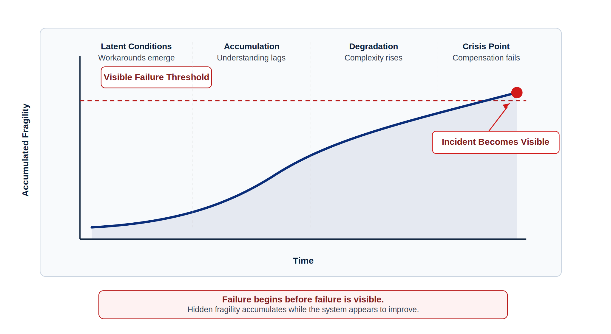
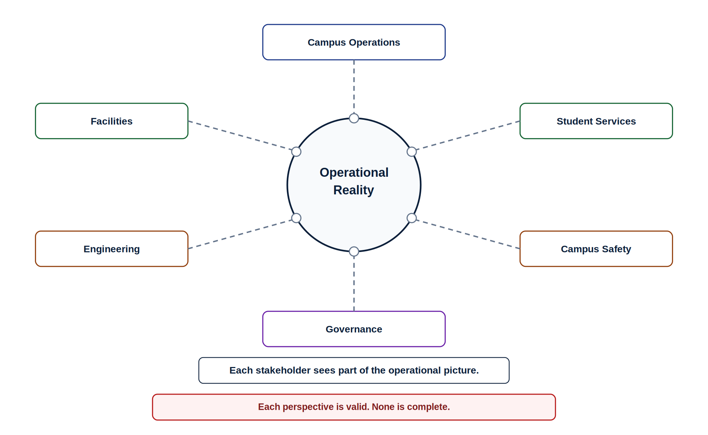
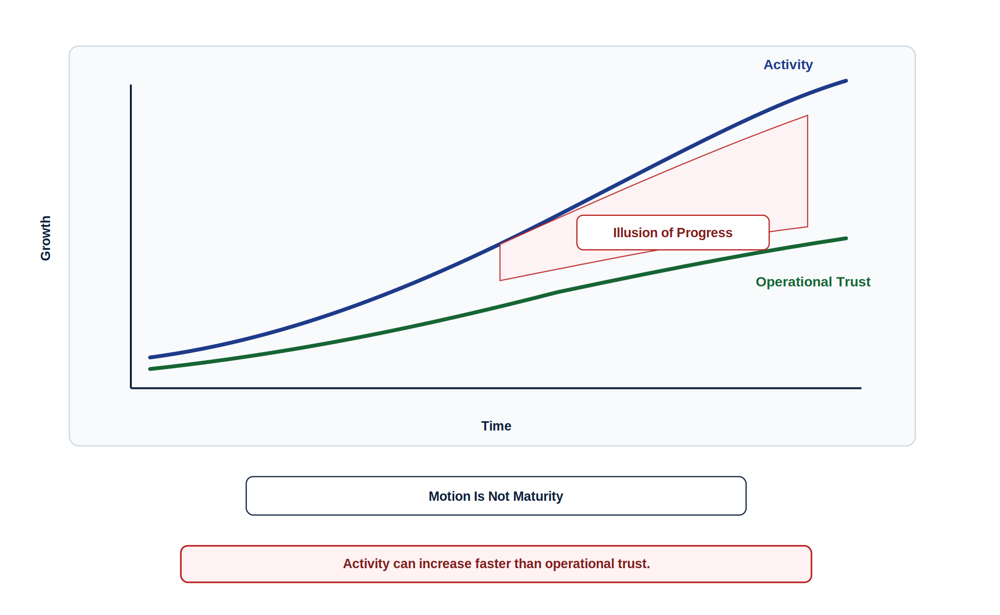
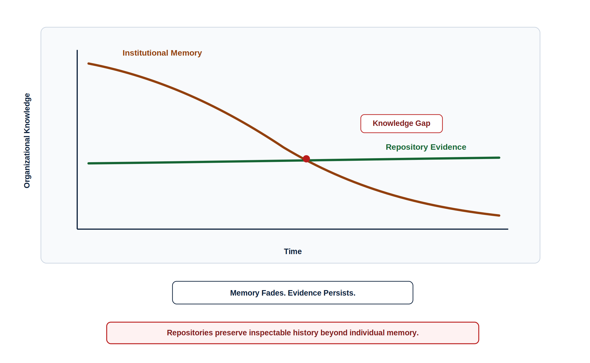
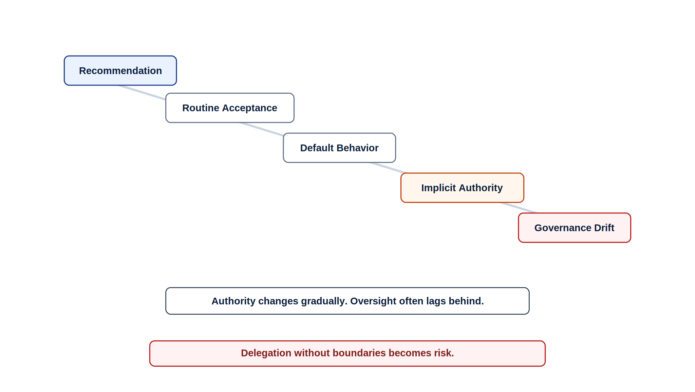
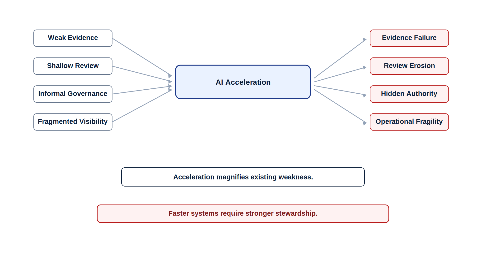
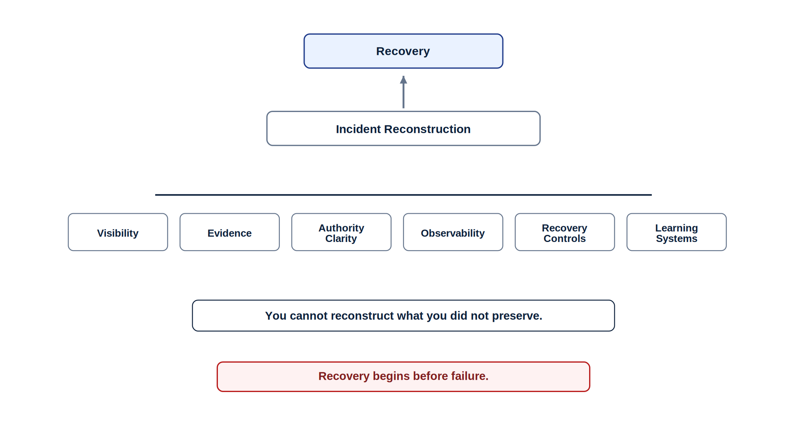
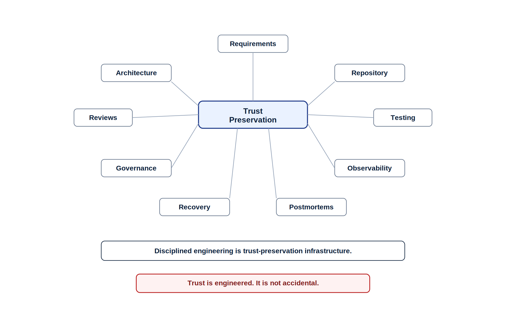

# Chapter 2 Why Software Projects Fail

## Failure Begins Before Failure Is Visible

Failure rarely begins at the moment an incident becomes visible.

By the time a system disrupts users, delays operations, exposes governance confusion, or forces an urgent response, the underlying weakness has often existed for much longer. The visible failure is usually the moment the organization can no longer compensate for fragility it has already been carrying.

At Lakeside Metropolitan University (LMU), the Campus Operations and Incident Coordination Platform, or COICP, was beginning to look like a success story.

More departments were using the platform. Incident coordination was less fragmented than before. Facilities teams had better access to request status. Campus Operations could see more activity in one place. Student Services had fewer informal phone calls to make. Leadership saw movement. The platform was not perfect, but it appeared to be improving institutional coordination.

And much of that progress was real.

But progress can hide fragility.

As COICP expanded, new departments brought new workflows, exceptions, local practices, and authority expectations. Some routing rules were formally documented. Others existed because experienced coordinators knew what to do. Some status updates flowed through the platform. Others still happened through email, spreadsheets, hallway conversations, or quick messages between trusted staff. Some teams followed the official escalation path. Others used informal shortcuts because the official path was too slow, unclear, or incomplete.

The system was improving faster than the organization’s understanding of it.

That gap is where failure begins.

*Figure 2.1 — Failure Accumulation Curve*

A visible incident often appears sudden because the organization sees only the final moment: a delayed escalation, a missed notification, a failed release, a routing error, a confused operational handoff, or a governance question no one can answer. But beneath that visible event is usually a long accumulation of hidden conditions.

An assumption went undocumented.

A workaround became routine.

A review became lighter.

A workflow diverged from its design.

A log was not checked.

A dashboard did not show the right signal.

An approval boundary became informal.

A spreadsheet became operational infrastructure.

None of these individually looks like failure.

Together, they create it.

These conditions map directly to the failure patterns organizations struggle to see early: visibility failure, evidence failure, review failure, governance drift, coordination erosion, operational blindness, and recovery weakness. By the time those weaknesses become operationally visible, they are usually already interacting with one another.

### Failure Pattern: Manual Compensation Masks Structural Weakness

Organizations often appear stable because experienced people compensate for weak systems before the weakness becomes visible. They remember exceptions, repair unclear handoffs, explain undocumented behavior, route around broken processes, and quietly translate between the official workflow and the actual workflow. Their competence protects the organization in the short term, but it can also hide structural fragility until they are unavailable, overloaded, or no longer able to compensate.

At LMU, experienced staff made COICP work better than the formal design alone would have allowed. They knew which facilities requests needed special handling. They knew when Campus Safety should be copied even if the workflow did not require it. They knew which building coordinators preferred email follow-up. They knew which status changes were often delayed and how to interpret them.

That knowledge was valuable.

It was also dangerous when it remained invisible.

A system that depends on undocumented human compensation may look stable during normal conditions. It may even look efficient. But its stability is fragile because the real operating model lives partly outside the system’s evidence trail and repository memory.

When staffing changes, workload increases, automation is added, or AI-assisted routing is introduced, the hidden model begins to matter.

This is why trustworthy engineers are skeptical of surface stability. They do not ask only whether the system is currently working. They ask why it is working, who is compensating for it, what evidence supports it, what assumptions are undocumented, and what would happen if normal informal support disappeared.

Stewardship requires detecting operational fragility before visible failure forces the organization to react under pressure.

AI acceleration can make this harder to see.

If LMU adds AI-assisted routing to a workflow already stabilized by undocumented human judgment, the system may appear to improve. Recommendations may arrive faster. Summaries may be clearer. Triage may seem more consistent. Leadership may see increased throughput.

But if the AI-assisted workflow is built on incomplete understanding, acceleration can scale the wrong assumptions.

The problem is not that AI caused the fragility.

The problem is that AI can accelerate a workflow before the organization understands the workflow.

That distinction matters.

Trustworthy engineering begins earlier than incident response. It begins by noticing where operational truth is already fragmenting, where evidence is missing, where ownership is informal, where review has weakened, where governance depends on habit rather than design, and where AI assistance may amplify assumptions no one has verified.

Failure begins before failure is visible.

The trustworthy engineer learns to look for the conditions that make future failure likely: invisible assumptions, undocumented workarounds, unclear ownership, weak evidence trails, shrinking review discipline, hidden authority, operational signals no one is watching, and recovery paths no one has tested.

Those conditions are not dramatic.

They are ordinary.

That is why they matter.

The next question is how those ordinary weaknesses spread across teams, workflows, and systems until no one has a complete picture of what is really happening. That is where coordination failure begins.

---

## 2.1 Hidden Complexity and Coordination Failure

Coordination failure is rarely just a communication problem.

That phrase is too small for what usually happens.

In complex organizations, coordination depends on systems, workflows, people, assumptions, timing, ownership, escalation paths, authority boundaries, and evidence. When those pieces drift apart, people may still communicate constantly while the organization loses shared operational truth.

At LMU, COICP was designed to reduce fragmentation. That goal was reasonable. Campus Operations needed a more consistent way to coordinate incidents across Facilities, Student Services, Campus Safety, and other departments. But as more groups adopted the platform, COICP began touching workflows that had evolved separately for years.

Facilities thought in terms of work orders, building priorities, crews, vendors, materials, access windows, and completion status.

Student Services thought in terms of student impact, communication, service recovery, complaint escalation, and the reputational consequence of slow response.

Campus Safety thought in terms of urgency, risk, notification, response coordination, documentation, and escalation.

Campus Operations thought in terms of institution-wide visibility, assignment, routing, follow-through, staffing constraints, and leadership reporting.

David Ramirez’s engineering team thought in terms of system state, integration behavior, data consistency, workflow design, architecture boundaries, and platform maintainability.

Priya Patel thought in terms of approval authority, auditability, delegated action, policy compliance, and governance risk.

Each view was legitimate.

None was complete.

That is how hidden complexity works. The system looks understandable from each local perspective, but the full operational reality exists across the interactions between perspectives. Failure often appears at those boundaries.

*Figure 2.2 — Fragmented Operational Truth Map*

One department may believe an incident is assigned because the platform shows a routing status. Another may believe it is pending because a work order system has not confirmed acceptance. A third may believe it has already been escalated because an email thread includes the right people. A fourth may treat the issue as unresolved because students are still reporting impact.

Everyone may be acting reasonably.

The organization may still be wrong.

This is fragmented operational truth.

It happens when different systems, teams, and workflows hold different parts of reality without a reliable mechanism for reconciliation. The issue is not simply that people failed to talk. The issue is that the operational system does not preserve one inspectable, trusted view of what is happening.

These conditions reinforce multiple failure classes simultaneously: coordination failure, visibility failure, evidence failure, review failure, and eventually governance failure as teams begin operating from inconsistent assumptions and authority expectations.

### Failure Pattern: The Spreadsheet That Became Infrastructure

Many organizations discover that a spreadsheet, shared document, inbox rule, personal tracker, or unofficial script has quietly become part of the real production system. It may not appear in architecture diagrams. It may not be reviewed. It may not have ownership, backup, access control, or audit history. Yet operations depend on it.

That is not documentation.

That is hidden infrastructure.

At LMU, a spreadsheet originally created as a temporary coordination aid became the place where certain exceptions were tracked. It helped experienced staff remember which buildings needed special routing, which requests required extra notification, and which recurring issues had informal handling rules.

The spreadsheet solved a local problem.

It also created a system problem.

Because the spreadsheet sat outside COICP’s governed workflow, it was not consistently reviewed when the platform changed. Its rules were not always reflected in requirements. Its logic was not visible in pull requests. Its assumptions were not represented in tests. Its operational importance was not obvious to new staff. Its data had no clear audit trail. Its ownership was informal.

The repository preserved the official workflow history, but part of the institution’s real operational knowledge now existed outside the repository’s evidence trail.

The organization had two systems: the official one and the one people actually used to make the official one work.

This is not unusual.

As systems grow, local adaptations often emerge faster than formal architecture can absorb them. Teams create practical bridges: spreadsheets, scripts, saved searches, message threads, manual checklists, informal escalation habits, and side-channel status reports. These bridges can be useful. They may even be necessary. But when they remain invisible, they become coordination risk.

Coordination failure grows when hidden bridges become operational dependencies.

This is why coordination design is engineering design. Workflow boundaries, synchronization rules, escalation ownership, evidence preservation, and operational visibility are architectural concerns, not merely management concerns.

The same pattern appears in technical integrations. A field in one system may not mean exactly what another system assumes it means. A timestamp may represent creation time in one workflow and assignment time in another. “Resolved” may mean work completed to Facilities, communication sent to Student Services, or incident closed to Campus Operations.

The word is the same.

The operational meaning is different.

When meanings diverge, systems can appear synchronized while teams are making decisions from incompatible assumptions.

AI-assisted workflows can amplify this problem. An AI summarizer may compress conflicting status reports into a single confident narrative. A routing assistant may recommend action using incomplete workflow context. A chatbot may answer from documented process while experienced staff operate from undocumented practice.

Again, AI does not create the coordination weakness by itself.

It can make the weakness harder to notice because the output appears coherent.

That is dangerous. A coherent summary of fragmented truth is still fragmented truth.

Trustworthy engineers therefore pay attention to boundaries. They ask where workflows cross teams, where data changes meaning, where local adaptations exist, where official process diverges from actual practice, where AI-generated summaries may erase uncertainty, and where evidence survives handoff.

They do not treat coordination as a soft issue separate from engineering.

Coordination is part of the system.

If no one can explain how work moves across departments, systems, roles, and authority boundaries, the organization does not yet understand the system it depends on.

At LMU, the challenge was not that any one group lacked competence. The challenge was that the platform had become a meeting point for multiple operational worlds. Each world had its own language, incentives, timing, authority expectations, and definition of completion.

COICP could not become trustworthy merely by centralizing activity.

It had to help the institution build shared operational truth.

That requires more than activity. It requires evidence, review, governance, observability, and disciplined coordination design.

Without those, the organization may appear busy, responsive, and technically active while trust continues to erode underneath.

That is the illusion of progress.

---

## 2.2 The Illusion of Progress

Progress is not always progress.

Organizations often measure visible activity because visible activity is easier to count. Tickets closed. Commits merged. Meetings completed. Dashboards updated. Features released. Workflows automated. AI-generated artifacts produced.

Those measures can matter.

But they can also mislead.

At LMU, COICP’s adoption metrics looked encouraging. More departments were using the platform. More incidents were being routed through a common workflow. More status updates were visible in one place. Fewer informal calls appeared necessary. Early AI-assisted summarization pilots made incident reports easier to scan. Leadership saw the platform becoming more efficient.

Some of that progress was real.

But not all progress is trustworthy progress.

As adoption increased, exception paths also increased. More departments meant more workflow variation. More integrations meant more assumptions about data meaning. More routing automation meant more dependence on rules that not everyone understood. More AI-generated summaries meant more polished descriptions of operational situations that were still fragmented underneath.

The organization looked busier, faster, and more coordinated.

It was not always becoming more understandable.

*Figure 2.3 — The Illusion of Progress Model*

The illusion of progress appears when activity increases faster than operational trust.

A team may close more issues while leaving requirements unclear. A project may merge more code while reducing review depth. A platform may automate more workflows while weakening governance visibility. A dashboard may show more throughput while hiding unresolved coordination problems. An AI tool may generate more documentation while preserving assumptions no one has validated.

In each case, the organization can point to motion.

But motion is not the same as maturity.

These conditions gradually reinforce multiple failure classes at once: acceleration failure, evidence failure, review erosion, governance drift, operational visibility loss, and accountability fog. The organization appears increasingly productive while becoming less capable of explaining how the system actually behaves.

### Operational Reality Check: Busy Organizations Often Feel Healthy

Busy organizations often feel healthy because motion creates confidence. People are responding, producing, updating, generating, and releasing. But trustworthy engineering is not measured only by movement. It is measured by whether the organization is becoming more able to understand, govern, operate, recover, and learn from the system it depends on.

This is especially important because surface polish can create false confidence.

AI-generated artifacts often look professional. A generated requirements summary may be organized and fluent. A generated architecture note may use the right terminology. A generated test list may look complete. A generated incident summary may read clearly. A generated dashboard explanation may sound authoritative.

None of that proves trustworthiness.

Polish is not evidence.

A clear summary of incomplete information is still incomplete. A professional-looking architecture document can still miss critical dependencies. A generated test list can still ignore the most important failure modes. A confident recommendation can still be based on the wrong operational context.

At LMU, repository activity increased alongside platform adoption. More tickets were closed. More workflow changes were merged. More operational dashboards were generated. Yet parts of the institution’s actual operating knowledge still lived in undocumented exception handling, informal coordination habits, and local staff memory outside the repository evidence trail.

Trustworthy progress requires evidence that understanding improved.

Trustworthy progress should reduce uncertainty, strengthen shared operational understanding, and make the system more inspectable over time.

At LMU, the question was not simply whether COICP processed more incidents. The better questions were harder:

Did teams better understand how incidents moved across departments?

Were exception paths documented?

Could operational state be reconciled across systems?

Did repository evidence explain important workflow changes?

Were reviews identifying real risks?

Could governance officers see where authority had been delegated?

Could operations detect when routing behavior was wrong?

Could staff recover when automation produced an unexpected result?

Those questions are less convenient than adoption metrics.

They are also more important.

Metrics become dangerous when they reward visible activity while ignoring operational trust. Teams may optimize throughput while uncertainty grows underneath. Release frequency may increase while review depth weakens. AI-generated productivity may scale artifact volume faster than the organization can responsibly verify or govern it.

The result is not always immediate failure.

Often, the result is drift.

Understanding drifts away from implementation. Governance drifts away from workflow reality. Documentation drifts away from operational practice. Review drifts from serious challenge into routine approval. Metrics continue to improve while the system becomes harder to trust.

That is the illusion.

AI can amplify it because AI makes activity easier to produce: more text, more code, more test cases, more summaries, more diagrams, more recommendations, more workflow drafts. Used responsibly, that can help. But without disciplined review and evidence, output volume can exceed stewardship capacity.

The trustworthy engineer does not reject productivity.

The trustworthy engineer asks what kind of productivity is being created.

Does the work reduce operational uncertainty?

Does it improve shared understanding?

Does it strengthen evidence?

Does it clarify ownership?

Does it improve review quality?

Does it make governance boundaries more visible?

Does it improve recoverability?

Does it increase the organization’s ability to learn?

If the answer is no, the organization may be moving faster without becoming stronger.

Trustworthy progress is not measured only by how much the team produces. It is measured by whether the system becomes more understandable, reviewable, governable, observable, recoverable, and accountable over time.

That kind of progress leaves evidence.

When it does not, the next failure pattern emerges: institutional memory begins to weaken.

---

## 2.3 Weak Evidence and Institutional Memory Loss

Organizations forget.

They forget why a workflow was designed a certain way. They forget which assumptions were accepted during a release. They forget why an exception was approved. They forget which risk was deferred, which dependency was fragile, and which workaround was supposed to be temporary.

This forgetting is rarely intentional.

It happens because people change roles, projects move quickly, meetings are not captured, decisions are made under pressure, documentation falls behind, and local adaptations become routine before anyone thinks to preserve them. Over time, the system keeps operating, but the organization’s ability to explain the system weakens.

That is institutional memory loss.

At LMU, COICP’s repository contained many useful artifacts: issues, commits, pull requests, test results, and release notes. But the repository did not always capture the full operational reasoning behind the platform’s behavior. Some workflow rules were documented. Others came from meeting decisions. Some exception paths were reviewed. Others were inherited from informal practice. Some routing assumptions were visible in requirements. Others lived in the memory of experienced coordinators.

The official record explained part of the system.

It did not explain all of the system.

*Figure 2.4 — Institutional Memory Decay Model*

This is how evidence failure grows. The gap between what the system does and what the organization can explain becomes wider. At first, that gap may not matter. People still know whom to ask. Experienced staff still remember why the exception exists. Engineers still recall why a design tradeoff was accepted. Reviewers still remember concerns that never made it into the pull request.

But memory does not scale.

Memory does not survive turnover reliably.

Memory does not provide governance evidence.

Memory does not help an incident investigator reconstruct what happened six months later.

A repository-centered engineering practice exists because organizations cannot depend on memory alone. Requirements, architecture decisions, review comments, test evidence, release records, operational logs, governance approvals, incident reports, and postmortems preserve what memory cannot.

The repository is not valuable because it stores files.

It is valuable because it preserves inspectable history.

Documentation describes a system. Evidence explains how and why the system came to behave the way it does.

### Failure Pattern: The Last Person Who Understood the Workflow

Many organizations eventually discover that one person understood why a workflow behaved the way it did. That person remembered the exception, the legacy dependency, the informal approval, the reason the obvious design was rejected, or the workaround everyone assumed was temporary. When that person leaves, changes roles, or becomes unavailable during an incident, the organization realizes that critical operational knowledge was never truly institutional knowledge.

At LMU, this risk became visible as the platform expanded. A coordinator who had helped shape the original Campus Operations workflow moved into a different role. She had not hidden information. She had not acted irresponsibly. She had simply carried context that the organization had never fully converted into evidence.

After she left the day-to-day workflow, teams discovered small gaps.

Why did one building require special escalation during evening hours?

Why were certain facilities requests copied to Student Services?

Why did one status value trigger an email but not a platform notification?

Why was one recurring incident category excluded from automated routing?

Some answers existed in old meeting notes. Some were buried in email. Some were implied by comments in a closed issue. Some had never been written down in a form that future engineers, reviewers, or governance officers could easily inspect.

No one had intended to create risk.

But risk had formed anyway.

Several failure classes begin interacting at the same time: evidence failure, review failure, governance fragility, and eventually recovery failure when organizations can no longer reconstruct operational reasoning during incidents or change analysis.

Tribal knowledge is not the same as institutional memory. Tribal knowledge can be useful, but when critical operational reasoning remains informal, the organization becomes dependent on individuals instead of evidence.

That dependency weakens governance.

A governance review cannot evaluate an approval boundary it cannot see. An architecture review cannot challenge a dependency no one documented. A release readiness review cannot assess an exception path that exists only in staff memory. An incident review cannot learn from a failure if the organization cannot reconstruct the decision chain that produced it.

Weak evidence turns review into guesswork.

It turns governance into confidence.

It turns operations into improvisation.

AI acceleration can make evidence fragility worse.

AI can produce more requirements drafts, more code, more tests, more summaries, more release notes, and more operational explanations. Used responsibly, that can strengthen evidence. But if teams fail to preserve provenance, validation history, review rationale, and operational context, repositories may accumulate polished artifacts without preserving trustworthy operational understanding.

A generated summary may describe what was decided without showing why.

A generated test may appear complete without showing what risk it was intended to reduce.

A generated architecture note may sound convincing without preserving the tradeoff discussion.

A generated workflow description may reflect the official process while missing the actual operational practice.

The problem is not that AI produced the artifact.

The problem is that the organization confused artifact production with evidence preservation.

Trustworthy engineers treat evidence as a long-term operational asset. They ask whether a future engineer could understand the decision, whether a reviewer could challenge the claim, whether governance could audit the authority boundary, whether operations could recover from failure, and whether the organization could learn from what happened.

Evidence must survive time.

It must survive turnover.

It must survive acceleration.

It must survive failure investigation.

If it does not, institutional memory decays while the system continues to grow.

At LMU, strengthening COICP required more than updating documentation. It required deciding what kinds of decisions needed durable evidence: routing rules, escalation authority, AI-assisted recommendation boundaries, exception handling, rollback procedures, review outcomes, incident lessons, and operational assumptions.

That is engineering work.

Preserving evidence is not administrative cleanup after real engineering is finished. It is part of real engineering because future trust depends on what the organization can explain.

When evidence weakens, authority becomes harder to inspect, challenge, and govern consistently over time.

That is where governance drift begins.

---

## 2.4 Governance Drift and Authority Confusion

Governance rarely disappears all at once.

It drifts.

A temporary exception becomes a routine shortcut. A local workaround becomes accepted practice. A review becomes lighter because the team is busy. An approval step becomes assumed because everyone knows the request is usually safe. A manual override happens outside the formal workflow because the formal workflow is too slow. An automated recommendation becomes accepted because it has usually been right.

Each step may seem reasonable.

Together, they blur authority.

At LMU, this became visible as COICP’s AI-assisted triage pilots expanded. At first, the system only helped summarize reports and suggest possible routing categories. Human coordinators still reviewed decisions. That boundary was clear.

Over time, the recommendations became familiar. Coordinators began accepting them quickly for routine incidents. Some departments trusted the routing suggestions because they reduced delay. Leadership appreciated the improved throughput. The system appeared to be helping.

And often, it was.

But a governance question was slowly changing shape.

Was the AI-assisted workflow still offering guidance, or was it beginning to exercise operational authority?

*Figure 2.5 — Governance Drift Lifecycle*

This is how governance drift works. Authority boundaries weaken gradually as practices adapt faster than oversight. The official policy may still say that humans review high-impact routing. The actual workflow may show humans approving recommendations so quickly that review becomes symbolic. The formal escalation path may still exist, while the operational habit becomes “accept the system suggestion unless something looks obviously wrong.”

That creates risk.

Not because people are careless.

Because the system’s authority has changed without the organization fully acknowledging the change.

These conditions reinforce multiple failure classes simultaneously: governance failure, review erosion, visibility failure, acceleration failure, and accountability weakness as operational dependence on automated recommendations grows faster than oversight maturity.

### Governance Drift Warning: The System Said So

One of the most dangerous phrases in operational systems is “the system said so.” It signals that a recommendation, default, workflow rule, or AI-assisted output may be gaining implicit authority. Trustworthy organizations treat system outputs as reviewable evidence or guidance, not as unchallengeable decisions.

At LMU, Priya Patel began noticing this language in review conversations. When an incident was routed unexpectedly, staff sometimes explained that “COICP routed it that way.” When asked who approved the routing, the answer was less clear. A coordinator had accepted the recommendation, but the recommendation itself had framed the decision. The human had clicked approval, but the system had shaped the choice.

That distinction matters.

Human involvement is not the same as meaningful human oversight.

Meaningful oversight requires enough time, information, authority, and confidence to challenge the system. If the workflow pressures people to approve quickly, hides uncertainty, omits context, or makes override feel exceptional, human review can become procedural rather than substantive.

That is governance drift.

It also appears when review becomes ceremonial. A pull request is approved because the change looks familiar. A release checklist is completed because no one expects a problem. An AI-assisted workflow is accepted because previous recommendations were useful. An exception is allowed because the team needs to move quickly.

Repeated often enough, these patterns normalize shallow oversight while the organization continues believing governance remains intact.

When discipline weakens, authority becomes harder to inspect. Who approved the decision? What evidence supported it? Was the approver reviewing the system’s reasoning or merely confirming its recommendation? Could the decision be overridden? Was the override path tested? Was uncertainty surfaced? Was accountability preserved?

If those questions cannot be answered, the organization has an authority architecture problem.

Governance is not just policy. It is how authority operates inside the system.

Authority appears in workflow defaults, permissions, escalation paths, approval gates, role definitions, automation boundaries, review requirements, override mechanisms, and incident response procedures. If those elements are not designed, reviewed, and preserved as part of the system architecture, governance becomes informal.

Informal governance can work temporarily.

It does not scale safely.

Delegation without boundaries creates hidden risk. A system may begin by recommending action, then become the default source of decision support, then become effectively authoritative because people stop questioning it. AI-assisted workflows make this especially important because recommendations may appear confident, fluent, and context-aware even when the underlying uncertainty remains high.

Trustworthy delegation must remain explainable, controllable, auditable, and revocable.

The danger is not that AI participates in the workflow.

The danger is that the organization cannot clearly explain what authority has been delegated, what authority remains human, and what evidence proves the boundary is being respected.

At LMU, the question was no longer only whether COICP routed incidents efficiently. The question was whether the institution could explain authority clearly:

Who owns the routing decision?

Who can override the recommendation?

Which incidents require mandatory human review?

How is model uncertainty surfaced?

What evidence shows the review occurred?

Who is accountable when the recommendation is wrong?

What happens when speed pressures review?

These are not compliance questions added after engineering.

They are engineering questions because authority affects system behavior.

Governance drift becomes especially dangerous when accountability language changes. Teams begin saying “the system decided,” “the workflow assigned it,” or “AI recommended it,” as though responsibility has moved into the tool.

But systems do not hold institutional accountability.

People and organizations do.

A trustworthy intelligent system can support human decision-making, but it cannot absorb human responsibility. It can recommend, classify, summarize, route, and escalate within bounded authority. It can preserve evidence. It can surface uncertainty. It can require review. It can make override possible. But it cannot become the moral or institutional owner of the outcome.

That remains human.

Trustworthy engineers therefore design authority explicitly. They ask where decisions are made, where recommendations influence action, where escalation occurs, where approval is required, where override is possible, where uncertainty is visible, and where accountability is preserved.

If the system is allowed to influence operations, then authority is part of the architecture.

That authority must also leave evidence. Repository records, review history, governance approvals, escalation rules, and delegation decisions must remain inspectable over time so future engineers, reviewers, operators, and governance officers can reconstruct how operational authority evolved.

At LMU, strengthening COICP’s governance meant more than revising policy. It meant changing the system: clearer review thresholds, visible uncertainty indicators, stronger escalation rules, required evidence for high-impact routing, tested override paths, and repository records showing how delegation boundaries had been approved.

That work was not separate from engineering.

It was engineering.

Governance drift turns hidden authority into operational risk.

And when AI accelerates systems already experiencing visibility, evidence, coordination, review, and governance weaknesses, that risk does not merely continue.

It multiplies.

---

## 2.5 AI Acceleration as a Failure Multiplier

AI rarely creates organizational weakness from nothing.

More often, it accelerates weaknesses already present in the system.

That distinction matters. If an organization has weak evidence, AI can help produce more artifacts without improving the reasoning behind them. If review discipline is shallow, AI can increase the amount of work requiring review. If governance boundaries are unclear, AI-assisted recommendations can make authority even harder to inspect. If operational visibility is fragmented, AI can move decisions faster than the organization can understand their consequences.

AI is not the only source of acceleration in software engineering, but it is one of the most powerful.

It changes production speed. It changes workflow cadence. It changes how quickly teams can draft, generate, summarize, classify, recommend, and automate. It can reduce friction in useful ways. It can help teams move from idea to artifact faster than before.

But faster artifact production changes the system around it.

At LMU, the early AI-assisted triage pilots were successful enough that leadership wanted to expand them. If the system could summarize incident reports, suggest routing, and reduce coordination delay in one workflow, why not extend it to more departments? Why not apply similar support to facilities prioritization, student-service escalation, campus safety notifications, and operational reporting?

Those questions were reasonable.

They were also incomplete.

The institution was asking how quickly AI assistance could scale. Priya Patel and David Ramirez were asking whether stewardship capacity could scale with it.

*Figure 2.6 — AI Acceleration Failure Multiplier*

Review capacity does not automatically scale with output.

An AI-assisted workflow may generate more recommendations, more summaries, more routing decisions, more release notes, more test ideas, and more documentation. But the organization still needs humans and systems capable of validating context, reviewing risk, preserving evidence provenance, governing authority, observing operation, and recovering from failure.

Those capacities do not expand simply because generation becomes easier.

The bottleneck moves from generation to trustworthy oversight.

That is where acceleration becomes dangerous.

Not because speed is bad.

Speed without matching stewardship capacity creates imbalance.

### AI-Era Amplification: Faster Systems Require Stronger Stewardship

Faster systems require stronger stewardship, not weaker discipline. As AI increases output, recommendation speed, and workflow scale, organizations need stronger evidence, review, observability, governance, and recovery mechanisms to preserve trustworthy operation.

At LMU, the proposed expansion created pressure across the entire trust architecture.

More AI-assisted routing meant more decisions to review.

More summaries meant more source-context verification.

More workflow recommendations meant more governance boundaries to define.

More automated status updates meant more operational signals to monitor.

More departments using the system meant more coordination assumptions to reconcile.

More generated artifacts meant more repository evidence to preserve.

Each benefit created a corresponding responsibility.

This is the part organizations often underestimate.

They see the productivity gain before they see the stewardship burden.

AI can amplify every major failure class at the same time. Visibility weakens as workflow state changes accelerate. Evidence weakens when provenance and review rationale are not preserved. Coordination complexity grows as more departments integrate into partially understood workflows. Governance weakens when recommendations gain implicit authority. Review quality erodes when artifact volume exceeds reviewer capacity. Operational readiness weakens when automation expands faster than observability, rollback planning, and incident preparedness.

That is acceleration failure.

Output velocity exceeds the organization’s ability to preserve trust.

A team may be producing more while understanding less. It may be releasing faster while reviewing less deeply. It may be automating more while governing less clearly. It may be documenting more while preserving less evidence. It may be using AI more while becoming less able to explain the system’s actual behavior.

Release readiness becomes harder to evaluate because the organization can no longer reliably determine whether operational understanding has kept pace with deployment velocity.

This is not a reason to reject AI.

It is a reason to engineer AI adoption seriously.

The key question is not whether AI can help the team move faster. It can.

The key question is whether the organization can preserve understanding, reviewability, governability, observability, recoverability, and accountability while moving faster.

At LMU, expanding AI-assisted triage required more than enabling the feature for additional departments. It required review thresholds, evidence requirements, uncertainty indicators, override paths, operational dashboards, escalation rules, repository records, and postmortem expectations. Without those, the institution would be scaling recommendation speed faster than operational trust.

AI also changes accountability pressure.

When a system generates code, recommends routing, drafts a release note, classifies a risk, or summarizes an incident, people may be tempted to treat the artifact as if responsibility has shifted into the tool. But the organization chooses the workflow. The team accepts the artifact. Reviewers approve the change. Leaders authorize deployment. Operators depend on the result.

The AI did not assume institutional accountability.

The organization did.

Trustworthy engineers therefore treat AI acceleration as a capacity-planning problem for stewardship. They ask whether review capacity is sufficient, whether governance can keep pace, whether evidence systems can preserve provenance, whether operations can observe behavior, whether teams can recover from mistakes, and whether humans retain meaningful authority.

In the AI era, the limiting resource is often no longer initial production.

The limiting resource is trustworthy oversight.

When that oversight does not scale, acceleration magnifies fragility. Weak evidence becomes weaker. Shallow review becomes more dangerous. Informal governance becomes hidden authority. Fragmented operational truth moves faster. Recovery becomes harder.

That is why AI acceleration must be paired with trust architecture.

The next question is what happens when weakness has already reached operation. When a system fails, teams discover whether they preserved enough visibility, evidence, governance, and learning capacity to recover.

Failure recovery depends on trust architecture.

---

## 2.6 Failure Recovery Depends on Trust Architecture

Recovery begins before failure.

That may sound backward, but it is one of the most important truths in trustworthy engineering. Organizations do not recover well from failure simply because people work hard during an incident. They recover well because the system already preserved enough visibility, evidence, authority clarity, operational understanding, rollback capability, containment procedures, and learning capacity before the incident occurred.

When those foundations are weak, recovery becomes improvisation.

At LMU, this became clear after an AI-assisted routing recommendation contributed to a high-impact misrouting incident. The incident itself was not catastrophic, but it exposed several uncomfortable weaknesses. A facilities issue affecting a major student-service area was summarized correctly, but the routing recommendation placed it in a lower-priority facilities category. The recommendation was accepted quickly because similar recommendations had been useful before. Escalation was delayed. Student Services saw continuing impact. Campus Operations saw partial status updates. Facilities saw a work order that did not clearly indicate urgency.

Everyone had some information.

No one had the full operational picture.

*Figure 2.7 — Failure Recovery Architecture*

The first question after the incident was simple:

What happened?

The answer was not simple.

The team needed to reconstruct the incident across multiple systems: the original report, the AI-generated summary, the routing recommendation, the human approval, the facilities work order, the student services complaints, the campus operations dashboard, and the later escalation. Each piece existed somewhere, but the chain connecting them was incomplete.

That is when organizations discover whether they preserved enough trust architecture.

### Recovery Insight: You Cannot Reconstruct What You Did Not Preserve

Incident recovery often reveals evidence gaps that were invisible during normal operation. If routing decisions, recommendation context, uncertainty signals, review actions, approvals, overrides, logs, and operational state changes were not preserved before the incident, the organization cannot reliably reconstruct them afterward.

These conditions reinforce multiple failure classes simultaneously: recovery failure, visibility failure, evidence failure, and governance failure. The organization struggles not only to restore operation, but to explain the operational reality that produced the incident.

Observability is often described in technical terms: logs, metrics, traces, dashboards, alerts. Those matter. But in trustworthy engineering, observability has a broader purpose. It is the organization’s ability to inspect operational reality under pressure.

Can teams see what happened?

Can they correlate events across systems?

Can they identify what changed?

Can they distinguish model output from human approval?

Can they determine whether escalation rules fired correctly?

Can they see whether users were still affected?

Can they reconstruct the path from report to recommendation to action?

That is organizational visibility.

At LMU, the observability problem was not only that some logs were missing. It was that the institution lacked a unified way to connect technical behavior, workflow state, human decisions, governance boundaries, and operational impact. The platform showed activity. It did not fully explain consequence.

Recovery also depends on evidence continuity.

A repository can preserve requirements, workflow changes, review comments, release approvals, governance decisions, rollback procedures, incident records, and postmortem learning. Operational systems can preserve telemetry, logs, alerts, and workflow state changes. Governance records can preserve authority decisions and delegation boundaries. Together, those records allow teams to reconstruct not only what happened, but why the system was allowed to behave that way.

Without that evidence, recovery becomes slower and less trustworthy.

People fill gaps with memory. Teams debate interpretations. Reviews become speculative. Governance discussions become defensive. Postmortems become incomplete.

That weakens trust after the failure.

A postmortem should not be a search for someone to blame. It should be a structured learning system. The stronger question is not, “Who caused the failure?” The stronger question is, “What conditions allowed this failure to emerge, persist, and reach operational impact?”

That question changes the conversation.

It directs attention toward system conditions: hidden assumptions, weak evidence, unclear authority, shallow review, missing observability, insufficient escalation, inadequate rollback, overloaded staff, and governance boundaries that were not explicit enough.

At LMU, a useful postmortem would not stop at “the coordinator accepted the wrong recommendation.” That may describe one action, but it does not explain the system.

A better postmortem would ask:

Why did the recommendation appear low-risk?

What context was missing?

Was model uncertainty visible?

Was the approval workflow too fast for meaningful review?

Did the system preserve evidence of the recommendation and acceptance?

Were escalation thresholds clear?

Could operations detect the continuing student impact?

Did prior reviews consider this failure mode?

Was rollback or rerouting possible once the issue was detected?

Those questions are uncomfortable.

They are also how organizations learn.

AI-assisted systems add recovery complexity because they add new kinds of evidence requirements. Teams may need to know which model version was used, what prompt or context shaped the recommendation, what source data was included, what uncertainty was surfaced, whether the output was reviewed, how the human decision was recorded, and whether the workflow treated the recommendation as guidance or authority.

If that evidence is not preserved, the organization may know that AI participated without understanding how it influenced the outcome.

That is not enough.

Trustworthy recovery requires more than restoring service. It requires restoring understanding.

A team can fix a routing rule and still fail to learn. It can add a dashboard and still fail to clarify authority. It can retrain a model and still fail to improve review. It can update documentation and still fail to preserve evidence. It can blame a human approver and still fail to see the workflow conditions that made shallow approval likely.

Recovery is trustworthy only when it strengthens the system.

At LMU, recovery required several changes: preserving AI recommendation context, logging uncertainty indicators, clarifying high-impact escalation thresholds, requiring stronger review for certain routing categories, improving operational dashboards, documenting exception paths, strengthening rollback procedures, and recording governance decisions in the repository.

Those changes mattered because they improved future visibility.

They also transformed the repository into a durable operational learning system rather than a passive storage location for artifacts.

The institution became more explainable during stress. Future reviewers could better understand why authority boundaries existed. Operations gained stronger signals. Governance could evaluate delegation more clearly. Postmortem lessons became inspectable and reusable instead of fading into memory.

That is trust architecture.

It is the set of engineering practices, records, boundaries, reviews, telemetry, escalation paths, rollback capabilities, and learning loops that allow an organization to recover responsibly when systems fail.

Trustworthy systems are not systems that never fail.

They are systems that preserve enough visibility, evidence, authority clarity, recoverability, and learning capacity to respond responsibly when failure occurs.

This is why disciplined engineering exists.

Not to slow organizations down unnecessarily.

Not to create bureaucracy for its own sake.

But because complex sociotechnical systems naturally drift toward fragility unless visibility, evidence, governance, review, recovery, and operational learning are engineered deliberately and preserved continuously over time.

---

## 2.7 Why Disciplined Engineering Exists

Disciplined engineering exists because complex systems do not preserve trust by accident.

They drift.

Requirements drift as assumptions change. Architecture drifts as integrations multiply. Workflows drift as teams adapt locally. Governance drifts as exceptions become normal. Evidence drifts as decisions move faster than records. Operational understanding drifts as systems grow beyond any one person’s view. Review drifts as pressure increases. AI use drifts when generated output becomes familiar and therefore less challenged.

Software projects fail when organizations do not notice that drift until it has already weakened trust.

That is the deeper lesson of Chapter 2.

Failure is rarely only a coding problem. It is often a visibility problem, an evidence problem, a coordination problem, a governance problem, a review problem, an operational readiness problem, a recovery problem, or an acceleration problem. These failure classes interact, reinforce one another, and accumulate gradually until the organization can no longer compensate safely.

Disciplined engineering is the professional response to that reality.

Requirements exist because assumptions drift.

Architecture exists because complexity exceeds local visibility.

Repositories exist because memory fails.

Reviews exist because individuals miss things.

Testing exists because confidence is unreliable.

Governance exists because authority drifts.

Observability exists because systems become opaque.

Runbooks and rollback plans exist because failure must be contained.

Postmortems exist because organizations must learn.

*Figure 2.8 — Engineering Disciplines as Trust Preservation Systems*

Disciplined engineering is trust-preservation infrastructure.

None of these disciplines exists to slow serious teams down. They exist because real systems operate under uncertainty, pressure, ambiguity, dependency, change, and consequence.

At LMU, COICP did not become trustworthy because one feature worked or one incident was resolved. It became more trustworthy when the institution learned to preserve evidence, clarify authority, strengthen review, improve observability, document exception paths, test recovery, and convert failure into operational learning.

LMU did not eliminate complexity.

It learned to govern it more responsibly.

That is the goal.

AI makes this more important, not less.

When AI lowers the cost of artifact production, organizations can move faster. They can generate more code, more documentation, more tests, more summaries, more recommendations, and more automation. Used well, that is valuable. But the disciplines that preserve trust do not disappear simply because production accelerates.

They become the limiting factor.

If requirements remain ambiguous, AI can generate the wrong thing faster.

If architecture is unclear, AI can scale fragile integrations faster.

If repositories do not preserve evidence, AI can fill them with artifacts that lack trustworthy history.

If review is shallow, AI can overwhelm reviewers with polished output.

If governance is weak, AI can blur authority faster.

If observability is poor, AI-assisted workflows can change operations faster than teams can understand.

If recovery is immature, AI can make incidents harder to reconstruct.

The central question is not whether AI helps teams produce more.

It does.

The central question is whether teams can preserve trust as production, automation, and operational dependency accelerate.

That is why software engineering in the AI era must be understood as stewardship.

A trustworthy engineer does not merely ask, “Did we build it?”

A trustworthy engineer asks:

Can we explain it?

Can we review it?

Can we operate it?

Can we govern it?

Can we recover from it?

Can we learn from it?

Can we remain accountable for it?

Those questions define the difference between activity and engineering.

They also explain why the next chapter matters.

If unmanaged complexity reliably produces fragility, then engineering teams must learn to see software systems as sociotechnical systems: people, workflows, policies, data, software, repositories, AI assistance, governance, and operations acting together. Failure is not located only in code. It emerges across coordination boundaries.

The next chapter turns directly to that problem.

How do complexity, coordination, and sociotechnical systems shape the way trustworthy software is engineered?

That is the next step in Part I.

---

## 2.8 Operational Takeaways

Failure begins before failure is visible.

Surface stability can hide structural fragility.

Manual compensation can protect an organization while also masking weakness.

Coordination failure is part of system failure.

Fragmented operational truth is dangerous even when everyone is acting reasonably.

Motion is not maturity.

Polish is not evidence.

Repositories preserve engineering memory when they capture reasoning, review, evidence, and operational learning.

Governance drift turns hidden authority into operational risk.

AI often accelerates existing weakness rather than creating weakness from nothing.

Recovery begins before failure.

Trustworthy systems are not systems that never fail. They are systems that preserve enough visibility, evidence, authority clarity, recoverability, and learning capacity to respond responsibly when failure occurs.

Disciplined engineering is trust-preservation infrastructure.

---

## 2.9 Review Board: Failure Conditions Review

The review board lens for Chapter 2 is a Failure Conditions Review.

The purpose is not to ask whether the system has already failed. The purpose is to ask whether the conditions for future failure are accumulating.

Core review questions:

1. What assumptions are currently undocumented?
2. What workflows depend on informal human compensation?
3. Where does operational truth fragment across systems or teams?
4. Which repository artifacts preserve the reasoning behind important decisions?
5. Which risks are known but unowned?
6. Where has review become lighter under pressure?
7. Where has governance drifted from design into habit?
8. What AI-assisted outputs are being accepted without enough evidence?
9. What operational signals are missing or ignored?
10. Could the organization reconstruct what happened if this workflow failed tomorrow?
11. What could not be recovered, explained, or audited if the system failed under pressure?
12. What evidence would prove that understanding improved rather than activity merely increased?

This review board prepares the reader for Chapter 3 by turning failure from a dramatic event into an accumulation of visible and invisible conditions across the sociotechnical system.

---

## 2.10 Trustworthiness Mapping

Chapter 2 strengthens the Trustworthy Intelligent Systems Framework by showing how each pillar can fail gradually before a visible incident occurs.

Correctness weakens when the system appears to work locally while hidden assumptions cause incorrect operational behavior across workflows.

Traceability weakens when requirements, decisions, AI-generated artifacts, pull requests, reviews, release notes, operational logs, and postmortems do not connect into an inspectable evidence chain.

Reviewability weakens when teams accept changes, recommendations, or generated artifacts without meaningful challenge, small reviewable changes, or explicit risk analysis.

Observability weakens when teams cannot see runtime behavior, correlate events, detect operational impact, or reconstruct incidents under pressure.

Governability weakens when authority boundaries drift, recommendations gain implicit power, approvals become symbolic, or governance is added after operational behavior has already changed.

Recoverability weakens when teams lack rollback paths, runbooks, incident evidence, postmortem learning, or the ability to reconstruct what happened.

Security weakens when hidden workflows, informal tools, fragmented data, and undocumented AI assistance create unreviewed exposure.

Accountability weakens when ownership is vague, risks are unowned, decisions are hidden in memory, or teams talk as though the system rather than people owns consequences.

Operational Visibility weakens when the organization sees activity but not operational truth.

Human Oversight weakens when humans are involved procedurally but lack the time, context, evidence, or authority to exercise meaningful control.

The chapter’s core trustworthiness lesson is direct:

Trust erodes before failure becomes visible.

Trustworthy engineering detects and corrects the erosion.

---

## 2.11 Exercises

### Exercise 1: Find the Failure Before the Incident

Review a scenario in which a project appears to be operating successfully.

Identify:

- Hidden assumptions
- Informal workarounds
- Missing evidence
- Weak communication paths
- Signs of governance drift

For each item, explain how it could contribute to a future failure.

Discuss why visible success does not always indicate system health.

### Exercise 2: Reconstruct Operational Truth

Facilities, Student Services, Campus Operations, and the platform dashboard all report different versions of the current situation.

For each group:

- Describe what they believe to be true.
- Identify the information they are relying on.
- Explain why their understanding may differ.

Discuss what additional evidence would be required to determine what is actually happening.

Explain why operational truth can become fragmented in complex systems.

### Exercise 3: Examine Evidence Decay

Review a fictional project snapshot several months after important decisions were made.

Identify:

- Decisions that are clearly preserved
- Decisions that are only implied
- Decisions that appear to be lost

Discuss the consequences of missing institutional memory.

Explain how organizations can become dependent on people remembering information that was never properly preserved.

### Exercise 4: Analyze Governance Drift

Review an AI-assisted routing workflow.

Identify:

- Where recommendations are generated
- Where decisions are made
- Where oversight occurs
- Where accountability exists

Determine whether any recommendation is beginning to function as authority.

Discuss how governance can weaken gradually rather than through a single obvious failure.

### Exercise 5: Evaluate Recovery Readiness

An incident involving AI-assisted escalation has occurred.

List the information that investigators would need to reconstruct what happened.

For each item, determine whether it must exist before the incident occurs or can be collected afterward.

Discuss why recovery and learning depend on evidence that is preserved in advance.

## Chapter Closing: Failure as a Systems Signal

This chapter has argued that software projects do not usually fail only because someone wrote the wrong line of code.

They fail because hidden fragility accumulates. Assumptions remain undocumented. Workarounds become routine. Operational truth fragments. Evidence decays. Governance drifts. Review weakens. AI acceleration increases output faster than stewardship capacity. Recovery depends on evidence that may not exist.

The visible incident is often the final signal of a system that has been weakening for some time.

That does not mean failure is inevitable or hopeless.

It means failure must be understood as a systems signal.

Trustworthy engineers look for the conditions that make failure likely before failure becomes visible. They preserve evidence. They challenge assumptions. They clarify authority. They design for observability. They make review meaningful. They treat recovery as part of engineering. They understand that AI acceleration must be paired with stronger stewardship.

The next chapter builds directly on this foundation.

If failure emerges across people, workflows, policies, software, AI assistance, repositories, governance, and operations, then software engineering cannot be understood as code production alone.

It must be understood as sociotechnical systems engineering.

Chapter 3 turns to that reality: complexity, coordination, and the system larger than the code.
