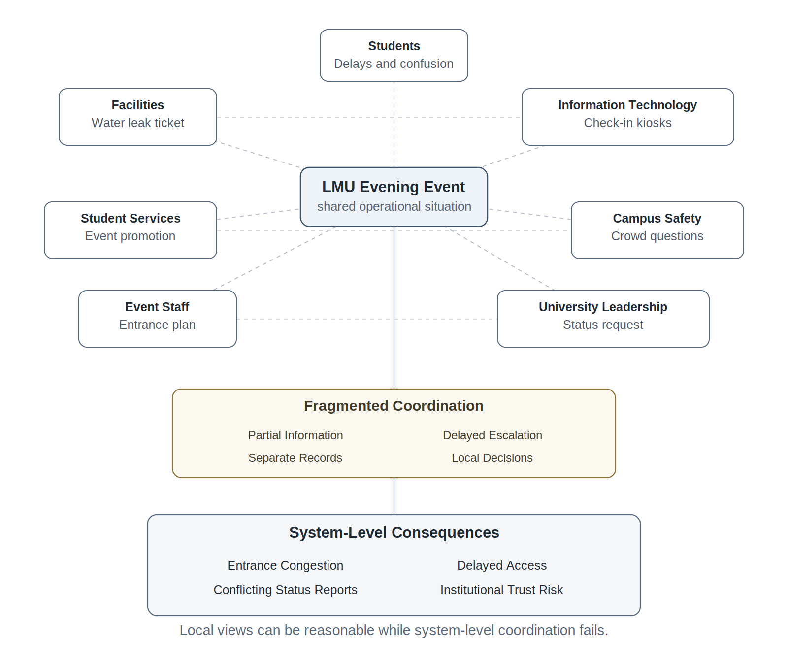
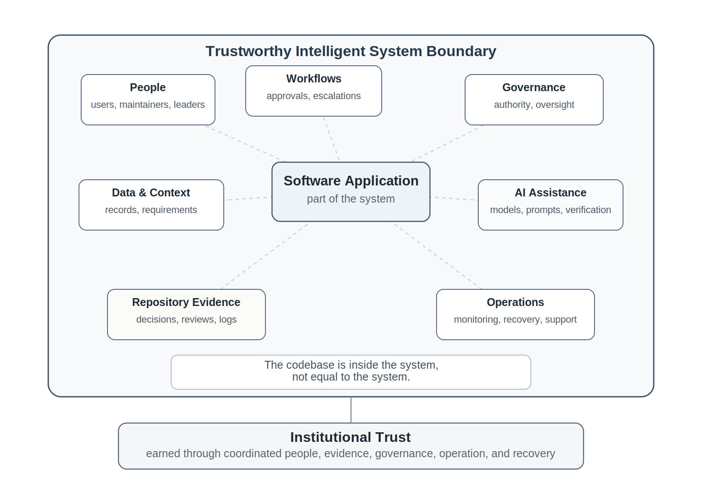
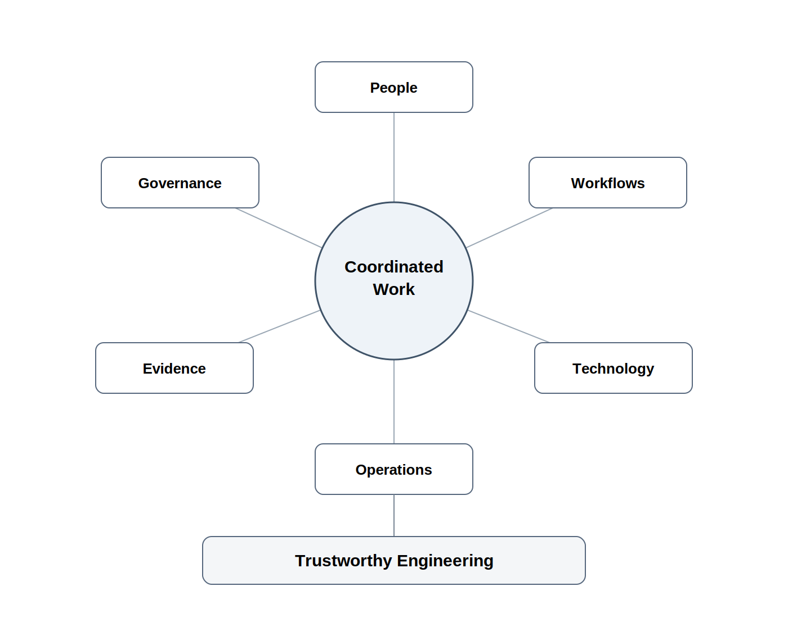
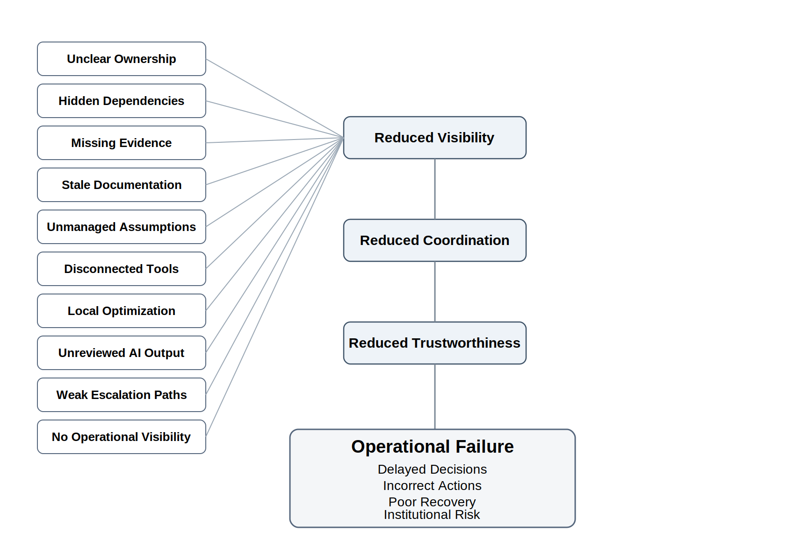

# Chapter 3 Complexity, Coordination, and Sociotechnical Systems

### Engineering Doctrine

> The system is larger than the code.

### Opening Scenario: Everyone Did Their Job — and the System Still Failed

At 4:17 p.m. on a cold Thursday afternoon, a facilities technician at Lakeside Metropolitan University opened a maintenance ticket about a water leak near the north entrance of the student center. The leak was not catastrophic. It was not dramatic. It looked like the kind of issue that would be handled routinely by the facilities team: inspect the area, place temporary signage, call building operations, and schedule repair.

By 5:05 p.m., the same entrance was becoming crowded. A student organization was setting up for a large evening event. Student Services had promoted the event for weeks. Campus Safety had assigned one officer to the building, assuming normal traffic. IT had arranged temporary check-in kiosks near the lobby. Event staff expected the north entrance to serve as the primary access point. Facilities had placed a caution sign near the wet floor but had not yet escalated the ticket because, from their perspective, the issue was contained.

By 5:40 p.m., the situation had changed. Students were backing up outside. The lobby was congested. The check-in kiosks had been moved away from the entrance but no one had updated the event plan. Campus Safety was receiving questions from students and parents. Student Services was receiving complaints through email and social media. Facilities was still treating the matter as a building maintenance issue. IT saw kiosk delays but did not know they were connected to the facilities ticket. Leadership wanted a status update and received three different explanations from three different units.

No one was lazy. No one ignored the problem. No single software defect caused the failure. Each group acted reasonably within its own local view of the situation.

That was the problem.

The university did not lack activity. It lacked coordination. It did not lack data. It lacked shared operational visibility. It did not lack systems. It lacked a trustworthy system of work across people, workflows, evidence, authority, and response.

This is where software engineering begins to look very different from coding.

A programmer might ask, “What application should we build?”

A software engineer must ask, “What system of people, decisions, workflows, evidence, permissions, reviews, and operational consequences are we changing?”

The distinction matters. Modern software systems rarely fail only because one function returns the wrong value. They fail because teams misunderstand intent, requirements drift, assumptions remain invisible, tools do not connect, authority is unclear, decisions are not reviewable, operational behavior cannot be observed, or AI-generated output is trusted before it is verified.

Software engineering is the discipline of coordinating that complexity.

*Figure 3.1 — LMU Fragmented Coordination Map*

---

## 3.1 Why Complexity Is More Than Code

It is tempting to describe software complexity in technical terms: number of modules, size of codebase, number of interfaces, depth of dependencies, volume of data, concurrency, performance, security, and deployment complexity. These matter. A system with tangled dependencies, weak boundaries, and unclear interfaces becomes difficult to reason about and dangerous to change.

But technical complexity is only one part of the engineering problem.

The larger complexity is sociotechnical. Software lives inside organizations. It changes how people work, how decisions are made, how authority is exercised, how information moves, how errors surface, how responsibility is assigned, and how trust is gained or lost.

A small change in code can create a large operational consequence if it changes a workflow that many people depend on. A simple automation can become dangerous if it bypasses an approval step. A helpful AI summary can become risky if users treat it as verified truth. A new dashboard can create false confidence if the data is stale, incomplete, or misunderstood. A release can appear successful in a demo while still being unobservable, ungovernable, and difficult to recover when something goes wrong.

Complexity is not just what the software does. Complexity is what must be coordinated for the software to be trusted.

That coordination includes several overlapping forms of complexity.

Technical complexity appears in code, data structures, APIs, services, integrations, infrastructure, tests, builds, deployments, and dependencies.

Organizational complexity appears in teams, roles, authority, communication paths, priorities, staffing limits, institutional policies, and approval structures.

Workflow complexity appears in handoffs, exceptions, escalations, deadlines, customer expectations, local procedures, and informal workarounds.

Data complexity appears in ownership, quality, timeliness, privacy, lineage, source-of-truth conflicts, and interpretation.

Governance complexity appears in permissions, approvals, auditability, compliance exposure, human oversight, and delegated authority.

Operational complexity appears after the system is running: failures, incidents, monitoring gaps, ambiguous symptoms, rollback decisions, user impact, support burden, and institutional trust.

AI-era complexity adds another layer. AI can generate code, plans, requirements, tests, summaries, designs, explanations, and recommendations quickly. That speed can help engineering teams. It can also multiply unverified assumptions, undocumented decisions, hidden coupling, and false confidence.

When output becomes cheap, coordination becomes more important. Evidence becomes more important. Review becomes more important. Governance becomes more important. Operational visibility becomes more important.

This is one of the central realities of software engineering in the AI era: faster artifact production does not reduce the need for engineering discipline. It raises the cost of weak discipline.

---

## 3.2 The System Is Larger Than the Code

A codebase is part of the system, but it is not the whole system.

*Figure 3.2 — The System Is Larger Than the Code*

The system includes the people who use it, the people who maintain it, the policies that constrain it, the workflows it supports, the data it consumes, the decisions it influences, the approvals it requires, the risks it introduces, the evidence it produces, and the failures it must survive.

For LMU’s Campus Operations and Incident Coordination Platform, the system is not just a web application. The system includes facilities technicians, campus safety officers, student services staff, event coordinators, IT support teams, department leaders, students, parents, approval policies, escalation paths, incident records, maintenance tickets, communication channels, logs, dashboards, and after-action reviews.

If AI is added to summarize incidents, suggest escalation levels, draft communications, classify tickets, or recommend next actions, the system also includes model behavior, context sources, prompt boundaries, output verification, permission limits, audit records, and human approval.

This is why “the model is not the system” is not a slogan. It is an engineering control principle. A model can produce text, classify requests, or suggest actions. A trustworthy intelligent system must also define where information came from, who can act on it, what authority the model has, how the output is verified, what gets logged, what can be reversed, and who owns the final decision.

A model may summarize a facilities ticket. The system determines whether that summary is shown to a student, routed to Campus Safety, escalated to leadership, stored in an incident record, or used to trigger action.

A model may recommend that an entrance be closed. The system determines whether the recommendation requires human approval, whether the recommendation is logged, whether alternate entrances are communicated, whether accessibility concerns are considered, and whether the decision can be audited later.

A model may draft a message to students. The system determines who approves it, what source data supports it, whether the message is accurate, whether it creates panic, whether it protects privacy, and whether the communication becomes part of the official event record.

Software engineering is responsible for the system, not just the generated output.

That is why the system must remain understandable. Engineers must be able to explain its boundaries, responsibilities, dependencies, risks, evidence, and failure behavior. When a system cannot be explained, reviewed, observed, governed, or recovered, it may still function — but it is not trustworthy.

---

## 3.3 Sociotechnical Systems

A sociotechnical system is a system in which technical behavior and human behavior are inseparable. The software shapes how people work, and people shape what the software means.

The same feature can succeed or fail depending on the organization around it. A ticket-routing feature may work technically but fail operationally if teams disagree about ownership. A dashboard may display correct data but fail organizationally if no one is responsible for acting on it. An approval workflow may satisfy a compliance requirement but fail practically if it causes users to create informal workarounds outside the system. An AI assistant may produce useful suggestions but fail ethically or operationally if users cannot tell whether those suggestions are verified, current, or authorized.

Sociotechnical thinking prevents engineers from pretending that software exists in isolation.

In a classroom project, this can feel abstract. In professional systems, it is unavoidable. The moment software coordinates work across people, departments, data sources, policies, or operational consequences, it becomes sociotechnical.

*Figure 3.3 — Sociotechnical System Layer Diagram*

The LMU platform is a sociotechnical system because it changes more than screens and databases. It changes who sees a problem, who owns a response, who approves an escalation, who can communicate with affected users, how evidence is recorded, how leaders understand status, and how the institution learns after failure.

This is also why software engineering cannot be reduced to individual coding productivity. A student may generate a working feature quickly. A developer may use AI to produce a large amount of code. A team may show a polished demo. None of that proves the system is coordinated, reviewable, governable, observable, or recoverable.

Trustworthy engineering requires system-level thinking.

The engineer must ask:

- Who is affected by this change?
- Who owns this decision?
- What workflow does this alter?
- What assumption does this depend on?
- What evidence supports this claim?
- What happens if the system is wrong?
- What happens if the system is right but misunderstood?
- What happens if the AI output is plausible but false?
- What happens when this fails at 8:30 p.m. and the original developer is unavailable?

Those questions are not extra. They are software engineering.

---

## 3.4 Coordination Failure Patterns

Coordination failure is one of the most common sources of software project failure. It appears when local work looks reasonable, but system-level outcomes break down.

In LMU’s event incident, Facilities saw a maintenance ticket. Student Services saw event complaints. Campus Safety saw crowding. IT saw check-in delays. Leadership saw incomplete status. Each group had part of the truth. No one had the coordinated operational picture.

The same pattern appears inside software projects.

A developer completes a feature, but the requirement changed and no one updated the acceptance criteria.

A team adds AI-generated code, but no one records what was generated, what was modified, what was rejected, or how the result was verified.

A pull request passes automated checks, but the tests do not cover the actual workflow risk.

An architecture decision is discussed in a meeting, but never recorded in an ADR, so the rationale disappears.

A release note says “known limitations exist,” but no owner, severity, mitigation, or follow-up issue is listed.

A demo works, but no one can show the evidence chain from requirement to issue to branch to pull request to test to release claim.

These failures are not always dramatic. Many look professional from a distance. Documents exist. Meetings happened. Code was written. Tests passed. Dashboards were shown. But the system remains weak because the evidence is fragmented, stale, or disconnected from actual engineering decisions.

Several failure patterns recur.

Unclear ownership occurs when work exists but responsibility does not. Someone assumes another person owns the requirement, risk, defect, approval, test, or release decision.

Hidden dependencies occur when one part of the system depends on another team, service, workflow, data source, or policy that is not visible in planning or architecture.

Missing evidence occurs when engineering claims are made without inspectable proof. “It works” is not evidence. “AI helped write it” is not evidence. “We reviewed it” is not evidence unless the review can be inspected.

Stale documentation occurs when documents exist but no longer describe the system being built or operated.

Unmanaged assumptions occur when teams proceed as if uncertain facts are true: users will behave a certain way, data will arrive on time, approvals will happen quickly, AI output will be accurate, or failures will be obvious.

Disconnected tools occur when requirements, code, issues, tests, documents, AI-use records, and release notes live in separate places with no evidence chain connecting them.

Local optimization occurs when a team improves its own workflow while making the larger system harder to operate, govern, or understand.

Unreviewed AI output occurs when generated material enters the system without human verification, architectural review, testing, or disclosure.

Weak escalation paths occur when the system detects or records a problem but does not make clear who must act, when to escalate, or what authority is required.

No operational visibility occurs when the system cannot explain what is happening after execution: no logs, no request IDs, no meaningful status, no defect history, no runtime evidence, no owner.

These are engineering failures. They are not merely management problems. A trustworthy engineer designs against them.

*Figure 3.4 — Coordination Failure Chain*

---

## 3.5 Anti-Pattern: Local Success, System Failure

The core anti-pattern for this chapter is local success, system failure.

This occurs when each person, team, component, or tool appears to succeed in isolation, while the larger system fails because coordination, evidence, authority, or operational visibility is weak.

A developer completes a task, but the wrong requirement was implemented.

A model produces a confident answer, but no one verifies the source.

A test suite passes, but the tests do not represent real operational risk.

A team completes a document, but the document does not influence decisions.

A dashboard looks polished, but the data is incomplete.

A release is approved, but no one owns the known limitations.

Local success is dangerous because it creates evidence fragments that look reassuring. The team can point to activity: commits, documents, generated code, meetings, demos, tickets, tests, and screenshots. But trustworthy engineering requires more than activity. It requires connected, current, reviewable, honest evidence.

Local success becomes system failure when the evidence chain breaks.

This anti-pattern connects directly to several larger engineering anti-patterns.

Demo theater appears when the presentation is polished but operational proof is weak.

Process theater appears when artifacts exist but do not shape engineering decisions.

Fake traceability appears when documents claim relationships that are not actually connected through issues, commits, reviews, tests, and release evidence.

Synthetic productivity appears when AI-generated output creates the appearance of rapid progress without understanding, verification, maintainability, or architecture fit.

Unowned risk appears when known limitations, defects, dependencies, or governance concerns lack owners and next actions.

A mature team does not eliminate complexity. It makes complexity visible enough to coordinate.

---

## 3.6 Why AI Increases the Coordination Burden

AI changes the economics of software work. It can generate code, documentation, requirements, tests, diagrams, plans, summaries, and explanations faster than teams could produce them manually. Used well, this is powerful. It can help teams explore alternatives, improve drafts, generate test ideas, identify edge cases, and accelerate routine work.

But AI does not remove engineering responsibility. It shifts the bottleneck.

Before AI assistance, a team might struggle to produce enough artifacts. With AI assistance, a team may produce more artifacts than it can understand, review, test, govern, or maintain.

That is not progress. That is synthetic productivity.

The danger is not that AI is useless. The danger is that AI can make weak engineering look mature. It can produce convincing requirements that were never validated. It can generate architecture prose that does not match the actual system. It can write tests that pass without testing meaningful risk. It can create code that works in the simple case while hiding security, performance, recoverability, or maintainability issues. It can summarize decisions that were never actually made.

AI output is proposed engineering material, not verified engineering truth.

That sentence must become a professional instinct.

The coordination burden increases because teams must now coordinate not only human work, but also generated work. They must know what AI produced, what humans accepted, what humans rejected, what changed, what was verified, and what risk remains.

A team using AI responsibly should be able to answer:

- What was AI used for?
- What source context was provided?
- What output was accepted?
- What output was rejected?
- What did humans modify?
- What tests or reviews verified the result?
- What risk remains?
- Who owns the final decision?

If the team cannot answer these questions, AI has not reduced complexity. It has hidden complexity.

This is especially important when AI moves from suggesting information to influencing action. A wrong answer is a quality problem. A wrong action can become a governance problem, operational problem, security problem, compliance problem, or trust problem.

If an AI assistant drafts a meeting summary, the risk may be low. If it routes an emergency incident, changes a student-facing status, modifies permissions, sends official communication, or triggers a workflow, the risk changes. The system must then define authority, approvals, logs, rollback, monitoring, and human oversight.

Engineering teams must avoid both extremes. They should not reject AI reflexively. They should not trust it blindly. They should evaluate AI delegation based on risk, coupling, observability, recoverability, governance impact, compliance exposure, and business trust implications.

The mature posture is simple:

AI may accelerate work. Engineers remain accountable for the system.

---

## 3.7 Repository Evidence as Coordination Infrastructure

The repository is often introduced to students as a place to store code. That is too small.

In trustworthy engineering, the repository is coordination infrastructure. It is the engineering system of record. It is where work becomes visible, reviewable, traceable, and accountable.

The repository should help another engineer answer:

- What problem is this system solving?
- What changed?
- Why did it change?
- Who requested it?
- Who implemented it?
- Who reviewed it?
- What requirement does it support?
- What tests or validation evidence exist?
- What AI assistance was used?
- What risks remain?
- What is ready for release?
- What is not ready?
- What happens if it fails?

This is why repository-centered engineering matters. It is not merely about using GitHub correctly. It is about making engineering coordination inspectable.

A requirement that never connects to an issue is weak evidence.

An issue that never connects to a branch or pull request is weak evidence.

A pull request with no review is weak evidence.

A review with no tests or risk discussion is weak evidence.

A release note with no known limitations is weak evidence.

An AI-use log with vague entries is weak evidence.

A demo with no evidence chain is weak evidence.

The canonical evidence chain is straightforward:

Requirement → issue → branch → commit → pull request → review → tests → CI/CD evidence → release note → operational evidence → defect or postmortem learning.

This chain is not bureaucracy. It is memory. It is coordination. It is how the system remains understandable after the original conversation is forgotten.

In the LMU platform, imagine a feature that automatically escalates facilities-related incidents affecting student events. A trustworthy repository would not merely contain code for the escalation logic. It would contain the requirement, the issue describing the workflow need, the branch where the work was implemented, the pull request review, the architecture decision explaining escalation boundaries, the test evidence for normal and exception cases, the AI-use log if AI assisted the implementation, the release note describing limitations, and eventually the operational evidence showing whether escalation worked as intended.

Without that evidence, the team has a feature. With that evidence, the team has an engineering record.

Chapter 9 will examine repository-centered engineering directly. For now, the key point is this: when systems become complex, the repository becomes one of the primary ways teams coordinate reality.

---

## 3.8 Engineering Judgment Under Complexity

Complexity cannot be eliminated. It must be governed.

Engineering judgment is the ability to make responsible decisions when the answer is not obvious, information is incomplete, tradeoffs are real, and consequences matter.

In simple programming exercises, the goal is often clear: implement the function, pass the tests, produce the expected output. Professional systems are different. Requirements are incomplete. Users disagree. Data is messy. Dependencies fail. Policies constrain design. Security matters. Teams are overloaded. AI output may be plausible but wrong. Operational failures occur under time pressure.

The engineer’s job is not to pretend certainty exists. The engineer’s job is to make uncertainty visible, bounded, reviewable, and manageable.

This requires different questions than coding alone.

What system are we really changing?

A feature rarely changes only code. It may change workflow, authority, data ownership, user expectations, operational support, and institutional risk.

Who depends on this?

Dependencies include users, teams, services, policies, data sources, schedules, support staff, and downstream systems.

What assumptions are we making?

Every plan contains assumptions. Mature teams identify them before they become hidden failure points.

What evidence supports this claim?

Confidence is not evidence. Activity is not evidence. A working path is not evidence of operational trust. Evidence must be inspectable.

What could fail silently?

Some failures announce themselves. Others hide: stale data, incorrect summaries, missed escalations, permission drift, unreviewed AI output, partial outages, misleading dashboards.

Who owns the outcome?

Trustworthy systems require named ownership. If everyone is responsible in general, no one may be responsible in practice.

What happens after the demo?

The demo shows a path. Operations reveal the system. A mature team thinks beyond presentation day.

These questions are not academic overhead. They are professional protection against fragile systems.

---

## 3.9 Review Board Lens: Coordination Review

Review is an engineering safety mechanism. It is how teams challenge assumptions before weak coordination becomes operational failure.

For Chapter 3, the review lens is a Coordination Review. This is not yet a full architecture review, release readiness review, governance review, operational readiness review, or AI oversight review. Those will mature later. The purpose here is simpler: can the team explain the system of work well enough for another engineer to understand, challenge, and improve it?

A Coordination Review asks:

- Are ownership boundaries clear?
- Are dependencies visible?
- Are assumptions documented?
- Are communication paths explicit?
- Are approval paths known?
- Are AI-assisted outputs disclosed?
- Are decisions recorded in a durable place?
- Is repository evidence current?
- Can another team understand the work without private explanation?
- What risks remain unowned?

This type of review is especially useful early in a project. Teams often want to begin building immediately. That instinct is understandable. Building feels productive. But building before coordination is understood often produces rework, confusion, hidden risk, and unreviewable decisions.

The point of a Coordination Review is not to slow the team down. It is to prevent speed from becoming waste.

---

## 3.10 Trustworthiness Mapping

Chapter 3 strengthens several trustworthiness pillars.

Traceability is strengthened because complexity requires evidence chains. Teams must be able to connect requirements, decisions, work items, reviews, tests, releases, and operational learning.

Reviewability is strengthened because sociotechnical systems must be inspectable by humans. If another engineer cannot understand the system, the system is not professionally controlled.

Accountability is strengthened because coordination requires ownership. Risks, approvals, decisions, limitations, and operational outcomes need named responsibility.

Operational Visibility is strengthened because local work is not enough. Teams need shared visibility into status, dependencies, runtime behavior, and unresolved risk.

Human Oversight is strengthened because AI-assisted and action-capable systems require meaningful human review, control, approval, and ownership.

Correctness, governability, and recoverability also appear in this chapter, but they will deepen later. Correctness matters because the system must behave as intended. Governability matters because authority and approvals must be controlled. Recoverability matters because complex systems fail and must be corrected. But Chapter 3’s primary contribution is mental model change: the reader must now see software engineering as coordinated sociotechnical work.

---

## 3.11 Exercises

### Exercise 1: Diagnose a Coordination Failure

Return to the LMU student-center incident described in the chapter.

Identify at least five coordination failures.

For each failure:

- Describe what happened.
- Identify the parties involved.
- Explain why the failure occurred.
- Classify the failure as involving:
  - Ownership
  - Dependency visibility
  - Communication
  - Evidence
  - Workflow design
  - Operational visibility
  - Governance

Discuss which coordination failure appears most significant and why.

### Exercise 2: Map a Sociotechnical System

Create a simple system map for the LMU Campus Operations and Incident Coordination Platform (COICP).

Include at least:

- Four stakeholder groups
- Three workflows
- Two information sources
- One approval boundary
- One operational risk
- One example of engineering evidence

Explain how the stakeholders, workflows, and information interact.

Identify where misunderstandings or coordination breakdowns might occur.

### Exercise 3: Challenge a Readiness Claim

A team claims that its new escalation feature is ready because it worked during a demonstration.

Evaluate the claim.

Identify:

- Questions that should be asked
- Evidence that should be examined
- Risks that may remain hidden
- Assumptions that may not have been validated

Explain why successful demonstrations and trustworthy operation are not necessarily the same thing.

### Exercise 4: Review an AI-Generated Plan

An AI assistant generates a plan for routing campus incidents to the appropriate department.

Identify at least six assumptions that should receive human review before implementation.

Consider areas such as:

- Data quality
- Workflow ownership
- Approval authority
- Exception handling
- Operational visibility
- User impact

Discuss the risks of accepting the plan without further analysis.

### Exercise 5: Develop Coordination Review Questions

A team proposes adding AI-generated incident summaries to the LMU platform.

Write ten Coordination Review questions that should be discussed before implementation.

Include questions addressing:

- Human oversight
- Communication
- Responsibility
- Evidence
- User impact
- Operational consequences

Explain why each question is important.

### Exercise 6: Analyze Local Success and System Failure

Describe a situation in which:

- A team succeeds,
- A tool succeeds, or
- A component succeeds,

while the larger system still fails.

Explain:

- Why local success did not produce system success
- What signals might reveal the problem
- What coordination activities could reduce the risk

Discuss why systems must be evaluated as wholes rather than as collections of isolated parts.

---

## 3.12 Operational Takeaways

The codebase is not the system.

Complexity is what must be coordinated for software to be trusted.

Sociotechnical systems fail when technical work and human work are treated separately.

Local success can still produce system failure.

AI can accelerate output while increasing coordination burden.

Repository evidence is coordination infrastructure.

Review is not bureaucracy; it is how teams challenge assumptions before reality does.

Trustworthy engineering makes ownership, evidence, risk, and operational consequences visible.

---

## 3.13 Closing: From Complexity to Lifecycle

Software engineering begins when we stop treating software as isolated code and start treating it as a coordinated system of people, workflows, evidence, authority, technology, and operational consequence.

That shift changes everything.

It changes how teams define requirements. It changes how they plan. It changes how they use AI. It changes how they review work. It changes how they release software. It changes how they respond to failure. It changes what it means to be professionally accountable.

Chapter 3 has established the core problem: modern software work is complex, coordinated, and sociotechnical. The next question is how teams should structure that work over time.

If software systems involve uncertainty, dependencies, changing requirements, human coordination, governance pressure, AI acceleration, and operational consequences, then teams need more than good intentions. They need a lifecycle strategy.

Chapter 4 turns to that problem: lifecycle models and engineering under uncertainty.

