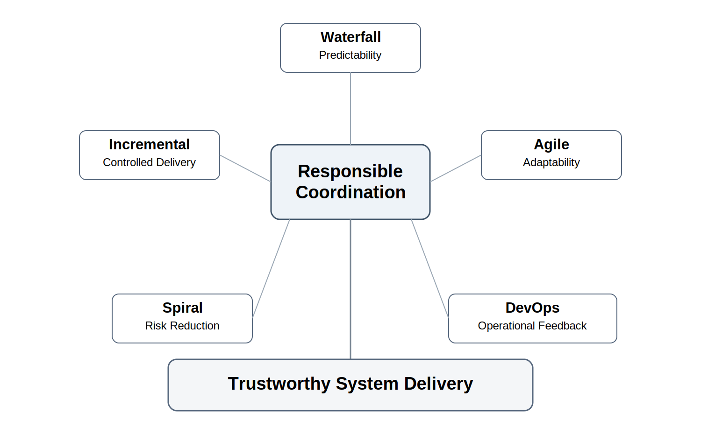
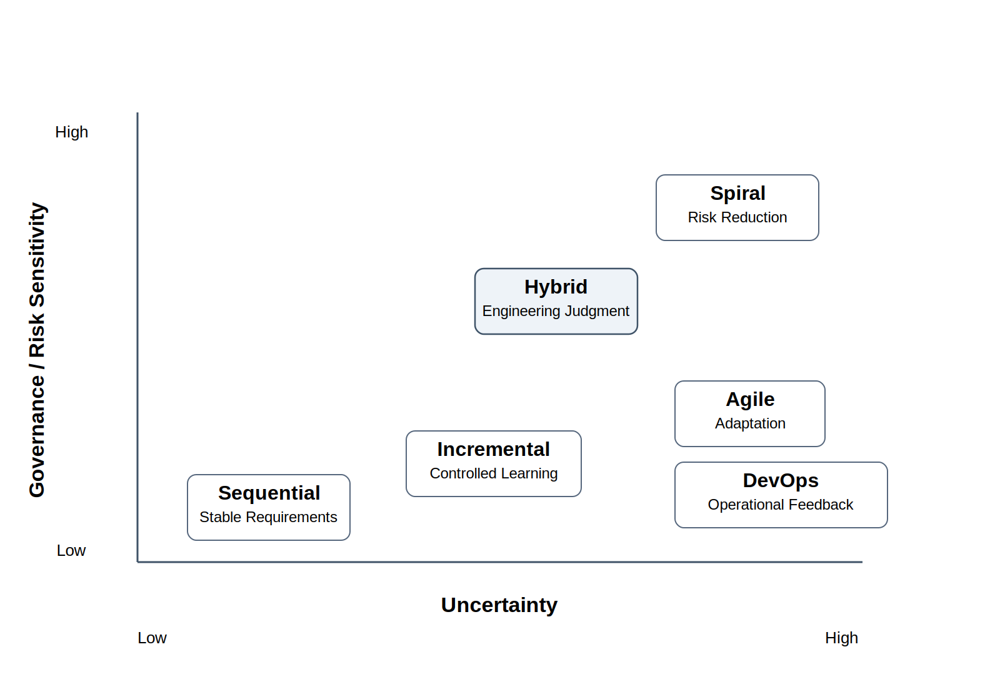
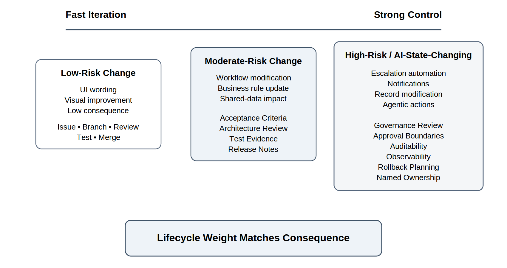
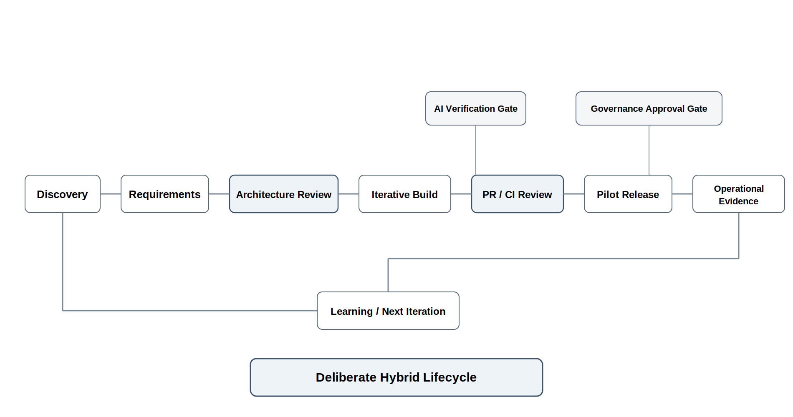

# Chapter 4 Lifecycle Models and Engineering Under Uncertainty
---
> The lifecycle is not the point. Responsible coordination is the point.
---

### Opening Scenario: LMU Tries to “Go Agile”

After the student center incident, Lakeside Metropolitan University (LMU) leadership wanted the Campus Operations and Incident Coordination Platform, or COICP, moving faster.

That part was reasonable. The university had real operational pain. Facilities tickets were not always visible to event teams. Campus Safety did not always know when building conditions might affect crowd movement. Student Services often learned about operational issues from complaints rather than from the systems meant to coordinate campus work. IT was tired of being asked to integrate workflows after every department had already invented its own process. Governance leaders were increasingly concerned that any AI-assisted workflow would create new approval, audit, and accountability questions.

The pressure was real. The proposed solution sounded simple.

“We need to be Agile.”

At first, everyone seemed to agree. Then they began using the same word to mean very different things.

Facilities wanted faster ticket handling.

Student Services wanted fewer surprises.

Campus Safety wanted dependable escalation.

IT wanted sustainable architecture.

The AI Governance Officer wanted clear boundaries on automation and approval.

Leadership wanted progress visibility.

Students wanted the system to work when they needed it.

One group thought Agile meant faster delivery. Another thought it meant fewer documents. Another thought it meant daily meetings. Another thought it meant building first and deciding later. Another worried it meant skipping the reviews that were necessary for safety, privacy, accessibility, and institutional accountability.

The COICP team had not yet chosen a lifecycle model. It had discovered something more important: the lifecycle question was not a vocabulary contest.

The question was not, “Are we Agile?”

The question was, “What lifecycle strategy helps LMU manage uncertainty, coordinate evidence, govern risk, and deliver trustworthy increments?”

That is the question this chapter answers.

*Figure 4.1 — Lifecycle Models as Coordination Strategies*

---

## 4.1 Why Lifecycle Models Exist

Software work unfolds over time. That may sound obvious, but it is the reason lifecycle models exist.

Teams do not receive perfect requirements, produce perfect designs, implement perfect code, verify everything completely, release without risk, and then operate without surprises. Real engineering does not work that way.

Requirements change. Stakeholders learn as they see working systems. Risks emerge late. Dependencies shift. Integrations behave differently than expected. Data quality is worse than assumed. Governance questions appear when workflows become real. Security and privacy concerns sharpen when systems touch actual users. Operational failures reveal what teams did not know they needed to observe. AI-generated work can accelerate progress while introducing assumptions no one noticed.

A lifecycle model is a way of organizing engineering uncertainty over time.

That is the most important sentence in this chapter.

A lifecycle model helps a team decide when to discover, when to design, when to build, when to review, when to test, when to release, when to stabilize, when to govern, and when to learn. It creates a coordination structure so that engineering work does not become a pile of disconnected activity.

A lifecycle model should help answer questions such as:

- How do we learn what users actually need?
- When do we freeze enough scope to build responsibly?
- When do we need architecture review?
- When is fast iteration safe?
- Where do we need formal approval?
- What evidence proves progress?
- What evidence proves readiness?
- How do we manage defects and known limitations?
- How do we respond when assumptions fail?
- How do we incorporate operational learning into the next cycle?

A lifecycle model is not valuable because it has a famous name. It is valuable only if it helps a team coordinate real engineering work under uncertainty.

This is why process labels alone are weak evidence. Saying “we use Agile” does not prove the team responds to feedback. Saying “we use Waterfall” does not prove the team understands requirements. Saying “we use DevOps” does not prove the system is observable or recoverable. Saying “we use AI” does not prove the team is faster in any trustworthy sense.

The lifecycle is not the point. The point is responsible coordination.

---

## 4.2 The False Debate: Waterfall, Agile, DevOps, and Everything In Between

Software engineering discussions often turn lifecycle models into ideology.

Waterfall is treated as old and bad.

Agile is treated as modern and good.

DevOps is treated as maturity by default.

Hybrid approaches are treated either as practical or confused, depending on who is speaking.

This is the wrong conversation.

A sequential lifecycle can be responsible when requirements are stable, approval gates matter, regulatory evidence is important, integration costs are high, or late changes are expensive. It can be irresponsible when it hides uncertainty, delays feedback, or pretends early documents are more accurate than they really are.

An iterative lifecycle can be responsible when teams need learning, feedback, and staged delivery. It can be irresponsible when iterations become feature churn without architecture, traceability, test discipline, or release judgment.

An Agile or Scrum-style lifecycle can be responsible when teams use short cycles to surface learning, manage scope, inspect work, and adapt based on evidence. It can be irresponsible when ceremonies replace engineering judgment, velocity becomes theater, and teams use Agile language to avoid architecture, documentation, or governance.

A DevOps-oriented lifecycle can be responsible when it connects delivery, automation, operations, observability, and learning. It can be irresponsible when speed outruns verification, governance, security, recoverability, or human oversight.

A hybrid enterprise lifecycle can be responsible when different parts of the system require different coordination patterns. It can be irresponsible when “hybrid” means no one knows what process is actually being followed.

The professional question is not which lifecycle label is fashionable.

The professional question is: what uncertainty must be managed, what evidence must be produced, what review must occur, what governance is required, and what operational consequences must be controlled?

A methodology is useful only when it helps answer those questions.

---

## 4.3 Lifecycle Models as Tradeoff Structures

Every lifecycle model makes tradeoffs. It emphasizes some risks while exposing the team to others.

Sequential approaches emphasize upfront definition, staged approval, and planned progression. They can help when change is expensive and review gates are important. Their danger is that teams may defer learning until too late.

Iterative approaches emphasize learning through repeated cycles. They can help when requirements are uncertain or user feedback matters. Their danger is that teams may keep adding features without strengthening architecture, evidence, or operational maturity.

Agile approaches emphasize adaptation, team communication, working increments, and stakeholder feedback. They can help teams avoid large late surprises. Their danger is that teams may confuse activity, ceremonies, or velocity with engineering maturity.

Spiral and risk-driven approaches emphasize identifying and reducing risk as the project progresses. They can help when uncertainty is high and consequences are significant. Their danger is that risk analysis can become detached from delivery if not connected to actual decisions and evidence.

DevOps and continuous delivery approaches emphasize automation, frequent release, operational feedback, and learning from production. They can help teams close the gap between development and operations. Their danger is that automation can create false confidence if testing, observability, governance, rollback, and accountability are weak.

Hybrid approaches combine lifecycle strategies because real organizations often have mixed needs. A team may use iterative discovery for user workflows, formal architecture review for integration boundaries, pull-request review for code changes, release-readiness review before pilots, and governance review before AI-enabled actions. Their danger is unmanaged complexity: everyone thinks a process exists, but no one can explain it clearly.

*Figure 4.2 — Uncertainty-to-Lifecycle Fit Map*

The best lifecycle is not the one with the most modern vocabulary. The best lifecycle is the one whose tradeoffs fit the work.

For the LMU platform, a pure approach would be weak. The team needs learning because workflows are uncertain. It needs architecture discipline because systems must integrate. It needs governance because authority, privacy, and AI-assisted actions matter. It needs operational evidence because the platform affects campus operations. It needs release discipline because a polished demonstration does not prove the system can survive real use.

That combination points toward a deliberately designed hybrid lifecycle.

Not hybrid by accident. Hybrid by engineering judgment.

---

## 4.4 Categories of Uncertainty

A team cannot choose a responsible lifecycle until it understands the uncertainty it faces.

Uncertainty is not one thing. It comes in categories, and different categories require different lifecycle responses.

Requirements uncertainty appears when the team does not yet know exactly what users need, what problem matters most, or how success should be measured. Iteration, user feedback, prototypes, interviews, and acceptance criteria help reduce this uncertainty.

User-workflow uncertainty appears when the team does not understand how work actually happens. The official process may differ from the real process. Users may rely on informal shortcuts, email chains, spreadsheets, phone calls, or tacit knowledge. Workflow mapping, observation, scenario analysis, and stakeholder review help reduce this uncertainty.

Technical uncertainty appears when the team does not know whether a technical approach will work. This may involve performance, reliability, scalability, APIs, data structures, third-party services, or unfamiliar frameworks. Spikes, prototypes, architecture review, technical experiments, and risk-focused tests help reduce this uncertainty.

Integration uncertainty appears when the system must connect to other systems, teams, data sources, or workflows. Interfaces may be poorly documented. Dependencies may change. Ownership may be unclear. Integration plans, interface contracts, mock services, dependency reviews, and staged integration help reduce this uncertainty.

Data uncertainty appears when the team does not know whether the data is accurate, complete, timely, governed, or appropriate for the intended use. Data profiling, source-of-truth analysis, lineage documentation, validation rules, privacy review, and error handling help reduce this uncertainty.

AI-output uncertainty appears when AI-generated or AI-assisted work may be plausible but wrong, incomplete, biased, stale, insecure, or misaligned with the system context. Verification, review, test generation, adversarial examples, human approval, and AI-use logging help reduce this uncertainty.

Governance uncertainty appears when authority, permissions, approvals, audit expectations, compliance exposure, or policy boundaries are unclear. Governance review, role definition, approval gates, audit logging, and human oversight help reduce this uncertainty.

Operational uncertainty appears when the team does not yet know how the system will behave after release. Will failures be visible? Can support staff diagnose issues? Are logs useful? Can a bad release be rolled back? Observability planning, pilot releases, runbooks, release notes, incident review, and postmortems help reduce this uncertainty.

Organizational uncertainty appears when priorities, staffing, ownership, communication paths, or decision authority are unstable. Team charters, role definitions, stakeholder maps, planning reviews, and escalation rules help reduce this uncertainty.

Release-readiness uncertainty appears when the team is unsure whether the system is responsibly releasable. Test evidence, defect status, known limitations, risk registers, CI/CD evidence, release notes, demo scripts, rollback planning, and review-board approval help reduce this uncertainty.

These categories matter because they prevent teams from using a single process answer for every engineering problem.

If requirements are uncertain, the team needs feedback.

If architecture is risky, the team needs review.

If governance is unclear, the team needs authority boundaries.

If operations are uncertain, the team needs observability and recovery planning.

If AI output is involved, the team needs verification and disclosure.

Lifecycle strategy begins with uncertainty diagnosis.

---

## 4.5 Matching Lifecycle Strategy to Risk

Not all work requires the same lifecycle weight.

A low-risk user-interface wording change does not need the same review burden as an AI-assisted escalation workflow that can notify Campus Safety, change incident status, or trigger official communication.

A contained visual improvement may move quickly if it is easy to inspect, easy to reverse, and low consequence. A workflow that modifies durable records, affects student services, exposes private data, or creates institutional obligations requires stronger control.

The more consequential the failure, the stronger the evidence, review, governance, and operational readiness burden.

This does not mean every project should become slow. It means speed must be matched to risk.

Low-risk work may use lightweight iteration: issue, branch, small pull request, basic review, quick test, and merge.

Moderate-risk work may require clearer acceptance criteria, architecture fit review, test evidence, AI-use disclosure, and release note updates.

High-risk work may require formal review gates, approval boundaries, security review, governance review, observability planning, rollback thinking, and named ownership.

Agentic or state-changing AI work requires even more discipline. If software can call tools, modify records, send notifications, approve actions, escalate incidents, or affect business state, the lifecycle must include permissions, audit trails, human-in-the-loop approval where appropriate, rollback or compensation paths, monitoring, and release-gate review.

*Figure 4.3 — Fast Iteration vs Strong Control*

This is where lifecycle thinking connects directly to AI governance. The issue is not whether AI is allowed. The issue is what role AI plays, what risk its output creates, and what verification burden follows.

AI can assist with drafting, summarizing, test ideation, documentation, and contained code generation. That may be reasonable when human review is strong and the failure domain is limited. AI should not silently acquire authority to make consequential changes that humans cannot explain, control, audit, revoke, or recover from.

Lifecycle strategy must make those boundaries visible.

A responsible lifecycle does not merely say when work happens. It says when work must be reviewed, when evidence must exist, when authority is required, when uncertainty must be reduced, and when release is not yet justified.

---

## 4.6 Lifecycle and Repository Evidence

A lifecycle model that does not leave evidence is only a story about how the team thinks it works.

This is a hard but necessary standard.

Teams often describe their process in confident language. They say they planned, discussed, reviewed, tested, iterated, or released. Those words are weak unless another engineer can inspect the evidence.

A lifecycle becomes professionally meaningful when it produces an evidence trail.

Requirements should produce acceptance criteria, assumptions, open questions, and traceability.

Planning should produce scope decisions, task breakdowns, estimates, risk registers, schedules, commitments, and re-estimation when reality changes.

Architecture work should produce diagrams, component responsibilities, interface decisions, data-context notes, governance boundaries, and ADRs.

Implementation should produce issues, branches, commits, pull requests, review comments, tests, and CI/CD evidence.

AI-assisted work should produce AI-use records: what tool was used, for what task, what output was accepted, what was rejected, what humans modified, how the result was verified, and what risk remains.

Release work should produce release notes, known limitations, defect status, demo paths, traceability summaries, and readiness decisions.

Operational work should produce runtime evidence, logs, metrics, incidents, postmortems, mitigations, and learning updates.

This is why the repository matters. It turns lifecycle claims into inspectable engineering memory.

The repository should not merely store the final result. It should preserve how the team moved from uncertainty to decision, from decision to change, from change to review, from review to evidence, from evidence to release, and from release to learning.

For the LMU platform, a lifecycle strategy memo should not live only in a meeting discussion. It should become an artifact. It should explain what uncertainty the team faces, what lifecycle approach it selected, where feedback loops exist, where review gates exist, what evidence will be produced, how AI use will be controlled, and how operational learning will feed the next cycle.

That does not require heavyweight bureaucracy. It requires honest engineering memory.

Everything important leaves evidence.

---

## 4.7 LMU Evolution: A Deliberate Hybrid Lifecycle

The COICP team eventually stops asking whether the project is “Agile” and starts designing a lifecycle that fits the work.

They choose a deliberate hybrid lifecycle.

For user workflows, they use iterative discovery. Facilities, Campus Safety, Student Services, IT, and event coordinators do not all understand the problem the same way. The team needs feedback cycles, scenario walkthroughs, and early prototypes to learn how coordination actually happens.

For architecture, they use review gates before major integration decisions. The system will touch incident records, facilities workflows, campus communications, and eventually AI-assisted routing or summaries. The team cannot allow architecture to emerge accidentally from implementation speed or AI-generated suggestions.

For implementation, they use issue-linked branches, pull requests, reviews, automated checks, and evidence updates. Work should not disappear into private conversations, direct commits, or disconnected documents.

For AI-assisted work, they use explicit AI-use logging and verification. AI may help draft requirements, summarize workflows, generate test cases, or propose code. But generated output remains proposed engineering material until humans review, test, and own it.

For pilot release, they use release-readiness review. A demo is not enough. The team must show what works, what was tested, what limitations remain, what defects are known, what risks are accepted, and what operational evidence will be collected.

For governance-sensitive features, they use approval review. AI-assisted escalation, student-facing communications, safety-related routing, and changes to durable incident records require stronger authority boundaries.

For operations, they use runtime evidence and learning loops. The pilot should produce logs, issue reports, user feedback, incident notes, defect records, and postmortem learning that shape the next iteration.

*Figure 4.4 — LMU Hybrid Lifecycle for COICP*

This lifecycle is not pure. That is not a weakness. It is honest.

LMU is not a startup building an isolated app. It is an enterprise-like institution with departments, policies, legacy workflows, safety concerns, privacy expectations, staffing constraints, and institutional trust at stake.

The lifecycle must fit that reality.

---

## 4.8 Lifecycle Strategy Memo

A useful artifact for this chapter is the Lifecycle Strategy Memo.

The purpose of this memo is not to produce process theater. The purpose is to make the team’s lifecycle reasoning visible.

A strong Lifecycle Strategy Memo should include:

- project context,
- uncertainty profile,
- selected lifecycle approach,
- rationale for the approach,
- feedback loops,
- review gates,
- evidence expectations,
- AI-use controls,
- governance checkpoints,
- release-readiness criteria,
- operational learning loop,
- and conditions that would cause the lifecycle to change.

For LMU, the memo might say:

The COICP project will use iterative discovery for workflows, structured architecture review for integration boundaries, issue-linked implementation through pull requests, release-readiness review before pilot deployment, governance review before AI-assisted escalation, and operational evidence review after pilot use.

That sentence is more valuable than saying, “We are Agile.”

It explains how the team intends to coordinate uncertainty.

A lifecycle strategy is not a permanent contract. It should evolve as the project learns. But changes should be deliberate. If the team changes its lifecycle because risk has changed, stakeholders have learned, governance exposure has increased, or operational evidence reveals a new need, that is mature. If the team changes its lifecycle because discipline is inconvenient, that is drift.

The Lifecycle Strategy Memo should help future reviewers understand not only what process the team followed, but why that process fit the engineering situation.

---

## 4.9 AI Pressure on Lifecycle Models

AI changes lifecycle pressure.

It can compress the time between idea and artifact. A team can use AI to draft requirements, generate user stories, produce code, suggest tests, create diagrams, summarize meetings, write documentation, and propose release notes. Work that once took days may appear in minutes.

That speed is useful only if the team can still understand, verify, review, govern, and maintain the output.

AI does not eliminate lifecycle discipline. It makes lifecycle discipline harder to fake.

A team using AI may produce a requirements document quickly. But were the requirements validated? Were assumptions identified? Were stakeholders consulted? Were acceptance criteria reviewed? Were conflicts resolved?

A team using AI may produce code quickly. But does the code fit the architecture? Is it secure? Is it maintainable? Does it handle edge cases? Does it introduce hidden dependencies? Do humans understand it?

A team using AI may produce tests quickly. But do the tests check meaningful behavior? Do they reflect real risks? Do they merely confirm the generated implementation? Do they miss failure modes that matter operationally?

A team using AI may produce documentation quickly. But is it accurate? Does it match the system? Does it describe decisions that were actually made? Does it create false confidence?

AI acceleration can distort lifecycle judgment. Teams may believe they are farther along because artifacts exist. But artifacts are not maturity. Evidence, review, validation, governance, and operational learning are maturity.

AI also increases the need for traceability. If generated output enters the engineering record, the team should know where it came from, why it was used, what humans changed, how it was verified, and who owns the result.

This is especially important because AI can blur the boundary between exploration and commitment. A generated architecture sketch may start as brainstorming but later become the assumed design. A generated user story may start as a draft but later become treated as validated requirement. A generated test may start as a suggestion but later become the only evidence supporting a release claim.

The lifecycle must preserve those distinctions.

Exploration is not commitment.

Generated output is not verified truth.

A draft is not an approved artifact.

A passing test is not full trustworthiness.

A demo is not operational proof.

Chapter 5 will examine AI’s effect on the software lifecycle more directly. For now, the key point is this: AI increases the need for lifecycle clarity because it increases the speed and volume of engineering material that must be coordinated.

---

## 4.10 Anti-Pattern: Methodology Theater

The core anti-pattern for this chapter is methodology theater.

Methodology theater occurs when a team performs the visible rituals of a lifecycle model without producing better engineering decisions, better evidence, better coordination, or better operational outcomes.

A team can hold daily standups and still hide blockers.

A team can run sprints and still avoid risk.

A team can maintain a backlog and still lack requirements clarity.

A team can write design documents and still ignore architecture.

A team can use pull requests and still avoid meaningful review.

A team can run CI and still test the wrong things.

A team can claim DevOps maturity and still lack observability, rollback, or incident learning.

A team can use AI to move faster and still become less trustworthy.

Methodology theater is dangerous because it looks professional. It creates recognizable artifacts: boards, meetings, labels, templates, charts, generated documents, automated checks, and release ceremonies. But the artifacts do not necessarily prove engineering maturity.

The corrective question is always: what decision, evidence, review, risk reduction, governance control, or operational learning did this process produce?

If the answer is unclear, the team may be performing process rather than practicing engineering.

This anti-pattern connects to several other recurring failures.

Process theater appears when documents exist but do not influence engineering decisions.

Release by confidence appears when teams claim readiness because they believe the system works rather than because evidence supports release.

Green CI means safe appears when passing automated checks are treated as full trustworthiness proof.

Governance after deployment appears when authority, permissions, approvals, auditability, and rollback are addressed only after the system is already acting.

Synthetic productivity appears when AI-generated output creates the appearance of progress without understanding, review, verification, or ownership.

A mature lifecycle is not recognized by its ceremonies. It is recognized by the quality of coordination and evidence it produces.

---

## 4.11 Review Board Lens: Lifecycle Fit Review

The review-board mechanism for this chapter is the Lifecycle Fit Review.

Its purpose is to challenge whether the team’s lifecycle strategy fits the uncertainty, risk, governance exposure, and operational consequences of the work.

A Lifecycle Fit Review asks:

- What uncertainties are we managing?
- Which uncertainties are still poorly understood?
- What lifecycle model or hybrid approach fits those uncertainties?
- Where do we need fast feedback loops?
- Where do we need formal review gates?
- Where is lightweight iteration safe?
- Where is stronger governance required?
- Where could AI acceleration create false confidence?
- What evidence will prove progress?
- What evidence will prove readiness?
- What evidence will prove learning after release?
- What would make this lifecycle fail?
- Who owns lifecycle adjustment when reality changes?

This review should happen early enough to shape work, not late enough to justify what already happened.

The point is not to force every team into the same process. The point is to make lifecycle reasoning explicit. A team should be able to explain why its lifecycle fits its project, what tradeoffs it accepts, what risks remain, and how it will know when the lifecycle needs to change.

For LMU, a Lifecycle Fit Review might challenge whether iterative discovery is enough for safety-related workflows, whether architecture review happens before integration risk becomes expensive, whether AI-use controls are strong enough before escalation features are piloted, and whether operational evidence will be collected before broader rollout.

That is professional review. It does not ask, “Did you follow the template?” It asks, “Does your coordination strategy fit the engineering reality?”

---

## 4.12 Trustworthiness Mapping

Chapter 4 strengthens several trustworthiness pillars.

Traceability is strengthened because lifecycle work must connect decisions, requirements, issues, reviews, tests, releases, and operational learning. A lifecycle without traceability becomes a story rather than an engineering record.

Reviewability is strengthened because lifecycle strategy should make important decisions visible before they become expensive or dangerous. Review gates, pull requests, architecture reviews, release reviews, and governance reviews all make work challengeable.

Accountability is strengthened because lifecycle models should clarify owners, decision points, approval responsibilities, and follow-up obligations. If no one owns lifecycle adjustment, the process will drift.

Governability is strengthened because lifecycle strategy can define when authority, approval, policy, audit, and human oversight are required. Governance should not appear after deployment.

Operational Visibility is strengthened because a mature lifecycle includes evidence from actual operation, not only planning and construction. Pilot releases, logs, incidents, postmortems, runtime evidence, and release notes help the team learn from reality.

Correctness is supported because lifecycle structure creates opportunities for requirements validation, testing, review, and defect correction.

Recoverability is supported because mature lifecycle planning includes rollback, mitigation, known limitations, operational readiness, and postmortem learning.

Human Oversight is supported because lifecycle gates determine where humans must review, approve, challenge, or intervene, especially when AI assists or acts.

Lifecycle models are not themselves trustworthiness. They are coordination mechanisms that can strengthen or weaken trustworthiness depending on how they manage evidence, review, risk, governance, and operational learning.

---

## 4.13 Exercises

### Exercise 1: Diagnose Lifecycle Confusion

LMU leadership tells the COICP team:

> “Be Agile.”

Identify at least five different interpretations of that statement.

For each interpretation:

- Explain what the stakeholder may mean.
- Identify the engineering risks if the meaning is not clarified.
- Describe how the misunderstanding could affect project outcomes.

Discuss why lifecycle terminology often creates confusion in engineering organizations.

### Exercise 2: Identify Categories of Uncertainty

Consider a proposed intelligent incident-routing capability for COICP.

Identify at least six categories of uncertainty.

Include:

- Requirements uncertainty
- Workflow uncertainty
- Technical or integration uncertainty
- Governance uncertainty
- AI-output uncertainty
- Operational uncertainty

For each category, explain:

- Why the uncertainty exists
- What information would reduce uncertainty
- What risks arise if the uncertainty is ignored

### Exercise 3: Design a Hybrid Lifecycle

Design a lifecycle for a small intelligent system that helps route student-service requests.

Include activities such as:

- Discovery
- Requirements development
- Architecture review
- Implementation
- AI-use oversight
- Testing
- Release evaluation
- Operational learning

Explain why each activity belongs where it does.

Identify which activities help reduce uncertainty and improve trustworthiness.

### Exercise 4: Place Lifecycle Review Gates

For the COICP project, determine where review gates should occur.

Include at least:

- One architecture review gate
- One governance review gate
- One AI-oversight review gate
- One release-readiness review gate
- One operational-learning review gate

For each gate:

- Explain its purpose
- Describe the decisions being reviewed
- Identify the risks it helps manage

Discuss why review gates should occur throughout the lifecycle rather than only near release.

### Exercise 5: Review an AI-Accelerated Project Plan

An AI assistant generates a project plan claiming that the first COICP prototype can be completed in one week.

Evaluate the plan.

Identify:

- Hidden assumptions
- Missing activities
- Lifecycle risks
- Governance concerns
- Sources of uncertainty

Describe what evidence would be required before accepting the plan.

### Exercise 6: Define Lifecycle Evidence

Consider a project that has completed its first development cycle.

List the types of evidence that should exist by the end of that cycle.

Examples may include:

- Requirements evidence
- Planning evidence
- Architecture evidence
- Implementation evidence
- Testing evidence
- Review evidence
- AI-use evidence
- Operational evidence

For each category, explain why the evidence matters.

Discuss what risks emerge when important evidence is missing.

### Exercise 7: Identify Methodology Theater

Describe a team process that appears professional but does not improve engineering outcomes.

Examples might include:

- Excessive meetings
- Documentation without use
- Metrics without decisions
- Reviews without challenge

Explain:

- Why the process is methodology theater
- What evidence would demonstrate genuine value
- How the process could be improved

Discuss why trustworthy engineering depends on outcomes rather than appearances.

---

## 4.14 Operational Takeaways

A lifecycle model is a way of organizing engineering uncertainty over time.

The lifecycle is not the point. Responsible coordination is the point.

No lifecycle model is automatically mature.

Waterfall, Agile, Scrum, DevOps, spiral, iterative, and hybrid approaches can all be responsible or irresponsible depending on fit, evidence, review, governance, and operational learning.

The right lifecycle depends on uncertainty, risk, team maturity, governance exposure, integration complexity, release consequence, and operational reality.

Fast iteration is appropriate only where the failure domain supports it.

High-risk or authority-changing work requires stronger review, evidence, governance, observability, and recoverability.

AI acceleration increases the need for lifecycle clarity.

A lifecycle without evidence is process theater.

A mature team can explain not just what process it follows, but why that process fits the engineering reality.

---

## 4.15 Closing: From Lifecycle Discipline to AI-Era Pressure

Chapter 3 established that software systems are larger than code. They are sociotechnical systems of people, workflows, evidence, authority, technology, and operational consequences.

This chapter has shown that lifecycle models exist because those systems must be coordinated over time under uncertainty.

A lifecycle model is not a badge of maturity. It is not a slogan. It is not a guarantee. It is an engineering coordination strategy. It must fit the uncertainty, risk, governance exposure, operational consequence, and evidence needs of the work.

That would already be difficult in traditional software engineering.

AI makes it harder.

AI accelerates artifact production. It compresses the time between idea and draft, between prompt and code, between uncertainty and apparent progress. It can help teams learn faster, but it can also help them fool themselves faster.

Lifecycle discipline exists because engineering work unfolds under uncertainty. AI does not remove that uncertainty. It accelerates the rate at which teams must recognize it, document it, review it, govern it, and learn from it.

Chapter 5 turns to that pressure directly: how AI changes the software lifecycle.
