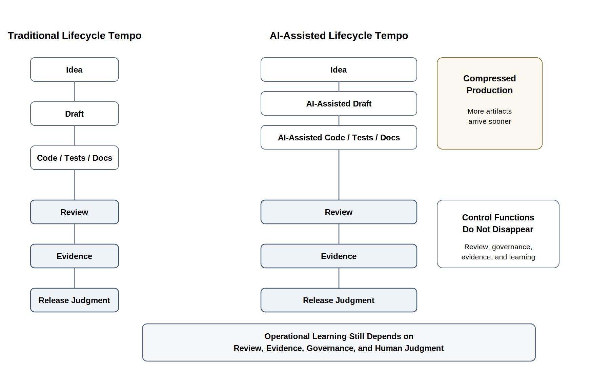
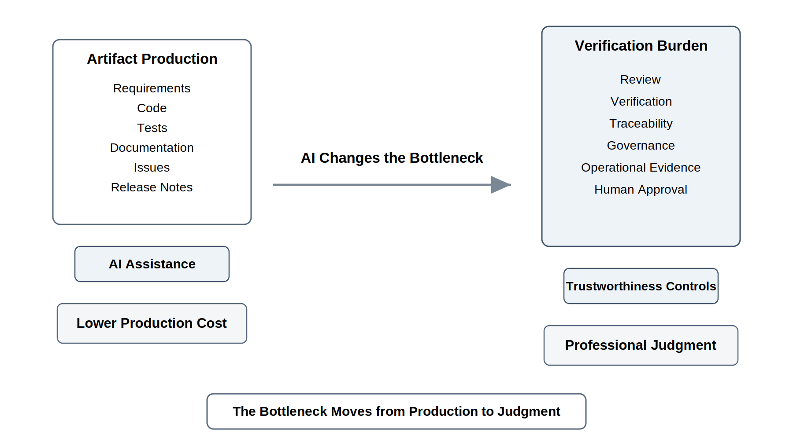
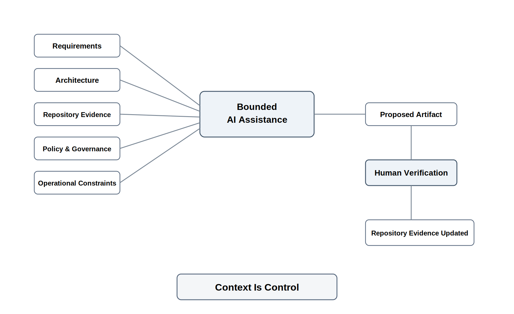
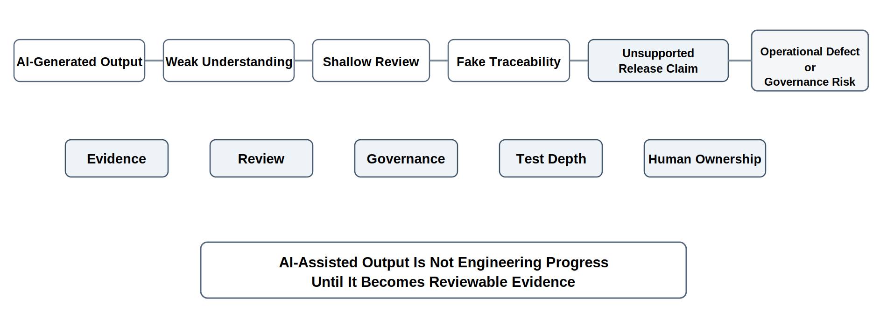
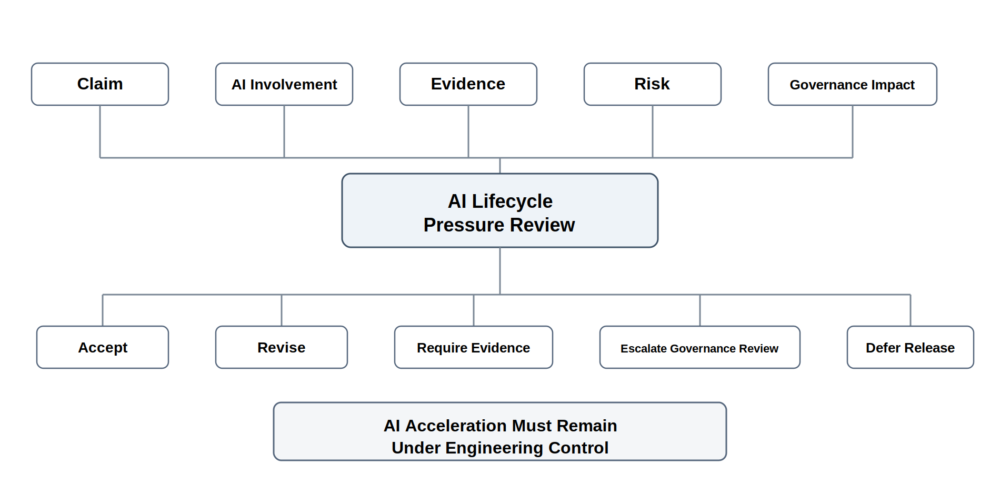

# Chapter 5 AI Changes the Software Lifecyle

## Opening Scenario: Faster Than the Review System

By the time Lakeside Metropolitan University (LMU) began the next phase of the Campus Operations and Incident Coordination Platform, the team felt as if it had finally found momentum.

The previous lifecycle discussion had helped the team move away from slogans. They were no longer arguing about whether COICP should be “Agile,” “Waterfall,” or “hybrid” as if those words alone could make the project mature. They had begun to understand lifecycle models as coordination strategies for managing uncertainty, evidence, feedback, review, governance, and operational learning.

Then AI changed the pace.

The COICP team began using AI assistance for ordinary engineering work. It helped draft requirements. It summarized stakeholder interviews. It suggested user stories. It generated issue descriptions. It proposed code scaffolds. It wrote first-draft test cases. It summarized pull requests. It drafted documentation. It even proposed release-note language for features that were still being tested.

At first, the effect looked impressive.

The issue board filled quickly. Requirements documents became longer and more polished. Pull requests appeared earlier in the cycle. Test files multiplied. Architecture notes looked cleaner. Sprint updates sounded confident. Stakeholders saw visible progress and began to believe that the team had finally broken through the delays that had slowed earlier work.

Maria Chen, the Director of Campus Operations, was encouraged. Her staff had waited too long for better coordination tools. If AI could help the team move faster, she wanted the team to use it.

David Ramirez, the senior platform engineer, was less comfortable. He noticed that some generated code made assumptions about escalation rules that had not been approved. Some generated tests checked only the easiest paths. Some documentation described intended behavior more confidently than the system actually supported. A few pull requests were technically readable but conceptually hard to review because nobody could explain why certain design choices had been made.

Priya Patel, LMU’s AI Governance Officer, became concerned for a different reason. Several generated workflows involved routing incidents, notifying staff, and escalating requests across departments. That meant the system was not merely displaying information. It was beginning to influence operational behavior. If AI-assisted work shaped those workflows without clear review, approval, and auditability, governance decisions were being made accidentally.

Jordan Brooks, from Student Services, saw the user side of the problem. The team could generate interface mockups and workflow descriptions quickly, but some of them did not match how staff actually handled urgent cases. The output looked professional. That made it harder, not easier, to challenge.

The team was moving faster.

But it was not obvious that the team was engineering better.

The review board finally named the problem. LMU was not failing because AI was bad. LMU was struggling because AI had accelerated artifact production faster than the team’s review, governance, evidence, and operational-learning systems could absorb.

That is the central lifecycle challenge of AI-assisted software engineering.

AI can generate software artifacts quickly. It can draft, summarize, scaffold, suggest, classify, translate, and explain. But the lifecycle is not only a production system. It is also a control system. It coordinates uncertainty. It creates evidence. It exposes assumptions. It gives humans opportunities to review, challenge, approve, reject, revise, and learn.

When AI changes the speed of production, the lifecycle must change the strength of its controls.

*Figure 5.1 — AI Compresses the Lifecycle*

---

## 5.1 The First Effect of AI Is Speed

The first visible effect of AI in a software project is usually speed.

A team that once struggled to write a first draft can now produce one quickly. A developer who once stared at a blank file can now generate a starting point. A tester can ask for edge cases. A product owner can ask for user stories. A technical lead can ask for architecture alternatives. A team can ask for meeting summaries, release notes, pull request descriptions, defect hypotheses, or documentation.

This speed is real.

It is also easy to misunderstand.

AI can reduce the friction of beginning work. It can help teams explore options. It can create drafts that are good enough to react to. It can make routine writing faster. It can suggest implementation paths that a human can inspect. It can help students and early-career engineers see examples sooner than they otherwise might.

None of that is trivial. Used well, AI can improve learning, reduce blank-page paralysis, and help teams move from vague intent to concrete artifact.

But speed is not the same as maturity.

A lifecycle does not exist merely to produce artifacts. It exists to coordinate responsible engineering work over time. It gives teams a way to manage uncertainty, align people, expose assumptions, create evidence, challenge decisions, control risk, and learn from operational reality.

AI changes the lifecycle because it changes the tempo of artifact production. A team may now generate requirements, code, tests, documentation, diagrams, and release claims faster than it can understand them. The bottleneck moves.

Before AI, many teams waited on production capacity. They needed more time to write the code, write the tests, write the documentation, or produce the first draft.

With AI, teams increasingly wait on judgment capacity.

Can the team tell whether the generated requirement is actually correct?  
Can the team identify the assumption hidden in the generated test?  
Can the team explain why the generated architecture is appropriate?  
Can the reviewer understand the generated code well enough to approve it?  
Can the release lead distinguish working behavior from unsupported confidence?  
Can the governance reviewer identify where generated logic affects authority, data, permissions, escalation, or auditability?

These are not tool questions.

They are engineering questions.

---

## 5.2 Artifact Production Is No Longer the Bottleneck

For much of software history, artifact production was expensive. Code took time to write. Documentation took time to draft. Test cases took time to create. Requirements took time to translate into structured form. Architecture alternatives took time to sketch. Even flawed first drafts required human effort.

AI changes that economics.

A team can now generate many kinds of software artifacts quickly:

- requirements drafts,
- user stories,
- acceptance criteria,
- issue descriptions,
- code scaffolds,
- unit test suggestions,
- documentation,
- architecture alternatives,
- pull request summaries,
- release notes,
- defect hypotheses,
- review checklists,
- data examples,
- workflow descriptions.

That does not mean those artifacts are correct.

It means they are available sooner.

This distinction matters. A generated artifact may be useful as a starting point, but it is still only proposed engineering material. It has not been verified simply because it exists. It has not been approved because it is fluent. It has not become trustworthy because it sounds professional.

Software engineering must distinguish between several different activities:

> Producing an artifact is not the same as understanding it.
>
> Understanding an artifact is not the same as verifying it.
>
> Verifying an artifact is not the same as integrating it safely.
>
> Integrating an artifact is not the same as governing its consequences.
>
> Governing its consequences is not the same as operating it responsibly over time.

AI helps most visibly with production.

Trustworthy engineering depends on the rest.

A generated test case may be syntactically valid and still test the wrong behavior. A generated requirement may sound precise and still omit an authority boundary. A generated function may pass a simple check and still violate a system assumption. A generated release note may describe what the system was supposed to do, not what the team actually proved.

Cheap artifacts are not automatically trustworthy artifacts.

This is why AI changes the software lifecycle. It does not simply make each existing step faster. It changes where the professional burden sits.

*Figure 5.2 — Artifact Production vs Verification Burden*

---

## 5.3 The Lifecycle Bottleneck Moves to Judgment

When artifact generation becomes easier, judgment becomes more important.

This is the opposite of what many people first assume. They assume that if AI can generate more of the work, engineering judgment matters less. In reality, AI makes judgment more central because more material must be evaluated.

A team does not need less judgment when it has more generated code. It needs more judgment to decide what the generated code means, whether it fits the architecture, whether it is maintainable, whether it handles risk, whether it creates security exposure, whether it can be tested, and whether it should be accepted at all.

A team does not need less judgment when AI drafts requirements. It needs more judgment to determine whether those requirements reflect stakeholder intent, operational reality, governance constraints, data boundaries, and acceptance criteria.

A team does not need less judgment when AI creates tests. It needs more judgment to decide whether the tests validate real requirements or merely confirm assumptions embedded in the generated solution.

A team does not need less judgment when AI drafts documentation. It needs more judgment to ensure that documentation describes reality rather than aspiration.

The durable bottlenecks become:

- requirements judgment,
- architecture judgment,
- risk judgment,
- review judgment,
- evidence judgment,
- governance judgment,
- release judgment,
- operational judgment.

These are the bottlenecks that matter in trustworthy intelligent systems.

A lifecycle model that cannot absorb these judgment demands becomes fragile. It may produce more work, but not more trust. It may move faster, but not more responsibly. It may create the appearance of progress while increasing hidden risk.

This is why the phrase “AI speeds up development” is incomplete.

AI speeds up parts of development. It can accelerate drafting, scaffolding, summarization, and exploration. But the engineering lifecycle also includes review, traceability, verification, governance, release judgment, operational readiness, and learning from failure.

Those responsibilities do not disappear.

They intensify.

---

## 5.4 AI Compresses Lifecycle Feedback Loops

AI compresses the distance between idea and artifact.

A stakeholder describes a workflow, and the team can quickly generate a requirement draft. A requirement becomes a set of user stories. A user story becomes issue text. Issue text becomes code. Code becomes tests. Tests become documentation. Documentation becomes release-note language. Release notes become stakeholder expectations.

This compression can be useful. Fast drafts can improve feedback. Teams can compare alternatives earlier. Stakeholders can react to something concrete. Reviewers can challenge a proposal before too much time is invested. Students can learn by inspecting generated examples and improving them.

But compressed feedback loops create danger when they hide uncertainty.

A polished generated requirement can make an ambiguous need look resolved.  
A generated architecture can make an unreviewed design look intentional.  
A generated test suite can make a weak implementation look validated.  
A generated release summary can make an incomplete feature look ready.  
A generated workflow can make an unapproved authority model look designed.

The core problem is not that AI produces bad output. Sometimes it does, sometimes it does not. The deeper problem is that AI can produce confident output before the engineering team has done the work required to justify that confidence.

AI does not remove uncertainty.

It can hide uncertainty behind fluent output.

This matters because lifecycle models are supposed to manage uncertainty over time. Chapter 4 emphasized that lifecycle choices should fit the uncertainty, risk, governance exposure, and operational consequence of the work. AI does not eliminate that responsibility. It changes its timing.

Teams must surface uncertainty earlier because artifacts appear earlier. They must review assumptions earlier because generated solutions arrive earlier. They must discuss governance earlier because authority may be embedded in generated workflows earlier. They must create evidence earlier because stakeholders may believe progress is farther along than it really is.

AI compresses the lifecycle.

Trustworthy engineering strengthens the control points.

---

## 5.5 Requirements Become More Important, Not Less

AI does not make requirements less important.

It makes requirements more important.

This is one of the most important shifts in AI-assisted engineering. Requirements are no longer only communication artifacts between stakeholders, analysts, designers, developers, and testers. They increasingly become steering infrastructure for AI-assisted work.

AI systems respond to context. They use the material they are given: requirements, policies, examples, repository files, architecture notes, test descriptions, prior decisions, logs, known limitations, and prompts. When that context is weak, generated output becomes weak in ways that may not be obvious.

Weak requirements can produce weak user stories.  
Weak user stories can produce weak issue descriptions.  
Weak issue descriptions can produce weak code.  
Weak code can produce weak tests.  
Weak tests can produce false confidence.  
False confidence can produce unsafe release claims.

Context is control.

In an AI-assisted lifecycle, requirements must do more than state what users want. They must help bound what the system is allowed to do, what it must not do, what evidence will prove success, and what operational consequences matter.

AI-era requirements should clarify:

- user intent,
- workflow boundaries,
- authority boundaries,
- data assumptions,
- acceptance criteria,
- governance constraints,
- operational expectations,
- known limitations,
- security and privacy concerns,
- review expectations,
- human oversight requirements.

Consider COICP. A traditional requirement might say:

“The system shall automatically escalate unresolved campus incident requests.”

That sounds useful, but it is not sufficient. In an AI-assisted workflow, that requirement could lead to generated logic that escalates too aggressively, notifies the wrong role, bypasses a department lead, exposes sensitive information, or assumes approval authority that the system does not have.

A stronger requirement would ask:

What counts as unresolved?  
Who is allowed to escalate?  
Which incidents require human approval before escalation?  
What information is included in the escalation?  
What must be logged?  
Can the action be reversed?  
Who owns incorrect escalation?  
What evidence proves the rule worked?  
What exceptions require manual handling?

The better requirement is not merely more detailed. It is more governable.

That is the AI-era shift. Requirements are not just instructions for implementation. They are controls on generation, review, testing, governance, and release.

*Figure 5.3 — Context Is Control in the AI-Assisted Lifecycle*

---

## 5.6 Review Burden Increases

AI reduces drafting burden.

AI increases verification burden.

This is one of the central truths of AI-assisted software engineering. Teams may spend less time creating initial material, but they must spend more disciplined time reviewing what that material means.

AI-generated output can look polished before it is correct. It can sound complete before it is tested. It can appear consistent before it is integrated. It can describe governance before governance has actually been approved. It can produce code that works in isolation but violates the surrounding architecture.

Review must therefore become stronger, not weaker.

A reviewer of AI-assisted work must ask more than, “Does this compile?” or “Does this pass the visible test?”

The reviewer must ask:

What did AI generate or influence?  
What assumptions are embedded in this output?  
Does this fit the architecture?  
Does this match the requirement?  
Does this change data handling?  
Does this affect authority, permissions, escalation, or approval?  
Are the tests meaningful or superficial?  
Can the author explain the work?  
What evidence supports acceptance?  
What risks remain?

This is why giant AI-generated pull requests are dangerous. They may contain a large amount of plausible work, but plausible work is not reviewable work. Reviewability depends on human ability to inspect, challenge, understand, and verify.

A small pull request that clearly links to an issue, explains AI assistance, identifies tests run, documents risks, and updates evidence is far more mature than a large generated change that overwhelms reviewers.

Review is not bureaucracy.

Review is an engineering safety mechanism.

In AI-assisted work, review protects the team from synthetic productivity, hidden assumptions, architecture drift, weak testing, governance mistakes, and unsupported release claims.

If a team cannot review the generated output, it does not control the generated output.

And if the team does not control the generated output, it does not own the engineering consequence in any meaningful professional sense.

---

## 5.7 Traceability Becomes More Important

When artifacts multiply quickly, traceability becomes more important.

Traceability is the ability to follow engineering work from intent to evidence. It lets a team connect requirements to issues, issues to branches, branches to commits, commits to pull requests, pull requests to reviews, reviews to tests, tests to release notes, release notes to operational evidence, and operational evidence to defects or postmortems.

In AI-assisted engineering, traceability answers a new set of questions:

What did AI help create?  
What human accepted it?  
What was rejected?  
What was modified?  
What evidence verifies the accepted work?  
What requirement or risk does it connect to?  
What review challenged it?  
What operational consequence could follow?  
What remains uncertain?

Without traceability, AI-assisted work becomes difficult to trust. The team may have output, but it cannot explain how that output became part of the system. It cannot show why the work exists. It cannot show who reviewed it. It cannot show what evidence supports it. It cannot show what assumptions remain.

This is where repository-centered engineering becomes essential.

The repository is not merely where code lives. It is where engineering memory accumulates. It should preserve the evidence chain:

Requirement → Issue → Branch → Commit → Pull Request → Review → Test → CI/CD Evidence → Release Note → Operational Evidence → Defect or Postmortem → Governance or Risk Update

AI-assisted work must fit inside that chain.

The AI-use log matters because it records what AI contributed, what humans accepted, what humans rejected, what was modified, and how the result was verified.

Pull request disclosure matters because reviewers need to know when generated output may contain hidden assumptions.

Issue links matter because generated work must connect to real engineering intent, not merely available suggestions.

Test evidence matters because generated code must be verified against system requirements, not against the model’s assumptions.

Release notes matter because the team must distinguish what is working, what is verified, what remains limited, and what risks remain.

Everything important leaves evidence.

This principle becomes more important, not less, when AI accelerates production.

---

## 5.8 Governance Must Move Earlier

AI-assisted workflows make late governance dangerous.

In traditional projects, teams often treated governance as something that happened near release. Security review, compliance review, approval review, and operational readiness review were sometimes added after design and implementation had already made the important decisions.

That was already risky.

AI makes it worse.

If AI-generated code assumes who can approve a request, governance has already entered the design.  
If AI-generated workflow logic decides when an incident escalates, governance has already entered the design.  
If AI-generated documentation describes audit behavior that does not exist, governance has already been misrepresented.  
If AI-generated test cases ignore permission boundaries, governance risk is already hidden.  
If AI-generated notification logic sends information to the wrong role, governance has become an operational risk.

Governance is architecture.

It is not a sticker placed on the system after implementation. Authority, permissions, approvals, audit trails, rollback paths, and human oversight must be designed into the system from the beginning.

For COICP, governance questions appear early:

Who may create an incident?  
Who may edit an incident?  
Who may escalate an incident?  
Who may close an incident?  
Who may override an AI-assisted recommendation?  
What must be logged?  
What requires approval?  
What information may be shown to which department?  
What action can be reversed?  
Who owns an incorrect automated action?

These are lifecycle questions. They affect requirements, architecture, implementation, testing, release readiness, observability, and postmortem learning.

AI does not make governance optional.

AI moves governance earlier.

The more a system can act, route, notify, escalate, approve, modify, or decide, the earlier governance must enter the lifecycle.

---

## 5.9 Anti-Pattern: Synthetic Productivity

The primary anti-pattern in this chapter is synthetic productivity.

Synthetic productivity occurs when teams produce large amounts of AI-assisted output that creates the appearance of progress without corresponding understanding, verification, traceability, governance, or operational readiness.

It is not the same as productivity.

Real productivity increases the team’s ability to deliver trustworthy value. It improves clarity, correctness, reviewability, testing, operational readiness, and learning.

Synthetic productivity increases the volume of output while weakening control.

It often looks impressive at first.

The team has many issues.  
The repository has many files.  
The documentation is long.  
The test folder is full.  
The pull requests are active.  
The demo path works.  
The progress report sounds polished.

But when reviewers inspect the evidence, the weakness appears.

The issues are not tied to real requirements.  
The tests validate easy cases.  
The documentation overstates behavior.  
The pull requests are too large to review meaningfully.  
The architecture has drifted.  
The AI-use log is vague.  
The release notes are aspirational.  
The known limitations are missing.  
The system cannot explain itself under failure.

Synthetic productivity is dangerous because it feels like maturity.

It gives teams confidence before they have earned trust.

The corrective response is not to ban AI. The corrective response is to slow down unsupported claims. The team may still use AI to draft, explore, summarize, and scaffold. But the team must require evidence, review, ownership, traceability, and risk visibility before treating output as engineering progress.

AI-assisted output is useful when it becomes reviewable engineering material.

It is dangerous when it becomes unearned confidence.

*Figure 5.4 — Synthetic Productivity Failure Chain*

---

## 5.10 LMU Matures Its AI-Assisted Lifecycle

LMU does not respond to AI risk by banning AI.

That would be too simplistic. AI assistance is useful. It can help teams draft, compare, summarize, test, document, and reason. Used responsibly, it can improve engineering work.

LMU’s problem is not AI use.

LMU’s problem is uncontrolled AI acceleration.

The COICP team responds by strengthening lifecycle discipline.

First, it updates the AI-use policy. The policy clarifies what AI may be used for, what requires disclosure, what requires stronger review, and what kinds of output cannot be accepted without human verification.

Second, it strengthens the AI-use log. The log no longer records only that AI was used. It records what task AI supported, what output was accepted, what output was rejected, what humans changed, what evidence verified the result, and what risks remain.

Third, it updates the pull request template. Pull requests now ask whether AI assisted the work, what parts were AI-assisted, what tests were run, what risks were considered, and what evidence supports review.

Fourth, it adds lifecycle review expectations for generated artifacts. AI-generated requirements must be reviewed for ambiguity and governance assumptions. AI-generated tests must be reviewed for meaningful coverage. AI-generated code must be reviewed for architecture fit, security, maintainability, and operational behavior. AI-generated documentation must be reviewed against reality.

Fifth, it strengthens governance review for authority-changing work. If an AI-assisted change affects escalation, routing, notification, approval, data visibility, or operational authority, it requires governance review before release.

Sixth, it connects AI-assisted work to repository evidence. Generated output that becomes part of the system must connect to issues, pull requests, reviews, tests, release notes, and known limitations.

These changes do not make LMU slower in the old sense.

They make LMU more controlled.

That is the mature response. The goal is not to eliminate AI acceleration. The goal is to make speed accountable.

---

## 5.11 Repository Evidence for AI-Assisted Lifecycle Work

The repository becomes more important as AI use increases.

AI-assisted work must not live only in chat windows, private prompts, copied code, or undocumented summaries. If AI contributes to meaningful engineering work, the repository must preserve enough evidence for another engineer to understand what happened.

For COICP, Chapter 5 strengthens several repository areas.

The AI policy belongs in:

`/docs/ai/ai-policy.md`

It defines allowed AI use, disclosure expectations, review requirements, and human accountability.

The AI-use log belongs in:

`/docs/ai/ai-use-log.md`

It records tool or model used, task supported, output accepted, output rejected, human modifications, verification evidence, and remaining risk.

Pull request templates should include AI disclosure. A reviewer should not have to guess whether a change was AI-assisted.

Architecture notes should identify AI-influenced decisions where relevant. If generated suggestions shaped component boundaries, workflow logic, authority assumptions, or integration choices, those decisions must be visible.

Test evidence should show human verification of AI-generated output. It is not enough to say that AI generated tests. The team must show what those tests prove and what they do not prove.

Release notes should distinguish verified behavior from intended behavior. AI-generated release summaries must not become unsupported claims.

Known limitations should be explicit. If AI helped produce a feature but edge cases remain weak, that limitation belongs in release evidence.

The repository is the memory of what AI proposed, what humans accepted, what humans rejected, what was modified, what was verified, and what remains risky.

This is not paperwork.

It is engineering control.

---

## 5.12 AI Lifecycle Pressure Review

Chapter 4 introduced the idea that lifecycle fit should be reviewed. Chapter 5 extends that idea to AI acceleration.

An AI Lifecycle Pressure Review asks whether AI-assisted acceleration has exceeded the team’s ability to review, verify, govern, and operate the resulting work.

This review is not anti-AI. It is anti-theater.

It challenges the team to prove that AI acceleration is still under engineering control.

A review board might ask:

What artifacts were AI-assisted?  
What assumptions did generated output introduce?  
What human reviewed and accepted the output?  
What was rejected or modified?  
What evidence verifies correctness?  
What risks remain?  
Did AI accelerate work beyond review capacity?  
Did generated work change architecture, authority, data handling, or operational behavior?  
Is traceability still clear?  
Is the team mistaking output volume for engineering maturity?

These questions matter because teams often discover AI-related risk too late. They realize during release review that generated tests were shallow. They realize during integration that generated code does not fit the architecture. They realize during operations that generated workflows failed to account for escalation exceptions. They realize during governance review that authority assumptions were never approved.

The AI Lifecycle Pressure Review moves that challenge earlier.

It helps the team decide whether to:

- accept the work,
- revise the work,
- require more evidence,
- require stronger tests,
- escalate to governance review,
- split an oversized pull request,
- update documentation,
- defer release,
- or reject the generated approach.

*Figure 5.5 — AI Lifecycle Pressure Review Gate*

---

## 5.13 Trustworthiness Mapping

AI-assisted lifecycle work strengthens or weakens trustworthiness depending on how it is governed.

The relevant pillars in this chapter are especially clear.

Correctness requires that AI-generated output be validated against real intent, not accepted because it is fluent, plausible, or syntactically correct.

Traceability requires that AI-assisted artifacts connect to requirements, issues, pull requests, reviews, tests, release notes, and operational evidence.

Reviewability requires that generated work remain small enough, visible enough, and explainable enough for humans to inspect and challenge.

Governability requires that AI-shaped workflows respect permissions, approvals, authority boundaries, audit expectations, and institutional policy.

Accountability requires that humans remain responsible for accepted AI-assisted work.

Operational Visibility requires that teams understand how AI-assisted changes affect runtime behavior, defects, limitations, and operational risk.

Human Oversight requires that consequential AI-assisted decisions receive meaningful human review, not passive acceptance.

These pillars reveal why AI changes the lifecycle. The old question was often, “Can we produce the artifact?”

The AI-era question is harder:

Can we responsibly understand, verify, govern, operate, and own the artifact after it is produced?

That is the difference between output and trust.

---

## 5.14 Operational Takeaways

AI accelerates output, not responsibility.

Artifact generation is not engineering completion.

Cheap output makes evidence more valuable.

AI reduces drafting burden but increases verification burden.

Context is control.

Governance must move earlier when systems can act.

Synthetic productivity is not maturity.

The lifecycle bottleneck moves to judgment.

Review is an engineering safety mechanism.

Human accountability remains central.

---

## 5.15 Exercises

### Exercise 1: Identify Synthetic Productivity

You are given an AI-assisted project status report that claims:

- Twenty new issues were created
- Ten test files were generated
- Three pull requests were completed
- A draft release note was produced

Analyze the report.

For each claim:

- Determine what evidence would be required before the claim could be trusted.
- Identify what questions should be asked.
- Explain what additional information would distinguish real progress from apparent progress.

Discuss why activity and progress are not always the same thing.

### Exercise 2: Evaluate AI Lifecycle Risk

Review the following AI-assisted artifacts:

- Generated meeting summary
- Generated CSS layout
- Generated unit tests for a utility function
- Generated database migration logic
- Generated escalation workflow rules
- Generated release notes
- Generated permission-checking code
- Generated architecture alternatives

For each artifact:

- Classify the review concern as Low, Moderate, or High.
- Explain the operational risk.
- Identify the review expectations.
- Describe the evidence required before acceptance.

Explain why some AI-generated artifacts deserve substantially more scrutiny than others.

### Exercise 3: Follow an Evidence Chain

Consider the following AI-generated requirement:

> "The system should automatically notify the appropriate department when an incident is escalated."

Trace how this requirement should be evaluated throughout the engineering lifecycle.

Describe:

- Questions that should be asked
- Evidence that should be gathered
- Risks that should be examined
- Decisions that should be challenged

at each stage of engineering work.

Explain how weak evidence early in the lifecycle can create problems later.

### Exercise 4: Analyze Governance Timing

A team uses AI to generate workflow logic for routing urgent Facilities incidents after hours.

Identify the governance questions that should be answered before implementation begins.

Separate the questions into categories such as:

- Requirements
- Architecture
- Review
- Testing
- Release readiness

Explain why governance activities must occur throughout the lifecycle rather than only near release.

### Exercise 5: Conduct an AI Lifecycle Pressure Review

Act as the AI Lifecycle Pressure Review Board for the COICP team.

The team claims that AI helped them complete two weeks of work in three days.

Evaluate the claim.

Identify:

- Evidence that would support responsible acceleration
- Evidence that would suggest synthetic productivity
- Risks that may have been overlooked
- Questions that should be asked before accepting the claim

Determine whether the acceleration represents genuine engineering progress or merely increased activity.

Justify your conclusion using the concepts introduced in this chapter.

---

## Chapter Closing: Speed Must Become Accountable

AI changes the software lifecycle because it changes the speed, volume, and apparent polish of engineering artifacts.

But software engineering has never been only about producing artifacts. It is the discipline of coordinating people, decisions, systems, evidence, risks, and operational consequences over time.

AI can help teams move faster. That matters. But speed without review creates fragility. Speed without traceability creates confusion. Speed without governance creates authority risk. Speed without observability creates operational blindness. Speed without accountability creates institutional danger.

The trustworthy engineer does not reject AI acceleration.

The trustworthy engineer governs it.

Chapter 5 has shown the pressure: AI can generate more artifacts than teams can responsibly absorb if the lifecycle does not adapt. Chapter 6 turns to the professional capability required to manage that pressure.

If AI can generate more than teams can fully understand, what kind of human judgment must remain in control?

That is the next question.
