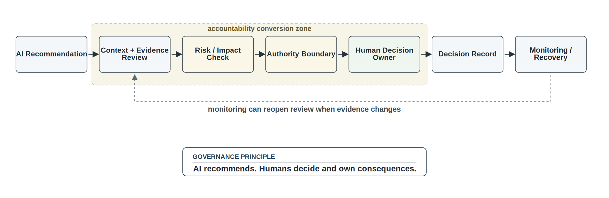
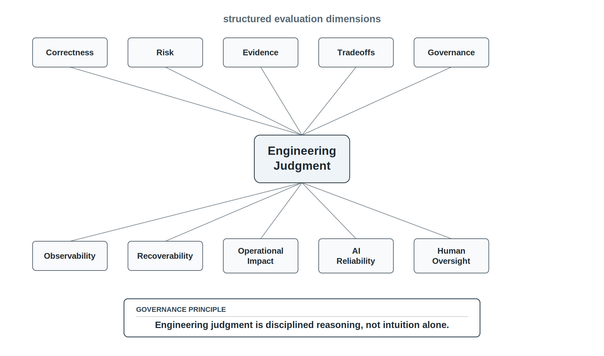
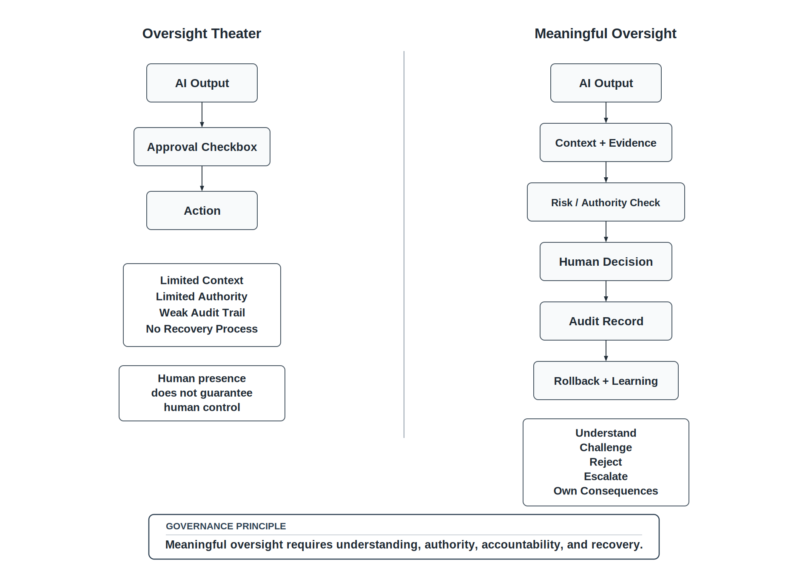
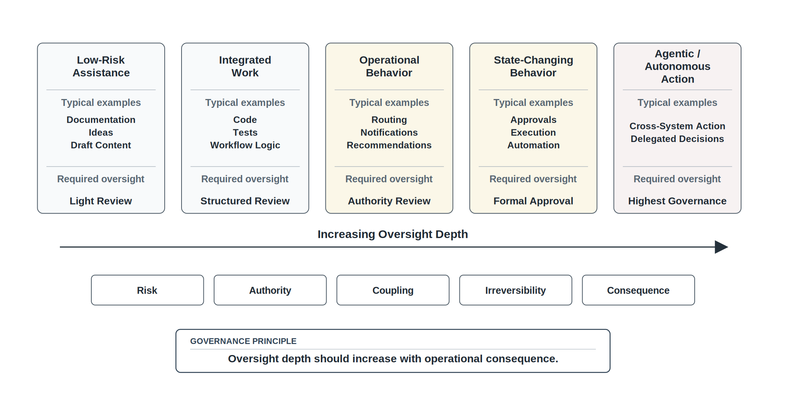
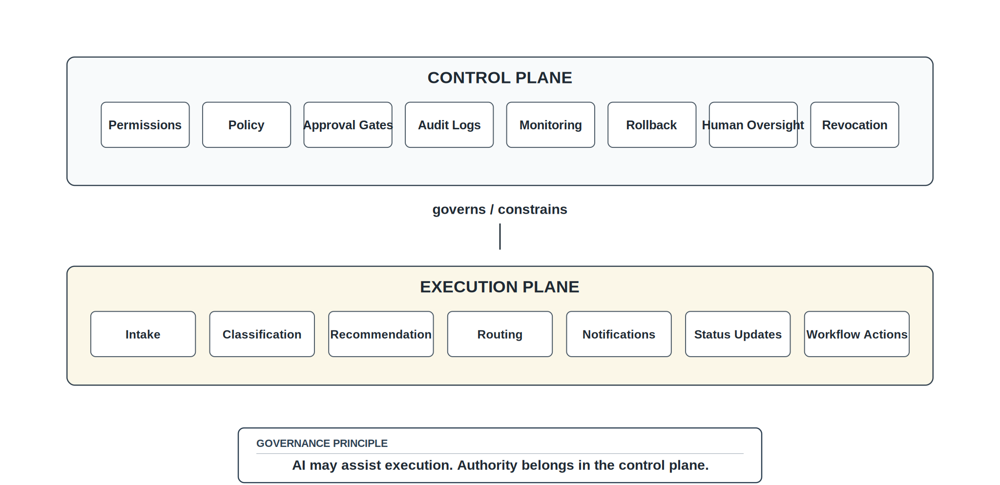

# Chapter 6 Engineering Judgment and Human Oversight

## Opening Scenario: The Recommendation Is Plausible, But Is It Safe?

Lakeside Metropolitan University (LMU) did not stop using AI after the concerns raised during the COICP lifecycle review.

That would have been the wrong lesson.

The problem was not that AI assistance had no value. The problem was that AI had accelerated output faster than the team could responsibly review, govern, verify, and operate it. Chapter 5 showed that AI changes the software lifecycle by lowering the cost of artifact production and increasing the burden of judgment. The next question was unavoidable.

If AI can generate more than teams can fully understand, what kind of human judgment must remain in control?

That question became concrete when the COICP team proposed an AI-assisted escalation recommendation feature.

The feature sounded useful. When a campus incident was submitted, the system would analyze the description, classify urgency, suggest the responsible department, recommend an escalation path, draft notification text, and indicate whether human approval was required before action.

For routine cases, the prototype looked promising. A broken light in a classroom was routed to Facilities. A parking-lot maintenance issue was classified as low urgency. A general student-services question was routed to the correct office. The AI-generated recommendations were plausible, fast, and easy to read.

At first glance, the team had a strong candidate for improving operational coordination.

Then the review board examined harder examples.

A facilities issue near a residence hall could be routine, but it could also involve student safety. A student-services complaint might be ordinary, but it might also contain private information. A repeated minor facilities issue could signal a larger operational pattern. An incident description with urgent language could trigger unnecessary escalation. A serious issue described vaguely could be under-classified. A recommended department might be plausible but wrong. Draft notification text might expose more information than necessary.

The recommendation was not obviously bad.

That was precisely the problem.

A bad recommendation is often easier to reject. A plausible recommendation requires judgment. It may be useful. It may also be incomplete, overconfident, poorly bounded, or operationally risky.

Maria Chen wanted the system to help her staff move faster. David Ramirez wanted to know whether the recommendation logic fit the architecture and could be maintained. Priya Patel wanted to know what authority the recommendation implied and what required human approval. Jordan Brooks wanted to know whether staff would understand when they were accepting a recommendation versus making an accountable decision.

The team realized that the central issue was not whether AI could recommend.

The issue was whether LMU knew how to decide when the recommendation was acceptable, when it required human approval, when it needed more evidence, when it should be rejected, and who owned the consequence if the recommendation shaped action.

The question was no longer, Can AI generate an answer?

The question was, Who is accountable for deciding whether that answer may influence action?

*Figure 6.1 — From AI Recommendation to Accountable Decision*

---

## 6.1 Plausibility Is Not Enough

AI-generated output often appears plausible before it is trustworthy.

That is not a minor problem. Plausibility is one of the reasons AI-assisted work can be so useful and so risky at the same time. A plausible answer gives a team something to inspect, challenge, and improve. It can accelerate discussion. It can reveal alternatives. It can reduce the time required to move from vague intent to concrete proposal.

But plausibility can also create premature confidence.

A plausible requirement can still miss the real stakeholder need. A plausible architecture can still create dangerous coupling. A plausible test can still validate the wrong behavior. A plausible escalation recommendation can still route a sensitive incident to the wrong team. A plausible explanation can still hide an assumption that nobody has verified.

Engineering judgment begins when plausibility is not enough.

In COICP, the AI-assisted escalation feature did not fail because every recommendation was wrong. It created risk because many recommendations were reasonable enough to tempt acceptance before the team had defined the evidence, authority boundaries, approval rules, audit trail, and recovery path.

This is the human oversight problem in intelligent systems.

It is not enough to place a human somewhere near the system. It is not enough to say that a human will approve important actions. It is not enough to display an AI recommendation and assume the reviewer can make a responsible decision.

Human oversight is meaningful only when the human has enough context, evidence, authority, time, and accountability to exercise real control.

A person who sees an AI recommendation but cannot inspect the evidence is not truly overseeing the system. A person who clicks approve without understanding the workflow is not governing the decision. A person who lacks authority to reject, revise, escalate, or delay action is not in meaningful control. A person who is accountable after failure but unsupported before approval has been placed in a dangerous position.

Human oversight is not passive watching.

Human oversight is accountable engineering judgment applied where consequences matter.

---

## 6.2 Engineering Judgment Is Disciplined Reasoning Under Uncertainty

Engineering judgment is sometimes described as experience, intuition, or common sense. Those descriptions are incomplete.

Experienced engineers do develop intuition. They recognize patterns. They notice risk signals earlier. They know when a design feels too clever, when a test is too shallow, when a release claim is too confident, or when a requirement is hiding ambiguity.

But trustworthy engineering cannot rely on intuition alone.

Engineering judgment is disciplined reasoning under uncertainty. It is the ability to evaluate what is known, what is unknown, what evidence exists, what assumptions are being made, what risks matter, what tradeoffs are being accepted, what authority is being delegated, and what consequences may follow.

In the AI era, engineering judgment includes at least ten dimensions.

Correctness asks whether the system behaves as intended.

Risk asks what could fail and how severe the consequence could be.

Evidence asks what proof supports the claim.

Tradeoffs ask what was optimized, sacrificed, deferred, or accepted.

Governance asks what authority boundaries, approvals, policies, and audit expectations apply.

Observability asks whether runtime behavior can be understood.

Recoverability asks what happens when the system is wrong or fails.

Operational impact asks who is affected by the system's behavior.

AI reliability asks what assumptions came from AI-generated or AI-assisted output.

Human oversight asks where humans must retain meaningful control.

Engineering judgment is not a mystical trait. It is a professional discipline. It can be taught, practiced, challenged, reviewed, and improved.

In COICP, engineering judgment means asking whether an escalation recommendation is merely plausible or operationally acceptable. It means asking whether the system has enough evidence to recommend urgency. It means asking whether the recommendation crosses an authority boundary. It means asking whether the reviewer can see enough context to approve or reject. It means asking whether a wrong recommendation can be detected, corrected, and learned from.

AI can propose.

Engineers must judge.

*Figure 6.2 — Engineering Judgment Lens*

---

## 6.3 Oversight Is Not Approval Theater

Many organizations claim to have human oversight.

Some do. Many do not.

A human approval step is not automatically meaningful oversight. A review screen is not automatically control. A checkbox is not automatically governance. A manager's approval is not automatically accountability. A person placed in a workflow is not automatically empowered to understand, challenge, reject, or correct the system.

This matters because intelligent systems often make oversight look easier than it is.

The system can present a recommendation with a confidence score. It can summarize the reasoning. It can offer approve and reject buttons. It can show a neat explanation. It can generate a notification draft. It can make the workflow feel controlled.

But if the human reviewer lacks context, the approval is weak.

If the reviewer cannot see what data shaped the recommendation, the approval is weak. If the reviewer cannot see the relevant policy, the approval is weak. If the reviewer has no time to inspect the case, the approval is weak. If the reviewer cannot reject or revise the recommendation, the approval is weak. If the reviewer is evaluated on speed rather than correctness, the approval is weak. If nobody logs the decision, the approval is weak. If there is no rollback or correction path, the approval is weak.

This is oversight theater.

Oversight theater occurs when an organization claims that a human is in the loop, but the human lacks the context, evidence, authority, time, or understanding needed to exercise meaningful control.

Oversight theater is dangerous because it creates the appearance of responsibility while weakening actual accountability.

It allows the organization to say, A human approved it, even when the human was not positioned to make a responsible engineering decision.

Trustworthy engineering requires more.

A real oversight mechanism must allow a human to understand the recommendation, inspect relevant evidence, evaluate risk, identify authority boundaries, reject or revise the output, escalate uncertainty, log the decision, and own the consequence.

Human oversight is not a symbolic role.

It is an engineering control.

---

## 6.4 What Meaningful Human Oversight Requires

Meaningful human oversight requires design.

It does not appear automatically because a human is nearby. It must be built into the lifecycle, the architecture, the repository, the review process, and the operational workflow.

At minimum, meaningful oversight requires visibility.

The human reviewer must see the AI-assisted output and enough of the context that shaped it. For COICP, that may include the incident description, relevant history, department rules, urgency criteria, privacy constraints, escalation policy, and prior similar cases. Without context, the reviewer is reacting to a recommendation rather than judging it.

Meaningful oversight requires evidence.

The reviewer must know why the recommendation is being made and what evidence supports it. That evidence may include structured fields, workflow rules, policy references, tests, audit records, operational history, or confidence limits. The point is not that every AI output needs a perfect explanation. The point is that consequential decisions require enough evidence for responsible review.

Meaningful oversight requires authority.

The reviewer must be able to approve, reject, revise, delay, or escalate. A human who can only approve is not a reviewer. A human who can only choose between two system-generated options may not have enough control. A human who cannot slow down a risky action is not exercising oversight.

Meaningful oversight requires boundaries.

The system must define which actions AI may recommend, which actions it may perform automatically, which actions require human approval, and which actions are forbidden. Without boundaries, oversight becomes improvised.

Meaningful oversight requires an audit trail.

The system must record what was recommended, what context was shown, who reviewed it, what decision was made, what evidence was available, and what happened next. Without an audit trail, oversight cannot be reviewed, improved, or trusted.

Meaningful oversight requires recoverability.

If an AI-assisted action is wrong, the organization must know how to detect it, correct it, contain the harm, and learn from it. Oversight without recovery is fragile.

Meaningful oversight requires accountability.

Someone must own the decision. Not the model. Not the tool. Not the vague idea of automation. A named person, role, or team must be responsible for accepting the recommendation, operating the workflow, reviewing failures, and improving the system.

A human cannot oversee what they cannot understand, challenge, control, or recover from.

*Figure 6.3 — Oversight Theater vs Meaningful Oversight*

---

## 6.5 Risk Determines Oversight Depth

Not every AI-assisted action requires the same oversight.

This is important. A serious engineering approach must avoid both extremes. It should not treat all AI use as unacceptable. It should not treat all AI use as harmless. The right question is not whether AI was used. The right question is what risk the AI-assisted output creates and what control posture that risk requires.

A low-risk isolated task may need lightweight review. If AI drafts a meeting summary, suggests wording for a README paragraph, proposes a simple CSS adjustment, or generates a throwaway prototype, the oversight burden may be modest. A human should still review the output, but the consequence of error is limited and recovery is easy.

A moderate-risk integrated task requires stronger oversight. If AI helps generate code that connects to other components, creates tests used for release claims, drafts requirements used by multiple teams, or proposes architecture alternatives, the team needs peer review, traceability, test evidence, and architecture-fit evaluation.

A high-risk operational behavior requires stronger control. If AI-assisted work touches data integrity, permissions, security, privacy, reliability, concurrency, performance, recoverability, serviceability, compliance, or cross-system workflows, the team needs explicit governance review, meaningful testing, observability, rollback planning, and accountable ownership.

Agentic or state-changing behavior requires the strongest oversight. If AI can call tools, modify records, trigger workflows, approve work, notify users, route incidents, spend money, or affect business state, the system needs permission boundaries, approval gates, audit trails, revocation paths, operational monitoring, and human-in-the-loop controls where consequences justify them.

The more the system can affect real people, real data, real resources, real authority, or real institutional trust, the deeper oversight must become.

AI delegation is an engineering risk-management decision.

It is not an ideological yes or no.

---

## 6.6 The Oversight Decision Matrix

A practical oversight decision begins with consequence.

Before accepting AI-assisted output, engineers should ask what the output can affect. Does it affect wording only? Does it affect code? Does it affect data? Does it affect authority? Does it affect users? Does it affect operations? Does it affect institutional trust?

The deeper the consequence, the stronger the oversight.

The following questions form a practical oversight decision matrix.

What can this output affect?

A generated paragraph in documentation is different from generated permission-checking code. A generated test idea is different from generated workflow logic. A recommendation shown to an engineer is different from an action sent automatically to campus staff.

Who could be harmed, delayed, misinformed, or exposed?

A wrong recommendation may inconvenience a user, delay urgent work, disclose private information, route a case to the wrong department, or create institutional liability.

What data is involved?

Systems that touch private, sensitive, regulated, operational, or security-relevant data require stronger oversight.

What authority is implied?

Recommendations often carry hidden authority. A routing suggestion may imply responsibility. An escalation recommendation may imply urgency. A notification draft may imply permission to disclose information. A closure recommendation may imply that the issue is resolved.

What could fail silently?

Some failures are visible immediately. Others remain hidden until damage accumulates. Silent failure requires stronger controls.

Can the result be verified?

If the output cannot be checked, explained, tested, or reviewed, the team should not treat it as reliable engineering material.

Can the action be reversed?

Reversible actions may tolerate lighter controls. Irreversible or hard-to-correct actions require stronger review.

What evidence exists?

A recommendation without evidence is a suggestion. A release decision without evidence is a confidence claim. A governance decision without evidence is theater.

Who approves?

Approval must be tied to role, authority, and accountability. Approval by the wrong person is not meaningful control.

Who owns the consequence?

This is the final question. If nobody owns the consequence, the system is not responsibly governed.

*Figure 6.4 — Risk-Based Oversight Depth Matrix*

---

## 6.7 Human Oversight Across the Lifecycle

Human oversight is not one gate at the end of the process.

It is distributed across the lifecycle.

During requirements work, humans define intent, constraints, authority boundaries, acceptance criteria, data expectations, and governance rules. If oversight is not considered during requirements, the system may implement behavior that no one is prepared to govern.

During architecture, humans define system boundaries, component responsibilities, systems of record, control points, execution paths, data access, and approval mechanisms. This is where oversight becomes structural rather than symbolic.

During implementation, humans verify generated code, integration behavior, dependencies, error handling, and assumptions. They must decide whether the implementation fits the architecture and whether AI-assisted logic is understandable enough to maintain.

During review, humans challenge evidence, risks, AI-use disclosure, maintainability, security, and governance implications. Review is one of the places where oversight becomes visible.

During testing, humans evaluate whether tests prove real requirements or merely confirm generated assumptions. AI-generated tests can be useful, but they can also reproduce the same blind spots as the generated implementation.

During release, humans decide whether the evidence supports deployment. This includes known limitations, residual risks, rollback options, operational readiness, and governance approval.

During operations, humans monitor behavior, respond to incidents, correct failures, review logs, update runbooks, and learn from postmortems. Oversight continues after release because consequences continue after release.

This is why human oversight belongs to the lifecycle, not only to the user interface.

An approval button may be one part of oversight.

It is not the whole system of oversight.

---

## 6.8 LMU Evolves from AI Use to Oversight Design

LMU's first AI governance step was policy. The organization needed to clarify what kinds of AI use were acceptable, what had to be disclosed, and what required review.

Chapter 6 moves LMU beyond policy into oversight design.

For the COICP escalation recommendation feature, LMU defines escalation authority rules. The system may recommend escalation, but some escalation categories require human approval before notification or routing. Certain sensitive incidents require review by a designated role. Some recommendations may be displayed as suggestions only and may not trigger workflow changes automatically.

LMU defines role-based decision boundaries. Facilities staff, Student Services staff, Campus Safety, operations managers, and governance reviewers do not all have the same authority. The system must reflect those differences.

LMU adds human approval gates for high-risk recommendations. Routine routing suggestions may be accepted quickly, but recommendations involving privacy, safety, cross-department escalation, or public communication require stronger review.

LMU adds audit logs for AI-assisted recommendations. The system records what was recommended, what information was displayed, who approved or rejected the recommendation, what action followed, and whether the action was later corrected.

LMU adds override and correction workflows. Staff must be able to reject a recommendation, choose a different department, correct urgency, add explanation, and flag the case for model or rule review.

LMU defines escalation criteria for review boards. If AI-assisted recommendations repeatedly misclassify a category of incident, the issue must be reviewed as an operational pattern, not treated as isolated user error.

LMU adds operational monitoring. The team tracks incorrect escalations, overrides, delayed actions, privacy flags, and user-reported confusion. These signals become evidence for improving the system.

This is a crucial maturity shift.

LMU is no longer merely asking, Can AI help?

LMU is asking, What must be true for AI assistance to remain under accountable engineering control?

---

## 6.9 Repository Evidence for Oversight

Meaningful oversight must leave evidence.

If oversight decisions are not recorded, they cannot be reviewed. If approval boundaries are not documented, they cannot be challenged. If AI-assisted decisions are not traceable, the organization cannot learn from failure.

The repository should preserve oversight design and oversight evidence.

The governance and approvals document belongs in:

`/docs/architecture/governance-and-approvals.md`

This document should explain which actions require approval, which roles have authority, what AI may propose, what AI may not decide, and where human review is required.

The AI policy belongs in:

`/docs/ai/ai-policy.md`

It should define acceptable AI use, disclosure expectations, prohibited uses, risk-based review requirements, and accountability rules.

The AI-use log belongs in:

`/docs/ai/ai-use-log.md`

It should record AI-assisted work, accepted output, rejected output, human modifications, verification evidence, and remaining risk.

The AI oversight review belongs in:

`/docs/reviews/ai-oversight-review.md`

This review should evaluate whether oversight is meaningful, proportionate to risk, and supported by evidence.

The security and governance checklist belongs in:

`/docs/security/security-governance-checklist.md`

This checklist should include permissions, data visibility, approval rules, audit expectations, security risks, and residual concerns.

Runtime evidence belongs in:

`/docs/observability/runtime-evidence.md`

Oversight must be monitored in operation. The team should collect evidence about overrides, incorrect recommendations, audit records, escalation errors, and operational patterns.

Known limitations belong in:

`/docs/release/known-limitations.md`

If the AI-assisted feature is limited, uncertain, or not yet approved for some categories of action, release evidence must say so.

Architecture Decision Records should capture major authority and oversight choices. If the team decides that AI may recommend but not automatically escalate certain incidents, that decision belongs in an ADR.

Repository evidence should answer the core oversight questions:

What can AI propose?  
What can AI do without approval?  
What requires human approval?  
What is logged?  
What can be overridden?  
What can be rolled back?  
Who owns the outcome?

The repository is where oversight becomes reviewable.

---

## 6.10 Control Plane and Execution Plane

AI-assisted systems require a clear distinction between the execution plane and the control plane.

The execution plane is where work happens. In COICP, the execution plane includes incident intake, classification, routing, notifications, status updates, escalation suggestions, and workflow actions.

The control plane governs what the execution plane is allowed to do. It includes permissions, policies, approval gates, audit logs, monitoring, rollback rules, escalation rules, human oversight, and revocation mechanisms.

This distinction matters because AI often appears in the execution path. It may classify, recommend, summarize, draft, route, or trigger. But the fact that AI can assist with execution does not mean it should control authority.

Authority belongs in the control plane.

For example, an AI-assisted component may recommend that an incident be escalated to Campus Safety. That recommendation belongs to the execution workflow. But the rule that certain escalations require human approval belongs to the control plane. The audit log belongs to the control plane. The permission rule belongs to the control plane. The ability to override the recommendation belongs to the control plane. The monitoring that detects repeated incorrect escalations belongs to the control plane.

When teams fail to separate these planes, AI-assisted systems become difficult to govern.

Generated logic may embed approval assumptions inside implementation. Notification behavior may bypass policy. Workflow routing may become hard to audit. Reviewers may not know where authority is enforced. Operators may not know how to recover from incorrect action.

Control must be designed, not hoped for.

*Figure 6.5 — Control Plane vs Execution Plane for AI-Assisted Workflows*

---

## 6.11 Anti-Pattern: Oversight Theater

The primary anti-pattern in this chapter is oversight theater.

Oversight theater occurs when an organization claims that human oversight exists, but the human reviewer lacks meaningful ability to inspect, understand, challenge, reject, correct, or own the decision.

Oversight theater often looks responsible from a distance.

There is an approval screen. There is a reviewer. There is a button. There is a policy statement. There may even be a log that says a human approved the action.

But the substance is weak.

The reviewer may not see the relevant context. The explanation may be too shallow. The reviewer may have too little time. The workflow may pressure approval. The reject option may be unclear. The reviewer may lack authority. The audit trail may be incomplete. The action may be hard to reverse. Accountability may be assigned only after failure.

Oversight theater is especially dangerous in AI-assisted systems because it can hide behind reassuring language.

Human-in-the-loop sounds responsible. Human approved sounds accountable. AI-assisted sounds safer than automated. Recommendation sounds less risky than decision.

Those phrases may be true, but only if the engineering controls behind them are real.

The corrective response is to design oversight as an engineering control.

Real oversight provides context, evidence, authority, decision options, logging, escalation, rollback, monitoring, and accountability. It gives humans the ability to slow down, reject, revise, ask for more evidence, or escalate when uncertainty is too high.

A human signature on an unclear decision is not trustworthiness.

It is liability with a name attached.

---

## 6.12 AI Oversight Review Board

The AI Oversight Review evaluates whether human oversight is meaningful, proportionate to risk, and supported by evidence.

This review should occur before consequential AI-assisted behavior is released. It should also recur after operational evidence shows how the system behaves in practice.

The review board should ask:

1. What can the AI-assisted system propose?
2. What can it do without approval?
3. What requires human approval?
4. What information does the human reviewer see?
5. Can the reviewer reject, revise, delay, or escalate?
6. What is logged?
7. Can the action be reversed or corrected?
8. Who owns incorrect decisions?
9. What evidence proves the oversight mechanism works?
10. Is oversight real control or theater?

These questions are not bureaucratic decorations. They are engineering safeguards.

If the system can recommend action, the review board asks what authority the recommendation implies.

If the system can trigger action, the review board asks what approval gate controls it.

If the system can notify people, the review board asks what data is disclosed and who approved the disclosure.

If the system can classify urgency, the review board asks what evidence validates the classification and how errors are detected.

If the system can be overridden, the review board asks whether overrides are logged and reviewed.

If the system cannot be recovered, the review board asks whether the action should be allowed at all.

The purpose of the AI Oversight Review is not to slow everything down.

The purpose is to ensure that speed remains accountable.

---

## 6.13 Trustworthiness Mapping

Chapter 6 strengthens the trustworthiness framework by making human oversight concrete.

Human Oversight is the central pillar in this chapter. Humans must retain meaningful control over consequential AI-assisted actions. Meaningful control requires context, evidence, authority, decision options, logging, and accountability.

Accountability is strengthened when ownership is explicit. The system must identify who approves, who operates, who responds, and who improves the workflow after failure.

Governability is strengthened when authority, permissions, approval gates, policies, auditability, and override rules are designed into the system rather than added later.

Traceability is strengthened when oversight decisions leave evidence. A team should be able to trace a recommendation to context, review, approval, action, operational result, and any later correction.

Reviewability is strengthened when AI-assisted recommendations and human approvals can be inspected and challenged.

Recoverability is strengthened when incorrect recommendations or actions can be corrected, rolled back, contained, or learned from.

Operational Visibility is strengthened when the team monitors whether oversight mechanisms work in practice. Overrides, incorrect recommendations, delayed escalations, privacy flags, and user confusion are operational signals.

Security is strengthened when oversight protects data visibility, permissions, role boundaries, and sensitive workflows.

Together, these pillars show why human oversight is not an isolated ethical preference. It is an engineering requirement for trustworthy intelligent systems.

A system that cannot be meaningfully overseen cannot be responsibly trusted.

---

## 6.14 Operational Takeaways

Human oversight is active control, not passive watching.

A human cannot oversee what they cannot understand.

Approval without evidence is theater.

Risk determines oversight depth.

AI can propose; humans remain accountable for accepted consequences.

Governance is architecture.

Oversight must be designed into the lifecycle.

Control must be explainable, auditable, revocable, and recoverable.

Engineering judgment is the enduring skill.

---

## 6.15 Exercises

### Exercise 1: Identify Oversight Theater

You are given an AI-assisted approval workflow.

The system presents:

- A recommendation
- A confidence score
- An Approve button

However, the reviewer cannot:

- View supporting evidence
- Revise the recommendation
- Request clarification
- Escalate the decision
- Record disagreement

Analyze the workflow.

Identify:

- Missing oversight capabilities
- Missing accountability mechanisms
- Missing evidence
- Associated risks

Explain why the workflow does not provide meaningful human oversight.

Determine what changes would be required before the workflow could be considered trustworthy.

### Exercise 2: Build an Oversight Decision Matrix

For each of the following AI-assisted activities:

- AI drafts a meeting summary
- AI suggests wording for a README section
- AI generates unit tests for a utility function
- AI recommends which department should receive an incident
- AI drafts a notification to campus staff
- AI modifies the status of an incident record
- AI recommends closing a student complaint
- AI triggers an escalation to Campus Safety

Document:

- Risk level
- Required oversight depth
- Evidence required
- Approval requirements
- Recoverability concerns

Explain why different AI-assisted actions require different levels of human oversight.

### Exercise 3: Analyze an Escalation Recommendation Workflow

Review the proposed COICP escalation-recommendation capability.

Define:

- What AI may recommend
- What AI may not decide
- Which recommendations require human approval
- Information required by reviewers
- What evidence should be preserved
- What may be overridden
- Who owns incorrect decisions

Explain how authority remains with people even when recommendations are AI-assisted.

### Exercise 4: Map Oversight Evidence

Consider the following oversight artifacts:

- AI-use policy
- AI-use log
- Approval rules
- Escalation authority decisions
- Oversight reviews
- Runtime evidence of incorrect recommendations
- Known limitations
- Correction procedures

For each artifact:

- Describe its purpose
- Identify the engineering activity it supports
- Explain how it contributes to accountability

Discuss what risks arise when oversight evidence is missing or incomplete.

### Exercise 5: Separate the Control Plane from the Execution Plane

Review an AI-assisted incident-routing workflow.

Identify which parts of the workflow belong to the execution plane and which belong to the control plane.

Consider activities such as:

- Recommendation generation
- Incident routing
- Approval
- Logging
- Monitoring
- Escalation
- Override
- Recovery

Explain why trustworthy systems separate work execution from authority and oversight.

Identify the risks that emerge when the two planes become blurred.

### Exercise 6: Conduct a Human Oversight Review

Act as a Human Oversight Review board evaluating a proposed AI-assisted workflow.

Assess:

- Visibility into AI recommendations
- Reviewer authority
- Approval paths
- Escalation mechanisms
- Override capability
- Accountability
- Evidence preservation
- Recovery options

Document:

- Strengths
- Weaknesses
- Open risks
- Required improvements

Determine whether the workflow is:

- Acceptable
- Acceptable with conditions
- Not acceptable

Justify the decision using the principles introduced in this chapter.

---

## Chapter Closing: Oversight Must Be Real Control

AI changes software engineering because it can generate, recommend, summarize, classify, and sometimes act at a speed and scale that exceeds traditional review habits.

Chapter 5 showed that this changes lifecycle pressure. Artifact production becomes faster. Verification, traceability, governance, and accountability become more important.

Chapter 6 has shown that the professional response is not vague human involvement. The response is engineering judgment and meaningful oversight.

A trustworthy intelligent system does not merely keep a human nearby. It gives humans the context, evidence, authority, time, and accountability required to make responsible decisions. It defines what AI may propose, what it may not decide, what requires approval, what is logged, what can be corrected, and who owns the outcome.

Human oversight is not symbolic.

It is one of the core engineering controls that keeps intelligent systems trustworthy.

But individual judgment is still not enough. Software engineering is teamwork. Judgment must be communicated, challenged, reviewed, documented, escalated, and shared. Teams must create the culture and evidence systems that make responsible judgment repeatable.

That leads to Chapter 7.

Engineering judgment must become team practice.

