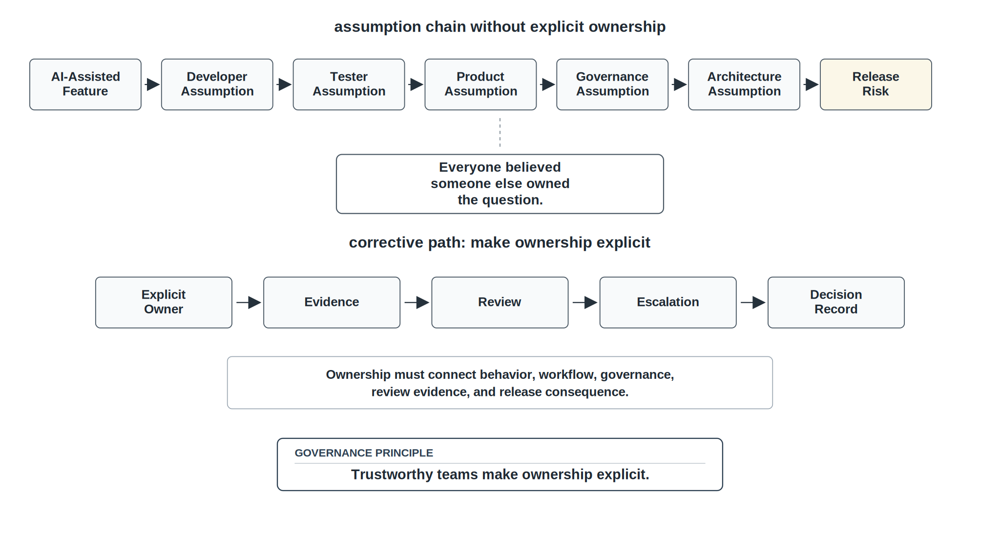
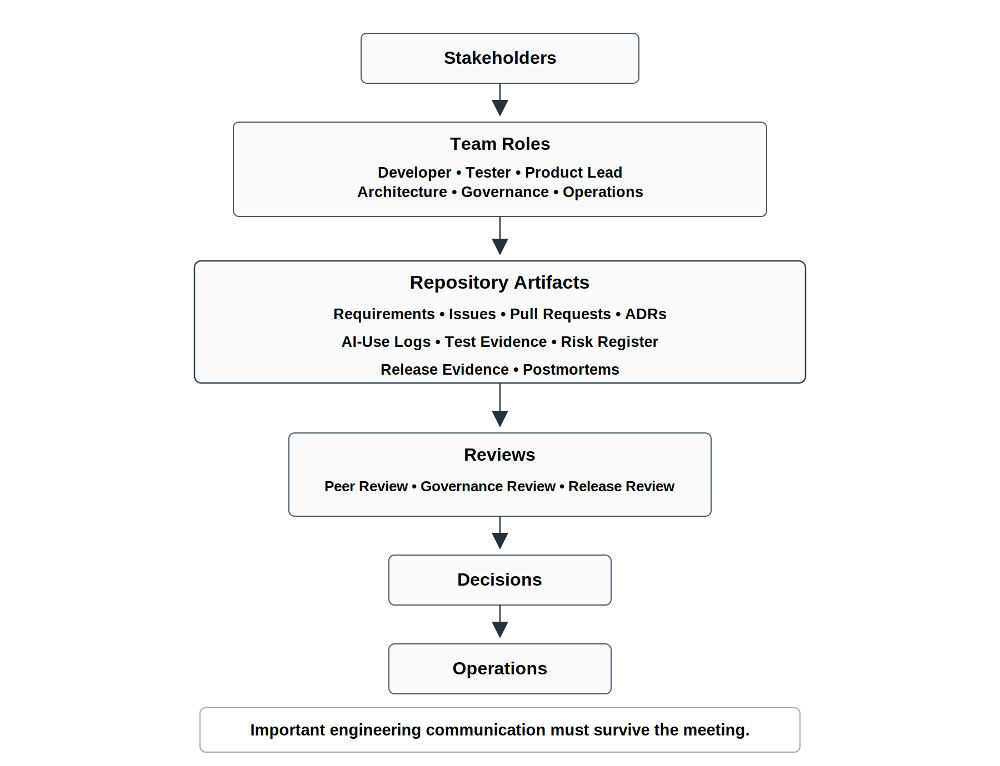
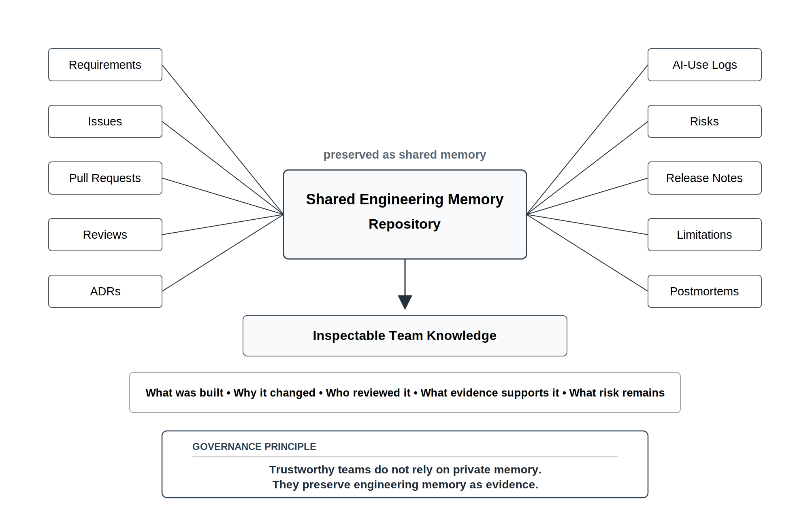
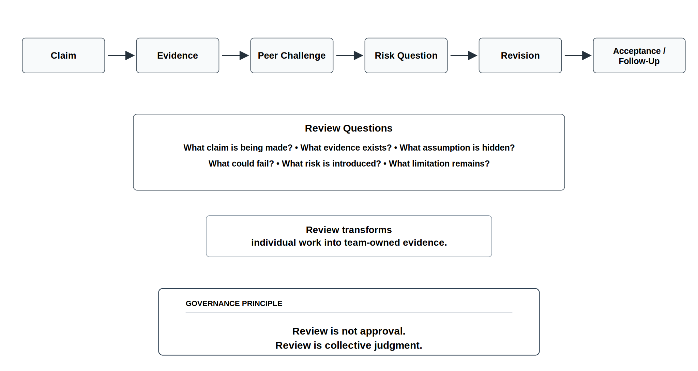
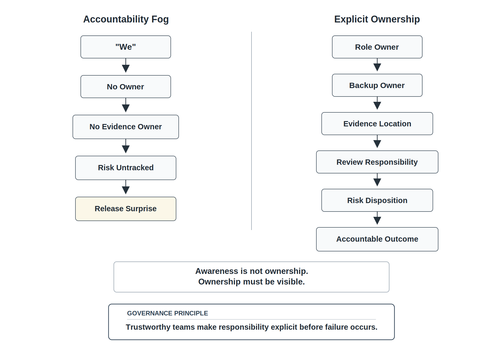

# Chapter 7 Teams, Communication, Review, and Accountability

## Opening Scenario: Everyone Thought Someone Else Checked It

By the time Lakeside Metropolitan University (LMU) reached the next review of the Campus Operations and Incident Coordination Platform, the COICP team had become more capable than it had been at the start of the project.

The team had learned that software systems are larger than code. It had learned that lifecycle models are coordination strategies, not religious commitments. It had learned that AI changes the speed and pressure of the lifecycle. It had learned that human oversight is not passive watching, but active engineering judgment applied where consequences matter.

And still, the team almost missed one of the most important questions in the system.

The issue appeared during review of the AI-assisted escalation recommendation feature. The feature was designed to help classify incidents, suggest an escalation path, recommend the responsible department, and draft notification text. It was not supposed to make final decisions on its own. Human approval remained part of the workflow.

On paper, that sounded controlled.

In practice, the team had a coordination gap.

The developer believed the tester had reviewed the generated escalation cases.

The tester believed the product lead had confirmed the workflow rules with campus operations.

The product lead believed the governance reviewer had checked the approval boundary.

The governance reviewer believed architecture had evaluated the effect on the broader workflow.

The architecture reviewer believed the pull request made the assumptions clear.

The team lead believed the repository evidence was complete because several files had been updated.

Everyone believed someone had checked the central question:

When may the system recommend escalation without exposing sensitive information or bypassing department authority?

No one had actually owned that question.

The problem was not laziness. The problem was not lack of talent. The problem was not that the team did not care. The problem was that responsibility was distributed in a way that made ownership vague. Each person saw part of the work. No one was explicitly responsible for connecting the technical behavior, the operational workflow, the governance boundary, the review evidence, and the release consequence.

The review board stopped the release candidate.

That decision frustrated the team at first. The feature appeared to work. The recommendation examples looked reasonable. The user interface was clear. The generated tests passed. The documentation sounded confident.

But the review board was right.

In trustworthy engineering, "I thought someone else checked it" is not a defense. It is a coordination failure.

Software engineering is a team discipline because trust cannot depend on private understanding. It cannot depend on assumptions buried in a meeting, confidence hidden in a chat message, or knowledge held by one person who happens to be present. Trustworthy teams make responsibility visible. They make decisions reviewable. They make evidence inspectable. They make risks owned. They make disagreement possible. They make accountability explicit.

That is the final lesson of Part I.

Trustworthy intelligent systems require trustworthy engineering teams.

*Figure 7.1 — Coordination Failure: Everyone Thought Someone Else Checked It*

---

## 7.1 Software Engineering Is a Team Discipline

It is tempting to describe software engineering as the work of individuals: one person writes code, another writes tests, another reviews, another manages the schedule, another talks to stakeholders. That description is incomplete.

Modern software engineering is not individual output multiplied by headcount. It is coordinated judgment across people, artifacts, tools, evidence, and operational consequences.

A useful system emerges only when many forms of work fit together:

- requirements must reflect real needs,
- architecture must define boundaries and responsibilities,
- implementation must respect those boundaries,
- tests must verify meaningful behavior,
- reviews must challenge assumptions,
- governance must control authority,
- releases must be defensible,
- operations must be observable,
- failures must be recoverable,
- and decisions must remain understandable over time.

No single person sees all of this perfectly. Even in a small team, understanding is distributed. One person knows the user workflow. Another knows the data model. Another knows the test suite. Another knows the deployment environment. Another understands policy constraints. Another remembers why a decision was made two weeks ago. Another knows which AI-generated suggestion was rejected because it created an unsafe assumption.

That distributed understanding is powerful when coordinated well.

It is dangerous when left implicit.

The solo-genius myth is especially harmful in AI-era engineering. AI can make individual contributors appear more productive by helping them generate code, tests, documentation, and design alternatives quickly. But trustworthy systems are not produced by private acceleration alone. They are produced when teams can inspect, challenge, verify, govern, and own the work together.

A brilliant individual can still create unreviewable work. A fast developer can still create operational risk. A skilled AI user can still generate artifacts that no one else understands. A confident team can still release a system whose assumptions were never shared.

Software engineering is a team discipline because the system must survive beyond any one person's memory, intention, or local confidence.

Trust cannot depend on private understanding.

---

## 7.2 Communication Is Engineering Infrastructure

Communication is often treated as a soft skill. That framing is too weak for professional engineering.

Communication is engineering infrastructure.

It is part of how the team controls risk, preserves context, coordinates work, and prevents misunderstanding from becoming operational failure. When communication is weak, the engineering system is weak.

Poor communication creates hidden assumptions. A developer assumes a requirement means one thing while the stakeholder meant another. A tester assumes a boundary was reviewed. A governance reviewer assumes architecture considered the workflow consequence. A release lead assumes the known limitation was documented. A future maintainer assumes the repository tells the whole story when the real decision was made in a chat message that nobody preserved.

Poor communication also creates duplicated work, stale decisions, mismatched expectations, shallow reviews, unowned risks, and operational surprises.

Strong communication does not mean more meetings. It does not mean longer status updates. It does not mean constant messaging.

Strong communication means the right information reaches the right people at the right time in a form that survives long enough to be useful.

That last phrase matters.

Important engineering communication must survive the meeting.

A meeting can clarify a decision, but the decision must be preserved somewhere. A chat message can resolve confusion, but the resolution must update the relevant artifact. A hallway conversation can expose a risk, but that risk must be named, owned, and tracked. A review comment can identify a defect, but the correction must connect to evidence.

Professional communication is not only interpersonal. It is also artifact-based. Requirements documents, issues, pull requests, architecture decision records, AI-use logs, test evidence, release notes, risk registers, and postmortems are communication systems. They allow the team to remember, challenge, transfer, and improve engineering knowledge over time.

In a trustworthy team, communication does not disappear after people leave the room.

It becomes evidence.

*Figure 7.2 — Communication as Engineering Infrastructure*

---

## 7.3 The Repository as Team Memory

A team that depends on private memory is fragile.

People forget. People misunderstand. People leave. People become unavailable. People remember decisions differently. People assume others know what they know. AI-assisted work makes this harder because generated artifacts can appear quickly and move across the team before their assumptions are fully understood.

The repository exists to reduce that fragility.

The repository is the team’s operational memory.

It preserves what the team is building, why it matters, what changed, who reviewed it, what evidence supports it, what risks remain, how AI was used, what limitations exist, and what must be done next.

This is why repository-centered engineering is not merely a tooling preference. It is a team accountability mechanism.

The repository should answer questions that would otherwise depend on private explanation:

What requirement is this feature connected to?

What issue authorized this work?

What branch or pull request contains the change?

Who reviewed it?

What tests were run?

What risks were identified?

What AI assistance was used?

What was accepted, rejected, or modified?

What decision record explains the design?

What known limitation remains?

Who owns the follow-up?

If a reviewer, instructor, teammate, future maintainer, or operations lead cannot answer those questions from the repository, the team’s memory is incomplete.

The repository does not replace conversation. It preserves the engineering consequences of conversation.

A team still needs meetings, discussion, debate, clarification, and informal coordination. But important engineering knowledge must eventually land somewhere durable. Otherwise the team cannot review it, improve it, transfer it, audit it, or learn from it.

The repository is not where teamwork ends.

It is where teamwork becomes inspectable.

*Figure 7.3 — Repository as Team Memory*

---

## 7.4 Review Is How Teams Think Together

Review is often misunderstood.

Weak teams treat review as approval. Someone looks at the work, says it is fine, and the team moves on. Worse, review becomes a checkbox: a formal step that exists in the process but does not materially improve engineering quality.

Trustworthy teams treat review differently.

Review is how teams think together.

Review allows one person’s work to become team-owned engineering evidence. It lets the team challenge assumptions, improve designs, verify claims, expose risks, identify missing tests, evaluate AI-assisted work, protect future maintainers, and prevent operational harm.

Review is not merely defect detection. It is collective judgment.

A good reviewer asks:

What claim is this work making?

What evidence supports the claim?

What assumption is hidden here?

What could fail?

What requirement does this satisfy?

What risk does this introduce?

Does this fit the architecture?

Does this affect data, permissions, escalation, or governance?

Are the tests meaningful?

Can another engineer maintain this?

Was AI used, and if so, how was the output verified?

What limitation should be documented?

These questions are not hostile. They are professional.

A review culture that cannot challenge work is not kind. It is unsafe. It allows weak assumptions to remain hidden until they become defects, incidents, governance failures, or release surprises.

At LMU, the escalation recommendation feature did not need reviewers who merely admired the working demo. It needed reviewers who could ask whether the recommendation logic respected authority boundaries, whether generated tests covered sensitive cases, whether notification text minimized information exposure, whether human approval was meaningful, and whether repository evidence supported release claims.

That kind of review protects the team.

Review is an engineering safety mechanism.

*Figure 7.4 — Review Is How Teams Think Together*

---

## 7.5 Productive Disagreement and Professional Challenge

Trustworthy teams must be able to disagree.

That does not mean teams should be combative. It does not mean every decision requires endless debate. It does not mean senior voices should dominate or that reviews should become personal attacks.

It means the team must be able to challenge engineering claims without treating challenge as disrespect.

Professional disagreement asks:

What evidence supports this?

What assumption are we making?

What could fail?

Who is affected if this is wrong?

What risk are we accepting?

What alternatives did we consider?

What will we observe after release?

Who owns the outcome?

These questions are essential because false harmony is dangerous. A team can appear aligned because nobody objects. But silence is not alignment.

Silence may mean confusion. It may mean fatigue. It may mean junior members do not feel safe speaking. It may mean reviewers are overloaded. It may mean nobody has enough context to challenge the work. It may mean people assume someone else already checked the issue.

In engineering, the absence of visible disagreement is not proof of shared understanding.

A mature team makes disagreement usable. It creates review practices, decision records, risk registers, and escalation paths so that challenge improves the work instead of becoming personal conflict.

This matters especially when AI is involved. AI-generated output can sound confident. It can create the impression that an answer has already been reasoned through. Team members may hesitate to challenge output that appears polished, especially if they did not generate it themselves.

The team must make challenge normal.

A useful engineering culture does not ask, “Who is criticizing this?”

It asks, “What risk are we protecting the system from?”

---

## 7.6 Accountability Is Explicit Ownership, Not Blame

Accountability is often confused with blame.

That confusion damages engineering culture. If accountability means punishment, people hide uncertainty. They avoid documenting risks. They soften bad news. They treat review as personal judgment. They become defensive when defects appear.

That is not the accountability this book means.

Accountability means explicit ownership of work, decisions, evidence, risks, and outcomes.

A trustworthy team names who owns a requirement, who owns an architecture decision, who owns a risk, who owns a test gap, who owns release notes, who owns AI-use logging, who owns operational follow-up, and who owns known limitations.

Accountability also means backup ownership. If only one person can explain a decision, the team is fragile. If only one person can run the system, the team is fragile. If only one person understands the AI-assisted workflow, the team is fragile.

Accountability is not the opposite of blamelessness.

Blameless does not mean accountability-free.

A blameless culture investigates failure without scapegoating. But it still asks what happened, what evidence was missing, what decision failed, what process failed, what owner was unclear, what control was weak, and what must change.

Honest engineering is mature engineering.

The team should be able to say:

This risk is real.

This limitation remains.

This evidence is incomplete.

This AI-generated output was rejected.

This release claim is not yet supported.

This decision needs review.

This owner is responsible for follow-up.

That is accountability.

It is not blame. It is how teams keep trust from becoming vague.

---

## 7.7 AI Makes Team Coordination More Important

AI does not remove the need for team coordination.

It increases it.

When AI helps produce more artifacts faster, teams must coordinate what those artifacts mean, who reviewed them, what was accepted, what was rejected, and what evidence supports their use.

AI-assisted teams must be clear about:

- who may use AI,
- what AI may be used for,
- what must be disclosed,
- what requires review,
- what evidence is needed,
- what generated output was rejected,
- what generated output was accepted,
- who modified the output,
- who verified the result,
- and who owns the resulting decision.

The danger is not simply that AI might produce an error. The danger is that AI-generated work can move into the team’s shared system without the team developing shared understanding.

A developer may use AI to generate escalation logic. A tester may use AI to generate test cases. A product lead may use AI to summarize stakeholder needs. A governance reviewer may use AI to draft a checklist. Each use may be reasonable in isolation. But if the team does not disclose, connect, review, and verify those artifacts together, the result can be a system of uncoordinated assumptions.

AI-assisted work becomes team-owned when the team accepts it.

That sentence matters.

A team cannot say, “The AI wrote it,” after the work is merged. It cannot say, “The tool suggested it,” after the release creates operational harm. It cannot say, “No one noticed,” after weak review lets a governance issue through.

The team owns accepted work.

That is why AI-use transparency is not an administrative burden. It is a coordination mechanism. It tells reviewers where to look more carefully. It tells future maintainers what assumptions may require scrutiny. It tells release leads which claims need evidence. It tells governance reviewers where authority boundaries may have been affected.

AI increases the need for team-level engineering discipline.

---

## 7.8 LMU Evolves from Capable Individuals to an Accountable Team System

The COICP team responds to its coordination failure by changing how it works.

It does not solve the problem by adding more meetings. More meetings can create the appearance of coordination without producing evidence. LMU needs clearer ownership, better review expectations, and stronger repository memory.

The team first clarifies roles. It names owners for requirements, architecture, testing, AI-use evidence, governance review, release evidence, and operational follow-up. It also names backup owners because professional accountability cannot depend on one person always being available.

The team updates its working agreements. Important decisions must be captured in the repository. AI-assisted work must be disclosed in pull requests or AI-use logs. Risks must have owners. Known limitations must be visible before release. Reviewers must challenge evidence, not merely approve changes.

The team improves its pull request discipline. PRs must link to issues, describe what changed, identify tests run, disclose AI assistance when relevant, name risks, and update evidence artifacts when needed.

The team strengthens its review culture. Reviewers are expected to ask about requirements, architecture fit, test depth, governance impact, operational consequence, and maintainability. For AI-assisted work, reviewers also ask what was generated, what was changed, what was rejected, and what evidence verifies the result.

The team improves its risk register. Risks are no longer vague statements such as “governance issue” or “testing incomplete.” Each risk has an owner, severity, mitigation, status, and evidence location.

The team prepares more deliberately for review boards. Instead of treating reviews as presentations, the team treats them as engineering checkpoints where claims must be supported by evidence.

This is coordination maturity.

The team is not simply communicating more.

It is making responsibility visible to the people who need to rely on it.

---

## 7.9 Repository Evolution in Chapter 7

Chapter 7 strengthens the repository as a team coordination system.

The root `README.md` becomes the operational front door. It should explain the project, current status, how to inspect or run the system, where evidence lives, what risks remain, and how the repository workflow is governed.

The team charter belongs in:

`/docs/team-charter.md`

It explains the team’s purpose, working expectations, communication norms, and shared commitments.

Roles belong in:

`/docs/roles.md`

This file should name primary owners and backup owners for major areas of work. Ownership should not be vague. A reviewer should be able to see who is responsible for requirements, architecture, testing, AI evidence, release evidence, and governance follow-up.

Working agreements belong in:

`/docs/working-agreements.md`

These agreements should define how the team communicates, how decisions are recorded, how review is handled, how conflicts are escalated, and how AI use is disclosed.

Risks belong in:

`/docs/planning/risk-register.md`

The risk register should show unresolved risks, owners, mitigations, status, and evidence location.

Reviews belong in:

`/docs/reviews/`

Review evidence should show not only that review occurred, but what was challenged, what changed, what risks remain, and what evidence supports acceptance.

AI-use evidence belongs in:

`/docs/ai/ai-use-log.md`

The log should preserve AI-assisted work, accepted output, rejected output, human modifications, verification evidence, and remaining risk.

Decision records belong in:

`/docs/decisions/`

Important architecture, governance, AI, and workflow decisions should not remain only in meetings or chat messages.

Known limitations belong in:

`/docs/release/known-limitations.md`

Known limitations should be honest, visible, owned, and connected to release judgment.

The repository is not a filing cabinet.

It is the team’s visible coordination system.

---

## 7.10 Anti-Pattern: Accountability Fog

The primary anti-pattern in this chapter is accountability fog.

Accountability fog occurs when everyone is involved enough to assume someone else owns the issue, but no one is explicitly responsible for the decision, evidence, risk, or outcome.

It is common because it feels like teamwork. Many people are aware of the work. Many people have discussed it. Many people have touched part of it. Many people believe someone has checked the important question.

But awareness is not ownership.

Accountability fog appears in several ways:

The team says “we need to update the tests,” but no one owns the update.

A risk is discussed in a meeting, but no one enters it into the risk register.

A pull request receives approval, but no reviewer takes responsibility for challenging the key assumption.

AI-generated output is accepted, but no human owner can explain why it is correct.

A known limitation appears in conversation, but not in release evidence.

A governance concern is raised, but no one records the decision.

A release claim is made, but no one owns the proof.

This anti-pattern is dangerous because it hides in collaborative environments. The more people are near the work, the easier it becomes to assume responsibility is covered.

Trustworthy engineering counters accountability fog by making ownership explicit.

Every meaningful risk needs an owner.

Every important decision needs a record.

Every consequential change needs review.

Every release claim needs evidence.

Every accepted AI-assisted artifact needs human ownership.

Every known limitation needs visibility.

Every unresolved issue needs a next action.

Accountability fog is not solved by blaming the team after failure. It is solved by designing team practices that make responsibility visible before failure.

*Figure 7.5 — Accountability Fog vs Explicit Ownership*

---

## 7.11 Team Accountability Review

Chapter 7’s review-board mechanism is the Team Accountability Review.

The purpose of this review is to evaluate whether the team’s communication, ownership, review, evidence, and accountability structures are strong enough to support trustworthy engineering.

This review should not ask only whether the team is busy. Busy teams can still be fragile. It should not ask only whether the team is friendly. Friendly teams can still avoid hard questions. It should not ask only whether the team has documents. Documents can exist without controlling anything.

The Team Accountability Review asks whether the team can responsibly continue.

Core questions include:

Who owns each major area of work?

Who is the backup owner?

What decisions were made, and where are they recorded?

What assumptions remain unresolved?

What risks remain, and who owns them?

What AI-assisted work was accepted, rejected, or modified?

Who reviewed consequential changes?

What evidence supports current claims?

What work depends on private knowledge?

If a team member is unavailable, can another engineer continue responsibly?

These questions are practical. They expose whether the team’s coordination system is real.

A trustworthy team should be able to show its work. It should be able to point to issues, pull requests, reviews, risk registers, AI-use logs, decision records, release notes, and known limitations. It should be able to name owners and backup owners. It should be able to explain what remains uncertain.

The review is not about creating perfect process.

It is about preventing trust from depending on invisible assumptions.

---

## 7.12 Trustworthiness Mapping

Chapter 7 strengthens several trustworthiness pillars, especially accountability.

Accountability is the primary pillar in this chapter. Ownership, review responsibility, decision authority, risk follow-up, and release claims must be explicit. Trustworthy teams do not hide behind vague collective responsibility.

Traceability is strengthened because team decisions must connect to evidence. Requirements, issues, pull requests, reviews, tests, risks, release notes, and AI-use logs preserve how the team moved from intent to action.

Reviewability is strengthened because work must be inspectable by other humans. A system that only one person understands is not sufficiently reviewable.

Human Oversight is strengthened because oversight becomes a team practice, not merely an individual action. The team must know who reviews consequential work, who approves authority changes, and who owns accepted AI-assisted output.

Operational Visibility is strengthened because the team must understand the state of work, risks, limitations, responsibilities, and readiness.

Governability is strengthened because roles, approval boundaries, escalation paths, and decision authority become visible.

Recoverability is strengthened because teams recover better when ownership, evidence, and communication paths are clear.

Security is strengthened because security risks are less likely to be missed when review responsibilities and governance escalation paths are explicit.

The chapter reinforces a core idea:

Trustworthiness is not only a system property. It is also a team property.

A system cannot remain trustworthy if the team responsible for it cannot communicate, review, own, and learn.

---

## 7.13 Operational Takeaways

Trust cannot depend on private understanding.

Software engineering is a team discipline.

Communication is engineering infrastructure.

Important engineering communication must survive the meeting.

The repository is the team’s operational memory.

Review is how teams think together.

Silence is not alignment.

Accountability is explicit ownership, not blame.

AI-assisted work becomes team-owned when the team accepts it.

Blameless does not mean accountability-free.

Trustworthy engineering is a team capability.

---

## 7.14 Exercises

### Exercise 1: Identify Accountability Fog

A team reports that:

> "We reviewed the AI-assisted escalation feature."

However, no one can identify:

- Who reviewed the governance boundary
- Who reviewed generated test cases
- Who approved release limitations
- Where review evidence was recorded

Identify the accountability fog.

Document:

- Missing ownership assignments
- Missing review responsibilities
- Missing evidence
- Associated risks

Explain why accountability becomes difficult when responsibility is not visible.

### Exercise 2: Map Communication to Evidence

A project team makes the following decisions during a meeting:

- After-hours incident escalation requires human approval.
- Student-facing notification text must avoid sensitive details.
- Generated escalation recommendations must be logged.

For each decision:

- Identify what type of engineering evidence should exist.
- Explain where the decision should be preserved.
- Determine whether the decision should become a requirement, architecture note, review item, risk, or future ADR candidate.

Explain how important decisions can disappear when communication is not preserved.

### Exercise 3: Analyze Review Responsibility

A pull request contains:

- Generated code
- Generated tests
- Documentation updates

The reviewer approves the change with the comment:

> "Looks good."

Evaluate whether this represents meaningful review.

Identify:

- Questions the reviewer should have asked
- Evidence that should have been examined
- Risks that may have been overlooked

Explain why approval and review are not the same activity.

### Exercise 4: Evaluate AI-Use Accountability

An AI-use log entry states:

> "Used AI to help with escalation workflow."

Identify what information is missing.

Determine:

- Who owns the accepted output
- What verification should have occurred
- What evidence should have been preserved
- What risks remain unclear

Rewrite the entry so that it supports professional accountability.

### Exercise 5: Conduct a Team Accountability Review

Act as the Team Accountability Review board for the COICP project.

The team claims it is ready to proceed into project launch and implementation activities.

Evaluate:

- Communication discipline
- Ownership clarity
- Review practices
- AI-use accountability
- Evidence preservation

Document:

- Strengths
- Weaknesses
- Missing evidence
- Open risks
- Required corrective actions

Determine whether the team is:

- Ready to proceed
- Ready with conditions
- Not ready

Justify the decision using available evidence.

## Closing Part I: From Worldview to Engineering Practice

Part I began with a simple but demanding claim: software engineering matters more in the AI era, not less.

AI can generate artifacts. It can accelerate drafts, code, tests, summaries, documentation, and recommendations. But artifact production is not the same as trustworthy engineering.

Trustworthy engineering requires systems thinking. It requires lifecycle discipline. It requires evidence. It requires review. It requires governance. It requires operational visibility. It requires human judgment. It requires meaningful oversight. And, as this chapter has shown, it requires teams that can communicate, challenge, document, and own work together.

The first seven chapters have moved from the individual artifact to the larger engineering system:

Software is not just code.

A project is not just tasks.

A lifecycle is not just a process label.

AI output is not verified truth.

Human oversight is not symbolic approval.

Teamwork is not vague cooperation.

Trustworthy intelligent systems require disciplined sociotechnical coordination under uncertainty.

That is the worldview of Part I.

Part II now begins the construction arc.

The next question is practical:

How does a team begin operating this way from the first project decision?

That is the role of Chapter 8: Project Launch and Engineering Standards.

Chapter 7 closes the worldview arc.

Chapter 8 begins the engineering execution arc.
