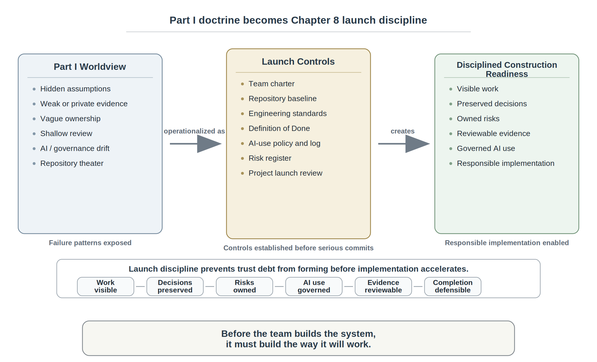
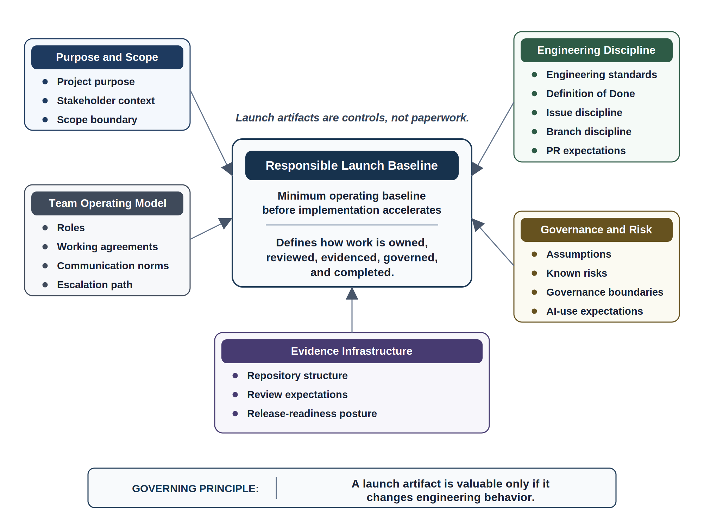
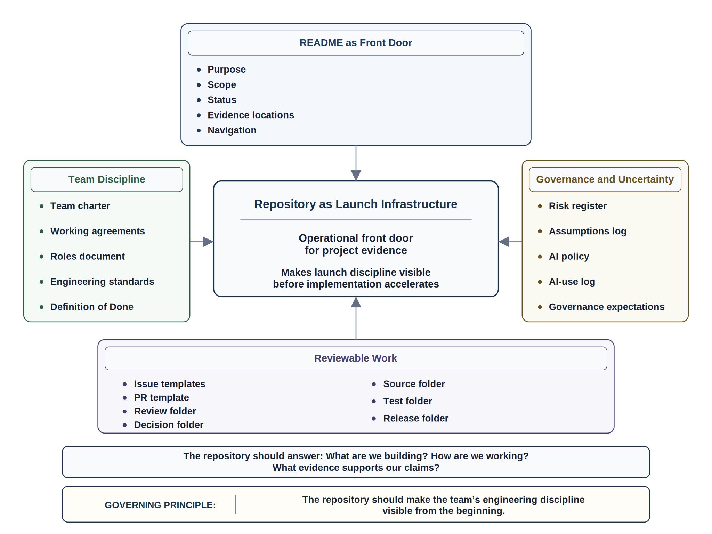
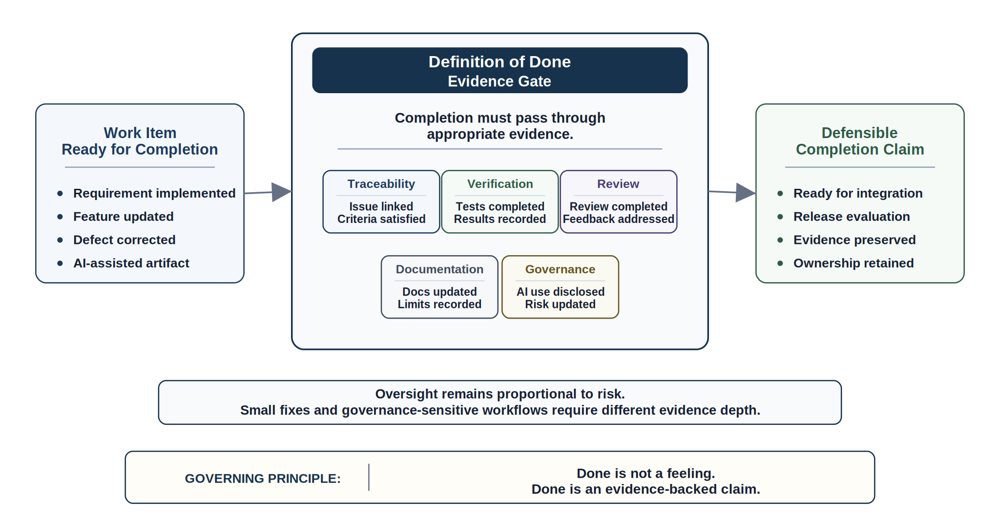
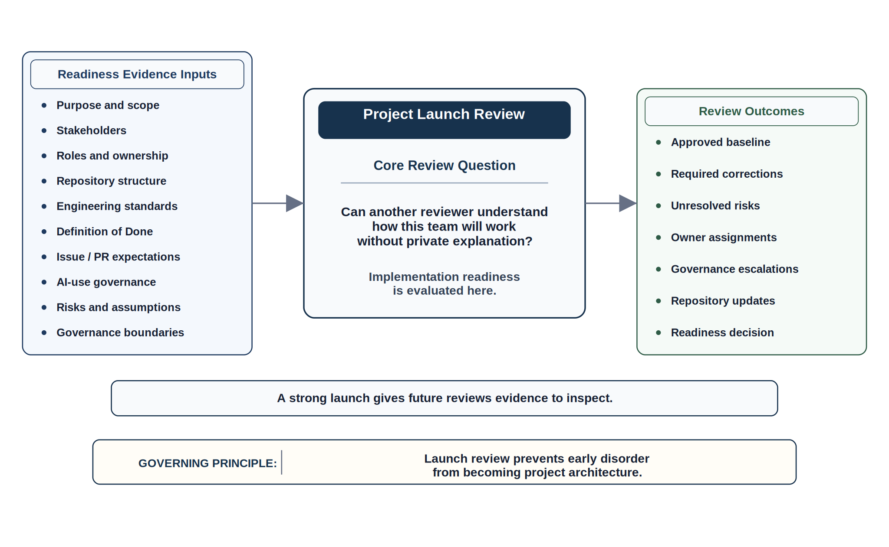

# Chapter 8  Project Launch and Engineering Standards

## Opening Scenario: Before the First Serious Commit

By the time Lakeside Metropolitan University (LMU) prepared to move the Campus Operations and Incident Coordination Platform into a formal student engineering project, the team felt ready to build.

The problem was real. The university had already seen how fragile coordination could become when departments worked from partial information, when operational truth fragmented across local systems, and when decisions were remembered privately instead of preserved as evidence. Facilities wanted faster incident routing. Campus Safety wanted dependable escalation. Student Services wanted fewer surprises. Campus Operations wanted visibility. Leadership wanted progress. Students wanted reliable service. Governance wanted assurance that AI-assisted workflows would not quietly change authority, expose sensitive information, or route consequential decisions without human accountability.

The team opened a repository.

That felt like a beginning.

Within minutes, the project started moving in several directions at once. One student wanted to build the incident intake form. Another wanted to use AI to draft user stories. A third wanted to sketch architecture. Someone created a project board. Someone else began writing a README. Another teammate proposed a branch naming pattern. A reviewer asked what the team meant by done. A governance stakeholder asked whether AI-generated escalation suggestions would be allowed in early prototypes. The faculty sponsor asked who would own release readiness. Operations asked who would approve stakeholder-facing language. Nobody disagreed that these questions mattered. But no one could yet point to where the answers lived.

The team had energy. It had a repository. It had a problem worth solving. It even had tools that could generate requirements, tests, diagrams, code scaffolds, and documentation quickly.

But the team was not ready to code responsibly.

Not because coding was unimportant. Not because the team needed a pile of ceremonial documents. Not because professional engineering begins with bureaucracy.

The team was not ready because implementation without launch discipline would recreate the same weaknesses Part I exposed: hidden assumptions, weak evidence, vague ownership, shallow review, unclear AI use, governance drift, and repository theater. If the team started building before it defined how work would be owned, reviewed, evidenced, governed, and completed, then the project would begin accumulating trust debt before the first major feature existed.

Before the team could build the system, it had to build the way it would work.

That is the point of project launch.

A trustworthy project does not begin when coding starts. It begins when the team defines how work will be made visible, how decisions will be preserved, how risks will be owned, how AI assistance will be governed, how review will happen, and what evidence will support claims of progress.

Starting fast is not the same as starting responsibly.

*Figure 8.1 — From Worldview to Launch Discipline*

---

## 8.1 Project Launch Is an Engineering Act

Project launch is often treated as administrative overhead. A team meets, divides responsibilities, creates a repository, chooses tools, writes a few early tasks, and then begins implementation. In student projects, this can feel efficient. In professional engineering, it is dangerous.

A project launch is not a ceremony. It is an engineering act.

Launch establishes the operating conditions under which every later decision will be made. It shapes how the team understands the problem, how it records decisions, how it assigns ownership, how it handles uncertainty, how it uses AI, how it reviews work, how it proves progress, and how it responds when reality disagrees with the plan.

The central mistake is to think that launch happens before engineering begins. In trustworthy engineering, launch is engineering. It defines the system of work that will produce the software system.

A weak launch creates predictable failure conditions. If scope is vague, the team will argue later about what it promised. If roles are unclear, risks will become everyone’s concern and no one’s responsibility. If the repository has no evidence structure, important decisions will drift into chat messages, meetings, and memory. If pull request expectations are undefined, review will become inconsistent. If AI use is not governed, generated output may enter the project without disclosure, verification, or ownership. If the Definition of Done is missing, completion will become a feeling rather than an evidence-backed claim.

Those are not minor startup issues. They are early trust failures.

At LMU, the COICP team had already learned that software projects fail before failure is visible. It had seen that local success can still become system failure. It had learned that AI accelerates output without removing accountability. It had learned that teams must make communication, evidence, review, and ownership visible. Chapter 8 turns those lessons into launch behavior.

A mature launch does not guarantee success. It does something more practical: it makes future work inspectable. It gives the team and its reviewers a way to ask whether the project is still aligned with its purpose, whether risks are owned, whether evidence exists, whether AI-assisted work has been verified, and whether standards are shaping behavior.

The first test of engineering maturity is not whether the team can write code quickly. It is whether the team can define how trustworthy work will be produced.

**Principle:** A project launch is the first test of engineering maturity.

---

## 8.2 Start With the System of Work, Not the Code

The system of work is the set of agreements, artifacts, roles, evidence paths, reviews, and decisions that determine how the team will produce and maintain the system. It includes people, workflows, repository structure, communication habits, review expectations, standards, and governance boundaries.

The system of work is not separate from the software. It shapes the software.

A team that works through vague tasks will produce vague evidence. A team that allows large unreviewable changes will produce weak review history. A team that accepts AI-generated output without disclosure will create unverifiable assumptions. A team that stores key decisions in private messages will make future maintenance dependent on memory. A team that treats standards as optional will turn every disagreement into a local negotiation.

This is why Chapter 8 begins with the system of work.

Before serious implementation begins, the team should be able to answer several questions:

Who owns the major areas of work? How will backup ownership work if someone is unavailable? Where will decisions be recorded? How will issues be written? What makes a branch acceptable? What makes a pull request reviewable? What must be disclosed when AI is used? What evidence must accompany a claim of completion? What risks are already visible? What governance boundaries are known? What happens when the team discovers uncertainty it cannot resolve locally?

These questions do not delay engineering. They prevent the team from confusing activity with maturity.

At LMU, the COICP project involved multiple stakeholder pressures. Campus Operations cared about coordination. Student Services cared about affected students. Campus Safety cared about escalation. Governance cared about authority and privacy. IT cared about integration and maintenance. Students cared about reliable service. A code-first team could easily build something that looked useful but embedded the wrong assumptions about who should see what, who may approve what, and when recommendations become operational actions.

Starting with the system of work forces the team to make those questions visible before implementation hardens them into architecture.

A trustworthy team does not rely on private understanding. It designs work so that future reviewers can reconstruct what happened, why it happened, who reviewed it, what evidence supported it, and what risk remained.

**Principle:** The team’s workflow is part of the engineered system.

---

## 8.3 The Launch Standard: What Must Exist Before Real Implementation

A responsible launch baseline is the minimum set of artifacts and agreements needed before implementation accelerates. It does not need to be elaborate. It does need to be real.

A launch baseline should include project purpose, stakeholder context, scope boundary, initial assumptions, known risks, repository structure, team roles, working agreements, engineering standards, Definition of Done, issue discipline, branch discipline, pull request expectations, review expectations, AI-use expectations, governance boundaries, communication norms, escalation path, and initial release-readiness posture.

*Figure 8.2 — Project Launch Baseline*

Each element exists because it prevents a predictable failure mode.

Project purpose prevents the team from confusing local tasks with mission. Stakeholder context prevents the system from being designed only around the developers’ mental model. Scope boundary prevents ambition from becoming uncontrolled expansion. Assumptions and risks prevent uncertainty from becoming invisible. Repository structure prevents evidence from scattering. Roles and working agreements prevent accountability fog. Engineering standards prevent repeated local debates. Definition of Done prevents premature completion claims. Issue and branch discipline preserve traceability. Pull request and review expectations preserve reviewability. AI-use expectations preserve disclosure and verification. Governance boundaries prevent authority drift. Communication norms prevent important decisions from evaporating after meetings.

The point is not to create documents because documents look professional. The point is to create artifacts that change behavior.

A weak launch artifact says, “We will write clean code.” A useful launch artifact says what clean code means for this project, where the standard lives, how reviewers will apply it, and what happens when code violates it.

A weak AI policy says, “Use AI responsibly.” A useful AI policy says what AI may be used for, what must be disclosed, what requires human verification, what may not be accepted without review, and where AI-use evidence is recorded.

A weak Definition of Done says, “Feature works.” A useful Definition of Done says what evidence must exist before the team may claim that work is complete.

The launch standard should be lightweight enough to use and strong enough to matter. A standard that is too heavy becomes theater. A standard that is too vague becomes decoration. A mature launch baseline sits between those extremes: concrete, reviewable, teachable, and enforceable.

For the COICP team, the launch standard becomes the bridge between Part I worldview and Part II construction. The team is no longer merely saying that evidence, governance, review, and accountability matter. It is defining where those responsibilities will live.

**Principle:** A launch artifact is valuable only if it changes engineering behavior.

---

## 8.4 Team Charter and Working Agreements

A team charter is often misunderstood as a motivational document. In trustworthy engineering, it is an operating artifact.

The charter should define why the team exists, what it is responsible for, how decisions will be made, how conflict will be handled, how work will be reviewed, how evidence will be preserved, how AI assistance will be disclosed, and how accountability will remain visible.

The working agreements translate that charter into daily behavior. They answer practical questions. How quickly should teammates respond to review requests? What counts as blocking work? When does a decision need to become a repository artifact? How are disagreements escalated? Who may approve changes? What happens when someone cannot complete assigned work? How does the team handle AI-generated contributions? How are risks updated?

This matters because teams often fail through ambiguity rather than bad intent.

Everyone wants to help. Everyone wants the project to succeed. Everyone assumes someone else is handling the missing piece. That is how accountability fog forms.

Chapter 7 showed that trustworthy engineering is a team capability. Chapter 8 operationalizes that claim. The charter and working agreements make team behavior inspectable. They reduce dependence on personality, memory, and private interpretation.

At LMU, this is especially important because COICP is not a toy application. Even in its student-project form, it represents a university environment with operational consequences. The team must coordinate work involving incident intake, routing, escalation, role boundaries, stakeholder expectations, and possible AI assistance. A vague team agreement will not be enough.

A useful team charter should include role ownership and backup ownership. If one person owns the AI-use log, another person should know how to maintain it. If one person owns release notes, another should be able to verify them. If one person owns governance questions, that responsibility should not disappear when the person misses a meeting.

A useful working agreement should also normalize professional challenge. The team should expect questions such as: What evidence supports this? Who owns this risk? Is this AI-assisted? What assumption are we making? Does this require governance review? Can someone outside the team understand this decision from the repository?

Those questions are not signs of distrust. They are how a trustworthy team thinks.

**Principle:** A team charter turns vague collaboration into explicit operating discipline.

---

## 8.5 Engineering Standards Are Controls

Engineering standards are not style preferences disguised as rules. They are controls that help a team produce work that can be understood, reviewed, changed, tested, governed, and maintained.

A coding standard helps future readers understand implementation choices. A documentation standard helps reviewers know where to find evidence. A branch standard supports traceability. A pull request standard makes review possible. A testing standard supports correctness claims. An AI-use disclosure standard supports human verification. A logging standard prepares observability. A security standard prevents obvious negligence. A release evidence standard prevents confidence from replacing proof.

The word “standard” can sound rigid, but mature standards create freedom. They reduce unnecessary negotiation. They make expectations visible. They help reviewers focus on engineering risk rather than arguing about basic form. They allow new team members to contribute without guessing how the project works.

The danger is standards theater.

Standards theater happens when a team writes standards that no one uses, reviews, updates, or enforces. The repository contains impressive documents, but pull requests ignore them. The Definition of Done exists, but completion claims bypass it. The AI-use policy exists, but generated work appears without disclosure. The review template asks meaningful questions, but reviewers type “LGTM” without evidence.

That is worse than having no standard, because it creates false confidence.

For Chapter 8, standards should be introduced as living controls. They should be specific enough to guide work, but not so detailed that students cannot apply them. A launch standard might define how issues are named, how branches connect to issues, what a pull request must include, what reviewers must check, what tests must accompany a change, what documentation must be updated, and when governance concerns must be escalated.

The COICP team does not need enterprise-scale process on day one. It does need enough discipline to avoid invisible disorder. It needs standards that turn Part I principles into daily engineering behavior.

A standard should answer three questions. What behavior is expected? Where will evidence appear? How will review verify it?

If a standard cannot answer those questions, it is probably a slogan.

**Principle:** A standard that no one follows is theater. A standard that shapes decisions is engineering control.

---

## 8.6 Repository Launch: From Empty Repository to Engineering Memory

Creating a repository is easy. Launching a repository as engineering memory is harder.

An empty repository does not make a project disciplined. A repository with scattered files, vague folders, unlinked issues, oversized commits, missing decisions, and undocumented AI use can create the appearance of professionalism while preserving little evidence of engineering judgment.

At launch, the repository should become the project’s operational front door. It should help a reviewer understand what the project is, why it exists, how the team works, where evidence lives, what standards apply, what risks are known, how AI may be used, and how work moves from idea to reviewed change.

*Figure 8.3 — Repository as Launch Infrastructure*

For COICP, the repository launch baseline should include a README, team charter, working agreements, roles document, engineering standards, Definition of Done, risk register, assumptions log, AI policy, AI-use log, review folder, decision folder, release folder, source folder, test folder, issue templates, and pull request template.

The README is the front door. It should not merely describe the project in vague terms. It should orient a reviewer to purpose, scope, current status, important links, evidence locations, and how to navigate the repository.

The team charter and working agreements define how collaboration becomes engineering discipline. The roles document shows ownership and backup ownership. Engineering standards show how work should be produced. Definition of Done defines what completion means. The risk register and assumptions log make uncertainty visible. The AI policy and AI-use log preserve governance and verification expectations. Review and decision folders preserve reasoning. Release folders prepare later readiness evidence.

This chapter should not become a GitHub tutorial. The point is not where to click. The point is what the repository must prove.

A trustworthy repository should answer three questions from day one:

What are we building? How are we working? What evidence supports our claims?

If the repository cannot answer those questions, it is not yet functioning as engineering memory.

Repository discipline also protects the team from AI-era confusion. AI can produce many artifacts quickly: requirements, tests, issue drafts, code snippets, architecture notes, and documentation. Without repository evidence discipline, the team may not remember what was generated, what was accepted, what was rejected, what was modified, who verified it, or what risk remained.

That memory must be designed into the repository from launch.

**Principle:** The repository should make the team’s engineering discipline visible from the beginning.

---

## 8.7 Definition of Done Before Work Begins

Teams often define “done” too late.

They wait until a feature looks complete, a demo works, or a deadline approaches. Then they negotiate what completion means. Does done mean the code runs? Does it mean tests pass? Does it mean the pull request was merged? Does it mean documentation was updated? Does it mean governance concerns were addressed? Does it mean the feature is observable? Does it mean known limitations are recorded? Does it mean AI-generated work was verified?

If the team answers those questions after completion is claimed, the Definition of Done becomes a defense mechanism instead of an engineering control.

A mature team defines done before work begins.

*Figure 8.4 — Definition of Done as Evidence Gate*

A trustworthy Definition of Done should require evidence. For COICP, a work item should not be considered done merely because a developer believes it works. At minimum, completion should connect to an issue, requirement or acceptance criterion, implementation evidence, test evidence, review evidence, documentation updates, AI-use disclosure when relevant, risk updates, known limitations, and governance disposition when applicable.

This does not mean every small task requires heavy ceremony. Oversight should remain proportional to risk. A typo fix and an AI-assisted escalation workflow do not require the same evidence. But both require the team to know what evidence is appropriate.

Definition of Done is where the team turns trustworthiness into completion criteria.

For low-risk work, done may mean issue linked, change reviewed, tests unaffected or updated, and documentation unnecessary. For moderate-risk work, done may require acceptance criteria, tests, reviewer comments, documentation, and traceability. For governance-sensitive work, done may also require approval boundary review, AI-use disclosure, risk register update, and known limitations.

The Definition of Done protects against release by confidence. It also protects against synthetic productivity. AI-generated artifacts can look complete before they are understood. A Definition of Done forces generated output through human verification, review, evidence, and ownership.

Done is not the moment the team feels finished. Done is a claim the team can defend.

**Principle:** Done is not a feeling. Done is an evidence-backed claim.

---

## 8.8 AI-Use Standards at Launch

AI-use standards belong at launch because AI habits form early.

If a team begins using AI before defining expectations, AI-generated work will enter the project through private prompts, copied code, polished requirements, generated tests, summarized interviews, draft documentation, and suggested architecture. Some of that work may be useful. Some may be wrong. Some may be subtly misaligned with stakeholder needs. Some may embed governance assumptions. Some may produce confidence without evidence.

The problem is not that AI is used. The problem is ungoverned acceptance.

Chapter 8 should preserve the project’s non-ideological AI position. AI may help draft, explore, summarize, scaffold, and critique. But AI output is proposed engineering material, not verified engineering truth. Once the team accepts AI-assisted work, humans own it.

Launch standards should define what AI may be used for, what AI may not be used for, what must be disclosed, what requires reviewer attention, what requires verification evidence, what may not be accepted without human judgment, and where AI-use records live.

For COICP, AI might reasonably assist with drafting issue descriptions, summarizing stakeholder notes, generating first-pass test ideas, proposing documentation structure, or suggesting edge cases. But AI should not independently decide escalation authority, privacy-sensitive routing rules, department ownership, stakeholder-facing messages, or release readiness. Those are human-governed engineering decisions.

An AI-use log should not become a bureaucratic burden. It should preserve the information needed for review and accountability: tool or model used when relevant, task, accepted output, rejected output, human modifications, verification performed, remaining risk, and owner.

This standard protects reviewers. It allows them to ask whether generated work was checked, whether assumptions were validated, whether source context was reliable, and whether the final accepted artifact reflects human judgment.

The team should also define what kinds of AI use do not need detailed logging. For example, using AI to brainstorm wording for a non-authoritative internal note may require less evidence than using AI to draft requirements for escalation logic. The depth of evidence should match the risk.

This is risk-based delegation at project launch.

AI can speed up early work. Chapter 8’s job is to make sure speed does not outrun ownership.

**Principle:** AI use becomes engineering work only when it is disclosed, verified, reviewed, and owned.

---

## 8.9 Launch Risks and Assumptions

Every project begins with assumptions. Mature teams write them down.

An assumption is a claim the team is relying on before it has complete evidence. Some assumptions are harmless. Others become the seed of future failure. The danger is not assumption itself. The danger is invisible assumption.

At COICP launch, the team may assume that stakeholders agree on incident categories. It may assume that Campus Safety escalation rules are clear. It may assume that Facilities and Student Services use the same language for urgency. It may assume that early prototypes will not influence operational expectations. It may assume that generated requirements reflect stakeholder intent. It may assume that privacy concerns can be handled later. Each assumption may be understandable. None should remain invisible.

A risk register serves a related purpose. It records conditions that could harm project success, trustworthiness, or operational responsibility. Initial risks might include unclear stakeholder authority, unstable requirements, weak test strategy, dependency uncertainty, privacy exposure, AI-generated assumptions, team capacity limits, unclear release scope, missing operational evidence, or unclear ownership for critical decisions.

Recording risks does not make a team pessimistic. It makes the team honest.

Honest engineering is mature engineering.

The risk register should include owner, severity, mitigation, status, and evidence location. A risk without an owner is merely a worry. A risk with an owner becomes manageable work.

Assumptions should also be connected to validation. If the team assumes that a particular department owns a workflow, how will that be confirmed? If the team assumes that AI-generated user stories are accurate, who will review them against stakeholder context? If the team assumes that a feature is low-risk, what evidence supports that classification?

Launch is the right time to begin this discipline because early assumptions shape architecture, requirements, testing, governance, and release decisions. Once they become embedded in code, they are harder to challenge.

The COICP team should treat its assumptions log and risk register as living artifacts, not launch paperwork. They should be revisited during planning, review, architecture, implementation, testing, and release readiness.

A project that hides uncertainty at launch will rediscover it later as conflict, defect, rework, or operational surprise.

**Principle:** Unwritten assumptions become future surprises.

---

## 8.10 Launch Review

A Project Launch Review is the formal checkpoint that asks whether the team is ready to begin implementation responsibly.

It is not a ceremonial approval gate. It is not a faculty paperwork exercise. It is not a meeting where the team performs confidence. It is a professional readiness review.

*Figure 8.5 — Project Launch Review Lens*

The review should examine whether the project purpose is clear, whether scope is bounded, whether stakeholders are identified, whether roles and ownership are visible, whether the repository is structured for evidence, whether engineering standards are usable, whether the Definition of Done requires evidence, whether issue and pull request expectations are clear, whether AI use is governed, whether risks and assumptions are recorded, and whether governance boundaries are visible.

The core question is simple:

Can another reviewer understand how this team will work without relying on private explanation?

If the answer is no, the project is not ready to accelerate.

That does not mean the team has failed. It means the launch review is doing its job.

Launch review should produce concrete outcomes: approved launch baseline, required corrections, unresolved risks, owner assignments, governance escalation items, repository evidence updates, and an implementation readiness decision.

For COICP, reviewers might ask whether the team has identified who owns AI-use logging, who approves governance-sensitive requirements, where stakeholder assumptions are recorded, how pull requests will disclose AI assistance, what evidence is required before a feature is done, and how risks will be revisited.

This review mechanism builds on earlier review patterns. Chapter 2 introduced failure-pattern review. Chapter 3 introduced coordination review. Chapter 4 introduced lifecycle fit review. Chapter 5 introduced AI lifecycle pressure review. Chapter 6 introduced AI oversight review. Chapter 7 introduced team accountability review. Chapter 8 now introduces Project Launch Review as the first Part II readiness mechanism.

The review’s purpose is not to slow the team. Its purpose is to prevent early disorder from becoming project architecture.

A weak project launch forces future reviews to reconstruct missing context. A strong project launch gives future reviews evidence to inspect.

**Principle:** Launch review prevents early disorder from becoming project architecture.

---

## 8.11 LMU Evolution: From Worldview to Launch Discipline

By Chapter 8, LMU has completed the foundational learning arc of Part I. The institution understands that COICP cannot be built responsibly through coding speed alone. It has seen failure accumulation, sociotechnical coordination problems, lifecycle uncertainty, AI acceleration pressure, oversight requirements, and team accountability needs.

Now LMU must convert that understanding into launch discipline.

The COICP team creates a project README that explains purpose, scope, stakeholder context, current status, and evidence navigation. It creates a team charter that defines mission, roles, backup ownership, communication expectations, review responsibilities, and accountability norms. It creates working agreements that describe how the team will handle decisions, blockers, disagreements, AI use, and review. It defines engineering standards. It writes a Definition of Done. It establishes an AI-use policy and AI-use log. It creates issue templates and a pull request template. It starts a risk register and assumptions log. It defines a governance escalation path. It creates a Project Launch Review record.

None of these artifacts makes COICP trustworthy by itself.

Together, they create the conditions under which trustworthy work can begin.

The team also learns an important distinction. Launch discipline is not the same as heavy process. The goal is not to create more documents than the team can use. The goal is to create the minimum durable evidence system needed for responsible work.

At the beginning of the chapter, LMU’s maturity state is awareness. The team knows what can go wrong. At the end of the chapter, LMU’s maturity state is disciplined launch. The team has created a baseline for how work will be owned, evidenced, reviewed, governed, and completed.

This is a major transition. Part I taught the reader why trustworthy engineering matters. Chapter 8 shows what that means on the first day of construction.

The COICP team is not delaying engineering. It is engineering the conditions for trustworthy work.

---

## 8.12 Primary Anti-Pattern: Coding Before Understanding

The primary anti-pattern in Chapter 8 is coding before understanding.

Coding before understanding occurs when a team begins implementation before it has clarified purpose, scope, ownership, evidence expectations, standards, review expectations, AI-use boundaries, risks, and governance constraints.

The anti-pattern is attractive because it feels productive. Code appears. Commits accumulate. The repository becomes active. The team has something to show. Stakeholders may feel reassured because visible output exists.

But activity can hide fragility.

Coding before understanding creates several failure paths. Requirements become whatever the first implementation assumed. Architecture emerges from local convenience. AI-generated artifacts become accepted because they are polished. Risks remain informal. Pull requests become large and hard to review. Governance questions are discovered after workflows are already built. The Definition of Done appears only after someone claims to be done.

This anti-pattern does not mean teams must understand everything before writing any code. That would be unrealistic. Engineering always involves uncertainty. The problem is not learning through implementation. The problem is implementing without a visible structure for learning, evidence, review, and correction.

A responsible team may build prototypes. It may explore. It may spike uncertain areas. It may use AI to generate options. But it must label exploration as exploration. It must preserve assumptions. It must distinguish throwaway learning from accepted engineering material. It must prevent early artifacts from gaining false authority.

Coding before understanding is corrected by creating a launch baseline. The team defines how scope will be bounded, how issues will be written, how branches will connect to work, how pull requests will be reviewed, how AI use will be disclosed, how risks will be owned, and what evidence must exist before completion is claimed.

The corrective move is not to stop coding forever. It is to stop unsupported acceleration.

The team should not ask, “Can we start coding?”

It should ask, “Can we start coding in a way that preserves evidence, reviewability, accountability, and governance?”

That is a very different question.

---

## 8.13 Secondary Anti-Patterns

Several secondary anti-patterns reinforce the Chapter 8 lesson.

**Repository theater** occurs when the repository exists but does not preserve meaningful engineering evidence. Files are present, but decisions are missing. Issues exist, but they do not connect to work. Pull requests exist, but review is shallow. Documentation exists, but it does not help a reviewer understand what happened.

Repository theater is dangerous because it looks professional from a distance.

**Standards theater** occurs when the team writes standards that do not shape behavior. A document says how work should happen, but no one uses it during issues, branches, pull requests, reviews, testing, or release decisions.

A standard that does not affect review is not a standard. It is decoration.

**AI-first launch** occurs when a team uses AI to generate project artifacts before it understands the problem, stakeholders, constraints, risks, and governance boundaries. AI may produce polished requirements, convincing user stories, plausible architecture notes, and confident test plans. But polish is not understanding.

AI-first launch is especially risky because it can make immature work look mature.

**Launch by enthusiasm** occurs when energy substitutes for readiness. The team is excited, stakeholders are supportive, and early output appears quickly. But enthusiasm does not define ownership, preserve evidence, or govern risk.

**Vague ownership** occurs when everyone is involved but no one is explicitly responsible for decisions, evidence, risks, or outcomes. This is the launch-stage version of accountability fog.

**Definition-of-Done drift** occurs when completion criteria are created or weakened after work is underway. The team adapts done to match what it already produced rather than using done to guide what must be produced.

These anti-patterns are not separate from the book’s larger failure taxonomy. They are Chapter 8 expressions of the same underlying problem: teams create visible activity without durable evidence, explicit accountability, meaningful review, and governance-aware judgment.

Trustworthy engineering counters these patterns by making the system of work visible from the beginning.

---

## 8.14 Trustworthiness Mapping

Chapter 8 primarily strengthens traceability, reviewability, accountability, governability, and operational visibility.

Traceability appears because launch standards define how work connects from project purpose to issue, branch, pull request, review, evidence, and later release. Without launch traceability, future reviewers cannot reconstruct why work exists or how it was accepted.

Reviewability appears because issue templates, pull request expectations, Definition of Done, and review standards make work inspectable. Reviewability must be built before large changes accumulate.

Accountability appears through roles, ownership, backup ownership, risk owners, and decision owners. Launch is the right time to prevent vague responsibility from becoming normal.

Governability appears through AI-use policy, governance escalation paths, authority boundary notes, and approval expectations. The project should not discover governance only after implementation embeds authority assumptions.

Operational visibility appears through risk registers, assumptions logs, repository navigation, launch review records, and evidence locations. Even before runtime observability exists, project state must be visible.

Chapter 8 also supports correctness, recoverability, and human oversight. Correctness is prepared through standards, acceptance criteria, and test expectations. Recoverability is prepared through known limitations, risk ownership, and later release evidence. Human oversight is preserved through review expectations, AI-use disclosure, and governance-sensitive decision paths.

The chapter avoids checklist theater by insisting that every launch artifact must shape behavior. The trustworthiness pillars are not presented as boxes to check. They are used to explain why launch discipline matters.

---

## 8.15 Exercises

### Exercise 1: Diagnose a Weak Project Launch

Create the repository artifact:

`/docs/reviews/project_launch_gap_analysis.md`

Review a project-launch scenario in which a team has created a repository and begun implementation, but:

- Roles are unclear
- Standards are vague
- Definition of Done is incomplete
- AI-use disclosure is missing
- Risk ownership is undefined

Identify:

- Launch deficiencies
- Associated risks
- Missing evidence
- Governance concerns
- Recommended corrective actions

Determine whether the project is ready to proceed.

### Exercise 2: Build a COICP Launch Baseline

Create the repository artifact:

`/docs/project_launch/coicp_launch_baseline.md`

Develop a minimum launch baseline for COICP.

Include:

- README structure
- Team charter elements
- Repository structure
- Definition of Done
- AI-use policy
- Initial risk register

Explain why each element is necessary for responsible project execution.

Identify any remaining launch risks.

### Exercise 3: Define a Risk-Based Definition of Done

Create the repository artifact:

`/docs/project_launch/definition_of_done.md`

Develop completion criteria for:

- Low-risk work
- Moderate-risk work
- Governance-sensitive work

For each category, identify:

- Required evidence
- Review expectations
- Testing expectations
- Approval requirements

Evaluate how the Definition of Done changes as risk increases.

### Exercise 4: Identify Missing Repository Evidence

Create the repository artifact:

`/docs/reviews/repository_evidence_gap_analysis.md`

Review a sample repository structure.

Identify missing evidence related to:

- Reviewability
- Traceability
- Accountability
- AI governance
- Risk management
- Project ownership

Document the consequences of each missing artifact.

Determine which gaps should be corrected first.

### Exercise 5: Create an AI-Use Standard

Create the repository artifact:

`/docs/governance/ai_governance/team_ai_use_standard.md`

Develop a practical AI-use standard for a student engineering team.

Distinguish among:

- Low-risk assistance
- Moderate-risk assistance
- Consequential assistance

For each category, identify:

- Disclosure requirements
- Verification obligations
- Review expectations
- Documentation requirements

Explain how the standard preserves accountability while allowing productive AI use.

### Exercise 6: Conduct a Project Launch Review

Create the repository artifact:

`/docs/governance/reviews/project_launch_review_record.md`

Conduct a Project Launch Review using the Chapter 8 review questions.

Evaluate:

- Team readiness
- Repository readiness
- Standards readiness
- Risk visibility
- AI-governance readiness
- Ownership clarity

Document:

- Findings
- Missing evidence
- Required corrections
- Owner assignments
- Open risks

Determine whether the project should:

- Proceed
- Proceed with conditions
- Delay implementation

Justify the decision using available evidence.

### Exercise 7: Rewrite Vague Standards

Create the repository artifact:

`/docs/project_launch/engineering_standards_revision_record.md`

Review vague standards such as:

- "Write good code"
- "Use AI responsibly"
- "Test thoroughly"
- "Document important work"

Rewrite each standard as a reviewable engineering control.

For each revised standard, identify:

- Expected behavior
- Evidence produced
- Review mechanism
- Responsible owner

Evaluate whether the revised standard is enforceable through repository evidence.

---

## 8.16 Closing Reflection: The Launch Baseline Is the First Evidence System

The COICP team eventually did begin implementation.

But not with the same confidence it had at the start of the chapter. Its confidence had changed. It was no longer the confidence of enthusiasm, speed, or tool availability. It was the quieter confidence of a team that had made its work inspectable.

The repository had a front door. Roles were visible. Working agreements existed. Engineering standards were defined. The Definition of Done required evidence. AI-use expectations were explicit. Risks and assumptions had owners. Review expectations were known. Governance-sensitive questions had an escalation path. The team had completed a Project Launch Review and recorded what still needed attention.

The project was not fully mature. It had not solved every uncertainty. It had not proven operational trust. It had not built the full system.

But it had stopped pretending that responsible engineering begins with code.

A responsible launch defines how the team intends to work. The repository will prove whether the team actually works that way.

That is why the next step is repository-centered engineering in depth. Chapter 8 establishes the launch baseline: the team’s declared way of working. Chapter 9 must now test whether that declaration becomes real engineering memory. A repository that merely contains files will not be enough. The next chapter shows how purpose, decisions, evidence, review, AI use, risks, and accountability become traceable enough for trustworthy engineering work to continue.