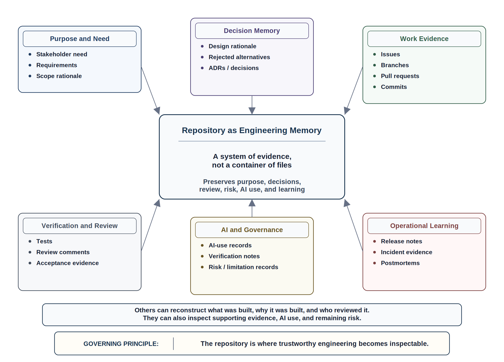
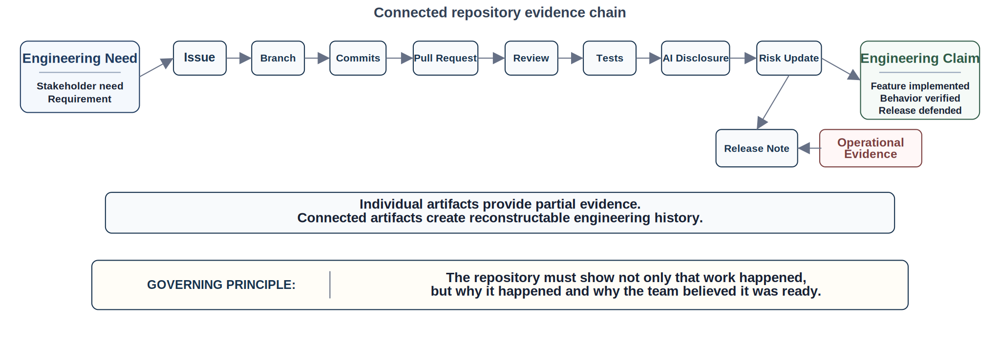
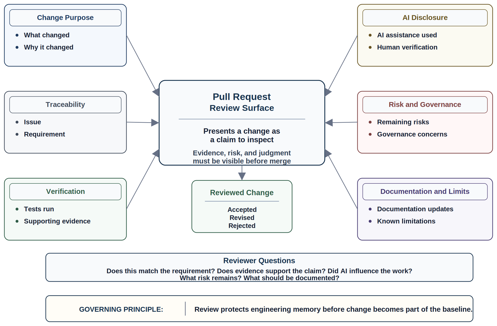
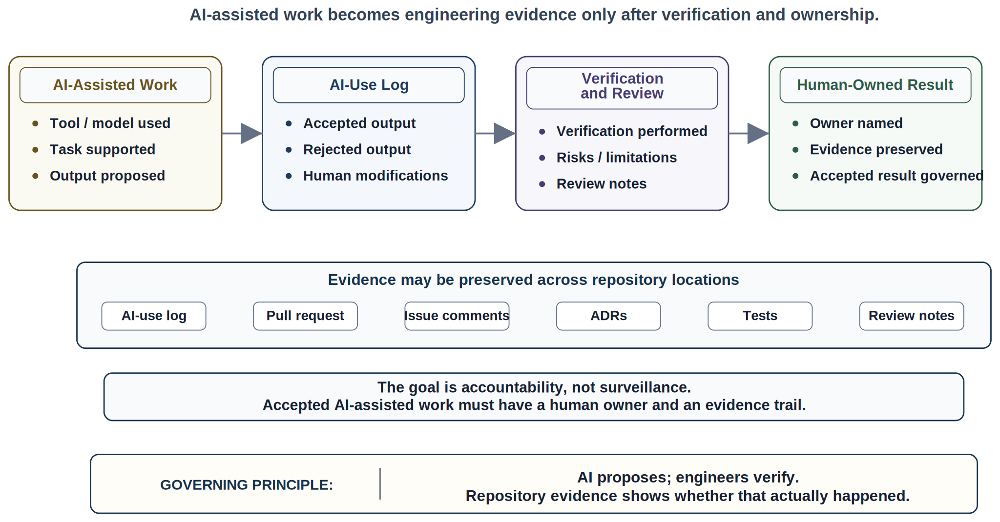
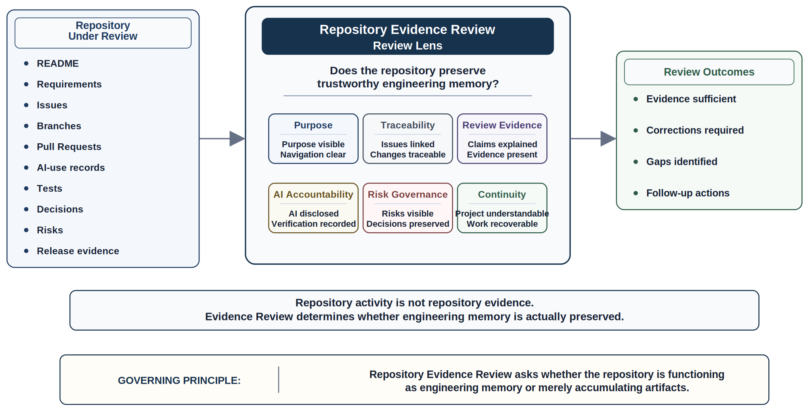

# Chapter 9 Repository-Centered Engineering

## Opening Scenario: The Repository That Looked Organized

After the COICP team completed its project launch baseline, the repository looked respectable.

There was a README. There were folders for documentation, source code, tests, planning notes, AI-use records, and reviews. There was a pull request template. There were issue templates. The team had a Definition of Done. They had written a team charter. They had agreed that important decisions should be preserved in the repository rather than scattered across private chats, meeting notes, and memory.

On the surface, this was a strong start.

Then the team tried to answer a simple question during an early project review:

What evidence shows that the current incident-intake workflow matches the stakeholder need that originally justified it?

No one had a clean answer.

The issue existed, but it was vague. The branch name referred to a feature, not a decision. The pull request described the change but did not explain the rejected alternatives. The README linked to the project purpose but not to the current design rationale. A requirements note mentioned Campus Operations, but the relevant stakeholder interview was stored in a shared drive folder outside the repository. An AI-generated workflow summary had been copied into a planning document, but the team could not tell which parts had been accepted, revised, or rejected. The test evidence showed that the form submitted data, but not that it matched the operational workflow LMU needed.

Nothing was obviously broken.

That was the problem.

The repository contained files, but it did not yet contain engineering memory. It showed activity, but it did not yet make the work fully traceable, reviewable, governable, or recoverable.

Jordan, the team lead, summarized the issue bluntly:

"We have a repository. We do not yet have a system of evidence."

That distinction matters.

A repository can be a place where files accumulate. It can also be the engineering memory of a trustworthy system. The difference is not the tool. The difference is whether the team uses the repository to preserve purpose, decisions, evidence, review, risk, AI involvement, operational learning, and accountability over time.

Chapter 8 established how a trustworthy project begins. Chapter 9 now asks what must happen next: how does the repository become the central infrastructure through which engineering work remains understandable, reviewable, and accountable?

*Figure 9.1 — Repository as Engineering Memory*

A repository-centered engineering practice is not about worshiping Git, GitHub, branches, pull requests, or automation. Those tools matter, but the deeper issue is professional memory. If future engineers, reviewers, stakeholders, instructors, auditors, or operators cannot reconstruct what was built, why it was built, who reviewed it, what evidence supported it, how AI was used, what risks remain, and what decisions shaped the result, then the project has not preserved engineering trust.

The repository is where trustworthy engineering becomes inspectable.

---

## 9.1 The Repository Is Not Just Where Code Lives

Students often meet repositories as places to submit code. Early professional engineers often meet them as places to coordinate commits, branches, and releases. Those uses are real, but they are incomplete.

A trustworthy engineering repository is not merely a container for source files. It is the system of record for the engineering work.

It should preserve:

- what the team is building;
- why the work matters;
- what assumptions shape the design;
- what decisions have been made;
- what alternatives were rejected;
- what risks are known;
- what evidence supports completion claims;
- what reviews challenged the work;
- how AI was used;
- what tests prove and do not prove;
- what limitations remain;
- what release decisions were made;
- and what operational learning occurred after use.

Without that memory, the team depends on private explanation. Private explanation is fragile. It disappears when people forget, leave, get busy, or reinterpret events under pressure. A project that depends on private explanation is not fully reviewable.

The repository should allow another qualified engineer to enter the project and understand the state of the work without depending on hallway history.

That does not mean every conversation belongs in the repository. It does not mean the team should document everything in exhausting detail. It means that decisions, risks, evidence, and accountability must survive beyond the moment in which they were discussed.

A repository-centered team asks a basic question again and again:

Where will future reviewers find the evidence for this claim?

If the answer is "ask the person who worked on it," the project is carrying memory risk.

Repository-centered engineering turns that risk into durable evidence.

---

## 9.2 Repository-Centered Engineering Is Evidence-Centered Engineering

The repository matters because trustworthy engineering depends on evidence.

A team may claim that a requirement is implemented. A stakeholder may believe that a workflow is ready. A developer may believe that a change is safe. A test may pass. A pull request may be merged. A release may be demonstrated. None of those claims is enough by itself.

Engineering claims require evidence.

Evidence does not need to be elaborate, but it must be inspectable. It must connect the claim to something another person can review, challenge, and learn from.

For COICP, evidence might include:

- a stakeholder need recorded in a requirement;
- an issue that scopes the work;
- a branch that isolates the change;
- commits that show implementation history;
- a pull request that explains the change;
- review comments that challenge assumptions;
- tests that verify expected behavior;
- AI-use logs that disclose generated assistance;
- architecture notes that record design decisions;
- risk-register updates that name unresolved concerns;
- release notes that state what changed and what remains limited;
- operational evidence that shows how the system behaved after use.

Each artifact has limited value alone. Together, they create an evidence chain.

*Figure 9.2 — The Engineering Evidence Chain*

The evidence chain does not exist to satisfy a process checklist. It exists because engineering work must be reconstructable. If a routing decision fails later, the team needs to know what requirement drove it, what issue implemented it, what code changed, what tests passed, what reviews occurred, what AI assistance influenced the work, what risk was accepted, and what release note described the behavior.

That reconstruction is not optional in trustworthy systems. It is how teams learn, recover, and remain accountable.

Evidence-centered engineering also protects the team from illusion. A busy repository can look healthy while preserving little meaningful evidence. A project may have many commits, many branches, many issues, and many pull requests while still being hard to understand. Activity is not the same as traceability.

The repository must show not only that work happened, but why it happened and why the team believed it was ready.

That is the difference between repository activity and repository evidence.

---

## 9.3 The README Is the Front Door to Engineering Memory

The README is often treated as a decorative introduction. In a repository-centered project, it is more important than that.

The README is the front door to the project’s engineering memory.

A weak README says little more than the project name, setup commands, and maybe a few screenshots. A stronger README orients a reviewer, teammate, instructor, stakeholder, or future maintainer to the project’s purpose, current status, evidence structure, and navigation path.

For COICP, the README should help a reviewer answer:

- What problem is this project addressing?
- Who are the primary users and stakeholders?
- What is in scope and out of scope?
- What is the current maturity state?
- Where are requirements stored?
- Where are decisions recorded?
- Where are risks tracked?
- Where is AI use disclosed?
- Where is test evidence located?
- Where are release notes and known limitations?
- How does someone run or review the project?
- What should not be trusted yet?

A README that cannot answer those questions leaves reviewers dependent on private explanation.

This does not mean the README must contain every detail. It should not become a dumping ground. Its job is navigation. It should point to the relevant evidence and explain how the repository is organized.

The README should also be honest about maturity. A student team or early project should not pretend that the system is production ready if it is not. Honest status is not weakness. It is professional maturity.

A useful README may say:

- this is an early prototype;
- this workflow is simulated;
- this AI-assisted feature is not authorized for autonomous action;
- this release has known limitations;
- this test suite verifies only selected paths;
- this deployment is a demonstration environment;
- this governance decision remains unresolved.

That kind of honesty supports trust because it allows reviewers to understand what claims the team is and is not making.

The README should not market the project beyond its evidence. It should orient, constrain, and guide inspection.

A good README does not make a weak project trustworthy. But a weak README often reveals that the team has not yet organized its own engineering memory.

---

## 9.4 Issues Turn Intent Into Trackable Work

Issues are not just task cards. They are the point where intent becomes trackable work.

A weak issue says:

"Build incident form."

That may be enough to remind the person who wrote it, but it is not enough for engineering memory. It does not preserve why the work matters, what behavior is expected, what evidence will demonstrate completion, or what risks may be involved.

A stronger issue explains:

- the user or stakeholder need;
- the problem being addressed;
- the intended behavior;
- acceptance criteria;
- relevant constraints;
- related risks;
- links to requirements or decisions;
- expected evidence;
- and review concerns.

For COICP, an issue about incident intake should not merely say that the team will create a form. It should explain what operational information the form must capture, who uses it, which fields affect routing, what privacy or authority concerns exist, how the behavior will be tested, and what evidence will show readiness.

Issues help prevent one of the most common failures in software projects: implementation drifting away from intent.

When issues are vague, branches and pull requests inherit that vagueness. Reviewers then review code without enough context to judge whether the change actually solves the right problem. AI assistance can make this worse by generating polished issue descriptions that sound complete but are not grounded in stakeholder reality.

Issue quality is therefore an engineering control.

It shapes what the team builds, how the work is reviewed, and what future maintainers can reconstruct.

A repository-centered team does not need perfect issues. It needs issues that are clear enough to preserve intent, scope, evidence expectations, and ownership.

---

## 9.5 Branches and Commits Preserve Engineering History

Branches and commits are often taught as mechanics. Create a branch. Make changes. Commit. Push. Open a pull request.

Those mechanics matter, but Chapter 9 must push further. Branches and commits preserve engineering history.

A branch should isolate a meaningful unit of work. Its name should connect to the issue or purpose. A branch named `feature-form` tells little. A branch named `issue-24-incident-intake-required-fields` preserves more context.

Commits should also support reconstruction. A stream of commits named `fix`, `update`, `stuff`, and `changes` creates weak memory. A reviewer can inspect the diff, but the history does not explain the reasoning. Commit messages do not need to be essays, but they should tell enough truth to help someone understand the change later.

A strong commit history helps answer:

- What changed?
- Why did it change?
- What issue or requirement does it relate to?
- Was the change a feature, fix, test, documentation update, refactor, or evidence update?
- Did the change affect behavior, structure, governance, or only presentation?

This matters when the team must diagnose failure.

If a routing bug appears later, the team should be able to reconstruct when routing logic changed, what issue drove the change, what review occurred, what tests were added, and what assumptions shaped the implementation.

That reconstruction begins with disciplined branches and commits.

Repository-centered engineering does not demand perfection. It demands that the history be useful enough to support review, recovery, and learning.

---

## 9.6 Pull Requests Are Review Surfaces, Not Merge Requests

A pull request is not merely a request to merge code.

It is a review surface.

It is where the team presents a claim: this change is ready to be inspected, challenged, improved, and possibly accepted.

A weak pull request says little more than:

"Implemented form."

A strong pull request explains:

- what changed;
- why it changed;
- what issue or requirement it addresses;
- what evidence supports it;
- what tests were run;
- what AI assistance was used;
- what risks remain;
- what design or governance concerns reviewers should inspect;
- what documentation was updated;
- and what limitations still exist.

*Figure 9.3 — Pull Request as Review Surface*

A pull request should reduce reviewer guesswork. Reviewers should not have to reconstruct the purpose of the change from the diff alone. The diff shows what changed. The pull request should explain why the change matters and how it was verified.

This is especially important in AI-assisted work. A developer may use AI to generate scaffolding, propose tests, summarize stakeholder needs, or draft documentation. Once that material enters the pull request, the team must know what was accepted, what was modified, what was rejected, and what evidence supports the accepted result.

AI-generated code does not become trustworthy because it compiles. AI-generated documentation does not become trustworthy because it is fluent. AI-generated tests do not become trustworthy because they exist. The pull request is one of the places where the team converts proposed material into reviewed engineering evidence.

A strong pull request helps reviewers ask better questions:

- Does this change match the requirement?
- Does the evidence support the claim?
- What assumption is hidden in the implementation?
- Does this affect governance or authority boundaries?
- Did AI influence the work?
- Are tests meaningful or merely generated?
- What operational behavior could fail silently?
- What should be documented before merge?

Review is how the team protects engineering memory before change becomes part of the baseline.

---

## 9.7 Reviews Preserve Judgment

A review is not only a quality check. It is a record of team judgment.

The reviewer’s job is not to approve quickly. The reviewer’s job is to challenge the claim being made by the change. That challenge may involve correctness, maintainability, security, governance, observability, recoverability, accessibility, user impact, AI use, or operational risk.

In a trustworthy repository, review comments are not noise. They are part of the engineering record.

They show what questions were asked. They show what concerns were resolved. They show what alternatives were considered. They show what risk was accepted. They show where judgment was applied.

This matters because future teams often inherit code without inheriting the conversation that produced it. A repository-centered practice keeps the important parts of that conversation close to the work.

Review should also resist theater.

Review theater occurs when a pull request receives approval without meaningful inspection, without evidence, without attention to risk, or without challenge of AI-assisted assumptions. A team can have required reviewers and still have weak review. A green checkmark does not prove judgment occurred.

A mature review culture asks:

- What claim is this change making?
- What evidence supports that claim?
- What could fail?
- Who is affected?
- What must be true for this to be safe?
- Is the AI-assisted material verified?
- Is there enough evidence for future maintainers?
- Should this change be merged, revised, escalated, or deferred?

The value of review is not only that defects are found. The value is that the team thinks together before the change becomes harder to reverse.

---

## 9.8 Decisions Need a Durable Home

Not every decision requires an Architecture Decision Record. But consequential decisions need a durable home.

A decision is consequential when it affects:

- architecture;
- data ownership;
- security;
- privacy;
- workflow authority;
- escalation behavior;
- user visibility;
- operational recovery;
- AI delegation;
- release readiness;
- or long-term maintainability.

For COICP, a decision about whether the system may recommend escalation is not just a feature decision. It affects authority, privacy, operational trust, governance, and human oversight. That decision should not live only in a meeting transcript or a chat thread. It should be recorded where future reviewers can find it.

A lightweight ADR can preserve:

- the decision;
- the context;
- the options considered;
- the rationale;
- the consequences;
- the evidence;
- the reviewer or approver;
- and the date.

Durable decisions prevent architectural drift. They also prevent teams from repeatedly relitigating the same question without knowing what was previously decided.

Decision records also protect against AI-era confusion. AI can generate plausible design options quickly, but the accepted decision still belongs to the engineering team. The repository should show which option was accepted and why.

A model can suggest. The team must decide. The repository must remember.

---

## 9.9 AI-Use Logs Preserve Provenance and Accountability

AI use does not need to be hidden. It also does not need to be dramatized.

In a repository-centered engineering practice, AI use is treated as part of the evidence system.

An AI-use log should help the team and reviewers understand:

- what tool or model was used;
- what task it supported;
- what output was accepted;
- what output was rejected;
- what human modifications were made;
- what verification was performed;
- what risks or limitations remain;
- and who owns the accepted result.

*Figure 9.4 — AI-Use Evidence and Human Ownership*

The goal is not surveillance. The goal is accountability.

If AI helped draft requirements, reviewers need to know whether those requirements came from stakeholder evidence or from plausible invention. If AI generated tests, reviewers need to know whether those tests verify real behavior or merely mirror generated assumptions. If AI proposed workflow logic, reviewers need to know whether governance and authority boundaries were checked.

AI-use logs also help the team learn. Over time, the team may discover that AI is useful for some tasks and risky for others. It may find that generated documentation is helpful when grounded in repository evidence but dangerous when used to replace stakeholder understanding. It may find that generated tests catch simple cases but miss operational edge cases.

Without a log, those lessons disappear into private experience.

The AI-use log is not the only place AI evidence can live. Pull requests, issue comments, ADRs, tests, and review notes may also record AI involvement. The important point is that accepted AI-assisted work must have a human owner and an evidence trail.

AI proposes; engineers verify. Repository evidence shows whether that actually happened.

---

## 9.10 Repository Structure Should Support the Lifecycle

A repository structure is not trustworthy because it has many folders. It is trustworthy when the structure supports the lifecycle of the work.

The folder structure should help the team preserve the evidence it needs across requirements, planning, architecture, implementation, testing, review, AI governance, release, observability, and learning.

For COICP, a useful early structure might include:

- `README.md` for project orientation and navigation;
- `/docs/requirements/` for stakeholder needs, acceptance criteria, assumptions, and open questions;
- `/docs/planning/` for scope, risks, estimates, commitments, and re-estimation;
- `/docs/architecture/` for architecture notes, diagrams, boundaries, and design rationale;
- `/docs/decisions/` for ADRs and other durable decisions;
- `/docs/reviews/` for launch review, lifecycle review, repository evidence review, and later readiness reviews;
- `/docs/ai/` for AI policy, AI-use logs, and AI-related limitations;
- `/docs/testing/` for test strategy and evidence;
- `/docs/release/` for release notes, known limitations, and readiness evidence;
- `/docs/observability/` for runtime evidence and operational learning when the system matures;
- `/.github/` for issue templates, pull request templates, and workflows;
- `/src/` for source code;
- `/tests/` for automated tests;
- `/test-evidence/` for captured evidence when appropriate;
- `/scripts/` for reproducible project scripts;
- `/data/` for sample or test data when appropriate.

This structure should evolve as the project matures. The goal is not to freeze a perfect tree forever. The goal is to make the repository navigable, evidence-centered, and aligned with the lifecycle.

A folder that no one uses is theater. A structure that helps the team find evidence is infrastructure.

The repository should not become a maze. It should reduce cognitive load for reviewers and maintainers.

A reviewer should be able to ask, "Where would I find the evidence for this?" and the repository structure should make the answer obvious.

---

## 9.11 Traceability Connects the Work

Traceability is the connective tissue of repository-centered engineering.

It connects why work exists to what changed and how the team knows the change is acceptable.

A simple traceability path might look like this:

Requirement -> issue -> branch -> commits -> pull request -> review -> tests -> release note -> operational evidence.

That path does not need to be heavy or bureaucratic. It needs to be real enough that another person can reconstruct the work.

For COICP, traceability might connect a stakeholder need from Campus Operations to a requirement about incident priority, to an issue implementing priority labels, to a branch and pull request, to tests showing expected behavior, to review notes about governance implications, to release notes explaining that priority labels are advisory and not autonomous escalation authority.

That traceability protects the team.

It helps reviewers understand context. It helps testers verify the right behavior. It helps release reviewers know what changed. It helps operators diagnose incidents. It helps future maintainers understand why the code looks the way it does. It helps governance reviewers inspect authority boundaries.

Traceability also helps detect drift.

If a pull request implements behavior that cannot be traced to a requirement, issue, decision, or risk, the team should ask why. Maybe the work is legitimate but undocumented. Maybe the requirement is missing. Maybe the implementation is premature. Maybe AI-generated code introduced behavior no one intended.

Traceability is not about paperwork. It is about keeping engineering intent connected to engineering action.

---

## 9.12 Repository Evidence Review

Chapter 8 introduced Project Launch Review. Chapter 9 introduces Repository Evidence Review.

The purpose of Repository Evidence Review is to determine whether the repository supports trustworthy engineering memory.

This review does not ask whether the project has many files. It asks whether the repository preserves the evidence needed to understand, review, govern, and continue the work.

Core review questions include:

- Can a reviewer understand the project purpose from the repository?
- Can a reviewer navigate from README to requirements, risks, decisions, tests, reviews, AI-use records, and release evidence?
- Are issues clear enough to preserve intent?
- Do branches and pull requests connect to issues?
- Do pull requests explain claims, evidence, risks, and AI involvement?
- Are consequential decisions recorded durably?
- Are AI-assisted outputs disclosed and verified?
- Does the repository show what is done, what is incomplete, and what remains risky?
- Can another engineer continue the project without private explanation?
- Could the team reconstruct why a behavior exists six months later?

*Figure 9.5 — Repository Evidence Review Lens*

Repository Evidence Review is not a one-time event. It should recur as the project matures. Early in the project, the review may focus on README quality, issue structure, branch discipline, pull request evidence, and AI-use logging. Later, it may focus on requirements traceability, architecture decisions, test evidence, release readiness, observability evidence, and postmortem learning.

The review strengthens engineering judgment because it forces the team to inspect whether its claims are supported by evidence.

It also protects against repository theater. A repository can look busy while failing to preserve the evidence that matters. Repository Evidence Review asks whether the repository is functioning as engineering memory or merely accumulating artifacts.

---

## 9.13 LMU Matures Its Repository Practice

After the early review, the COICP team does not throw away its repository. It improves the way the repository works.

The team updates the README so it becomes a real navigation point. It links to the project purpose, launch baseline, current risks, AI policy, requirements, test evidence, and review records.

The team improves issue templates so that each issue captures stakeholder need, acceptance criteria, evidence expectations, risk, and ownership.

The team revises the pull request template to require:

- linked issue;
- summary of change;
- evidence and tests;
- AI-use disclosure;
- risk and governance notes;
- documentation updates;
- known limitations;
- reviewer focus areas.

The team creates a lightweight ADR template for consequential decisions. It begins recording decisions about workflow routing, data visibility, authority boundaries, and AI-assisted recommendations.

The team updates the AI-use log so that accepted AI assistance is tied to human verification and ownership.

The team begins treating the risk register as a living artifact rather than a launch document that was completed and forgotten.

This is the maturity movement of Chapter 9.

The repository stops being a place where the team stores work after the fact. It becomes the place where the team coordinates work while it is happening.

That shift matters because COICP is not a toy program. It affects institutional workflows, operational coordination, stakeholder trust, and future AI-assisted behavior. LMU cannot responsibly build that kind of system with memory scattered across private explanations.

Repository-centered engineering gives LMU a way to make its work inspectable.

---

## 9.14 Primary Anti-Pattern: Repository Theater

The primary anti-pattern for this chapter is repository theater.

Repository theater occurs when a team has the visible artifacts of repository use without the evidence discipline that makes the repository trustworthy.

Symptoms include:

- a README that markets the project but does not guide review;
- issues that name tasks without preserving intent;
- branches that cannot be connected to work items;
- commits that obscure history;
- pull requests that request approval without evidence;
- reviews that approve without challenge;
- decisions made in meetings but never recorded;
- AI-generated artifacts accepted without provenance;
- tests added without explaining what risk they reduce;
- release notes that overstate readiness;
- risks known privately but not tracked;
- repository activity used as proof of maturity.

Repository theater is dangerous because it creates the appearance of professional engineering without preserving the memory needed for trust.

It is especially dangerous in AI-assisted projects because AI can help generate polished repository artifacts quickly. A project can accumulate clean-looking requirements, issues, tests, documentation, and release notes while still lacking grounded stakeholder evidence, meaningful review, governance clarity, and human ownership.

The corrective response is not more folders. It is stronger evidence discipline.

The team must ask:

- What claim does this artifact make?
- What evidence supports it?
- Who reviewed it?
- What risk does it reduce?
- What decision does it preserve?
- What would a future engineer need to know?

Repository theater is countered by repository-centered engineering: evidence, traceability, review, decision memory, AI-use transparency, and accountable ownership.

---

## 9.15 Operational Takeaways

Repository-centered engineering is not about using GitHub correctly in a narrow mechanical sense. It is about preserving trustworthy engineering memory.

The chapter’s operational takeaways are:

- A repository is not automatically engineering memory.
- Repository activity is not the same as repository evidence.
- The README is the front door to the project’s evidence system.
- Issues preserve intent when they capture context, acceptance criteria, risk, evidence, and ownership.
- Branches and commits preserve useful engineering history when they are connected to meaningful work.
- Pull requests are review surfaces, not just merge requests.
- Reviews preserve team judgment.
- Consequential decisions need a durable home.
- AI-use logs preserve provenance, verification, and human ownership.
- Repository structure should support the lifecycle, not decorate it.
- Traceability connects purpose, implementation, review, evidence, release, and learning.
- Repository Evidence Review protects against repository theater.

The central professional lesson is simple:

The repository proves whether the team’s engineering discipline survives beyond private explanation.

---

## 9.16 Exercises

### Exercise 1: Diagnose Repository Theater

Create the repository artifact:

`/docs/reviews/repository_theater_analysis.md`

Review a repository snapshot that contains numerous files but weak engineering evidence.

Identify:

- Missing traceability
- Missing ownership
- Missing review evidence
- Missing decision records
- Missing verification evidence
- Missing operational context

Determine which trustworthiness pillars are weakened by the missing evidence.

Explain why repository size is not evidence of engineering maturity.

### Exercise 2: Strengthen a Repository Issue

Create the repository artifact:

`/issues/example_issue_rewrite.md`

Review a vague issue description.

Rewrite it as an evidence-centered engineering artifact.

Include:

- Stakeholder need
- Scope
- Acceptance criteria
- Risks
- Evidence expectations
- Ownership
- Review focus

Evaluate whether the revised issue provides sufficient guidance for implementation and review.

### Exercise 3: Conduct a Pull-Request Evidence Review

Create the repository artifact:

`/docs/reviews/pull_request_evidence_review.md`

Review a sample pull request.

Evaluate:

- Context quality
- Traceability
- Test evidence
- AI-use disclosure
- Risk visibility
- Governance implications

Identify missing evidence and determine whether the pull request should be:

- Approved
- Approved with conditions
- Returned for revision

Justify the decision using repository evidence.

### Exercise 4: Create an AI-Use Log Entry

Create the repository artifact:

`/docs/ai/ai_use_log.md`

Given an AI-assisted engineering task, create an AI-use log entry documenting:

- Tool used
- Purpose
- Accepted output
- Rejected output
- Human modifications
- Verification activities
- Remaining risks
- Accountable owner

Evaluate whether the entry provides sufficient evidence for future review.

### Exercise 5: Build a Traceability Chain

Create the repository artifact:

`/docs/traceability/end_to_end_traceability_chain.md`

Connect a stakeholder need to:

- Requirement
- Issue
- Branch
- Pull request
- Review
- Test evidence
- Release note
- Operational evidence

For each connection, explain:

- Why it exists
- What evidence it preserves
- What would be lost if the connection were missing

Determine which link is most critical to long-term engineering memory.

### Exercise 6: Conduct a Repository Evidence Review

Create the repository artifact:

`/docs/governance/reviews/repository_evidence_review_record.md`

Conduct a Repository Evidence Review for COICP.

Evaluate:

- Traceability
- Reviewability
- Ownership
- Decision evidence
- AI-use evidence
- Test evidence
- Operational evidence

Document:

- Findings
- Evidence gaps
- Required corrections
- Owner assignments
- Follow-up actions

Determine whether the repository is:

- Ready to support continued engineering work
- Conditionally ready
- Not ready

Justify the decision using available evidence.

Explain how repository quality affects future planning, implementation, testing, operations, and governance activities.

## 9.17 Trustworthiness Mapping

Repository-centered engineering strengthens several trustworthiness pillars directly.

### Traceability

Traceability is the primary pillar of Chapter 9. The repository connects requirements, issues, branches, commits, pull requests, reviews, tests, release notes, AI-use evidence, and operational learning. Without repository traceability, the team cannot reconstruct why work exists or whether it was responsibly completed.

### Reviewability

Reviewability depends on evidence surfaces. Issues, pull requests, review comments, decision records, and test evidence allow others to challenge work. A repository that hides reasoning or scatters evidence weakens reviewability.

### Accountability

Accountability becomes visible through owners, reviewers, decision records, AI-use logs, risk assignments, and release decisions. Repository-centered engineering prevents accountability from dissolving into vague team memory.

### Governability

Governability requires durable records of authority boundaries, AI-use constraints, security concerns, approval expectations, and operational limitations. Repository evidence helps governance remain inspectable instead of informal.

### Recoverability

Recoverability depends on reconstructing what changed, why it changed, what evidence existed, and what limitations were known. A mature repository supports diagnosis, rollback, postmortem learning, and future correction.

### Operational Visibility

Operational visibility begins before runtime. A repository that honestly records current status, known limitations, risks, release notes, and operational evidence gives teams a clearer picture of system readiness.

### Human Oversight

Human oversight becomes inspectable when reviews, AI-use logs, approval notes, decisions, and risk acceptances are preserved. Without repository evidence, oversight can become theater.

Chapter 9 prevents checklist theater by tying each pillar to inspectable artifacts and professional judgment. The point is not to say the repository has a README, issues, and pull requests. The point is to ask whether those artifacts preserve enough evidence to support trust.

---

## 9.18 Closing Reflection: The Repository Remembers What the Team Must Not Forget

A trustworthy engineering team cannot depend on perfect memory.

People forget. Teams change. Stakeholders reinterpret decisions. AI-generated artifacts appear fluent. Tests pass for narrow reasons. Meetings end. Chat threads disappear. Pressure increases. A release that looked clear in the moment becomes difficult to explain later.

The repository is where the team protects itself from that decay.

Not by storing everything.

By preserving what matters.

The purpose of a repository-centered engineering practice is not to create administrative weight. It is to make engineering work understandable across time. It allows the team to explain what was intended, what was built, what was reviewed, what evidence existed, what AI contributed, what risk remained, and who owned the decision.

That memory is not secondary to engineering. It is part of engineering.

Chapter 8 established how a trustworthy project begins. Chapter 9 showed how the repository becomes the durable infrastructure of that work.

But preserving evidence is only the first responsibility. The repository can remember stakeholder interviews, assumptions, constraints, decisions, risks, and open questions. The harder challenge is determining whether those artifacts describe the right problem.

The next step is therefore not architecture or implementation. It is disciplined requirements engineering. If the repository is the memory of the project, requirements are among its earliest claims about reality: what problem exists, who experiences it, what constraints matter, what authority boundaries exist, and what evidence will later prove the work was successful.

A team cannot build responsibly if it cannot explain what problem it is solving.

That is where Chapter 10 begins.
