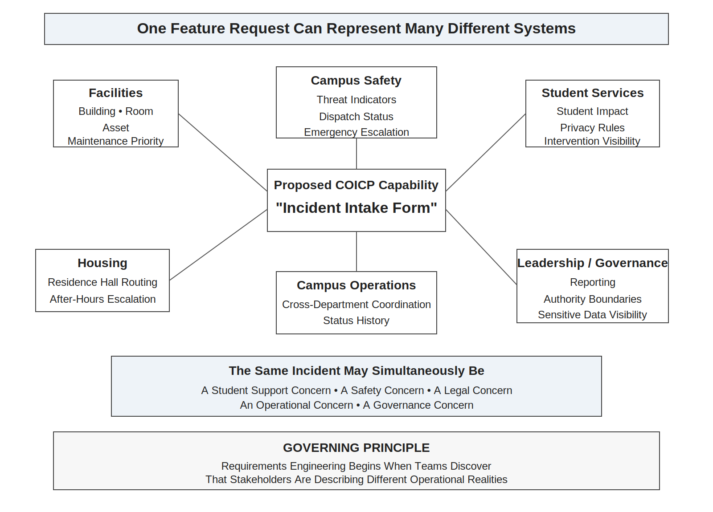
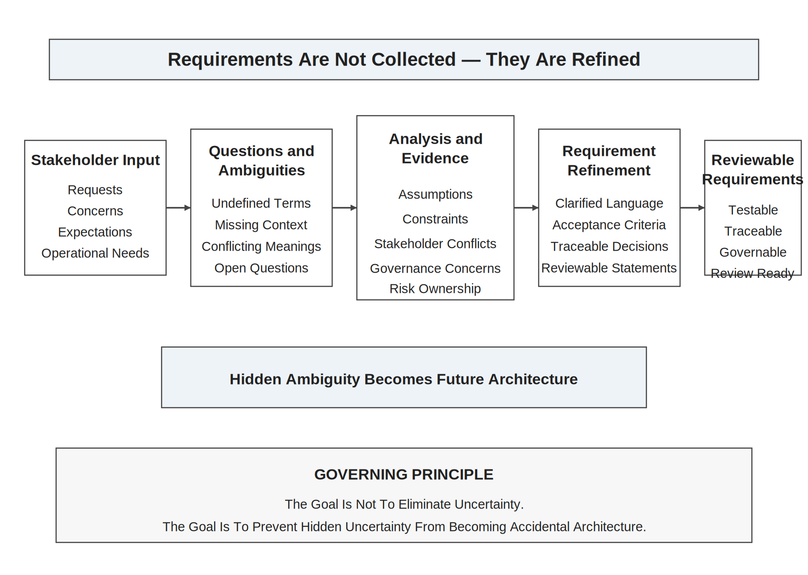
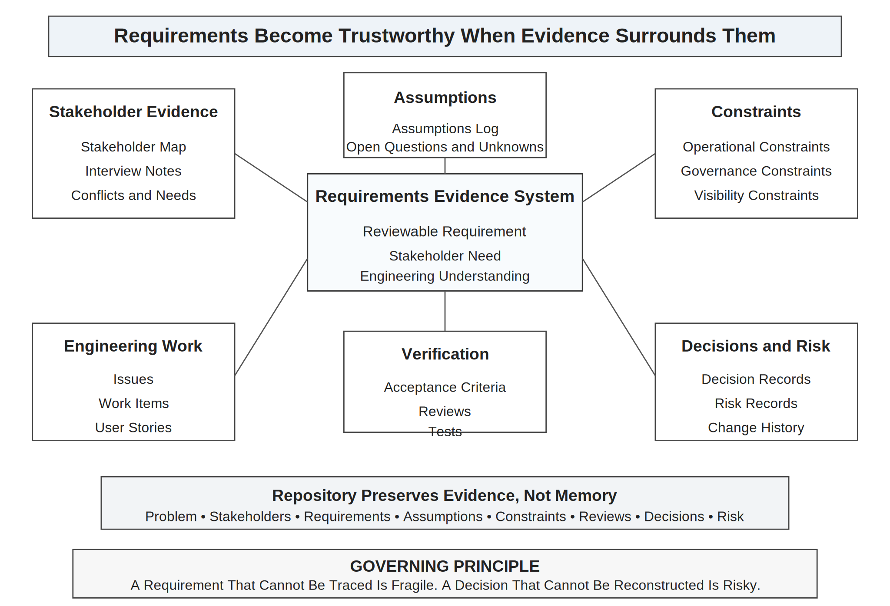
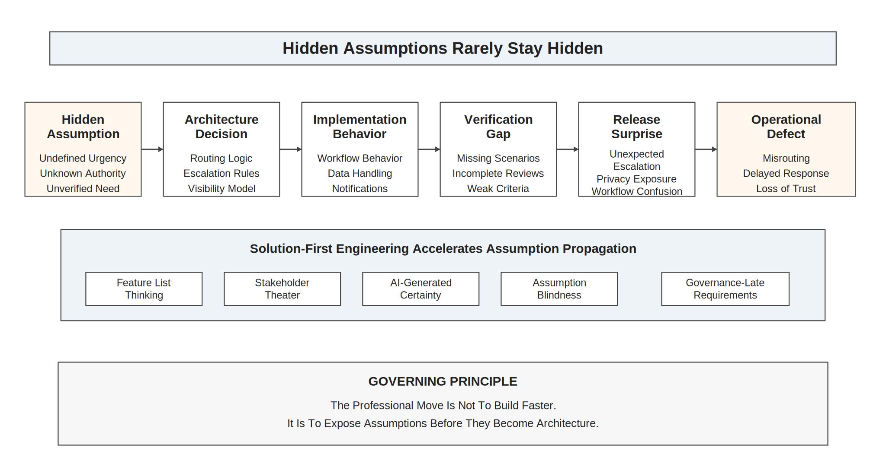
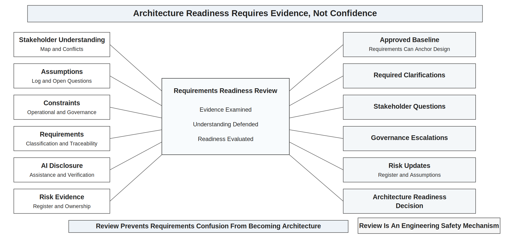

# Chapter 10<br><span class="chapter-title-main">Requirements, Stakeholders, and Engineering the Right Problem

## Opening Scenario: Everyone Agrees Until the Team Asks What the System Must Do

The COICP team at Lakeside Metropolitan University (LMU) had finally reached the point where the project felt real.

The repository was no longer empty. The README explained the project purpose. The team charter named roles and ownership. The working agreements defined how the team would communicate, review, and preserve evidence. The Definition of Done existed before anyone claimed work was complete. The AI-use policy made clear that AI could assist with drafting, summarizing, and exploration, but accepted work had to be verified, reviewed, and owned by humans. The Project Launch Review had not made the team slower. It had made the team more honest.

Now the team wanted to build.

The first proposed feature sounded obvious: an incident intake form.

At first, everyone nodded. COICP needed a way for incidents to enter the system. Facilities needed requests. Campus Safety needed escalation. Student Services needed visibility into student-impacting problems. Campus Operations needed coordination. Leadership wanted dashboards. The team opened an issue titled `Create incident intake form` and began discussing fields, workflows, and interface layout.

Then the apparent agreement began to break apart.

Facilities wanted building, room, category, urgency, affected asset, and maintenance priority. Campus Safety wanted location precision, immediate threat indicators, dispatch status, and emergency contact paths. Student Services wanted student-impact classification, privacy protections, and notification rules. Housing wanted residence-hall routing and after-hours escalation. Campus Operations wanted cross-department visibility and status history. Leadership wanted summaries and trends. Governance wanted to know who could see sensitive information, who could trigger escalation, and whether AI-generated routing suggestions might influence authority boundaries.

The phrase "incident intake form" had hidden at least six different systems.

The team tried using AI to help organize the discussion. The AI-generated summary looked polished. It grouped stakeholder needs into clean categories, proposed user stories, and drafted a list of requirements. The document looked convincing. It also blurred important disagreements. It treated Facilities urgency and Campus Safety urgency as if they meant the same thing. It suggested a single escalation path where LMU actually needed different authority boundaries. It proposed notifications without fully respecting privacy constraints. It made the team feel organized before the team had actually understood the problem.

As discussions continue, the team realizes the disagreement is not merely about workflow preferences.

The disagreement reflects institutional priorities, operational authority, privacy obligations, and organizational risk tolerance.

Student Affairs wants rapid intervention visibility.

Legal wants privacy minimization.

Campus Safety wants escalation authority.

Operations want reporting consistency.

The same incident can simultaneously represent:

- a student-support concern,
- a legal-risk concern,
- a safety concern,
- an operational-tracking concern,
- and a governance-accountability concern.

The team begins to realize that requirements engineering is not feature collection.

It is organizational truth discovery under uncertainty.

That was the moment the team recognized the next engineering challenge.

The repository could preserve evidence, but the evidence still had to be about the right problem.

The team did not need to build faster yet. It needed to understand better.

In trustworthy engineering, requirements are not a paperwork phase. They are the disciplined engineering of shared understanding before design and implementation harden assumptions into the system.



*Figure 10.1 — Stakeholders See Different Systems*

---

## 10.1 Requirements Are Not Feature Lists

Many teams begin requirements work by asking what features the system should have. That question is not useless, but it is incomplete and often dangerous. A feature is a proposed solution. A requirement should preserve the problem, the stakeholder need, the constraint, the evidence, and the acceptance condition that make the solution meaningful.

A feature list can be written quickly. A trustworthy requirement takes more discipline.

A feature list might say:

- create incident intake form;
- route incident to department;
- notify responsible staff;
- generate incident summary;
- show dashboard status.

Those statements sound productive. They also hide the actual engineering questions.

What counts as an incident? Who may report one? What information is required at intake? What information is optional? Which details are sensitive? Which departments may see which fields? What does routing mean: recommendation, assignment, notification, or authority transfer? What must be logged? What can be corrected? What must be auditable? What happens when the system is wrong? What evidence would prove that the requirement has been satisfied?

A requirement is not merely a requested capability. A requirement is an agreement about operational reality.

That agreement must be specific enough to guide design, implementation, testing, review, release readiness, and operational accountability. If it is vague, every later engineering activity inherits that vagueness. Architecture becomes guesswork. Tests prove the wrong thing. Pull requests appear complete while hiding unresolved decisions. AI-generated artifacts become fluent approximations of a problem no one has actually understood.

Requirements are therefore not a preliminary administrative chore. They are early trust architecture.

A trustworthy requirement should help a future reviewer understand why the work exists, who needs it, what problem it addresses, what constraints shape it, what evidence supports it, and what would count as success.

The key shift is simple but demanding:

Requirements are not lists of things to build. Requirements are evidence-backed statements of what the system must make true for stakeholders under real constraints.

---

## 10.2 Stakeholders Hold Partial Truths

Stakeholders are not obstacles to engineering. They are sources of operational truth. But each stakeholder usually sees only part of the system.

At LMU, Facilities understands the maintenance workflow. Campus Safety understands immediate risk and escalation. Student Services understands student impact and privacy concerns. Housing understands residence hall context. Campus Operations understands cross-department coordination. IT understands integration constraints and maintainability. Governance understands authority, auditability, privacy, and institutional risk. Leadership understands institutional accountability and public trust.

None of those views is complete. None is irrelevant.

A weak requirements process treats stakeholder disagreement as noise. A mature requirements process treats disagreement as evidence. When stakeholders describe the same system differently, the team has discovered a boundary, a conflict, or a hidden assumption.

The COICP team initially wanted one intake form because one form sounded simpler. Stakeholder discovery revealed that "one form" might still be possible, but only if the underlying requirement separated shared intake structure from department-specific authority, privacy, escalation, and workflow rules.

That distinction matters. Without it, the team might build a clean interface that quietly violates operational reality.

Stakeholder work is also not just interviewing. It is interpretation, reconciliation, and evidence preservation. A transcript is not understanding. A meeting note is not a requirement. A summary is not agreement. The engineering task is to turn stakeholder input into reviewable claims that can be challenged, refined, traced, tested, and governed.

Teams should ask:

- Who experiences the problem directly?
- Who owns the workflow today?
- Who is harmed if the system behaves incorrectly?
- Who approves changes to authority, routing, escalation, or data visibility?
- Who will maintain the system?
- Who will use the evidence during failure investigation?
- Who is currently compensating for weak process?
- Who has not been consulted but will be affected?

Requirements fail when teams mistake the loudest stakeholder for the whole system. They also fail when teams treat stakeholder statements as literal instructions rather than evidence to analyze.

Trustworthy engineering requires stakeholder respect without stakeholder absolutism. Engineers must listen carefully, preserve evidence honestly, and still apply engineering judgment.

---

## 10.3 Ambiguity Is Risk

Ambiguity feels harmless early because no implementation has failed yet. In reality, ambiguity is one of the earliest forms of project risk.

A vague requirement does not stay vague. It becomes a design assumption, a code path, a test gap, a review argument, a release surprise, or an operational defect.

Consider the requirement:

"The system shall notify the appropriate department when an incident is submitted."

It sounds reasonable. It is also dangerously incomplete.

What does appropriate mean? Who decides? Is the notification informational, or does it assign responsibility? What if more than one department is appropriate? What if the incident is safety-sensitive? What if notification exposes private information? What if AI recommends the department? What if the recommendation is plausible but wrong? What if the submitter misclassifies the incident? What must be logged? Can a human override the routing? Who owns the outcome?

Ambiguity is not merely unclear wording. It is uncertainty that has not yet been engineered.

Some ambiguity is normal at the beginning of a project. The mistake is pretending it has been resolved. Honest engineering does not require every answer on day one. It requires the team to name uncertainty, preserve it, assign ownership, and decide what must be learned before commitment.

A mature repository makes ambiguity visible. It should preserve open questions, assumptions, stakeholder conflicts, unresolved governance concerns, and risk owners. This protects the team from silently converting uncertainty into implementation.

Ambiguity becomes dangerous when it is hidden behind polished artifacts. AI can make this worse. A generated requirements document may sound precise while containing unresolved terms, invented assumptions, or stakeholder conflicts that have been smoothed away by fluent prose.

The team must learn to read requirements skeptically.

If a requirement uses words such as appropriate, timely, secure, user-friendly, necessary, relevant, high priority, automatic, intelligent, or seamless, the team should ask what those words mean operationally and how evidence will prove them.

The goal is not to eliminate all uncertainty. The goal is to prevent hidden uncertainty from becoming accidental architecture.



*Figure 10.2 — Requirement Discovery Funnel*

---

## 10.4 From Stakeholder Statements to Engineering Requirements

Requirements work transforms raw input into disciplined engineering evidence.

The process begins with stakeholder statements, observations, existing workflows, pain points, constraints, incidents, policies, data records, and operational goals. These inputs are not yet requirements. They are evidence sources.

The team then analyzes them for:

- recurring needs;
- conflicting expectations;
- hidden assumptions;
- operational constraints;
- governance boundaries;
- data sensitivity;
- failure consequences;
- acceptance criteria;
- testability;
- traceability.

Only after that analysis should the team create requirements that can guide design and implementation.

A weak requirement says:

"Users can submit incidents."

A stronger requirement says:

"Authorized LMU staff shall be able to submit an incident report that records location, incident category, urgency indicator, affected department, reporter contact, visibility classification, and optional supporting notes, so that Campus Operations can triage and route the incident with an auditable record of the initial report."

Even that stronger version may still need refinement. But it already does more engineering work. It identifies users, data, purpose, operational action, and evidence. It invites review. It can be traced. It can be tested. It exposes questions about authorization, visibility classification, and routing.

Requirements should not be bloated prose. They should be precise enough to reduce risk and clear enough to guide action.

The COICP team begins separating requirements into categories:

- functional requirements: what the system must do;
- data requirements: what information must be captured, stored, protected, or displayed;
- workflow requirements: how work moves across roles or departments;
- governance requirements: what authority, approval, audit, or policy constraints apply;
- quality requirements: performance, reliability, usability, accessibility, security, maintainability;
- operational requirements: logging, monitoring, escalation, rollback, support, incident response;
- AI-related requirements: what AI may propose, what humans must approve, what evidence must be preserved.

This classification prevents the team from treating every requirement as a screen feature. It also helps later chapters because architecture, implementation, testing, and release readiness will each depend on different types of requirements.

A trustworthy requirement is not finished because it is written. It is ready when it can survive review.

---

## 10.5 Requirements as Repository Evidence

Chapter 9 established the repository as engineering memory. Chapter 10 now deepens that idea: the repository must preserve evidence of understanding, not only evidence of implementation.

The repository should answer:

- What problem are we solving?
- Who has this problem?
- What evidence supports that claim?
- What requirement expresses the need?
- What assumptions remain?
- What constraints apply?
- What issue or work item traces to the requirement?
- What test or review will later verify it?
- What decision changed it?
- What risk remains if it is misunderstood?

If the repository cannot answer those questions, the team may still be building from memory, chat fragments, meeting impressions, or AI-generated summaries.

A useful requirements directory might include:

```text
/docs/requirements/
  requirements-index.md
  stakeholder-needs.md
  functional-requirements.md
  nonfunctional-requirements.md
  workflow-requirements.md
  governance-requirements.md
  ai-related-requirements.md
  acceptance-criteria.md
/docs/stakeholders/
  stakeholder-map.md
  interview-notes/
  stakeholder-conflicts.md
/docs/constraints/
  operational-constraints.md
  governance-constraints.md
  data-visibility-constraints.md
/docs/assumptions/
  assumptions-log.md
/docs/reviews/
  requirements-readiness-review.md
```

The exact structure may vary, but the principle should not: requirements must be inspectable.

A requirement that cannot be traced is fragile. A decision that cannot be reconstructed is risky. An assumption that cannot be found will return later as surprise.



*Figure 10.3 — Requirements as Engineering Evidence*

Repository evidence also protects teams from retrospective storytelling. Without preserved requirements evidence, teams can later claim that a feature was obvious, that stakeholders agreed, that a constraint was known, or that a risk was accepted. Mature engineering does not depend on reconstructed memory. It preserves the evidence when the decision is made.

This matters especially when AI assists with requirements work. If AI summarizes interviews, drafts user stories, clusters stakeholder themes, or proposes acceptance criteria, the repository should preserve what was accepted, what was rejected, what humans changed, and what evidence supports the final requirement.

AI-generated requirements are not wrong because AI helped create them. They are risky when teams accept them without stakeholder grounding, verification, review, and ownership.

Everything important leaves evidence.

---

## 10.6 Constraints Are Requirements Too

Students often think requirements describe what the system should do. Professional engineers also ask what the system must not do, what it must protect, what it must respect, and what it must make possible later.

Constraints are not secondary. They are part of the requirement architecture.

COICP must not expose sensitive student information to the wrong department. It must not allow AI-generated routing suggestions to become unreviewed authority. It must not erase evidence needed for failure investigation. It must not make accessibility an afterthought. It must not treat all incidents as equal. It must not assume every stakeholder uses the same urgency scale.

Constraints shape trustworthy design.

Common constraint categories include:

- privacy constraints;
- security constraints;
- accessibility constraints;
- operational constraints;
- governance constraints;
- staffing constraints;
- integration constraints;
- maintenance constraints;
- data retention constraints;
- audit constraints;
- recovery constraints;
- AI delegation constraints.

A team that ignores constraints may appear to move faster because fewer questions slow implementation. But the speed is false. The ignored constraint returns later as rework, governance conflict, operational failure, or loss of trust.

Constraints should be recorded as first-class repository artifacts. They should be linked to requirements, issues, architecture decisions, test cases, and review questions.

Governance constraints are especially important in intelligent systems. Whenever a system can recommend, prioritize, route, notify, escalate, hide, reveal, approve, deny, or modify information, the requirements must identify authority boundaries.

Governance is architecture because authority eventually appears in system behavior.

---

## 10.7 AI-Assisted Requirements Require Human Ownership

AI can be genuinely useful during requirements work. It can summarize interviews, organize notes, identify repeated themes, draft first-pass user stories, suggest edge cases, rewrite ambiguous language, and help compare stakeholder viewpoints.

Used well, AI can help teams see patterns they might otherwise miss.

Used poorly, AI can help teams misunderstand faster.

The problem is not that AI can generate requirements. The problem is that generated requirements can look more complete than the team's understanding. Fluent language can hide missing stakeholders, unresolved conflicts, invented assumptions, weak evidence, and governance blind spots.

The COICP team uses AI to summarize stakeholder interviews. The first summary is helpful but incomplete. It says multiple departments need incident routing. That is true. But it does not preserve the difference between a maintenance routing preference, a safety escalation decision, a student privacy concern, and an operational dashboard need. A human reviewer must detect that those are not interchangeable.

AI-assisted requirements work should follow several rules:

- AI output is proposed material, not verified requirement truth.
- Stakeholder evidence must remain connected to the final requirement.
- Human reviewers must check for missing context and invented assumptions.
- Sensitive governance and authority questions must not be smoothed over.
- Accepted AI-assisted requirements must have a human owner.
- Rejected AI suggestions should be recorded when they reveal risk or misunderstanding.
- AI-use logs should identify how AI contributed and how the output was verified.

AI proposes; engineers verify.

- AI can summarize stakeholder language.
- AI cannot own stakeholder intent.
- AI cannot negotiate organizational tradeoffs.
- AI cannot resolve authority conflicts.
- AI cannot assume institutional accountability.

That principle is not a slogan here. It is a requirements control.

Context is control. Requirements provide the context that later guides architecture, implementation, testing, review, and AI-assisted work. If the context is weak, later AI assistance will amplify weakness. If the context is strong, AI can operate inside clearer boundaries.

---

## 10.8 Requirements, Governance, and Authority

Requirements often look technical while hiding authority.

"The system shall escalate urgent incidents."

That sentence contains governance questions. Who defines urgent? Who receives escalation? Is escalation a recommendation or an assignment? Does escalation notify leadership? Does it expose sensitive information? Can a human override the system? Is the decision logged? Does AI participate? Who is accountable if escalation is wrong?

If those questions are not addressed in requirements, they will still be answered later. They will be answered accidentally by design defaults, implementation shortcuts, user interface choices, permission settings, notification rules, or AI-generated workflow assumptions.

That is governance drift.

Chapter 10 must make governance visible before architecture begins. The purpose is not to burden students with legalistic process. The purpose is to show that authority must be engineered deliberately.

Requirements should identify governance-relevant behavior whenever the system can:

- route work;
- recommend action;
- trigger escalation;
- send notifications;
- display sensitive information;
- hide or filter information;
- assign responsibility;
- change status;
- preserve or delete records;
- generate official summaries;
- influence operational decisions.

For each governance-relevant requirement, the team should ask:

- What authority does this behavior imply?
- Who approves the behavior?
- What evidence must be preserved?
- What human oversight is required?
- What happens if the behavior is wrong?
- Can the action be reversed or corrected?
- Who owns the consequence?

This is where requirements become more than stakeholder wishes. They become early governance architecture.

---

## 10.9 Requirements Must Be Testable, Reviewable, and Traceable

A requirement that cannot be tested may still express a real need, but it cannot yet guide trustworthy engineering.

Testability does not mean every requirement becomes a simple unit test. Some requirements are verified through review, demonstration, inspection, traceability, operational evidence, stakeholder validation, accessibility checks, security analysis, or governance review. But every requirement should have some credible verification path.

The team should avoid requirements such as:

- The system shall be easy to use.
- The system shall be secure.
- The system shall intelligently route incidents.
- The system shall provide timely notifications.
- The system shall support operational trust.

These may be useful starting points for discussion, but they are not yet strong requirements. They need operational definition.

For example:

"The system shall provide timely notifications" becomes stronger when the team identifies who receives notifications, under what conditions, through what channel, within what expected time window, with what information, and with what audit record.

Reviewability matters because requirements must be inspectable by people who were not in the original conversation. Traceability matters because later work must connect back to the requirement. Testing matters because the team must know when the requirement has been satisfied.

A strong requirement supports a chain:

stakeholder evidence -> requirement -> acceptance criteria -> issue -> design decision -> implementation -> test evidence -> review -> release note -> operational evidence.

This chain does not need to be heavy. But it must exist for consequential work.

Without it, the team cannot distinguish responsible adaptation from uncontrolled drift.

---

## 10.10 LMU Evolution: From Launch Discipline to Shared Understanding

By the end of Chapter 10, LMU has not built the full COICP system. That matters. The chapter is not about implementation progress. It is about understanding progress.

The team has matured from launch discipline into requirements discipline.

It now has:

- a stakeholder map;
- interview evidence;
- a requirements index;
- a requirement classification scheme;
- an assumptions log;
- a constraints register;
- documented stakeholder conflicts;
- AI-use records for requirements assistance;
- governance-sensitive requirements identified;
- initial acceptance criteria;
- traceability from requirements to issues;
- a Requirements Readiness Review record.

The team also knows what it does not yet know. That is progress.

Honest engineering is mature engineering. A team that names uncertainty is safer than a team that hides uncertainty behind confident documents.

LMU's operational trust is not yet achieved. But the conditions for responsible architecture are now better. The team can begin design discussions without pretending stakeholder understanding is complete or effortless.

The COICP project now has a clearer problem frame. It has not eliminated all conflict. It has made conflict visible. It has not solved every governance concern. It has named the concerns early. It has not proven the system trustworthy. It has begun preserving the evidence from which trust can later be evaluated.

That is what requirements work should do.

---

## 10.11 Failure Pattern: Solution-First Engineering

The primary anti-pattern in this chapter is solution-first engineering.

Solution-first engineering occurs when a team begins designing, coding, or AI-generating artifacts before it has established a disciplined understanding of the problem, stakeholders, constraints, assumptions, and verification expectations.

It is tempting because it feels productive. Screens appear. Code appears. Issues close. Demos become possible. The team can show motion.

But motion is not understanding.

In COICP, solution-first engineering would mean building an intake form before resolving what an incident is, who may submit one, what data is sensitive, what urgency means across departments, what routing implies, and who owns escalation decisions. The team might produce a technically clean feature that encodes the wrong operational model.

Solution-first engineering often appears with several related anti-patterns:

### Feature List Thinking

The team treats stakeholder requests as a flat list of features rather than evidence of underlying needs, workflows, risks, and constraints.

### Stakeholder Theater

The team holds meetings and collects comments but does not preserve evidence, reconcile conflicts, or improve understanding.

### AI-Generated Certainty

The team accepts polished AI-generated requirements as if fluent writing proves stakeholder understanding.

### Assumption Blindness

The team treats guesses as facts because no one has forced assumptions into the open.

### Scope Creep by Discovery Failure

The project expands later because early requirements failed to identify stakeholders, constraints, and operational reality.

### Governance-Late Requirements

The team discovers authority, privacy, auditability, or approval constraints after implementation has already shaped the system.

Trustworthy engineering counters these failures by slowing unsupported solution momentum, preserving stakeholder evidence, naming assumptions, identifying constraints, tracing requirements, and reviewing readiness before architecture accelerates.

The professional move is not to stop building forever. It is to earn the right to build responsibly.



*Figure 10.4 — Hidden Assumptions Become Future Defects*

---

## 10.12 Requirements Readiness Review

Requirements work needs a review mechanism.

The Chapter 10 review-board mechanism is the Requirements Readiness Review.

Its purpose is to determine whether the team understands the problem well enough to begin architecture and design without merely hardening unresolved confusion into structure.



*Figure 10.5 — Requirements Readiness Review*

The review asks:

- Is the problem clearly stated?
- Are stakeholders identified?
- Are stakeholder conflicts documented?
- Are assumptions visible?
- Are constraints documented?
- Are governance-sensitive requirements identified?
- Are AI-assisted requirements disclosed and verified?
- Are requirements traceable to evidence?
- Are acceptance criteria defined where appropriate?
- Are open questions assigned to owners?
- Are risks recorded?
- Is the team ready to begin architecture, or is more discovery required?

The output of the review is not simply approval or rejection. A mature review may produce:

- approved requirements baseline;
- required clarifications;
- unresolved stakeholder questions;
- governance escalation items;
- risk register updates;
- assumption log updates;
- requirements-to-issue traceability corrections;
- architecture readiness decision.

The review strengthens engineering judgment because it forces the team to defend understanding with evidence.

It also protects later chapters. Architecture should not be asked to solve requirements confusion. Testing should not be asked to prove requirements no one understood. Release readiness should not be asked to bless a system built from hidden assumptions.

Review is an engineering safety mechanism.

---

## 10.13 Operational Takeaways

The chapter should leave the reader with several durable takeaways.

Requirements are not feature lists. They are evidence-backed agreements about what the system must make true.

Stakeholders hold partial truths. Requirements work must reconcile those truths without pretending they are automatically aligned.

Ambiguity is risk. Unclear requirements become design assumptions, implementation defects, test gaps, review arguments, and operational surprises.

Constraints are requirements too. Privacy, security, accessibility, governance, recoverability, and maintainability shape what the system must do and must not do.

AI can assist requirements work, but it cannot own understanding. Fluent requirements are not necessarily correct requirements.

Requirements belong in the repository because they are engineering evidence. They must be traceable, reviewable, and connected to future work.

Governance begins during requirements whenever the system can route, recommend, notify, escalate, expose data, or imply authority.

A team is not ready for architecture because it has ideas. It is ready when it has enough evidence, constraints, assumptions, and stakeholder understanding to make design decisions responsibly.

---

## 10.14 Exercises

### Exercise 1: Analyze Stakeholder Perspectives

Create the repository artifact:

`/docs/requirements/stakeholder_perspective_analysis.md`

Using a COICP incident-intake scenario, identify at least five stakeholder groups.

For each stakeholder group, document:

- Primary objectives
- Success criteria
- Concerns
- Constraints
- Expected outcomes

Identify areas where stakeholder views:

- Conflict
- Overlap
- Leave important gaps

Determine which conflicts require explicit resolution before requirements can be baselined.

### Exercise 2: Convert Features into Evidence-Based Requirements

Create the repository artifact:

`/docs/requirements/feature_to_requirement_trace.md`

Begin with a feature list for COICP.

Convert each feature into one or more requirements.

For every requirement, document:

- Stakeholder evidence
- Acceptance criteria
- Assumptions
- Constraints
- Repository location
- Validation approach

Identify any requirements that lack sufficient supporting evidence.

### Exercise 3: Conduct an Ambiguity Review

Create the repository artifact:

`/docs/requirements/ambiguity_review_record.md`

Review a set of vague or poorly written requirements.

Identify ambiguous words or phrases such as:

- Fast
- Appropriate
- Secure
- User-friendly
- Efficient
- Timely

Rewrite each requirement so that it becomes:

- Testable
- Reviewable
- Traceable
- Evidence-based

Explain how ambiguity creates engineering risk.

### Exercise 4: Review AI-Generated Requirements

Create the repository artifact:

`/docs/requirements/ai_generated_requirements_review.md`

Review an AI-generated COICP requirements draft.

Identify:

- Missing stakeholders
- Invented assumptions
- Governance blind spots
- Missing constraints
- Requirements requiring human validation

Document:

- Findings
- Risks
- Required corrections
- Evidence gaps

Determine whether the requirements draft is acceptable, conditionally acceptable, or unacceptable.

### Exercise 5: Build a Constraint Register

Create the repository artifact:

`/docs/requirements/constraint_register.md`

Develop a constraint register covering:

- Privacy
- Security
- Accessibility
- Governance
- Operational requirements
- Integration requirements
- AI-delegation restrictions

For each constraint, document:

- Source
- Rationale
- Owner
- Verification approach
- Associated risk

Identify which constraints are likely to have the greatest architectural impact.

### Exercise 6: Conduct a Requirements Readiness Review

Create the repository artifact:

`/docs/governance/reviews/requirements_readiness_review_record.md`

Conduct a Requirements Readiness Review.

Evaluate:

- Stakeholder coverage
- Requirement quality
- Constraint completeness
- Assumption visibility
- Traceability
- Evidence quality
- Open risks

Document:

- Findings
- Evidence gaps
- Required revisions
- Ownership assignments
- Unresolved questions

Determine whether the project is ready to proceed to architecture activities.

Classify the outcome as:

- Ready
- Ready with Conditions
- Not Ready

Justify the decision using available evidence.

---

## 10.15 Closing: From Understanding to Design

By the end of the requirements effort, the COICP team has not solved every problem. It has done something more important for this stage: it has made the problem visible enough to design responsibly.

The team now knows that the incident intake form is not merely a form. It is the front door into an operational coordination system involving departments, authority, privacy, escalation, evidence, review, and accountability. The team knows that routing is not merely a technical function. It can imply responsibility. Notification is not merely a message. It can expose information. AI assistance is not merely convenience. It can amplify misunderstood requirements.

The repository now contains evidence of understanding: stakeholder notes, requirements, assumptions, constraints, conflicts, AI-use records, and review decisions. That evidence does not guarantee success, but it gives architecture something honest to work from.

The next question is no longer, "What do stakeholders want?"

The next question is:

How should the system be structured so that these requirements, constraints, governance boundaries, operational responsibilities, and future operational realities can be sustained over time?

The repository now contains evidence of understanding: stakeholder notes, requirements, assumptions, constraints, conflicts, AI-use records, and review decisions. That evidence does not guarantee success, but it gives architecture something honest to work from.

Yet one challenge remains before planning and design accelerate. Modern teams increasingly use AI to summarize interviews, draft requirements, propose acceptance criteria, identify patterns, and suggest scope. Those capabilities can be valuable, but they can also create the illusion that understanding exists where only fluent language exists.

The team's next responsibility is therefore not merely to use requirements. It is to govern how requirements are created, refined, reviewed, and accepted when AI becomes part of the process.

Chapter 11 begins there.
