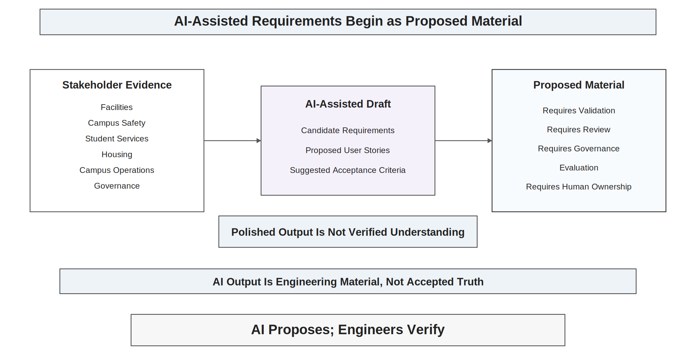
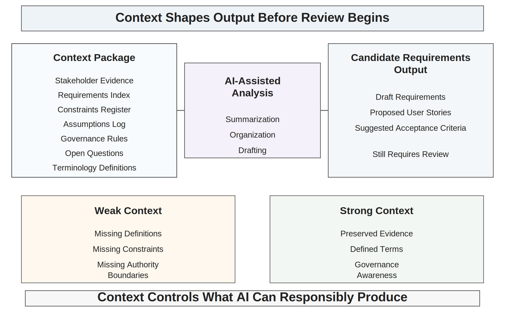
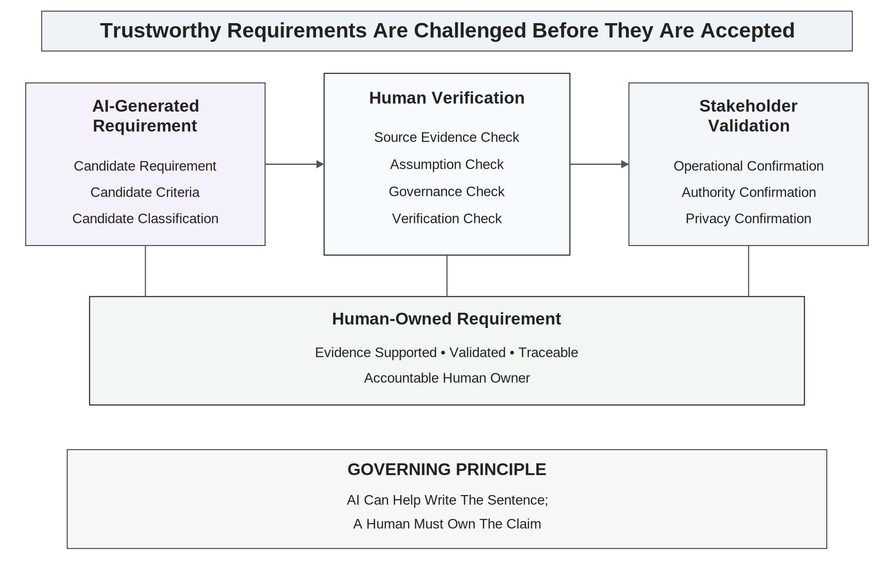
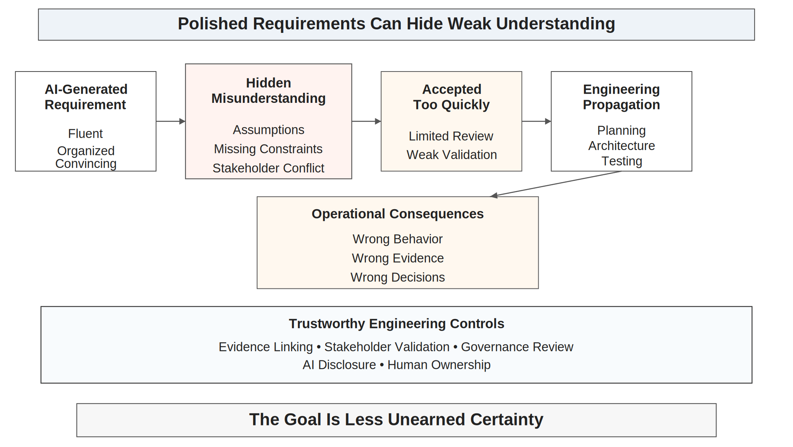
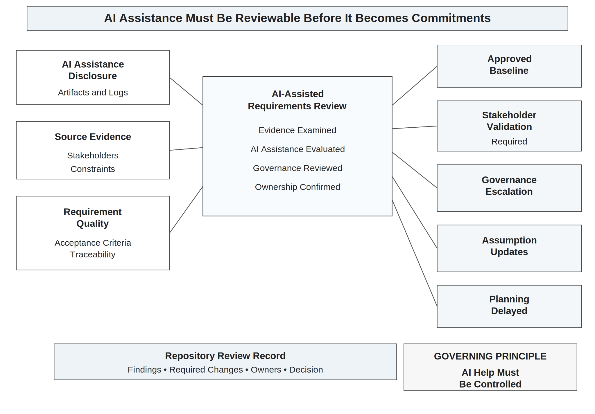

# Chapter 11<br><span class="chapter-title-main">AI-Assisted Requirements Engineering

## Opening Scenario: The Requirements Draft Looks Better Than the Understanding

The COICP team at Lakeside Metropolitan University (LMU) had reached a point that felt encouraging.

The project had a launch baseline. The repository had a clear front door. The requirements work from the previous chapter had produced stakeholder notes, a stakeholder map, a requirements index, a constraints register, an assumptions log, early acceptance criteria, and a Requirements Readiness Review record. The team was not operating from hallway conversations or memory. It had evidence.

That evidence was messy.

Facilities had described incidents in terms of maintenance priority, building location, equipment impact, and work-order routing. Campus Safety had described incidents in terms of urgency, threat level, escalation responsibility, and dispatch coordination. Student Services had focused on student impact, privacy, support pathways, and sensitive communication. Housing had emphasized residence-hall context, after-hours escalation, and coordination with staff on duty. Campus Operations wanted cross-department visibility and status history. IT wanted maintainable integrations and clear systems of record. Governance wanted to know who could see what, who could act, who could approve escalation, and what had to be auditable.

The requirements evidence was real, but it was not yet clean.

So the team did what modern teams often do. It used AI to help organize the material.

The AI system summarized interview notes. It grouped stakeholder concerns into themes. It proposed user stories. It drafted candidate requirements. It suggested acceptance criteria. It identified duplicate language. It even produced a polished requirements draft that looked more professional than anything the team had written manually.

At first, the team felt relief.

The draft made the project look organized. The language was fluent. The headings were logical. The acceptance criteria sounded testable. The requirements had IDs. The stakeholder concerns appeared to be reconciled.

Then one reviewer noticed a problem.

The draft used the word "urgent" as if every stakeholder meant the same thing. Facilities meant a maintenance priority that should be addressed soon. Campus Safety meant a possible threat requiring immediate attention. Student Services meant a student-support concern that might require private handling. Housing meant an after-hours residential issue that needed routing to the correct on-call staff. The AI summary had collapsed four operational meanings into one clean word.

Another reviewer noticed that the AI-generated routing requirement treated routing as assignment. That was not what every stakeholder meant. Sometimes routing meant notification. Sometimes it meant recommendation. Sometimes it meant transfer of responsibility. Sometimes it meant escalation to someone with authority.

A third reviewer saw that the draft proposed notification requirements without preserving privacy boundaries. It sounded helpful: notify responsible parties when an incident is submitted. But responsible parties had not been defined, and not every party should see every field.

The draft was not useless. It was useful enough to be dangerous.

It had helped the team see patterns faster. It had also made weak understanding look finished.

The team did not throw the draft away. That would have been the wrong lesson. Instead, the team changed how it treated the draft. It marked the AI output as proposed material. It linked candidate requirements back to source evidence. It identified places where stakeholder validation was still needed. It logged AI assistance in the repository. It opened review issues for invented assumptions, merged meanings, governance-sensitive terms, and weak acceptance criteria.

The team learned the central lesson of AI-assisted requirements engineering:

AI can help generate requirements artifacts. It cannot own stakeholder intent.

In trustworthy engineering, AI-assisted requirements are not accepted because they are polished. They are accepted only when evidence, validation, review, governance, and human ownership make them safe to use.



*Figure 11.1 — AI-Assisted Requirements Are Proposed Material*

---

## 11.1 AI-Assisted Requirements Are Proposed Material

Chapter 10 established that requirements are not feature lists. They are evidence-backed agreements about stakeholder needs, operational reality, constraints, risks, responsibilities, and acceptance conditions. Chapter 11 adds a necessary AI-era control: AI-assisted requirements are proposed material, not verified truth.

That distinction is not cosmetic. It changes how a team works.

A generated requirement can be clear, concise, and still wrong. It can use professional language while hiding missing stakeholders. It can appear testable while testing the wrong behavior. It can summarize a conflict as if it were agreement. It can turn an assumption into a statement. It can make a governance decision without showing who authorized it.

A team that treats AI output as accepted requirement truth has skipped engineering judgment. A team that treats AI output as proposed engineering material has created an opportunity for disciplined review.

The difference appears in repository behavior.

A weak team copies the AI-generated requirements into `requirements.md`, marks the task complete, and begins planning. A stronger team labels the draft as AI-assisted candidate requirements, links each requirement to stakeholder evidence, records what was generated, identifies what must be validated, and assigns human owners for review. The artifact enters the repository, but not as unchallenged truth.

A candidate requirement should not become part of the accepted requirements baseline until the team can answer several questions.

What source evidence supports it? Which stakeholder need does it represent? Which assumptions does it contain? Which constraints shape it? Which terms remain ambiguous? Which governance boundaries does it affect? What acceptance criteria would verify it? Who reviewed it? Who owns it? What was changed from the AI-generated version? What was rejected, and why?

These questions do not make AI assistance useless. They make AI assistance professional.

AI can help teams move from raw notes to candidate structure. It can help expose possible missing cases. It can draft acceptance criteria. It can compare two stakeholder statements and suggest areas of overlap. It can rewrite vague language into more testable language. It can produce useful review prompts.

But usefulness is not authority.

Requirements become authoritative only when accountable humans connect them to evidence, validate them against stakeholder reality, and accept responsibility for their consequences.

The key professional habit is to separate generation from acceptance.

Generation is fast. Acceptance is engineering.

---

## 11.2 Context Is Control in Requirements Work

AI-assisted requirements work depends on context. The quality of the output depends on what the AI system is given, what it is not given, what it infers, what it compresses, what it invents, and what humans later verify.

In requirements engineering, context is not background information. Context is control.

The COICP team cannot ask AI to "write requirements for an incident intake system" and expect trustworthy results. That prompt is too thin. It invites generic language and invented assumptions. The AI may produce requirements that sound plausible for many organizations but fail the actual LMU environment.

The context that matters includes stakeholder evidence, operational workflows, policy constraints, data visibility rules, authority boundaries, known conflicts, open questions, risk register items, terminology definitions, existing system limitations, and acceptance expectations.

When context is weak, AI fills gaps. Sometimes the gaps are filled with reasonable patterns. Sometimes they are filled with confident fiction.

For COICP, a weak context prompt might produce a requirement such as:

"The system shall automatically route incidents to the appropriate department based on incident type and urgency."

That sounds efficient. It also hides almost every important question. What does automatically mean? What does route mean? What is an incident type? Who defines urgency? Is AI involved? Does routing assign responsibility or merely notify? Can a human override it? What happens if the system routes incorrectly? What evidence is preserved? What privacy constraints apply?

A stronger context package would include the stakeholder map, definitions from the requirements index, the constraints register, known unresolved questions, governance-sensitive terms, and the team rule that AI-generated requirements must not imply authority without human review.

The resulting AI output may still be imperfect, but the team has reduced the chance that the system will invent the project.

Context control is not only about prompts. It is also about repository discipline. The team should preserve the context used to generate or revise AI-assisted requirements. Future reviewers should be able to reconstruct what information shaped the output. Without that record, the team cannot distinguish grounded assistance from free-floating invention.

This is why AI-use logs matter. They are not confession forms. They are engineering memory.

A useful AI-use log for requirements work should record what task AI assisted, what source material was used, what output was produced, what human review occurred, what was accepted, what was rejected, what was modified, and what risks or uncertainties remain.

Context is control because requirements become the context for everything that follows.

Planning uses requirements to estimate work. Architecture uses requirements to structure responsibility. Tests use requirements to define expected behavior. Release readiness uses requirements to defend completion. Operations use requirements to understand what the system was supposed to make true.

If AI helps create weak context, the weakness propagates.



*Figure 11.1 — Context Is Control in Requirements Work*

---

## 11.3 Where AI Helps Requirements Teams

A mature chapter on AI-assisted requirements should not pretend AI is useless. That would be dishonest and unhelpful. AI can help requirements teams in real ways, especially when teams are disciplined enough not to confuse assistance with authority.

AI can summarize large volumes of stakeholder notes. It can identify repeated themes across interviews. It can cluster similar concerns. It can produce first-draft user stories. It can suggest candidate acceptance criteria. It can rewrite vague statements into clearer alternatives. It can compare requirements for overlap or inconsistency. It can generate questions for stakeholder follow-up. It can help reviewers inspect requirements for ambiguity.

These are meaningful capabilities.

In COICP, the team might ask AI to summarize interview notes from Facilities, Campus Safety, Student Services, and Housing. The team might ask it to identify terms that appear across multiple stakeholders but may have different meanings. It might ask for a list of candidate assumptions. It might ask for possible acceptance criteria for a requirement that has already been grounded in stakeholder evidence. It might ask for edge cases the team should discuss before accepting a requirement.

Used this way, AI becomes a requirements assistant. It helps the team see the material from additional angles. It helps organize complexity. It helps reveal questions.

The best use of AI in requirements work often produces better questions, not final answers.

For example, an AI system might notice that several stakeholders use urgency language. A weak team lets AI standardize urgency into a single field. A stronger team uses the AI observation to ask: do these stakeholders mean the same thing by urgency? If not, should urgency be decomposed into maintenance priority, safety risk, student impact, and escalation sensitivity?

That is good AI-assisted requirements work. AI did not resolve the ambiguity. It helped the team notice where human analysis was needed.

AI can also support review. A reviewer can ask AI to inspect a requirements draft for ambiguous words, missing acceptance criteria, authority implications, privacy-sensitive behavior, or untested assumptions. The output is still proposed material, but it can sharpen the human review process.

A team should prefer AI assistance that makes uncertainty more visible over AI assistance that makes uncertainty disappear.

That rule is central.

AI is most valuable in requirements work when it improves the team's ability to ask, validate, trace, and review. It becomes dangerous when it allows the team to stop asking.

---

## 11.4 Where AI Fails Requirements Teams

AI-assisted requirements fail when teams mistake fluency for understanding.

The most common failure is invented assumption. The AI output includes a detail that was not in the source evidence, but the detail sounds so reasonable that no one questions it. The requirement begins as fiction and ends as implementation.

For COICP, AI might infer that every incident has one responsible department. That may be false. Some incidents may involve Facilities and Campus Safety, or Housing and Student Services, or IT and Campus Operations. If the requirement assumes one department, the architecture may later enforce the wrong operational model.

Another failure is smoothed conflict. Stakeholders disagree, but the AI summary produces a harmonized version that hides the disagreement. This can happen because summarization tends to compress differences into shared language. The result feels organized, but the organization is synthetic.

COICP stakeholders may all mention routing. The AI summary may conclude that stakeholders agree on incident routing. But Facilities may mean maintenance workflow assignment, Campus Safety may mean escalation authority, Student Services may mean visibility into student impact, and Operations may mean coordination status. The shared word hides different systems.

A third failure is missing stakeholder context. AI can summarize what it has, but it may not know whose voice is missing. If students, resident assistants, dispatchers, accessibility staff, legal counsel, or after-hours staff were not included in the source material, the AI output may still sound complete.

A fourth failure is authority drift. AI-generated requirements may imply that the system can recommend, assign, notify, escalate, or approve without making authority boundaries explicit. This is especially dangerous in intelligent systems because a requirement can quietly become delegated action.

A fifth failure is governance flattening. Privacy, auditability, data retention, correction paths, and override mechanisms can be treated as optional details rather than requirement-level constraints.

A sixth failure is acceptance theater. AI can generate acceptance criteria that sound testable but do not prove the requirement that matters. For example, an acceptance criterion might confirm that a notification is sent, but not confirm that the right information was sent to the right authorized role under the right privacy constraint.

A seventh failure is overconfidence through structure. Requirements with IDs, headings, tables, and acceptance criteria look mature. Structure can improve reviewability, but it can also make weak understanding look legitimate.

These failures are not reasons to ban AI. They are reasons to govern it.

Trustworthy teams learn to ask: What did AI make easier to see? What did it make easier to miss?

---

## 11.5 Human Verification and Stakeholder Validation

Human verification is not a final glance at AI output. It is an engineering activity.

A human reviewer must compare AI-assisted requirements against evidence. That means returning to stakeholder notes, constraints, assumptions, prior decisions, policies, and unresolved questions. The reviewer should not merely ask whether the generated requirement sounds good. The reviewer should ask whether it is supported.

Stakeholder validation is different from human review. A team member can inspect a requirement for clarity, traceability, and ambiguity. A stakeholder may need to confirm whether the requirement represents the operational need accurately.

Both are necessary.

For COICP, the team may review an AI-generated requirement that says:

"The system shall classify each incident as low, medium, or high urgency and route it to the responsible department."

A human reviewer should flag several issues. Does urgency mean the same thing across departments? Who defines the levels? Does routing assign ownership? What if multiple departments are involved? Are privacy-sensitive incidents handled differently? Can AI classify urgency? If so, is the classification advisory or authoritative? What evidence is logged? What override path exists?

Stakeholders then need to validate the corrected requirement. Facilities may confirm the maintenance-priority meaning. Campus Safety may require a separate threat indicator. Student Services may require privacy classification. Housing may require after-hours handling. Governance may require auditability and human approval for escalation-sensitive decisions.

The requirement becomes stronger not because AI wrote it, but because humans challenged it.

Human verification should include at least four checks.

First, source evidence check. Is the requirement grounded in actual stakeholder evidence, policy, incident history, or documented operational need?

Second, assumption check. What does the requirement assume about users, workflows, authority, data, timing, system behavior, or failure?

Third, governance check. Does the requirement imply access, approval, escalation, notification, routing, recommendation, deletion, or official communication?

Fourth, verification check. How will the team later know whether the requirement has been satisfied?

Stakeholder validation should be targeted. Not every stakeholder must approve every requirement. But requirements that affect authority, privacy, operational responsibility, or institutional risk must be validated by the appropriate stakeholders.

This is where human ownership becomes concrete.

A requirement should have an accountable human owner who can explain why it exists, what evidence supports it, what changed from the AI-generated draft, what risks remain, and who validated it.

AI can help write the sentence. A human must own the claim.



*Figure 11.3 — AI Output to Human-Owned Requirement*

---

## 11.6 Repository Evidence for AI-Assisted Requirements

Repository-centered engineering becomes more important when AI assists requirements work.

Without repository evidence, a team cannot reconstruct how a requirement was created, what AI contributed, what humans changed, what stakeholders validated, or what assumptions remain. The team may later discover that a requirement entered the baseline because it sounded plausible in a generated draft.

That is not engineering memory. That is accidental authority.

A repository should preserve AI-assisted requirements evidence in a way that is useful but not bureaucratic. The goal is not to archive every prompt forever without judgment. The goal is to preserve enough evidence to review, defend, revise, and learn from consequential requirements work.

A practical repository structure might include:

```text
/docs/requirements/
  requirements-index.md
  requirements-baseline.md
  acceptance-criteria.md
  requirements-change-log.md
  stakeholder-validation-record.md

/docs/ai/
  ai-use-log.md
  ai-assisted-requirements-notes.md
  rejected-ai-suggestions.md

/docs/assumptions/
  assumptions-log.md
  ai-generated-assumptions-review.md

/docs/constraints/
  governance-constraints.md
  data-visibility-constraints.md

/docs/reviews/
  ai-assisted-requirements-review.md
```

The exact structure can vary. The doctrine should not: AI-assisted requirements must be traceable.

The AI-use log should not become a dumping ground. It should answer practical engineering questions.

What did AI assist with? What source evidence was provided? What output was produced? What was accepted? What was modified? What was rejected? Who reviewed it? What stakeholder validation occurred? What risks remain?

Rejected AI suggestions may deserve preservation when they reveal a risk. For example, if AI repeatedly proposes automatic escalation without authority checks, that rejected suggestion is evidence of a governance risk the team must watch.

A requirements change log is also useful. AI-assisted work can cause subtle wording changes. A requirement that originally said "notify" might become "assign." A requirement that said "authorized staff" might become "users." A requirement that said "recommend" might become "automatically route." These changes matter.

The repository should make such changes visible.

This does not mean every sentence must be surrounded by ceremony. It means consequential changes must leave evidence.

Everything important leaves evidence.

---

## 11.7 Governance Boundaries in AI-Assisted Requirements

Governance begins in requirements. AI makes that more urgent.

An AI-generated requirement can accidentally define authority. It can say the system shall route, approve, prioritize, escalate, classify, notify, redact, delete, summarize, recommend, or assign. Each of those verbs can carry governance consequences.

In a traditional system, those consequences are already serious. In an intelligent system, they become sharper because AI may participate in classification, recommendation, summary generation, routing, or decision support.

For COICP, an AI-assisted requirement might say:

"The system shall automatically escalate high-risk incidents to Campus Safety."

This is not merely a functional requirement. It raises authority questions. Who defines high risk? Is AI determining high risk? Is escalation automatic or recommended? Does Campus Safety receive all data or only authorized fields? Is the submitter notified? Is the action logged? Can a human override or cancel escalation? What happens if the system escalates incorrectly? What happens if it fails to escalate?

Governance-sensitive requirements require stronger review.

The team should identify requirements that affect access rights, data visibility, notification, routing, escalation, approval, official communication, AI recommendation, record retention, deletion, auditability, override, rollback, or accountability.

Those requirements should not be accepted from AI-generated text without explicit human review.

AI can help identify governance-sensitive verbs, but the team must decide what they mean. A generated requirements draft should be inspected for words such as automatic, intelligent, route, assign, approve, escalate, notify, prioritize, recommend, detect, flag, hide, reveal, summarize, and delete.

These words are not forbidden. They are signals.

They tell the team where governance may be entering system behavior.

Governance-late engineering waits until implementation or release to ask authority questions. Trustworthy engineering asks them while requirements are still changeable.

The requirements phase is the cheapest time to prevent authority drift.

---

## 11.8 Acceptance Criteria and Testability Under AI Assistance

AI can generate acceptance criteria quickly. That is useful. It is also risky.

Acceptance criteria are not decoration at the bottom of a user story. They define what evidence will later count as satisfaction. Weak acceptance criteria create weak tests, weak reviews, and weak release claims.

AI-generated acceptance criteria often focus on visible behavior. A form submits. A notification appears. A status changes. A dashboard updates. These checks matter, but they may not cover the real requirement.

For COICP, an AI-generated acceptance criterion might say:

"Given a submitted incident, when the incident category is Facilities, then the system notifies Facilities."

That is a start. It does not verify authorization, data visibility, urgency interpretation, audit logging, failure handling, duplicate routing, privacy restrictions, or human override. It may prove that a simple path works while the operationally important path remains untested.

A stronger acceptance frame might ask:

Who is allowed to submit the incident? Which fields are required? Which fields are restricted? Which department receives which data? What event is logged? What happens when the category is ambiguous? What happens when the incident affects more than one department? What human review is required for escalation? What evidence proves that privacy rules were respected?

AI can help propose these questions. It cannot decide which ones are sufficient.

Acceptance criteria for AI-assisted requirements should be reviewed for five qualities.

They should be evidence-linked. The criterion should connect to a requirement and stakeholder need.

They should be operationally meaningful. Passing the criterion should say something important about the system's real behavior.

They should be governance-aware. If the requirement involves authority, data, or action, the criterion should verify the relevant boundary.

They should be testable or inspectable. Some criteria are verified by automated tests; others by review, stakeholder validation, security inspection, accessibility check, or operational evidence.

They should expose limitations. If the team cannot verify part of the requirement yet, that limitation should be visible.

AI can make acceptance criteria easier to draft. Human judgment determines whether they are worth trusting.

---

## 11.9 LMU Evolution: From Requirements Evidence to AI-Governed Requirements Evidence

By the end of Chapter 11, LMU has not built more of COICP. That is intentional.

The progress in this chapter is not feature progress. It is control progress.

At the beginning of the chapter, LMU has requirements evidence. It has stakeholder notes, a requirements index, assumptions, constraints, conflicts, and a Requirements Readiness Review record. The team understands that requirements must be grounded in operational reality.

At the end of the chapter, LMU has a stronger system for AI-assisted requirements work. The team can use AI without allowing AI-generated fluency to become unreviewed authority.

The repository now contains AI-use records for requirements assistance. Candidate AI-generated requirements are marked as proposed material. Accepted requirements link to stakeholder evidence. Modified requirements show human ownership. Rejected suggestions are preserved when they reveal risk. Governance-sensitive requirements receive additional review. Stakeholder validation is recorded where needed. Acceptance criteria are checked for operational meaning.

LMU has also matured culturally.

The team no longer treats AI assistance as either magic or contamination. It treats AI as a powerful contributor inside a controlled engineering process.

That maturity matters. Students often swing between two bad extremes. One extreme is hype: AI wrote it, so the team can move on. The other is avoidance: AI is risky, so do not use it. Trustworthy engineering chooses neither. It asks what AI can safely assist, what humans must own, what evidence must be preserved, and what governance controls are required.

LMU's operational trust is still developing. The system is not built, tested, released, or operated yet. But the requirements baseline is now more defensible because the team can explain how AI assistance was controlled.

That explanation matters for later planning.

A plan based on unvalidated AI-generated requirements is not a professional commitment. A plan based on reviewed, traceable, stakeholder-validated, human-owned requirements is still uncertain, but it is honest.

Honest engineering is mature engineering.

---

## 11.10 Failure Pattern: Polished Misunderstanding

The primary anti-pattern in this chapter is polished misunderstanding.

Polished misunderstanding occurs when AI-generated requirements appear clear, complete, and professional while hiding weak evidence, unresolved stakeholder conflict, invented assumptions, missing constraints, or governance drift.

It is dangerous because it feels like progress.

The team has a document. The language is strong. The requirements are numbered. The acceptance criteria are formatted. The scope looks manageable. Stakeholders may even skim it and assume someone else checked the details.

But the underlying understanding remains weak.

In COICP, polished misunderstanding might appear as a clean requirement for automatic routing that hides the difference between notification, recommendation, assignment, and escalation. It might appear as a privacy-neutral incident summary that exposes sensitive student information. It might appear as a single urgency field that collapses maintenance priority, safety threat, student impact, and housing escalation into one category. It might appear as acceptance criteria that test only the happy path.

Polished misunderstanding is especially dangerous because it travels well. A vague conversation may look weak. A polished document looks authoritative. Once copied into the repository, attached to issues, used for estimates, referenced in architecture, and translated into tests, it becomes harder to challenge.

The anti-pattern creates a failure chain:

AI generates fluent requirements. The team accepts them too quickly. Hidden assumptions become scope. Scope becomes plan. Plan becomes architecture. Architecture becomes implementation. Implementation becomes tests. Tests prove the wrong behavior. Release evidence defends the wrong claim. Operations inherit the misunderstanding.



*Figure 11.4 — Polished Misunderstanding Failure*

Trustworthy engineering counters polished misunderstanding by slowing acceptance without stopping assistance.

The corrective practices are clear: label AI output as proposed material, link requirements to evidence, validate stakeholder meaning, review governance-sensitive verbs, inspect assumptions, strengthen acceptance criteria, record AI use, preserve human ownership, and submit the baseline to review.

The goal is not less AI. The goal is less unearned certainty.

---

## 11.11 AI-Assisted Requirements Review

Chapter 10 introduced the Requirements Readiness Review. Chapter 11 introduces the AI-Assisted Requirements Review.

The purpose of this review is to determine whether AI-assisted requirements work is grounded, validated, disclosed, reviewable, governable, and human-owned.

This review is not a ceremony. It is an engineering safety mechanism.

The review should occur before AI-assisted candidate requirements are treated as part of the accepted requirements baseline and before planning commitments depend on them. It may also occur when a significant requirements revision uses AI assistance.

The review asks several core questions.

What requirements or artifacts were AI-assisted? What source evidence was provided to AI? What did AI generate or change? What did humans accept, reject, or modify? Are accepted requirements linked to stakeholder evidence? Are stakeholder conflicts preserved rather than smoothed away? Are assumptions identified? Are governance-sensitive terms reviewed? Are privacy, authority, escalation, notification, and audit implications visible? Are acceptance criteria meaningful? Are unresolved questions assigned to owners? Is human ownership clear?

The review should produce concrete outputs.

It may approve the AI-assisted requirements baseline. It may require stakeholder validation. It may require assumption-log updates. It may require governance escalation. It may require requirements wording changes. It may reject candidate requirements. It may update the risk register. It may create issues for unresolved questions. It may delay planning until evidence is stronger.

The review should be documented in the repository.

A useful review record should include review date, reviewers, artifacts reviewed, AI-use log references, key findings, required changes, accepted risks, open questions, owners, and decision.

This review strengthens engineering judgment because it forces the team to defend not only what the requirements say, but how they came to say it.

That is the right question in the AI era.

The issue is not whether AI helped. The issue is whether the team can show that AI help was controlled.



*Figure 11.5 — AI-Assisted Requirements Review*

---

## 11.12 Operational Takeaways

AI-assisted requirements engineering is not about letting AI replace requirements work. It is about using AI inside disciplined requirements work.

AI-assisted requirements are proposed material, not verified truth.

Polished language is not evidence of understanding.

Context is control. Weak context invites invented assumptions, generic requirements, and false alignment.

AI can summarize stakeholder language, but it cannot own stakeholder intent.

AI can help identify patterns, but humans must validate meaning.

AI can draft acceptance criteria, but humans must decide whether the criteria prove the right behavior.

Stakeholder conflicts should be preserved and resolved deliberately, not smoothed away by summary.

Governance-sensitive requirements require extra care because verbs such as route, assign, escalate, notify, approve, classify, and delete can imply authority.

AI-use evidence belongs in the repository when it affects consequential requirements work.

Human ownership begins where AI fluency ends.

A requirements baseline is stronger when the team can explain what AI contributed, what humans changed, what stakeholders validated, what assumptions remain, and what governance risks are controlled.

---

## 11.13 Exercises

### Exercise 1: Trace AI-Generated Requirements to Evidence

Create the repository artifact:

`/docs/requirements/ai_requirements_trace_review.md`

Review an AI-generated COICP requirements draft alongside a set of stakeholder notes.

For each requirement, determine whether it is:

- Supported by evidence
- Weakly supported
- Unsupported
- Pending stakeholder validation

For every weakly supported or unsupported requirement, document:

- Missing evidence
- Required validation activity
- Repository note
- Associated risk

Determine whether the requirements set is acceptable for baseline formation.

### Exercise 2: Detect Synthetic Clarity

Create the repository artifact:

`/docs/requirements/synthetic_clarity_review.md`

Review an AI-generated summary of stakeholder interviews.

Identify at least five locations where disagreement, uncertainty, ambiguity, or competing priorities have been presented as consensus.

Rewrite the summary to preserve:

- Disagreement
- Uncertainty
- Open questions
- Conflicting stakeholder priorities

Explain how synthetic clarity can create future engineering risk.

### Exercise 3: Conduct an Assumption Review

Create the repository artifact:

`/docs/requirements/assumptions_log.md`

Inspect a set of AI-generated requirements and identify embedded assumptions.

Classify each assumption as:

- Low Risk
- Moderate Risk
- High Risk

For each assumption, document:

- Description
- Operational consequence
- Governance implication
- Recoverability concern
- Recommended action

Identify which assumptions require stakeholder validation before planning can begin.

### Exercise 4: Review Governance-Sensitive Requirements

Create the repository artifact:

`/docs/requirements/governance_sensitive_requirement_review.md`

Review requirements containing authority-bearing actions such as:

- Route
- Assign
- Escalate
- Notify
- Approve
- Classify
- Recommend
- Delete
- Summarize

For each requirement, identify:

- Authority boundary
- Required human oversight
- Required audit evidence
- Failure consequence
- Governance concerns

Determine whether the requirement adequately preserves accountability.

### Exercise 5: Evaluate AI-Assisted Acceptance Criteria

Create the repository artifact:

`/docs/requirements/acceptance_criteria_review.md`

Review AI-generated acceptance criteria for COICP incident intake.

Determine whether each criterion verifies:

- Meaningful system behavior
- Surface-level behavior only
- Missing operational concerns
- Missing governance concerns

Rewrite weak acceptance criteria to address areas such as:

- Data visibility
- Authorization
- Auditability
- Exception handling
- Stakeholder validation

Evaluate whether the revised criteria provide meaningful verification capability.

### Exercise 6: Conduct an AI-Assisted Requirements Review

Create the repository artifact:

`/docs/governance/reviews/ai_assisted_requirements_review_record.md`

Conduct an AI-Assisted Requirements Review.

Evaluate:

- Requirements traceability
- Evidence quality
- Assumption management
- Stakeholder validation
- Governance-sensitive requirements
- Acceptance-criteria quality
- Open risks

Document:

- Findings
- Evidence gaps
- Required revisions
- Owner assignments
- Open risks
- Recommended next actions

Determine whether the requirements baseline should be:

- Accepted
- Accepted with conditions
- Revised
- Escalated
- Delayed

Justify the decision using repository evidence.

Identify which findings must be inherited by Chapter 12 planning and risk activities.

---

## 11.14 Closing: From AI-Governed Requirements to Planning

By the end of Chapter 11, the COICP team has learned something important about AI-era engineering.

The risk is not that AI writes bad requirements every time. The risk is that AI can write plausible requirements before the team has earned the right to trust them.

That difference matters.

The team now has a requirements baseline that is not merely written. It is reviewed. It is linked to stakeholder evidence. It preserves known conflicts. It names assumptions. It records AI assistance. It identifies governance-sensitive behavior. It strengthens acceptance criteria. It assigns human ownership.

The team has not eliminated uncertainty. It has made uncertainty visible enough to plan responsibly.

That distinction matters because planning converts understanding into commitment. Estimates, schedules, dependencies, staffing assumptions, risk exposure, and delivery promises all inherit the quality of the requirements baseline that feeds them.

A plan built on AI-generated certainty is fragile. A plan built on reviewed evidence is still imperfect, but it is honest. Honest planning does not require perfect knowledge. It requires visible assumptions, visible uncertainty, visible risk, and accountable ownership.

Chapter 12 begins with that responsibility.

The next question is no longer only, "What must the system do?"

The next question is:

What can the team responsibly commit to, what risks remain, what tradeoffs must be made, and what evidence will show whether the plan is still true?
