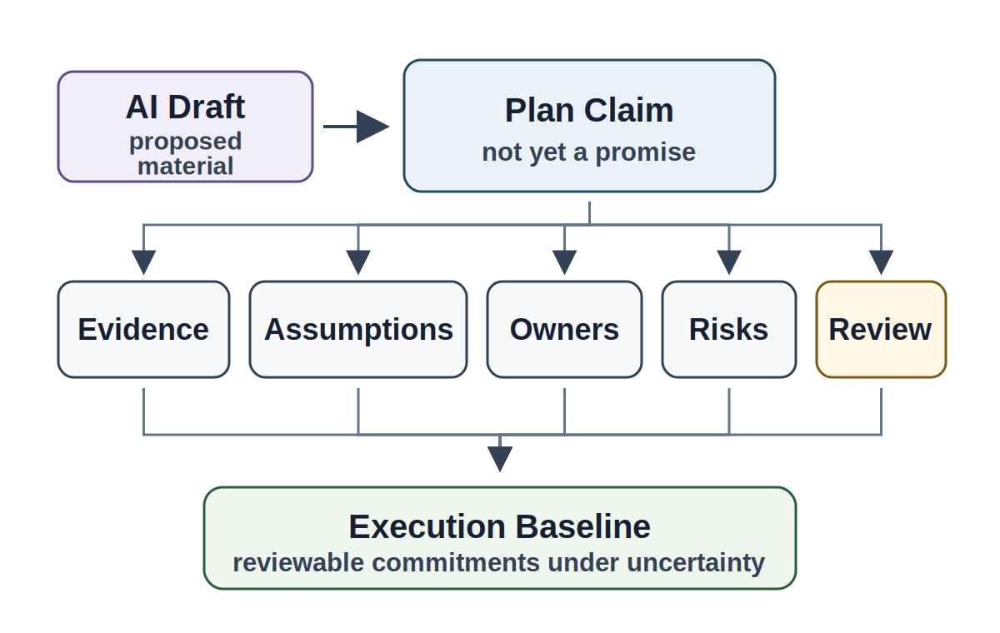
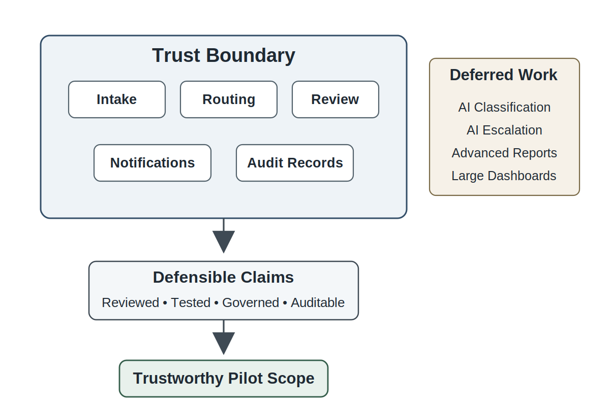
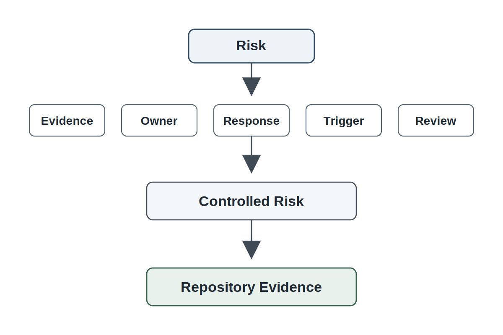
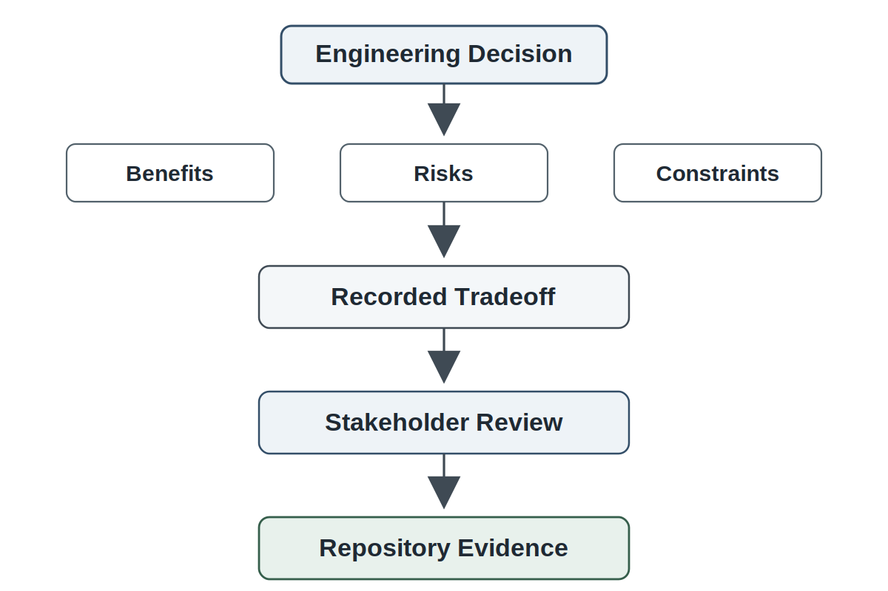
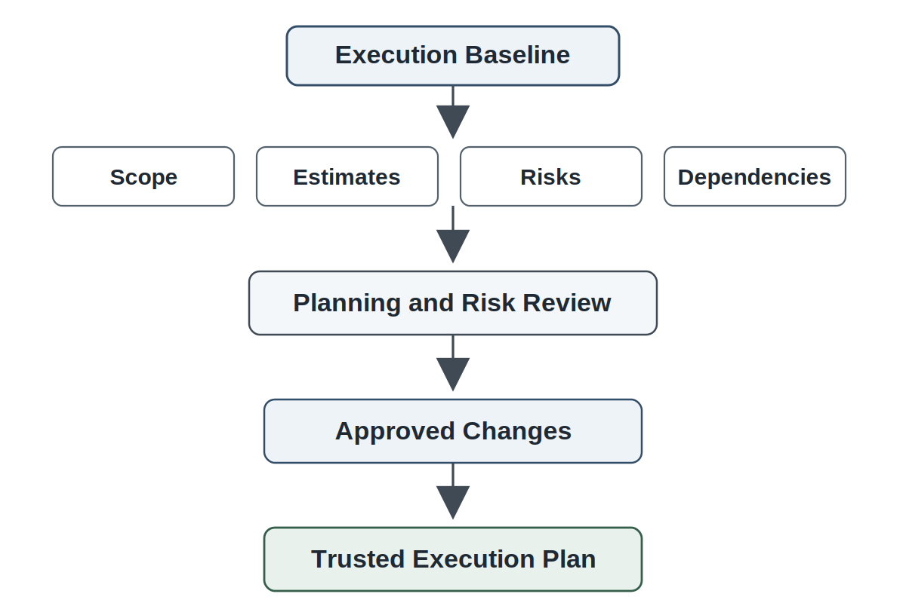

# Chapter 12<br><span class="chapter-title-main">Planning, Estimation, Risk, and Tradeoffs

> A plan is not a promise that uncertainty has disappeared. A plan is visible engineering judgment about what the team believes, what it does not yet know, what risks it accepts, and what it will do when reality changes.

## Opening Scenario: The Plan Looks Finished Before the Team Understands the Work

The COICP team at Lakeside Metropolitan University (LMU) had reached a point that felt both satisfying and dangerous.

The requirements were no longer a loose collection of stakeholder wishes. Chapter 10 had forced the team to slow down and understand the problem before building. Chapter 11 had forced the team to treat AI-assisted requirements as proposed material, not verified truth. Stakeholder notes had been preserved. AI-generated summaries had been reviewed. Assumptions had been named. Privacy and authority constraints had been separated from ordinary feature requests. The Requirements Readiness Review and the AI-Assisted Requirements Review had done their job: the team now had enough evidence to begin deciding what it could responsibly attempt first.

That was when the planning pressure arrived.

Leadership wanted visible progress. Campus Operations wanted an initial pilot. Facilities wanted intake and routing. Campus Safety wanted escalation rules handled carefully. Student Services wanted privacy controls before any student-impacting workflow became visible. IT wanted the team to avoid hard-coding assumptions that would be expensive to reverse later. The students on the project wanted to build something demonstrable. The project now had momentum, and momentum wanted a schedule.

The first plan looked impressive.

An AI assistant helped turn the requirements baseline into a task breakdown. It proposed milestones, grouped work into phases, estimated effort, identified dependencies, and produced a clean timeline. The output looked professional. It was easy to read. It made the project feel manageable.

It also hid several problems.

The plan treated incident intake, routing, notifications, privacy controls, review evidence, and governance checks as if they were comparable tasks. It assumed that one developer could pick up privacy-sensitive routing logic as easily as another developer could build a form field. It listed Campus Safety escalation as a feature without giving the team time to resolve authority questions. It pushed testing and review near the end. It included a governance review milestone but gave it no real time. It assumed that AI-generated task estimates were neutral even though they were based on generic patterns rather than LMU's actual constraints. It did not identify which risks needed owners. It did not say what would happen if an estimate was wrong.

The plan was not useless. It was a useful draft. But it was not yet a trustworthy plan.

That distinction matters. Planning is often where teams first begin lying to themselves politely. They do not intend to deceive anyone. They simply convert uncertainty into dates, risk into optimism, dependencies into assumptions, and scope pressure into a document that looks complete. The result is commitment theater: the performance of confidence without the evidence needed to justify it.

The COICP team did not need a prettier schedule. It needed an execution baseline that could survive contact with reality. It needed a plan that preserved assumptions, exposed risk, assigned owners, recorded tradeoffs, and created a mechanism for re-estimation when the project learned something new.

In trustworthy engineering, planning is not calendar decoration. It is engineering judgment under uncertainty.



*Figure 12.1 — The Plan Is an Engineering Claim*

---

## 12.1 Planning Is Engineering Judgment Under Uncertainty

Planning is sometimes taught as if it were mainly a scheduling activity. Teams list tasks, estimate effort, assign owners, place dates on a calendar, and call the result a plan. That view is too thin for trustworthy engineering.

A plan is a set of engineering claims. It claims that the team understands enough to proceed. It claims that the proposed scope is appropriate for the available time and people. It claims that dependencies are visible. It claims that risks are acceptable or at least actively managed. It claims that review, testing, governance, and operational evidence have not been forgotten. It claims that the team knows what it will do when those claims turn out to be incomplete.

Those claims require evidence. A plan that cannot explain its assumptions is not mature. A plan that cannot identify risk is not mature. A plan that has no mechanism for re-estimation is not mature. A plan that gives every task the same confidence level is not mature. A plan that treats AI-generated estimates as objective truth is not mature.

Planning matters because it is the first major translation from understanding into commitment. Requirements describe what the system must make true. Planning decides what the team will attempt, in what order, with what confidence, under what constraints, and with what responsibility for the consequences.

This does not mean that plans must be perfect. They cannot be. Planning is performed under uncertainty. The professional question is not whether the team can eliminate uncertainty. The question is whether the team can make uncertainty visible enough to manage.

The COICP team sees these differences immediately. Some requirements are straightforward while others carry unresolved authority, privacy, or governance questions. Some work can be implemented and reviewed incrementally. Other work depends on stakeholder validation, architectural decisions, or constraints that are not yet fully understood. Some estimates are grounded in prior experience. Others are informed guesses surrounded by uncertainty.

A trustworthy plan does not flatten those differences into a single level of confidence. It preserves them so the team can make better decisions as new evidence appears.

Everything important leaves evidence. Planning evidence should show what the team believes, what it assumes, what it does not yet know, who owns which risks, and when the plan must be revisited. That evidence does not slow the team down for the sake of bureaucracy. It protects the team from pretending that a confident document is the same thing as responsible execution.

---

## 12.2 Scope Is a Trust Decision

Scope is often treated as a negotiation about how many features can fit into a time window. That framing misses the deeper engineering issue. Scope is a trust decision.

When a team chooses scope, it chooses what claims it will later defend. It chooses what behavior will be implemented, reviewed, tested, governed, and possibly released. It chooses what risks it will carry forward. It chooses what work it will defer honestly and what work it will accidentally hide.

In COICP, the team cannot responsibly include every desired capability in the first construction cycle. Incident intake, departmental routing, privacy controls, escalation logic, notification drafting, status tracking, dashboard summaries, AI-assisted classification, audit evidence, and stakeholder reporting are all valuable. They are not all equally safe to include immediately.

The team must distinguish a useful pilot scope from an ambitious feature inventory. A pilot that handles basic incident intake, simple routing, explicit human review, limited notification, and auditable records may be more trustworthy than a larger release that includes AI-assisted escalation before authority boundaries are mature.

This is not small thinking. It is engineering discipline.

Scope should be evaluated against evidence. What requirements are clear enough? What constraints are resolved? What dependencies remain unknown? Which features create governance exposure? Which features require architecture decisions before planning can be credible? Which work can be tested with confidence? Which work would produce the most learning with the least institutional risk?

A team that cuts scope responsibly is not admitting weakness. It is preserving trust. Over-scoping does not create more capability. It creates more unreviewed surfaces, more hidden assumptions, more rushed tests, more unclear ownership, and more release claims the team cannot defend.

Scope is also where AI-era planning becomes risky. AI can produce a broad, confident task list that makes large scope feel manageable. But AI does not know the team's actual time, experience, institutional relationships, review burden, stakeholder availability, or governance constraints unless those are provided and verified. Generated scope can become synthetic ambition.

The COICP team therefore treats scope as a boundary around defensible trust. The first cycle should include enough work to prove real engineering progress, but not so much that review, evidence, governance, and testing become theater.



*Figure 12.2 — Defensible Scope and the Trust Boundary*

---

## 12.3 Estimation Is Not Prediction

Estimation is one of the most misunderstood activities in software engineering. Students often think an estimate is a guess about how long something will take. Managers sometimes treat an estimate as a commitment. Teams sometimes treat an estimate as a number to defend even after reality changes.

A better definition is this: an estimate is a monitored engineering claim about effort, uncertainty, and assumptions.

The important word is monitored. An estimate is not trustworthy because it was stated confidently. It is trustworthy when the team can explain what evidence supports it, what assumptions shape it, what confidence level it carries, what risks may invalidate it, and when it should be revised.

For COICP, estimating a basic intake form is not the same as estimating privacy-sensitive routing. Estimating a status field is not the same as estimating a notification workflow that may expose student-impacting information. Estimating a human-reviewed routing suggestion is not the same as estimating AI-assisted classification. The size of the work is not only the amount of code. It is the amount of understanding, review, governance, testing, integration, and operational consequence attached to the work.

Estimates should therefore preserve assumptions. If the estimate for incident intake assumes a fixed list of categories, that assumption belongs in the planning evidence. If the estimate for routing assumes department mappings are available and agreed upon, that assumption belongs in the planning evidence. If the estimate for notifications assumes email is sufficient and no urgent escalation channel is required, that assumption belongs in the planning evidence. If AI generated the first estimate, the team should record that AI assisted, what context was provided, and how humans reviewed the result.

The team should also separate estimate precision from estimate confidence. A task estimated at four hours may be less trustworthy than a task estimated at one to two days if the four-hour estimate hides uncertain authority rules. Precise numbers can create false confidence. Ranges, confidence notes, and assumptions are often more honest than single numbers.

This does not excuse sloppy planning. It requires better planning. The team should use estimation to expose uncertainty, not to conceal it. When uncertainty is high, the plan may include discovery tasks, prototypes, stakeholder validation, architecture spikes, or review checkpoints before implementation commitments harden.

AI assistance can be useful here. AI can suggest missing tasks, compare similar work items, identify possible dependencies, and ask estimation questions the team forgot. But AI cannot know whether LMU's privacy officer will approve a workflow. It cannot know whether the team has experience with a particular integration. It cannot assume that generated task size matches local reality. AI can help estimate. It cannot own the estimate.

AI proposes; engineers verify. In planning, that means AI may draft the estimate, but humans own the commitment.

---

## 12.4 Risk Must Have Evidence, Owner, and Response

Many teams create risk registers. Fewer teams use them as engineering controls.

A risk is not managed because it appears in a table. A risk is managed when it has evidence, likelihood, impact, an owner, a response, a trigger, and a review path. Without those elements, the risk register becomes another form of theater.

COICP's risks are not abstract. Privacy-sensitive information might be visible to the wrong department. Routing rules might imply authority that LMU has not approved. Notification behavior might create operational confusion. Stakeholders might disagree after implementation begins. AI-generated planning might omit review work. Student developers might overestimate capacity. Integration assumptions might fail. Testing might be squeezed because implementation took longer than expected.

Each of those risks requires a different response. Some require mitigation. Some require avoidance. Some require acceptance by the right authority. Some require a discovery task. Some require a scope cut. Some require architectural attention before implementation begins.

The risk owner matters. A risk without an owner is wishful thinking. If privacy visibility is risky, someone must own the follow-up. If routing authority is unresolved, someone must own stakeholder clarification. If AI-assisted estimates may be unreliable, someone must own human review. If testing time is threatened, someone must own the plan adjustment before testing becomes symbolic.

The response must also be concrete. Saying 'monitor risk' is often too vague. Monitor what? Who will look? When? What signal means action is required? What action follows? A trustworthy plan defines triggers. If routing rules are not validated by a certain review point, the team reduces scope. If privacy constraints remain unresolved, the team disables sensitive notifications. If estimate variance exceeds a threshold, the team re-estimates and updates the issue plan.

Risk work also belongs in the repository. Risk should be linked to requirements, issues, assumptions, architecture decisions, tests, and review records. This prevents risk from becoming a side document no one reads. In repository-centered engineering, risk is part of the evidence chain.



*Figure 12.3 — Risk Register as Engineering Control*

---

## 12.5 Dependencies and Sequencing

Planning is not only deciding what work exists. It is deciding what order makes the work responsible.

Dependencies reveal hidden structure. Some work cannot begin until requirements are clarified. Some cannot begin until a stakeholder approves a constraint. Some cannot begin until the repository has a supporting artifact. Some cannot be tested until another component exists. Some should not be built before architecture decisions are made.

In COICP, the team might want to build notifications quickly because they are visible and satisfying. But notification behavior depends on routing rules, privacy classifications, user roles, and escalation authority. If notifications are built before those dependencies are understood, the team may produce working code that sends the wrong information to the wrong people at the wrong time.

Incident intake appears simpler, but even intake has dependencies. Categories affect routing. Location precision affects Campus Safety expectations. Student-impact fields affect privacy. Urgency fields affect escalation. What looks like a form is actually a set of future operational commitments.

Sequencing should therefore reflect risk. The team may begin with a minimal intake path that captures safe fields, preserves audit evidence, and supports manual review. It may defer automated routing until stakeholders validate department mappings. It may defer AI-assisted classification until later chapters introduce stronger testing, oversight, and operational monitoring. This is not delay for its own sake. It is sequencing according to trustworthiness.

Dependencies also reveal architecture pressure. When the plan shows that routing, notification, privacy, status tracking, and audit evidence all depend on shared concepts, the team can see that architecture will soon matter. Planning does not solve that architecture. It exposes why architecture is necessary.

A dependency map should show more than technical prerequisites. It should include stakeholder dependencies, governance dependencies, evidence dependencies, review dependencies, testing dependencies, and operational dependencies. A work item that depends on governance review is not independent simply because a developer can code it locally.

This is one reason Chapter 12 belongs before architecture. Planning makes structural questions visible. Chapter 13 will use those questions to reason about boundaries, responsibilities, interfaces, and decisions.

---

## 12.6 Tradeoffs Are Engineering Decisions

Every plan contains tradeoffs, whether the team names them or not.

The familiar project-management triangle of time, scope, and cost is useful but incomplete. Trustworthy engineering must also account for quality, reviewability, governability, security, observability, recoverability, usability, maintainability, stakeholder confidence, and human oversight. In intelligent systems, tradeoffs also include AI delegation boundaries, context quality, verification burden, and accountability.

The COICP team cannot maximize everything. If it expands scope, review time may shrink. If it accelerates notifications, governance review may be weaker. If it adds AI-assisted routing early, testing and oversight requirements increase. If it delays privacy controls, the pilot may become unacceptable. If it avoids every risk, it may fail to produce useful learning. The question is not whether tradeoffs exist. The question is whether the team makes them visible and responsible.

Tradeoffs should be recorded as decisions, not buried in conversation. If the team chooses manual routing for Cycle 1 instead of automated routing, the repository should preserve why. If the team defers AI-assisted classification, the repository should preserve the risk reasoning. If the team reduces dashboard scope to protect privacy review and testing, that decision should be visible. Future reviewers should not have to reconstruct the plan from memory.

Some tradeoffs require stakeholder or governance approval. A team may decide it can accept a usability limitation in a pilot. It may not be allowed to accept a privacy exposure on behalf of the institution. A team may defer an aesthetic improvement. It may not defer auditability if auditability is a condition of responsible operation. Governance is architecture, but governance is also planning pressure.

Tradeoffs are not failures. They are evidence of engineering judgment when made honestly. The failure is pretending that no tradeoff was made.



*Figure 12.4 — Tradeoff Triangle Is Not Enough*

---

## 12.7 AI-Assisted Planning: Useful Drafts, Dangerous Confidence

AI can help planning. It can generate a first-pass work breakdown structure. It can identify possible missing tasks. It can suggest dependencies. It can transform requirements into issues. It can propose milestones. It can compare risks across work items. It can help rewrite vague tasks into clearer work items. It can challenge the team with questions it might not have considered.

Those uses are valuable. They are also dangerous when the team confuses generated planning artifacts with verified planning judgment.

AI-generated plans tend to look complete. They may use confident language, balanced categories, clean sequencing, and professional formatting. That fluency can lower the team's skepticism. A polished plan may hide missing review tasks, unowned risks, unrealistic sequencing, weak estimates, governance-late decisions, and assumptions imported from generic software projects rather than LMU's actual context.

The COICP team should use AI as a planning assistant, not a planning authority. That means giving the AI controlled context, asking it to expose uncertainty rather than hide it, requiring it to identify assumptions, and reviewing its output against stakeholder evidence and repository artifacts.

A useful prompt might ask AI to identify risks, missing tasks, dependencies, and review needs in a proposed plan. A risky prompt asks AI to create the final schedule from a list of features. The first use supports engineering judgment. The second may replace judgment with synthetic confidence.

AI-assisted planning should be disclosed in the repository. The AI-use log should record where AI helped generate WBS items, risk candidates, dependency suggestions, or milestone drafts. Accepted output should be human-reviewed. Rejected output may still be useful if it reveals misunderstandings. Modified output should show what humans changed and why.

AI cannot own capacity assumptions. It cannot decide what risk LMU should accept. It cannot negotiate stakeholder priorities. It cannot determine whether governance review can be shortened. It cannot know whether a student team can responsibly build, test, review, and defend a feature in the available time unless humans provide and verify that context.

AI proposes; engineers verify. In Chapter 12, the verification burden includes scope, estimates, risk, dependencies, tradeoffs, and commitments.

---

## 12.8 Planning as Repository Evidence

A plan that exists only in a meeting, chat thread, spreadsheet, or slide deck is fragile. It may guide short-term activity, but it does not create durable engineering evidence.

Chapter 9 established the repository as the engineering system of record. Chapter 10 placed requirements evidence into that record. Chapter 11 placed AI-assisted requirements evidence into that record. Chapter 12 now places planning evidence into that record.

The repository should answer several planning questions. What scope did the team choose? What was deferred? What assumptions shape the estimates? Which risks are known? Who owns them? Which dependencies affect sequencing? Which tradeoffs were made? What AI assistance was used? When will the team re-estimate? What review approved the execution baseline?

A useful planning structure might include:

```
/docs/planning/
  scope-baseline.md
  wbs.md
  milestones.md
  estimation-notes.md
  dependency-map.md
  tradeoff-record.md
  re-estimation-log.md
/docs/risks/
  risk-register.md
/docs/reviews/
  planning-and-risk-review.md
/docs/ai/
  ai-use-log.md
```

The exact structure can vary, but the principle should not. Planning evidence must be inspectable and connected to the rest of the engineering record.

Issues should link to requirements and scope decisions. Tasks should show owners and dependencies. Risk-related issues should reference the risk register. Governance-sensitive work should carry visible labels or review requirements. AI-assisted tasks should disclose where AI contributed. Re-estimation notes should explain why the plan changed rather than silently rewriting history.

This does not turn planning into bureaucracy. It turns planning into reviewable memory. Without this evidence, the team cannot later explain why scope changed, why a risk was accepted, why a deadline moved, why a feature was deferred, or why a release claim should be trusted.

Everything important leaves evidence. A plan is important.

---

## 12.9 Planning and Risk Review

Planning needs a review mechanism because planning claims can be wrong in consequential ways.

The Chapter 12 review-board mechanism is the Planning and Risk Review. Its purpose is to determine whether the team has a realistic, evidence-backed, risk-aware execution baseline before architecture and implementation accelerate.



*Figure 12.5 — Planning and Risk Review*

The review asks:

Is the selected scope defensible for the cycle? Are estimates tied to assumptions and confidence levels? Are risks identified, owned, and connected to responses? Are dependencies visible? Are governance-sensitive tasks given time and authority review? Are testing and review included as real work rather than end-of-cycle wishful thinking? Is AI-assisted planning disclosed and verified? Are re-estimation triggers defined? Is the team ready to proceed, or does the plan expose unresolved structural questions that must be addressed first?

The output of the review is not merely approval. It may produce a revised scope baseline, risk register updates, dependency corrections, estimate adjustments, stakeholder follow-up items, governance escalation items, AI-use log corrections, architecture readiness questions, and re-estimation triggers.

This review strengthens engineering judgment because it forces the team to defend planning as evidence rather than confidence. It also protects architecture. Architecture should not be asked to rescue a plan that overcommits, hides risk, or ignores dependencies. Implementation should not begin from a plan that excludes review and testing. Release readiness should not later inherit risks the team refused to name.

Review is an engineering safety mechanism. In Chapter 12, that safety mechanism protects the transition from understanding into execution.

---

## 12.10 LMU Evolution: From Requirements Baseline to Execution Baseline

By the end of Chapter 12, LMU has not built the full COICP system. It has done something less visible but structurally essential: it has transformed a requirements baseline into an execution baseline.

At the beginning of the chapter, COICP had stakeholder evidence, requirements, assumptions, constraints, AI-assisted requirements review, and readiness decisions. That was not enough to build responsibly. The team still needed to decide what work belonged in the first cycle, what risks the cycle carried, what tradeoffs were acceptable, what dependencies shaped sequencing, and what commitments the team could defend.

At the end of the chapter, the team has a scoped Cycle 1 plan. It has a work breakdown structure. It has milestone logic. It has estimate assumptions. It has a risk register with owners. It has a dependency map. It has a tradeoff record. It has re-estimation triggers. It has AI-use records for planning assistance. It has a Planning and Risk Review output.

The team's maturity has changed. It is no longer merely able to explain what problem it is solving. It can now explain what it will attempt first and why that attempt is responsible.

This maturity includes honesty about what is not included. COICP may not include AI-assisted escalation in Cycle 1. It may not automate every routing decision. It may not provide every dashboard leadership wants. It may not implement every notification workflow. Those deferrals are not failures if the team records the reasoning and protects trustworthiness.

LMU's enterprise tensions remain. Leadership still wants progress. Departments still want capability. Governance still wants authority boundaries respected. Students still want demonstrable work. Operations still want visibility. The plan does not eliminate those tensions. It makes them governable.

That is progress. Honest engineering is mature engineering.

---

## 12.11 Failure Pattern: Commitment Theater

The primary anti-pattern in this chapter is commitment theater.

Commitment theater occurs when a team produces a plan that performs confidence without preserving the evidence needed to justify the commitment. The plan may look complete. It may contain milestones, tasks, owners, and dates. It may be formatted professionally. It may satisfy a reporting requirement. But underneath, assumptions are hidden, risks are unowned, estimates are unsupported, dependencies are missing, governance review is symbolic, and re-estimation is treated as failure rather than learning.

Commitment theater is dangerous because it makes weak planning socially difficult to challenge. Once the team has displayed a confident plan, admitting uncertainty can feel like incompetence. Students may then protect the plan instead of protecting the project. They may keep dates that no longer make sense, compress review, defer testing, ignore risk, or quietly reduce quality to preserve the appearance of progress.

Commitment theater often appears with related anti-patterns.

Estimate laundering occurs when rough guesses become official commitments without preserving uncertainty or assumptions. AI-generated estimate laundering occurs when generated numbers make weak estimates appear objective.

Scope inflation occurs when the team keeps adding work because each addition seems small in isolation. The plan grows until review, testing, governance, and operational evidence no longer fit.

Deadline theater occurs when the team treats dates as proof of discipline even though the dates are not connected to capacity, dependencies, risk, or evidence.

Risk register theater occurs when risks are listed but not owned, mitigated, monitored, or reviewed.

Dependency blindness occurs when tasks are planned as if they are independent even though stakeholder, governance, data, architecture, or testing dependencies determine the real work order.

Governance-late planning occurs when authority, privacy, approval, auditability, or human oversight work is postponed until after implementation has already shaped the system.

Trustworthy engineering counters these failures by treating planning as evidence. It names assumptions, uses ranges when appropriate, links scope to requirements, assigns risk owners, records tradeoffs, discloses AI assistance, includes review and testing as real work, and defines re-estimation triggers before reality forces them.

The goal is not to make planning heavy. The goal is to make commitments honest.

---

## 12.12 Operational Takeaways

Planning is not pretending uncertainty is gone. It is making uncertainty visible enough to manage.

A plan is an engineering claim. It should preserve assumptions, evidence, risk, owners, dependencies, tradeoffs, and re-estimation triggers.

Scope is a trust decision. The team should choose work it can review, test, govern, and defend.

An estimate is not a guarantee. It is a monitored engineering claim shaped by evidence, assumptions, confidence, and uncertainty.

Risk without an owner is wishful thinking. Risk requires evidence, response, trigger, and review.

Dependencies are not only technical. Stakeholder, governance, evidence, review, testing, and operational dependencies shape responsible sequencing.

Tradeoffs do not disappear because the team avoids naming them. Responsible teams record tradeoffs and identify who has authority to accept them.

AI can assist planning, but it cannot own commitments, capacity assumptions, risk acceptance, or tradeoff decisions.

Planning belongs in the repository because planning is engineering evidence.

A Planning and Risk Review protects the team from turning polished plans into unsupported commitments.

---

## 12.13 Exercises

### Exercise 1: Define a Defensible Scope Boundary

Create the repository artifact:

`/docs/planning/cycle1_scope_definition.md`

Review a list of candidate COICP features and define a defensible Cycle 1 scope.

Document:

- Included capabilities
- Deferred capabilities
- Scope exclusions
- Assumptions
- Scope rationale

For each scope decision, identify:

- Expected benefit
- Associated risk
- Trustworthiness impact

Explain how the selected scope reduces delivery and governance risk.

### Exercise 2: Conduct an Estimate Confidence Review

Create the repository artifact:

`/docs/planning/estimate_confidence_review.md`

Review a set of COICP task estimates.

For each estimate, document:

- Assumptions
- Confidence level
- Supporting evidence
- Missing evidence
- Re-estimation triggers

Revise the estimates to make uncertainty visible.

Identify which estimates create the greatest planning risk.

### Exercise 3: Build a Risk Register

Create the repository artifact:

`/docs/planning/risk_register.md`

Develop a risk register for the COICP Cycle 1 plan.

For each risk, document:

- Risk description
- Supporting evidence
- Likelihood
- Impact
- Owner
- Response strategy
- Trigger condition
- Review schedule

Identify which risks require immediate attention and explain why.

### Exercise 4: Create a Dependency Map

Create the repository artifact:

`/docs/planning/dependency_map.md`

Develop a dependency map for:

- Incident intake
- Routing
- Privacy classification
- Notifications
- Review evidence

Distinguish among:

- Technical dependencies
- Governance dependencies
- Stakeholder dependencies
- Testing dependencies
- Evidence dependencies

Evaluate which dependencies create the greatest uncertainty for delivery.

### Exercise 5: Review an AI-Generated Plan

Create the repository artifact:

`/docs/planning/ai_generated_plan_review.md`

Review an AI-generated implementation plan for COICP.

Identify:

- Missing work
- Unsupported estimates
- Hidden assumptions
- Unowned risks
- Governance-late activities
- Synthetic confidence

Rewrite portions of the plan so they become reviewable engineering evidence.

Determine whether the plan is acceptable, conditionally acceptable, or unacceptable.

### Exercise 6: Conduct a Planning and Risk Review

Create the repository artifact:

`/docs/governance/reviews/planning_and_risk_review_record.md`

Conduct a Planning and Risk Review for the proposed COICP plan.

Evaluate:

- Scope readiness
- Estimate quality
- Risk ownership
- Dependency visibility
- Stakeholder readiness
- Planning evidence quality

Document:

- Findings
- Evidence gaps
- Required revisions
- Owner assignments
- Re-estimation triggers
- Open risks

Determine whether the project should:

- Proceed
- Proceed with conditions
- Return for replanning

Justify the decision using planning evidence.

---

## 12.14 Closing: From Planning to Architecture

By the end of the planning effort, the COICP team has not made uncertainty disappear. It has made uncertainty visible enough to act responsibly.

The team now has a scoped execution baseline. It knows what it intends to build first. It knows what it has deferred. It knows which estimates are grounded and which remain uncertain. It knows which risks have owners. It knows which dependencies affect sequencing. It knows which tradeoffs have been made. It knows where AI assisted planning and where human judgment accepted or changed that assistance. It knows when the plan must be revisited.

That is the right kind of planning maturity for this stage. The plan is not a prediction of a perfect future. It is a disciplined record of current engineering judgment.

The next question is no longer, "What should we try to do first?"

The next question is:

How should the system be structured so that this scoped work can be implemented, reviewed, changed, governed, tested, and eventually operated responsibly?

Planning has done its job. It has exposed dependencies, surfaced risks, clarified tradeoffs, and identified the work that deserves commitment. In doing so, it has also revealed something important: the difficult questions are no longer primarily about effort. They are about structure.

Privacy controls, routing behavior, notifications, audit evidence, stakeholder responsibilities, authority boundaries, and future AI-assisted capabilities cannot be managed effectively through task lists alone. They require deliberate decisions about separation of concerns, ownership, interfaces, responsibilities, and change boundaries.

That is the move from planning to architecture.

Chapter 13 begins there.
