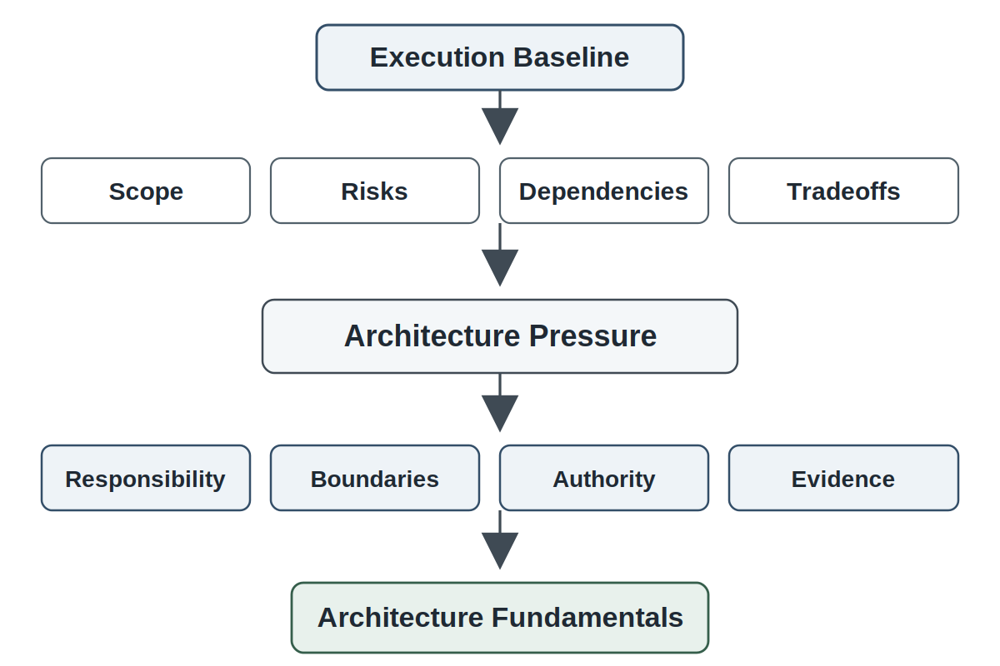
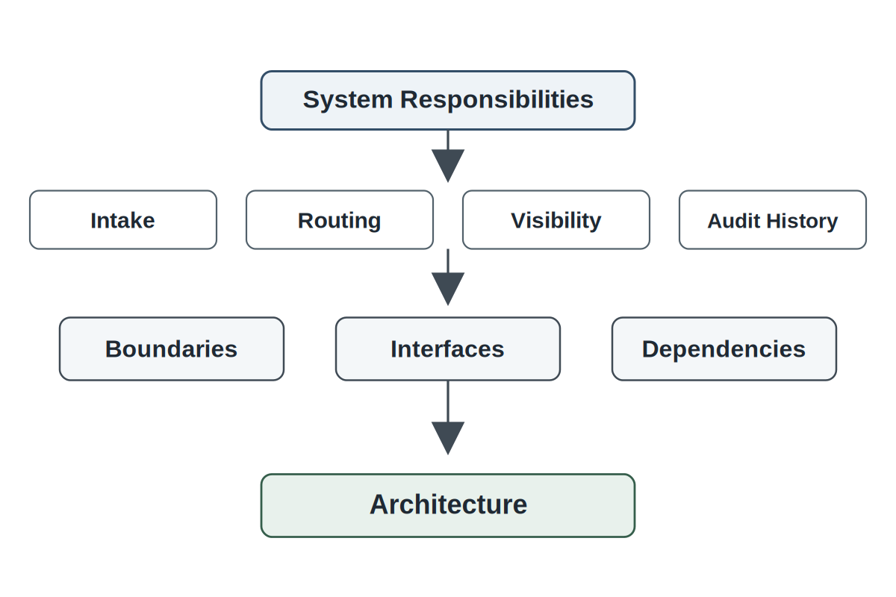
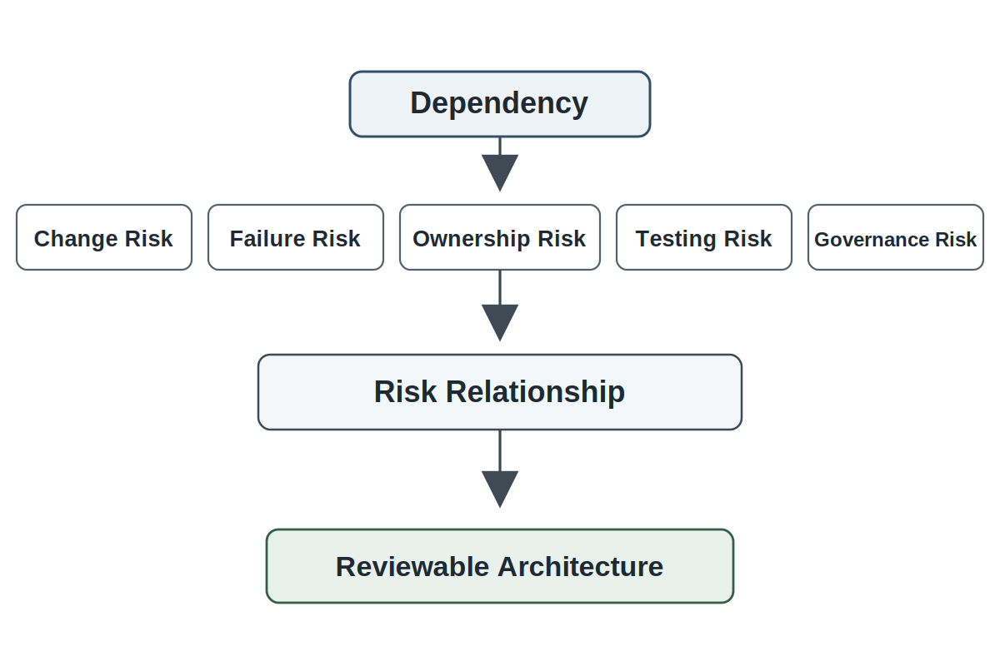
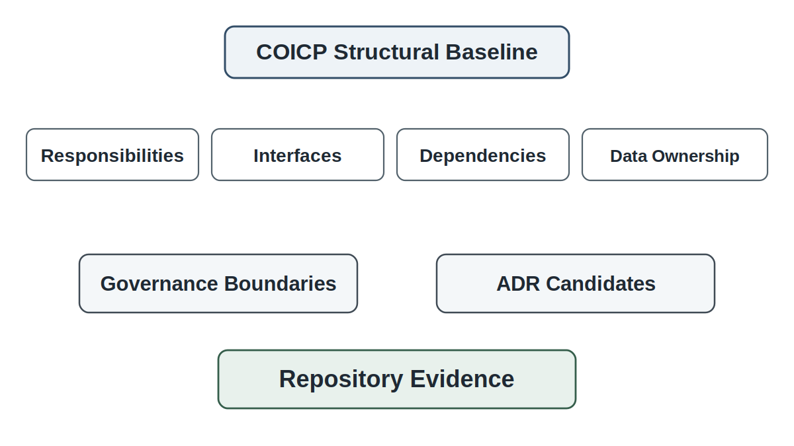
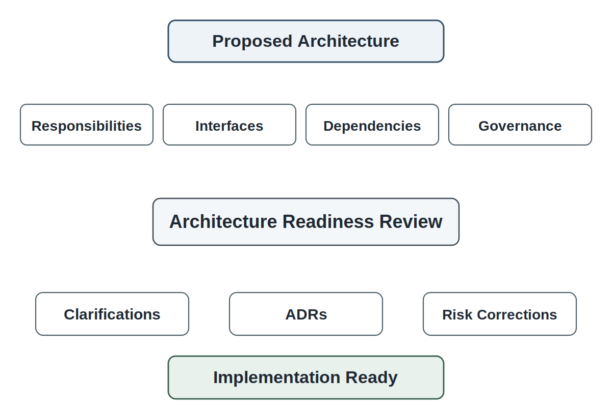

# Chapter 13 Architecture Fundamentals

## Opening Scenario: The Plan Makes Sense Until the Team Asks Where Responsibility Lives

The COICP team had done the work that responsible teams are supposed to do before building.

The project had been launched with standards instead of vague enthusiasm. The repository had become the system of record instead of a place where code happened to live. Requirements had been grounded in stakeholder evidence instead of feature wishes. AI-assisted requirements had been reviewed as proposed material instead of accepted truth. Planning had converted those requirements into scope, estimates, risks, dependencies, tradeoffs, and a reviewable execution baseline.

Now the team wanted to build.

The first instinct was natural. Divide the work by visible features.

One group would build the incident intake page. Another would build the dashboard. Another would build routing. Another would build notifications. Someone would handle visibility controls. Someone else would add audit records. The plan looked practical. It mapped neatly onto screens, tickets, and team members.

Then the questions started.

Where does an incident actually live?

Is the intake form the source of truth, or does it only create a record somewhere else?

Who owns incident status after submission?

Are routing rules part of the intake workflow, the incident record, a separate coordination service, or a policy layer?

What happens when Facilities and Campus Safety both need to see the same incident but not the same information?

Where are privacy classifications enforced?

Where are notification decisions made?

Can notification behavior change without rewriting the intake workflow?

Who records the audit trail?

Can an incident be corrected? If so, what is preserved?

How will future AI-assisted classification or routing fit without becoming unreviewed authority?

The team realized that dividing work by screens had hidden the architecture. It had not answered the structural questions. It had only distributed visible pieces of work.

That was the next maturity step.

A plan says what the team intends to do. Architecture says how responsibility will be structured so the work can be built, reviewed, changed, governed, recovered, and operated.

Architecture is not the diagram. Architecture is the disciplined structuring of responsibilities, boundaries, dependencies, authority, evidence, and change.

*Figure 13.1 — From Plan to Architecture Pressure*

---

## 13.1 The Plan Exposes Structure

Chapter 12 ended with an execution baseline. The COICP team now has scope, milestones, estimate assumptions, risk owners, dependency notes, tradeoff records, and a Planning and Risk Review outcome. That is progress. But a plan does not automatically produce a structure that can survive real engineering work.

Plans expose pressure.

When the team says it will build incident intake, the architecture question is not only what fields appear on a form. The question is what responsibility the intake capability owns. Does it validate data? Does it assign incident category? Does it decide urgency? Does it apply privacy classification? Does it trigger routing? Does it create the audit record? Does it notify departments? Does it expose data to dashboards?

Each answer changes the architecture.

When the team says it will build routing, the architecture question is not only which department receives the incident. The question is where routing rules live, who can change them, how rule changes are reviewed, whether routing is a recommendation or assignment, what evidence is preserved, and what happens when routing is wrong.

When the team says it will build visibility controls, the architecture question is not only who can view which screen. The question is where authority is enforced. Is visibility controlled in the user interface, the API, the data-access layer, the incident record, or a shared policy mechanism? If sensitive fields are hidden only in one screen, then the architecture may already be fragile.

Planning creates a list of intended work. Architecture asks whether that work has a responsible structure.

This is why the transition from planning to architecture matters. A team can have a reasonable plan and still build a system that becomes hard to change, hard to review, hard to test, hard to govern, and hard to operate. The problem is not lack of effort. The problem is accidental structure.

Accidental structure happens when features are built before responsibilities are understood. Screens become boundaries. Database tables become authority. Helper functions become policy engines. Notification code becomes institutional communication logic. AI-generated scaffolds become system design. Teams discover too late that the system has an architecture, but not one they chose deliberately.

Trustworthy engineering does not eliminate uncertainty. It structures responsibility before uncertainty becomes uncontrolled complexity.

---

## 13.2 Architecture Is Responsibility Structure

Many students first encounter architecture as a diagram. Boxes, arrows, layers, services, databases, and external systems appear on a page. That can be useful, but the diagram is not the architecture.

A diagram is a representation. Architecture is the set of consequential structural decisions behind it.

A component exists because some responsibility must live somewhere. A boundary exists because responsibilities, change, authority, or risk should not be blurred. An interface exists because one part of the system promises something to another part. A dependency exists because one part of the system relies on another and therefore inherits some risk from it.

Architecture begins when the team asks:

What responsibilities must the system carry?

Where should each responsibility live?

What should be separated?

What should be shared?

What should be hidden?

What must be reviewable?

What must be governed?

What must remain changeable?

What evidence must survive?

In COICP, incident intake, incident records, routing, visibility, notification, audit history, reporting, and future AI assistance are not merely features. They are responsibility areas. The architecture must decide how those areas relate.

For example, if the incident intake screen directly contains routing rules, then routing becomes tangled with intake. A future change in routing policy may require interface changes, retesting of intake behavior, and review of user-facing workflow. If routing rules live in a separate responsibility area, then the system can potentially change routing without rewriting intake. That separation is not automatically better in every case, but it is an architectural decision.

Architecture is tradeoff work. Separating responsibilities can improve clarity, testability, reviewability, and change control. It can also introduce coordination overhead, interface complexity, and additional maintenance burden. Combining responsibilities can simplify early implementation and reduce short-term complexity. It can also make future change, review, governance, and testing more difficult.

The architect’s job is not to pursue complexity or simplicity as goals in themselves. The job is to structure responsibility in proportion to risk, change, governance, operational consequence, and the realities of the system being built.

A small student project does not need enterprise-scale architecture. But it still needs architecture. It needs enough structure to make the system understandable, reviewable, testable, governable, and changeable at the level of risk it carries.

That is the practical definition for this book:

Architecture is the disciplined structure of responsibility.

*Figure 13.2 — Responsibilities, Boundaries, and Interfaces*

---

## 13.3 Boundaries, Interfaces, and Dependencies

Architecture becomes concrete through boundaries, interfaces, and dependencies.

A boundary says: this responsibility belongs here, and not everywhere. Boundaries help humans reason. They also constrain change. Without boundaries, changes spread through the system like water through cracks.

An interface says: this part of the system promises to provide something to another part. Interfaces may be APIs, function contracts, data formats, events, files, queues, screens, or documented handoffs. The exact mechanism matters less than the promise. If one part of the system depends on another, the promise must be clear enough to build, test, review, and change safely.

A dependency says: this part of the system relies on another part. Dependencies are not just technical connections. They are risk relationships.

If COICP notification depends on incident status, then status changes can affect communication. If dashboards depend on incident categories, then category changes can affect reporting. If visibility controls depend on privacy classification, then classification mistakes can expose data. If future AI-assisted routing depends on stakeholder rules, then weak context can produce harmful recommendations.

A dependency is a risk relationship.

That sentence matters because students often see dependencies as implementation details. Professional engineers see dependencies as potential failure paths, change paths, review paths, and ownership paths.

Strong architecture does not eliminate dependencies. Systems need dependencies. The goal is to make dependencies visible, intentional, and reviewable.

A dependency should invite questions:

Who owns the depended-on behavior?

What happens if it changes?

What happens if it fails?

What evidence proves it worked?

Can it be tested independently?

Can the dependent part recover?

Is the dependency stable enough for the risk it carries?

Does the dependency cross a governance boundary?

At LMU, routing depends on incident category, urgency, location, department ownership, privacy classification, and possibly campus policy. That does not mean routing should be overengineered. It means routing should not be treated as a few conditional statements hidden inside a screen handler with no reviewable structure.

Interfaces are promises. Dependencies are risk relationships. Boundaries are responsibility decisions.

Architecture makes those decisions visible.

*Figure 13.3 — Dependency as Risk Relationship*

---

## 13.4 Data Ownership and Systems of Record

One of the most important architecture decisions is often the least glamorous: what is the system of record?

A system of record is the authoritative place where a particular fact is stored, maintained, and trusted. Without clear systems of record, teams create duplicate truth. Duplicate truth becomes conflicting truth. Conflicting truth becomes operational failure.

COICP needs to know where incident facts live.

Where is the authoritative incident record?

Where is the current status stored?

Where is the history of status changes preserved?

Where is routing evidence kept?

Where are privacy classifications stored?

Where are notification attempts recorded?

Where are audit records preserved?

Where are stakeholder-visible summaries generated from?

These are architecture questions because data ownership shapes responsibility, authority, reviewability, and recovery.

Suppose the intake form stores a status value, the dashboard stores another status value, and the notification workflow caches a third. The team may move quickly at first. Later, a stakeholder asks whether an incident was escalated. The dashboard says yes. The notification record says no. The audit history is incomplete. Now the system cannot explain itself.

A trustworthy system must be able to tell a coherent story about its own behavior.

That does not happen automatically. It requires structural decisions about data ownership.

Data ownership also affects governance. If student-impact classification is sensitive, then the architecture must identify where that classification is created, stored, changed, displayed, and audited. If routing decisions can influence departmental responsibility, then the architecture must preserve who or what made the recommendation, who accepted it, and what rule or evidence supported it.

This is where architecture and repository-centered engineering connect. Architecture decisions about data ownership should not remain in someone’s head. They should be recorded in architecture notes, data ownership documents, ADR candidates, interface notes, and review records.

Everything important leaves evidence.

---

## 13.5 Architecture and Governance

Governance is architecture.

That principle appeared earlier in the book, but Chapter 13 makes it structural. Authority, approval, privacy, escalation, auditability, oversight, and correction paths are not late compliance concerns. They must attach to system structure.

In COICP, governance appears in ordinary-sounding architecture questions.

Who can submit an incident?

Who can view sensitive fields?

Who can change incident status?

Who can assign or reassign routing?

Who can override a routing recommendation?

Who can see audit history?

Who can generate official summaries?

Who can correct a record?

What must be preserved when correction happens?

These questions are not only policy questions. They become architecture when the system enforces or fails to enforce them.

Weak teams often postpone governance. They build the workflow first and add permissions later. That sounds efficient until authority is already scattered through screens, handlers, database queries, and notification code. Governance then becomes patchwork.

Governance-late architecture is fragile because it treats authority as decoration.

A better approach is to identify governance-sensitive responsibilities early. In COICP, visibility control should not be an afterthought. Audit evidence should not be optional. Routing authority should not be hidden inside unreviewed implementation logic. Future AI recommendations should not be able to cross from suggestion into action without explicit human ownership and evidence.

Architecture should show where governance controls live.

This does not mean every system needs a complex policy engine. It means the architecture must make a deliberate choice about where authority is checked, where decisions are logged, where exceptions are handled, and where accountability attaches.

When systems can affect people, records, services, safety, privacy, or institutional trust, governance is not paperwork. It is part of the system.

---

## 13.6 Architecture and Change

Architecture is tested by change.

A system can look clean on the first day and become brittle by the third change request. That brittleness often reveals that the original architecture was organized around visible features rather than stable responsibilities.

COICP will change. Stakeholders will learn. Routing rules will evolve. Notification expectations will change. Privacy concerns will sharpen. Leadership will ask for different reports. Campus Safety may need new escalation paths. Student Services may need more careful visibility controls. Future AI assistance may be considered for classification, summarization, routing recommendations, or communication drafting.

Architecture should not pretend change will not happen. It should structure the system so responsible change is possible.

Responsible change means a team can answer:

What part of the system is affected?

What requirement or decision does the change relate to?

What tests or reviews must be updated?

What governance boundary is implicated?

What evidence must be preserved?

What risk increases?

Who owns the change?

The goal is not to predict every future requirement. The goal is to avoid choices that make foreseeable change unnecessarily dangerous.

This is why architecture is not only about building the first version. Architecture creates the conditions under which later engineering can remain trustworthy.

A design that works once but cannot be changed safely is not mature architecture. It is a fragile achievement.

---

## 13.7 Architecture as Repository Evidence

Architecture must be reviewable. To be reviewable, it must become evidence.

A hallway explanation is not enough. A diagram pasted into slides is not enough. A team lead’s memory is not enough. Architecture should live in the repository as part of the engineering system of record.

For COICP, the repository should begin preserving architecture evidence such as:

`/docs/architecture/architecture-overview.md`

`/docs/architecture/context-diagram.md`

`/docs/architecture/component-responsibilities.md`

`/docs/architecture/interface-notes.md`

`/docs/architecture/dependency-register.md`

`/docs/architecture/data-ownership.md`

`/docs/architecture/governance-boundaries.md`

`/docs/adr/adr-index.md`

`/docs/reviews/architecture-readiness-review.md`

The exact directory structure can vary. The principle should not: architecture decisions must be inspectable.

An architecture overview should explain the system’s main responsibility areas and how they relate. A component responsibility table should say what each part owns and what it does not own. Interface notes should identify promises between parts of the system. A dependency register should make risk relationships visible. Data ownership notes should identify systems of record. Governance-boundary documentation should show where authority, privacy, audit, and oversight controls attach. ADR candidates should preserve significant decisions, options, consequences, and rejected alternatives.

Architecture evidence protects the team from diagram theater. It also protects the team from accidental drift. If a later pull request changes routing logic, reviewers should be able to ask whether the change aligns with the routing responsibility boundary. If a new notification path is added, reviewers should be able to inspect the notification responsibility and audit expectations. If future AI-assisted routing is proposed, reviewers should be able to see where routing authority currently lives and what human oversight is required.

Repository-centered architecture is not bureaucracy. It is how the system remembers why it is structured the way it is.

*Figure 13.4 — COICP Structural Baseline*

---

## 13.8 AI Pressure on Architecture

AI is not the center of Chapter 13. That is deliberate.

This chapter teaches architecture fundamentals before intelligent systems architecture. Chapter 14 will focus directly on architecture for systems that include models, context sources, orchestration, recommendations, evaluation, oversight, and probabilistic behavior.

Still, AI already creates pressure on architecture.

The COICP team knows that future AI assistance may be proposed. AI might summarize incident reports. It might suggest incident categories. It might recommend routing. It might draft notifications. It might cluster incident trends. It might help stakeholders search operational history.

Those possibilities should not be bolted onto a weak structure.

AI cannot be safely added to an architecture that does not already know where responsibility lives.

If the system does not know where incident classification is owned, AI-assisted classification will blur responsibility. If the system does not know where routing authority lives, AI-assisted routing will blur authority. If the system does not know where audit evidence is preserved, AI-generated recommendations may become operationally untraceable. If the system does not know where human approval attaches, AI output may slide from suggestion into action.

This is why architecture fundamentals come before intelligent systems architecture. Before asking how to add AI, the team must know what responsibilities, boundaries, dependencies, data ownership, and governance controls already exist.

AI proposes; engineers verify. But engineers can only verify responsibly when the system provides structure, context, evidence, and authority boundaries.

Chapter 13 should therefore foreshadow AI without centering it. It should identify AI future-pressure points and leave them bounded for Chapter 14.

---

## 13.9 Architecture Readiness Review

Architecture needs a review mechanism.

The Chapter 13 review-board mechanism is the Architecture Readiness Review. Its purpose is to determine whether the proposed structure is ready to guide implementation without hiding responsibility, risk, governance, or change impact.

*Figure 13.5 — Architecture Readiness Review*

The review asks:

Does the architecture satisfy the requirements baseline?

Does it support the scoped execution baseline?

Are major responsibilities named?

Are boundaries meaningful?

Are interfaces clear enough to review and test?

Are dependencies visible?

Are systems of record identified?

Are governance-sensitive behaviors structurally controlled?

Are data ownership decisions documented?

Are audit and evidence paths identified?

Are future AI-pressure points bounded?

Can the system be changed without uncontrolled ripple effects?

Can the structure support testing and later release evidence?

What risks remain?

What decisions require ADRs?

Is the team ready to implement, or must architecture be clarified first?

A mature Architecture Readiness Review is not a rubber stamp. It is a professional challenge to structural assumptions.

The review output may include:

approved structural baseline;

required clarifications;

new ADRs;

dependency risks;

governance-boundary corrections;

data ownership decisions;

interface changes;

implementation constraints;

open architecture questions;

readiness decision for implementation.

The review strengthens engineering judgment because it forces the team to explain structure before code makes structure expensive to change.

Review is an engineering safety mechanism.

---

## 13.10 LMU Evolution: From Execution Baseline to Structural Baseline

By the end of Chapter 13, LMU has not implemented COICP. That matters. The chapter’s maturity is structural, not functional.

The team now has more than a plan. It has a structural baseline.

It knows that incident intake is not the whole system. It knows where incident records should live. It has begun distinguishing routing responsibility from notification responsibility. It has identified visibility control as an architectural concern. It has treated audit evidence as a structural requirement rather than a reporting afterthought. It has identified data ownership decisions. It has documented dependencies. It has recognized future AI assistance as pressure that must be bounded by architecture, not excitement that can be added later.

LMU has moved from execution readiness to structural readiness.

That does not mean all architecture questions are solved forever. Honest engineering is mature engineering. The team should know what is decided, what remains uncertain, what risks exist, and what evidence supports the structural baseline.

The repository now contains architecture evidence that future implementation, review, testing, and release readiness can inspect. Architecture has become part of the project memory.

The system is still early. But it is now less likely to become a collection of screens, scripts, and hidden authority rules. It has a structure that can be challenged.

That is progress.

---

## 13.11 Failure Pattern: Diagram Theater

The primary anti-pattern in this chapter is diagram theater.

Diagram theater occurs when a team produces architecture diagrams that look professional but do not clarify responsibility, risk, evidence, governance, dependencies, data ownership, or change impact.

The diagram may have boxes. It may have arrows. It may have labels. It may use impressive terms. It may satisfy a template. It may even look like architecture.

But if the team cannot explain what each component owns, what each interface promises, what each dependency risks, what data is authoritative, where governance controls live, and what evidence supports the structure, the diagram is theater.

Diagram theater is dangerous because it creates confidence without understanding. It lets teams proceed as if architecture has been done when only architecture imagery has been produced.

Several related anti-patterns commonly appear with it.

Feature-Sliced Architecture occurs when the system is structured around visible screens or features instead of stable responsibilities.

Framework-First Architecture occurs when the team starts with a technology choice and forces the problem into that shape.

Hidden Dependency Architecture occurs when important dependencies exist in code, data, policy, or workflow but are not visible enough for review.

Governance-Late Architecture occurs when authority, privacy, approval, escalation, or auditability are added after implementation has already scattered responsibility.

Data Ownership Blindness occurs when the team does not identify systems of record and therefore creates conflicting truth.

AI-Ready-in-Name-Only Architecture occurs when a diagram claims the system can support AI later but does not show context boundaries, evidence paths, human oversight, auditability, rollback, or authority controls.

Trustworthy engineering counters diagram theater by making architecture evidence-centered. The team should preserve component responsibilities, interface promises, dependency risks, data ownership decisions, governance boundaries, ADRs, and review outcomes.

The goal is not prettier diagrams. The goal is better engineering judgment.

---

## 13.12 Operational Takeaways

Architecture is not the diagram. The diagram is only useful when it represents real structural decisions.

Architecture is responsibility structure. Components exist because responsibilities must live somewhere.

A component boundary is a responsibility boundary. Poor boundaries blur ownership, change impact, and reviewability.

Interfaces are promises. They should be clear enough to review, test, and change safely.

A dependency is a risk relationship. Dependencies carry change risk, failure risk, ownership risk, and governance risk.

Data ownership is architecture. Systems of record must be clear before the system can explain itself.

Governance is architecture. Authority, privacy, approval, escalation, auditability, and oversight need structural homes.

Architecture must support change. A system that works once but cannot be changed safely is fragile.

Architecture belongs in the repository. Everything important leaves evidence.

AI pressure makes architecture more important, not less. AI cannot be safely added to a system that does not know where responsibility lives.

Review is an engineering safety mechanism. Architecture should be challenged before implementation makes structure expensive.

---

## 13.13 Exercises

### Exercise 1: Identify Responsibility Boundaries

Create the repository artifact:

`/docs/architecture/responsibility_boundary_analysis.md`

Given a COICP feature list, identify the underlying responsibility areas.

Separate visible features from responsibilities such as:

- Incident record ownership
- Routing
- Notification
- Visibility control
- Audit evidence
- Reporting
- Future AI assistance

For each responsibility, identify:

- Owner
- Primary purpose
- Related workflows
- Consequences of poor ownership

Determine which responsibilities are most critical to operational trust.

### Exercise 2: Convert Features into Architecture Responsibilities

Create the repository artifact:

`/docs/architecture/responsibility_oriented_architecture.md`

Convert a feature-oriented COICP design into a responsibility-oriented architecture sketch.

For each responsibility area, document:

- Purpose
- Owner
- Key dependencies
- Governance implications

Explain why the responsibility belongs where it is placed.

Identify any remaining architectural risks.

### Exercise 3: Build a Dependency Map

Create the repository artifact:

`/docs/architecture/dependency_map.md`

Develop a dependency map for:

- Incident intake
- Routing
- Notifications
- Visibility controls
- Audit history

For each dependency, identify:

- Dependency owner
- Failure risk
- Change risk
- Required evidence
- Review obligations

Evaluate which dependencies pose the greatest operational risk.

### Exercise 4: Define Systems of Record

Create the repository artifact:

`/docs/architecture/system_of_record_decisions.md`

Identify the authoritative system of record for:

- Incident status
- Routing decisions
- Urgency
- Privacy classification
- Notification history
- Audit trail
- Generated summaries

For each decision, document:

- System of record
- Responsible owner
- Consumers of the information
- Consequences of ambiguity

Explain what could go wrong if authority over the information is unclear.

### Exercise 5: Conduct a Weak Architecture Review

Create the repository artifact:

`/docs/reviews/weak_architecture_review.md`

Review an architecture diagram organized only by screens and user-interface components.

Identify:

- Missing responsibilities
- Hidden dependencies
- Governance gaps
- Data-ownership gaps
- Future AI-related risks

Document the architectural weaknesses and propose corrective actions.

Determine whether the architecture is sufficient to support long-term system evolution.

### Exercise 6: Conduct an Architecture Readiness Review

Create the repository artifact:

`/docs/governance/reviews/architecture_readiness_review_record.md`

Conduct an Architecture Readiness Review for a proposed COICP structural baseline.

Evaluate:

- Responsibility assignments
- Dependency management
- System-of-record decisions
- Governance considerations
- Architectural risks
- Required ADRs

Document:

- Findings
- Open risks
- Required architecture updates
- Ownership assignments
- Recommended next steps

Determine whether implementation should:

- Proceed
- Proceed with conditions
- Be delayed pending revisions

Justify the decision using available architectural evidence.

## 13.14 Closing: From Architecture Fundamentals to Intelligent Systems Architecture

Chapter 13 gives the COICP team a structural baseline. The team now knows that architecture is not a decorative artifact and not merely a technology diagram. Architecture is how the system assigns responsibility, manages boundaries, exposes dependencies, preserves evidence, supports governance, and prepares for change.

That baseline matters because the next step increases the stakes.

COICP is not only a conventional information system. The team already knows that future AI assistance may be proposed for classification, summarization, routing recommendations, notification drafting, trend detection, and stakeholder support. Those capabilities introduce new architectural pressures.

Where does context come from?

What evidence does AI use?

Where are model outputs reviewed?

When is output only a suggestion?

When could output influence action?

Where does human approval attach?

How are recommendations logged?

How are errors detected and corrected?

How does the system prevent probabilistic output from becoming unreviewed authority?

Those questions require architecture. But they are not the same questions that arise when designing conventional software components. Intelligent systems introduce probabilistic behavior, context dependence, recommendation paths, model limitations, oversight requirements, evaluation obligations, and new forms of operational uncertainty. The architecture must absorb those realities without losing accountability.

Chapter 13 closes with the structural question that opens Chapter 14:

If architecture structures responsibility, boundaries, authority, and evidence, what changes when part of the system can generate, recommend, classify, summarize, or act probabilistically?
