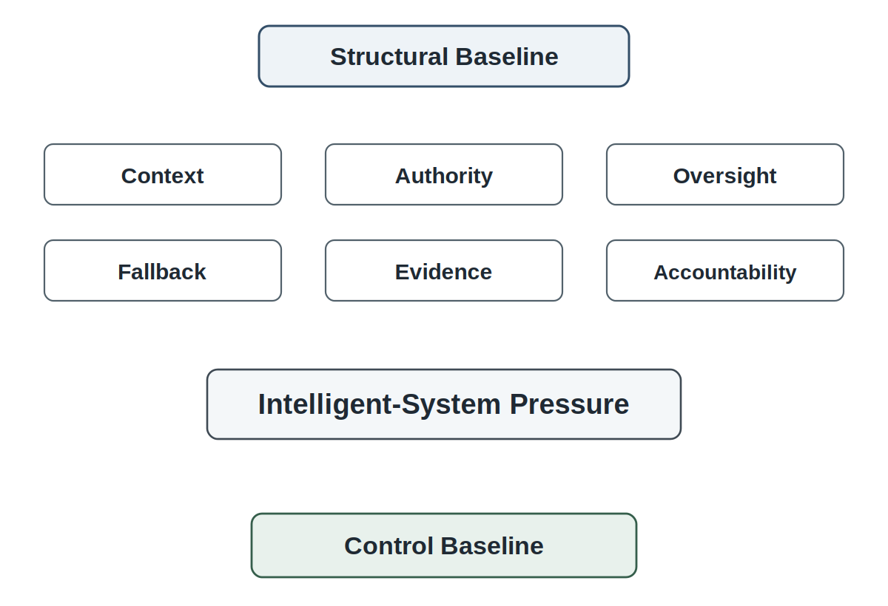
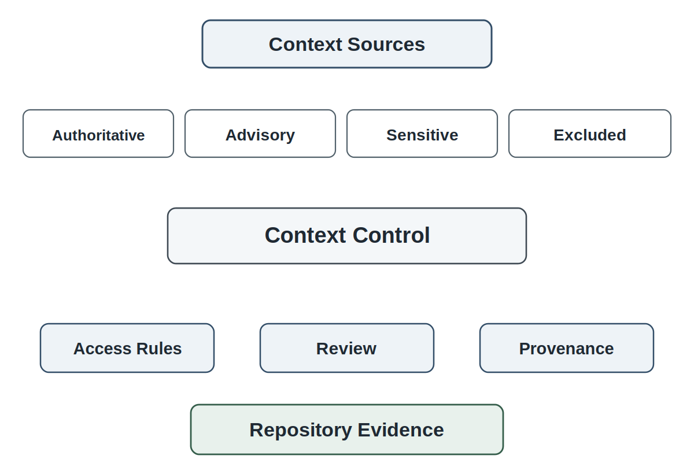
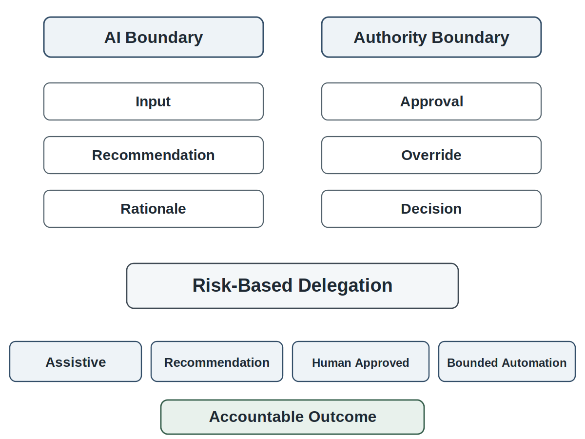
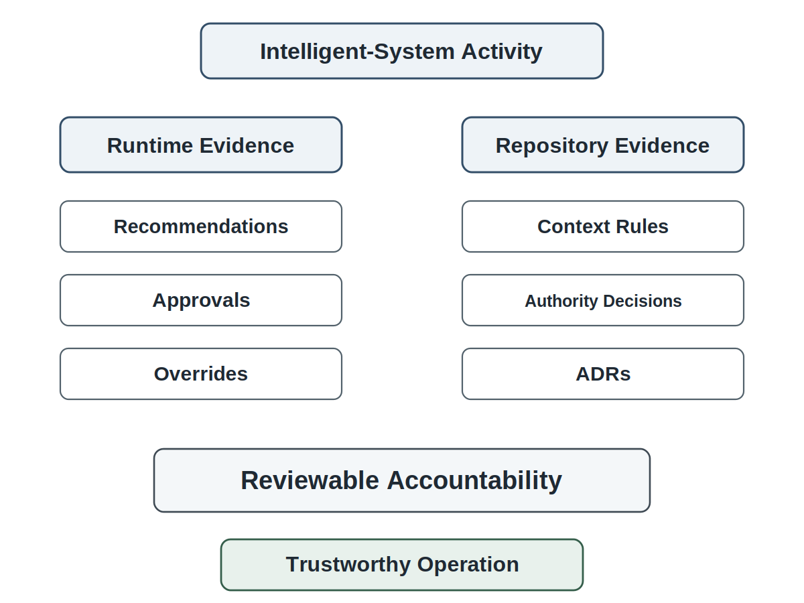
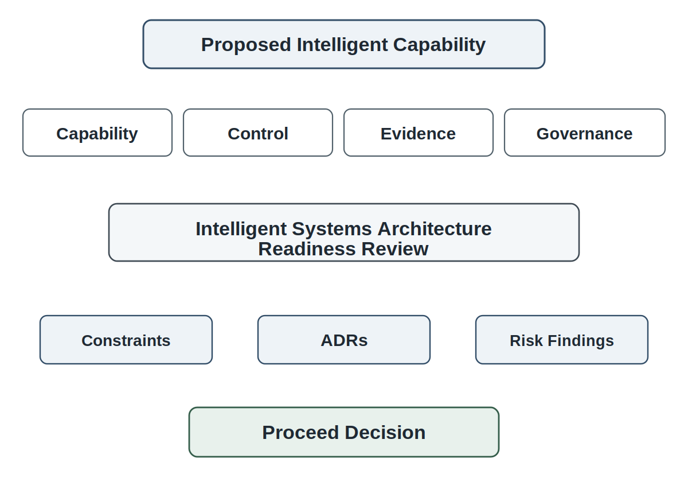

# Chapter 14 Intelligent Systems Architecture

## Opening Scenario: The System Has Structure, but Intelligence Requires Control

The COICP team had done something important before writing code.

It had not merely imagined a useful platform. It had launched the project with standards. It had made the repository the system of record. It had treated requirements as evidence-backed understanding. It had used AI-assisted requirements carefully, as proposed material requiring human validation. It had planned under uncertainty, named risks, and defended tradeoffs. It had then taken the next step and established a structural baseline: responsibilities, boundaries, interfaces, dependencies, systems of record, data ownership, governance boundaries, and architecture evidence.

In other words, COICP now had enough structure to build responsibly.

That was when the obvious question arrived.

A senior LMU operations leader looked at the planned incident-intake and routing workflow and asked, "Could AI help with this?"

The question sounded reasonable. Incoming incident reports could be long, inconsistent, emotional, incomplete, or written by people who did not know which department should respond. Some submissions might concern facilities. Some might involve student support. Some might require Campus Safety review. Some might be routine. Some might appear routine until a detail changed the risk. An AI-assisted capability might help summarize submissions, suggest categories, identify urgency signals, recommend a routing destination, draft a notification, or find similar prior incidents.

The team could see the appeal immediately.

But Chapter 13 had changed how the team thought. The question was no longer, "Can we add AI?" The question was, "Where would intelligent behavior live in the architecture, and how would it remain bounded, reviewable, governable, recoverable, and accountable?"

If AI suggests a category, is that category accepted automatically or reviewed by a human? If AI recommends routing to Campus Safety, does that recommendation assign responsibility, or does a coordinator approve it first? What context does the model see? Does it see sensitive student information? Does it see prior incidents? Does it see policy rules? Who decides which context sources are authoritative? What happens when the model is unavailable? What happens when it is uncertain? What happens when it is confidently wrong? What evidence is preserved? Can the team reconstruct what the model saw, what it produced, what a human accepted, rejected, or modified, and what action followed?

Those were not implementation details. They were architecture questions.

The model was not the system. The system included the incident record, the workflow, the policy boundaries, the data sources, the review steps, the human approval points, the audit trail, the fallback path, the repository evidence, and the organizational accountability around every consequential action.

That is the central move in intelligent systems architecture.

Intelligent systems architecture is not about adding AI to a system. It is about structuring context, boundaries, authority, oversight, fallback, evidence, and human accountability around probabilistic behavior.

*Figure 14.1 — From Structural Baseline to Intelligent-System Pressure*

---

## 14.1 Intelligent Systems Change the Architecture Question

Chapter 13 established architecture as responsibility structure. That foundation matters because intelligent systems intensify the consequences of weak structure.

In a conventional feature, the team often reasons about deterministic behavior. A user submits a form. The system validates fields. A record is created. A notification is sent. A dashboard updates. The implementation may still be complex, and it may still fail, but the expected behavior is usually defined as a set of rules, conditions, data flows, and outputs.

Intelligent behavior changes the architecture question because the system now includes outputs that are probabilistic, context-dependent, and sometimes difficult to explain fully. A model may classify an incident one way today and another way after a prompt change, model update, context-source adjustment, or data-quality change. It may produce a useful summary while omitting a critical detail. It may recommend the right department for common cases and mishandle rare but consequential ones. It may sound confident while being wrong.

That does not mean intelligent systems should be avoided. It means they must be architected.

For COICP, AI-assisted classification or routing could be valuable. A coordinator may receive a clearer summary. A student-services liaison may see urgency indicators earlier. Facilities may receive better structured reports. Campus Safety may be alerted to patterns that would otherwise be missed. But each benefit creates architectural obligations.

The team must decide where AI is invoked, what data it receives, what it returns, what status its output has, who reviews it, what actions it can influence, what evidence is logged, what fallback exists, and how errors are detected and corrected.

A weak team treats AI as another feature to add. A stronger team recognizes that intelligent behavior changes the architecture itself.

Once AI enters the system, new forms of architectural pressure appear.

First, context pressure. AI output depends on what information the system provides. If the context is incomplete, stale, biased, unauthorized, or poorly structured, the output may be misleading. Context is not just input. Context is control.

Second, authority pressure. A model output may look like a recommendation, but if the workflow automatically acts on it, the model has become part of the authority chain. Architecture must distinguish suggestion from decision, decision support from approval, and automation from accountable action.

Third, evidence pressure. If the system cannot reconstruct what AI saw, produced, and influenced, then review becomes guesswork. Intelligent behavior must leave evidence.

Fourth, fallback pressure. If the model fails, slows down, becomes unavailable, produces unsafe output, or falls below confidence thresholds, the system must still operate. A responsible architecture does not collapse when AI is removed.

Fifth, evaluation pressure. Deterministic unit tests are not enough. Intelligent behavior requires scenario evaluation, edge cases, adversarial examples, human review, and limitation records.

Chapter 14 therefore extends architecture from responsibility structure into intelligent-system control structure. The system must still have components, boundaries, interfaces, dependencies, and data ownership. But now those structures must also govern context, probabilistic output, oversight, fallback, evaluation, auditability, and human accountability.

---

## 14.2 The Model Is Not the System

The most dangerous architectural mistake in intelligent systems is putting the model at the center.

It is easy to do. AI tools are impressive. Demos are persuasive. A model can summarize, classify, draft, recommend, search, explain, and generate. Teams naturally start drawing diagrams with the model in the middle and everything else orbiting it.

That picture is backwards.

The model is not the system.

A model is a component inside a larger engineered system. The system includes the users, workflows, data sources, policies, permissions, prompts, retrieval mechanisms, interfaces, logs, review steps, approvals, exception paths, fallback behavior, tests, monitoring, repository evidence, and organizational accountability. The model may generate output, but the system owns consequence.

This distinction is not philosophical decoration. It changes architecture.

If the model is treated as the system, then attention goes to model capability: which model, what prompt, what benchmark, what accuracy, what latency, what cost. Those questions matter, but they are not sufficient. A capable model inside a weak architecture can still produce an untrustworthy system.

If the system is treated as the system, then attention goes to responsibility: what role the model plays, what it may influence, what it may never decide, what context it can access, what humans must review, what evidence is preserved, what failures are expected, what fallback exists, and who owns the outcome.

For COICP, a model might assist with incident classification. That does not make the model the classification authority. The architecture must decide whether the model produces a suggested category, whether a coordinator confirms it, whether certain categories require mandatory human review, whether sensitive incidents bypass AI classification, whether model output is visible to stakeholders, and whether the accepted category becomes part of the incident record.

The distinction between model output and system decision is essential.

A model can produce a routing recommendation. The system decides how that recommendation is displayed, reviewed, accepted, rejected, modified, logged, and acted upon. A model can draft a notification. The system decides whether the draft can be sent, who approves it, what template constraints apply, what sensitive information must be removed, and what record of approval is preserved. A model can summarize an incident. The system decides whether the summary is advisory, whether the original report remains authoritative, whether the summary is stored, and whether corrections are tracked.

When teams forget this distinction, they create hidden authority. Hidden authority happens when a model output is officially treated as a suggestion but practically functions as a decision. If humans always accept the suggestion without meaningful review, the approval step becomes theater. If workflows are designed so rejecting the model is difficult, the system has shifted authority to the model while pretending humans remain in control. If audit logs record only the final action and not the model recommendation that shaped it, evidence becomes incomplete.

Intelligent systems architecture must make authority visible.

That begins by defining the model's role in plain engineering language. Is the model summarizing? Classifying? Recommending? Drafting? Ranking? Detecting patterns? Generating explanations? Searching context? Orchestrating workflow? Each role has different risks.

Summarization risks omission and distortion. Classification risks mislabeling. Recommendation risks over-influence. Drafting risks tone, accuracy, privacy, and authority confusion. Ranking risks hidden prioritization. Pattern detection risks false positives and false negatives. Explanation risks false confidence. Search risks context leakage and incomplete retrieval. Orchestration risks uncontrolled action.

The model is not the system. The model is one responsibility-bearing component inside a governed architecture.

Teams that remember this distinction tend to build trustworthy intelligent systems. Teams that forget it often discover too late that they have delegated influence, authority, or accountability without meaning to.

That principle should shape every intelligent-system diagram in this book.

---

## 14.3 Context Sources and Context Control

Intelligent systems depend on context. That makes context an architectural control.

In ordinary conversation, context sounds like background information. In intelligent systems architecture, context is the information environment that shapes model behavior. It includes the data the model receives, the documents it retrieves, the policies it is given, the examples it sees, the instructions it follows, the metadata attached to the task, the user role, the current workflow state, and the constraints the system imposes.

Context is control because changing context changes behavior.

A COICP routing recommendation based only on incident text may behave differently from one based on incident text, building location, department ownership rules, prior routing history, privacy classification, campus policy, and escalation constraints. A summary generated from a full incident record may differ from a summary generated from a redacted version. A notification draft that sees sensitive student information may include details that should never be sent. A classification model that lacks campus-specific policy may make plausible but institutionally wrong recommendations.

The architecture must therefore answer context questions explicitly.

What context sources are allowed? Which are authoritative? Which are advisory? Which are stale or incomplete? Which contain sensitive data? Which may be used for AI input? Which may be used only after redaction? Which must never be exposed to the model? Which context sources are retrieved automatically, and which require human selection? How are context-source changes reviewed? How are context failures detected?

Context-source architecture is not optional. Without it, the system becomes a pile of accidental inputs.

COICP may have several possible context sources:

- the submitted incident report,
- incident category definitions,
- department routing rules,
- building and location metadata,
- campus operations policy,
- privacy and visibility classifications,
- prior incident records,
- escalation rules,
- notification templates,
- stakeholder role information,
- audit history,
- known limitations and exceptions.

Not all of these should be treated the same way. Some may be authoritative. Some may be examples. Some may be sensitive. Some may be incomplete. Some may create privacy risk if sent to an external service. Some may be useful for a human reviewer but inappropriate for model input.

This is where architecture and governance meet. Context control must account for data ownership, privacy, access, retention, and authority. If a model can see sensitive information that a user is not allowed to see, the architecture may create a governance breach. If a model uses prior incident records without preserving provenance, the system may produce recommendations that cannot be reviewed. If context is assembled through undocumented helper code, the team may not know why a recommendation was produced.

Context must leave evidence.

The repository should preserve a context-source inventory. It should explain what sources the intelligent capability may use, why each source is needed, who owns it, what risk it carries, how it is updated, what access controls apply, and how it is validated. The architecture should also identify excluded context: data that the system deliberately does not provide to AI because the risk outweighs the benefit.

*Figure 14.2 — Context Control Architecture*

A serious context architecture also distinguishes retrieved context from stored truth. If AI retrieves policy snippets to help recommend routing, the policy system remains the source of truth. The model output does not become policy. If AI summarizes an incident, the original incident record remains authoritative. The summary may support review, but it should not silently replace the record.

That distinction matters for correction and recovery. If a summary omits a critical fact and the system later treats the summary as the incident record, the architecture has degraded truth. If a routing recommendation is based on an outdated policy document, the architecture must allow reviewers to identify the context failure.

Context is control. Context is also risk. Intelligent systems architecture must treat it as both.

---

## 14.4 AI Boundaries and Authority Boundaries

An AI boundary is not the same as an authority boundary.

An AI boundary describes where the model sits, what input it receives, what output it produces, and what other components it interacts with. An authority boundary describes who or what is allowed to make a consequential decision, approve an action, change a record, notify a stakeholder, escalate a case, or expose information.

Confusing those boundaries is one of the fastest ways to create an untrustworthy intelligent system.

A model may be inside a workflow without owning authority. A model may recommend a routing destination without assigning the case. It may draft a notification without sending it. It may summarize an incident without changing the official record. It may detect urgency signals without changing incident priority. It may rank cases without deciding response order.

The architecture must show the difference.

For COICP, consider AI-assisted routing. The AI component receives a redacted incident description, location metadata, category definitions, and routing policy. It returns a recommended routing destination with a short rationale and confidence note. That is the AI boundary.

The authority boundary begins at the point where a routing assignment becomes official. Who can accept the recommendation? Is approval required for all cases or only for sensitive categories? Can the coordinator override the recommendation? Must the override reason be recorded? Can the system auto-route low-risk facilities requests but require human approval for student-impacting incidents? Who owns the final routing decision?

Those are authority questions.

The architecture may allow different authority levels for different risk levels. Low-risk, reversible, observable tasks may permit deeper automation. Higher-risk tasks should require stronger human review. A model that drafts a routine maintenance notification may need lighter oversight than a model recommending escalation for a student safety concern. Risk-based delegation is not one setting. It is an architectural decision tied to consequence, recoverability, observability, and governance.

The system should distinguish at least five levels of AI involvement:

1. Assistive output: the model helps a human understand or prepare work, but no system action follows directly.
2. Recommendation: the model proposes a category, route, priority, or action for human review.
3. Human-approved action: the model output can become action only after a named human approves it.
4. Bounded automation: the system may act automatically within narrow, low-risk, reversible boundaries.
5. Autonomous authority: the system acts without human approval in consequential ways.

The fifth level should be treated as extraordinary, not normal. It requires deep governance, evidence, monitoring, rollback capability, and institutional approval. Most student and early-career engineering systems should not casually enter that territory.

*Figure 14.3 — AI Boundary vs Authority Boundary*

Human approval must also be meaningful. A checkbox is not oversight if the reviewer lacks time, context, authority, or evidence. Approval is not meaningful if the interface hides the original input, model output, policy basis, uncertainty, limitations, and consequences. Approval is not meaningful if the system makes rejection difficult or socially discouraged. Approval is not meaningful if no one records what was approved.

Meaningful oversight requires architecture.

The architecture must give humans enough context to judge. It must allow acceptance, rejection, modification, escalation, and correction. It must preserve evidence of the decision. It must make clear who owns the outcome. It must avoid turning humans into rubber stamps for model behavior.

The phrase "AI proposes; engineers verify" applies directly here. In Chapter 14, it becomes architectural: AI proposal paths must be separated from authority paths, and verification must be designed into the workflow.

---

## 14.5 Orchestration, Workflow, and Human Approval

Once the team understands AI boundaries and authority boundaries, it can reason about orchestration.

Orchestration is the structured coordination of steps, services, decisions, approvals, and evidence across a workflow. In intelligent systems, orchestration determines when AI is invoked, what context it receives, what output it returns, where humans review it, how decisions are recorded, and how the system proceeds.

The danger is hidden orchestration.

Hidden orchestration occurs when AI behavior is embedded inside implementation code without a clear workflow model. A developer adds a call to summarize incident text. Another adds a category suggestion. Another adds a notification draft. Over time, AI begins shaping the workflow, but no architecture explains where it is invoked, what it can influence, what humans control, or what evidence survives.

That is not intelligent systems architecture. That is accidental automation.

COICP needs visible orchestration. A responsible flow might look like this:

1. A user submits an incident report.
2. The system creates the authoritative incident record.
3. The system redacts or filters context according to policy.
4. AI generates a summary and suggested category.
5. The coordinator reviews the original report, AI summary, suggested category, and relevant policy context.
6. The coordinator accepts, modifies, or rejects the category.
7. AI recommends a routing destination based on accepted category and routing rules.
8. The coordinator approves or overrides routing.
9. The system records the recommendation, human decision, rationale, and final route.
10. Notification drafting may occur only after routing is approved.
11. Human review is required before external notification is sent.
12. All consequential steps leave audit evidence.

This flow is only an example. The important point is that AI behavior is inserted into the workflow as bounded support, not hidden authority.

Human approval should be located where consequence enters the system. If a summary is only displayed to a coordinator, the approval burden may be light. If a classification changes routing, stronger review is needed. If a notification goes to stakeholders, approval matters. If a recommendation affects safety, privacy, or institutional response, approval must be explicit and evidenced.

Human approval and human oversight are not the same thing. Approval is an action. Oversight is a responsibility. A reviewer may technically approve a recommendation without exercising meaningful judgment. Trustworthy intelligent systems therefore require workflows that provide sufficient context, authority, evidence, time, and accountability for reviewers to challenge, reject, modify, or escalate model output when necessary.

The architecture should also separate draft artifacts from official records. An AI-generated summary is not automatically the incident record. A drafted notification is not sent communication. A suggested category is not official classification. A routing recommendation is not assignment. Each artifact needs a status.

This status language is part of architecture. It prevents silent promotion of AI output into institutional truth.

Repository evidence supports orchestration. The team should preserve workflow diagrams, AI invocation points, approval paths, decision records, and known limitations. If a later pull request changes when AI is invoked, reviewers need a baseline. If a new AI capability is added, reviewers should ask whether it fits the existing orchestration model or requires an ADR.

Orchestration is where intelligent behavior becomes system behavior. That is why it must be reviewable.

---

## 14.6 Fallback, Degradation, and Recovery

Every intelligent system needs a fallback story.

If the system cannot operate safely without AI, then AI is no longer assistance. It is dependency.

Dependency is not automatically bad. Many systems depend on services, databases, APIs, queues, identity providers, and third-party components. But dependencies must be understood. Chapter 13 taught that a dependency is a risk relationship. In Chapter 14, AI dependency is a special kind of risk relationship because failure may be technical, behavioral, contextual, probabilistic, or governance-related.

The model may be unavailable. It may time out. It may exceed cost limits. It may produce malformed output. It may generate unsafe content. It may produce inconsistent recommendations. It may be uncertain. It may be confidently wrong. It may use incomplete context. It may behave differently after a version change. It may fail on edge cases that ordinary tests did not include.

Fallback architecture asks what the system does then.

COICP should be able to continue incident intake even if AI assistance is unavailable. Users should still submit reports. Incident records should still be created. Coordinators should still review and route incidents manually. Notifications should still be drafted through templates. Audit trails should still preserve human decisions. The system may become slower or less convenient, but it should not become unsafe or unusable.

That is graceful degradation.

Graceful degradation means the system can reduce capability while preserving essential responsibilities. AI summary unavailable? Show the original report and allow manual summary. AI category suggestion unavailable? Let the coordinator categorize manually. AI routing recommendation unavailable? Show routing policy and department rules. AI notification draft unavailable? Use standard templates. AI confidence too low? Require manual review. AI output flagged as unsafe? Block promotion and escalate.

Fallback is not only a runtime behavior. It is a design decision.

The architecture should define fallback triggers. Examples include model unavailability, low confidence, policy mismatch, sensitive category, conflicting context, missing required data, unsafe output, human rejection rate, or repeated override patterns. Some triggers are technical. Some are governance-related. Some come from operational monitoring.

Recovery matters too. If an AI-assisted routing recommendation was accepted and later found wrong, what happens? Can the incident be rerouted? Is the previous route preserved? Is the correction logged? Are stakeholders notified? Does the team review why the recommendation failed? Does the evaluation set gain a new case? Does an ADR or risk record need updating?

Intelligent systems must learn from failures without hiding them.

This connects directly to operational trust. A system that cannot admit, trace, correct, and learn from intelligent behavior is not trustworthy. It may still be useful, but it is not mature.

Fallback and recovery should appear in the repository. The architecture should include degradation rules, manual operation paths, override mechanisms, correction procedures, and known limitations. These artifacts will later support testing, release readiness, runbooks, incident response, and postmortems.

Fallback is architecture before it is operations.

---

## 14.7 Evaluation and Evidence for Intelligent Behavior

Traditional tests ask whether the system behaves as expected for known inputs. Intelligent behavior complicates that question.

If COICP uses AI to recommend routing, the team cannot rely only on a few happy-path examples. It needs evidence that recommendations behave acceptably across realistic cases, ambiguous cases, sensitive cases, incomplete reports, conflicting signals, and edge conditions. It also needs evidence that humans can review and correct model output effectively.

Evaluation is not a one-time model score. It is an evidence system.

An intelligent-system evaluation plan should define what behavior is being evaluated, what scenarios matter, what risks are unacceptable, what human review is required, what limitations are known, what metrics are useful, and what evidence will be preserved.

For COICP, evaluation cases might include:

- routine facilities issue,
- urgent safety concern,
- ambiguous student-support incident,
- duplicate report,
- incomplete report,
- emotionally charged report,
- report with sensitive information,
- report mentioning multiple departments,
- report with misleading keywords,
- report requiring escalation,
- report that should not be routed automatically,
- report where AI should refuse or defer.

The team should not evaluate only whether the AI gives an answer. It should evaluate whether the system handles the answer responsibly.

Was the recommendation appropriate? Was uncertainty visible? Was sensitive information protected? Did the human reviewer have enough context? Was the final decision logged? Could the reviewer override the recommendation easily? Did the system preserve the original report? Did the output stay within policy? Did the recommendation create operational risk?

This is why intelligent systems testing belongs later in the book as its own chapter. Chapter 14 does not need to teach the full testing strategy. But it must make the architectural obligation visible. If the architecture cannot identify what intelligent behavior must be evaluated, later testing will be weak.

Evaluation evidence belongs in the repository. The repository should preserve evaluation plans, scenario sets, test results, review notes, known limitations, rejected outputs, human override examples, and risk dispositions. AI-use logs should connect to architecture evidence. If model behavior influences a release decision, release readiness must include evaluation evidence.

The team must also avoid evaluation theater. Evaluation theater happens when a team produces impressive-looking scores or demo examples that do not reflect real operational risk. A model may perform well on common cases while failing on rare cases that matter. It may summarize clean examples well while mishandling sensitive ones. It may classify historical examples acceptably while failing under new policy. It may look useful to developers while confusing coordinators.

Trustworthy evaluation is risk-aware. It asks what failure would matter, who would be harmed, what evidence would reveal the failure, and how the system would recover.

Evaluation is how intelligent behavior becomes an engineering claim instead of a demo claim.

---

## 14.8 Auditability and Operational Evidence

Everything important leaves evidence.

For intelligent systems, this doctrine becomes more demanding. It is not enough to record the final system action. The system must preserve enough evidence to reconstruct how intelligent behavior participated in that action.

If COICP routes an incident to Facilities, the audit trail should not merely say that routing occurred. If AI recommended Facilities, and a coordinator accepted that recommendation, the record should preserve that relationship. If the coordinator rejected an AI recommendation and routed the incident to Campus Safety instead, that should also be visible. If AI drafted a notification and a staff member edited it before sending, the system should preserve what matters for accountability: the draft status, human approval, final sent version, and responsible owner.

Auditability answers professional questions:

What did the model receive?
What did it produce?
What did the human see?
What did the human accept, reject, or change?
What action followed?
What evidence supports that action?
Who owns the outcome?
What limitations were known?
What can be corrected?

The answer does not always require storing every raw prompt and full output forever. Data retention, privacy, cost, and security matter. But the architecture must decide what evidence is required for accountability, review, debugging, compliance, evaluation, and operational learning.

This is especially important when AI influences but does not officially decide. Hidden influence is a trust risk. If staff routinely accept AI recommendations, the system should know that. If certain categories have high override rates, the team should investigate. If AI summaries are frequently corrected, evaluation should change. If notification drafts require heavy editing, the drafting capability may be less mature than the demo suggested.

Operational evidence also supports monitoring. The team may track recommendation acceptance rates, override rates, low-confidence rates, fallback triggers, human review time, sensitive-category escalations, and post-release defect reports. These are not vanity metrics. They help the team understand whether intelligent behavior is operating within expected boundaries.

Auditability also requires that intelligent-system architectural decisions become durable engineering evidence. Runtime logs explain what happened during operation, but they do not explain why the system was designed to behave that way. Context boundaries, authority boundaries, evaluation strategies, fallback rules, approval workflows, and governance constraints must remain visible long after the architecture review ends.

For COICP, the architecture team cannot simply declare that AI will assist with classification, routing recommendations, notification drafting, or incident summarization. Future reviewers must be able to examine what context sources are authorized, what authority remains with humans, what fallback behavior exists, how recommendations are evaluated, and where accountability resides when intelligent behavior influences institutional outcomes.

As a result, intelligent-system architecture produces repository evidence in addition to runtime evidence. Context-source inventories, authority-boundary definitions, evaluation plans, fallback strategies, intelligent-system architecture reviews, and Architecture Decision Records (ADRs) preserve the reasoning behind consequential architectural choices. These artifacts make assumptions visible, reviewable, challengeable, and correctable before implementation and deployment occur.

The architecture is therefore not complete when it is drawn. It becomes reviewable when its governing assumptions become durable evidence.

*Figure 14.1 — Intelligent-System Evidence Path*

The repository and runtime audit trail have different roles, but they should connect. The runtime system records operational events. The repository preserves architecture, evaluation, review decisions, ADRs, known limitations, test evidence, release decisions, and postmortems. Together, they allow the team to reconstruct both what happened and why the system was designed that way.

For COICP, intelligent-system evidence might include:

- AI capability description,
- context-source inventory,
- authority-boundary decision,
- model-output status rules,
- human approval path,
- evaluation plan,
- scenario results,
- known limitations,
- AI-use log,
- audit event schema,
- fallback rules,
- review-board decision,
- ADRs for consequential choices.

This evidence does not exist to satisfy paperwork. It exists because intelligent behavior without memory cannot be trusted.

---

## 14.9 Intelligent Systems Architecture Readiness Review

Before intelligent behavior enters implementation, the team should conduct an Intelligent Systems Architecture Readiness Review.

The purpose is not to approve AI because it sounds useful. The purpose is to challenge whether the architecture is ready to contain intelligent behavior responsibly.

The review board should ask direct questions.

What intelligent capability is being proposed? What problem does it solve? What responsibility does it carry? What context does it use? Which context sources are authoritative? Which are excluded? What output does the model produce? What status does that output have? What authority does the model not have? Where is human review required? What evidence is logged? What fallback exists? What evaluation is required? What risks remain? Who owns the decision to proceed?

For COICP, the review might focus on AI-assisted classification and routing. The team would need to show the structural baseline from Chapter 13, the proposed AI role, context-source controls, authority boundaries, human approval steps, fallback paths, evidence logging, evaluation plan, known limitations, and repository artifacts.

The review should produce a decision, not just discussion. Possible outcomes include:

- ready to proceed within defined constraints,
- proceed only after additional context controls,
- proceed only with stronger human approval,
- proceed only for low-risk categories,
- defer until evaluation evidence exists,
- reject because authority, privacy, fallback, or evidence risk is unacceptable.

A mature review board can also identify ADR candidates. For example, COICP may need ADRs for whether AI may recommend routing, whether low-risk incidents may be auto-categorized, what context sources are allowed, whether summaries are stored, or how AI-assisted notification drafting is governed.

*Figure 14.5 — Intelligent Systems Architecture Readiness Review*

This review mechanism builds on earlier reviews. Chapter 8 introduced Project Launch Review. Chapter 9 introduced Repository Readiness Review. Chapter 10 introduced Requirements Readiness Review. Chapter 11 introduced AI-Assisted Requirements Review. Chapter 12 introduced Planning and Risk Review. Chapter 13 introduced Architecture Readiness Review. Chapter 14 now adds a review that asks whether intelligent behavior is architecturally bounded.

The progression matters. Review boards are not classroom rituals. They are professional safety mechanisms. Each review forces the team to defend a different kind of claim with evidence.

The Intelligent Systems Architecture Readiness Review strengthens engineering judgment by slowing down the exact moment when teams are most tempted to accelerate. AI makes it easy to generate a persuasive prototype. Review forces the team to ask whether the prototype can become part of a trustworthy system.

---

## 14.10 LMU Evolution: From Structural Baseline to Intelligent-System Control Baseline

At the beginning of Chapter 14, LMU has a structural baseline for COICP. The team understands major responsibilities: incident intake, incident records, routing, visibility, notification, audit evidence, reporting, and future AI pressure points. Governance-sensitive concerns have architectural homes. Repository evidence exists or is planned. The system is not yet implemented, tested, released, observed, or operated, but its responsibilities are no longer invisible.

At the end of Chapter 14, LMU has something more specific: an intelligent-system control baseline.

That baseline does not mean AI is fully implemented. It means the organization can explain how intelligent behavior will be bounded if introduced. The team can identify context sources, AI boundaries, authority boundaries, human approval points, fallback rules, evaluation obligations, audit expectations, and repository evidence. COICP is now prepared to move from architectural possibility to reviewable decision-making.

This is a real maturity movement.

Operationally, LMU moves from asking whether AI might help to asking where AI can safely assist. Governance moves from general caution to explicit control points. Repository maturity moves from structural architecture evidence to intelligent-system architecture evidence. Review culture moves from architecture readiness to intelligent-system readiness. AI integration moves from idea to bounded architectural proposal. Operational trust remains future-facing, but the system is better prepared to earn it.

Repository maturity advances as well. Earlier chapters established requirements evidence, planning evidence, risk evidence, and structural architecture evidence. Chapter 14 introduces intelligent-system architectural evidence, including context definitions, authority boundaries, evaluation plans, fallback strategies, and intelligent-system review artifacts. The repository therefore evolves from recording what the system is intended to do toward recording how intelligent behavior is governed, constrained, evaluated, and reviewed.

The current enterprise tension is useful. LMU leaders want visible progress. Campus Operations wants better routing. Student Services wants sensitive cases handled carefully. Campus Safety wants escalation clarity. IT wants maintainable architecture. Governance stakeholders want auditability, privacy, and accountability. The COICP team wants to build without overengineering. AI appears to offer speed, but speed without control would weaken trust.

Chapter 14 teaches the team not to reject AI and not to worship it. The professional move is to bound it.

That prepares the next LMU state. Chapter 15 will require COICP to preserve consequential architecture decisions as durable records. Once Chapter 14 identifies context boundaries, authority boundaries, fallback choices, evaluation obligations, and human approval paths, those decisions cannot remain informal. They need architecture reviews and ADRs.

LMU is becoming an organization that can ask better questions before automation becomes institutional behavior.

---

## 14.11 Failure Pattern: AI-at-the-Center Architecture

The primary failure pattern in Chapter 14 is AI-at-the-center architecture.

In this anti-pattern, the team organizes the system around the model rather than around responsibilities, evidence, authority, and operations. The model becomes the conceptual center. Diagrams show prompts, model calls, generated outputs, and integrations, but they do not show who owns decisions, what context is trusted, what humans approve, what evidence is logged, how failures are handled, or how governance boundaries are enforced.

AI-at-the-center architecture is seductive because it looks modern. It can produce a compelling demo quickly. It can make stakeholders feel that the system is intelligent. It can make developers feel productive. It can make architecture diagrams look advanced.

It is also dangerous.

When AI sits at the center, teams often under-design everything around it. Context becomes a loose collection of documents. Authority becomes implied. Human approval becomes a screen with an accept button. Fallback becomes manual panic. Evaluation becomes a handful of demo examples. Auditability becomes an afterthought. Repository evidence becomes thin. Governance arrives late.

Several secondary anti-patterns follow.

Context soup occurs when the system sends whatever information seems useful into the model without a governed context-source architecture. The team cannot explain which sources are authoritative, sensitive, stale, excluded, or risky.

Hidden AI authority occurs when model output is officially advisory but practically drives system action. Humans appear to remain in control, but the workflow nudges them toward acceptance without meaningful review.

Human rubber-stamp approval occurs when approval exists as a ritual rather than an engineering control. The reviewer lacks time, context, evidence, authority, or a practical way to reject the output.

No fallback architecture occurs when the system depends on AI but has no safe path for model failure, uncertainty, unavailability, or unsafe output.

Demo-only evaluation occurs when the team tests the intelligent capability on impressive examples but not on operationally risky cases.

Unlogged intelligent behavior occurs when AI influences summaries, classifications, routing, notifications, or prioritization without preserving enough evidence for review.

AI-ready-in-name-only architecture occurs when a system claims to support AI while lacking context control, authority boundaries, evaluation, auditability, and human ownership.

Governance-after-automation occurs when authority and privacy controls are added after AI behavior is already embedded in workflow.

Trustworthy engineering counters these anti-patterns by refusing to let AI capability outrun architecture. The model is bounded. Context is controlled. Authority is explicit. Human review is meaningful. Fallback is designed. Evaluation is evidence-based. Audit trails preserve influence. Repository records explain decisions. Review boards challenge readiness before implementation hardens behavior.

The failure pattern is not "using AI." The failure pattern is using AI without architecture.

---

## 14.12 Operational Takeaways

Intelligent systems architecture begins with responsibility, not models.

The model is not the system. The system includes the workflows, people, policies, data sources, interfaces, repositories, approval paths, audit trails, fallback behavior, tests, monitoring, and organizational accountability that surround the model.

Context is control. A model's behavior depends on the information environment the architecture provides. Context sources must be identified, governed, limited, and evidenced.

AI boundaries and authority boundaries must be separate. The model may suggest, draft, summarize, classify, rank, or recommend. That does not mean it owns the decision.

Human approval must be meaningful. A human cannot provide oversight without time, context, evidence, authority, and the ability to reject or modify model output.

Fallback is architecture. If AI assistance fails, becomes uncertain, or produces unsafe output, the system must still preserve essential responsibilities.

Evaluation is evidence. Intelligent behavior requires realistic scenarios, edge cases, human review, known limitations, and risk-aware judgment.

Auditability is required for trust. The system must preserve enough evidence to reconstruct how AI influenced consequential behavior.

Review is a safety mechanism. The Intelligent Systems Architecture Readiness Review prevents teams from converting impressive AI capability into uncontrolled institutional behavior.

AI must be governable, observable, reviewable, recoverable, and accountable. Otherwise, it may be powerful, but it is not trustworthy.

---

## 14.13 Exercises

### Exercise 1: Identify AI Architecture Pressure Points

Create the repository artifact:

`/docs/architecture/ai_architecture_pressure_points.md`

Review the COICP structural baseline from Chapter 13.

Identify at least five locations where AI assistance might be proposed.

For each location, classify the AI role as one or more of the following:

- Summarization
- Classification
- Recommendation
- Drafting
- Search
- Ranking
- Pattern detection
- Workflow support

For each role, identify:

- Architectural benefit
- Architectural risk
- Governance implications
- Required human oversight

Determine which pressure points create the greatest trustworthiness concerns.

### Exercise 2: Separate AI Suggestions from Authority Decisions

Create the repository artifact:

`/docs/architecture/ai_authority_boundary_analysis.md`

Select one COICP AI capability, such as routing recommendation or notification drafting.

Create a two-column analysis:

| AI May Produce | Human or Governed Authority Must Decide |
|----------------|------------------------------------------|

Identify where the following must occur:

- Approval
- Override
- Escalation
- Audit evidence

Evaluate whether the authority boundary is clear enough to prevent operational ambiguity.

### Exercise 3: Build a Context-Source Inventory

Create the repository artifact:

`/docs/architecture/context_source_inventory.md`

Develop a context-source inventory for AI-assisted incident routing.

For each context source, document:

- Source name
- Purpose
- Owner
- Authority status
- Sensitivity
- Update mechanism
- Access constraints
- Risk
- Repository evidence location

Identify at least two sources that should be excluded from AI input or require redaction.

Explain why context control is an architectural responsibility rather than a model-setting decision.

### Exercise 4: Design a Human Approval Path

Create the repository artifact:

`/docs/architecture/human_approval_path.md`

Design a review path for AI-assisted category suggestions and routing recommendations.

Document:

- Information presented to the reviewer
- Available reviewer actions
- Approval requirements
- Escalation triggers
- Audit evidence recorded
- Override procedures

Evaluate whether the workflow supports meaningful oversight rather than rubber-stamp approval.

### Exercise 5: Define Fallback Behavior

Create the repository artifact:

`/docs/architecture/intelligent_capability_fallback_plan.md`

Select one proposed COICP intelligent capability.

Define fallback behavior for:

- Model unavailability
- Low confidence
- Unsafe output
- Missing context
- Human rejection

Identify which system responsibilities must continue even when AI assistance is unavailable.

Determine whether the fallback plan provides sufficient operational continuity.

### Exercise 6: Create an Intelligent-System Evidence Path

Create the repository artifact:

`/docs/architecture/intelligent_system_evidence_path.md`

Describe the evidence path from:

- Incident submission
- Context retrieval
- AI output generation
- Human review
- Final decision
- Audit record creation
- Repository evidence storage
- Evaluation updates

Identify which evidence belongs in:

- Runtime logs
- Audit records
- Repository artifacts

Explain how the evidence path supports future review, diagnosis, and governance activities.

### Exercise 7: Conduct an Intelligent-System Architecture Readiness Review

Create the repository artifact:

`/docs/governance/reviews/intelligent_system_architecture_readiness_review.md`

Using the proposed COICP AI-assisted routing capability, conduct a readiness review.

Answer the following questions:

- What problem is AI solving?
- What context does it use?
- What authority does it not have?
- Where is human review required?
- What fallback exists?
- What evaluation evidence is needed?
- What audit evidence is preserved?
- What risks remain?

Document:

- Findings
- Evidence gaps
- Required architectural changes
- Ownership assignments
- Open risks

Determine whether the capability should:

- Proceed to architecture approval
- Require revision
- Require governance review
- Be rejected

Identify which findings should become ADR candidates in Chapter 15.

---

## 14.14 Closing: From Intelligent Systems Architecture to Architecture Reviews and ADRs

Chapter 14 began with a tempting question: could AI help COICP classify, summarize, route, draft, or coordinate incident work?

The answer is yes, but not casually.

AI can help, but intelligent behavior must live inside architecture. The model is not the system. Context must be controlled. Authority must be bounded. Human approval must be meaningful. Fallback must be designed. Evaluation must produce evidence. Auditability must preserve memory. Review must challenge readiness before implementation turns possibility into institutional behavior.

COICP now has more than a structural baseline. It has the beginning of an intelligent-system control baseline. The team can explain where AI might assist, what context it may use, what output it may produce, what authority it does not own, how humans review it, what evidence survives, what happens when it fails, and what review questions must be answered before implementation.

That creates the next professional obligation.

The decisions made in Chapter 14 are too consequential to remain informal.

If COICP decides that AI may recommend routing, that decision needs a record. If summaries remain advisory while the original incident record stays authoritative, that decision needs a record. If certain incident categories require mandatory human approval, that decision needs a record. If context sources are authorized, restricted, or excluded, those decisions need records. If fallback behavior is required before deployment, that decision needs a record.

Architecture becomes durable when decisions become evidence.

Chapter 15 therefore moves from intelligent-systems architecture into Architecture Reviews and ADRs. It examines how consequential decisions are challenged, reviewed, accepted, rejected, documented, owned, revisited, and preserved so future engineers can understand not only what the system does, but why it was designed to behave that way.

Everything important leaves evidence. Architecture decisions are no exception.
