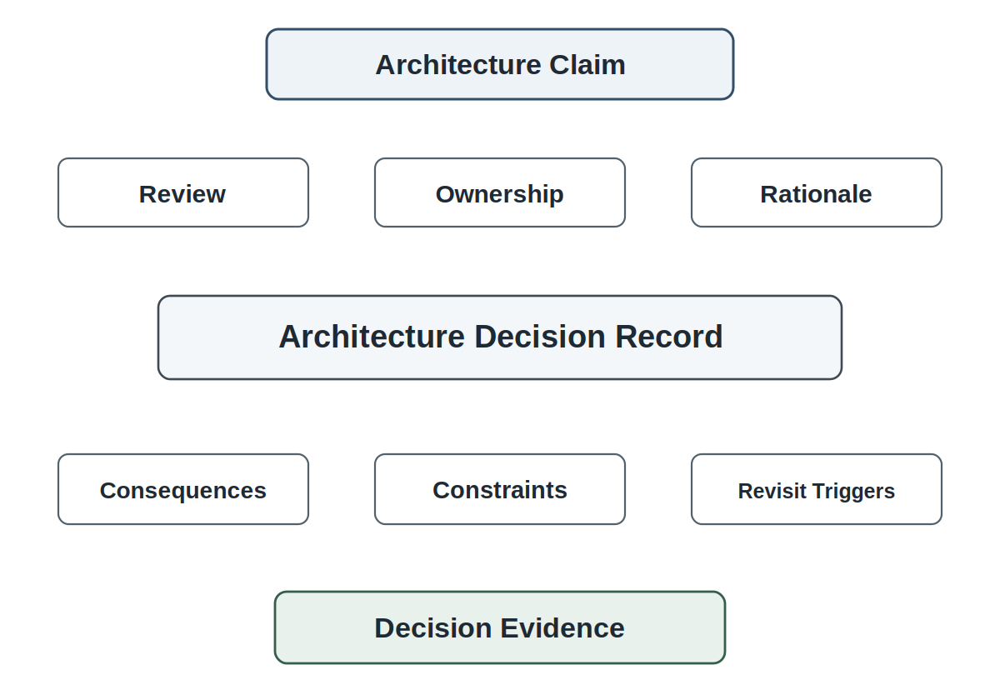
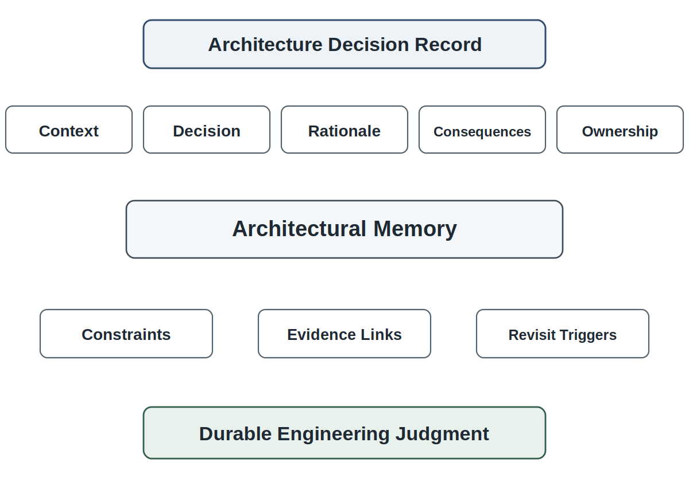
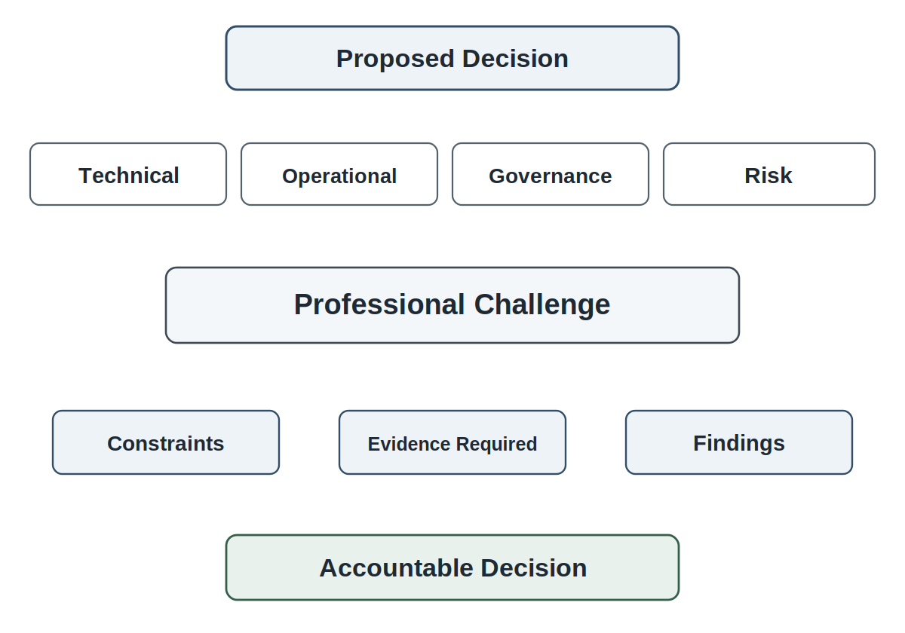
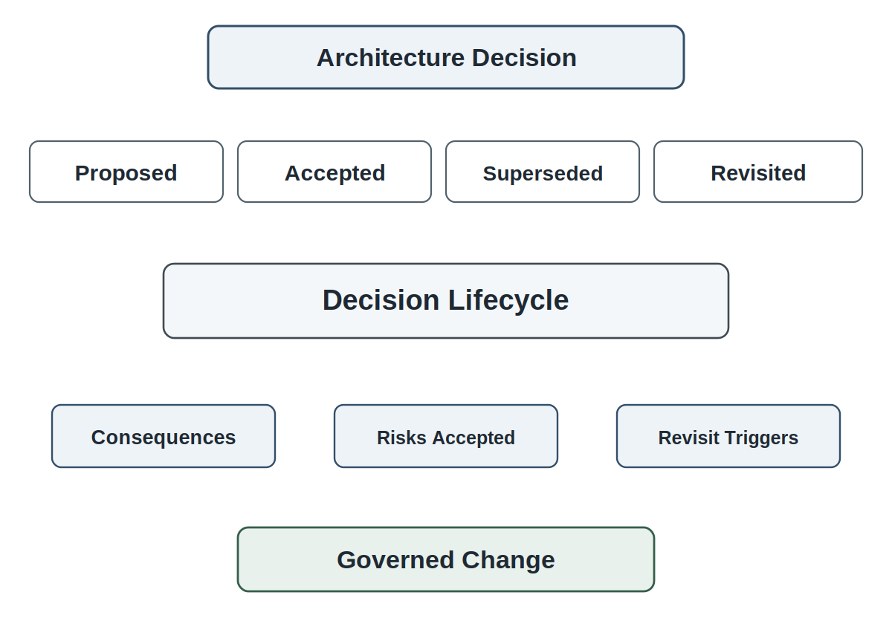
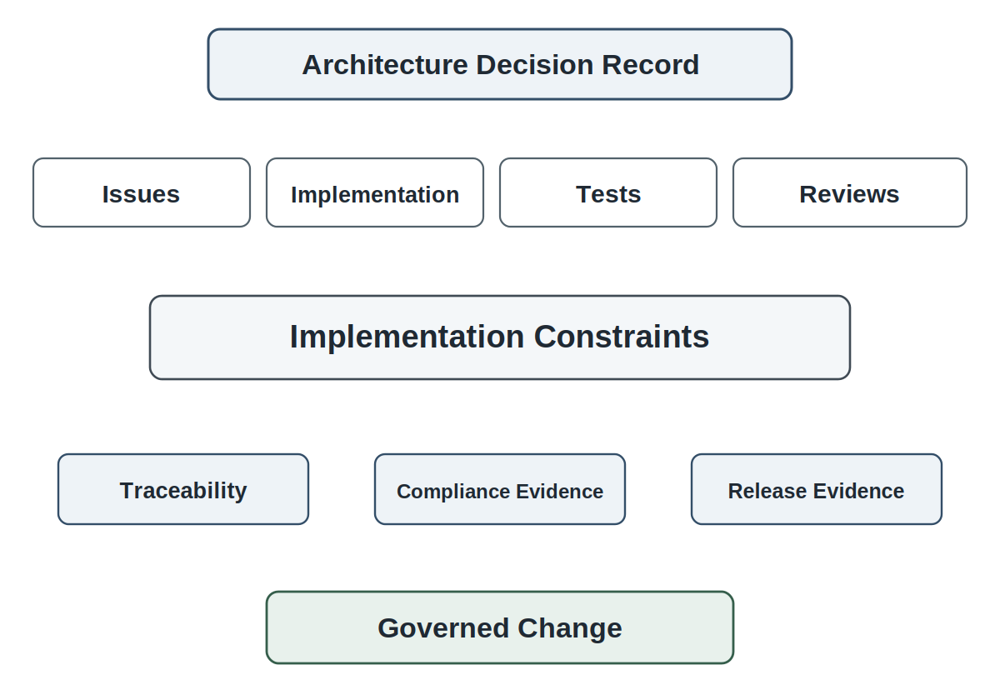

# Chapter 15<br><span class="chapter-title-main">Architecture Reviews and ADRs

## Opening Scenario: The Architecture Exists, but the Decisions Are Disappearing

The COICP team had reached the point where architecture was no longer abstract.

The team had a structural baseline. It knew where major responsibilities lived. Incident intake, incident records, routing, visibility controls, notifications, audit evidence, reporting, and future AI pressure points were no longer floating ideas. They had architectural homes.

The team had also taken the next step. It had considered what would happen if intelligent behavior entered that architecture. AI might summarize incident reports, suggest categories, recommend routing, draft notifications, identify urgency signals, or help staff search prior incidents. The team had learned that this was not a simple feature addition. It required context control, AI boundaries, authority boundaries, human approval paths, fallback behavior, evaluation evidence, audit trails, and repository evidence.

That work mattered.

But it created a new problem.

A review board member looked at the proposed architecture and asked a simple question:

Where are the decisions?

The team had diagrams. It had issue comments. It had meeting notes. It had a few planning documents. It had review discussion. It had strong verbal agreement about several important choices.

AI could recommend routing, but it would not assign responsibility automatically.

The original incident record would remain authoritative. AI summaries would be advisory.

Sensitive student-impacting incidents would require human approval.

Certain context sources would be allowed for AI use, while others would be excluded or redacted.

Fallback routing would remain manual if AI was unavailable or uncertain.

Notification drafts would require human review before sending.

Those were consequential choices. They affected authority, privacy, data ownership, operational accountability, testing, future implementation, and institutional trust.

But if the reasoning behind those choices remained scattered across memory, diagrams, comments, and meeting conversation, the architecture was still fragile.

A future developer might implement AI summaries as stored incident facts. A pull request might quietly allow automatic routing for a category that should require human approval. A model update might change context use without anyone realizing that an earlier decision excluded a sensitive source. A new team member might ask why a fallback path exists and remove it as unnecessary complexity. An AI coding assistant might generate plausible implementation logic that contradicts the architecture.

The problem would not be bad intent. The problem would be decision amnesia.

Architecture does not become trustworthy merely because a team made a good decision once. Architecture becomes trustworthy when consequential decisions are challenged, recorded, owned, linked to evidence, and revisited as the system changes.

That is the role of architecture reviews and Architecture Decision Records.

An architecture review asks whether the decision should be accepted. An Architecture Decision Record preserves what was decided, why it was decided, what alternatives were considered, what risks were accepted, what consequences follow, who owns the decision, and when the decision should be revisited.

Architecture decisions become trustworthy only when they are challenged, recorded, owned, and revisited as the system changes.



*Figure 15.1 — From Architecture Claim to Decision Evidence*

---

## 15.1 Architecture Decisions Are Engineering Claims

Architecture decisions are not preferences dressed up as diagrams.

They are engineering claims.

When a team decides that AI may recommend routing but may not assign ownership, it is making a claim about authority, risk, human oversight, and operational consequence. When it decides that an AI summary is advisory but the original incident record remains authoritative, it is making a claim about data ownership and institutional truth. When it decides that certain context sources may not be exposed to AI, it is making a claim about privacy, governance, and acceptable risk.

Those claims may be reasonable. They may even be correct. But they are still claims.

Professional engineering does not treat important claims as casual agreement. It asks what evidence supports the claim, what alternatives existed, what risks remain, who owns the result, and what would cause the team to reconsider.

This is why architecture decisions require review.

In COICP, an architecture decision might concern routing authority. The team might decide that low-risk facilities incidents can receive AI-assisted category suggestions, but any incident involving student welfare, safety, privacy, or disciplinary concern must require human review before routing. That decision sounds sensible. But reviewers should ask why that boundary is appropriate. What evidence supports it? Which requirements does it satisfy? Which risks does it reduce? What cost does it create? What happens when incidents straddle categories? What would cause the team to revisit the boundary?

A decision about context sources requires the same discipline. The team may decide that the model can use department routing rules and building metadata but not prior sensitive student records. That decision has privacy and accuracy consequences. It may reduce risk while limiting helpful context. It may require redaction rules. It may affect evaluation results. It may need governance approval.

A decision about fallback also requires evidence. If the model is unavailable, should the system stop routing? Should it fall back to manual routing? Should it delay nonurgent cases? Should it escalate certain cases? Each choice carries operational consequence.

Architecture decisions are engineering claims because they shape what the system can become.

The danger is that teams often make these claims informally. They discuss them in a meeting, draw a diagram, nod in agreement, and move forward. Later, the reasoning disappears. The decision remains embedded in code, but the rationale is gone. Future engineers can see what the system does, but not why it does it.

That is not enough.

A trustworthy architecture must preserve decision evidence. The repository must remember not only the final structure but the reasoning that made the structure defensible.

This does not mean every small implementation choice deserves an Architecture Decision Record. It does mean that consequential decisions must not vanish into memory.

The professional shift is simple but powerful:

Do not ask only, "What did we decide?"

Ask, "What claim did we make, what evidence supports it, what alternatives did we reject, what risks did we accept, and how will future engineers know?"

That question turns architecture from private reasoning into reviewable engineering.

---

## 15.2 What Counts as an Architecture Decision?

Not every design choice needs an Architecture Decision Record.

If every choice becomes an ADR, the repository becomes noise. If no choice becomes an ADR, the architecture loses memory. Professional judgment lives between those extremes.

An architecture decision deserves durable evidence when it affects the structure, authority, risk, governance, operation, or future change of the system.

A useful test is this:

Would a future engineer need to know why this decision was made before safely changing it?

If the answer is yes, the decision probably deserves an ADR or an equivalent decision record.

For COICP, many choices are ordinary implementation details. The exact label on a local variable does not need an ADR. The exact wording of a noncritical button might not need one. A small refactoring inside a clearly bounded component may be handled through normal pull-request review.

Other choices are different.

Where does the authoritative incident record live? That is an architecture decision.

May AI summaries be stored, or are they only transient review aids? That is an architecture decision.

Can AI recommend routing? That is an architecture decision.

Can AI ever route automatically? That is a major architecture decision.

Which context sources may be used for AI-assisted recommendations? That is an architecture decision.

What data must be excluded, redacted, or protected? That is an architecture decision.

What happens when the model fails or produces low-confidence output? That is an architecture decision.

Which events must appear in the audit trail? That is an architecture decision.

What human approval is required before stakeholder notification? That is an architecture decision.

Architecture decisions often have several recognizable traits. They cross responsibility boundaries. They affect data ownership. They change authority. They create dependencies. They influence security or privacy. They shape future testing. They affect observability or recoverability. They constrain implementation. They impose governance obligations. They create risk if misunderstood.

AI-era systems add more decision triggers. A decision should usually be preserved when it defines AI role, context access, model-output status, human approval, fallback behavior, evaluation strategy, audit evidence, retention rules, or acceptable delegation depth.

This is where ADR discipline prevents both under-documentation and documentation theater.

ADR underuse happens when consequential choices remain hidden in code, comments, or memory. ADR overuse happens when teams record trivial choices until decision records become unreadable. ADR theater happens when records exist but contain no meaningful reasoning.

The goal is not to fill templates. The goal is to preserve architectural judgment where future trust depends on it.

For students, the hardest part is not learning the format of an ADR. The hardest part is learning to recognize when a decision matters enough to be remembered.

A practical rule for COICP is this: if a decision affects responsibility, authority, data ownership, AI behavior, governance, evaluation, fallback, auditability, or the system's future ability to change safely, record it.

That rule will not identify every consequential decision. It will, however, capture most of the decisions future engineers will need to understand before they can modify the system responsibly.

---

## 15.3 ADRs as Architectural Memory

An Architecture Decision Record is a short, durable record of a consequential architecture decision.

The best ADRs are not long. They are clear.

They answer the questions future engineers will ask when the original team is gone, the code has changed, the model has been updated, the policy context has shifted, and someone needs to understand why the system was structured the way it was.

An ADR should usually preserve several elements:

- the decision title,
- the status of the decision,
- the date,
- the decision owner or owning role,
- the context that made the decision necessary,
- the decision itself,
- the options considered,
- the alternatives rejected,
- the rationale,
- the consequences,
- the risks accepted,
- related requirements, risks, issues, reviews, or diagrams,
- revisit triggers,
- and links to later decisions that supersede or modify it.



*Figure 15.2 — Anatomy of an ADR*

The exact template can vary. The underlying discipline should not.

An ADR exists so that future teams can reconstruct architectural judgment. It should explain why the team chose one path instead of another. It should preserve the tradeoff, not hide it. It should name the consequences, not pretend the decision has only benefits. It should identify the owner, not leave accountability vague. It should make the decision findable, linkable, and reviewable.

For COICP, an ADR might be titled:

ADR-0001: AI May Recommend Routing but May Not Assign Incident Ownership.

The context might explain that AI-assisted routing can improve coordinator efficiency but can also influence institutional responsibility, privacy handling, and escalation behavior. The options might include no AI routing assistance, advisory routing recommendation, human-approved routing action, low-risk auto-routing, or broad automated routing authority. The decision might accept advisory routing recommendations with human approval required for all consequential routing decisions. The rationale might cite authority risk, stakeholder impact, auditability, and human accountability. The consequences might include slower throughput than full automation but stronger governance and clearer responsibility. Revisit triggers might include sustained low override rates, improved evaluation evidence, new policy approval, or operational pressure requiring reconsideration.

That ADR would not merely document a choice. It would preserve judgment.

Another ADR might address summary status:

ADR-0002: AI-Generated Summaries Are Advisory and Do Not Replace the Incident Record.

This decision protects institutional truth. It prevents summaries from silently becoming authoritative records. It supports auditability and correction. It constrains implementation because the system must preserve the original report and distinguish generated summaries from official facts.

Another ADR might address context sources:

ADR-0003: Approved Context Sources for AI-Assisted Routing.

This decision would preserve which sources may be used, which are excluded, which require redaction, who owns them, and what governance constraints apply.

These records belong in the repository because the repository is the engineering system of record. A common location is `/docs/adr/`, but the path is less important than the principle: architecture decisions must be findable by the people who need to review, implement, test, operate, and change the system.

ADRs should not be treated as museum artifacts. They are living memory. A decision may be proposed, accepted, superseded, deprecated, or revisited. A later ADR may modify an earlier one. A postmortem may reveal that a decision needs reconsideration. A release readiness review may require evidence that an ADR has been implemented correctly.

AI can help draft ADR text. It can suggest options, organize rationale, summarize tradeoffs, and identify possible consequences. But AI must not launder weak human reasoning into confident prose. The engineers own the decision. They own the rationale. They own the evidence. They own the consequences.

An ADR is not trustworthy because it sounds polished.

It is trustworthy because it preserves accountable judgment.

In repository-centered engineering environments, ADRs are preserved as durable project artifacts rather than personal notes or meeting outcomes. A typical repository may maintain an ADR collection alongside architecture documentation, review records, and governance evidence.
Examples might include:

```text
/docs/adr/adr-index.md
/docs/adr/adr-0001-ai-assisted-routing.md
/docs/adr/adr-0002-context-source-boundaries.md
/docs/adr/adr-0003-human-approval-requirements.md
```

The specific directory structure is less important than the principle. Architecture decisions must be discoverable, reviewable, and connected to the engineering evidence that supports them.

---

## 15.4 Architecture Reviews as Professional Challenge

ADRs preserve decisions, but decisions should be challenged before they are accepted.

That is the role of architecture review.

An architecture review is not a meeting where the team explains what it already plans to do and waits for approval. It is a professional challenge mechanism. Its purpose is to test whether the architecture decision is supported by evidence, aligned with requirements, aware of risks, consistent with governance, testable, operable, maintainable, and understandable.

Review is how architecture becomes accountable.

A serious architecture review does not ask only whether the diagram looks reasonable. It asks whether the decision can survive implementation, testing, release, operation, failure, recovery, and change.

For COICP, the review board might examine the proposed ADR on AI-assisted routing. The team says AI may recommend routing but may not assign ownership. A weak review would say, "That seems safe." A stronger review asks:

What incidents are in scope? What context sources does the model use? What evidence shows recommendations are useful? Which incidents require human approval? What does approval look like? What happens when the recommendation is wrong? Is the override recorded? Can the system detect high override rates? What privacy constraints apply? What tests will verify the boundary? What pull-request checks will prevent implementation drift?

That is professional challenge.

Architecture review also protects against overconfidence. Teams often become attached to their own designs. AI-generated architecture suggestions can intensify that problem because they may sound complete even when they omit governance, fallback, or operational evidence. Review slows the team down at the exact point where confidence can become risk.

The review board should include people who can challenge different dimensions of the decision. Technical reviewers can inspect structure and dependencies. Product or stakeholder representatives can inspect operational fit. Governance reviewers can inspect authority, privacy, auditability, and institutional risk. Operations-minded reviewers can inspect fallback, recovery, observability, and maintainability. In a classroom setting, the same student team may play multiple roles, but the review lens should still exist.

Architecture review should produce output.

It may approve the decision. It may approve with constraints. It may require more evidence. It may ask the team to revise the ADR. It may identify missing alternatives. It may require a risk owner. It may reject the decision. It may identify implementation constraints or test obligations.

A review that leaves no evidence is weak review.

Review records should connect directly to ADRs. The ADR preserves the decision. The review record preserves the challenge. Together, they show not only what the team decided but how the decision was tested before becoming architectural memory.



*Figure 15.3 — Architecture Review as Professional Challenge*

This matters because architecture review is not about perfection. It is about making uncertainty visible before implementation hides it.

The team may still make imperfect decisions. Professional teams always do. But imperfect decisions with visible rationale, evidence, owner, risk, and revisit triggers are much safer than confident decisions with no memory.

Architecture review is how teams think together before code makes thinking expensive.

---

## 15.5 The Architecture Review Lens

Students often ask what reviewers should look for during an architecture review.

The answer is not one checklist.

A checklist can help, but it can also create review theater. Reviewers may confirm that every box has an answer without asking whether the answer is good enough. Architecture review requires a lens, not merely a form.

A useful architecture review lens asks several families of questions.

First, requirements alignment. Which requirements, constraints, stakeholder needs, and operational scenarios does this decision support? Does the decision trace back to real evidence, or is it driven by developer preference?

Second, responsibility structure. What responsibility does this decision assign, separate, combine, or move? Does it make ownership clearer or more confused?

Third, data ownership. What information becomes authoritative? What remains advisory? Where is the source of truth? What happens when data is corrected?

Fourth, dependency risk. What new dependency does the decision create? What happens if the depended-on service, model, policy, team, data source, or workflow changes?

Fifth, governance. What authority is being granted, limited, or implied? What approval is required? What audit evidence must exist? What privacy or compliance concern is implicated?

Sixth, AI control. If AI is involved, what is its role? What context does it use? What output does it produce? What status does that output have? What may it influence? What may it never decide?

Seventh, fallback and recovery. What happens when the decision fails? Can the system continue safely? Can the decision be corrected? Can the impact be traced?

Eighth, evaluation and testability. How will the team know whether the decision works? What tests, evaluation cases, review evidence, or operational signals will be required?

Ninth, implementation constraints. What must future issues, branches, pull requests, and tests respect? What would violate this decision?

Tenth, revisit triggers. What evidence, policy change, failure, operational pattern, or model update would cause the team to revisit the decision?

This lens turns architecture review from opinion exchange into evidence-based challenge.

For COICP, reviewers might apply this lens to the decision that AI summaries are advisory. Requirements alignment asks whether stakeholders need faster understanding without losing original records. Data ownership asks whether the original incident report remains authoritative. Governance asks whether summaries could expose or distort sensitive details. AI control asks whether summaries may be stored or displayed externally. Fallback asks whether coordinators can work without summaries. Evaluation asks whether summaries preserve critical facts. Implementation constraints ask whether code must prevent summaries from overwriting incident records. Revisit triggers ask whether heavy correction rates require changes.

That is how a simple decision becomes reviewable architecture.

The review lens also prepares students for later chapters. Pull-request review will ask whether code respects ADRs. Testing will ask whether behavior matches decisions. Release readiness will ask whether known architectural risks are accepted. Operations will ask whether runtime evidence confirms assumptions. Postmortems will ask whether earlier decisions contributed to failure.

Chapter 15 therefore gives future reviews their memory and language.

---

## 15.6 Rejected Alternatives and Tradeoff Memory

A weak decision record says only what the team chose.

A strong decision record also says what the team rejected and why.

Rejected alternatives matter because architecture is tradeoff work. If future engineers cannot see what was considered, they may repeat old debates, revive risky options, or assume the team never thought about an alternative that was actually rejected for good reasons.

For COICP, suppose the team accepts advisory AI routing but rejects automatic routing. A future developer might later ask why the system does not simply auto-route routine incidents. Without the rejected alternative, the answer may sound like caution or lack of ambition. With the ADR, the answer becomes clear: the team considered bounded automation but rejected it because incident categories could overlap, some reports might contain hidden student-impacting details, routing affects institutional responsibility, and evaluation evidence was not yet strong enough.

That memory matters.

Rejected alternatives also reveal governance reasoning. The team may reject exposing prior student incident records to the model because the privacy risk outweighs the expected accuracy benefit. It may reject storing full prompts because retention and sensitivity risks are too high. It may reject treating summaries as official records because generated text may omit or distort facts. It may reject broad automation because human oversight remains necessary.

These rejected alternatives are not failures. They are evidence of judgment.

Tradeoff memory helps future teams understand why the architecture has friction. Many trustworthy controls feel inconvenient later. Human approval slows workflow. Redaction reduces context. Manual fallback requires staffing. Audit logging adds implementation work. Evaluation plans take time. ADRs require writing. Without tradeoff memory, future teams may remove those controls as inefficiencies.

With tradeoff memory, they can see what risk the control was designed to manage.

AI makes rejected alternatives even more important. AI can generate plausible design options rapidly. Some will sound efficient. Some will sound modern. Some will be tempting because they reduce human work. But plausible does not mean acceptable. The team must preserve why certain AI-enabled options were rejected.

An ADR should not include every idea ever mentioned. It should preserve meaningful alternatives: options that were seriously considered, attractive enough to be tempting, or likely to be proposed again.

For example, an ADR on AI-assisted notification drafting might preserve these alternatives:

- no AI notification drafting,
- AI drafts internal-only notes,
- AI drafts notifications requiring human approval,
- AI sends low-risk notifications automatically,
- AI sends all notifications after policy-template validation.

If the team chooses human-approved drafting, it should preserve why it rejected automatic sending. The reason may involve tone, privacy, institutional authority, stakeholder sensitivity, and auditability.

Future maintainers do not need only the decision. They need the tradeoff.

Rejected alternatives are how the architecture remembers roads not taken.

---

## 15.7 Consequences, Risks, and Revisit Triggers

An ADR should not pretend that a decision ends uncertainty.

Good architecture decisions often reduce some risks while creating or accepting others. Mature records name those consequences honestly.

If COICP decides that AI may recommend routing but cannot assign ownership, the decision improves governance and human accountability. It also creates consequences. Coordinators must review recommendations. Workflow may be slower. The interface must show enough context for review. Audit trails must preserve recommendation and decision. Evaluation must consider whether recommendations help or distract. Training may be needed.

Those consequences should be visible.

If the team decides to exclude sensitive prior student records from AI context, it reduces privacy risk. It may also reduce recommendation quality for some cases. That is a tradeoff. If the team decides to store AI recommendations in the audit trail, it improves reviewability. It may also create retention, privacy, and storage concerns. That is a tradeoff too.

Architecture decisions become more trustworthy when consequences are named before implementation.

Risk acceptance should also be explicit. A team may accept that AI recommendations will be imperfect because human review remains in control. It may accept slower workflow because authority boundaries matter. It may accept reduced model context because privacy matters more. It may accept manual fallback because full automation is not yet justified.

These are not weaknesses if they are visible and owned.

But decisions should not remain frozen forever simply because an ADR exists.

A decision should identify revisit triggers.

A revisit trigger is a condition that tells the team the decision may need reconsideration. It might be a policy change, a model change, a new privacy requirement, a pattern of overrides, a post-release incident, evaluation failure, stakeholder complaint, operational bottleneck, new integration, or change in risk tolerance.

For COICP, revisit triggers for AI-assisted routing might include:

- sustained high override rates,
- repeated harmful recommendations,
- strong evaluation evidence across sensitive categories,
- a new campus policy affecting routing authority,
- an incident where AI influence contributed to delay or misrouting,
- model provider change,
- context-source change,
- new legal or privacy guidance,
- operational pressure to reduce coordinator workload,
- postmortem finding that the current boundary is too weak or too restrictive.



*Figure 15.4 — Decision Lifecycle: Proposed, Accepted, Superseded, Revisited*

Revisit triggers keep ADRs alive. They also prevent false certainty. The team is not saying, "This decision is correct forever." It is saying, "Given current evidence, constraints, risks, and goals, this is the decision we can defend now. Here is what would cause us to reconsider."

That is honest engineering.

In AI-era systems, revisit triggers are especially important because the environment changes. Models change. Prompts change. Context sources change. Policies change. Stakeholder expectations change. Evaluation evidence grows. Operational incidents reveal new risks. A decision that was prudent in Cycle 1 may become too conservative or too risky in Cycle 2.

A decision that cannot be revisited is not governed.

ADRs should therefore include status. Proposed. Accepted. Superseded. Deprecated. Rejected. Revisited. The exact status vocabulary can vary, but the record should make clear whether a decision is active and what later decision changed it.

Architecture memory must support change, not prevent it.

---

## 15.8 Decision Ownership and Accountability

Architecture decisions need owners.

A decision without ownership is easy to ignore. It may be accepted once and then abandoned. No one watches whether implementation respects it. No one revisits it when conditions change. No one explains it to new team members. No one updates the record after a postmortem. No one owns the consequences.

That is not accountable architecture.

Ownership does not always mean one individual personally carries all responsibility forever. In a student team, the owner may be a role: architecture lead, team lead, repository steward, QA lead, AI governance reviewer, product owner, or review board. In an enterprise, ownership may attach to a team, platform group, governance function, or operational owner.

The important point is that someone can be asked:

Who is responsible for maintaining this decision as the system changes?

For COICP, the decision that AI may recommend routing but not assign ownership might be owned by the architecture lead during design, the team lead during implementation, and the operational owner after release. The ADR should make the ownership path visible. If the model is later updated or routing policy changes, the owner or owning role should know that the decision may need review.

Decision ownership also supports implementation review. If a pull request changes routing behavior, reviewers should know which ADR applies and who should be consulted. If a developer proposes storing AI summaries as incident facts, the ADR owner or architecture reviewer should recognize that the proposal conflicts with an accepted decision.

AI cannot own decisions.

A model may suggest an option. It may draft rationale. It may summarize consequences. It may identify possible risks. But it cannot accept institutional responsibility. Humans and organizations own decisions because humans and organizations bear consequences.

That distinction matters in ADRs. If AI helped draft an ADR, the record should still reflect human decision ownership. If AI generated options, engineers should identify which options were accepted or rejected and why. If AI suggested rationale, engineers must verify that the rationale is true, relevant, and supported by evidence.

Decision ownership is where architecture connects to accountability.

A trustworthy team should be able to answer:

Who made this decision? Who reviewed it? Who owns it now? Who can change it? Who must approve a change? Who is responsible for revisiting it if evidence changes?

Those questions are not bureaucracy. They are how architecture remains governed over time.

---

## 15.9 From ADRs to Implementation Constraints

An ADR that does not shape implementation is weak evidence.

It may be well written. It may be approved. It may sit neatly in the repository. But if issues, branches, pull requests, tests, and reviews ignore it, the decision has not governed the system.

Architecture decisions must become implementation constraints.

For COICP, suppose an ADR states that AI-generated summaries are advisory and must not replace the original incident record. That decision should affect requirements, design, implementation, tests, and review.

Issues should reference the ADR when work involves summaries. Pull requests should show that generated summaries are stored or displayed with the correct status. Tests should verify that summaries cannot overwrite the authoritative record. Reviewers should challenge any change that treats summary text as fact. Release notes should mention known limitations if summaries are included in the pilot. Operational audit records should preserve whether summaries influenced decisions.

The ADR is not just documentation. It is a control.

Another ADR may state that routing recommendations require human approval for student-impacting incidents. Implementation must reflect that boundary. The user interface must support review. The backend must enforce the approval rule. Audit logs must record recommendation and decision. Tests must include student-impacting cases. Pull-request reviewers must look for hidden bypass paths. Evaluation must consider cases where AI should defer.

If implementation does not respect the ADR, one of two things must happen. Either the implementation must change, or the ADR must be revisited through review. Silent violation is not acceptable.

This is where repository-centered engineering becomes practical. ADRs should link to issues. Issues should link to pull requests. Pull requests should reference relevant ADRs. Tests should connect to accepted decisions. Review records should show whether implementation aligns with architecture. Release evidence should identify which decisions remain risky or incomplete.

Repository traceability becomes important at this stage because architecture decisions should not remain isolated documents. They should connect to implementation work through issues, branches, pull requests, tests, review records, and release evidence.

A mature repository may therefore preserve relationships among:

```text
/docs/adr/
/docs/reviews/
/docs/architecture/
/issues/
/pull-requests/
/tests/
/release-evidence/
```

The exact directory names may vary, but the principle should not. Future engineers must be able to understand how a particular implementation relates to a previously accepted architectural decision.



*Figure 15.5 — ADRs Constrain Implementation*

AI-assisted coding makes this even more important.

A coding assistant may generate code that appears reasonable but violates an ADR. It may treat AI summaries as official records. It may route automatically because that seems efficient. It may skip audit logging. It may pass sensitive context into a model call. It may collapse review steps into convenience functions.

The model does not know the architecture unless the team supplies and enforces it. Even then, generated output is proposed material.

Chapter 16 will take up AI-assisted design and coding directly. Chapter 15 prepares that work by establishing decision evidence. Before AI helps generate implementation, the team must know what decisions constrain implementation.

Architecture decisions are not complete until they can guide change.

---

## 15.10 Failure Pattern: Decision Amnesia

The primary failure pattern in Chapter 15 is decision amnesia.

Decision amnesia occurs when a team remembers what the system does but forgets why it does it.

At first, this may not seem serious. The code still exists. The diagrams may still exist. The system may still run. But the reasoning has decayed. Future engineers can see the current structure without understanding the tradeoffs, risks, constraints, rejected alternatives, or governance obligations behind it.

Decision amnesia is especially dangerous because it often appears after initial success. The original team made careful choices. The system worked. The pilot succeeded. New work began. Then people moved on, documents went stale, issue comments became hard to find, and decision rationale faded. Later teams inherited structure without memory.

COICP could suffer this easily.

A future developer sees that AI routing requires human approval. The approval step looks slow. No one remembers that the boundary was created because routing assigns institutional responsibility and student-impacting incidents can be sensitive. The developer proposes low-risk auto-routing. The proposal sounds efficient. Without the ADR, reviewers may not know what risk is being reopened.

Another developer sees that AI summaries are stored separately from incident records. That seems redundant. They simplify the data model and allow summaries to populate official fields. No one remembers that the original incident record was preserved as authoritative because generated summaries can omit, distort, or reframe facts.

Another team sees that certain context sources are excluded. They add them back to improve model performance. No one remembers the privacy rationale.

That is decision amnesia.

AI can accelerate it. AI-generated code and design suggestions often optimize for plausible structure, not inherited rationale. If the repository does not provide decision memory, AI assistance may produce changes that look sensible while eroding governance.

Several secondary anti-patterns support decision amnesia.

ADR theater occurs when ADRs exist but contain shallow rationale. The team can point to records, but the records do not preserve judgment.

Review theater occurs when architecture review meetings happen, but no one challenges assumptions or records meaningful findings.

Outcome-only ADRs record the selected option but omit context, rejected alternatives, risks, and consequences.

Stale ADRs remain marked as active even after architecture, policy, model behavior, or operational evidence has changed.

Hidden decision ownership leaves no one responsible for maintaining or revisiting the decision.

Architecture by issue comment buries consequential decisions in fragmented discussion that future teams cannot reliably find.

AI-generated rationale laundering occurs when AI produces polished justification for a decision that engineers have not actually examined.

Governance-late decision records are written after implementation to justify what already happened.

Trustworthy engineering counters decision amnesia by making decisions findable, reviewable, owned, linked, and revisitable. ADRs preserve memory. Reviews challenge confidence. Repository links connect decisions to work. Owners maintain accountability. Revisit triggers keep decisions alive. Implementation reviews enforce constraints.

The failure pattern is not forgetting a document.

The failure pattern is losing the judgment that made the architecture defensible.

---

## 15.11 LMU Evolution: From Intelligent-System Control Baseline to Decision-Evidence Baseline

At the beginning of Chapter 15, LMU has an intelligent-system control baseline for COICP. The organization can explain how intelligent behavior might be bounded if introduced. It has context-source thinking, AI boundaries, authority boundaries, human approval paths, fallback rules, evaluation obligations, audit expectations, and repository evidence.

That is progress, but it is not yet enough.

At the end of Chapter 15, LMU has a decision-evidence baseline.

The difference is important. A control baseline identifies how intelligent behavior should be bounded. A decision-evidence baseline preserves why those boundaries were chosen, what alternatives were rejected, what risks were accepted, who owns the decisions, and when the decisions should be revisited.

COICP now has the beginnings of architectural memory.

Repository maturity advances from architecture evidence to decision evidence. ADRs become part of the repository’s trust infrastructure. Review records show how decisions were challenged. Issues and pull requests can reference decisions. Future testing and release evidence can trace back to architectural intent. AI-use logs and evaluation plans can connect to decision rationale.

Governance maturity advances because authority-sensitive decisions are no longer informal. Decisions about AI recommendation status, human approval, context access, audit retention, fallback, and summary authority become reviewable records.

Review culture advances because the review board is no longer asking only whether the architecture is ready. It is asking whether the decision record is strong enough to guide implementation and future change.

AI maturity advances because AI-related architecture decisions are not treated as experiments floating outside governance. They become bounded, recorded, reviewable commitments.

Operational trust remains future-facing. COICP is still not fully implemented, tested, released, observed, or operated. But the system is now better prepared for implementation because future work can be constrained by recorded decisions.

The enterprise tension is still real. LMU leaders want progress. The COICP team wants to build. Governance stakeholders want control. Operations wants maintainability. Students want clarity. AI makes rapid implementation tempting. ADR discipline slows the team just enough to preserve judgment.

That is the right kind of friction.

By the end of Chapter 15, LMU is becoming an organization that can remember why it made consequential technical decisions. That memory is not nostalgia. It is infrastructure for future trust.

---

## 15.12 Operational Takeaways

Architecture decisions are engineering claims.

ADRs preserve architectural memory. They explain context, decision, options, rejected alternatives, rationale, consequences, risks, ownership, and revisit triggers.

Reviews challenge decisions before implementation hardens them. Architecture review is a professional safety mechanism, not a ceremonial meeting.

Not every choice needs an ADR. Consequential decisions affecting responsibility, authority, data ownership, AI behavior, governance, security, recoverability, evaluation, or future change usually do.

Rejected alternatives matter. Future teams need to know not only what was chosen but why attractive alternatives were rejected.

Consequences and risks must be named. Honest engineering records tradeoffs rather than hiding them.

Decisions need owners. Architecture without ownership decays.

ADRs must constrain implementation. Issues, pull requests, tests, reviews, AI-assisted coding, and release evidence should respect accepted architecture decisions.

AI-generated architecture suggestions remain proposed material. Engineers own the decision, rationale, evidence, and consequences.

A decision that cannot be found cannot govern. A decision that cannot be revisited is not governed. Everything important leaves evidence.

---

## 15.13 Exercises

### Exercise 1: Identify Architecture Decisions

Create the repository artifact:

`/docs/adr/architecture_decision_inventory.md`

Review the Chapter 14 intelligent-system architecture for COICP.

Identify at least eight consequential architecture decisions.

For each decision, explain how it affects one or more of the following:

- Responsibility
- Authority
- Data ownership
- AI behavior
- Governance
- Evaluation
- Fallback
- Auditability
- Future change

Determine which decisions would create the greatest operational risk if forgotten.

### Exercise 2: Determine Which Decisions Require ADRs

Create the repository artifact:

`/docs/adr/adr_classification_review.md`

Review a set of COICP design decisions.

Classify each decision as:

- No ADR needed
- ADR optional
- ADR required

For each classification, document the reasoning.

Include:

- One example where creating an ADR would create unnecessary documentation noise
- One example where failing to create an ADR would create future engineering risk

Explain how proportional decision recording improves repository quality.

### Exercise 3: Write an ADR for AI-Assisted Routing

Create the repository artifact:

`/docs/adr/adr_001_ai_assisted_routing.md`

Write an ADR documenting the decision that AI may recommend routing but may not assign incident ownership without human approval.

Include:

- Context
- Alternatives considered
- Decision
- Rationale
- Rejected alternatives
- Consequences
- Risks
- Owner
- Revisit triggers

Evaluate whether the ADR provides enough information for future engineers to understand the decision.

### Exercise 4: Review an Incomplete ADR

Create the repository artifact:

`/docs/reviews/adr_quality_review.md`

Review an ADR that records only a decision and omits:

- Context
- Alternatives
- Consequences
- Risks
- Ownership
- Revisit triggers

Identify all missing elements.

Rewrite the ADR as a complete decision record.

Explain how incomplete ADRs weaken engineering memory.

### Exercise 5: Analyze Alternatives and Consequences

Create the repository artifact:

`/docs/adr/alternative_analysis_record.md`

Review a COICP decision involving AI-generated summaries.

Document at least three alternatives, including one rejected option that appears attractive.

For each alternative, identify:

- Benefits
- Risks
- Governance implications
- Operational consequences

Explain why the selected option was accepted and the others were rejected.

Evaluate whether the tradeoff remains reasonable.

### Exercise 6: Define Revisit Triggers

Create the repository artifact:

`/docs/adr/revisit_trigger_record.md`

Select an ADR involving:

- AI routing
- Context access
- Fallback behavior
- Notification drafting

Define at least five revisit triggers.

Include:

- An evaluation-evidence trigger
- An operational-monitoring trigger
- A governance-change trigger
- A model-behavior trigger
- A stakeholder-feedback trigger

Explain how revisit triggers support responsible evolution of architecture decisions.

### Exercise 7: Conduct an Architecture Decision Review

Create the repository artifact:

`/docs/governance/reviews/architecture_decision_review_record.md`

Review an ADR created by another team.

Evaluate:

- Evidence supporting the decision
- Alternative analysis
- Risk identification
- Ownership clarity
- Implementation constraints
- Revisit triggers

Document:

- Findings
- Evidence gaps
- Questions
- Recommended revisions
- Approval status

Determine whether the ADR should be accepted, revised, or escalated.

### Exercise 8: Link ADRs to Implementation Evidence

Create the repository artifact:

`/docs/adr/adr_traceability_record.md`

Select one ADR and identify:

- Related implementation issues
- Related test cases
- Related pull-request review questions
- Related release evidence

Explain how a reviewer could detect a violation of the ADR.

Evaluate whether the ADR is adequately connected to downstream engineering activities.

---

## 15.14 Closing: From Architecture Decisions to AI-Assisted Design and Coding

Chapter 15 began with a simple problem: COICP had made consequential architecture decisions, but those decisions needed memory.

The team could not rely on diagrams, discussion, or confidence alone. It needed reviewable decision evidence. It needed records that explained what was decided, why it was decided, what alternatives were rejected, what risks were accepted, who owned the decision, and what would cause the team to revisit it.

That is what Architecture Decision Records provide.

Architecture reviews challenge decisions before implementation makes them expensive. ADRs preserve the reasoning so future engineers can understand, implement, test, review, operate, and change the system responsibly. Together, reviews and ADRs turn architecture from a moment of agreement into a durable engineering asset.

For COICP, this matters immediately. Decisions about AI-assisted routing, context-source boundaries, summary status, fallback behavior, human approval, audit evidence, and evaluation strategy will shape implementation. If those decisions are not preserved, AI-assisted coding and rapid development can easily drift away from architectural intent.

That creates the next step.

Chapter 16 moves into AI-Assisted Design and Coding. It examines how engineers should use AI to help design, scaffold, refactor, test, and document software when architecture decisions already exist. At that point, ADRs stop being architectural records and become implementation constraints. Generated code, generated designs, generated tests, and generated recommendations must all be evaluated against accepted decisions rather than treated as independent sources of truth.

Chapter 15 gives the team architectural memory.

Chapter 16 tests whether implementation can respect that memory while still benefiting from AI acceleration.

Architecture decisions become trustworthy only when they are challenged, recorded, owned, implemented, and revisited as the system changes.
