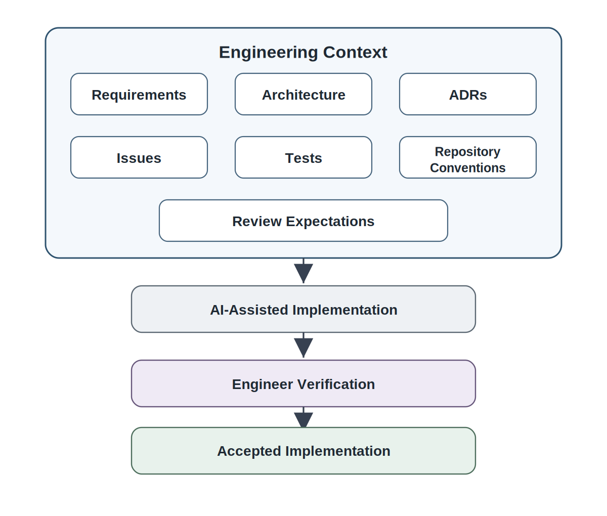
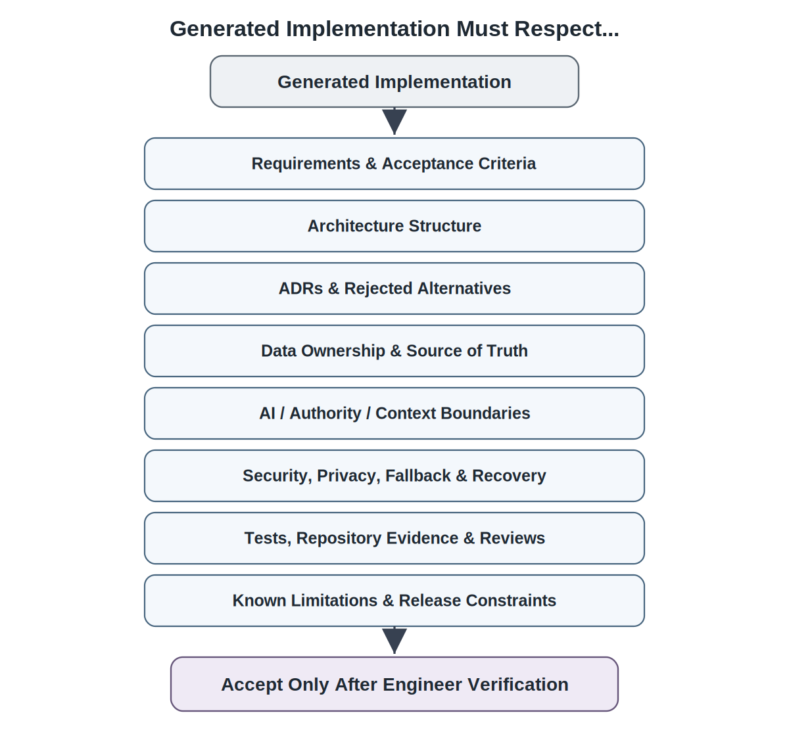
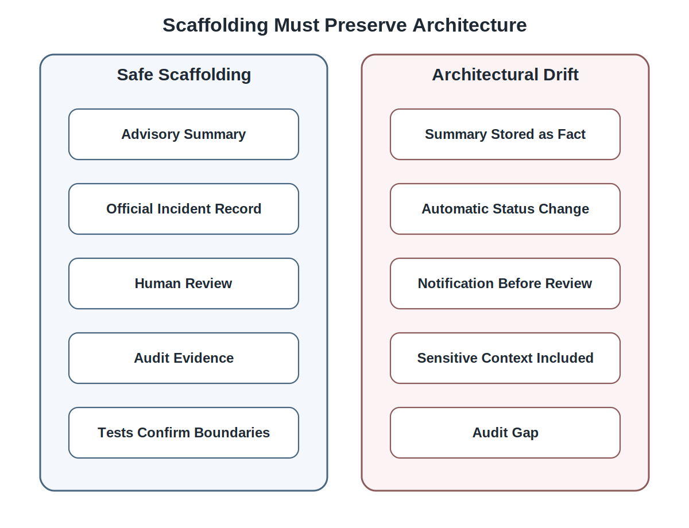
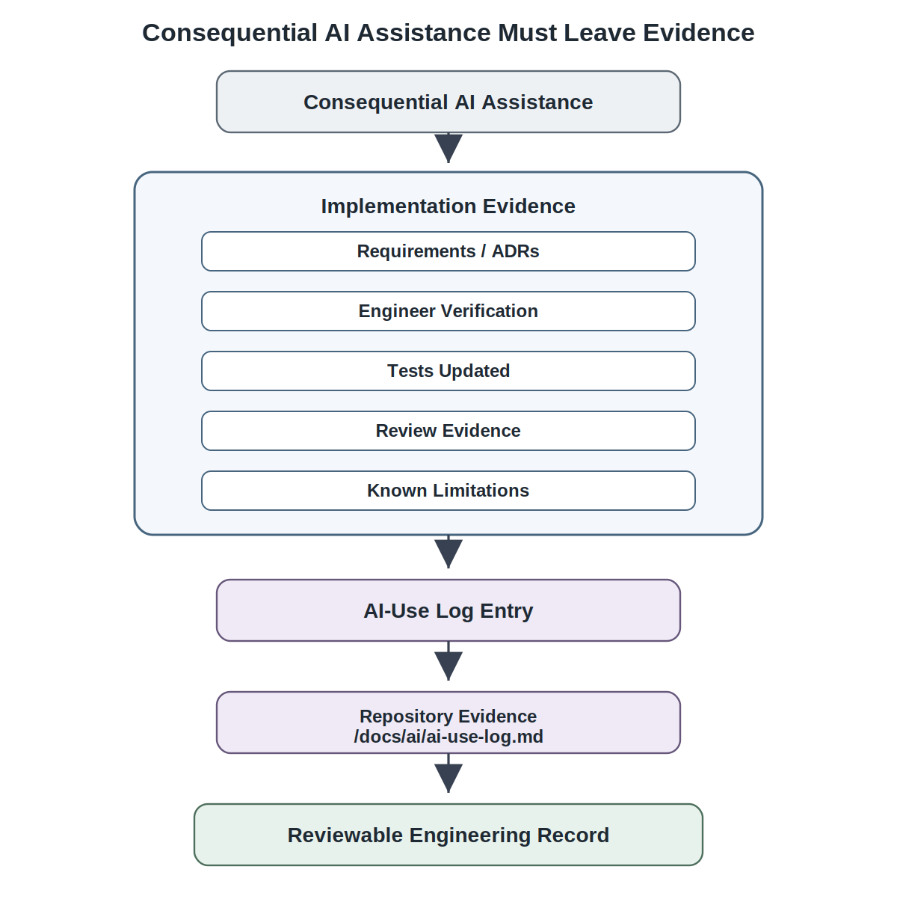
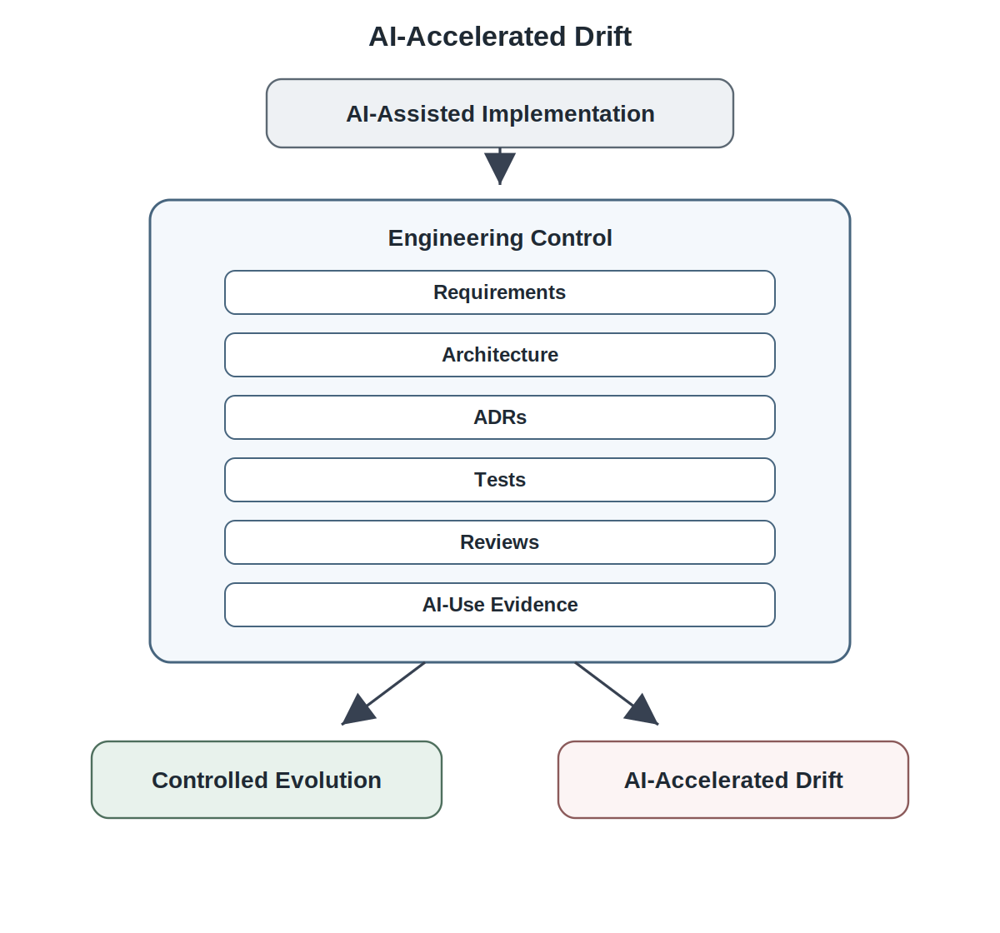

# Chapter 16<br><span class="chapter-title-main">AI-Assisted Design and Coding

## Opening Scenario: The Code Worked. The Architecture Did Not.

The COICP team was ready to build.

That readiness did not come from excitement alone. The team had done the harder work first. It had launched the project with standards. It had treated the repository as the system of record. It had developed requirements as evidence-backed understanding. It had identified planning risks. It had established a structural architecture. It had reasoned about intelligent-system control: context sources, AI boundaries, authority boundaries, fallback behavior, evaluation obligations, human approval, audit trails, and repository evidence. It had then preserved consequential architecture decisions through reviews and Architecture Decision Records.

In other words, the team had not arrived at implementation empty-handed.

It had context.

That mattered because the next temptation arrived immediately.

A developer opened an AI coding assistant and asked it to scaffold support for AI-generated incident summaries. The assistant responded quickly. It produced a clean service class, a data field for the generated summary, a helper function for routing recommendations, and a notification-drafting workflow. The code looked useful. It looked modern. It looked like progress.

It also violated the architecture.

The generated code stored AI summaries directly inside the incident record as if they were official facts. But an ADR stated that AI-generated summaries were advisory and must not replace the authoritative incident record. The generated routing helper returned a recommended destination and updated the incident status automatically. But a decision record stated that routing recommendations require human approval for student-impacting incidents. The notification workflow allowed draft messages to be sent after template generation. But the architecture required human review before any stakeholder notification. The model call accepted the entire incident object as context. But the context-source boundary excluded certain sensitive fields from AI input. The code did not preserve enough audit evidence to reconstruct recommendation, review, override, and final action.

The AI assistant had not acted maliciously. It had done what coding assistants often do: it produced plausible implementation material from incomplete context.

That is the Chapter 16 problem.

AI can help engineers design, scaffold, refactor, test, explain, and document software. It can accelerate work. It can reduce blank-page friction. It can surface alternatives. It can help students move from idea to working prototype faster than earlier generations of engineers could.

But AI-generated implementation is not trustworthy because it compiles. It is not trustworthy because it looks clean. It is not trustworthy because it follows a familiar framework pattern. It becomes trustworthy only when engineers verify that it respects requirements, architecture, ADRs, authority boundaries, data ownership, tests, reviews, repository evidence, and operational accountability.

AI-assisted design and coding can increase engineering capacity, but only when generated work remains proposed material governed by requirements, architecture, ADRs, repository evidence, tests, reviews, and accountable human judgment.


*Figure 16.1 — AI-Assisted Coding Begins After Engineering Context Exists*

---

## 16.1 AI-Assisted Coding Begins After Engineering Context Exists

AI-assisted coding should not be the first act of engineering.

It is easy to begin that way. A team has an idea. A developer asks an AI assistant to generate a first version. A prototype appears. Screens render. API routes respond. Tests may even pass. The team feels productive.

But productivity without context can create expensive drift.

Implementation begins after the team has built enough engineering context to constrain it. Requirements describe intent. Architecture describes structure. ADRs preserve consequential decisions. Issues define scoped work. Tests define expected behavior. Repository conventions define how evidence will be preserved. Review expectations define how acceptance will occur.

AI-assisted coding becomes safer when that context exists.

For COICP, the team should not ask an AI assistant to "build the incident routing feature" as if no prior engineering work exists. That request is too broad. It invites the model to invent structure, authority, data status, and workflow behavior. A better request starts from evidence: the issue being implemented, the relevant requirement, the architecture section, the ADR governing routing authority, the context-source boundary, the fallback rule, the expected tests, and the repository conventions for audit evidence.

The difference is not cosmetic. It changes what the AI assistant is being asked to do.

Without context, the model is implicitly being asked to act as architect, product owner, developer, tester, reviewer, and governance authority simultaneously. With context, the model is being asked to help generate implementation proposals inside boundaries that engineers have already established.

That distinction separates AI-assisted engineering from AI-directed engineering.

The impacted repository artifacts should be visible before implementation starts. For a COICP feature involving AI-assisted summaries or routing, the developer should know which repository evidence applies, including requirements documents, architecture notes, ADRs, issues, tests, review records, and AI-use logs. Typical impacted locations may include:

```text
/docs/requirements/
/docs/architecture/
/docs/adr/
/docs/ai/ai-use-log.md
/docs/reviews/
/tests/
/issues/
/pull-requests/
/release-evidence/
```

The exact directory names may vary across teams. The principle should not. AI-assisted implementation must be traceable to the project evidence that constrains it.

This is why Chapter 16 follows Chapter 15. Before AI helps generate implementation, the team must know what implementation is allowed to become.

A weak team asks, "Can AI write this?"

A stronger team asks, "What engineering evidence constrains what AI may help us produce?"

That question turns AI-assisted coding from productivity theater into disciplined engineering.

---

## 16.2 Generated Work Is Proposed Material

AI-generated work is proposed material.

That sentence governs this chapter.

A coding assistant may generate a service class, test file, API route, database migration, interface mockup, README section, refactoring plan, error handler, or architectural explanation. None of those outputs becomes accepted engineering work merely because the model produced it.

The engineer must understand it. The engineer must compare it against project intent. The engineer must adapt it to the actual architecture. The engineer must test it. The engineer must review it. The engineer must be able to explain it. The engineer must own it.

AI does not carry accountability for accepted work. Engineers do.

That matters in student projects because AI can create a false sense of completion. A student sees code that looks professional. The names are clean. The comments sound confident. The structure resembles examples from common frameworks. The output feels finished.

But polished output can still be wrong.

For COICP, generated code might create a summary field but fail to distinguish advisory text from authoritative incident facts. It might implement routing logic but skip human approval. It might generate tests that only verify happy paths. It might document that the system is "AI-powered" without explaining fallback, limitations, or audit evidence. It might simplify a workflow in a way that removes governance.

Those failures are not always obvious at first glance.

Treating generated work as proposed material creates the right posture. The engineer is not hostile to AI output. The engineer is not blindly trusting it either. The engineer is evaluating a proposal.

This applies beyond code. AI-generated design alternatives are proposed alternatives. AI-generated tests are proposed tests. AI-generated documentation is proposed documentation. AI-generated explanations are proposed explanations. AI-generated ADR text is proposed decision language. AI-generated review comments are proposed review observations.

The repository should make that posture visible. If AI materially assists consequential implementation, the work should be connected to issue discussion, pull-request descriptions, review notes, relevant ADRs, tests, and, when appropriate, an AI-use log. The point is not to shame AI use. The point is to make engineering evidence reviewable.

The doctrine remains unchanged:

AI proposes; engineers verify.

In Chapter 16, that doctrine becomes implementation practice.

---

## 16.3 The Constraint Stack: Requirements, Architecture, ADRs, Tests, Reviews

AI-assisted implementation needs a constraint stack.

A constraint stack is the set of engineering evidence that generated work must respect before it can be accepted. It prevents implementation from becoming whatever the model happens to produce.

The constraint stack includes:

- requirements and acceptance criteria,
- architecture structure,
- ADRs and rejected alternatives,
- data ownership and source-of-truth rules,
- AI boundaries and authority boundaries,
- context-source controls,
- security and privacy expectations,
- fallback and recovery rules,
- test expectations,
- repository conventions,
- review standards,
- known limitations and release constraints.


*Figure 16.2 — The Constraint Stack for AI-Assisted Implementation*

The stack matters because generated code is often locally plausible. It may solve the immediate programming task while violating a higher-level engineering decision.

Suppose the AI assistant generates an implementation for AI-assisted routing. The code accepts an incident report, calls a model, receives a routing recommendation, and updates the incident route. Locally, that flow is simple. It may pass a test that says "given a facilities incident, route to Facilities." But the constraint stack asks harder questions.

Does the requirement permit automatic routing? Does the architecture separate recommendations from official assignment? Does an ADR require human approval? Does the code preserve the original incident record? Does it log the model recommendation? Does it capture the human decision? Does it handle low confidence? Does it exclude sensitive context? Does it support fallback? Does it allow override? Does it create test evidence for student-impacting incidents?

If the answer is no, the generated code is not ready.

It may still be useful. It may provide a starting point. It may suggest a structure. But it is not acceptable engineering work yet.

The impacted repository artifacts should be explicitly named where work begins. A story or issue implementing AI-assisted routing should reference the relevant requirements, architecture note, ADR, test plan, AI-use expectations, and review checklist. A pull request should explain how the implementation respects those artifacts. Tests should demonstrate that the code enforces the constraints rather than merely producing output.

Chapter 15 taught that ADRs constrain implementation. Chapter 16 operationalizes that idea. The constraint stack gives students a practical review question:

What evidence must this AI-assisted work respect before we accept it?

That question is more important than the prompt used to generate the code.

---

## 16.4 AI-Assisted Design Alternatives

AI can be useful before code is written.

One of its strongest uses is exploring design alternatives. A team can ask an AI assistant to compare approaches, identify tradeoffs, generate risks, propose interface options, outline test cases, or surface implementation constraints. Used well, this can make students more thoughtful, not less.

But AI-generated design alternatives are still proposed material.

For COICP, the team might ask for different approaches to advisory incident summaries. One option might store generated summaries temporarily for coordinator review. Another might store approved summaries as separate advisory artifacts. Another might regenerate summaries on demand. Another might avoid storage entirely and use summaries only in the user interface. The AI assistant can help compare speed, cost, privacy, auditability, and user experience.

That is useful.

But the decision cannot be delegated to the model. Engineers must compare alternatives against requirements, architecture, ADRs, context boundaries, audit needs, evaluation plans, and governance risk.

The model may propose an option that sounds efficient but violates institutional authority. It may recommend storing summaries permanently without considering retention rules. It may propose using prior incidents as context without recognizing privacy concerns. It may suggest auto-routing because it optimizes for throughput rather than accountability.

Those alternatives are not useless. They may be valuable because they reveal what must be rejected.

A good team can use AI to generate the design space and then use engineering judgment to govern it.

Repository impact matters here. If AI-assisted design exploration produces a meaningful alternative, rejected option, risk, or rationale, it may belong in an ADR, design note, review record, or issue discussion. The repository should not capture every scratchpad idea. But consequential alternatives and rejected options are part of architectural memory.

AI can widen the conversation. Engineers must decide what becomes architecture.

---

## 16.5 AI-Assisted Scaffolding Without Architectural Drift

Scaffolding is one of the most tempting uses of AI.

A developer can ask for a controller, service, data model, test file, component, migration, mock API, or documentation stub. In seconds, the assistant produces a structure that would have taken much longer to type manually.

That speed can be helpful. It can also be dangerous.

Scaffolding can silently create architecture.

A generated service may introduce a dependency the team never approved. A generated model may collapse advisory and authoritative data into one field. A generated controller may allow an action without approval. A generated notification workflow may send messages before review. A generated database migration may preserve sensitive data that should not be stored. A generated helper function may bypass audit logging because the prompt did not mention it.

The problem is not that scaffolding exists. The problem is that scaffolding can smuggle decisions into the system.

For COICP, safe scaffolding for AI-generated summaries should preserve the architectural decision that summaries are advisory. It should not overwrite the incident report. It should not make the summary the source of truth. It should preserve status, reviewer action, correction path, and audit evidence. It should connect to tests that verify those rules.

Unsafe scaffolding may look cleaner. It may create a simple `summary` field directly on the incident object and use it throughout the workflow. That structure is tempting because it is easy. It is also wrong if it erases the distinction between generated assistance and official record.


*Figure 16.3 — Safe Scaffolding vs Architectural Drift*

The engineer's job is to inspect generated scaffolding for hidden architectural decisions.

What responsibility did the generated code assign? What data did it make authoritative? What dependency did it introduce? What authority did it grant? What audit evidence did it omit? What fallback did it assume? What test did it fail to create?

Scaffolded code should be tied to an issue, relevant ADRs, expected tests, and pull-request review evidence. If scaffolding changes the intended architecture, the team should not accept it silently. Either the code must change, or the architecture decision must be revisited through review.

Speed does not excuse drift.

---

## 16.6 AI-Assisted Refactoring and the Risk of Behavioral Drift

Refactoring is supposed to improve structure without changing behavior.

AI-assisted refactoring can help identify duplication, simplify code, rename concepts, extract functions, reorganize modules, or clarify interfaces. Those are useful capabilities.

But AI-assisted refactoring can also change behavior accidentally.

The danger is especially high when behavior carries governance meaning.

For COICP, an AI assistant might refactor routing logic by combining several approval checks into one helper function. The resulting code may be shorter. It may look cleaner. But if the refactor changes when human approval is required, it has altered authority. Another refactor might combine the incident record and generated summary objects because they share fields. That may reduce duplication while weakening source-of-truth boundaries. Another refactor might remove audit events that look redundant but are required for reconstruction.

That is not harmless cleanup. It is behavioral drift.

AI may optimize code shape without understanding institutional meaning. It may treat a repeated check as duplication even though the repetition expresses separate governance controls. It may remove logging that appears noisy but provides auditability. It may simplify fallback paths that look like edge cases but preserve operational safety.

This is why AI-assisted refactoring must be reviewed against behavior, not just style.

The repository evidence should show the intended behavior before and after refactoring. Pull requests involving AI-assisted refactoring should reference relevant ADRs, tests, and behavior-preservation evidence. If the refactor touches authority, audit, context, fallback, or data ownership, reviewers should treat it as architecture-sensitive work.

The anti-pattern here is synthetic cleanliness.

Synthetic cleanliness occurs when AI produces code that appears simpler while erasing meaningful engineering distinctions. The result may reduce visible complexity, but it can also remove governance boundaries, authority checks, audit evidence, fallback behavior, or ownership signals that the architecture intentionally preserved.

Code is not better merely because it is shorter.

Clean code is not trustworthy if it hides responsibility.

---

## 16.7 AI-Assisted Test Generation

AI can help generate tests.

That is valuable because students often under-test, especially around edge cases, failure paths, and boundary conditions. A coding assistant can propose unit tests, integration tests, scenario tests, negative tests, and regression tests. It can help identify cases the developer forgot.

But AI-generated tests are not automatically sufficient.

A model often tests what the code appears to do, not what the system is required to do. It may generate tests that mirror the implementation rather than challenge it. It may focus on happy paths. It may miss governance-sensitive cases. It may create tests that pass while the system violates an ADR.

For COICP, AI-generated tests for summaries should not merely confirm that a summary string is produced. They should verify that the original incident record remains authoritative, that generated summaries have advisory status, that corrections are tracked, that sensitive details are handled appropriately, and that audit evidence records human review.

Tests for routing recommendations should not merely confirm that a recommendation exists. They should verify that student-impacting incidents require human approval, that low-confidence recommendations defer to manual review, that overrides are logged, that fallback behavior works, and that context exclusions are respected.

The impacted repository artifacts should be named in the testing workflow. Generated tests belong in `/tests/`, but their purpose should trace back to requirements, ADRs, architecture notes, issues, and review evidence. If an AI assistant proposes tests, the engineer should map those tests to the constraint stack.

The question is not:

Did AI generate tests?

The question is:

Do these tests verify the decisions and risks that matter?

AI can expand test imagination. Engineers must define test sufficiency.

---

## 16.8 AI-Assisted Documentation and Explanation

AI can draft documentation quickly.

It can summarize code, write comments, generate README sections, explain workflows, produce run notes, draft API descriptions, and create implementation summaries for pull requests.

That is useful. It is also risky.

Documentation can be wrong in polished ways.

A model may describe intended behavior rather than actual behavior. It may invent rationale. It may claim that a security check exists when it does not. It may overstate automation. It may hide fallback limitations. It may describe summaries as official records because that sounds natural. It may say routing is automatic because the code calls a recommendation function. It may omit human approval because that detail was not visible in the snippet provided.

Polished documentation can create future risk because readers trust confident prose.

For COICP, AI-generated documentation for routing must clearly distinguish recommendations from official assignment. Documentation for summaries must preserve advisory status. Documentation for notification drafting must state that human review is required before sending. Documentation for model context must reflect approved context sources and exclusions. Documentation for fallback must match the actual implementation.

Repository impact is direct. Documentation updates may affect `/docs/architecture/`, `/docs/adr/`, `/docs/ai/`, `/docs/reviews/`, README files, run notes, pull-request descriptions, and release evidence. If AI drafts documentation for architecture-sensitive behavior, reviewers should verify it against the code, tests, ADRs, and known limitations.

The anti-pattern is polished misinformation.

A paragraph that sounds professional but misstates the system is worse than a rough note that accurately warns future engineers.

AI can help write documentation. Engineers must make it true.

---

## 16.9 AI-Use Logs and Implementation Evidence

Everything important leaves evidence.

In AI-assisted implementation, that does not mean every prompt, every generated line, or every experimental exchange must be preserved forever. That would create noise and discourage honest use.

The evidence standard should be proportional.

If AI helps rename a local variable, no special record may be needed. If AI helps generate code that affects routing authority, context use, audit evidence, test strategy, notification behavior, data ownership, or release risk, then the assistance should leave evidence.

The purpose of AI-use evidence is not confession. It is reviewability.

For COICP, significant AI assistance might be recorded when a developer uses AI to scaffold the advisory-summary workflow, generate tests for routing approval, draft documentation for AI limitations, refactor audit-event handling, or compare context-source designs. The record should help reviewers understand what was generated, what was accepted, what was changed, what evidence was used to verify it, and which ADRs or requirements constrained it.

A useful AI-use log entry might include:

- issue or feature reference,
- AI-assisted task type,
- related requirements or ADRs,
- summary of assistance,
- engineer verification performed,
- tests added or updated,
- known limitations,
- reviewer notes,
- final disposition.


*Figure 16.4 — AI-Assisted Implementation Evidence Path*

The impacted repository location should be explicit. A project may preserve significant AI-use evidence in a file such as:

```text
/docs/ai/ai-use-log.md
```

The same evidence may also appear in issue comments, pull-request descriptions, review records, test evidence, or release notes. The exact form can vary. The principle should not: consequential AI assistance should be visible enough to review and learn from.

This is especially important because AI assistance changes the verification burden. If a human writes code line by line, reviewers still inspect it. If AI generates code quickly, reviewers must inspect it with even more attention to hidden assumptions. AI-use evidence helps identify where extra verification is needed.

AI-use logs should not become bureaucracy theater. A log entry that says "used AI" with no connection to verification is weak evidence. A useful record explains how the accepted work was checked against engineering constraints.

The goal is not surveillance.

The goal is accountable engineering.

---

## 16.10 Reviewing AI-Assisted Implementation Before PR Review

Formal pull-request review belongs in the next chapter. But AI-assisted work needs self-review before it reaches that point.

A professional engineer should not open a pull request containing AI-assisted implementation without first checking whether the work respects the constraint stack.

For COICP, a developer preparing AI-assisted summary code should ask:

Does this implement the issue intent? Does it respect the requirement? Does it preserve the original incident record? Does it treat the generated summary as advisory? Does it reference the relevant ADR? Does it avoid excluded context? Does it capture audit evidence? Does it support fallback? Are there tests for summary status, correction, and review? Is AI assistance disclosed where appropriate?

A developer preparing routing recommendation code should ask similar questions:

Does this preserve human approval? Does it prevent automatic assignment for student-impacting incidents? Does it log recommendation and decision separately? Does it allow override? Does it handle low confidence? Does it test sensitive cases? Does it avoid context leakage? Does it reflect the ADR?

This pre-review does not replace team review. It prepares for it.

Repository evidence should reflect the pre-review. Issue updates should explain progress and constraints. Pull-request descriptions should identify relevant ADRs, tests, and AI-use notes. Review checklists should ask whether AI-assisted work respects authority, data ownership, context control, auditability, fallback, and known limitations.

The worst AI-assisted workflow is silent acceptance: generate, paste, commit, and move on.

The professional workflow is visible acceptance: generate, understand, adapt, test, record, review, and own.

Chapter 17 will formalize this through pull requests, human reviews, and CI/CD. Chapter 16 prepares the mindset.

---

## 16.11 Failure Pattern: AI-Accelerated Drift

The primary failure pattern in Chapter 16 is AI-accelerated drift.

AI-accelerated drift occurs when generated implementation moves faster than requirements, architecture, ADRs, tests, reviews, and repository evidence can constrain it.

The team feels productive. The repository changes quickly. Features appear. Screens work. Code compiles. Tests may pass. But the system gradually moves away from its intended architecture.

COICP could suffer this in several ways.

A generated summary workflow starts treating AI summaries as incident facts. A generated routing helper bypasses human approval because automatic routing looks efficient. A generated refactor removes audit events because they appear redundant. A generated test suite verifies only happy paths. Generated documentation describes capabilities more confidently than the implementation deserves. Generated code passes sensitive incident fields into a model call because the prompt did not include context exclusions.

None of these failures requires malice. They require speed without constraint.

AI-accelerated drift is dangerous because it can look like progress. The team may produce more code, more tests, more documentation, and more apparent functionality. But quantity of artifact production is not the same as engineering maturity.

Several secondary anti-patterns support AI-accelerated drift.

AI-first implementation occurs when the team begins with generated code before requirements, architecture, ADRs, and issues are clear.

Generated-code ownership gap occurs when no engineer fully understands or owns what the model produced.

Synthetic cleanliness occurs when AI makes code look cleaner while erasing important behavioral or governance distinctions.

Polished misinformation occurs when AI-generated documentation sounds authoritative but misstates the system.

Contextless scaffolding occurs when generated structure invents architecture outside approved decisions.

Test theater occurs when AI-generated tests increase test count without testing meaningful risk.

Documentation hallucination occurs when generated explanations describe behavior or rationale that does not exist.

ADR bypass occurs when implementation contradicts accepted decisions without review.

Silent authority expansion occurs when generated code gives the system more decision power than the architecture allowed.

Review overload occurs when rapid AI-generated change produces more material than reviewers can evaluate responsibly.

Trustworthy engineering counters AI-accelerated drift by slowing down the right parts of the workflow. Requirements constrain intent. Architecture constrains structure. ADRs constrain decisions. Tests constrain behavior. Reviews constrain acceptance. AI-use logs preserve evidence. Repository links make work traceable. Engineers own what they accept.

The failure pattern is not using AI.

The failure pattern is letting AI outrun engineering control.


*Figure 16.5 — AI-Accelerated Drift*

---

## 16.12 LMU Evolution: From Decision-Evidence Baseline to AI-Assisted Implementation Discipline

At the beginning of Chapter 16, LMU has a decision-evidence baseline for COICP. The organization has recorded key architecture decisions. It has ADRs that preserve why AI may recommend routing but not assign ownership, why summaries are advisory, which context sources are allowed, what fallback behavior exists, and where human approval is required.

That is a strong starting point.

At the end of Chapter 16, LMU has the beginnings of AI-assisted implementation discipline.

The difference is important. Decision evidence preserves judgment. Implementation discipline uses that judgment to constrain code, tests, documentation, and review.

Operationally, COICP begins moving from design to build. Developers can use AI to scaffold components, generate tests, compare alternatives, refactor code, and draft documentation. But those activities now occur inside an engineering control system. Work is tied to issues. Issues reference ADRs. Pull requests will reference tests and decisions. AI-use evidence is captured when consequential work is affected. Review questions are prepared before integration.

Repository maturity advances again. The repository is no longer only a place where requirements, architecture, and decisions live. It is becoming the place where implementation activity can be traced back to those decisions. Impacted repository artifacts include:

```text
/docs/requirements/
/docs/architecture/
/docs/adr/
/docs/ai/ai-use-log.md
/docs/reviews/
/tests/
/issues/
/pull-requests/
/release-evidence/
```

Governance maturity advances because AI-assisted implementation is not hidden. The team can see where AI helped, what constraints applied, what verification occurred, and what review evidence exists.

AI maturity advances because AI is no longer treated as magic productivity. It is treated as a tool operating inside a governed engineering system.

Operational trust remains future-facing. COICP is still not released. It is not yet operating under real incident load. But the project has taken an important step: code is beginning to emerge without abandoning the evidence, decisions, and governance that made the architecture trustworthy.

That is the professional balance Chapter 16 should teach.

---

## 16.13 Operational Takeaways

AI-generated implementation is proposed material.

Engineers own generated work they accept.

AI-assisted coding should begin after engineering context exists. Requirements, architecture, ADRs, issues, tests, and repository conventions must constrain implementation.

The model does not know the architecture unless the team supplies and enforces it.

AI can help generate design alternatives, scaffolding, refactors, tests, documentation, and explanations. None of those outputs is accepted until reviewed and verified.

Polished output is not verified output.

Repository evidence makes AI-assisted work reviewable. Significant AI assistance should be disclosed where it affects consequential work.

Generated code must not bypass authority, audit, privacy, fallback, human approval, data ownership, or review rules.

AI-assisted test generation is useful only when tests map to requirements, ADRs, risks, and expected behavior.

AI-assisted documentation must be verified against actual code, architecture, ADRs, and known limitations.

AI proposes; engineers verify.

---

## 16.14 Exercises

### Exercise 1: Evaluate AI-Generated Code Against ADRs

Create the repository artifact:

`/docs/reviews/ai_generated_code_adr_review.md`

Review an AI-generated implementation for AI-assisted incident summaries.

Identify where the implementation:

- Complies with approved ADRs
- Violates approved ADRs
- Creates ambiguity
- Requires additional evidence

Pay particular attention to:

- Advisory summary status
- Authoritative incident records
- Audit evidence
- Human-review requirements

Rewrite the acceptance criteria required before the implementation can be approved.

Determine whether the implementation is acceptable, conditionally acceptable, or unacceptable.

### Exercise 2: Create an Implementation Constraint Checklist

Create the repository artifact:

`/docs/implementation/implementation_constraint_checklist.md`

Select a COICP issue and build an implementation checklist that includes:

- Relevant requirements
- Architecture constraints
- Applicable ADRs
- Authority boundaries
- Context exclusions
- Security expectations
- Test obligations
- Repository evidence requirements

Explain how the checklist constrains AI-assisted implementation and reduces implementation drift.

### Exercise 3: Evaluate AI-Generated Design Alternatives

Create the repository artifact:

`/docs/implementation/design_alternative_evaluation.md`

Use an AI assistant to propose multiple approaches for implementing routing recommendations.

For each proposal, determine whether it should be:

- Accepted
- Accepted with review
- Escalated for governance review
- Rejected

Document the reasoning using:

- Requirements
- ADRs
- Authority boundaries
- Trustworthiness principles

Explain why engineering judgment remains necessary even when multiple technically viable solutions exist.

### Exercise 4: Review Scaffolded Code for Authority Drift

Create the repository artifact:

`/docs/reviews/authority_drift_review_record.md`

Inspect scaffolded routing or notification code.

Identify any implementation that:

- Expands authority without approval
- Weakens human review
- Bypasses audit logging
- Changes workflow ownership
- Modifies authoritative records improperly

Document the risks and propose corrective actions.

Evaluate whether the implementation preserves intended governance boundaries.

### Exercise 5: Evaluate AI-Generated Tests

Create the repository artifact:

`/tests/generated_test_evaluation_record.md`

Generate a test suite for COICP summaries or routing recommendations.

Classify each test as:

- Requirement-based
- ADR-based
- Governance-based
- Edge-case coverage
- Weak or irrelevant

Identify missing tests and add coverage for meaningful operational risks.

Determine whether the resulting test suite is sufficient for implementation review.

### Exercise 6: Detect Hallucinated Documentation

Create the repository artifact:

`/docs/reviews/generated_documentation_validation_record.md`

Review an AI-generated README or implementation note describing AI-assisted routing.

Identify claims that are:

- Unsupported
- Overstated
- Misleading
- Inconsistent with requirements
- Inconsistent with architecture
- Inconsistent with ADRs

Rewrite the documentation so that it accurately reflects repository evidence.

Document any claims that cannot be verified.

### Exercise 7: Create an AI-Use Log Entry

Create the repository artifact:

`/docs/ai/ai_use_log.md`

Write an AI-use log entry for a consequential AI-assisted implementation activity.

Include:

- Issue reference
- Related ADRs
- Description of AI assistance
- Engineer verification performed
- Tests added or updated
- Known limitations
- Reviewer notes
- Final disposition

Evaluate whether the entry provides sufficient evidence for future review and audit activities.

### Exercise 8: Prepare a Pull-Request Description for AI-Assisted Code

Create the repository artifact:

`/docs/reviews/ai_assisted_pull_request_example.md`

Draft a pull-request description for AI-assisted code implementing advisory summaries.

Include:

- Linked issue
- Relevant requirements
- Applicable ADRs
- Test evidence
- AI-use disclosure
- Known limitations
- Reviewer focus areas

Explain why each section is necessary for evidence-centered engineering.

Determine whether the pull request contains sufficient information to support Chapter 17 review activities.

---

## 16.15 Closing: From AI-Assisted Implementation to Pull Requests, Reviews, and CI/CD

Chapter 16 began with a seductive possibility: AI could help COICP move from architecture to implementation quickly.

That possibility is real.

AI can help engineers design alternatives, scaffold code, refactor implementations, generate tests, explain behavior, and draft documentation. Used well, it can increase capacity and reduce friction. Used carelessly, it can accelerate drift away from the very evidence that made the system trustworthy.

The professional answer is not to avoid AI-assisted implementation. The professional answer is to govern it.

COICP now has the beginning of that discipline. AI-generated work is proposed material. Requirements define intent. Architecture defines structure. ADRs define decisions. Tests define expected behavior. Reviews define acceptance. Repository evidence makes the work traceable. Engineers own what they accept.

Yet implementation alone does not make software part of the system.

Code becomes engineering work only after it survives challenge. It must be reviewed, tested, integrated, evaluated against architectural intent, and examined for unintended consequences. AI-assisted implementation does not reduce that obligation. It increases it.

That creates the next construction step.

Chapter 17 moves into Pull Requests, Reviews, and CI/CD. It examines how teams transform individual implementation activity into controlled organizational change. If Chapter 16 teaches engineers how to govern AI-assisted implementation before acceptance, Chapter 17 teaches how repositories, reviewers, tests, automation, and evidence determine whether that implementation deserves acceptance.

AI can help generate change.

Professional engineering decides whether the change should be trusted.

AI proposes; engineers verify.
