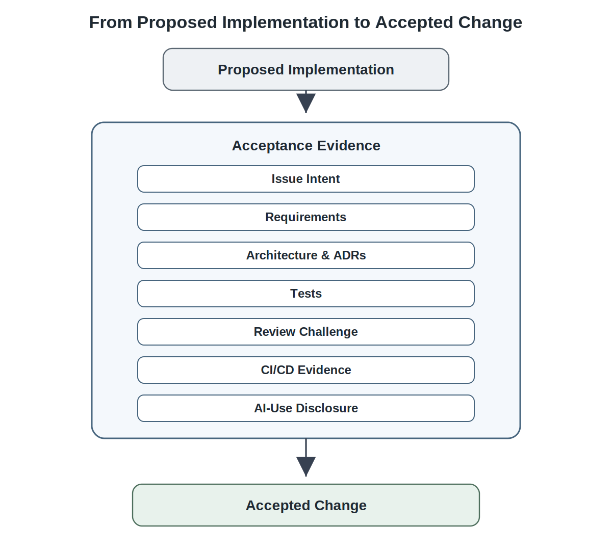
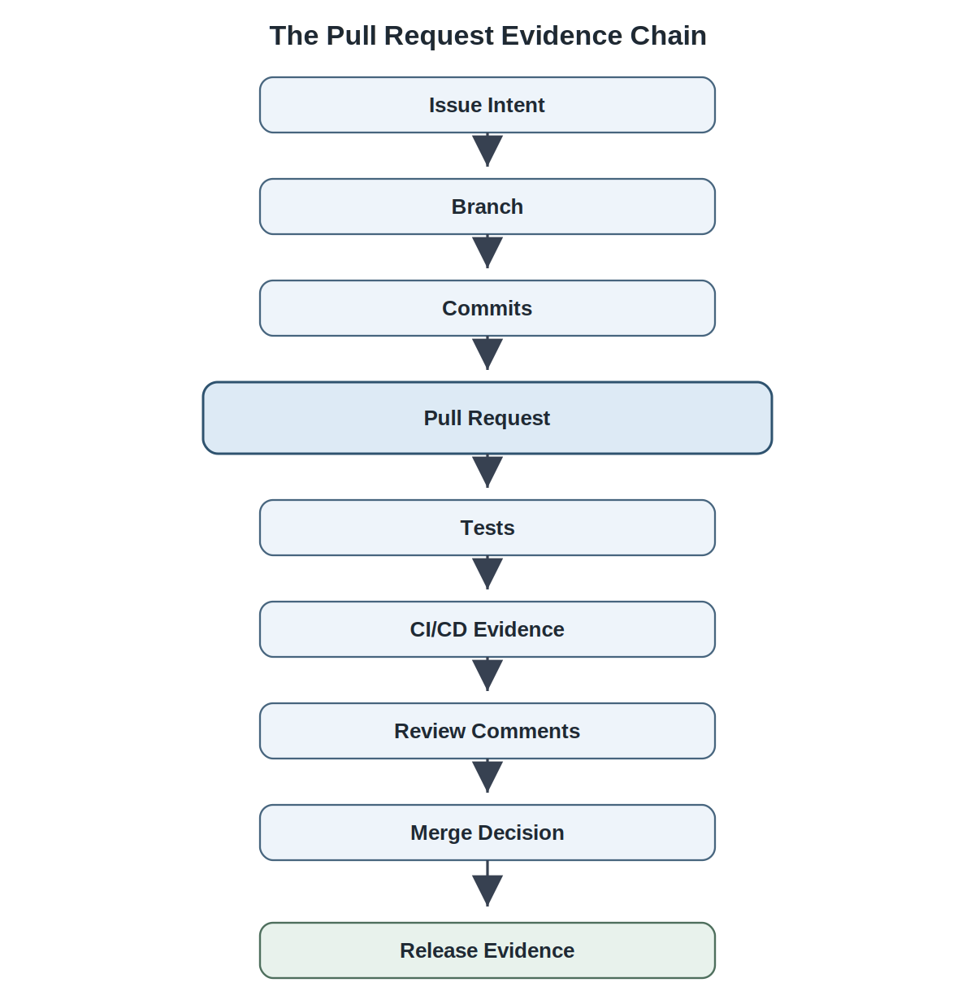
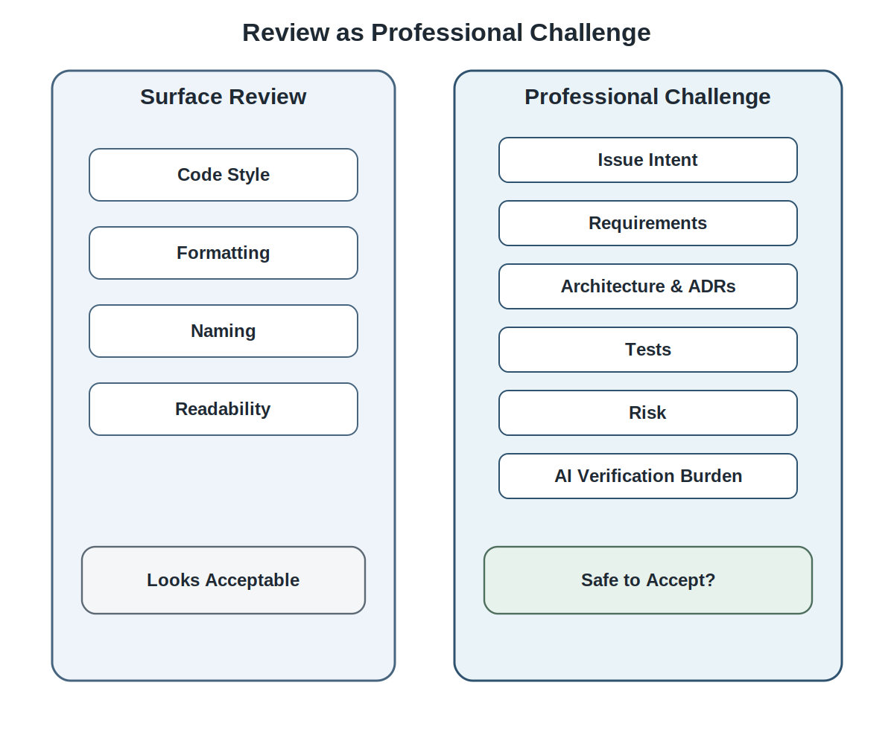
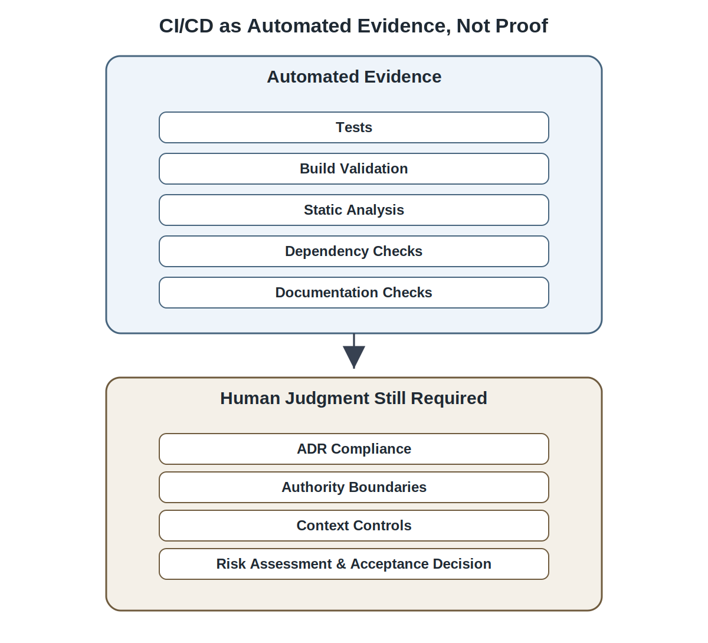
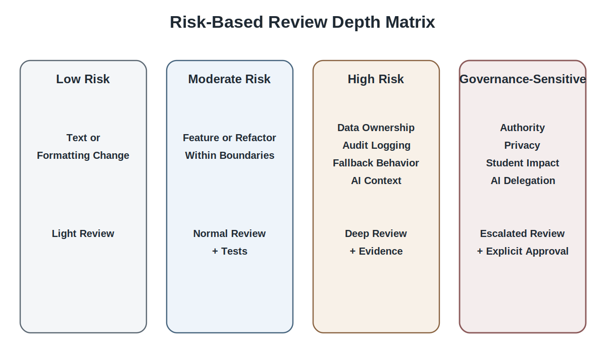

# Chapter 17 Pull Requests, Reviews, and CI/CD

## Opening Scenario: The Code Worked. The Change Was Not Yet Accepted.

The COICP team had finally reached the point where implementation work was real.

That mattered.

The team was no longer talking only about launch standards, requirements, planning, architecture, intelligent-system boundaries, or Architecture Decision Records. Those things still mattered, but now they were being tested against something more concrete: proposed changes to the system.

A developer had used AI assistance to scaffold part of the incident-summary display. Another had built a routing-recommendation helper. A third had added an audit-event capture path. Someone else had drafted tests for the notification-review workflow. The work looked promising. It ran locally. The demo path was convincing. The team could see progress.

Then the first pull request arrived.

The pull request looked professional at a glance. It had a description. It linked to a branch. It included several commits. Continuous integration ran without failure. The code was clean. The AI-generated summary component rendered correctly. The routing helper returned a recommendation. The audit log recorded an event. The notification draft appeared in the interface.

But the review conversation quickly became uncomfortable.

The pull request did not clearly link back to the issue that authorized the change. It referenced the wrong ADR. It did not state whether AI assistance had been used in the implementation or test generation. The tests confirmed that summaries displayed, but they did not confirm that summaries remained advisory rather than authoritative. The CI pipeline passed, but no automated check verified that sensitive fields were excluded from model context. The pull request description used the phrase “automated routing helper,” even though the architecture and ADRs had explicitly rejected automatic routing for student-impacting incidents. The documentation update made the feature sound more autonomous than it actually was. The AI-use log had not been updated. The review comments raised real questions, but the author treated them as style feedback rather than engineering concerns.

The problem was not that the change was obviously wrong.

The problem was that the change was not yet reviewable enough to merge responsibly.

That distinction is the center of this chapter.

Chapter 16 established that AI-assisted implementation is proposed engineering material. Proposed material may be useful. It may be well structured. It may compile. It may pass tests. It may even be mostly correct. But it is not accepted engineering work until the team has enough evidence to understand it, challenge it, verify it, trace it, and take responsibility for it.

Pull requests, reviews, and CI/CD are the routine control system that makes that acceptance possible.

A pull request is not merely a request to merge code. It is an engineering claim asking the team to accept a change into the system. A review is not approval theater. It is professional challenge. CI/CD is not a green-checkmark factory. It is automated evidence. A merge is not a clerical action. It is an accountability decision.

A trustworthy team does not ask only, “Does this code work?”

It asks, “Can this change be understood, reviewed, tested, traced, integrated, and defended?”

That is why Chapter 17 belongs here. The team has enough engineering context to begin accepting changes, but implementation momentum can now outrun evidence. The repository must become more than a place where code lands. It must become the record of why change was safe to accept.

**Repository Impact:** For COICP, the evidence for this chapter lives directly in linked issues, branches, pull request descriptions, review comments, CI/CD workflow results, test reports, ADR references, AI-use logs, and merge records. The repository is not background infrastructure in this chapter. It is the working surface of engineering judgment.

*Figure 17.1 — From Proposed Implementation to Accepted Change*

---

## 17.1 Proposed Work Becomes Accepted Change Through Review

Implementation work begins as a proposal.

That is true whether the work was written by a student, generated by an AI assistant, copied from a framework example, adapted from a tutorial, or designed by an experienced engineer. Until the team reviews it, tests it, links it to intent, checks it against constraints, and accepts it into the system, it remains proposed material.

This may sound obvious, but many teams act as if implementation becomes real the moment code exists. A developer completes a feature. A demo works. Tests pass. The team feels done. The pull request becomes a formality.

That is where drift enters.

In COICP, the proposed incident-summary change may appear simple. It renders a summary next to the original incident report. But earlier chapters established that an AI-generated summary is advisory. It must not become the authoritative incident record. That distinction is not a user-interface preference. It is an architecture and governance decision. If a pull request quietly stores generated summaries in the same data structure as official incident facts, the system has changed more than the developer may realize.

Similarly, a routing recommendation helper may appear to be a small implementation convenience. But COICP has already decided that AI may recommend routing under defined conditions and that humans remain responsible for consequential routing decisions. A helper function that automatically updates assignment status crosses an authority boundary. It is not merely code. It is governance movement.

This is why proposed work must pass through review.

Review does not exist to slow developers down. It exists to preserve the system’s memory, constraints, and accountability when implementation pressure increases. Review asks whether the change satisfies the issue, respects requirements, follows architecture, honors ADRs, includes meaningful tests, discloses material AI assistance, and leaves enough evidence for future engineers to reconstruct why the change was accepted.

The pull request is the container for that conversation.

A well-formed pull request gathers the evidence needed to decide whether proposed work can become accepted change. It connects issue intent to implementation. It connects architecture decisions to code. It connects test results to behavior. It connects review comments to risk. It connects CI/CD evidence to repeatable checks. It connects AI-use disclosure to verification responsibility. It connects the merge decision to accountable acceptance.

**Repository Location:** In the COICP repository, this acceptance path should be visible across `/issues/`, feature branches, pull request records, `/docs/adr/`, `/tests/`, CI/CD workflow results, `/docs/ai/ai-use-log.md`, and `/docs/reviews/`. Exact paths may vary, but the evidence chain must be discoverable.

The professional shift is simple: a developer does not throw code over the wall. A developer offers an evidence-backed change for review.

That shift prepares the next question: what exactly is a pull request claiming?

---

## 17.2 Pull Requests as Engineering Claims

A pull request is an engineering claim.

It says: this scoped change should be accepted into the system.

That claim has consequences. If the pull request is merged, the system changes. Future developers build on it. Tests assume it. Documentation describes it. Release notes may include it. Operational behavior may depend on it. Stakeholders may experience it. Later incidents may trace back to it.

A weak pull request treats the PR description as a placeholder: “Added routing helper,” “Fixed summary,” “Updated tests,” or “Implemented issue.” That may be enough for a private experiment, but it is not enough for trustworthy engineering.

A strong pull request explains the claim.

For COICP, a strong pull request for advisory AI summaries should answer several questions. What issue does this address? Which requirement or acceptance criterion does it implement? Which ADR constrains it? Does the change preserve the original incident record as authoritative? Does it keep AI-generated summaries advisory? Does it exclude sensitive fields from model context? What tests were added? What CI/CD checks ran? Was AI assistance used to generate code, tests, documentation, or review notes? What risks remain? What should reviewers focus on?

These questions are not bureaucracy. They are how the repository remembers why a change was acceptable.

**Repository Impact:** The pull request description should function as an evidence index. It should point reviewers to the linked issue, relevant requirements, relevant ADRs, key files changed, test evidence, AI-use notes, and known limitations. The PR does not need to duplicate every artifact, but it must make the evidence findable.

A pull request is strongest when it is intentionally reviewable. Scope is what makes reviewability possible.

Reviewers cannot responsibly evaluate a claim they cannot hold in their heads. A pull request that changes routing logic, notification behavior, database schema, AI context handling, documentation, and CI/CD configuration simultaneously may contain valuable work, but it becomes difficult to understand, challenge, and verify as a coherent engineering claim.

In a professional repository, a pull request should usually have one primary purpose. It may affect multiple files and artifacts, but the purpose should remain clear enough that reviewers can explain what changed, why it changed, what evidence supports it, and what risks remain. Reviewability is not administrative neatness. It is a prerequisite for accountable acceptance.

A pull request also makes ownership visible. The author owns the proposed change. Reviewers own the quality of their review. The team owns the merge decision. If AI assistance contributed materially, the human author still owns the accepted result.

That last point matters. AI can generate a polished PR summary. It can generate code comments. It can generate tests. It can even propose explanations that sound confident. But the PR claim belongs to the engineer submitting it. The model does not own the change. The engineer does.

A useful pull request description for COICP might include:

- linked issue: advisory summary display for intake coordinators;
- relevant ADR: AI-generated summaries remain advisory;
- implementation summary: display summary in a separate review panel without modifying the authoritative incident record;
- test evidence: unit tests for summary display, scenario test confirming original record remains unchanged;
- AI-use note: AI assistance used to scaffold component and initial tests; engineer revised tests for ADR coverage;
- reviewer focus: confirm data separation, summary status labeling, and no routing side effects;
- known limitation: summary confidence display deferred to a later issue.

That description does not turn the chapter into a GitHub tutorial. It teaches the habit of evidence-centered change.

A pull request is not a merge request; it is an engineering claim asking to be accepted.

The next discipline is ensuring that the claim begins with issue-linked intent.

---

## 17.3 Issue-Linked Change Discipline

Responsible pull requests begin before code.

They begin with intent.

An issue defines what problem the change is supposed to address, why it matters, what acceptance criteria apply, what constraints exist, and what evidence will be needed. Without that issue-level intent, a pull request becomes difficult to judge. Reviewers may see what changed, but not why the change exists or how to decide whether it is enough.

In COICP, a developer should not open a pull request titled “AI routing updates” without a clear issue behind it. That title is too broad. Does the change add a recommendation label? Does it change routing logic? Does it modify context inputs? Does it adjust fallback behavior? Does it add audit evidence? Does it alter human approval? Each of those has different review implications.

Issue-linked discipline creates a chain:

issue intent -> branch -> commits -> pull request -> tests -> CI/CD -> review comments -> merge decision -> later release evidence.

That chain is the backbone of repository-centered engineering.

*Figure 17.2 — The Pull Request Evidence Chain*

The issue does not need to be long, but it must be useful. A COICP issue for advisory routing recommendations should identify the user need, the expected behavior, the relevant ADR, the boundary that AI cannot assign ownership, the test cases that matter, and any known governance concerns. The branch then isolates work related to that issue. The pull request then explains how the implementation satisfies the issue. Tests verify expected behavior. CI/CD provides automated evidence. Review comments challenge the claim. The merge record preserves acceptance.

**Repository Location:** A typical COICP evidence path may include `/issues/COICP-147-advisory-routing-recommendation.md`, a feature branch such as `feature/coicp-147-advisory-routing`, a pull request linked to that issue, tests under `/tests/routing/`, ADR references under `/docs/adr/`, AI-use notes in `/docs/ai/ai-use-log.md`, and CI/CD results from the repository workflow history.

The exact naming convention is less important than the traceability. Future engineers should be able to move from the merged code back to the pull request, from the pull request back to the issue, from the issue back to requirements and ADRs, and from the review discussion back to the risks that were considered.

This is especially important when AI assistance is involved. AI-generated implementation can appear coherent even when it is disconnected from the issue that authorized the work. A model may add extra behavior because it seems useful. It may create new dependencies. It may infer workflow steps that were never approved. It may write tests that confirm its own assumptions instead of the issue’s acceptance criteria.

Issue linkage helps constrain that drift.

When a reviewer asks, “Where did this behavior come from?” the answer should not be, “The model generated it.” The answer should be traceable to an issue, requirement, ADR, or reviewed design decision. If the behavior cannot be traced, it should not quietly enter the system.

Issue-linked change discipline also prepares the team for later release readiness. A release is easier to defend when every accepted change has a visible origin, review history, test record, and merge decision. Release evidence is not created at the end. It accumulates through disciplined change control.

That chain makes review possible. But review must be more than politeness.

---

## 17.4 Review Is Professional Challenge

Review is how teams think together before accepting change.

A weak review asks whether the code looks acceptable. A stronger review asks whether the change should become part of the system.

Those are different questions.

Code style matters. Readability matters. Naming matters. Simplicity matters. But professional review cannot stop there. A reviewer must challenge the engineering claim. Does the change satisfy the issue? Does it preserve the architecture? Does it respect ADRs? Does it include sufficient tests? Does it alter authority? Does it expose data? Does it weaken fallback? Does it create audit evidence? Does it affect operations? Does AI assistance create additional verification burden?

In COICP, a reviewer looking at the advisory summary pull request should not merely ask whether the component renders correctly. The reviewer should ask whether the original incident record remains authoritative. They should ask whether summary text is visually labeled as advisory. They should ask whether summary generation uses only allowed context. They should ask whether the audit trail records summary generation and human review. They should ask whether tests would fail if a future change stored the summary as an official fact.

*Figure 17.3 — Review as Professional Challenge*

Review is not hostility. It is not gatekeeping for ego. It is not catching someone out. It is disciplined care for the system and the people affected by it.

Good review comments are specific, evidence-oriented, and tied to risk. A weak comment says, “This seems wrong.” A stronger comment says, “ADR-0002 states that AI-generated summaries are advisory and must not replace the incident record. This change stores the generated summary in the same persistence object as official incident facts. Please separate advisory summary storage or explain why this does not change source-of-truth behavior.”

That comment does several things. It identifies the evidence. It names the risk. It explains the concern. It asks for correction or justification. It preserves the reasoning in the repository.

**Repository Impact:** Review comments are engineering memory. Pull request discussion should preserve the questions reviewers asked, the risks they identified, the changes made in response, and the rationale for acceptance. Future maintainers may rely on that discussion when deciding whether a later change is safe.

Reviewers should also look for missing evidence. A pull request may include code but no meaningful tests. It may include tests but no connection to the ADR. It may include AI-generated documentation that overstates what the feature does. It may include CI/CD success but no scenario coverage. It may include a clean implementation but no AI-use disclosure for generated logic.

A professional reviewer asks for the missing evidence before merge.

Review also distributes knowledge. When only the author understands a change, the team is fragile. Review forces the change to be explained. It creates shared understanding. It exposes assumptions. It makes ownership visible.

This is especially important for student teams. Students often treat review as a grading hurdle or a courtesy approval. Professional engineering treats review as a control mechanism. The goal is not to make review feel ceremonial. The goal is to make unreviewed change feel professionally unsafe.

Once AI assistance enters the change, the review burden changes again.

---

## 17.5 Reviewing AI-Assisted Changes

AI-assisted changes require review context.

That does not mean every prompt, keystroke, or autocomplete suggestion must be logged. That would be surveillance theater, and it would bury meaningful evidence under noise. The goal is not to police trivial assistance. The goal is to preserve evidence that materially affects engineering decisions, implementation, review, testing, or operational behavior.

But when AI assistance materially affects implementation, tests, documentation, architecture-sensitive code, governance-sensitive behavior, or review explanations, reviewers need to know enough to evaluate the work responsibly.

In COICP, AI assistance is material if it generated or substantially shaped routing logic, summary behavior, context filtering, notification workflows, audit events, security-sensitive code, tests for governance boundaries, or documentation describing system authority. Reviewers need to know where generated material influenced the change and how the human engineer verified it.

**Repository Location:** Significant AI assistance should be visible through the pull request description, relevant review comments, and `/docs/ai/ai-use-log.md`. The AI-use log should not become a diary. It should preserve consequential assistance, verification steps, human revisions, limitations, and links to issues, PRs, tests, and ADRs.

A useful AI-use note in a COICP pull request might say:

AI assistance was used to scaffold the summary display component and initial unit tests. The generated code was revised to keep advisory summaries separate from the authoritative incident record. Tests were expanded to verify that the original incident fields remain unchanged. No generated routing behavior was accepted. Relevant ADR: ADR-0002, AI-generated summaries are advisory.

That note gives reviewers context. It does not ask them to trust the model. It tells them where to look.

Reviewing AI-assisted changes also means reviewing generated tests. AI can produce tests that look impressive but confirm shallow behavior. A generated test may verify that a summary appears on screen, but not that the summary is labeled advisory. It may verify that a routing recommendation exists, but not that a human approval gate remains required. It may verify that a notification draft is created, but not that it cannot be sent without review.

Generated tests are proposed test material. They require review.

AI-generated documentation also requires review. Documentation may sound polished while misrepresenting the actual system. In COICP, documentation that says “the system routes incidents automatically” would violate the architecture even if the implementation only recommends routing. A reviewer must challenge both code and explanation because future users, students, reviewers, and maintainers may rely on that documentation.

AI-generated PR summaries deserve the same caution. A model can summarize changes cleanly while omitting risk. It can say “adds routing automation” because that sounds natural, even when automation is not approved. The author must verify the summary before submitting it as the PR claim.

The chapter’s position is not anti-AI. AI assistance can be extremely useful in implementation, tests, documentation, and review preparation. But the stronger the assistant becomes, the stronger the evidence discipline must be.

AI-assisted work should be visible enough for responsible review.

The next evidence layer is automation: CI/CD.

---

## 17.6 CI/CD as Automated Evidence

CI/CD is automated evidence.

It is not proof.

Continuous integration and continuous delivery practices can run tests, build the system, check formatting, scan dependencies, validate documentation, enforce branch rules, run static analysis, generate coverage reports, package artifacts, and prepare deployment workflows. These checks matter. They make some forms of evidence repeatable. They reduce dependence on memory. They catch regressions earlier. They help teams integrate work without relying entirely on manual review.

But a green pipeline does not mean the change is trustworthy.

It means the defined checks passed.

That distinction is crucial.

*Figure 17.4 — CI/CD as Automated Evidence, Not Proof*

In COICP, a CI workflow might run unit tests, backend integration tests, frontend build checks, linting, and documentation validation. All of those may pass while the change still violates an ADR. The tests may not cover the advisory status of summaries. The pipeline may not know that sensitive context fields must be excluded from AI input. The build may succeed even if the PR description misstates the authority boundary. A static check may not understand that a routing helper name implies automation.

CI/CD can only evaluate the checks the team has chosen to automate.

That limitation is not a weakness. It is an important reminder about the nature of evidence. Automation can confirm defined conditions. It cannot automatically discover every condition that should matter.

That does not make CI/CD weak. It makes it honest.

**Repository Location:** CI/CD evidence may live in workflow definitions such as `.github/workflows/ci.yml`, test reports under `/tests/` or generated artifacts, build logs attached to workflow runs, coverage reports, dependency scan results, and status checks linked to the pull request.

A mature COICP pull request does not say merely, “CI passed.” It explains which checks passed and what they mean. For example: backend unit tests passed; frontend build passed; routing scenario tests passed; advisory summary regression test passed; context-filtering test passed. If a check does not exist yet, the PR should not pretend that CI has proven more than it has.

CI/CD also supports team discipline. It reduces the chance that work merges with broken builds. It makes repeated checks cheap. It creates a shared baseline. It supports review by giving reviewers evidence before they spend time on deeper judgment. It helps prevent avoidable defects from consuming human attention.

But automation should not become theater.

Green-check theater happens when teams treat pipeline success as sufficient evidence for merge. Test theater happens when pipelines run tests that do not address meaningful risk. CI/CD cargo culting happens when workflows exist because professional repositories are “supposed” to have them, but the checks do not connect to the system’s trustworthiness needs.

A serious CI/CD pipeline is built from risk. It checks what matters. It evolves as the system matures. It reflects requirements, architecture, ADRs, security expectations, AI-governance boundaries, and release-readiness needs.

CI/CD strengthens review, but it does not replace reviewers.

The next section makes that boundary explicit.

---

## 17.7 What CI/CD Cannot Know

Automation cannot understand everything that matters.

A pipeline can run a test. It cannot decide whether the test suite is sufficient. It can enforce formatting. It cannot decide whether the design preserves institutional accountability. It can check that a build succeeds. It cannot know whether a feature description misleads stakeholders. It can scan dependencies. It cannot fully understand the governance consequences of a new authority path.

This is not a limitation to be embarrassed about. It is a boundary to design around.

In COICP, CI/CD can run a test confirming that an AI summary is displayed in a separate field. But the pipeline may not know why that separation matters. It may not know that institutional truth depends on preserving the original incident record as authoritative. It may not know that an apparently harmless refactor collapses advisory and official data concepts. It may not know that a newly generated test misses a student-impacting edge case.

Human reviewers bring context, judgment, and accountability.

That is why CI/CD and review must work together. Automation handles repeatable checks. Humans interpret sufficiency, risk, meaning, and consequence. The repository preserves both forms of evidence.

**Repository Impact:** A responsible PR should make the boundary visible. It should distinguish automated evidence from human judgment. CI/CD status checks show what ran. Review comments and approvals show how humans interpreted the evidence, challenged risks, and accepted or rejected the change.

CI/CD also cannot determine whether AI assistance was appropriate. A workflow may check test coverage, but it may not know that tests were generated from a flawed assumption. It may not know that documentation was AI-written and subtly inaccurate. It may not know that a generated implementation obeys syntax while violating an ADR.

This is where the phrase “AI proposes; engineers verify” meets the phrase “CI/CD produces evidence, not certainty.”

The team should use automation aggressively where it helps. But the team must not outsource judgment to the pipeline.

A passing build is not a trustworthy change.

The question becomes: who decides when the evidence is enough?

---

## 17.8 Merge Decisions as Accountability

A merge decision is an accountability decision.

When a pull request is merged, the proposed change becomes part of the system’s accepted history. The repository records that the team accepted the change at that point, with that evidence, after that review, under those constraints.

That decision matters even in a student project. It matters more in enterprise systems. A merge can introduce defects, weaken architecture, bypass governance, distort documentation, or create future operational risk. It can also strengthen the system by preserving a well-reviewed, well-tested, well-evidenced improvement.

Merging should therefore require more than comfort.

Before merging a COICP pull request, the team should be able to answer:

- Is the issue clear and linked?
- Is the PR scoped?
- Are relevant requirements and ADRs visible?
- Does the implementation respect architecture and authority boundaries?
- Are tests meaningful for the risk?
- Did CI/CD checks pass?
- Were review comments addressed?
- Was material AI assistance disclosed and verified?
- Are limitations or deferred work documented?
- Is the team willing to own this change?

**Repository Location:** Merge accountability is preserved in the pull request approval history, review-comment resolution, CI/CD status checks, merge commit, linked issue closure, and later release evidence. If the change affects release behavior, the PR should also be easy to reference from `/release-evidence/` or release notes.

Some teams weaken accountability by making merge decisions implicit. A reviewer approves because someone asked. A lead merges because CI passed. A developer merges their own PR because the change seems small. A team rushes because the demo is soon. Those habits teach students that integration is clerical.

Mature engineering teaches the opposite.

Integration is professional acceptance.

Risk should influence merge authority. A low-risk documentation typo may not require deep review. A change to AI context filtering, routing authority, audit logging, security permissions, database schema, or CI/CD deployment workflow requires more deliberate acceptance. The team should know who can approve what kinds of changes and what evidence is required.

Merge discipline also protects future maintainers. When a future engineer asks why a change entered the system, the repository should answer. The answer may not be perfect, but it should be reconstructable.

This is one of the strongest reasons not to squash away important decision memory casually. Squashing commits may be appropriate in some workflows, but review discussion, PR rationale, issue links, and merge records must remain accessible. The point is not to preserve noise. The point is to preserve the evidence needed to understand accepted change.

Merge decisions close the immediate PR, but the review conversation remains valuable.

---

## 17.9 Review Comments as Engineering Memory

Review comments are not disposable chatter.

They are part of the system’s engineering memory.

A good review comment can preserve why a name changed, why a boundary was enforced, why an alternative was rejected, why a test was added, why a risk was accepted, or why a future issue was created. In an AI-assisted environment, review comments may also preserve where generated material was corrected, constrained, or rejected.

In COICP, a reviewer might comment that a class named `AutoRouter` violates the accepted authority model because it implies automatic routing. The team may rename it `RoutingRecommendationService`. That may look like a naming issue, but it is actually a governance issue. The review comment preserves the reason: the system recommends; humans assign responsibility.

Another reviewer might notice that an AI-generated test confirms a notification draft exists but does not verify that the draft cannot be sent without human approval. The author adds a test. The review comment preserves the gap and the correction.

A third reviewer might ask whether summary text is being saved in the official incident record. The author explains that it is stored separately and adds a regression test. The review thread becomes future evidence of source-of-truth protection.

**Repository Impact:** Pull request discussions should be treated as evidence when they contain architectural reasoning, ADR interpretation, AI-use verification, test sufficiency decisions, risk acceptance, or merge rationale. If a review discussion reveals a consequential decision, the team may need to update an ADR, issue, or review record rather than leave the decision only inside the PR thread.

Review memory must be usable. Reviewers should avoid vague comments that future readers cannot interpret. “Fix this,” “bad,” “wrong,” or “seems weird” may express concern, but they do not preserve engineering reasoning. Better comments identify the claim, evidence, risk, and requested action.

Review comments also teach team culture. A team that treats comments as personal criticism will avoid hard questions. A team that treats comments as engineering memory will become more capable. The goal is not to win arguments. The goal is to improve the change before the system accepts it.

This is where communication, review, and accountability from Chapter 7 return in operational form. Review is team communication under evidence discipline.

Not every pull request needs the same depth of review. The next section defines proportional review.

---

## 17.10 Integration Risk and Review Depth

Review depth should match risk.

A team that reviews every change with the same intensity will eventually fail. If every minor wording update requires architectural review, the process becomes noise. If every authority-sensitive AI change receives casual approval, the system becomes dangerous. Professional judgment lives between those extremes.

The question is not, “Do we review?”

The question is, “How deep should review be for this change?”

Low-risk changes may need light review: small documentation corrections, minor formatting fixes, nonfunctional cleanup, or narrowly scoped UI text changes. Moderate-risk changes may need normal review: feature updates, component changes, new tests, or ordinary refactoring within established boundaries. High-risk changes need deeper review: authentication, authorization, data ownership, AI context handling, audit logging, fallback behavior, routing authority, release workflows, schema changes, or changes that cross architectural boundaries.

Governance-sensitive changes need the deepest review. These include changes that affect institutional authority, student-impacting workflows, privacy, safety, AI delegation, human approval, auditability, or operational recovery.

*Figure 17.5 — Risk-Based Review Depth Matrix*

For COICP, changing the label on a button from “Create Draft” to “Prepare Draft” may require light review. Changing the notification workflow so drafts can be sent without approval requires deep review. Adding a test for summary display is useful, but changing where summaries are stored may affect source-of-truth governance. Refactoring routing code may be ordinary if behavior is preserved, but dangerous if it changes who can assign responsibility.

**Repository Impact:** Review depth should be visible in the PR. High-risk changes should include stronger evidence: relevant ADR links, targeted tests, CI/CD results, AI-use disclosure, security or privacy notes, review focus areas, and explicit limitation statements. The PR record should make it clear why the review was deep enough.

AI assistance can increase review depth. Not because AI is automatically unsafe, but because generated output may be plausible while hiding assumptions. AI-generated code touching authority, privacy, routing, audit, fallback, or tests should trigger closer review.

Review depth should also consider reviewer capacity. Large PRs create overload. Reviewers miss things when too much changes at once. If a PR is too large to review responsibly, the correct response may be to split it. That is not process obsession. It is risk control.

Risk-based review prepares students for professional judgment. They learn that maturity is not maximum process everywhere. Maturity is appropriate control where trust depends on it.

When teams ignore this discipline, they fall into the chapter’s primary failure pattern.

---

## 17.11 Failure Pattern: Merge-by-Confidence

The primary anti-pattern of this chapter is merge-by-confidence.

Merge-by-confidence happens when a team accepts a change because it feels safe rather than because the evidence is sufficient.

The code looks clean. The author is trusted. The demo worked. The AI assistant produced a convincing implementation. The tests passed. CI is green. The deadline is close. The change seems small. The reviewer is tired. Everyone assumes someone else checked the important part.

So the team merges.

That is how drift enters quietly.

In COICP, merge-by-confidence might allow an AI-generated summary to become part of the official incident record. It might allow routing recommendations to update assignment status automatically. It might allow sensitive fields to enter model context. It might allow notification drafts to be sent without review. It might allow documentation to describe the system as more autonomous than it is. It might allow generated tests to create false confidence.

None of those failures require bad intent. They require weak evidence discipline.

Merge-by-confidence is dangerous because it often looks professional. The PR exists. The build passes. Review approval appears. The repository records activity. But activity is not evidence. Approval is not challenge. A green check is not judgment. A merge is not proof.

Secondary anti-patterns cluster around merge-by-confidence:

- Review theater: approvals without meaningful challenge.
- Green-check theater: treating CI success as enough.
- Thin PRs: descriptions that hide intent, constraints, and risk.
- Hidden AI assistance: generated material without review context.
- ADR bypass: implementation contradicts accepted decisions.
- Issue-free changes: code with no clear intent.
- Test theater: tests that exist but do not address meaningful risk.
- Reviewer overload: changes too large to inspect responsibly.
- Rubber-stamp approval: social approval replacing engineering review.
- Merge now, document later: evidence deferred until it is forgotten.
- Squashed decision memory: review rationale made hard to reconstruct.
- CI/CD cargo culting: workflows present but not meaningful.
- AI-generated PR summaries that hide risk.

**Repository Impact:** The antidote is not more paperwork. The antidote is better evidence at the point of change: issue links, scoped PRs, review comments, ADR references, meaningful tests, CI/CD results, AI-use notes, and accountable merge decisions.

Trustworthy engineering counters merge-by-confidence by making acceptance visible. The team should be able to say why the change was accepted and where the evidence lives.

This failure pattern marks LMU’s next maturity movement.

---

## 17.12 LMU Evolution: From AI-Assisted Implementation to Change-Control Discipline

By the beginning of Chapter 17, LMU has reached a disciplined but fragile point.

COICP has requirements evidence. It has launch standards. It has repository doctrine. It has planning and risk evidence. It has architecture. It has intelligent-system boundaries. It has ADRs. It has AI-assisted implementation discipline. But the system is not yet released, and implementation work is now arriving fast enough that the team can lose control if acceptance remains informal.

Chapter 17 moves LMU from implementation discipline to change-control discipline.

That movement is practical. Work must now be issue-linked. Branches must isolate change. Pull requests must organize evidence. Reviews must challenge claims. CI/CD must produce automated checks. AI-use evidence must be visible where material. Merge decisions must be accountable. Repository history must become useful memory rather than a stream of activity.

**Repository Evolution:** COICP’s repository now matures from a place that stores requirements, architecture, ADRs, and AI-use expectations into a working change-control environment. The repository begins preserving how accepted implementation enters the system.

The organizational pressure is real. LMU stakeholders want progress. Students want to show working features. Developers want to move quickly. AI assistance makes it easy to produce more code, tests, and documentation than the team can review deeply. The review process can feel like drag.

But this is exactly where professional engineering matters.

The governance pressure is also real. COICP touches student-impacting incidents, institutional responsibility, department coordination, privacy-sensitive context, and audit expectations. A casual merge can change the meaning of the system. A weak PR can hide risk. A shallow review can allow AI-assisted drift. A green CI run can create false confidence.

The chapter does not make LMU operationally mature yet. COICP remains pre-release. It is not yet fully tested, released, observed, or operated. But it becomes more reviewable and integrable. Later chapters can now inherit a repository record that explains how changes entered the system.

This prepares the path to reviewing AI-generated systems more deeply.

---

## 17.13 Operational Takeaways

Pull requests, reviews, and CI/CD are not side procedures around the “real” work.

They are part of the real work.

A pull request is an engineering claim asking to be accepted. A review is professional challenge. CI/CD is automated evidence. A merge decision is accountable acceptance. Repository history is engineering memory.

The most important lessons are these:

A proposed change is not accepted work until it has been reviewed, tested, traced, and integrated responsibly.

A pull request should explain the issue, implementation, constraints, tests, AI-use context, risks, and reviewer focus.

Issue-linked change discipline preserves intent.

Review should challenge correctness, scope, architecture, ADR alignment, tests, AI-use transparency, security, privacy, governance, fallback, and operational consequence.

AI-assisted changes require enough disclosure for responsible review, not surveillance theater.

CI/CD checks are evidence, not proof.

A passing build does not replace engineering judgment.

Merge decisions accept responsibility for change.

Review comments preserve engineering memory.

Review depth should match risk.

Merge-by-confidence is professionally unsafe.

Everything important leaves evidence.

**Repository Impact:** For Chapter 17, “evidence” means concrete repository records: linked issues, pull requests, review comments, CI/CD results, test reports, ADR references, AI-use logs, merge records, and later release evidence. If the repository cannot reconstruct why a change was accepted, the team has not preserved enough engineering memory.

These takeaways prepare the exercises.

---

## 17.14 Exercises

### Exercise 1: Rewrite a Weak Pull Request

Create the repository artifact:

`/docs/reviews/pull_request_review_example.md`

You are given a pull-request description that states only:

> Fixed routing issue and updated tests.

Rewrite the pull-request description as an evidence-centered engineering artifact.

Include:

- Linked issue
- Relevant requirements
- Applicable ADRs
- Implementation summary
- Test evidence
- Material AI assistance (if any)
- Reviewer focus areas
- Known limitations

Evaluate whether the revised pull request provides sufficient evidence for review.

### Exercise 2: Trace a Change Through the Evidence Chain

Create the repository artifact:

`/docs/reviews/change_evidence_chain_record.md`

Using the COICP scenario, trace a change from:

- Issue creation
- Branch development
- Pull-request submission
- Test execution
- CI/CD results
- Review comments
- Approval
- Merge

Identify:

- Strong evidence
- Missing evidence
- Weak evidence
- Questions a future maintainer might ask

Evaluate whether the change can be reconstructed from repository evidence alone.

### Exercise 3: Review an AI-Assisted Pull Request for ADR Compliance

Create the repository artifact:

`/docs/reviews/adr_compliance_review_record.md`

Review an AI-assisted pull request that appears technically correct but violates an approved ADR.

Document:

- ADR violation
- Review comments
- Additional evidence required
- Additional tests required
- Documentation updates required

Determine whether the pull request should be:

- Approved
- Revised
- Escalated
- Rejected

Justify the decision using repository evidence.

### Exercise 4: Evaluate CI/CD Evidence for a Governance-Sensitive Change

Create the repository artifact:

`/docs/reviews/cicd_evidence_evaluation_record.md`

A pull request passes all CI/CD checks but modifies routing authority within COICP.

Evaluate:

- What the CI/CD evidence demonstrates
- What the CI/CD evidence does not demonstrate
- Additional evidence required
- Additional testing required
- Additional review required

Explain why successful automation is not equivalent to governance approval.

### Exercise 5: Classify Changes Using Risk-Based Review Depth

Create the repository artifact:

`/docs/reviews/risk_based_review_matrix.md`

Classify the following changes as:

- Low Risk
- Moderate Risk
- High Risk
- Governance-Sensitive

Changes:

- User-interface wording change
- New notification template
- AI-assisted routing recommendation update
- Audit-logging modification
- Privacy-sensitive context-handling change
- Architecture refactoring affecting multiple services

For each classification, identify:

- Required review depth
- Required evidence
- Required approvals
- Escalation expectations

Explain why review effort should be proportional to risk.

### Exercise 6: Write Professional Review Comments

Create the repository artifact:

`/docs/reviews/professional_review_comment_examples.md`

Review a pull request that introduces a new AI-assisted incident-summary feature.

Write review comments that:

- Challenge assumptions
- Request evidence
- Identify risks
- Clarify requirements
- Preserve professional communication

Comments should be:

- Specific
- Evidence-linked
- Actionable
- Non-adversarial

Evaluate whether the comments improve engineering quality without creating unnecessary friction.

### Exercise 7: Create an AI-Use Log Entry

Create the repository artifact:

`/docs/ai/ai_use_log.md`

Write an AI-use log entry for a consequential AI-assisted implementation activity.

Include:

- Issue reference
- Related ADRs
- Description of AI assistance
- Engineer verification
- Tests added or updated
- Known limitations
- Reviewer notes
- Final disposition

Determine whether the entry provides sufficient evidence for future review.

### Exercise 8: Defend a Merge Decision

Create the repository artifact:

`/docs/governance/reviews/merge_decision_record.md`

Evaluate:

- Issue scope
- Requirements alignment
- ADR compliance
- Test evidence
- CI/CD results
- Review comments
- AI-use evidence
- Remaining risks

Determine whether the change should be:

- Merged
- Revised
- Escalated for additional review
- Rejected

Document:

- Decision rationale
- Evidence used
- Open risks
- Owner assignments
- Follow-up actions

Defend the decision using repository evidence rather than opinion.

---

## 17.15 Closing: From Accepted Change to Reviewing AI-Generated Systems

By the end of Chapter 17, COICP has not solved every problem.

That is important.

The team now has a stronger change-control discipline. It knows that proposed implementation must move through issue-linked work, pull requests, human review, CI/CD evidence, test evidence, AI-use context, and accountable merge decisions. It understands that repository history must explain why changes were accepted. It knows that green checks are evidence, not certainty. It knows that AI-assisted work needs review context. It knows that merge-by-confidence is unsafe.

But the next problem is harder.

A pull request can organize evidence around a change. A reviewer can inspect code. CI/CD can run tests. The repository can preserve discussion. Those controls are necessary. They are not always sufficient.

AI-generated systems can create review problems that ordinary code review does not fully expose.

Generated code may be locally correct while remaining globally misaligned with architecture, governance expectations, operational reality, or institutional responsibility. Generated tests may confirm expected behavior while failing to challenge important assumptions. Generated documentation may sound authoritative while obscuring uncertainty. Intelligent workflows may behave differently under edge conditions, ambiguous inputs, changing context, or operational pressure than they do during routine demonstrations.

None of this makes traditional review obsolete.

It makes traditional review incomplete.

Pull requests, review comments, CI/CD evidence, tests, issue linkage, ADR compliance, and merge discipline remain essential. But intelligent systems often require additional forms of scrutiny: evaluation, adversarial testing, behavioral analysis, human-oversight validation, scenario review, and examination of model influence beyond the code itself.

That is the handoff to Chapter 18.

Chapter 17 established how trustworthy teams accept changes. Chapter 18 asks a more difficult question: how do trustworthy teams review systems whose behavior may be shaped by generated code, probabilistic outputs, context dependence, delegated judgment, and AI-assisted decision support?

The next challenge is no longer simply reviewing code.

It is reviewing intelligence inside a governed engineering system.
