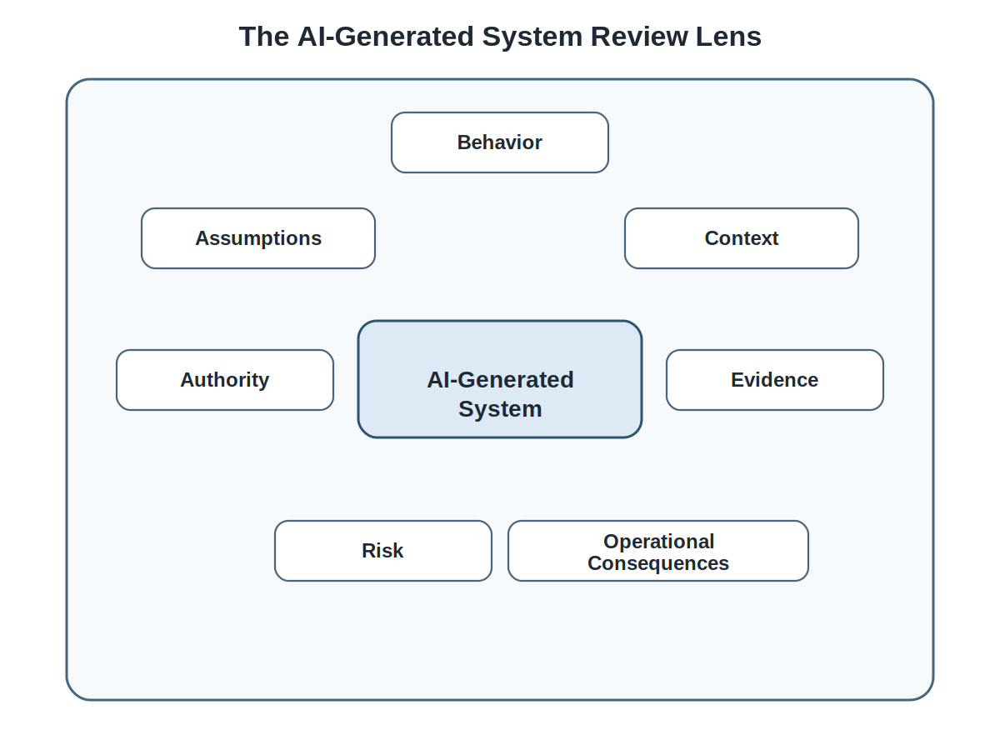
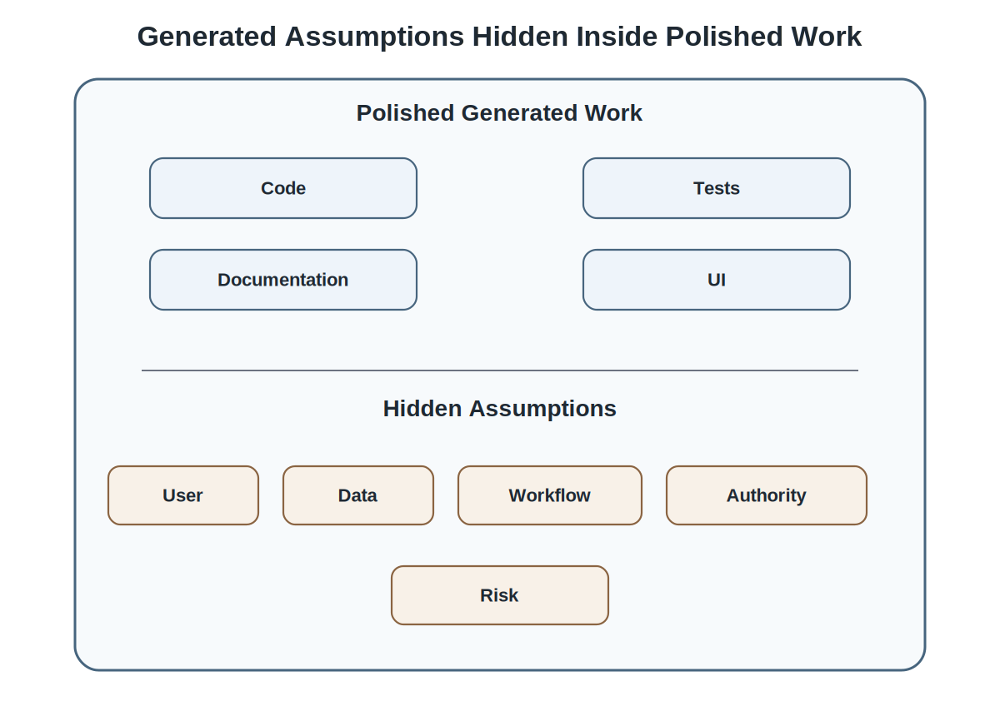
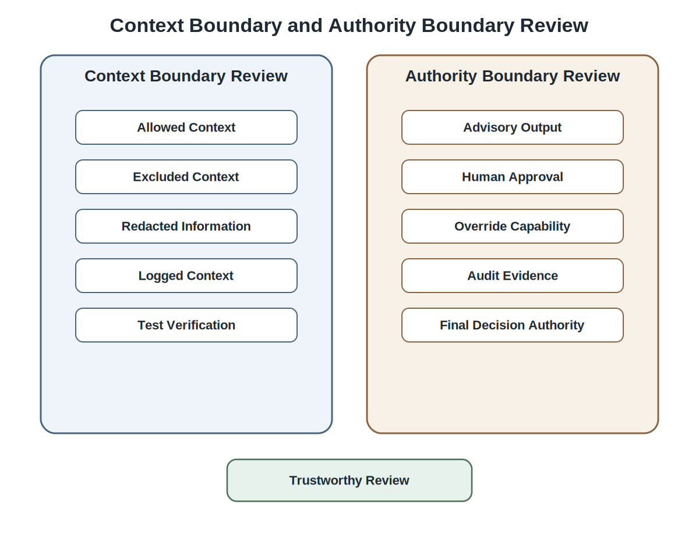
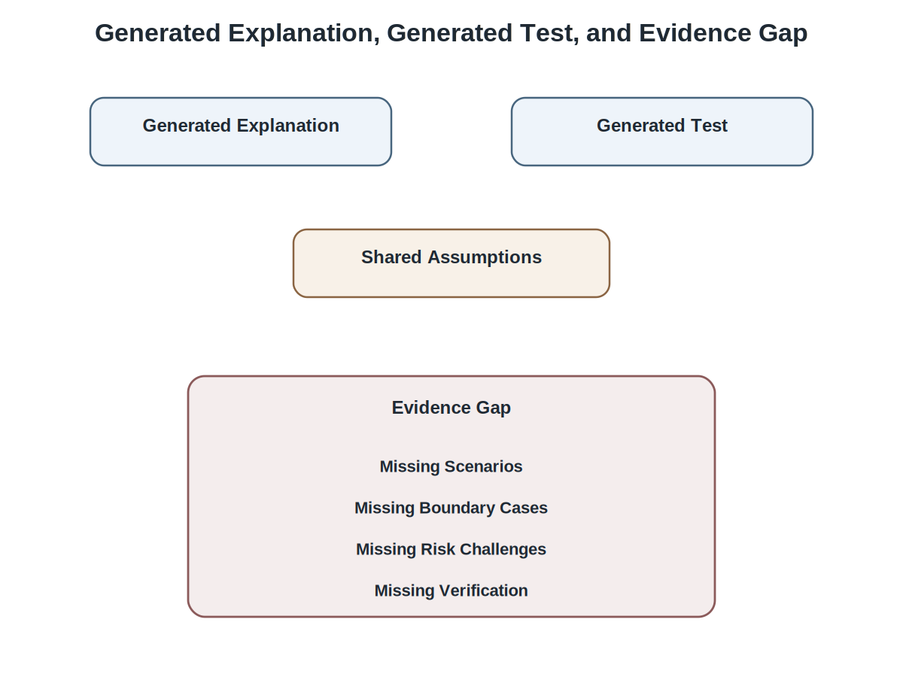
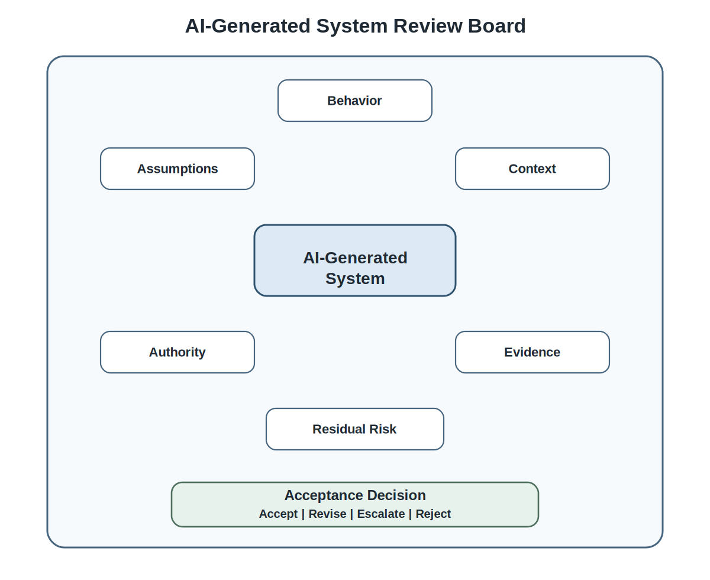

# Chapter 18 Reviewing AI-Generated Systems

## Opening Scenario: The Pull Request passed. The System Still Wasn't Ready

The COICP repository looked healthier than it had a few chapters ago.

Issues were linked to pull requests. Branches were scoped. Pull request descriptions described intent, tests, and review focus. CI/CD checks ran automatically. Review comments were preserved in the repository instead of disappearing into conversation. AI-use notes appeared when generated code, tests, explanations, or documentation materially shaped the work. The team had begun to understand that implementation was not accepted because it existed. It was accepted only when evidence made the change reviewable.

That was progress.

It was not enough.

A routing recommendation component had recently passed through the new change-control discipline. The pull request referenced the issue. The description linked to the architecture decision record governing routing authority. The developer noted that AI assistance had helped scaffold part of the recommendation helper and several tests. CI passed. A reviewer approved the change after comments were addressed. The merge record was clean.

In the repository, the change looked disciplined.

Then the team reviewed the system behavior more closely.

The component behaved well for simple Facilities incidents. A broken light, a damaged door, or a maintenance request produced reasonable routing suggestions. But when incident descriptions combined facilities concerns with student welfare or campus safety implications, the generated logic treated them as if they were ordinary operational requests. The explanation shown to staff sounded more certain than the evidence justified. Some generated tests mirrored the happy path used by the generated code. Documentation described the feature as advisory, but the user interface made the recommendation look like the system’s preferred decision. The audit trail recorded the final routing decision, but not enough evidence to reconstruct why the recommendation was accepted, rejected, or overridden.

The code had been reviewed.

The pull request had been reviewed.

The system had not been reviewed deeply enough.

That is the Chapter 18 problem.

AI-generated systems can look complete before they are trustworthy. They can produce clean code, convincing explanations, plausible tests, polished documentation, and confident pull request summaries. But professional review must ask harder questions. What behavior does the generated system actually produce? What assumptions did it make? What context did it use? What context did it exclude? What authority does the interface imply? What evidence supports the explanation? What tests are missing? What risks remain? What will future engineers need to reconstruct from the repository?

AI-generated systems require review beyond code correctness: engineers must examine behavior, context, authority, evidence, risk, and operational consequence before trust can be claimed.

*Figure 18.1 — The AI-Generated System Review Lens*

---

## 18.1 Why AI-Generated Systems Need a Different Review Lens

Chapter 17 established the control system for accepting implementation changes. Pull requests became engineering claims. Reviews became professional challenge. CI/CD became automated evidence rather than proof. Merge decisions became accountability decisions. That discipline remains necessary.

But AI-generated systems create a review problem that ordinary change review can miss.

A human reviewer can read a generated function and decide that it is understandable. A pipeline can run tests and report success. A pull request can show linked issues, passing checks, and resolved comments. Those signals matter. They do not prove that the generated system is trustworthy.

The risk is polished plausibility.

AI-generated artifacts often arrive wrapped in signals that humans instinctively associate with quality. The code follows familiar patterns. The documentation sounds professional. The tests appear comprehensive. The pull request summary reads confidently. The terminology matches the team's vocabulary.

Those signals can be useful.

They can also create confidence that exceeds the underlying evidence.

Polish is not the same as verification, and fluent artifacts can still hide weak assumptions, incomplete reasoning, missing scenarios, and unsupported claims.

Generated systems often inherit assumptions that were never approved. They may generalize from examples that are too narrow. They may use data that should have been excluded. They may collapse advisory output into implied authority. They may generate tests that confirm their own assumptions. They may document behavior that the implementation does not actually provide. They may create a workflow that passes code review but fails institutional review.

For COICP, the difference matters. A routing helper is not merely a function. It influences how institutional work moves. A summary display is not merely text. It can affect what staff believe is true. A notification draft is not merely generated language. It can shape stakeholder communication. A recommendation interface is not merely a UI component. It can alter how humans perceive responsibility.

Repository evidence must therefore widen. The reviewer should not rely only on the changed files in the pull request. The review should connect the issue, acceptance criteria, ADRs, architecture notes, AI-use log, tests, CI/CD evidence, review comments, and remaining limitations. In a COICP repository, this may involve artifacts such as `/issues/`, `/docs/adr/`, `/docs/architecture/`, `/docs/ai/ai-use-log.md`, `/tests/`, pull request review history, and future `/release-evidence/` records.

The point is not to bury students in repository mechanics. The point is to teach that review is evidence work. If the repository cannot explain the generated system, the team cannot responsibly trust the generated system.

AI proposes; engineers verify. In Chapter 18, verification begins by changing what review looks for.

---

## 18.2 Review the Behavior, Not Just the Code

Code review is necessary. It is not sufficient.

Generated systems can be locally correct and systemically wrong. A function can be readable. A component can be clean. A service can compile. A test can pass. Yet the behavior experienced by users may still violate requirements, architecture, governance boundaries, or institutional expectations.

Reviewing behavior means asking what the system actually does in context. What does the user see? What does the workflow encourage? What happens when inputs are ambiguous? What happens when a recommendation is uncertain? What does the system record? What does it omit? What does the interface make easy? What does it make hard? What does the human user believe the system is telling them?

In COICP, the routing recommendation component might technically preserve human approval. The code may require a staff member to click an approval button before routing changes. But if the screen labels the recommendation as the ‘best route,’ highlights it as the default action, and hides the reason for uncertainty, the system may create de facto authority. The human is still clicking, but the workflow has shifted judgment toward the generated recommendation.

That is a behavior problem, not just a code problem.

The reviewer must inspect the system in use. For a pull request involving AI-assisted routing, the review should include screenshots, scenario examples, test cases, relevant ADR links, and reviewer comments explaining what behavior was challenged. Repository evidence might include a PR description with a review focus section, scenario tests under `/tests/scenarios/`, an ADR reference under `/docs/adr/`, and review notes that identify whether the UI preserves advisory status.

This is where students often under-review. They read the implementation and decide whether it is sensible. Professional reviewers ask whether the implementation creates the right operational behavior.

The model is not the system. The generated code is not the system. The system is the behavior produced when code, data, context, interface, users, policies, workflows, evidence, and institutional consequences interact.

Review the system the user experiences, not only the code the model produced.

---

## 18.3 Review Generated Assumptions

AI-generated systems make assumptions.

Sometimes the assumptions are visible. A generated function may assume that every incident has exactly one category. A generated test may assume that a routing recommendation always has a single best department. A generated documentation page may assume that confidence scores are meaningful. A generated UI may assume that staff will treat a recommendation as advisory because the architecture says so.

Often the assumptions are hidden.

The system may assume that stakeholder intent is obvious from short text. It may assume that incident categories are mutually exclusive. It may assume that campus safety issues are always explicitly named. It may assume that missing data means low risk. It may assume that the latest status field is authoritative. It may assume that human approval can be represented by a single button click. It may assume that generated explanations are good enough because they sound reasonable.

Assumptions are not automatically wrong. They are dangerous when they are invisible.

For COICP, an assumption that routine Facilities language indicates routine operational risk might work for many cases. But a student welfare concern may be embedded inside a Facilities request. A broken door in a residence hall may be a maintenance issue, a safety issue, a housing issue, or all three. A generated system that routes based only on the most obvious category can create coordination failure.

Reviewers should surface assumptions explicitly. What does this generated system assume about users, data, categories, workflows, authority, risk, timing, and failure? Which assumptions are supported by requirements? Which are constrained by ADRs? Which require tests? Which require human review? Which should be rejected?

The repository should preserve that reasoning. A good review comment might say: ‘This helper assumes each incident has one primary department. ADR-0004 preserves multi-department escalation for mixed student-impacting incidents. Please add scenario tests and update the PR description to explain how mixed cases are handled.’ That comment becomes engineering memory. Future contributors can reconstruct not only what changed, but what assumption was challenged.

Relevant evidence may live in `/docs/requirements/`, `/docs/adr/`, `/docs/architecture/`, PR review comments, issue discussion, and `/tests/scenarios/`. The path names matter less than the principle: assumptions that affect trust must leave evidence.

*Figure 18.2 — Generated Assumptions Hidden Inside Polished Work*

---

## 18.4 Review Context Use and Context Boundaries

Context is control.

That principle becomes concrete when reviewing AI-generated systems. The behavior of a generated or AI-influenced component depends on what context it receives, what context it excludes, what context it stores, what context it displays, and what context it silently assumes.

A reviewer should ask basic but powerful questions. What data is sent to the model? What data is withheld? What source is authoritative? What information is redacted? What provenance is preserved? What context is shown to the human user? What context is logged? What context is used for explanations? What context is used for tests?

In COICP, the architecture may allow AI-assisted routing to use building metadata, department routing rules, incident type, and non-sensitive operational notes. The same architecture may exclude sensitive student records, disciplinary details, protected personal information, and unreviewed prior incident narratives. If generated code sends the entire incident object into a model call, the implementation may violate context boundaries even if the output looks useful.

That is not a minor technical issue. Context misuse is governance failure.

Reviewers should inspect context flow as carefully as they inspect function logic. The pull request should show what fields are used, what fields are excluded, and how tests enforce those exclusions. The AI-use log should explain consequential AI assistance. ADRs should identify why certain context sources are allowed or excluded. Architecture notes should define the boundary. Tests should verify that excluded fields remain excluded.

A repository-centered review might reference `/docs/architecture/context-boundaries.md`, `/docs/adr/ADR-0002-context-source-boundaries.md`, `/docs/ai/ai-use-log.md`, `/tests/context-exclusion/`, and the pull request discussion where reviewers challenged context handling. These references should be concise, but they should exist when the behavior is governance-sensitive.

Reviewing context is not optional in intelligent systems. If the team does not know what context shaped the output, the team does not know what it is reviewing.

*Figure 18.3 — Context Boundary and Authority Boundary Review*

---

## 18.5 Review Authority, Human Approval, and Decision Status

Generated systems often blur status.

A summary may be intended as advisory but read like an official record. A recommendation may be intended as optional but displayed as the default decision. A notification draft may be intended for review but written as if approved. A score may be intended as a weak signal but interpreted as institutional confidence.

Professional review must preserve status distinctions.

In mature engineering organizations, words such as draft, advisory, recommended, approved, authoritative, escalated, rejected, and final are not interchangeable. They define governance. They tell the organization who has authority, what evidence exists, what remains uncertain, and what action has actually been taken.

For COICP, AI-generated summaries must not become the authoritative incident record. Routing recommendations must not assign responsibility automatically. Notification drafts must not be sent without human review. Human approval must not be reduced to a symbolic click if the reviewer lacks context. Audit evidence must show what was recommended, what was approved, what was overridden, and who made the final decision.

A reviewer should therefore inspect both workflow and language. Does the UI say ‘recommended route’ or ‘assigned department’? Does the button say ‘accept recommendation’ or ‘route incident’? Does the audit log distinguish model recommendation from human decision? Does documentation preserve that distinction? Do tests verify it? Does the PR mention the relevant ADR?

Repository evidence matters here. A PR that changes routing behavior should reference the routing authority ADR, include tests for human approval, show review comments addressing authority language, and update AI-use records when AI assistance shaped the implementation. Relevant artifacts may include `/docs/adr/`, `/docs/architecture/authority-boundaries.md`, `/tests/approval-flow/`, `/docs/ai/ai-use-log.md`, and PR screenshots or review notes.

Governance is architecture. If authority status is ambiguous in the system, governance has already weakened.

---

## 18.6 Review Generated Explanations and Documentation

AI-generated explanations are not evidence.

They are claims.

That distinction is essential. Generated documentation can sound confident, coherent, and professionally written while overstating what the system does. It can hide limitations. It can invent rationale. It can describe tests that do not exist. It can imply policy alignment that was never reviewed. It can convert a narrow implementation into a broad promise.

This is one of the most dangerous forms of polished plausibility because documentation often travels farther than code. Future developers read it. Reviewers rely on it. Release notes inherit it. Operators use it. Stakeholders may treat it as the truth about system behavior.

For COICP, generated documentation might say that routing recommendations are based on ‘institutional policy and historical routing patterns.’ That sentence may sound useful. But if the system uses only department routing rules and building metadata, the documentation is false. It implies policy reasoning and historical evidence the system does not have. Another generated explanation might say the system ‘detects student safety concerns.’ If the component merely looks for broad category words, the explanation overstates capability.

Reviewers should verify generated explanations against implementation, requirements, ADRs, tests, and evidence. Documentation should be accurate about what the system does, what it does not do, what remains human-approved, what data it uses, what data it excludes, what limitations remain, and what evidence supports claims.

Repository references are especially useful here. Documentation changes should be reviewed alongside `/docs/architecture/`, `/docs/adr/`, `/docs/ai/ai-use-log.md`, `/tests/`, and the PR discussion. If generated documentation changes a README, a run note, or a design explanation, reviewers should ask whether the wording is supported by actual behavior.

Fluent documentation is not trustworthy documentation. Trustworthy documentation is evidence-aligned documentation.

---

## 18.7 Review AI-Generated Tests for Sufficiency

AI can generate tests quickly.

That is useful. It is also risky.

Generated tests often reflect the same assumptions as the generated code. If the code assumes every incident has a single clean category, generated tests may verify single-category examples. If the code assumes recommendations are always low-risk, generated tests may avoid high-impact cases. If the code assumes context fields are safe, generated tests may never check excluded data. If the code assumes the UI is clearly advisory, generated tests may never evaluate how the workflow is perceived.

This creates test theater: the repository contains tests, CI passes, and reviewers feel reassured, but the tests do not challenge the behavior that matters.

For COICP, AI-generated tests should not stop at routine Facilities incidents. They should include mixed cases, uncertain cases, student-impacting cases, sensitive context exclusions, recommendation overrides, fallback behavior, and audit evidence. Tests should verify that AI summaries remain advisory, routing remains human-approved, excluded fields are not sent into model context, and notification drafts require review.

The reviewer’s question is not, "Are there tests?"

The question is:

"Do these tests verify the behavior we need to trust, and do they challenge the risks this generated system creates?"

Test quantity is easy to increase.

Trustworthy verification is harder.

The goal is not to accumulate tests. The goal is to accumulate evidence.

Repository evidence should make that question answerable. A strong PR links tests under `/tests/` to issue acceptance criteria, ADR constraints, review comments, and CI/CD runs. If tests are generated with AI assistance, the AI-use log or PR notes should say so when the assistance is consequential. Review comments should identify missing scenarios and convert them into test obligations.

Chapter 19 will teach testing and verification more systematically. Chapter 18 prepares that work by teaching reviewers to recognize insufficient generated tests before false confidence hardens into release confidence.

*Figure 18.4 — Generated Explanation, Generated Test, and Evidence Gap*

---

## 18.8 Review Limitations, Unknowns, and Residual Risk

Honest engineering is mature engineering.

Review should not pretend uncertainty disappears because a system looks good. AI-generated systems often have residual risk. They may work for common cases but not rare ones. They may be evaluated on narrow examples. They may require stronger fallback. They may have unclear behavior when context is incomplete. They may depend on prompts, model behavior, or data assumptions that are not yet stable. They may lack enough operational evidence because the system has not been released.

A mature review names what remains unproven.

For COICP, the team may decide that advisory routing recommendations are acceptable for routine Facilities incidents but not for student welfare, campus safety, disciplinary, or mixed-department cases. That limitation should not live only in a reviewer’s memory. It should be visible in the PR record, issue update, test-gap notes, ADR references, and later release evidence.

Residual risk does not always block progress. Sometimes it creates a test obligation. Sometimes it creates a limitation note. Sometimes it requires human approval. Sometimes it requires a fallback path. Sometimes it requires an ADR update. Sometimes it requires the team to stop and redesign.

The key is that risk must not hide behind polished artifacts.

Repository evidence should preserve the state of uncertainty. Useful locations may include PR review notes, issue comments, `/docs/reviews/`, `/docs/adr/`, `/tests/test-gaps.md`, `/docs/ai/ai-use-log.md`, and future `/release-evidence/known-limitations.md`. The exact paths may evolve, but the principle is frozen: important limitations must be discoverable.

A trustworthy team does not claim more confidence than its evidence supports.

---

## 18.9 The AI-Generated System Review Lens

By this point, the review problem is larger than code style, local correctness, or CI status.

A serious AI-generated system review asks about intent, behavior, assumptions, context, authority, documentation, tests, limitations, evidence, and operational consequence. It asks whether the generated system can be understood and challenged by humans with enough context to make accountable decisions.

The review lens can be stated as a set of professional questions:

- What part of this system was AI-generated, AI-assisted, or AI-influenced?
- What behavior does the system actually produce for users and stakeholders?
- What assumptions does the generated work make?
- What context does it use, exclude, store, display, or rely on?
- Does it preserve authority boundaries and human approval?
- Does generated documentation match actual behavior?
- Are generated tests sufficient, or do they mirror weak assumptions?
- What limitations, unknowns, and residual risks remain?
- What evidence supports acceptance?
- What must be tested next?

For COICP, this review lens applies to generated routing recommendations, generated summaries, notification drafts, audit-event logic, documentation updates, and test generation. It is not limited to model code. Any AI-shaped artifact that influences system behavior or institutional trust belongs inside the review scope.

The review lens also tells the team what the repository must preserve. A future engineer should be able to find the issue, pull request, AI-use evidence, ADR references, tests, CI/CD results, review comments, documentation changes, limitations, and unresolved test obligations. The repository does not need to preserve every prompt or every keystroke. It does need to preserve enough evidence for future humans to understand what was accepted and why.

This is review as professional challenge. It is not hostility. It is not bureaucracy. It is how engineering judgment becomes durable.

*Figure 18.5 — AI-Generated System Review Board*

---

## 18.10 Failure Pattern: Polished but Unreviewed Systems

The primary anti-pattern in this chapter is Polished but Unreviewed Systems.

It occurs when AI-generated or AI-assisted systems appear complete because the surrounding artifacts look mature. The code is clean. The tests exist. The documentation reads well. The PR summary sounds professional. CI passes. Review comments are resolved. The demo path works.

But the generated behavior has not been deeply challenged.

This anti-pattern is dangerous because it looks like maturity. It can fool students, reviewers, team leads, and stakeholders. It creates the appearance of engineering discipline while hiding weak assumptions, missing scenarios, unclear authority, overconfident documentation, shallow tests, and inadequate evidence.

COICP could fall into this pattern easily. A generated routing component might pass review because it handles common cases. The repository might look active. The pipeline might be green. The documentation might be polished. But if mixed student-impacting incidents are mishandled, if human approval is weakened, if sensitive context flows into a model call, or if explanations overstate capability, the system is not trustworthy.

Several secondary anti-patterns reinforce the primary one.

- Code-only review: reviewers inspect implementation but not behavior.
- Assumption laundering: generated assumptions pass into the system without challenge.
- Context leakage: excluded or sensitive context enters AI-assisted behavior.
- Silent authority drift: advisory output becomes operationally authoritative.
- Documentation hallucination: generated explanations overstate what the system does.
- Generated test theater: tests exist but fail to challenge real risk.
- False certainty: limitations and unknowns are hidden by confident artifacts.
- CI-passed complacency: green checks replace judgment.
- Review theater: approval happens without serious challenge.

Trustworthy engineering counters these failures by forcing generated systems through reviewable evidence. The team challenges behavior, assumptions, context, authority, documentation, tests, and residual risk. It connects findings to repository artifacts. It turns unresolved concerns into test obligations. It makes human judgment visible.

Everything important leaves evidence.

---

## 18.11 LMU Evolution: From Change Acceptance to AI-Generated System Review

At the beginning of this chapter, LMU has made real progress. COICP no longer treats implementation as private developer work. The repository carries issue-linked changes, pull request reviews, CI/CD evidence, AI-use notes, ADR references, and merge records. The team has moved beyond informal implementation.

Chapter 18 deepens that maturity.

LMU now learns that accepting a change is not the same as understanding a generated system. The review culture expands. Reviewers ask not only whether the PR is well-formed, but whether the generated behavior is bounded, explainable, testable, documented honestly, and aligned with governance decisions.

The repository also matures. Review comments begin to capture generated assumptions. AI-use log entries become more useful when they include consequential assistance and verification notes. ADRs become active review constraints. Tests become obligations rather than decorations. Documentation becomes evidence-aligned rather than merely fluent. Pull request history becomes a record of system-level challenge.

Operational trust is still not complete. COICP is not released. It is not yet operationally observed. It has not yet been defended through release readiness. But it is becoming more reviewable. That matters because later trustworthiness depends on evidence created now.

By the end of Chapter 18, LMU should be able to say something more mature than ‘we reviewed the code.’ It should be able to say: ‘we reviewed the generated behavior, challenged assumptions, checked context boundaries, preserved authority distinctions, verified documentation claims, identified missing tests, recorded residual risk, and linked the evidence in the repository.’

That is a different level of engineering maturity.

---

## 18.12 Operational Takeaways

AI-generated systems require review beyond code correctness.

Generated systems can be locally correct and systemically wrong.

Review must examine behavior, assumptions, context, authority, documentation, tests, limitations, and operational consequence.

Generated explanations are claims, not evidence.

Generated tests are proposed verification, not proof of sufficiency.

Context is control. Review what context the system uses, excludes, stores, displays, and relies on.

Authority boundaries must remain visible in language, workflow, audit evidence, and human approval paths.

CI/CD evidence supports review, but it does not explain institutional consequence.

Repository evidence makes AI-generated-system review durable. Important findings should be preserved in issues, pull requests, review comments, ADR links, AI-use logs, tests, and future release evidence.

AI proposes; engineers verify.

Engineering judgment is the enduring skill.

---

## 18.13 Exercises

### Exercise 1: Identify Hidden Assumptions in Generated Work

Create the repository artifact:

`/docs/reviews/generated_system_assumption_review.md`

Review a short AI-generated COICP routing helper.

Identify at least five assumptions embedded in:

- Code
- Tests
- Documentation
- User-interface language
- Workflow behavior

For each assumption, document:

- The assumption
- Potential risk
- Supporting evidence
- Contradictory evidence
- Repository locations that should be reviewed

Determine which assumptions require additional verification before release progression.

### Exercise 2: Compare Code Review and Behavior Review

Create the repository artifact:

`/docs/reviews/code_vs_behavior_review_record.md`

Given a pull request that passes CI/CD, perform two separate reviews:

- Code-focused review
- Behavior-focused review

Document:

- Findings from each review
- Risks identified
- Missing evidence
- Governance implications

Explain why behavior review may reveal risks that are not visible through code inspection alone.

### Exercise 3: Inspect a Context Boundary

Create the repository artifact:

`/docs/reviews/context_boundary_review_record.md`

Review a model-call example that passes an incident object into an AI service.

Identify:

- Fields that should be allowed
- Fields that should be excluded
- Fields that should be redacted
- Fields that should be logged
- Fields that require testing

Reference evidence that should exist within:

- `/docs/architecture/`
- `/docs/adr/`
- `/docs/ai/ai_use_log.md`
- `/tests/`

Evaluate whether the context boundary is adequately controlled.

### Exercise 4: Review Authority Status in a User Interface

Create the repository artifact:

`/docs/reviews/authority_boundary_ui_review.md`

Review a user-interface mockup for a routing-recommendation feature.

Identify wording, layout choices, workflow steps, or default actions that could cause advisory output to be treated as authoritative.

Provide review comments that preserve:

- Human approval
- Accountability
- Governance controls
- Clear authority boundaries

Explain how interface design can unintentionally alter operational authority.

### Exercise 5: Verify Generated Documentation Against Evidence

Create the repository artifact:

`/docs/reviews/generated_documentation_review.md`

Compare AI-generated documentation against:

- Source code
- ADR excerpts
- Test evidence

Identify statements that are:

- Unsupported
- Overstated
- Misleading
- Incomplete

Revise the documentation so that it accurately reflects the available evidence.

Document any claims that cannot be verified.

### Exercise 6: Evaluate Generated Test Sufficiency

Create the repository artifact:

`/docs/reviews/generated_test_sufficiency_review.md`

Review a set of AI-generated tests.

Identify missing:

- Governance-sensitive scenarios
- Context-boundary cases
- Fallback conditions
- Audit-evidence checks
- Mixed-stakeholder situations
- Failure conditions

Recommend additional tests required to provide meaningful verification coverage.

Determine whether the test suite is sufficient, conditionally sufficient, or insufficient.

### Exercise 7: Create a Residual-Risk Record

Create the repository artifact:

`/docs/governance/residual_risks/generated_system_residual_risk_record.md`

Write a residual-risk record for a COICP recommendation feature that is acceptable for routine Facilities incidents but not yet appropriate for student-impacting incidents.

Document:

- Remaining risks
- Operational limitations
- Governance concerns
- Required controls
- Conditions for broader deployment

Explain why visibility of residual risk is necessary for responsible engineering decisions.

### Exercise 8: Enhance an AI-Use Log Entry

Create the repository artifact:

`/docs/ai/ai_use_log.md`

Review and improve an existing AI-use log entry.

Document:

- What AI assisted with
- How output was reviewed
- Risks discovered
- Tests added
- Corrections made
- Remaining limitations

Evaluate whether the entry provides sufficient evidence for future review.

### Exercise 9: Conduct an AI-Generated System Review

Create the repository artifact:

`/docs/governance/reviews/ai_generated_system_review_record.md`

Using the AI-Generated System Review Lens, conduct a review of an AI-influenced COICP feature.

Evaluate:

- Assumptions
- Context boundaries
- Authority boundaries
- Evidence quality
- Test coverage
- Residual risks

Determine whether the feature should be:

- Accepted for testing
- Revised before testing
- Escalated for architecture review
- Rejected

Document findings, evidence gaps, corrective actions, and owner assignments.

### Exercise 10: Map Review Findings to Test Obligations

Create the repository artifact:

`/tests/review_finding_to_test_obligation_map.md`

Convert a set of review findings into a preliminary Chapter 19 test plan.

For each finding, determine whether it requires:

- Unit testing
- Integration testing
- Scenario testing
- Regression testing
- Manual review evidence
- Ongoing monitoring

Explain why each verification activity is appropriate and identify any findings that remain unresolved.

---

## 18.14 Closing: From AI-Generated System Review to Testing and Verification

Chapter 18 has not argued that AI-generated systems should be avoided.

It has argued that they must be reviewed at the right level.

A generated system is not trustworthy because its code is clean. It is not trustworthy because its documentation is fluent. It is not trustworthy because tests exist. It is not trustworthy because CI passes. It becomes more trustworthy when humans can explain what it does, what it assumes, what context shaped it, what authority it has, what evidence supports it, what risks remain, and what must be verified next.

That last phrase matters: what must be verified next.

Review identifies concerns. It surfaces assumptions. It challenges documentation. It exposes missing scenarios. It questions authority boundaries. It names residual risk. It creates verification obligations.

But review itself is not verification.

A reviewer may suspect that context boundaries are weak. A reviewer may question whether human approval is meaningful. A reviewer may identify missing edge cases. A reviewer may challenge generated explanations. Those observations are valuable, but they remain concerns until evidence confirms or refutes them.

The COICP team now has a growing body of review findings preserved in the repository. Some appear in pull request discussions. Some appear in ADR references. Some appear in AI-use records. Some appear as documented limitations and unresolved questions. Together, they define the next engineering responsibility.

Chapter 19 moves from review judgment to testing and verification. It asks how teams transform concerns, assumptions, requirements, ADR constraints, review findings, and residual risks into repeatable evidence that the system behaves as intended.

Chapter 18 teaches engineers what to challenge.

Chapter 19 teaches engineers how to prove what they can.
