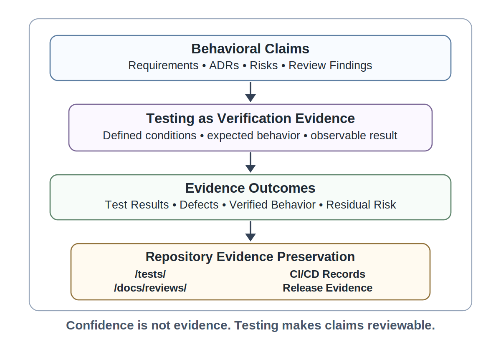
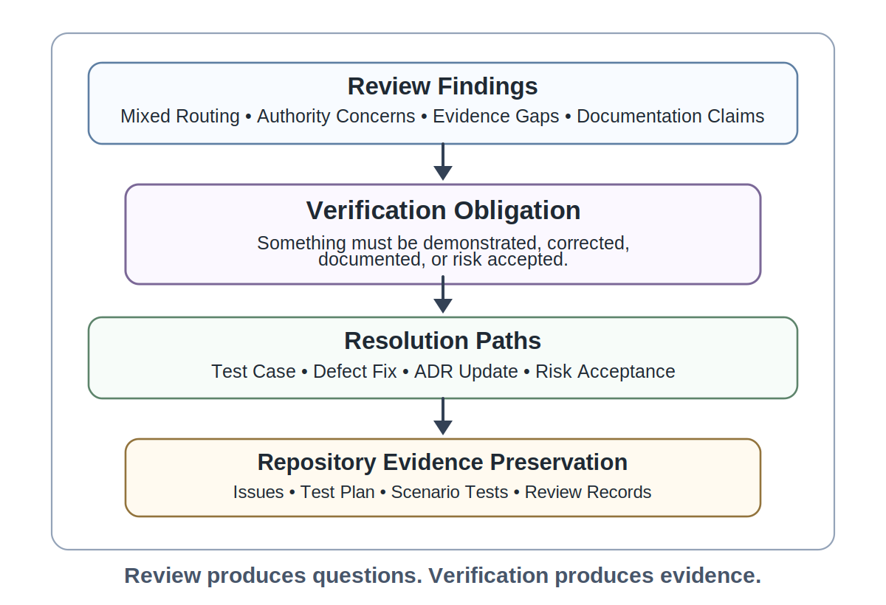
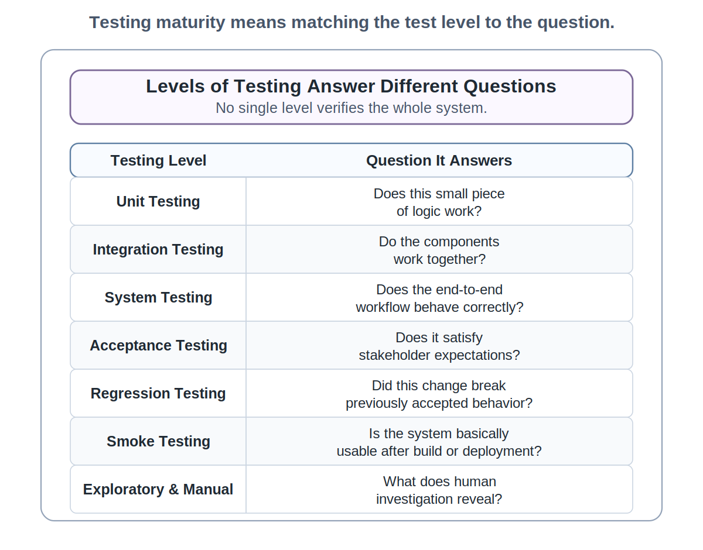
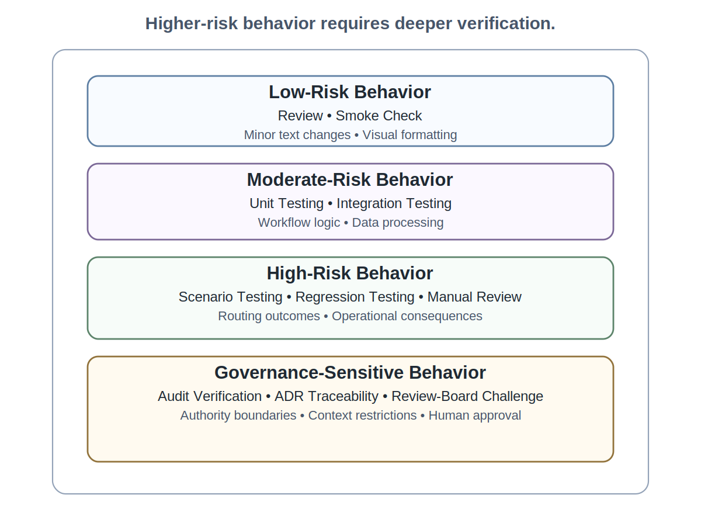
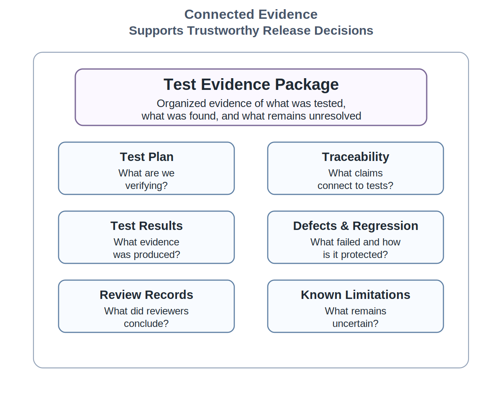

# Chapter 19 Testing and Verification Fundamentals

## Opening Scenario: The System Passed Review - But Nothing Had Been Proved

The COICP team had just finished the kind of review that would have seemed excessive earlier in the project.

The routing recommendation component had been examined beyond ordinary code review. Reviewers had looked at behavior, assumptions, context, authority, generated documentation, generated tests, audit evidence, and residual risk. They had challenged whether the system treated mixed incidents too casually. They had questioned whether the user interface made recommendations feel more authoritative than intended. They had noticed that some generated tests mirrored the happy path. They had found documentation claims that sounded stronger than the evidence behind them.

That review mattered. It made the system more understandable. It made hidden assumptions visible. It made risk discussable.

But it did not prove the system.

A review finding is not a verified behavior. A reviewer comment is not a test result. A concern written in a pull request is not a regression check. An ADR constraint is not enforced merely because it is linked. A generated test does not become sufficient because it passes. A green CI/CD run does not tell the team what remains untested.

At LMU, this distinction became unavoidable when the COICP team prepared for its first serious verification pass. The repository already contained requirements, issue records, architecture notes, ADRs, AI-use log entries, pull requests, review comments, CI/CD runs, and Chapter 18 AI-generated-system review notes. The evidence was richer than before. It was also more demanding. Every review finding created a question: what behavior must be demonstrated, under what conditions, with what expected result, and with what evidence preserved for future review?

The team no longer needed more confidence. It needed better verification.

Testing begins where review stops. Review identifies what must be challenged. Testing turns those challenges into repeatable behavioral evidence.

This chapter is about that shift. Testing is not merely trying the application, clicking through a demo, writing a few unit tests, or making the build green. Testing is disciplined evidence production. Verification is the work of showing, repeatedly and reviewably, that the system's behavior satisfies accepted requirements, architectural decisions, governance boundaries, risk expectations, and operational constraints.

A team does not test because it lacks confidence. A team tests because confidence is not evidence.

---

## 19.1 Testing as Engineering Evidence

Testing is often introduced too narrowly. Students are told to write unit tests, run the application, check the happy path, or satisfy a coverage threshold. Those activities may be useful, but none of them captures the professional purpose of testing.

In trustworthy engineering, a test is evidence attached to a claim about behavior. The claim may come from a requirement, an acceptance criterion, an ADR, a risk, a review finding, a defect report, or an operational expectation. The test matters because it makes that claim inspectable. It says: under these conditions, with this input or situation, the system should produce this observable behavior, and here is the result.

For COICP, a requirement might state that routine Facilities incidents should be routed to Facilities Operations unless the description contains safety-sensitive content. That sentence is not yet verified. A reviewer may agree that the requirement is clear. An architect may link an ADR describing routing authority. A developer may implement a routing helper. CI may pass. None of that alone demonstrates the behavior. The team needs tests that exercise routine Facilities incidents, mixed Facilities and Campus Safety incidents, ambiguous incident descriptions, missing fields, overridden recommendations, and audit records.

Testing converts intended behavior into evidence. It makes correctness more than an assertion. It makes traceability more than a diagram. It makes reviewability more than a meeting. It makes accountability more than a role label.

The repository is central because test evidence must survive the moment. A test result that exists only in someone's memory is weak evidence. A manual check that is not recorded cannot support release readiness. A defect that is discussed in chat but not linked to an issue cannot reliably guide future regression testing. A CI run that passes without a clear relationship to requirements or risks does not explain what confidence it supports.

In the COICP repository, testing evidence may live in `/tests/`, `/tests/scenarios/`, `/tests/evidence/`, `/tests/regression/`, `/docs/requirements/`, `/docs/adr/`, `/docs/reviews/`, CI/CD run records, and eventually `/release-evidence/`. These directories and files are not bureaucratic decoration. They are how the team preserves the evidence needed to make behavior reviewable later.

This is why a green build is not the end of testing. A green build reports only that the tests which executed did not fail under the conditions they examined. It does not tell the team whether the right behaviors were tested, whether important risks were challenged, whether governance boundaries were verified, whether hidden assumptions were exposed, or whether meaningful evidence exists for release decisions.

A green build is evidence.

It is not the conclusion.

Testing is not proof of trustworthiness. It is disciplined behavioral evidence that makes trustworthiness claims more reviewable, repeatable, and defensible.

*Figure 19.1 — Testing as Evidence, Not Confidence*

---

## 19.2 From Review Findings to Test Obligations

Chapter 18 ended with review findings. Chapter 19 begins by refusing to let those findings remain comments.

A review finding is a signal that something must happen next. Sometimes the finding requires a design change. Sometimes it requires an ADR update. Sometimes it requires documentation correction. Sometimes it requires a risk decision. Often it creates a test obligation.

A test obligation is a behavior, condition, risk, or assumption that must be verified before the team can responsibly claim that the system is understood. It is stronger than a suggestion and more specific than a concern. It names something that must be demonstrated or disproven.

Suppose Chapter 18 review found that the COICP routing recommendation behaves well for simple Facilities incidents but may treat mixed Facilities and Student Services incidents as ordinary maintenance. That finding becomes a test obligation: the system must be tested against mixed incident scenarios where the correct behavior may involve escalation, multi-department review, or an advisory warning. The obligation should not remain buried in a review comment. It should become an issue, a test case, a scenario file, a defect if behavior is wrong, or a known limitation if the team explicitly accepts residual risk.

The same principle applies to authority. If reviewers found that the interface makes recommendations look like system decisions, the team needs tests or review checks that verify UI language, approval flow, audit events, and user-visible status. The question is not only whether the code requires a button click. The question is whether the workflow preserves human approval in observable behavior.

Generated documentation can also create test obligations. If the README claims that COICP records why a routing recommendation was accepted, rejected, or overridden, then tests should verify that the audit record actually contains that evidence. If the documentation says recommendations are advisory, then tests and review records should verify that the UI, API, and audit trail preserve advisory status.

A good repository makes this conversion visible. Review findings from `/docs/reviews/ai-generated-system-review.md` can be linked to issues labeled `test-gap`, `verification-needed`, `risk`, or `defect`. Test cases can be stored under `/tests/test-cases/` or `/tests/scenarios/`. A test plan in `/tests/test-plan.md` can map findings to verification work. When the work is implemented, pull requests can link back to the review finding and show which tests were added or changed.

This is how review and testing reinforce each other. Review produces questions. Testing produces evidence. Review without testing leaves uncertainty visible but unresolved. Testing without review may verify the wrong behavior.

*Figure 19.2 — Review Finding to Test Obligation*

---

## 19.3 What Makes a Good Test?

A test is not good because it exists. A test is good when it verifies a meaningful behavior under a meaningful condition with a clear expected result.

Weak tests often look professional. They have names. They run automatically. They may increase coverage numbers. They may pass every time. But they may only confirm that the current implementation behaves as it already behaves. They may mirror the same assumption that created the defect. They may check the easy path while ignoring the risk that matters.

A good test starts with a behavioral claim. For example: when a routine Facilities incident includes no safety-sensitive terms and has complete location information, the system should recommend Facilities Operations and record that the recommendation remained advisory until approved by a staff member. That claim is testable because it names a condition, a behavior, an expected result, and evidence that should be visible.

A good test also names its preconditions. What data exists? What user role is acting? What incident status applies? What configuration is active? What prior decision has or has not occurred? Preconditions matter because systems behave differently depending on context. Tests that ignore preconditions are hard to interpret and hard to debug.

A good test has an expected result that is specific enough to fail. Vague expectations create vague evidence. A test that says the routing recommendation should be reasonable is not strong. A test that says the system should mark the recommendation as advisory, require coordinator approval before routing, write an audit event containing the recommendation, approval status, approver, timestamp, and reason code, and leave the incident in pending-review state until approval is stronger.

A good test also includes meaningful variation. It does not only check the happy path. It checks boundary cases, invalid inputs, missing data, conflicting data, unusual but plausible workflows, failure conditions, and governance-sensitive scenarios. For COICP, this means testing not only a broken light in a hallway, but also a broken residence-hall door reported with safety concerns, a vague student welfare note, a duplicated incident, a missing location, and a recommendation overridden by a human coordinator.

Students often confuse implementation coverage with behavioral coverage. A test may execute a line of code without verifying the behavior that matters. Coverage can help identify untested areas, but coverage is not confidence by itself. A test suite with high coverage can still miss the requirement, the risk, or the governance boundary.

The anti-pattern is Tests That Confirm the Assumption. It appears when verification inherits the same narrow worldview that shaped the implementation. The code assumes every incident has one clean category. The generated tests verify one clean category. The documentation describes clean categories. The pull request summary reports that categories are handled. Every artifact appears to support every other artifact because they all inherited the same unchallenged assumption.

The evidence looks consistent.

The underlying assumption may still be wrong.

Trustworthy testing breaks that loop. It asks what assumption would hurt us if it were wrong, then designs a test that can expose the problem.

---

## 19.4 Levels of Testing and the Questions They Answer

Different tests answer different questions. A mature team does not ask whether it has tests in general. It asks what questions its tests can answer and what questions remain unanswered.

Unit tests ask whether a small piece of logic behaves correctly in isolation. They are useful because they are fast, focused, and repeatable. In COICP, a unit test might verify that a routing classifier handles a specific input and returns the expected category label. Unit tests are valuable, but they do not prove that the full workflow behaves correctly. They usually do not show what the user sees, what the audit trail records, or whether authority boundaries hold across the system.

Integration tests ask whether components work together. A COICP integration test might verify that an incident submitted through the intake service creates the right routing recommendation, persists the recommendation, and exposes it to the coordinator dashboard. Integration tests catch mismatches between components, data formats, APIs, configuration, and persistence behavior.

System tests ask whether an end-to-end workflow behaves correctly. In COICP, a system test might simulate an incident from intake through recommendation, coordinator review, approval or override, routing, notification draft, and audit record. System tests are slower and more complex, but they reveal behavior that no isolated component test can show.

Acceptance tests ask whether the system satisfies stakeholder expectations. They connect most directly to requirements and acceptance criteria. A stakeholder does not care that a helper function passed. The stakeholder cares that a coordinator can receive an incident, understand the recommendation status, make an informed decision, and leave enough evidence for later review.

Regression tests ask whether previously accepted behavior still holds after change. They matter because every fix can break something else. When a COICP defect is found and corrected, the team should add or update a regression test so the defect does not silently return. A defect without a regression obligation is an invitation to rediscover the same failure later.

Smoke tests ask whether the system is basically usable after build or deployment. They are shallow by design. A smoke test may confirm that the application starts, core routes load, login works, and the intake page is reachable. Smoke tests do not replace deeper testing. They simply provide a fast signal that the system is not obviously broken.

Exploratory and manual tests ask what human investigation can reveal that scripted tests may miss. Manual testing is not amateur testing when it is planned, recorded, and evidence-producing. It is especially important for workflows, usability, language, ambiguity, and institutional meaning. In COICP, a human tester may notice that the UI wording makes an advisory recommendation feel like an instruction even though all automated tests pass.

The mistake is to treat one level as sufficient for all purposes. Unit tests do not replace acceptance tests. Acceptance tests do not replace regression tests. CI smoke tests do not replace governance-sensitive scenario testing. Manual exploration does not replace repeatable automated checks. Testing maturity comes from choosing levels that match the claims and risks being verified.

*Figure 19.3 — Levels of Testing and the Questions They Answer*

---

## 19.5 Testing Requirements, Acceptance Criteria, and ADRs

Tests should not be invented from code alone. If tests are derived only from implementation, they tend to verify the implementation's assumptions. Professional testing begins from the evidence that defines what the system is supposed to do and what constraints it must obey.

Requirements identify intended behavior and stakeholder value. Acceptance criteria translate that intent into observable success conditions. ADRs preserve decisions and constraints. Architecture documents define boundaries, responsibilities, data ownership, context rules, fallback expectations, and authority paths. Review findings identify suspicion. Risks identify where shallow testing is irresponsible.

A COICP routing test should therefore trace to more than a function name. It should trace to the requirement that coordinators receive routing support, the acceptance criteria that recommendations remain advisory, the ADR that defines routing authority, the architecture note that excludes sensitive student records from recommendation context, and the Chapter 18 review finding that mixed incidents were under-tested.

This is where a traceability matrix becomes practical. A file such as `/tests/traceability-matrix.md` or `/tests/traceability-matrix.csv` can map requirements, ADRs, risks, and review findings to test cases. The point is not to create paperwork. The point is to prevent orphan tests and orphan requirements. An orphan requirement has no verification evidence. An orphan test verifies something no one has claimed matters.

The mapping does not need to be complicated. For each important requirement or decision, the team should be able to answer: what test or evidence verifies this? For each important test, the team should be able to answer: what claim does this support?

ADRs deserve special attention because they often encode governance and architecture constraints that ordinary functional tests miss. If an ADR says AI-generated recommendations may not directly change routing status, the tests must verify that model output cannot bypass human approval. If an ADR says recommendation context excludes student health records, tests must verify that excluded fields are not passed into the recommendation path. If an ADR says audit records must preserve human override decisions, tests must verify that overrides are recorded with enough context to reconstruct accountability.

Testing requirements without ADRs can verify features while missing architecture. Testing ADRs without requirements can verify constraints while missing stakeholder value. Trustworthy verification connects both.

---

## 19.6 Manual, Automated, and CI/CD Testing

Automation is powerful because it makes selected checks repeatable. It is also dangerous when teams confuse repeatability with completeness.

Automated tests are well suited for behavior that can be specified clearly, executed consistently, and checked deterministically. They are essential for regression testing, CI/CD, core business rules, data validation, permissions, API contracts, and many integration paths. Once automated, these checks become part of the repository's living evidence system. They can run on every pull request. They can block obvious regressions. They can document expected behavior for future maintainers.

Manual testing remains necessary when human perception, workflow meaning, ambiguity, and exploratory investigation matter. A human tester can ask whether the coordinator understands the recommendation, whether the approval path feels optional or pressured, whether warning language is clear, whether documentation matches behavior, and whether a confusing incident would be handled responsibly. Manual testing is weak only when it is undocumented. A recorded manual test with scenario, tester, date, steps, observations, evidence, and outcome is legitimate engineering evidence.

CI/CD brings automation into the change-control system. In Chapter 17, CI/CD became automated evidence, not proof. Chapter 19 inherits that doctrine. CI should run relevant tests, preserve results, and make failures visible before merge. But CI can only run the tests the team provides. If the test suite ignores authority boundaries, CI will ignore them perfectly and repeatedly.

For COICP, a pull request that modifies routing behavior should not merely show that CI passed. The PR should explain what test categories were affected, what scenarios were added, what review findings were addressed, what risks remain, and where evidence lives. A good PR might link to `/tests/scenarios/routing-mixed-incidents.md`, show automated results from the CI run, reference the related ADR in `/docs/adr/`, and note any manual workflow review under `/tests/evidence/`.

Manual and automated testing should reinforce each other. Exploratory manual testing can discover a problem. That problem can become a defect issue. The fix can include an automated regression test. CI can then preserve the regression check. Later release evidence can show that the defect was corrected and did not recur under the tested conditions.

The opposite pattern is CI greenwashing. It occurs when a team points to a green build as if it resolves all uncertainty. The build is green, but no one can explain whether important behavior was tested, whether high-risk paths were covered, whether review findings were converted to tests, or whether known limitations remain. CI greenwashing is testing theater with automation attached.

Use automation aggressively where it strengthens repeatability. Use manual testing deliberately where human judgment is required. Use CI/CD to preserve evidence. Use engineering judgment to decide what the evidence means.

---

## 19.7 Defects as Evidence

A defect is not an embarrassment. A defect is evidence that actual behavior differs from expected behavior, or that expected behavior was not understood clearly enough.

Immature teams hide defects, minimize them, or treat them as personal failure. Trustworthy teams study defects because defects reveal mismatches among requirements, assumptions, implementation, tests, documentation, architecture, and user reality. A defect is a learning event inside the engineering evidence system.

A useful defect report is specific. It identifies the expected behavior, actual behavior, steps to reproduce, environment, evidence, severity, priority, suspected area, owner, current status, and related tests. It should link to the requirement, issue, PR, ADR, or review finding when relevant. In the COICP repository, defects can be tracked as issues labeled `defect`, `regression`, `security`, `governance`, `routing`, `audit`, or `known-limitation` as appropriate.

Severity and priority are not the same. Severity describes impact. Priority describes scheduling decision. A defect that exposes sensitive data is severe even if it affects few users. A typo in a low-traffic screen may be low severity but high priority if it appears in a public demo. Teams need both concepts because risk and planning are different forms of judgment.

Reproducibility matters because a defect that cannot be reproduced is harder to fix and verify. That does not make it irrelevant. Some defects are intermittent, environment-specific, data-dependent, or timing-sensitive. Mature defect records preserve enough evidence to continue investigation: logs, screenshots, request IDs, data samples, timestamps, user roles, configuration, and observed sequence.

Every fixed defect should raise a regression question. What test will prevent this from returning unnoticed? Sometimes the answer is an automated unit test. Sometimes it is an integration test. Sometimes it is a manual checklist item. Sometimes the defect reveals a requirement gap or ADR ambiguity that must be corrected before testing can be meaningful.

Defects also support release judgment. A system with zero recorded defects is not necessarily high quality. It may be untested. A system with well-documented defects, fixes, regression tests, and known limitations may be more mature because its risks are visible. Honest engineering is mature engineering.

In later release readiness work, defects will become part of the release evidence package. Chapter 19 prepares that by teaching students to treat defects as durable evidence, not disposable trouble tickets.

---

## 19.8 Testing Risk, Boundaries, and Governance-Sensitive Behavior

Not all behavior deserves the same testing depth. Risk should shape verification.

A spelling correction in a help page does not require the same test discipline as a routing recommendation that may influence student welfare, campus safety, or institutional action. A low-risk visual change may need review and a smoke check. A high-risk workflow may require unit tests, integration tests, scenario tests, manual workflow review, audit verification, regression tests, and review-board challenge.

Risk-based testing begins by asking what could go wrong, who could be affected, how visible the failure would be, how recoverable it would be, and whether the behavior crosses authority, privacy, safety, security, or institutional trust boundaries.

COICP contains governance-sensitive behavior even before release. Routing recommendations influence institutional coordination. Incident summaries shape what staff believe. Notification drafts may affect communication with students, parents, or departments. Audit records determine whether future reviewers can reconstruct decisions. Context boundaries protect information that should not be used. Human approval preserves authority.

These behaviors require deeper testing than ordinary data display. A test plan for routing should include routine cases, ambiguous cases, mixed-department cases, missing information, conflicting fields, override behavior, approval paths, audit completeness, and excluded-context verification. The team should test not only whether a recommendation appears, but whether the system preserves decision status and authority boundaries.

Governance-sensitive tests should be explicit. For example: model output must not directly change incident routing status; a coordinator approval event must exist before routing changes; recommendations must be labeled advisory; audit records must include the recommendation, human decision, timestamp, actor, and reason code; excluded student-record fields must not enter recommendation context; failed recommendation generation must fall back to human review without blocking intake.

A risk matrix can guide depth. Low-consequence, low-uncertainty behavior may need lightweight checks. Moderate-risk behavior may need unit and integration tests. High-consequence or high-uncertainty behavior may need scenario tests, manual review, ADR traceability, regression obligations, and review-board approval. AI-influenced behavior often increases uncertainty because generated logic, generated tests, generated explanations, and context dependencies may share hidden assumptions.

Risk-based testing prevents two failures at once. It prevents under-testing consequential behavior, and it prevents wasting scarce time on low-value test theater. Mature teams test deeply where failure matters.

*Figure 19.4 — Risk-Based Testing Depth*

---

## 19.9 The Test Evidence Package

A mature team does not merely run tests. It preserves test evidence in a form that future engineers, reviewers, release decision-makers, and operators can understand.

A test evidence package is the organized record of what was tested, why it was tested, what evidence was produced, what defects were found, what was fixed, what remains unresolved, and what risk decisions follow. It is not a single document necessarily. It may be a connected set of repository artifacts.

For COICP, the package might include `/tests/test-plan.md`, `/tests/traceability-matrix.md`, automated tests under `/tests/unit/`, `/tests/integration/`, and `/tests/scenarios/`, manual test notes under `/tests/evidence/`, regression tests under `/tests/regression/`, defect issues, CI/CD run links, review-board notes under `/docs/reviews/testing-review.md`, and later a release test summary under `/release-evidence/test-summary.md`.

The test plan explains scope. It identifies what behaviors are being verified, what requirements and ADRs are in scope, what risks drive deeper testing, what test levels will be used, what environments are involved, and what evidence will be preserved. A test plan should be practical. It should guide work, not perform ceremony.

The traceability matrix connects claims to tests. It prevents the team from losing the relationship among requirements, acceptance criteria, ADRs, risks, review findings, and test cases. It also exposes gaps. If a critical ADR has no related test, that is evidence of a verification gap.

Test cases define the conditions, steps, inputs, expected results, and evidence. Automated test results show repeatable checks. Manual test notes preserve human observations. Defect records explain where behavior failed. Regression tests show how corrected defects are protected. Known limitations identify what remains unverified, deferred, or accepted as risk.

A test evidence package should also be honest about what was not tested. This matters because release decisions depend as much on known gaps as on passed tests. The team should not hide limitations behind successful test counts. It should identify untested integrations, incomplete scenarios, unstable tests, manual-only checks, unresolved defects, and assumptions that still require validation.

This package becomes the foundation for later release readiness. Chapter 21 will ask whether the system is ready to release. Chapter 19 prepares the evidence that makes that question answerable.

*Figure 19.5 — Test Evidence Package*

---

## 19.10 The Testing Review Board

Testing evidence should itself be reviewed. Otherwise, the team may confuse test activity with verification maturity.

The Testing Review Board is the chapter's review mechanism. It is not a new bureaucracy. It is a structured challenge session that asks whether the available test evidence is strong enough for the system's current maturity stage and risk profile.

The board should include people who can challenge the work from different angles: developers, testers, team leads, architecture owners, product or stakeholder representatives, and governance reviewers when authority, privacy, or institutional consequence is involved. In a course setting, this may be simulated through team review, instructor review, peer review, or release-preparation review.

The board asks basic but demanding questions: What behavior was tested? Which requirements were verified? Which ADRs were enforced? Which Chapter 18 review findings became test obligations? Which risks received deeper test coverage? Which tests are automated? Which tests remain manual? Which defects were found? Which defects remain open? Which limitations must be disclosed? What did CI/CD actually run? What evidence would a future engineer need to reconstruct this testing decision?

The Testing Review Board also asks what is missing. Missing evidence is not automatically failure. It may be acceptable if the risk is low, the limitation is documented, and the decision is owned. But missing evidence must not be invisible.

For COICP, the board might accept that some low-risk administrative screen tests remain manual for now. It should not accept untested authority boundaries in routing recommendations. It should not accept generated tests that only cover routine incidents if review findings identified mixed and sensitive incidents as risk areas. It should not accept documentation claims that have no verification evidence.

The board's outputs should be concrete: accepted test evidence, required test additions, defect follow-up, regression obligations, known limitations, risk disposition, and release-readiness prerequisites. Those outputs should return to the repository as issues, test-plan updates, review notes, or release-evidence preparation.

This mechanism strengthens engineering judgment because it forces the team to explain what its tests mean. It prevents testing theater by challenging whether evidence actually supports the claims being made.

---

## 19.11 Operational Takeaways

Testing is evidence production. The purpose of testing is not to create comforting activity. The purpose is to make behavior claims inspectable, repeatable, and defensible.

Review findings become test obligations. Chapter 18 exposed behavior, assumption, context, authority, documentation, test, and risk concerns. Chapter 19 converts those concerns into tests, defects, evidence, and risk decisions.

Good tests challenge assumptions. Weak tests often confirm what the implementation already assumes. Strong tests examine boundary cases, failure cases, negative cases, governance-sensitive cases, and real stakeholder workflows.

Testing levels answer different questions. Unit, integration, system, acceptance, regression, smoke, exploratory, and manual testing are not interchangeable. They support different kinds of evidence.

CI/CD is automated evidence, not proof. A green build is useful, but it only reports the outcome of the tests that ran. Engineering judgment still decides whether the right behaviors were verified.

Defects are evidence. They show where expected and actual behavior diverge. Mature teams preserve defects, fix them, learn from them, and add regression protection where appropriate.

Risk determines test depth. Consequential, uncertain, AI-influenced, governance-sensitive, privacy-sensitive, or authority-bearing behavior deserves deeper verification.

Test evidence must survive in the repository. Future engineers, reviewers, release decision-makers, and operators need to reconstruct what was tested, what passed, what failed, what changed, and what remains uncertain.

Verification strengthens trustworthiness but does not eliminate uncertainty. Testing supports professional judgment. It does not replace it.

---

## 19.12 Exercises

### Exercise 1: Convert Review Findings into Test Obligations

Create the repository artifact:

`/tests/review_finding_test_obligations.md`

Begin with a set of Chapter 18-style COICP review findings.

For each finding, determine whether it requires:

- A test
- A defect issue
- An ADR update
- A documentation correction
- A residual-risk note

Create repository-ready entries for all findings that become test obligations.

Identify which findings represent the highest operational risk if left unverified.

### Exercise 2: Build a Routing Test Matrix

Create the repository artifact:

`/tests/routing_test_matrix.md`

Develop a routing test matrix that includes:

- Routine scenarios
- Ambiguous scenarios
- Mixed-department scenarios
- Safety-sensitive scenarios
- Missing-data scenarios
- Override scenarios

For each scenario, document:

- Expected behavior
- Relevant requirement
- Relevant ADR
- Test level
- Automation status
- Evidence location

Evaluate whether the matrix provides sufficient coverage for release-readiness testing.

### Exercise 3: Improve Weak Generated Tests

Create the repository artifact:

`/tests/generated_test_review_record.md`

Review a set of AI-generated tests that verify only happy-path routing behavior.

Identify:

- Assumptions preserved by the tests
- Missing edge cases
- Missing governance-sensitive conditions
- Missing audit-evidence checks
- Missing failure scenarios

Rewrite the tests to provide more meaningful verification coverage.

Explain why generated tests require engineering review rather than automatic acceptance.

### Exercise 4: Map Tests to Requirements and ADRs

Create the repository artifact:

`/tests/traceability_matrix.md`

Link at least:

- Five requirements
- Two ADR constraints
- Three review findings

to specific test cases.

Identify:

- Orphan requirements
- Orphan ADR constraints
- Orphan tests

Evaluate the risks associated with each orphaned item.

### Exercise 5: Write a Defect Report

Create the repository artifact:

`/docs/testing_and_quality/defects/defect_report_001.md`

Using a COICP scenario in which the system recommends Facilities for a mixed Facilities and Campus Safety incident without flagging uncertainty, create a defect report.

Include:

- Expected behavior
- Actual behavior
- Reproduction steps
- Supporting evidence
- Severity
- Priority
- Owner
- Regression obligation

Determine whether the defect should block release progression and justify the decision.

### Exercise 6: Design a Governance-Sensitive Test

Create the repository artifact:

`/tests/governance_sensitive_test_case_001.md`

Design a test case that verifies AI-generated routing recommendations cannot directly change incident-routing status without human approval.

Document:

- Preconditions
- Execution steps
- Expected results
- Audit evidence
- Repository location

Explain how the test verifies authority boundaries rather than functional behavior alone.

### Exercise 7: Prepare a Test Evidence Package

Create the repository artifact:

`/docs/testing_and_quality/test_evidence_package.md`

Assemble a test-evidence package containing:

- Test-plan summary
- Traceability excerpt
- Representative test cases
- CI/CD result references
- Manual test notes
- Defect list
- Regression evidence
- Known limitations
- Risk disposition

Evaluate whether the package provides sufficient evidence for release-readiness review.

### Exercise 8: Conduct a Testing Review Board

Create the repository artifact:

`/docs/governance/reviews/testing_review_board_record.md`

Using the test-evidence package from the previous exercise, conduct a Testing Review Board.

Answer the following questions:

- What was tested?
- What was not tested?
- What risks remain?
- Which defects block progress?
- What must be resolved before release readiness?

Document:

- Findings
- Evidence gaps
- Required corrective actions
- Owner assignments
- Residual risks

Determine whether the testing effort is acceptable, conditionally acceptable, or insufficient for release progression.

---

## 19.13 Closing: Toward Testing Intelligent and AI-Assisted Systems

COICP is more mature at the end of this chapter than it was at the beginning. The team has moved from reviewed implementation to testable behavior. Review findings no longer sit as comments. They become test obligations. Requirements become verification targets. ADRs become enforceable constraints. Defects become evidence. CI/CD becomes a repeatable evidence runner. Manual testing becomes recorded investigation. Risk shapes test depth. The repository begins to hold not only what the team built, but what the team can demonstrate about how it behaves.

That is a major step toward trustworthy engineering.

It is still not enough.

Chapter 19 has taught testing and verification fundamentals. These fundamentals apply to every serious software system. But COICP is not only a traditional software system. Some of its behavior is AI-assisted. Some recommendations may depend on generated logic, context selection, uncertain language, probabilistic interpretation, or human interaction with model-shaped output. Some failures may not be simple wrong answers. They may be unstable outputs, brittle context dependence, overconfident explanations, weak guardrails, inappropriate delegation, or behavior that changes as the surrounding AI system changes.

Traditional testing is necessary for intelligent and AI-assisted systems.

It is not sufficient by itself.

Testing works best when expected behavior can be defined clearly and verified repeatedly. Intelligent systems introduce a different challenge. Some important questions are no longer only about correctness. They are about consistency, stability, context dependence, uncertainty, explanation quality, human interaction, fallback behavior, and governance outcomes.

The next chapter extends verification into that harder space.

Chapter 20 asks how teams evaluate intelligent and AI-assisted systems when behavior may be nondeterministic, context-sensitive, model-influenced, and governance-sensitive. The goal is not to abandon testing. The goal is to supplement testing with forms of evaluation that can examine behavior traditional verification cannot fully explain.

Testing has made COICP's behavior more visible.

Chapter 20 asks whether that behavior remains trustworthy when intelligence becomes part of the system.
