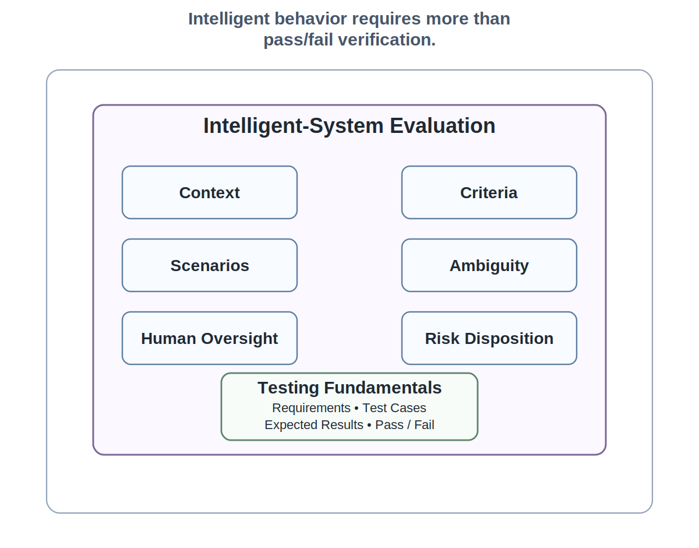
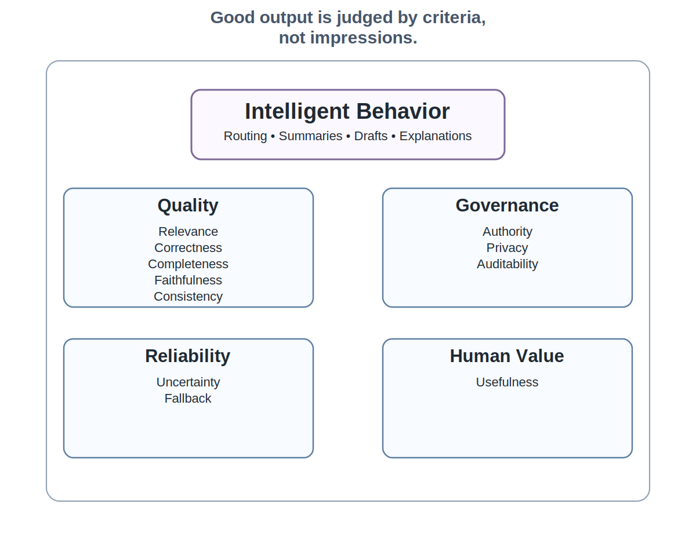
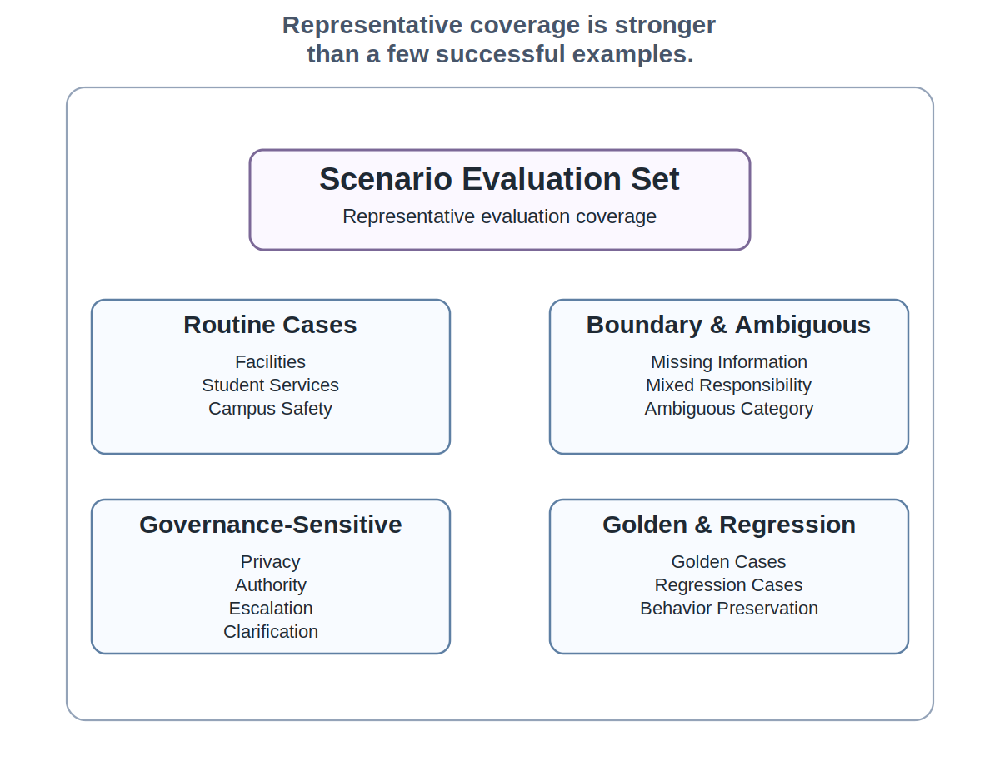
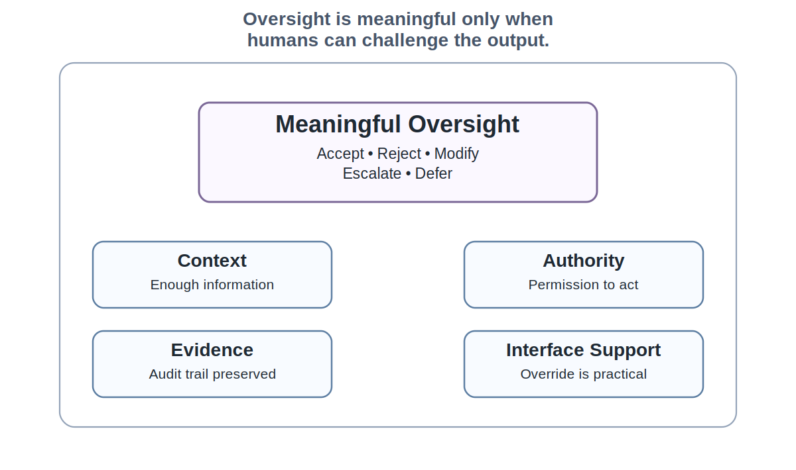
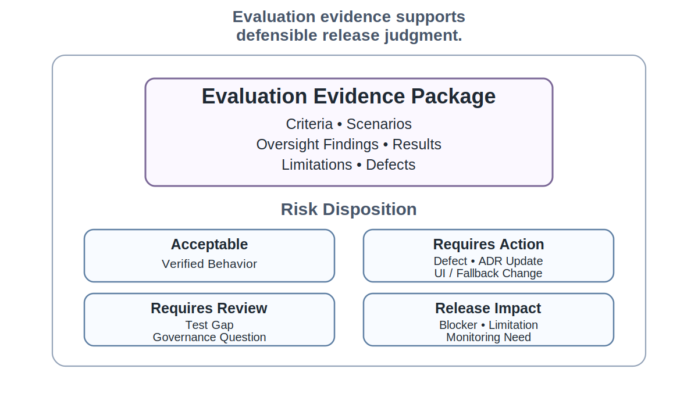

# Chapter 20 Testing Intelligent and AI-Assisted Systems

## Opening Scenario: The Tests passed, but the Questions Remained

COICP had become testable.

That was a real milestone.

The team had a test plan under `/tests/test-plan.md`. Requirements were linked to acceptance criteria. Test cases were organized under `/tests/test-cases/` and `/tests/scenarios/`. Regression checks were beginning to accumulate under `/tests/regression/`. CI/CD ran a growing set of automated checks. Defects were tracked as issues rather than remembered in conversation. The repository had started to show not merely that the team was busy, but that the system's behavior could be challenged and verified.

Chapter 19 changed the team's posture. Testing was no longer treated as a late activity or a confidence ritual. Testing became evidence. A test existed to verify a meaningful claim about behavior. A defect became information, not embarrassment. A green build became useful evidence, not proof.

But one part of COICP still resisted ordinary testing discipline.

The deterministic workflow behaved more predictably. Required fields could be validated. Intake records could be saved. Notifications could be checked. Permission rules could be tested. Basic routing workflow could be exercised. Those behaviors still required serious testing, but the team could usually define a clear input, expected output, and pass/fail condition.

The intelligent behavior was different.

The AI-assisted routing recommendation sometimes handled clean Facilities incidents well. A broken light, damaged door, clogged sink, or classroom access request produced a reasonable department suggestion. Generated summaries were often useful. Notification drafts frequently saved staff time. The system looked helpful.

Then the harder cases arrived.

A student submitted a maintenance request about a broken exterior door near a residence hall entrance, but the text also implied that people were using the doorway to enter after hours. Another report described repeated noise, possible harassment, and building access issues in the same paragraph. A parent submitted a vague concern about a student who had not responded to messages, but the report arrived through the wrong intake category. A Facilities issue included sensitive student information that should not be echoed in a generated summary. In another case, the recommendation was plausible but incomplete: it routed to Facilities while failing to flag Student Services and Campus Safety review.

No single example proved that the system was broken. That was part of the problem.

The behavior varied. Sometimes the recommendation was appropriately cautious. Sometimes the explanation sounded more certain than the evidence justified. Sometimes the summary omitted material context. Sometimes a human reviewer could correct the output easily. Sometimes the interface made correction feel like extra work.

The team realized that Chapter 19 testing was necessary but not sufficient. They could test forms, services, APIs, workflows, and regression paths. They could verify many expected behaviors. But intelligent behavior required another layer of engineering discipline.

They needed evaluation.

Evaluation is not admiration. Evaluation is not asking whether the output sounds good. Evaluation is not proving that a model is impressive. Evaluation is disciplined evidence about whether intelligent or AI-assisted behavior remains useful, bounded, reviewable, governable, and accountable under realistic conditions.

That is the Chapter 20 problem.

Testing intelligent systems is not about proving the model is smart. It is about proving the engineered system remains bounded, reviewable, useful, safe enough, and accountable under realistic conditions.

*Figure 20.1 — From Testing to Evaluation*

---

## 20.1 Why Intelligent-System Testing Is Different

Traditional testing still matters. Nothing in this chapter replaces the fundamentals from Chapter 19. Unit tests, integration tests, system tests, acceptance tests, regression tests, exploratory testing, defect evidence, and CI/CD checks remain necessary.

The mistake is believing they are sufficient.

Intelligent and AI-assisted systems add behaviors that do not always fit simple deterministic testing. A login rule either accepts or rejects credentials. A required field either blocks submission or does not. A database write either persists the expected record or fails. Those behaviors can still be complicated, but the expected result is usually definable in precise terms.

AI-assisted behavior often behaves differently. A routing recommendation may be partially correct. A generated summary may be mostly faithful while omitting a critical detail. A notification draft may be well written but too authoritative. A classification may be reasonable for one stakeholder and incomplete for another. A recommendation may be safe for a routine case but dangerous for a sensitive case. The output may vary because the input text varies, the retrieved context varies, the prompt changes, the policy source changes, the model version changes, or the surrounding workflow changes.

That does not mean intelligent behavior cannot be tested. It means the team must test it differently.

The object of evaluation is the engineered behavior, not the model in isolation. COICP is not releasing a model. LMU is not trusting an abstract AI capability. The institution is deciding whether a specific system behavior--routing recommendations, summaries, notification drafts, escalation suggestions, audit explanations--can operate inside a governed workflow with human oversight, context boundaries, fallback, review, and evidence.

That distinction matters. The model is not the system. The system includes the intake form, source data, prompt or instruction structure, retrieval context, excluded data, UI framing, human approval workflow, audit record, test cases, review notes, repository evidence, and operational consequences.

A team that says "the model tested well" has not said enough. The model is not what the institution deploys. The institution deploys system behavior.

Which behavior was tested? Under what scenarios? With what context? Against what criteria? With what risk level? What did humans see? What could they override? What was recorded? What failed? What was accepted as a limitation?

Those questions move evaluation away from model admiration and back toward engineering evidence.

For COICP, intelligent-system testing begins when the team stops asking, "Does the AI give a good answer?" and starts asking, "Does this engineered behavior remain trustworthy enough under the conditions LMU actually faces?"

The repository must preserve that evidence. Evaluation cannot live in someone's judgment after a demo. The evaluation plan belongs in a durable location such as `/docs/ai/evaluation-plan.md`. Scenario inputs belong under `/tests/scenarios/` or `/tests/evaluation/scenarios/`. Results belong under `/tests/evaluation/results/`. Review conclusions belong under `/docs/reviews/intelligent-system-test-review.md`. Later release evidence may summarize the results under `/release-evidence/ai-evaluation-summary.md`.

This is not repository bureaucracy. It is how the team prevents intelligent behavior from becoming a trust claim with no memory.

---

## 20.2 Define the Intelligent Behavior Under Test

A common failure in AI-assisted projects is vague testing language.

"Test the AI."  
"Check the recommendations."  
"Validate the summaries."  
"Make sure the model behaves."  
"See whether it works."

Those phrases are too broad to support engineering evidence. They hide the actual behavior being evaluated.

Before a team can evaluate intelligent behavior, it must name the behavior. COICP may contain several AI-assisted behaviors, and each one deserves separate evaluation:

- routing recommendation;
- incident summary generation;
- notification draft generation;
- escalation suggestion;
- duplicate incident detection;
- priority suggestion;
- explanation of why a route was recommended;
- audit narrative for later review.

These behaviors have different risks. A notification draft that is clearly labeled as draft text has one risk profile. A routing recommendation that may influence institutional response has another. A summary shown to staff may affect what they notice, what they ignore, and what they believe. An escalation suggestion may affect time-sensitive coordination. A duplicate detection feature may hide a new incident if it over-compresses similar reports.

Testing must follow the behavior, not the marketing label.

For each intelligent behavior, the team should define its purpose, inputs, outputs, allowed context, excluded context, human role, expected evidence, failure consequences, and release constraints. In a COICP repository, this could be recorded in `/docs/architecture/intelligent-behavior-inventory.md` or as a section of `/docs/ai/evaluation-plan.md`.

A behavior inventory should answer practical questions:

- What intelligent behavior exists?
- What user or workflow does it support?
- What input does it use?
- What output does it produce?
- What context may it use?
- What context must it not use?
- Does the output recommend, summarize, classify, prioritize, draft, or decide?
- Who reviews the output?
- What can the human change?
- What is recorded for audit?
- What could go wrong?
- What tests or evaluations are required before release?

This inventory prevents the team from pretending that all AI-assisted behavior carries the same verification burden. It also protects the architecture. A routing recommendation is not a decision. A generated summary is not the source record. A notification draft is not an approved communication. An explanation is not evidence unless verified against the system and the record.

AI proposes; engineers verify. But engineers cannot verify what they have not named.

---

## 20.3 Evaluation Criteria and Success Thresholds

Once the intelligent behavior is named, the team must define what good behavior means.

This is harder than it sounds.

For deterministic behavior, success may be straightforward. If a user leaves a required field blank, the form should reject submission and display the correct message. If a user saves a valid intake record, the system should persist the record and produce an audit event. If a user lacks permission, the system should deny access.

For intelligent behavior, success is often multidimensional. A routing recommendation may be relevant but incomplete. A summary may be readable but unfaithful. A notification draft may be polite but too certain. An explanation may be plausible but unsupported. A prioritization suggestion may be useful for routine issues but unsafe for student welfare concerns.

The team needs criteria.

For COICP, evaluation criteria might include:

- relevance: Does the output address the actual incident?
- correctness: Does it avoid wrong departments, wrong facts, or wrong workflow assumptions?
- completeness: Does it include material information needed for action?
- faithfulness: Does it stay grounded in the source record and approved context?
- consistency: Do similar cases receive similar treatment unless meaningful differences exist?
- uncertainty handling: Does the output signal ambiguity or uncertainty appropriately?
- authority preservation: Does the output remain advisory where policy requires human decision?
- privacy protection: Does the output avoid exposing excluded or sensitive information?
- auditability: Can later reviewers reconstruct what happened and why?
- fallback behavior: Does the system degrade safely when context is missing, conflicting, or stale?
- usefulness: Does the output help the human user make a better decision without replacing that judgment?

Evaluation criteria should not be aspirational slogans. They should be usable during review. A rubric under `/tests/evaluation/rubrics/` can help reviewers score or classify outputs. The evaluation plan in `/docs/ai/evaluation-plan.md` should define what counts as acceptable, unacceptable, inconclusive, or release-blocking for each behavior.

The phrase "good enough" must be tied to risk. A low-impact draft suggestion may tolerate minor style variation. A student-impacting routing recommendation requires stricter criteria. A summary that influences escalation must meet a higher bar for faithfulness and completeness. A recommendation that crosses privacy or authority boundaries may be unacceptable even if it appears helpful.

This is where testing becomes engineering judgment. The team cannot eliminate uncertainty, but it can make uncertainty visible and governed.

The anti-pattern is vibes-based evaluation. The team looks at several outputs, agrees that they seem useful, and moves on. No criteria. No scenario coverage. No evidence. No risk disposition. No durable record.

That is not evaluation. That is impression management.

*Figure 20.2 — Evaluation Criteria for Intelligent Behavior*

---

## 20.4 Scenario Sets, Golden Cases, and Edge Cases

Individual examples are not enough.

A team can always find a few examples where intelligent behavior looks good. That is especially dangerous with AI-assisted systems because polished output can create confidence before evidence exists. The team needs structured scenario sets.

A scenario set is a curated collection of cases used to evaluate behavior across the range of situations the system must handle. It should include routine cases, boundary cases, ambiguous cases, high-risk cases, negative cases, adversarial cases, and regression cases. The goal is not to create infinite coverage. The goal is to make the team's evaluation representative enough to support honest judgment.

COICP routing recommendations might be evaluated against scenario families such as:

- routine Facilities incidents;
- routine Student Services incidents;
- routine Campus Safety incidents;
- mixed Facilities and Student Services concerns;
- mixed Facilities and Campus Safety concerns;
- incomplete reports with missing location;
- duplicate or near-duplicate reports;
- reports containing sensitive student information;
- stale incidents updated with new facts;
- misleading user descriptions;
- urgent cases with ambiguous category;
- incidents requiring multiple departments;
- incidents where the correct behavior is to ask for clarification rather than recommend a route.

Some scenarios become golden cases: stable examples whose expected behavior is carefully reviewed and preserved. Golden cases are useful for regression. They help the team notice when a prompt change, model change, context change, or workflow change alters important behavior.

Other scenarios are boundary or edge cases. These are not rare curiosities. They are where governance often lives. Authority boundaries, privacy rules, audit requirements, human approval, escalation policy, and fallback behavior are usually tested at the edges, not in the clean demo path.

The repository should make these scenario sets visible. Routine cases may live under `/tests/scenarios/routine/`. Boundary and ambiguous cases may live under `/tests/scenarios/boundary/` or `/tests/scenarios/ambiguous/`. Higher-risk cases may live under `/tests/scenarios/high-risk/`. Regression cases for intelligent behavior may live under `/tests/regression/ai-behavior/`.

The team should be careful with sensitive data. Scenario sets should use synthetic or properly sanitized examples unless approved data handling rules allow otherwise. The point is to test behavior, not to create a privacy problem inside the test repository.

Scenario sets also support review-board discipline. A reviewer can challenge whether the evaluation covered the right institutional conditions. Did the team test only common cases? Did it include mixed responsibility? Did it include student-impacting risk? Did it test missing context? Did it include cases where the system should refuse, defer, escalate, or ask for more information?

A scenario set is not just a testing artifact. It is institutional memory about what kinds of behavior the team believed mattered.

*Figure 20.3 — Scenario Evaluation Set Architecture*

---

## 20.5 Testing Context Boundaries

Context is control.

That doctrine cannot remain architectural prose. It must be tested.

If an intelligent feature depends on context, the team must evaluate which context the system uses, which context it excludes, how context is retrieved, how stale context is handled, how conflicting context is resolved, and whether sensitive context leaks into generated output.

COICP may allow routing recommendations to use incident category, location, department routing rules, building metadata, current status, and approved policy references. It may prohibit the AI-assisted feature from using student disciplinary records, protected health details, private advising notes, or unrelated personal information. The architecture may say those boundaries exist. Testing must show whether behavior respects them.

Context-boundary tests should ask:

- Does the system use only approved context sources?
- Does it exclude prohibited fields?
- Does it avoid echoing sensitive information into summaries or recommendations?
- Does it identify when required context is missing?
- Does it behave safely when context is stale?
- Does it preserve provenance for context used in explanations?
- Does it prevent unrelated context from influencing recommendations?
- Does it fail closed or escalate when context is insufficient?

The relevant architecture may live in `/docs/architecture/context-boundaries.md`. ADRs under `/docs/adr/` may explain why certain context sources are allowed or excluded. Tests under `/tests/context-boundaries/` should verify that the implemented behavior respects those decisions.

This is where AI governance becomes operational rather than aspirational. A team cannot claim responsible AI use while leaving context boundaries untested.

If sensitive information leaks into generated summaries, that is not merely a technical defect. It is evidence that the control structure failed. If stale context produces confident recommendations, that is not merely a model limitation. It is evidence that the system design did not manage uncertainty appropriately. If excluded data influences output, then the architecture is not enforcing the behavior it claims to govern.

Context boundaries become trustworthy only when behavior demonstrates that the boundaries actually hold.

Context-boundary testing also protects human oversight. Humans cannot meaningfully review outputs if they do not know what evidence the system used or whether the output was shaped by prohibited context.

The anti-pattern is context leakage by test omission. The architecture names a boundary, but the team never tests whether the boundary holds. The system passes ordinary tests while quietly violating the control structure that made the intelligent behavior acceptable.

That is exactly the kind of failure responsible engineering is designed to prevent.

---

## 20.6 Testing Human Oversight and Override

Human oversight must be tested.

It is easy to design symbolic oversight. Add an approval button. Add a checkbox. Add a note that says the recommendation is advisory. Require a staff member to click before action is taken. On paper, the human remains in control.

In practice, the workflow may still pressure the human to rubber-stamp the system.

Meaningful oversight requires more than a human in the loop. The human must have enough context, time, authority, interface support, and audit mechanism to challenge the output. The system must make it possible to accept, reject, modify, escalate, or defer the AI-assisted recommendation. It must record enough evidence to reconstruct what happened. It must not make override feel like an error.

COICP should test oversight paths directly:

- A staff member accepts a routing recommendation and records the rationale.
- A staff member rejects a routing recommendation and chooses another department.
- A staff member modifies a generated summary before sending it forward.
- A staff member escalates a case because the recommendation appears incomplete.
- A staff member asks for additional information instead of accepting a recommendation.
- A staff member overrides a generated notification draft because it sounds too authoritative.
- A staff member handles a case where the recommendation is withheld because context is insufficient.

Tests under `/tests/oversight/` should verify that these paths work. Review records under `/docs/reviews/oversight-review.md` or `/docs/reviews/intelligent-system-test-review.md` can preserve the team's judgment about whether oversight is meaningful. If AI assistance materially shapes the workflow, the AI-use log under `/docs/ai/ai-use-log.md` should preserve relevant use and verification notes.

Human oversight also has user-experience consequences. The interface should not hide uncertainty. It should not make the AI recommendation the default action without explanation. It should not bury the override option. It should not make the human explain every override in a way that discourages correction. It should not present generated text as institutional truth.

Testing oversight means testing behavior, interface, evidence, and accountability together.

The anti-pattern is oversight theater. A human approval step exists, but it does not provide meaningful control. The system can say a person approved the action, but the design made real challenge unlikely.

A trustworthy team does not assume oversight works because the workflow diagram includes a human. It tests whether humans can actually govern the intelligent behavior.

*Figure 20.4 — Meaningful Oversight Test Path*

---

## 20.7 Adversarial, Misleading, and Ambiguous Inputs

Intelligent systems must be tested against uncomfortable inputs.

This does not mean every team must become a security research group. It does mean that teams must stop evaluating intelligent behavior only on clean, cooperative, well-written examples.

Real institutional inputs are messy. Users omit facts. They exaggerate. They minimize. They choose the wrong category. They paste sensitive information. They use emotional language. They submit duplicates. They describe symptoms rather than causes. They may even try to steer the system toward a preferred outcome.

COICP should evaluate how intelligent behavior responds to inputs such as:

- a user minimizes a serious safety concern;
- a user includes sensitive personal information that should not be repeated;
- a user uses vague language that could indicate risk;
- a user describes multiple problems in one report;
- a user chooses the wrong intake category;
- a user attempts to force routing to a specific department;
- a user includes irrelevant but emotionally intense detail;
- a user submits conflicting facts;
- a user reports an urgent situation without using urgent language.

These cases belong under `/tests/adversarial/`, `/tests/scenarios/ambiguous/`, or `/tests/scenarios/high-risk/`, depending on the repository structure. The evaluation results should be preserved under `/tests/evaluation/results/` with clear notes about expected behavior, actual behavior, and risk disposition.

The expected behavior is not always a perfect answer. Sometimes the correct behavior is to ask for clarification. Sometimes it is to withhold a recommendation. Sometimes it is to escalate for human review. Sometimes it is to route to multiple departments. Sometimes it is to warn that the case may involve safety or student welfare concerns. Sometimes it is to avoid generating a summary that repeats sensitive details.

Adversarial and ambiguous testing protects against false confidence. A system that works only when users describe the world cleanly is not ready for enterprise use. LMU does not operate in clean examples. No institution does.

This is also where governance and correctness overlap. If the system gives a plausible but unsafe recommendation under ambiguity, the failure is not merely quality. It can become authority drift, privacy failure, escalation failure, or operational harm.

Testing intelligent systems requires disciplined imagination. The team must ask not only how the system should work, but how it could mislead, overstate, omit, leak, defer badly, or encourage the wrong human action.

---

## 20.8 Evaluating Explanations, Summaries, and Recommendations

Generated language is dangerous because it can sound more reliable than it is.

A generated summary may be concise, fluent, and professional while omitting a key fact. A recommendation explanation may sound rational while relying on incomplete context. A notification draft may sound institutionally authoritative before it has been reviewed. A routing explanation may imply that policy supports a decision when the system did not actually evaluate policy.

Chapter 18 established that generated explanations and documentation are claims. Chapter 20 tests those claims.

For COICP, generated summaries should be evaluated for faithfulness. Does the summary accurately reflect the source incident? Does it omit material facts? Does it add facts not present in the record? Does it preserve uncertainty? Does it avoid sensitive information that should not be repeated? Does it distinguish user-provided claims from verified facts?

Recommendations should be evaluated for appropriateness and authority. Does the recommendation match the incident? Does it identify when multiple departments may be involved? Does it avoid overconfidence? Does it preserve human approval? Does the explanation reveal enough reasoning to support review without pretending to be proof?

Notification drafts should be evaluated for tone, accuracy, privacy, and status. Does the draft imply that LMU has made a decision before approval? Does it communicate uncertainty properly? Does it expose sensitive details? Does it match institutional communication standards?

Repository evidence can be organized under files such as:

- `/tests/evaluation/summary-faithfulness.md`;
- `/tests/evaluation/recommendation-quality.md`;
- `/tests/evaluation/notification-draft-review.md`;
- `/docs/ai/evaluation-plan.md`.

Evaluation should not merely record pass or fail. Some outputs may be acceptable with edits. Some may be useful but require UI changes. Some may be unacceptable for high-risk scenarios. Some may expose missing requirements or architecture decisions. Some may require an ADR update because the system's behavior reveals an unresolved policy question.

The anti-pattern is fluent but false. The generated output sounds good enough that no one checks whether it is faithful, complete, bounded, or appropriate.

Professional engineers are not impressed by fluent output. They ask what evidence supports it.

---

## 20.9 Regression Testing for Intelligent Behavior

Intelligent behavior can regress even when ordinary code appears stable.

A prompt changes. A model version changes. A retrieval rule changes. A policy document is updated. A context source is added. A summary template is rewritten. A threshold changes. A few examples are added to improve one scenario, and another scenario becomes worse.

In ordinary software, regression testing asks whether previously working behavior still works after change. Intelligent-system regression asks that too, but the sources of change are broader. Behavior may drift because the code changed, but it may also drift because the context, model, prompt, examples, policy, data, or workflow changed.

COICP should preserve regression cases for intelligent behavior under `/tests/regression/ai-behavior/`. These cases should include stable examples from important scenario families: routine cases, mixed-department cases, high-risk ambiguity, context-exclusion cases, oversight paths, and generated-summary faithfulness cases.

If the team changes the routing prompt, updates the department policy source, modifies the context-retrieval rules, changes the model version, or revises the UI framing, the intelligent-behavior regression set should run or be manually reevaluated. The results should be preserved under `/tests/evaluation/results/` or summarized in a model or prompt change record such as `/docs/ai/model-change-log.md`.

The team should not pretend that model or prompt changes are invisible implementation details. If a change can alter behavior, it is engineering material. It belongs in repository evidence. It may need issue linkage, PR review, AI-use log updates, test evidence, and release notes.

CI/CD may help run some regression checks, especially deterministic wrappers, scenario harnesses, schema checks, context-exclusion tests, and automated comparisons. But evaluation still requires judgment. A CI job can tell the team that output changed. Humans must decide whether the change is acceptable, risky, or release-blocking.

The anti-pattern is prompt regression blindness. The team modifies prompts or context sources casually because no production code changed. The system's behavior changes, but the repository does not explain why, what was evaluated, or what risks were accepted.

Everything important leaves evidence. Intelligent behavior is important.

---

## 20.10 Evaluation Evidence and Risk Disposition

Evaluation produces evidence, but evidence still requires interpretation.

A scenario may pass. It may fail. It may be inconclusive. It may reveal a defect. It may reveal a limitation. It may expose a missing requirement. It may identify a governance question. It may produce acceptable behavior for low-risk use but unacceptable behavior for high-risk use.

Teams need risk disposition.

Risk disposition is the team's recorded judgment about what an evaluation result means and what must happen next. It prevents evaluation evidence from becoming a pile of disconnected observations.

For COICP, possible dispositions include:

- verified behavior;
- defect to fix before release;
- test gap requiring additional scenarios;
- accepted limitation requiring disclosure;
- governance question requiring review;
- ADR update required;
- UI change required to preserve advisory status;
- fallback behavior required;
- release blocker;
- future monitoring need.

This disposition should be recorded in durable form. Evaluation results may live under `/tests/evaluation/results/`. Review conclusions may live in `/docs/reviews/intelligent-system-test-review.md`. Release-oriented summaries may later appear in `/release-evidence/ai-evaluation-summary.md`.

Risk disposition must be honest. A team that buries weak AI behavior under vague language is not mature. "Mostly works" is not a release argument. "Acceptable for routine Facilities cases, blocked for mixed safety-sensitive cases until escalation fallback is implemented" is an engineering statement.

Honest engineering is mature engineering.

Evaluation evidence should also identify what remains untested. This matters because Chapter 21 will ask whether the release decision is defensible. A defensible release does not require pretending that all uncertainty is gone. It requires showing what was tested, what was not tested, what failed, what was fixed, what remains limited, what risk is accepted, and who owns the decision.

Evaluation does not eliminate release judgment. It prepares release judgment.

*Figure 20.5 — Intelligent-System Evaluation Evidence Package*

---

## 20.11 Intelligent-System Testing Review Board

By this point, COICP has more than test cases. It has evaluation evidence.

That evidence must be challenged.

The Intelligent-System Testing Review Board is the chapter's review mechanism. It is not a theatrical committee. It is a structured review of whether intelligent and AI-assisted behavior has been evaluated with enough discipline to support the next stage of release readiness.

The review board should examine inputs such as:

- intelligent behavior inventory;
- evaluation plan;
- scenario sets;
- evaluation criteria and rubrics;
- context-boundary tests;
- oversight and override tests;
- adversarial and ambiguous input results;
- summary and recommendation evaluation;
- intelligent-behavior regression evidence;
- defect records;
- known limitations;
- AI-use log entries;
- ADRs affecting intelligent behavior;
- risk disposition records.

The board's core questions should include:

- What intelligent behavior was evaluated?
- What scenarios were used?
- Which routine, boundary, ambiguous, adversarial, and high-risk cases were included?
- What evaluation criteria were applied?
- What context boundaries were tested?
- Was human oversight meaningful in practice?
- Were generated summaries faithful to source records?
- Were recommendations appropriately cautious under uncertainty?
- Did the system preserve advisory status and human authority?
- What behavior regressed after prompt, model, context, or workflow changes?
- What defects remain?
- What limitations must be disclosed?
- What risks are accepted, and by whom?
- What evidence is strong enough for release readiness?
- What blocks release readiness?

The expected outputs are not vague approval. The board should produce review findings: verified behavior areas, blocked behavior areas, required mitigations, accepted limitations, future monitoring needs, and release-readiness prerequisites.

The review board should also challenge the shape of the evidence. Did the team test only convenient examples? Did scenario sets reflect LMU's actual institutional risk? Did the evaluation treat generated language as a claim? Did the team preserve repository evidence, or is the evaluation trapped in screenshots and conversation?

This is where engineering judgment becomes visible. A mature team does not ask whether the AI is good. It asks whether the system behavior has been evaluated well enough, under the right conditions, with the right evidence, for the next decision.

---

## 20.12 Operational Takeaways

Intelligent and AI-assisted systems require testing, but they also require evaluation. The difference matters.

Traditional tests verify defined behavior. Evaluation examines intelligent behavior across scenarios, criteria, context, uncertainty, oversight, and risk. Both are necessary. Neither is a substitute for engineering judgment.

The practical lessons of this chapter are direct:

- test the engineered behavior, not the model in isolation;
- name the intelligent behavior before evaluating it;
- define evaluation criteria before judging outputs;
- build scenario sets that include routine, boundary, ambiguous, adversarial, and high-risk cases;
- test context boundaries directly;
- test whether human oversight is meaningful;
- evaluate summaries, explanations, and recommendations as claims;
- preserve regression cases for intelligent behavior;
- record evaluation evidence and risk disposition;
- use review boards to challenge whether the evidence supports release readiness.

AI-assisted behavior can be useful. That is why it is worth engineering carefully. The point is not to fear intelligent systems. The point is to stop mistaking impressive output for trustworthy behavior.

AI proposes; engineers verify.

The model is not the system.

Context is control.

Everything important leaves evidence.

---

## 20.13 Exercises

### Exercise 1: Build an Intelligent-Behavior Inventory

Create the repository artifact:

`/docs/architecture/intelligent_behavior_inventory.md`

Identify the intelligent or AI-assisted behaviors included in a proposed COICP release.

For each behavior, document:

- Purpose
- Inputs
- Outputs
- Approved context
- Excluded context
- Human role
- Risk level
- Evaluation obligations

Identify which behaviors require the strongest governance controls and explain why.

### Exercise 2: Define Evaluation Criteria

Create the repository artifact:

`/docs/ai/evaluation/evaluation_criteria_record.md`

Select one intelligent behavior, such as routing recommendations or summary generation.

Define evaluation criteria including:

- Relevance
- Correctness
- Completeness
- Faithfulness
- Uncertainty handling
- Authority preservation
- Privacy protection
- Usefulness

Identify which criteria would be release-blocking in high-risk operational scenarios and justify the decision.

### Exercise 3: Design a Scenario Evaluation Set

Create the repository artifact:

`/tests/evaluation/scenario_inventory.md`

Develop an evaluation scenario set for COICP routing recommendations that includes:

- Routine cases
- Ambiguous cases
- Boundary cases
- High-risk cases
- Regression cases

Explain how the scenarios should be organized, maintained, and expanded over time.

Evaluate whether the scenario set provides sufficient risk-aware coverage.

### Exercise 4: Verify Context Boundaries

Create the repository artifact:

`/tests/evaluation/context_boundary_test_plan.md`

Design tests that verify the intelligent system uses only approved context and excludes prohibited information.

Include at least one scenario involving sensitive student information that must never appear in generated output.

Document:

- Approved context
- Excluded context
- Test procedure
- Expected behavior
- Evidence to preserve

Explain why context-boundary testing is a governance obligation rather than merely a technical test.

### Exercise 5: Evaluate Human Oversight

Create the repository artifact:

`/docs/governance/ai_governance/human_oversight_test_record.md`

Design a workflow showing how a user may:

- Accept
- Reject
- Modify
- Escalate
- Defer

an AI-assisted recommendation.

For each outcome, identify:

- Required authority
- Audit evidence
- Repository evidence
- Follow-up obligations

Evaluate whether oversight is meaningful or merely ceremonial.

### Exercise 6: Review Summary Faithfulness

Create the repository artifact:

`/tests/evaluation/summary_faithfulness_review.md`

Given a source incident report and a generated summary, evaluate whether the summary is:

- Faithful
- Complete
- Appropriately uncertain
- Privacy-preserving

Document:

- Defects
- Omissions
- Misleading statements
- Unsupported conclusions
- Limitations

Determine whether the summary is acceptable for operational use.

### Exercise 7: Create Adversarial Input Cases

Create the repository artifact:

`/tests/evaluation/adversarial_input_scenarios.md`

Develop three misleading, incomplete, or ambiguous COICP incident reports.

For each report, define:

- The operational risk
- Expected safe behavior
- Required escalation behavior
- Acceptable recommendations
- Conditions requiring refusal or clarification

Explain why each scenario is valuable for evaluation.

### Exercise 8: Define Intelligent-Behavior Regression Checks

Create the repository artifact:

`/tests/evaluation/intelligent_behavior_regression_plan.md`

Identify three changes that could alter intelligent behavior without significantly changing application code.

Examples include:

- Prompt changes
- Context-source changes
- Policy updates
- Model-version changes

For each change, define regression checks capable of detecting unintended behavioral drift.

Explain what evidence would demonstrate that behavior remains acceptable.

### Exercise 9: Assemble an Evaluation Evidence Package

Create the repository artifact:

`/docs/ai/evaluation/evaluation_evidence_package.md`

Assemble a miniature evaluation package containing:

- Evaluation plan
- Scenario inventory
- Evaluation criteria
- Results
- Defects
- Known limitations
- Risk-disposition decisions

Evaluate whether the package contains sufficient evidence to support release-readiness review.

### Exercise 10: Conduct an Intelligent-System Testing Review

Create the repository artifact:

`/docs/governance/reviews/intelligent_system_testing_review_record.md`

Conduct a review using the challenge questions from Section 20.11.

Evaluate the available evidence and determine whether the intelligent behavior should:

- Proceed to release-readiness review
- Require mitigation
- Be approved with limitations
- Remain blocked

Document:

- Findings
- Evidence gaps
- Required corrective actions
- Owner assignments
- Residual risks

Defend the decision using evidence rather than confidence in the model.

---

## 20.14 Trustworthiness Mapping

Chapter 20 strengthens correctness by evaluating intelligent behavior against realistic scenarios and explicit criteria. Correctness here does not mean every output is identical every time. It means the engineered behavior remains acceptable within the defined risk, context, and workflow boundaries.

It strengthens reviewability by preserving evaluation plans, scenario sets, rubrics, results, review-board findings, and risk dispositions. Future reviewers should be able to reconstruct what was tested and what judgment was made.

It strengthens governability by testing context boundaries, authority boundaries, fallback behavior, human approval, and risk disposition. Governance becomes behavioral evidence, not policy language.

It strengthens human oversight by testing whether humans can understand, challenge, override, modify, escalate, or defer AI-assisted outputs. Oversight is treated as a system behavior, not a decorative control.

It strengthens traceability by connecting intelligent behavior to requirements, ADRs, context-boundary documents, scenario sets, evaluation results, defects, and release evidence.

Secondary pillars also mature. Security and privacy appear through context-exclusion and sensitive-information tests. Operational visibility is foreshadowed through future monitoring needs. Recoverability appears through fallback and escalation behavior. Accountability appears through risk disposition and review-board ownership.

The chapter prevents checklist theater by refusing to treat evaluation as a form. A checklist can ask whether scenarios exist. Engineering judgment asks whether the scenarios are representative, whether the criteria are meaningful, whether the evidence is strong enough, and whether the residual risk is honestly owned.

## 20.15 Closing Transition

COICP now has two essential forms of evidence.

From Chapter 19, the team has testing fundamentals: test plans, test cases, traceability, defects, regression checks, and verification evidence for defined behavior.

From Chapter 20, the team has intelligent-system evaluation evidence: behavior inventories, evaluation criteria, scenario sets, context-boundary tests, oversight tests, adversarial cases, summary and recommendation evaluations, regression evidence for AI-assisted behavior, and risk disposition.

The system is still not automatically ready for release.

Evidence does not authorize release by itself.

Evidence makes release judgment possible.

The repository now contains requirements, architecture decisions, implementation evidence, review findings, test results, evaluation records, defects, limitations, regression checks, governance decisions, and risk dispositions. Together, those artifacts describe what the team knows, what it does not know, what has been verified, what remains uncertain, and what limitations must be disclosed.

The next question is no longer whether evidence exists.

The next question is whether the available evidence is strong enough to support a release decision.

What works?

What was tested?

What remains limited?

What risks are accepted?

What blocks release?

What must be monitored?

Who owns the decision?

That is the work of Chapter 21: Release Readiness and Engineering Evidence.
