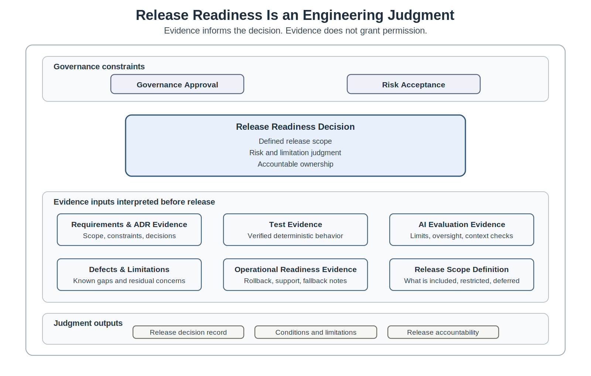
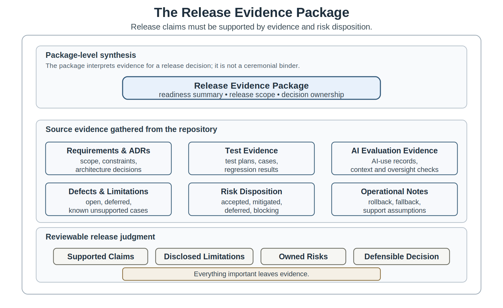
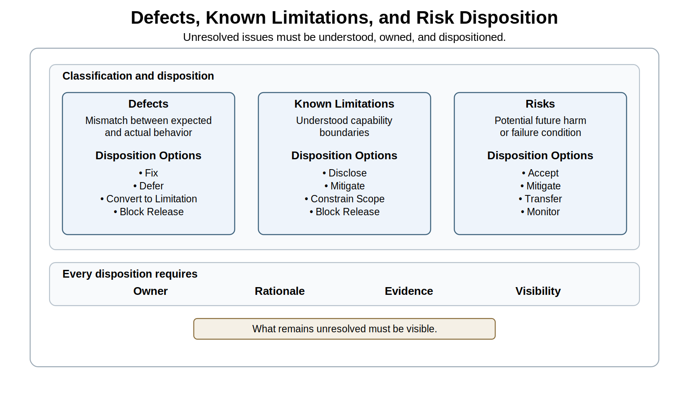
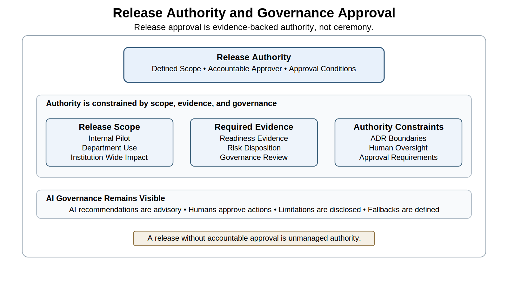
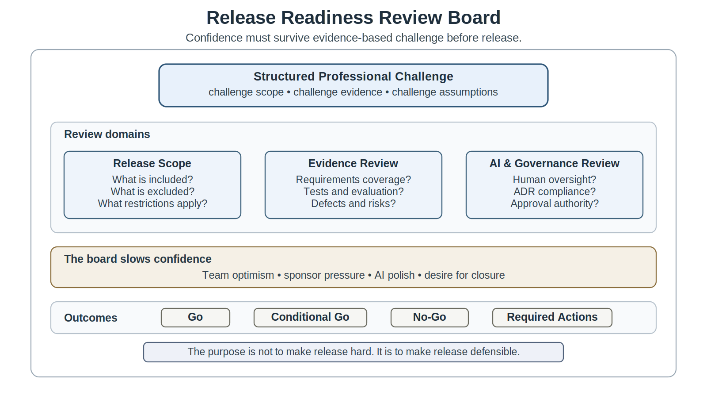

# Chapter 21 Release Readiness and Engineering Evidence

## Opening Scenario: The Evidence Exists - Now What Does It Mean?

COICP had evidence now.

That was new. It had not been true when the project began. At the beginning, the team had enthusiasm, stakeholder pressure, a plausible idea, and a desire to move quickly. Later, it gained requirements evidence, planning evidence, architecture decisions, ADRs, AI-use notes, pull requests, review comments, CI/CD results, test plans, evaluation records, defects, limitations, and review-board findings. The repository no longer looked like a place where code happened. It looked like a place where engineering judgment could be reconstructed.

That was progress.

It was not a release decision.

The team had just completed a round of testing and intelligent-system evaluation. The deterministic workflow behaved well in the main path. Intake validation worked. Required fields were checked. Routing workflow steps were tested. Several defects had been corrected. The AI-assisted routing recommendation behaved reasonably for routine Facilities incidents and acceptably for many mixed cases when staff retained final approval. Human override paths had been tested. Some context-boundary checks passed. CI ran consistently. The team could show test results under `/tests/`, evaluation records under `/tests/evaluation/`, review notes under `/docs/reviews/`, AI-use and evaluation evidence under `/docs/ai/`, ADRs under `/docs/adr/`, and the beginning of release evidence under `/release-evidence/`.

Then the release readiness review began.

The first question sounded simple: Is COICP ready to release?

Nobody answered immediately.

The problem was not that the team had no evidence. The problem was that evidence now had to be interpreted. Some defects remained. Some limitations were known. Some high-risk scenarios were acceptable only because trained staff would review and approve recommendations. Generated summaries were useful, but they still required human confirmation. One fallback path was documented but not rehearsed. The rollback plan existed, but nobody had walked through it. Release notes were incomplete. The first release scope was not yet precise. Governance approval might be required if AI-assisted routing suggestions influenced student-facing coordination.

The team was not deciding whether the system looked promising. It was deciding whether it could responsibly release a defined version of COICP under defined constraints, with known risks, visible limitations, operational support, and accountable ownership.

That is the Chapter 21 problem.

A release is a decision, not an event. A demo shows possibility. Green tests are evidence. They are not permission. Release readiness requires disciplined judgment about scope, evidence, risk, limitations, governance, operational controls, and accountability. The question is not, Are we done? The question is, Can we responsibly defend this release?

Chapter 21 teaches how release readiness becomes engineering evidence.

*Figure 21.1 — Release Readiness as Evidence-Based Judgment*

---

### 21.1 Release Readiness Is an Engineering Judgment

Release readiness is often misunderstood because release feels like the end of construction. The team has built features, fixed defects, run tests, passed CI, completed reviews, and demonstrated behavior. The natural temptation is to treat release as the next administrative step. That temptation is dangerous.

Release readiness is not a calendar milestone. It is not a deployment script. It is not a green pipeline. It is not stakeholder impatience. It is not the team’s feeling that the system is good enough. Release readiness is an evidence-backed engineering judgment about whether a defined system can be released for a defined purpose under known constraints.

That definition matters because every release creates consequence. A released system changes what users rely on, what operators must support, what governance bodies must own, what future engineers must maintain, and what failures the institution must absorb. Even a limited pilot changes responsibility. Once software leaves the protected space of development, it becomes part of an operational and organizational system.

For COICP, release readiness cannot mean that the intake form works on a developer laptop. It cannot mean that the demo path succeeds. It cannot mean that AI-assisted routing appears useful in several examples. It must mean that the team can explain what is being released, who will use it, what behavior has been verified, what intelligent behavior has been evaluated, what defects remain, what limitations are known, what operational controls exist, what rollback path is available, and who owns the release decision.

The repository is the control surface for that judgment. Release readiness should not live in a slide deck alone or in someone’s memory. It should be reconstructed from durable evidence: requirements, ADRs, tests, evaluation results, review records, CI/CD results, defect status, known limitations, risk disposition, AI-use records, operational notes, and a release decision record. A practical COICP repository might consolidate this evidence in `/release-evidence/readiness-summary.md` while linking back to `/tests/`, `/tests/evaluation/`, `/docs/adr/`, `/docs/ai/`, `/docs/reviews/`, and issue records.

This does not mean release readiness is paperwork. Paperwork records a decision after the fact. Engineering evidence supports the decision before it is made. The difference is crucial. The mature team does not ask, What document do we need so we can ship? It asks, What evidence do we have, what does it mean, what remains uncertain, and what release decision can we defend?

Green tests are evidence. They are not permission. CI/CD can tell the team what ran, what passed, what failed, and what changed. It can report conditions. It cannot authorize consequences.

It cannot decide whether unresolved risk is acceptable. It cannot decide whether an AI-assisted recommendation should be enabled in a student-facing workflow. It cannot decide whether staff training is sufficient. It cannot decide whether a known limitation must be disclosed to leadership. Those are engineering and governance judgments.

Evidence informs release decisions.

Authority owns them.

Release readiness begins when the team stops asking whether the system works in general and starts asking whether the specific release can be responsibly accepted.

---

### 21.2 Define the Release Scope

Readiness is always readiness for something. A team that says the system is ready without defining the release scope has not made a release-readiness claim. It has made a vague confidence claim.

Release scope names what is included, what is excluded, who will use the system, what environment will be used, what data is involved, what workflows are enabled, what AI-assisted behaviors are active, what restrictions apply, and what assumptions must hold. Without release scope, evidence cannot be interpreted. A defect may be irrelevant to one release and blocking for another. A limitation may be acceptable in a small internal pilot and unacceptable in a campus-wide rollout. An AI-assisted feature may be acceptable as advisory for trained staff and unacceptable as an automatic routing authority.

COICP makes this visible. The system might be ready for a limited pilot inside Campus Operations with trained coordinators reviewing all routing suggestions. It might not be ready for full LMU-wide use by all departments. It might be ready to accept incident intake records but not ready to send automated notifications. It might be ready to display AI-generated summaries as draft assistance but not ready to treat them as official incident descriptions. These are not minor distinctions. They define the release.

A release scope should be written plainly. It should identify the users, workflows, data boundaries, enabled features, disabled features, AI-assisted behaviors, operational support assumptions, governance constraints, and known exclusions. In a repository-centered workflow, this belongs in a release evidence artifact such as `/release-evidence/release-scope.md`. The point is not to create a long document. The point is to prevent scope fog.

Scope fog occurs when different people believe different releases are being discussed. Developers think they are releasing a pilot. Sponsors think they are receiving production capability. Users think all features are supported. Governance reviewers think AI recommendations are advisory. The interface makes them look authoritative. Operators think support will be minimal. Leadership assumes adoption will be immediate. Everyone is talking about release, but they are not talking about the same thing.

Defining release scope is therefore a trustworthiness act. It strengthens traceability because evidence can be mapped to what is actually being released. It strengthens accountability because approval is tied to a defined commitment. It strengthens governability because AI-assisted and authority-sensitive behavior can be included, excluded, or restricted explicitly.

The first serious release-readiness question is not whether the system is ready. It is: ready for what?

---

### 21.3 Build the Release Evidence Package

Once release scope is defined, the team can assemble the release evidence package. This package is the central artifact family of Chapter 21. It is not a ceremonial binder. It is the repository-based explanation of why a release decision can be made.

A release evidence package brings together evidence that is often scattered across the project. Requirements live under `/docs/requirements/`. Architecture decisions live under `/docs/adr/`. Architecture constraints may live under `/docs/architecture/`. Test plans, test cases, and regression evidence live under `/tests/`. Intelligent-system evaluation evidence may live under `/tests/evaluation/`. AI-use records and evaluation plans may live under `/docs/ai/`. Review findings live under `/docs/reviews/` and pull request discussions. Defects live in issues. CI/CD evidence lives in workflow runs and PR checks. Operational notes may begin under `/docs/operations/`. Release evidence collects and interprets those sources for a decision.

For COICP, a practical release evidence package might include:

- `/release-evidence/release-scope.md` for what is and is not included;
- `/release-evidence/readiness-summary.md` for the top-level readiness judgment;
- `/release-evidence/test-summary.md` for Chapter 19 testing evidence;
- `/release-evidence/ai-evaluation-summary.md` for Chapter 20 intelligent-system evaluation;
- `/release-evidence/defect-status.md` for open, closed, deferred, and blocking defects;
- `/release-evidence/known-limitations.md` for limitations that must be disclosed;
- `/release-evidence/risk-disposition.md` for accepted, mitigated, deferred, or blocking risks;
- `/release-evidence/rollback-plan.md` for rollback or fallback expectations;
- `/release-evidence/release-decision-record.md` for the final release decision and ownership.

The exact file names may evolve. The doctrine does not. Everything important leaves evidence. Release readiness must be visible enough that a future engineer, reviewer, instructor, sponsor, or operator can reconstruct why the release was approved, blocked, or conditionally accepted.

The release evidence package should avoid two failures. The first failure is evidence scattering. The team has evidence, but nobody can find it or understand how it supports the release. The second failure is evidence theater. The team creates documents because documents look mature, but the documents do not interpret risk, limitations, test gaps, AI behavior, or operational support. Both failures weaken release readiness.

A good release evidence package has a simple discipline: each release claim points to supporting evidence, and each major unresolved concern has a disposition. If a claim cannot be supported, it should be weakened, qualified, deferred, or removed. If a risk remains, someone must own it. If a limitation exists, it must be disclosed. If evidence is incomplete, the release decision must reflect that incompleteness.

A release evidence package turns readiness from confidence into reviewable judgment.

*Figure 21.2 — The Release Evidence Package*

---

### 21.4 Interpret Test and Evaluation Evidence

Testing and evaluation evidence do not speak for themselves. They must be interpreted.

This is where many teams make a subtle mistake. They report that tests passed, evaluation cases were run, and CI completed successfully. Those facts matter. But release readiness depends on what those facts mean for the release scope and risk profile. A passing result for routine workflow behavior does not answer whether high-risk ambiguous scenarios are safe enough. A successful summary evaluation does not answer whether staff understand that generated summaries require confirmation. A green CI run does not answer whether fallback behavior has been rehearsed.

Chapter 19 taught that testing produces disciplined behavioral evidence. Chapter 20 taught that intelligent and AI-assisted behavior requires scenario evaluation, context-boundary checks, oversight tests, adversarial cases, and risk disposition. Chapter 21 now requires synthesis. The release decision must connect those results to the release scope.

For COICP, the test summary might show strong evidence for required field validation, intake record creation, routing workflow state changes, audit-event persistence, and regression coverage for previously fixed defects. The AI evaluation summary might show acceptable routing recommendation behavior for routine Facilities incidents, mixed Facilities and Student Services cases, and several ambiguous cases when staff approval remains required. It might also show weaker behavior for rare high-risk cases, uncertainty communication, or incomplete reports.

That combination does not automatically mean Go or No-Go. It may mean Conditional Go. COICP might be ready for limited pilot release if AI-assisted routing remains advisory, staff must confirm generated summaries, high-risk categories require manual escalation, and known limitations are disclosed. The same evidence might not support a broader release.

Interpretation should be explicit in `/release-evidence/test-summary.md` and `/release-evidence/ai-evaluation-summary.md`. The summary should not merely list pass/fail counts. It should explain what behavior was verified, what behavior was partially verified, what remains untested, what results were inconclusive, and what those facts mean for the proposed release.

This is especially important for AI-assisted behavior. Intelligent-system evaluation produces evidence about behavior under selected scenarios. It does not prove universal correctness. A model can behave acceptably under the evaluation set and still fail later under different context, language, data drift, policy changes, or user behavior. Honest interpretation must preserve uncertainty.

Mature release readiness does not pretend evidence is stronger than it is. It states what the evidence supports and what it does not.

---

### 21.5 Defects, Known Limitations, and Risk Disposition

Defects are not embarrassing. Hidden defects are dangerous. Known limitations are not failure. Hidden limitations are failure.

A team that cannot discuss remaining defects honestly is not ready for release. Professional engineering does not require perfection. It requires clarity about what remains wrong, uncertain, limited, mitigated, deferred, accepted, or blocking. The purpose of release readiness is not to create the illusion that nothing remains unresolved. The purpose is to decide whether unresolved issues are acceptable for the defined release scope.

Defects and limitations need different treatment. A defect is a mismatch between expected and actual behavior. A known limitation is a capability, constraint, or boundary the system does not currently satisfy but that is understood, disclosed, and managed. A risk is a potential harm or failure condition that may or may not appear. Release readiness requires all three to be visible.

COICP might have a defect where a certain missing-location scenario produces an unclear validation message. That defect may be minor for a limited pilot. It might have a known limitation that generated summaries require staff confirmation and must not be treated as official incident records without review. That limitation is acceptable only if the interface, training, release notes, and workflow preserve it. It might have a risk that AI-assisted routing under rare safety-sensitive descriptions could under-escalate without human review. That risk requires mitigation or release restriction.

Risk disposition gives the team a vocabulary for decision-making. A risk can be accepted, mitigated, deferred, transferred, monitored, or treated as release-blocking. A defect can be fixed, deferred, converted into a known limitation, or treated as a blocker. A limitation can be disclosed, mitigated, constrained by scope, or used to block release. These dispositions must not be private reasoning. They belong in durable release evidence.

In a repository-centered COICP workflow, defect status may be tracked through issues and summarized in `/release-evidence/defect-status.md`. Known limitations should be stated in `/release-evidence/known-limitations.md`. Risk decisions should be preserved in `/release-evidence/risk-disposition.md`. If a risk is accepted, the owner and rationale should be visible. Risk acceptance without an owner is not maturity. It is accountability fog.

AI-assisted behavior requires particular honesty. If generated recommendations are advisory, the known limitations must say so. If the system does not guarantee policy alignment, the documentation must not imply that it does. If summaries may omit nuance, release notes and training must make staff confirmation mandatory. Fluent AI output must not be allowed to hide uncertainty.

A mature release does not claim that nothing is wrong. It demonstrates that what remains wrong, uncertain, incomplete, or constrained is understood, bounded, owned, and appropriate for the release scope.

Trustworthiness does not require the absence of unresolved issues.

It requires honest ownership of them.

*Figure 21.3 — Defects, Limitations, and Risk Disposition*

---

### 21.6 Operational Readiness Before Release

A system can be deployable and still not be operable.

This chapter does not fully enter the later operational-readiness, observability, runbook, incident-response, and recovery chapters. Those topics mature later in the book. But release readiness must still ask whether basic operational responsibility exists before the system is released.

The question is simple: if this release fails, behaves unexpectedly, confuses users, produces poor recommendations, or requires support, who knows what to do?

For COICP, operational readiness before release might include named support owners, a basic fallback procedure, a rollback plan, a communication path for staff issues, a way to disable or restrict AI-assisted recommendations, and a clear understanding of what incidents must be escalated manually. The first release does not need a mature enterprise operations center. It does need enough operational responsibility to avoid abandoning users after deployment.

A rollback plan is part of release evidence because release is not only forward motion. If COICP introduces a release that affects intake coordination, the team should know whether it can revert the application, disable specific features, turn off AI-assisted routing, restore prior configuration, or move temporarily to manual routing. A rollback plan stored in `/release-evidence/rollback-plan.md` does not prove recovery will be easy, but it makes recovery thinking visible before the release decision.

Fallback procedures matter especially for intelligent-system behavior. If routing recommendations are unavailable, low-confidence, disputed, or suspected of unsafe behavior, staff need a path forward. The fallback might be manual routing by trained coordinators. It might be escalation to a supervisor. It might be disabling recommendations for high-risk categories. These expectations can be introduced in `/docs/operations/fallback-procedures.md` or referenced from the release evidence package.

Operational support notes may begin under `/docs/operations/pre-release-support-notes.md`. Later chapters will deepen this into runbooks, observability, incident response, and operational learning. Chapter 21 only needs enough operational thinking to prevent release readiness from ending at test evidence.

A release that nobody can support is not ready. A release that cannot be rolled back or constrained may be irresponsible even if tests pass. A release that includes AI-assisted behavior without fallback planning is trusting the system more than the evidence allows.

Operational readiness begins before operations.

---

### 21.7 Governance, Approval, and Release Authority

Release approval is not ceremony. It is evidence-backed authority.

A team may build, test, evaluate, and document a system, but that does not mean it has authority to release every capability to every user. Governance-sensitive systems require clarity about who can approve release, what evidence they need, what risks they can accept, and what restrictions they can impose.

COICP is not a toy application. It affects institutional coordination. It may shape how staff triage incidents, route requests, summarize reports, communicate with departments, and respond to student-impacting situations. If AI-assisted routing suggestions influence those workflows, release authority must be explicit. The team cannot quietly enable consequential intelligent behavior because the implementation is complete.

Governance approval should be proportional to release scope and risk. A limited internal pilot with trained coordinators may require project sponsor approval and release-readiness review. A broader release involving AI-assisted routing visible across departments may require additional governance review. A release that changes authority boundaries, data use, notification behavior, or student-impacting workflows may require stronger approval.

This is where ADRs and prior governance evidence matter. Architecture decisions under `/docs/adr/` may define authority boundaries, context exclusions, fallback expectations, or human approval requirements. Chapter 21 must ensure those decisions are honored in the release evidence package. If the release violates an ADR, either the release must change or the decision must be revisited through an explicit decision process. Silent drift is not acceptable.

A release decision record belongs in `/release-evidence/release-decision-record.md`. It should state the decision, scope, evidence basis, known limitations, risk disposition, approval authority, conditions, and owners. For governance-sensitive releases, `/docs/reviews/release-readiness-review.md` should preserve the review-board challenge. Future repository structures may include `/docs/governance/approval-boundaries.md`, but Chapter 21 does not need to overbuild governance artifacts. It needs to show that release authority is an engineering concern.

AI governance must remain visible. If AI-assisted recommendations are enabled, the release record should say whether they are advisory, who approves final action, what limitations apply, what evaluation evidence exists, and what fallback exists. Release authority cannot be delegated to model confidence. The model is not the system. AI proposes; engineers verify. Governance is architecture.

A release without accountable approval is not mature engineering. It is unmanaged authority.

*Figure 21.4 — Release Authority and Governance Approval*

---

### 21.8 Release Readiness Review Board

The Release Readiness Review Board is the chapter’s central review mechanism. It exists to challenge whether the release decision is supported by evidence. It is not a theatrical meeting. It is not a rubber stamp. It is not a compliance exercise. It is a structured professional challenge before the team asks stakeholders to trust the release.

The review board should begin with release scope. What exactly is being released? Who will use it? What workflows are enabled? What AI-assisted behaviors are included? What is excluded? What restrictions apply? Without scope, the review cannot judge readiness.

Then the board examines evidence. What requirements are covered? What tests passed? What intelligent-system evaluation was performed? What scenario sets were used? What CI/CD evidence exists? What ADRs constrain the release? What defects remain? What limitations are known? What risks are accepted, mitigated, deferred, or blocking? What rollback path exists? What operational support exists? Who owns the decision?

The board should explicitly examine AI-assisted behavior. It should not allow AI evaluation to be buried as a technical appendix. If COICP includes routing recommendations, generated summaries, notification drafts, or explanation generation, the review board should ask what evidence supports those behaviors, what limitations remain, whether human oversight is meaningful, and whether the release scope restricts AI use appropriately.

The review board also protects the team from self-deception. Teams want closure. Students want to be done. Sponsors want progress. Developers want their work used. AI-generated artifacts can make the system look more polished than the evidence supports. Release readiness review slows the decision just enough to ask whether confidence has outrun evidence.

The review board should produce an outcome. It may recommend Go, No-Go, or Conditional Go. It may require mitigations, documentation changes, additional tests, scope reduction, training, rollback rehearsal, or governance approval. Those outcomes should be recorded under `/docs/reviews/release-readiness-review.md` and summarized in `/release-evidence/release-decision-record.md` once the decision is made.

The purpose is not to make release hard for its own sake. The purpose is to make release defensible. A team that can survive release-readiness review is better prepared for Chapter 22, where it must present and defend the evidence professionally.

*Figure 21.5 — Release Readiness Review Board*

---

### 21.9 Release Outcomes: Go, No-Go, Conditional Go

Release decisions are not binary optimism.

Immature teams often treat release as a yes-or-no question driven by confidence. Mature teams recognize that release decisions can have conditions, scope restrictions, mitigations, and staged paths. The three basic outcomes are Go, No-Go, and Conditional Go.

A Go decision means the evidence supports release within the stated scope. It does not mean the system is perfect. It means defects, risks, limitations, operational controls, and approvals are acceptable for the defined release. A Go decision should still preserve known limitations, support expectations, rollback information, and ownership.

A No-Go decision means the release is not responsible. The reason may be a blocking defect, insufficient test evidence, weak AI evaluation, unresolved governance approval, missing rollback plan, unclear scope, unacceptable risk, or operational unreadiness. A No-Go decision is not failure. It is mature engineering when evidence does not support release. Honest engineering is mature engineering.

A Conditional Go decision means release is allowed only under specified restrictions or mitigations. This is often the most realistic outcome for early enterprise releases. COICP might receive a Conditional Go for a limited pilot with trained staff, advisory-only AI recommendations, required human confirmation of generated summaries, manual escalation for high-risk categories, known limitation disclosure, and a required follow-up review after pilot evidence is collected.

Conditional Go is not a loophole. Conditions must be explicit, owned, and preserved. If the release is approved only for trained staff, the repository evidence should say so. If AI-assisted routing is advisory only, the interface, training, release notes, and governance records should align. If rollback must be available, the rollback plan must exist. If monitoring or manual review is required, the responsible people must be named.

The release decision record under `/release-evidence/release-decision-record.md` should state the outcome, scope, evidence basis, conditions, owners, risk disposition, and follow-up obligations. This record becomes future engineering memory. Later teams should not have to guess why the release happened or what constraints governed it.

A release decision is not an emotional finish line. It is an accountable engineering record.

---

### 21.10 Operational Takeaways

Release is a decision, not an event.

Readiness is scoped. A system is never simply ready in the abstract. It is ready, not ready, or conditionally ready for a defined release scope.

Evidence must be interpreted. Passing tests, successful evaluation scenarios, and green CI runs matter, but they do not decide release readiness by themselves.

Known limitations must be disclosed. Hidden limitations are more dangerous than honest limitations.

AI-assisted behaviors require explicit release evidence. Evaluation summaries, limitations, oversight controls, and fallback expectations must be visible.

Operational readiness matters before release. A release that cannot be supported, constrained, or rolled back may be irresponsible even if the software works.

Governance approval must be evidence-backed. Approval is not a ceremonial signature; it is accountable authority over release risk.

Conditional release is a mature option when evidence supports limited use under explicit constraints.

Everything important leaves evidence. Release scope, readiness summary, test evidence, AI evaluation, defects, limitations, risk disposition, rollback planning, review-board findings, and release decisions belong in the repository.

The question is not, Are we done? The question is, Can we responsibly defend this release?

---

## 21.11 Exercises

### Exercise 1: Define a Release Scope

Create the repository artifact:

`/docs/release_evidence/release_scope_definition.md`

Define a limited-release scope for COICP.

Document:

- Authorized users
- Enabled workflows
- Disabled features
- Data boundaries
- Included AI-assisted behaviors
- Operational assumptions
- Governance restrictions

Explain why the scope is appropriate for the available evidence and operational maturity.

### Exercise 2: Build a Release Evidence Package

Create the repository artifact:

`/docs/release_evidence/release_evidence_package.md`

Assemble a release-evidence package that includes references to:

- Testing evidence
- Intelligent-system evaluation results
- Defect status
- Known limitations
- ADRs
- AI-use evidence
- CI/CD results
- Rollback planning
- Review-board findings

Identify any evidence gaps that would weaken a release decision.

### Exercise 3: Interpret Release Evidence

Create the repository artifact:

`/docs/release_evidence/release_readiness_interpretation.md`

Review a set of testing results and intelligent-system evaluation results.

Document:

- What the evidence supports
- What remains uncertain
- What restrictions should accompany the release
- What additional evidence would increase confidence

Distinguish clearly between evidence and interpretation.

### Exercise 4: Document Known Limitations

Create the repository artifact:

`/docs/release_evidence/known_limitations_record.md`

Document at least three release limitations, including:

- One limitation involving AI-generated summaries
- One limitation involving routing recommendations
- One operational limitation

For each limitation, identify:

- Description
- Potential impact
- Mitigation approach
- Monitoring expectations
- Responsible owner

Evaluate whether the limitation is acceptable for the proposed release scope.

### Exercise 5: Perform Risk Disposition

Create the repository artifact:

`/docs/release_evidence/release_risk_disposition_record.md`

Review a set of remaining release risks.

Classify each risk as:

- Accepted
- Mitigated
- Deferred
- Monitored
- Blocking

For every accepted or mitigated risk, assign an owner and justify the chosen disposition.

Explain why ownership is required for responsible risk acceptance.

### Exercise 6: Create Rollback and Fallback Procedures

Create the repository artifacts:

`/docs/operations/recovery/release_rollback_plan.md`

`/docs/operations/recovery/release_fallback_procedures.md`

Document rollback and fallback procedures for a COICP pilot release.

Include the actions required if AI-assisted routing recommendations must be disabled while maintaining operational continuity.

Identify the evidence that would demonstrate successful recovery.

### Exercise 7: Evaluate AI Release Readiness

Create the repository artifact:

`/docs/governance/ai_governance/ai_release_readiness_record.md`

Prepare a release-readiness assessment for AI-assisted routing recommendations.

Document:

- Evaluation results
- Human-oversight controls
- Known limitations
- Release conditions
- Required restrictions
- Monitoring expectations

Determine whether the AI-assisted capability is ready, conditionally ready, or not ready for release.

### Exercise 8: Conduct a Release Readiness Review

Create the repository artifact:

`/docs/governance/reviews/release_readiness_review_record.md`

Conduct a structured Release Readiness Review using:

- Release scope
- Test evidence
- AI-evaluation evidence
- Defect status
- Known limitations
- Risk disposition
- Rollback planning
- Approval requirements

Document:

- Findings
- Evidence gaps
- Required corrective actions
- Owner assignments
- Open risks

Determine whether the release should proceed to approval review.

### Exercise 9: Make a Release Decision

Create the repository artifact:

`/docs/release_evidence/release_decision_record.md`

Using the provided release evidence, determine whether COICP should receive:

- Go
- Conditional Go
- No-Go

Document:

- Decision rationale
- Required conditions
- Assigned owners
- Follow-up actions
- Residual risks

Defend the decision using evidence rather than optimism.

### Exercise 10: Prepare for Release Defense

Create the repository artifact:

`/docs/release_evidence/release_defense_preparation_record.md`

Prepare the evidence package needed for a formal release defense.

Identify:

- Strongest evidence
- Weakest evidence
- Remaining risks
- Unresolved questions
- Likely stakeholder concerns
- Anticipated review-board challenges

Evaluate whether the release team can defend the release claim under evidence-based challenge.

---

### 21.12 Trustworthiness Mapping

Chapter 21 primarily strengthens accountability, reviewability, traceability, and governability.

Accountability is strengthened because release decisions must have owners. Risk acceptance must have owners. Known limitations must have owners. Conditional release constraints must have owners. A release without ownership is not a trustworthy release.

Reviewability is strengthened because release readiness must be inspectable. The release evidence package, review-board record, defect status, risk disposition, AI-evaluation summary, and release decision record allow future humans to challenge and reconstruct the decision.

Traceability is strengthened because release claims must connect back to requirements, ADRs, tests, evaluation results, CI/CD evidence, defect records, AI-use evidence, and known limitations. The release decision should not float above the repository. It should be anchored in it.

Governability is strengthened because release scope, approval authority, AI restrictions, operational conditions, and risk disposition turn release into a controlled decision rather than a momentum-driven event.

Secondary pillars also matter. Correctness appears through test and evaluation evidence. Human oversight appears through AI-assisted behavior constraints and approval boundaries. Recoverability appears through rollback and fallback planning. Operational visibility begins through support notes and readiness expectations. Security and privacy appear where release scope, context boundaries, data exposure, and authority-sensitive workflows require control.

Chapter 21 prevents checklist theater by requiring interpretation. It is not enough to have a release-scope file, a test-summary file, and a defect-status file. The team must explain what those artifacts mean. Artifact presence is not readiness. Evidence-backed judgment is readiness.

---

### 21.13 Closing Transition

By the end of Chapter 21, COICP has crossed an important threshold. It is no longer merely a system under construction. It is a candidate release that can be judged against evidence.

The team can define the release scope. It can assemble release evidence. It can interpret test and evaluation results. It can disclose defects and limitations. It can disposition risk. It can identify operational support expectations. It can preserve governance approval and release authority. It can record a Go, No-Go, or Conditional Go decision.

But deciding is not the same as explaining.

A release decision can be correct and still fail if the team cannot defend it. Stakeholders will not read the entire repository. Sponsors will not inspect every test. Governance reviewers will not reconstruct every ADR. Future engineers will not independently assemble the evidence package. The team must be able to explain what evidence exists, what it supports, what limitations remain, what risks were accepted, and why the decision is responsible.

That responsibility is not public relations.

It is engineering communication.

Chapter 21 teaches how a team reaches a release decision. Chapter 22 teaches how a team defends that decision to stakeholders, reviewers, sponsors, instructors, governance bodies, and future engineers.

Evidence created the decision.

Now the team must learn how to defend it.
