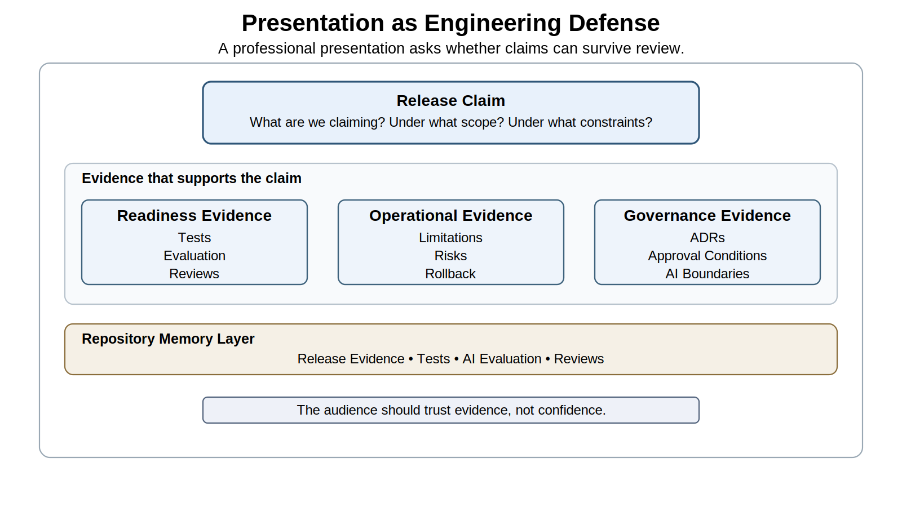
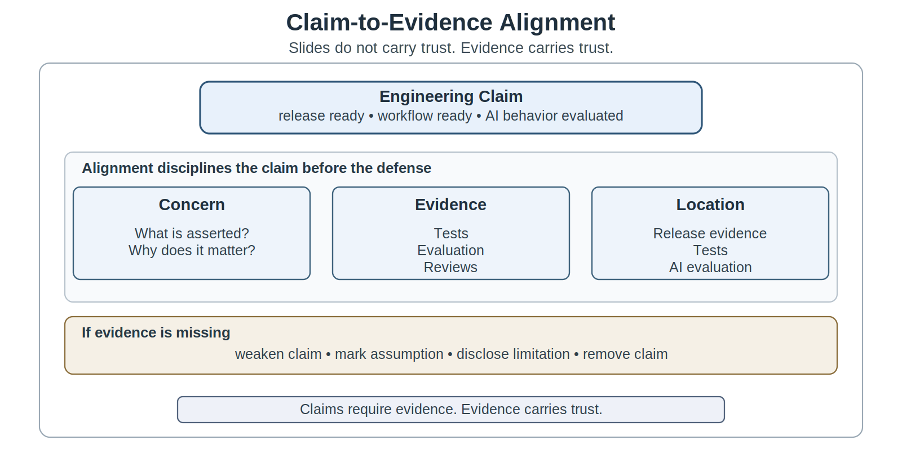
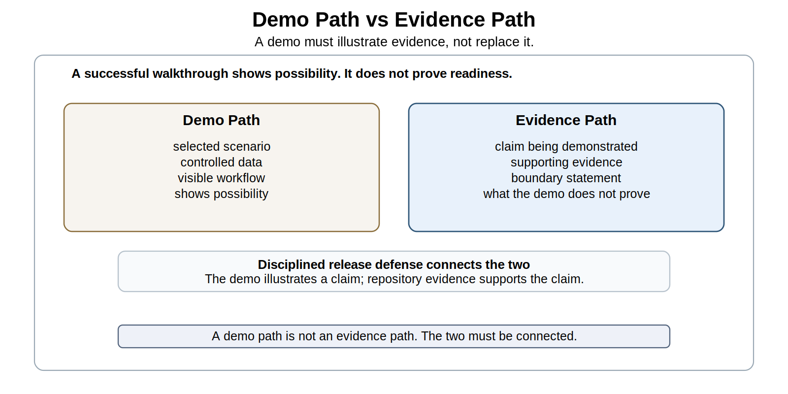
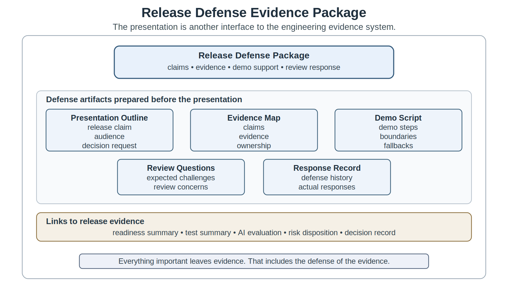
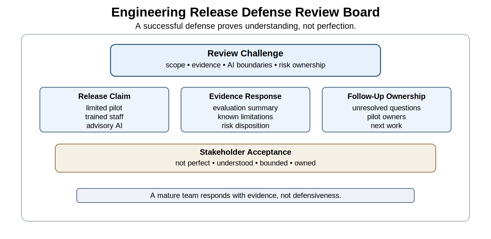

# Chapter 22 Engineering Presentations and Release Defense

## Opening Scenario: The Demo Is Ready. The Defense Is Not.

COICP was ready to be presented.

That sentence made the team more nervous than the release-readiness review had. The repository was stronger than it had ever been. Requirements were traceable. Architecture decisions were recorded. Pull requests had been reviewed. CI/CD runs were visible. Test summaries existed. Intelligent-system evaluation results had been preserved. Known limitations were written down. Risks had been dispositioned. The release scope was no longer vague. Chapter 21 had forced the team to stop asking whether the system looked finished and start asking whether a defined release could be responsibly defended.

Now the team had to defend it.

The audience was larger than the development team. Campus Operations wanted to know whether the platform would reduce coordination burden. Facilities wanted to know whether routing would be reliable enough to matter. Student Services wanted assurance that sensitive student-welfare concerns would not be mishandled. Campus Safety cared about escalation boundaries. IT leadership wanted to know what support obligations would follow. Governance and compliance representatives wanted to understand AI-assisted recommendations, auditability, privacy boundaries, and human approval. Future maintainers wanted to know where evidence lived. Project sponsors wanted a clear answer: is COICP ready for the pilot?

The team could have built a polished slide deck. It could have opened with a confident demo. It could have shown the happy path: submit an intake record, receive a routing suggestion, review the summary, assign the incident, and close the loop. That demo would probably work. It would probably impress people.

It would not be enough.

A demo shows possibility. It does not prove readiness. A slide deck can organize a story. It does not carry trust by itself. A confident presenter can reduce anxiety, but confidence without evidence is still weak engineering. At this point in the project, the team’s obligation was not to perform success. It was to make its engineering judgment inspectable.

That is the Chapter 22 problem.

Engineering presentations are not performances. They are professional defenses of evidence, judgment, risk, limitations, and readiness. The question is not whether the team can make COICP look good for twenty minutes. The question is whether the team can explain what it is claiming, what evidence supports the claim, what remains limited, what risks remain, what AI-assisted behavior is bounded, and who owns what happens next.

Presentation is not performance. Release defense is engineering accountability made visible.

---

## 22.1 Presentation Is Not Performance

Most students learn presentations as performance before they learn them as engineering. They are told to speak clearly, keep slides readable, manage time, divide roles, and avoid awkward pauses. Those skills matter. A disorganized presentation can bury good work. A confusing speaker can make strong evidence hard to understand. But presentation technique is not the center of an engineering defense.

In engineering, a presentation is a structured act of accountability. The team is not merely telling a story about what it did. It is making claims that others may rely on. It is asking stakeholders to accept evidence, understand risk, approve decisions, fund next steps, use a system, operate a workflow, or trust a release. That makes presentation a professional responsibility, not a communication exercise detached from the work.

COICP makes the difference visible. If the team says, 'The routing workflow is ready,' that statement must mean something precise. Ready for whom? Ready under what release scope? Ready with which AI-assisted behaviors enabled? Ready with what human review? Ready despite which known limitations? Ready based on which tests and evaluations? If the presentation cannot answer those questions, the word ready is doing more work than the evidence.

A professional presentation therefore begins with restraint. The team should not open by trying to prove that everything is impressive. It should frame the release claim. For COICP, a mature opening might say: 'We are defending readiness for a limited pilot with trained staff review, advisory AI-assisted routing, human approval before action, known limitations disclosed, and rollback and follow-up owners identified.' That statement is less flashy than 'COICP is ready.' It is also much more trustworthy.

The repository matters here because it prevents the presentation from becoming a temporary performance. Claims should be traceable to durable evidence. A readiness claim should connect to `/release-evidence/readiness-summary.md`. A testing claim should connect to `/release-evidence/test-summary.md` or the relevant records under `/tests/`. A claim about intelligent behavior should connect to `/release-evidence/ai-evaluation-summary.md`, `/docs/ai/evaluation-plan.md`, or evidence under `/tests/evaluation/`. A claim about limitations should connect to `/release-evidence/known-limitations.md`. The presentation is the spoken and visual layer. The repository is the memory layer.

This does not mean the presenter reads file paths aloud for every sentence. That would be tedious and would turn the defense into a repository tour. It means every important claim has an evidence path the team can show, cite, or explain when challenged. The audience should sense that the presentation is backed by an engineering record, not by speaker confidence.

Presentation-as-performance asks, 'How do we look?' Presentation-as-defense asks, 'Can our claims survive review?' That is the maturity shift this chapter requires.

*Figure 22.1 — Presentation as Engineering Defense*

---

## 22.2 The Release Defense Mindset

Release defense is the professional act of explaining why a defined release decision is responsible. It is not the same as a product pitch, demo day, sprint review, status update, or sales presentation. Those formats may have useful techniques, but they are not sufficient for a professional release decision. Release defense must make engineering judgment visible.

A release defense answers six questions.

What are we claiming?

What evidence supports the claim?

What remains uncertain?

What limitations or defects remain?

What risks were accepted, mitigated, deferred, or blocked?

Who owns the next consequences?

A team that cannot answer these questions is not defending readiness. It is narrating progress.

Chapter 21 taught that release readiness is scoped. Chapter 22 inherits that discipline. The COICP team is not defending the idea that the system is universally ready for all departments, all users, all incident types, and all future operational conditions. It is defending a release posture. That posture might be a limited pilot. It might include trained staff only. It might keep AI-assisted routing advisory. It might disable automated notification in high-risk categories. It might require human confirmation before any routing action is executed. The defense must make those boundaries clear.

The release-defense mindset also changes how teams talk about imperfection. In weak presentations, limitations are minimized because the team fears looking unprepared. In mature engineering presentations, limitations are named because hidden limitations are dangerous. The team is not trying to appear flawless. It is trying to show that it understands the system well enough to release responsibly within known boundaries.

This mindset is especially important in AI-assisted systems. AI behavior can sound impressive even when evidence is thin. A generated summary can look professional while omitting material context. A routing recommendation can appear plausible while missing a governance boundary. A confidence score can create false reassurance. A polished explanation can make weak evidence sound stronger than it is. Release defense must slow this down. The team must explain what AI-assisted behavior exists, how it was evaluated, where human oversight applies, and what the system is not allowed to decide.

A good release defense therefore has a controlled confidence. It does not apologize for engineering discipline. It does not hide uncertainty. It does not overstate evidence. It does not bury AI risk in technical detail. It says what is known, what is supported, what is limited, and what is owned.

The central mental model is simple: the presentation is not the evidence. The presentation is the defense of the evidence.

---

## 22.3 Know the Audience Without Diluting the Truth

Engineering presentations usually fail in one of two ways. Some are so technical that stakeholders cannot understand the judgment being defended. Others are so simplified that engineering truth disappears. Chapter 22 rejects both failures. The professional responsibility is to adapt the explanation without weakening the truth.

The COICP release-defense audience is mixed. Campus Operations wants clarity about workflow adoption. Facilities wants to know whether routing will reduce noise or create new confusion. Student Services wants to know whether sensitive concerns will be protected. Campus Safety wants confidence that urgent issues are escalated appropriately. IT leadership wants operational implications. Governance and compliance representatives want authority, privacy, auditability, and AI boundaries. Future maintainers want evidence locations and ownership. These audiences do not need the same level of detail, but they do need the same honest release claim.

Audience awareness begins by separating what changes from what does not. The vocabulary may change. The examples may change. The depth may change. The order may change. The truth must not change. If the team tells leadership that the AI routing feature is 'ready' while telling governance that it is 'advisory and limited,' the presentation has created trust damage. If the team tells users that known limitations are minor while telling maintainers that those limitations require close monitoring, the team has split operational truth. That is not communication skill. That is governance drift.

A strong presentation should therefore maintain a stable evidence spine. The same release scope, test evidence, AI-evaluation evidence, limitations, risk disposition, and ownership commitments should support every audience-specific explanation. The team may explain the same evidence differently, but it should not create different versions of readiness.

For students, this is a major professional shift. They often think a presentation is successful when the audience feels good at the end. In engineering, that is not enough. A presentation is successful when the audience understands the claim accurately enough to make responsible decisions. Sometimes that means the audience feels less excited but more informed. That is a better outcome than false confidence.

The repository helps preserve this truth. A release-defense evidence map under `/release-defense/evidence-map.md` can identify the claims the team plans to make, the audience concerns each claim addresses, and the repository evidence supporting each claim. This artifact prevents the team from improvising readiness differently for different stakeholders.

Audience-aware engineering communication is not simplification theater. It is disciplined translation.

---

## 22.4 Claims Must Be Evidence-Backed

Every important engineering presentation contains claims. Some are explicit: 'The release is ready for pilot use.' Some are implicit: 'The demo path represents normal behavior.' Some are visual: a green checkmark beside testing, a dashboard screenshot, or a slide that says 'AI routing validated.' Some are created by omission: if limitations are not shown, the audience may assume none matter.

Chapter 22 requires students to treat claims as engineering objects. A claim is not mature merely because it is true in someone’s mind. It becomes professionally defensible when the team can connect it to evidence. The claim-evidence relationship is the central discipline of release defense.

Consider a weak COICP claim: 'Testing passed.' The phrase is too broad. What testing? Which release scope? Which workflow? Which risk areas? What failed first? What defects remain? What manual checks were done? What intelligent behavior was evaluated separately? A stronger claim would be: 'For the limited pilot scope, required-field validation, intake record persistence, basic routing workflow, staff review, and regression paths passed the Chapter 19 test set; known gaps are listed in `/release-evidence/known-limitations.md`, and intelligent routing behavior is covered separately in the AI-evaluation summary.'

That stronger claim is longer, but it is not bloated. It is more precise because it tells the audience what the evidence actually supports. It also separates deterministic testing from intelligent-system evaluation, preserving the Chapter 19 and Chapter 20 distinction.

A release defense should include a claim-evidence map. It does not have to be shown in full during the presentation, but the team should build it. A practical artifact under `/release-defense/evidence-map.md` might include columns for claim, audience concern, supporting evidence, repository location, unresolved limitation, owner, and likely review-board challenge. This map disciplines the presentation before it is delivered.

Evidence-backed claims also protect the team from accidental overstatement. If the team cannot identify supporting evidence, it should weaken the claim, mark it as an assumption, disclose it as a limitation, or remove it. This is not pessimism. It is honest engineering.

The release defense should make the audience believe the team understands the evidence, not merely that the team rehearsed the story. Claims require evidence. Slides do not carry trust. Evidence carries trust.

*Figure 22.2 — Claim-to-Evidence Alignment*

---

## 22.5 Demonstrations Must Prove Claims, Not Distract From Them

The demo is the most dangerous part of many engineering presentations because it feels concrete. People trust what they can see. A workflow that appears to work on screen creates emotional confidence even when the evidence behind it is narrow. That is why demo theater is such a persistent anti-pattern.

A demo becomes theater when the team uses a successful path as a substitute for evidence. The path may be real, but it is selected, staged, controlled, and narrow. The team chooses the input, environment, data, timing, user role, and expected outcome. A successful walkthrough shows that this one path can work under these conditions. It does not show that the system is ready for operational use.

In a release defense, the demo must be disciplined by claims. If the team claims that COICP supports staff review of AI-assisted routing, the demo should show the recommendation, explanation, human review action, override or confirmation path, and audit evidence. If the team claims that sensitive information is not echoed into generated summaries, the demo should show a scenario that tests that boundary or explain where the evidence is preserved. If the team claims that known limitations are understood, the demo may deliberately show a disabled or restricted capability rather than pretending everything is enabled.

This is a hard lesson for students. They naturally want the demo to go smoothly. They may avoid showing edge cases because they fear appearing weak. But a mature engineering demo is not a magic trick. It does not hide the mechanism. It illustrates the evidence. Sometimes the strongest demo moment is not a perfect workflow but a visible control: an override, an audit record, an escalation path, a rejection of overconfident AI output, or a limitation boundary.

The team should prepare a demo script under `/release-defense/demo-script.md`. The script should include the claim being demonstrated, setup conditions, repository evidence linked to the claim, expected behavior, fallback if the demo fails, and what the demo does not prove. The last item matters. Every demo should have a boundary statement. For example: 'This walkthrough demonstrates advisory routing review and audit capture for a routine Facilities incident. It does not demonstrate high-risk Student Services escalation; that is covered by the AI-evaluation scenario set.'

A demo that admits what it does not prove is more trustworthy than a demo that implies too much. The goal is not to reduce confidence. The goal is to align confidence with evidence.

A demo path shows behavior.

An evidence path explains why the team trusts that behavior.

In a release defense, both are required.

*Figure 22.3 — Demo Path vs Evidence Path*

---

## 22.6 Defending Requirements and Scope

Release defense begins with scope because evidence cannot be interpreted without knowing what the release includes. Chapter 21 established this principle for release readiness. Chapter 22 requires the team to explain it clearly to others.

For COICP, scope is not obvious. A stakeholder may hear 'release' and imagine campus-wide availability. A developer may mean a limited pilot. A governance reviewer may assume AI recommendations are advisory. A user may assume routing actions are authoritative. A maintainer may assume the initial release includes support procedures. Scope fog creates false agreement. The presentation must remove it.

The team should explain what is in scope, what is out of scope, what is restricted, and what is deferred. This should be tied to requirements evidence. A release-defense presentation might show a small table of core pilot capabilities: intake record creation, staff review, advisory routing recommendation, generated draft summary, manual assignment, audit capture, and known restrictions. It should also name excluded capabilities: autonomous routing, automated high-risk escalation, public self-service expansion, or unsupported departments.

Requirements defense should not become a requirements-document walkthrough. The team should focus on the requirements that justify the release claim. Which stakeholder needs were satisfied? Which acceptance criteria are met? Which requirements were deferred? Which assumptions still matter? Which requirements became release restrictions? The repository can hold the full detail under `/docs/requirements/`, while the presentation surfaces the release-relevant truth.

This section also teaches students to defend tradeoffs. A release scope is not a confession that the system is incomplete. It is an engineering boundary. A limited pilot may be more trustworthy than a broad release because it aligns capability, evidence, support, and risk. The team should be able to say why the scope is responsible.

Requirements and scope defense strengthens traceability. Stakeholders can see the path from need to acceptance criteria to test evidence to release claim. It also strengthens accountability because the team is not asking for vague approval. It is asking stakeholders to understand and accept a defined commitment.

The next step is to show that the system structure and decisions support that commitment. Scope says what is being defended. Architecture explains how the system is shaped to support it.

---

## 22.7 Defending Architecture and ADRs

Architecture often disappears from final presentations. Teams show features, user interfaces, and test results, but they do not explain the decisions that made the system safe, maintainable, governable, or limited. That omission is especially damaging in AI-assisted systems because risk often lives in boundaries: what the AI can see, what it can suggest, what it cannot decide, who approves action, what is logged, and what fallback exists.

Chapter 22 requires architecture to appear as evidence. The team does not need to present every diagram or ADR. It needs to defend the decisions that matter for readiness. For COICP, those may include the separation between intake record storage and routing recommendation, advisory status of AI output, human approval before assignment, excluded context sources, audit logging, role-based access, fallback behavior, and department-specific routing constraints.

ADRs are particularly useful in release defense because they show that decisions were not accidental. An ADR can explain why AI-assisted routing remains advisory for the pilot, why generated summaries require human confirmation, why certain data sources were excluded, or why automated notifications were deferred. The presentation can cite representative ADRs under `/docs/adr/` without turning the defense into a document inventory.

A mature architecture defense also names rejected alternatives. Stakeholders often need to know why a more exciting option was not chosen. Why not automate routing fully? Why not allow the model to use all historical incident text? Why not send notifications immediately after AI classification? The answer should not be 'we ran out of time.' It should be an engineering explanation involving authority, privacy, evidence, oversight, testability, recoverability, and release scope.

Architecture defense strengthens governability because it makes control boundaries visible. It strengthens reviewability because future maintainers can inspect why decisions were made. It strengthens human oversight because the presentation can show where human judgment remains active. It also strengthens AI governance because the model is not presented as the system. The system includes context, workflow, user interface, approval, audit, repository evidence, and accountable human roles.

The architecture portion of the presentation should answer one question: what design decisions make this release defensible? If the team cannot answer that, its readiness claim is incomplete.

Once architecture has been defended, the presentation can move from structure to evidence of behavior: testing and evaluation.

---

## 22.8 Defending Testing and Evaluation Evidence

Testing and evaluation evidence are easy to overcompress in presentations. A team may show a slide that says 'Tests passed' or 'AI evaluation complete.' Those phrases are too weak for release defense. They hide the difference between deterministic tests, scenario tests, manual checks, regression evidence, intelligent-system evaluation, context-boundary tests, oversight tests, and known gaps.

Chapter 22 inherits Chapter 19 and Chapter 20 directly. The team must explain what was verified and what was evaluated. Verification and evaluation are related, but they are not identical. Required fields, permission checks, intake persistence, notification formatting, and basic workflow transitions may have clearer pass/fail expectations. AI-assisted routing recommendations, generated summaries, escalation suggestions, and uncertainty communication require scenario-based evaluation and judgment.

A strong COICP release defense should summarize testing evidence by claim, not by tool. Instead of listing frameworks, the team should explain the behaviors that were challenged. For example: 'We verified intake validation, staff review workflow, routing assignment, audit capture, and regression paths. We evaluated AI-assisted routing across routine, ambiguous, mixed-responsibility, and high-risk scenarios. We tested oversight by requiring staff approval before action and preserving override evidence.'

The team should also explain failures. What failed during testing? Which defects were corrected? Which defects remain? Which regression tests were added? Which limitations were accepted because of release scope? Mature teams do not hide defects. They show how defect evidence improved engineering judgment.

Repository evidence matters here. The presentation should be supported by `/release-evidence/test-summary.md`, `/release-evidence/ai-evaluation-summary.md`, `/tests/traceability-matrix.md`, `/tests/regression/`, `/tests/evaluation/`, defect issues, and CI/CD run evidence. The presentation should not force stakeholders to inspect all those artifacts live, but the team should be ready to navigate to them if challenged.

AI evaluation requires special care. The team should not say 'The AI works.' It should say what behavior was evaluated, against what criteria, using what scenario families, with what limitations, and under what human oversight. It should disclose whether the evaluation supports advisory use, restricted use, or exclusion from release scope.

Testing evidence answers whether behavior was challenged. Evaluation evidence answers whether intelligent behavior is acceptable under defined conditions. Release defense explains both without exaggeration.

---

## 22.9 Defending AI Use and AI-Governance Decisions

AI appears in Chapter 22 in two forms. First, AI may have assisted the engineering work: requirements drafting, issue descriptions, code scaffolding, tests, documentation, PR summaries, release notes, or presentation preparation. Second, AI may exist inside COICP as intelligent behavior: routing recommendations, generated summaries, notification drafts, or escalation suggestions. Both forms require explanation. Neither should be hidden.

AI-use disclosure is not a confession. It is evidence of professional control. The team should explain where AI helped, how outputs were reviewed, what was modified, what was rejected, and what evidence was preserved. Relevant records may live in `/docs/ai/ai-use-log.md`, PR descriptions, review notes, or release-evidence summaries. The goal is not to list every prompt. The goal is to show that AI-assisted artifacts did not bypass human understanding and verification.

AI-enabled behavior requires even more care because stakeholders may misunderstand what the system is doing. If COICP provides routing recommendations, the presentation must say whether those recommendations are advisory or authoritative. If generated summaries are displayed, the team must say who verifies them before they become operational records. If escalation suggestions appear, the team must say what human approval is required and what happens when the recommendation is uncertain or wrong.

The team must avoid two opposite errors. The first is AI hype: presenting AI behavior as smarter, safer, or more autonomous than evidence supports. The second is AI minimization: burying AI influence so stakeholders do not ask hard questions. Both weaken trust. Mature AI governance is neither hype nor avoidance. It is clear bounded explanation.

A strong release defense might say: 'AI-assisted routing is included only as advisory support for trained staff during the pilot. The model does not assign incidents, notify departments, or escalate cases without human confirmation. Evaluation evidence is summarized in `/release-evidence/ai-evaluation-summary.md`. Known limitations include mixed-responsibility cases and sensitive welfare language, which require staff review and are documented in `/release-evidence/known-limitations.md`.'

That statement is not glamorous. It is trustworthy. It shows context control, authority boundaries, human oversight, evidence, and limitation disclosure.

Chapter 22 reinforces the doctrine that AI proposes and engineers verify. In release defense, that doctrine must be understandable to non-developers without becoming simplistic.

---

## 22.10 Defending Risks, Limitations, and Known Gaps

The most mature part of an engineering presentation is often the limitations section. That may seem counterintuitive. Students often believe limitations weaken a presentation. In professional engineering, the opposite is usually true. Clear limitations show that the team understands its system, respects stakeholders, and is not asking others to trust more than the evidence supports.

The difference between a limitation and an excuse is ownership. An excuse explains why something is not done. A limitation explains what is true, what consequence it has, what mitigation exists, and who owns follow-up. Chapter 22 should train students to speak in that second mode.

COICP might have several known limitations. AI-assisted routing may be less reliable in mixed-responsibility cases. Generated summaries may require confirmation when sensitive student information appears. Fallback procedures may be documented but not yet exercised under operational pressure. Some integrations may be mocked for the pilot. Some departments may be outside initial scope. These limitations do not automatically block release. But they must be visible, mapped to release scope, and owned.

Risk defense requires similar discipline. A risk is not mature because it is mentioned. It becomes useful when it is dispositioned. Was it accepted, mitigated, deferred, transferred, monitored, or treated as a blocker? Who owns it? What evidence would change the decision? Where is the record? For COICP, `/release-evidence/risk-disposition.md` and `/release-evidence/known-limitations.md` should support this part of the defense.

The presentation should not drown stakeholders in every minor issue. It should highlight release-relevant limitations and risks: those affecting safety, privacy, authority, human oversight, operational support, stakeholder expectations, AI behavior, recovery, or release scope. Minor technical cleanup can remain in issue records if it does not materially affect readiness.

The key emotional move is from embarrassment to stewardship. A team that hides limitations is still performing. A team that explains limitations with evidence and ownership is practicing trustworthy engineering.

Known limitations are not failure. Hidden limitations are failure.

---

## 22.11 The Engineering Release Defense Review Board

Part II has used review boards as structured professional challenge mechanisms. Chapter 22 introduces the Engineering Release Defense Review as the capstone review mechanism for the construction arc. It does not replace the Release Readiness Review Board from Chapter 21. It inherits its outputs and asks whether the team can defend them accurately, honestly, and professionally.

The board’s job is not to reward presentation polish. It challenges claims. It asks what evidence supports readiness, what the demo proves and does not prove, what AI-assisted behavior remains bounded, what limitations remain, what risks are accepted, and who owns follow-up. It watches for overclaiming, ambiguity, hidden AI influence, unsupported readiness claims, and demo theater.

A practical Engineering Release Defense Review might use a simple structure. First, the team states the release claim and scope. Second, it demonstrates a representative workflow tied to evidence. Third, it presents testing and evaluation summaries. Fourth, it explains architecture and AI governance boundaries. Fifth, it discloses limitations, risks, and ownership. Sixth, the board challenges the claim. Seventh, the team records questions, answers, evidence gaps, and follow-up actions.

The review should produce evidence. A response record under `/release-defense/response-record.md` can preserve questions asked, answers given, evidence referenced, open concerns, owners, and required revisions. This is important because presentations often disappear after delivery. The defense itself should leave evidence.

The possible outcomes should be explicit. The board may accept the defense, accept it with conditions, require revision, identify an incomplete evidence package, or reject the release claim. These outcomes are not grading categories only; they model professional release governance. A conditional defense is not failure if conditions are clear and owned.

The board strengthens engineering judgment because it forces the team to reason under challenge. It is easier to build a narrative than to defend a claim. The review board makes the difference visible.

This review mechanism closes the Part II sequence: work was launched, evidenced, reviewed, tested, evaluated, readied, and now defended.

---

## 22.12 Building the Release Defense Package

A strong release defense should be prepared as an artifact family, not improvised as slides the night before. The release defense package is the repository-backed structure that supports the presentation and preserves what was claimed.

This package should not become a slide-design bureaucracy. Its purpose is to connect claims, evidence, demo steps, risks, limitations, and review-board responses. The package exists because future engineers, stakeholders, and instructors may need to reconstruct what the team said and what evidence supported it.

A practical COICP repository might include `/release-defense/presentation-outline.md`, `/release-defense/evidence-map.md`, `/release-defense/demo-script.md`, `/release-defense/review-board-questions.md`, and `/release-defense/response-record.md`. These artifacts should link to `/release-evidence/readiness-summary.md`, `/release-evidence/test-summary.md`, `/release-evidence/ai-evaluation-summary.md`, `/release-evidence/defect-status.md`, `/release-evidence/known-limitations.md`, `/release-evidence/risk-disposition.md`, and `/release-evidence/release-decision-record.md`.

The presentation outline should identify the release claim, audience, sequence, major evidence points, demo role, risk disclosure, and decision request. The evidence map should ensure every important claim has support. The demo script should align demo steps with claims and identify what the demo does not prove. The review-board questions file should anticipate likely challenges. The response record should preserve the actual defense.

This structure teaches students that professional communication is part of engineering work. The presentation is not separate from the repository. It is another interface to the engineering evidence system.

The release defense package also prevents last-minute overclaiming. When students build slides without an evidence map, they often drift toward confident statements. When they build slides from evidence, they are more likely to preserve scope, uncertainty, and ownership.

Everything important leaves evidence. That includes the defense of the evidence.

*Figure 22.4 — Release Defense Evidence Package*

---

## 22.13 LMU Release Defense Scenario

The COICP team enters the LMU release defense with a simple goal: secure stakeholder understanding and acceptance for a limited pilot. That goal sounds modest. It is actually demanding. The team must defend scope, evidence, AI boundaries, limitations, risks, and follow-up without overwhelming the audience or hiding complexity.

The team opens by defining the release claim. COICP is ready for a limited pilot with trained staff users, advisory AI-assisted routing, human approval before operational action, known limitations disclosed, and follow-up ownership identified. This opening immediately prevents scope fog.

Next, the team summarizes the evidence chain. Requirements came from stakeholder needs and acceptance criteria. Architecture decisions established responsibility boundaries and AI authority limits. ADRs preserved consequential decisions. Pull requests and CI/CD captured change evidence. Testing verified core workflow behavior. Intelligent-system evaluation challenged AI-assisted routing and generated summaries across scenario families. Release readiness integrated the evidence into a conditional readiness posture.

Then the team demonstrates a representative workflow. It submits an intake record, shows the advisory routing suggestion, explains why the recommendation is not authoritative, shows staff review, modifies a generated summary, records an assignment decision, and points to audit evidence. The team explicitly states what the demo proves and what it does not prove.

The review board asks hard questions. What happens when an incident belongs to both Facilities and Student Services? Can the AI recommendation route directly to Campus Safety? What sensitive information might appear in generated summaries? What defects remain? What fallback exists if recommendations appear unreliable? What evidence supports staff readiness? Who owns follow-up after the pilot begins?

A weak team would respond defensively. A mature team responds with evidence. It points to the AI-evaluation summary, known limitations, risk disposition, ADRs, and release decision record. It acknowledges that mixed-responsibility cases remain a limitation requiring staff judgment. It confirms that AI output is advisory. It identifies owners for follow-up. It does not pretend uncertainty is gone.

By the end, LMU stakeholders do not believe COICP is perfect. They believe something better: the team understands what it has built, what it has not built, what evidence supports the pilot, what remains risky, and who owns the next work. That is a successful engineering release defense.

*Figure 22.5 — Engineering Release Defense Review Board*

---

## 22.14 Operational Takeaways

The first takeaway is that presentation is not performance. Professional engineers present so their judgment can be inspected. Polish helps only when it clarifies evidence. Polish that hides uncertainty is dangerous.

The second takeaway is that a demo is not operational proof. A demo can illustrate evidence, but it cannot replace testing, evaluation, release scope, risk disposition, or operational ownership. Teams should design demos to support claims, not distract from weak evidence.

The third takeaway is that claims require evidence. Every major statement in a release defense should trace to repository evidence, even if the presentation does not show every artifact. Unsupported claims should be weakened, reframed, or removed.

The fourth takeaway is that limitations strengthen credibility when they are honest, specific, and owned. Hidden limitations damage trust. Known limitations with status, consequence, mitigation, and owner demonstrate maturity.

The fifth takeaway is that AI use must be transparent and bounded. AI-assisted engineering work and AI-enabled system behavior both require explanation. Stakeholders should understand what AI influenced, what humans verified, what AI cannot decide, and what evidence supports AI-related claims.

The sixth takeaway is that repository-centered engineering extends into communication. The repository is not only where the team builds. It is where the team preserves the evidence needed to defend what it built.

The final takeaway is that release defense closes the construction arc but does not end engineering. Once a release is defended, the system enters operational reality. That is where Part III begins.

---

## 22.15 Transition to Part III

Part II began by asking how a team should build responsibly. It moved through launch standards, repository evidence, requirements, AI-assisted validation, planning, architecture, ADRs, implementation, pull requests, CI/CD, AI-generated-system review, testing, intelligent-system evaluation, release readiness, and release defense. Chapter 22 is the final act of that arc.

The team has now done more than build COICP. It has made its work reviewable. It has preserved decisions. It has tested behavior. It has evaluated intelligent features. It has disclosed limitations. It has defended readiness. That is a major professional achievement.

It is not the end.

A defended release still has to meet operational reality. Users will misunderstand workflows. Defects will surface. AI-assisted behavior will encounter cases the evaluation set did not fully anticipate. Logs may be insufficient. Runbooks may be incomplete. Support assumptions may be tested. Governance boundaries may need refinement. Trust will not be preserved by the memory of a strong presentation. It will be preserved by learning, stabilization, observability, operational readiness, security, AI governance, reliability, incident response, release governance, and transparency.

That is why Part III begins with postmortems and engineering learning. The first operational lesson is not that failure means the team was incompetent. The lesson is that release defense must become operational learning. A trustworthy engineering organization does not merely defend readiness once. It keeps learning from reality.

Chapter 22 hands Part III a clear inheritance: release scope, evidence claims, known limitations, risk ownership, AI-governance boundaries, stakeholder expectations, and review-board questions. Part III must not repeat how to build the release evidence package. It must show what happens when that evidence encounters operational reality.

That transition matters because operational trust is not preserved by successful presentations, completed releases, or confident demonstrations. It is preserved by what happens afterward: learning, observation, correction, governance, accountability, and adaptation.

Once the defense is complete, engineering does not stop.

It changes form.

That transition matters because operational trust is not preserved by successful presentations, completed releases, or confident demonstrations. It is preserved by what happens afterward: learning, observation, correction, governance, accountability, and adaptation.

Once the defense is complete, engineering does not stop.

It changes form.

---

## 22.16 Exercises

### Exercise 1: Build a Claim-Evidence Map

Create the repository artifact:

`/docs/release_evidence/evidence_map.md`

Identify five release-readiness claims for COICP.

For each claim, document:

- The claim being made
- Supporting repository evidence
- Stakeholder concern addressed
- Associated limitation or risk
- Responsible owner
- Follow-up questions a reviewer might ask

Evaluate whether each claim is fully supported, partially supported, or insufficiently supported by the available evidence.

### Exercise 2: Revise a Weak Demo Plan

Review a demo plan that presents only the happy path.

Rewrite the plan so that each demonstration step:

- Supports a specific release-readiness claim
- References supporting evidence
- Identifies relevant limitations
- States what the demonstration does not prove

Explain how the revised plan improves the credibility of the release defense.

---

### Exercise 3: Prepare a Known-Limitations Defense

Create the repository artifact:

`/docs/release_evidence/known_limitations_defense.md`

Document at least three COICP limitations.

For each limitation, identify:

- Description
- Potential consequence
- Mitigation approach
- Responsible owner
- Current status

Classify each limitation as:

- Accepted
- Deferred
- Restricted
- Blocking

Explain why acknowledging limitations can strengthen rather than weaken a release defense.

### Exercise 4: Defend AI Use

Create the repository artifact:

`/docs/governance/ai_governance/ai_release_defense_record.md`

Identify:

- Where AI assisted the engineering process
- Where AI-enabled behavior appears within COICP
- How AI-generated output was verified
- What decisions AI is not authorized to make
- What human oversight remains
- What evidence supports those claims

Evaluate whether the AI-related claims would withstand review-board challenge.

### Exercise 5: Conduct an Engineering Release Defense Review

Create the repository artifact:

`/docs/governance/reviews/engineering_release_defense_review_record.md`

Conduct a simulated release-defense review.

One group presents the release defense while another group challenges:

- Release claims
- Demonstration boundaries
- Testing evidence
- AI-governance claims
- Known limitations
- Residual risks
- Ownership assignments

Document:

- Questions raised
- Responses provided
- Evidence gaps
- Unresolved concerns
- Required follow-up actions
- Owner assignments

Determine whether the release should be:

- Approved
- Conditionally approved
- Rejected

Justify the decision using available evidence.

---

## 22.17 Closing Reflection

Chapter 22 closes Part II by making engineering evidence public, challengeable, and owned. The reader has moved from building features to defending engineering judgment. The team has learned that professional credibility does not come from polish alone. It comes from clarity, evidence, limits, and accountability.

This is the last safeguard before operational reality begins. If the team overclaims, Part III begins with false confidence. If the team hides limitations, Part III inherits hidden risk. If the team treats the demo as proof, Part III inherits fragile trust. If the team defends readiness honestly, Part III begins with a stronger foundation: not certainty, but accountable evidence.

That is the mature posture of an AI-era engineer. The goal is not to sound ready. The goal is to defend readiness honestly.
