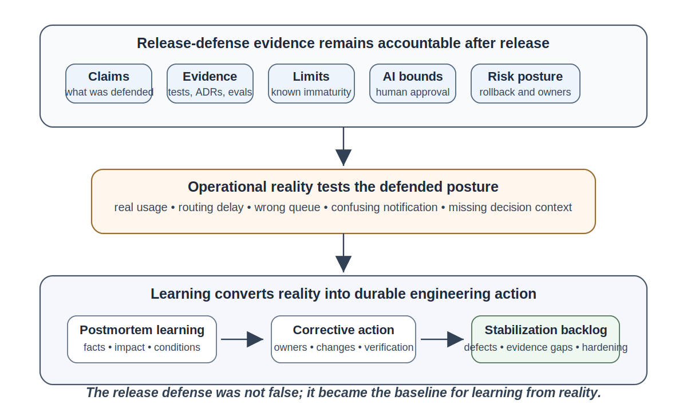
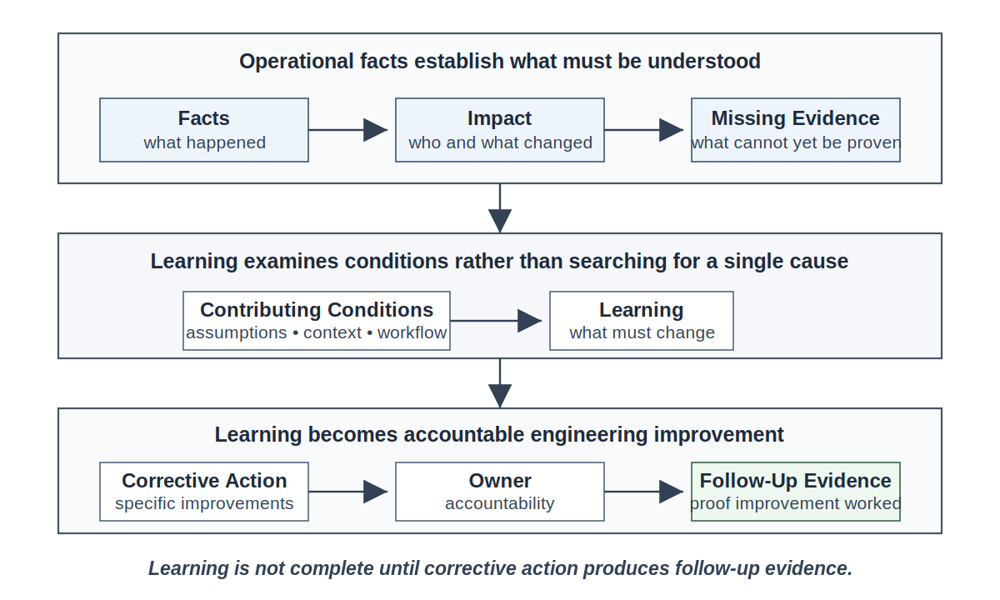
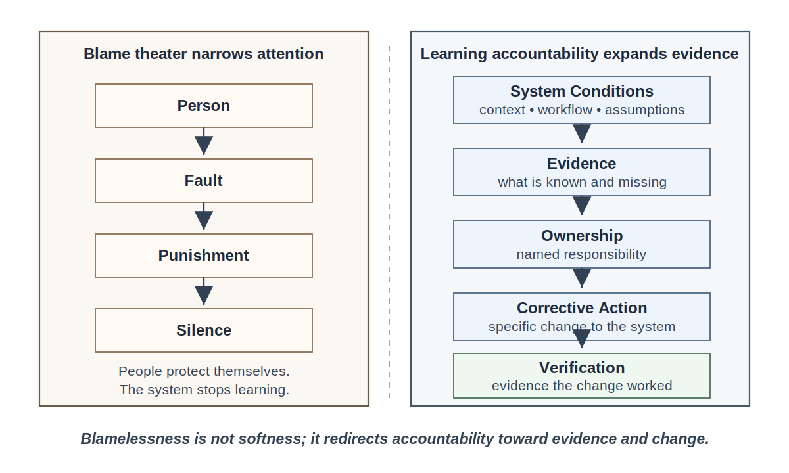
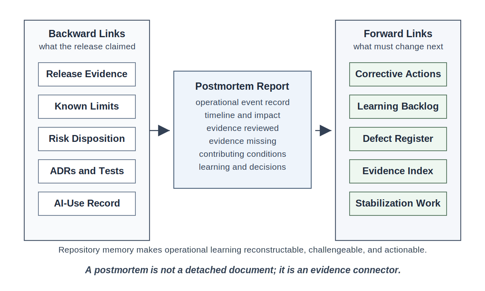
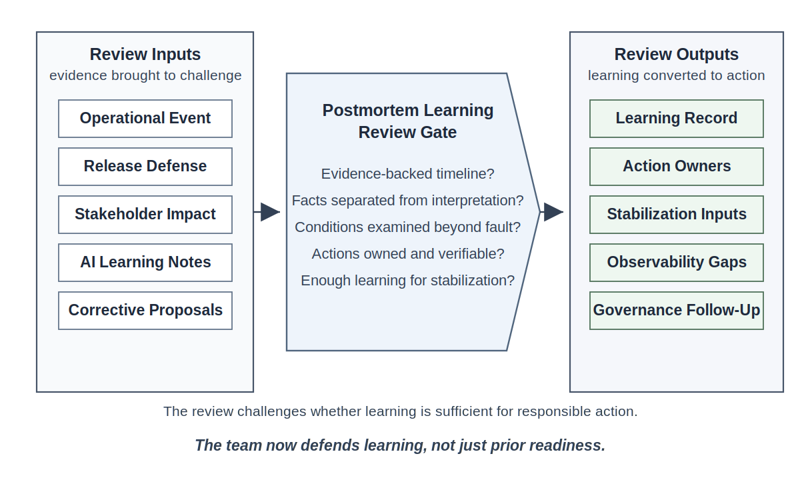

# Chapter 23<br><span class="chapter-title-main">Postmortems and Engineering Learning
---

### Chapter Governing Line

> A mature engineering organization does not become trustworthy by avoiding failure. It becomes trustworthy by learning from reality faster than risk can accumulate.

---

## Opening Scenario: The Release Was Defensible, but Reality Still Had Something to Teach

The COICP team had done what responsible engineers are supposed to do before a pilot release. They had not simply shown a demo. They had defended their release posture. They had walked the LMU review board through requirements, architecture decisions, pull requests, tests, intelligent-system evaluation records, known limitations, AI-use disclosures, risk disposition, rollback expectations, and follow-up ownership. They had answered uncomfortable questions. They had corrected overclaims. They had admitted what was not yet mature.

The release defense was not theater. It was useful. It gave LMU a clear view of what the Campus Operations and Incident Coordination Platform could do, what it could not yet do, where human approval remained required, which AI-assisted behaviors were constrained, and what evidence supported the team's claims.

Then the pilot began.

Nothing exploded. No dramatic outage brought down the university. No data breach made the evening news. No executive demanded an emergency shutdown. The first operational learning moment was quieter and more ordinary, which made it more useful.

Three outreach requests arrived during the first high-volume morning. Two were routed correctly but later than stakeholders expected. One request involved a student-services concern that looked similar to a community-partner request, and COICP assigned it to the wrong departmental queue. A notification draft, prepared with AI assistance and approved by a human reviewer, was technically accurate but tonally confusing. One stakeholder assumed Student Services owned the next handoff. Student Services assumed Community Outreach owned it. IT could show that the platform had followed its configured rule, but the team could not immediately reconstruct the full chain of decision context from the available operational evidence.

The release-defense record was not false. The tests had not been meaningless. The architecture had not collapsed. The AI boundaries had not disappeared. But reality had revealed something the evidence package had not fully taught the organization.

The system had entered a new phase of learning.

That is where Part III begins.

Part II taught how to build responsibly and defend engineering claims. Part III teaches how to preserve trust after those claims meet operational reality. The first obligation after release defense is not celebration, denial, or blame. The first obligation is learning.


*Figure 23.1 — From Release Defense to Operational Learning*

---

## 23.1 Release Defense Is Not the End of Engineering

A release defense is an evidence-backed professional claim. It says, in effect: based on the available evidence, this system is ready for a defined next step under defined constraints. That is a serious engineering statement. But it is not a guarantee that operational reality will match every assumption.

The difference matters.

A team can honestly defend readiness and still learn that a workflow behaves differently under real use. A team can test routing rules and still discover that stakeholders interpret urgency differently when actual students, partners, and departments are involved. A team can evaluate AI-generated summaries and still learn that tone, context, timing, and institutional expectations create new failure modes. A team can disclose known limitations and still discover limitations it did not know how to name before the pilot.

Trustworthy engineering does not require omniscience. It requires disciplined learning when reality proves the organization incomplete.

This is why the release-defense package must remain accessible after the pilot begins. In COICP, the Chapter 22 evidence should not be buried in slides or meeting memory. It should remain in the repository, linked to operational learning artifacts:

```text
/docs/release_evidence/release_readiness_record.md
/docs/release_evidence/release_defense_record.md
/docs/release_evidence/known_limitations.md
/docs/release_evidence/risk_disposition_Record.md
/docs/release_evidence/Release_defense_follow_up_index.md
/docs/review_board_records/engineering_release_defense_review.md
```

When the pilot exposes a surprise, the team should not ask whether the release defense was embarrassing. It should ask what the release defense claimed, what evidence supported that claim, what reality revealed, and what must now change.

That shift is the first professional movement of this chapter. The reader moves from defending readiness to learning from operation. Operational evidence is not a verdict on whether the team was competent. It is the next layer of information available to the organization.

The mature engineer does not treat post-release evidence as a threat to professional identity. The mature engineer treats it as the next source of truth.

---

## 23.2 What a Postmortem Is - and Is Not

A postmortem is a structured learning process that converts operational facts into durable engineering improvement. It is not a ritual. It is not a punishment meeting. It is not a compliance document. It is not a place to protect the release narrative. It is not a performance where everyone says the right words and then returns to the same system conditions.

A serious postmortem answers a sequence of engineering questions:

- What happened?
- What was the impact?
- What did we expect to happen?
- What actually occurred?
- What evidence do we have?
- What evidence is missing?
- What conditions contributed?
- What assumptions were wrong, incomplete, or untested?
- What did we learn?
- What will change?
- Who owns the change?
- What evidence will prove the change worked?

The word "postmortem" can sound like it belongs only after a major incident. That is too narrow. In trustworthy engineering, postmortems are useful after outages, defects, near misses, confusing handoffs, unexpected user behavior, AI-related surprises, governance gaps, and operational friction that exposes system weakness.

Near misses deserve particular attention because they expose the same system conditions that may later contribute to serious incidents. When organizations learn from near misses, they can often reduce risk before visible harm occurs. A mature engineering culture does not wait for failure to become expensive before deciding that learning is worthwhile.

COICP's first pilot issue does not need to be catastrophic to deserve a postmortem. The point is not scale. The point is learning value.

If the organization learns early, it reduces later risk. If it waits until harm becomes dramatic, it has already wasted evidence.


*Figure 23.2 — Postmortem Learning Loop*

A postmortem is also not a root-cause treasure hunt in the simplistic sense. Real engineering failures rarely have one clean cause. They emerge through conditions: assumptions, interfaces, workflows, policies, data, timing, communication, review gaps, governance boundaries, and human decisions. A team that rushes to name one cause usually stops learning too early.

For COICP, the wrong routing decision may involve a configuration rule, but the configuration rule is not the whole story. The issue may also involve ambiguous stakeholder categories, incomplete acceptance criteria, insufficient pilot data, unclear department ownership, missing operational evidence, and AI-generated communication that sounded more settled than the workflow really was.

The postmortem is where those relationships become visible.

---

## 23.3 Facts Before Interpretation

The first discipline of a postmortem is factual reconstruction. Teams often want to start with explanations because explanations feel productive. They are also dangerous when they arrive before evidence.

A fact is not the same as a memory. A fact is not the same as a confident opinion. A fact is not the same as an AI-generated summary of scattered notes. A fact is supported by evidence or clearly marked as unverified.

The COICP team should begin with an operational event record:

```text
/docs/operations/incidents/operational_event_record_001.md
```

That record should preserve at least the following:

- event identifier
- date and time window
- affected workflow
- affected stakeholders
- user-visible impact
- available evidence
- missing evidence
- immediate mitigation
- unresolved questions
- links to related release evidence
- links to issues, PRs, ADRs, tests, or AI records

The team should also build a timeline. The timeline does not need to be perfect at first. In fact, the imperfections are themselves evidence. If the team cannot reconstruct the route from request intake to departmental assignment, that is not merely a documentation inconvenience. It is an operational visibility gap.

A useful timeline might include:

```text
08:07 - Outreach request submitted through COICP intake form.
08:08 - COICP classified request as community-partner support.
08:09 - Notification draft generated for human review.
08:11 - Human reviewer approved notification draft.
08:14 - Request routed to Community Outreach queue.
09:02 - Student Services asked why the request was not visible in its queue.
09:13 - Community Outreach marked the request as requiring Student Services review.
09:25 - IT began event reconstruction.
09:48 - Team identified ambiguity in request category and handoff ownership.
```

This timeline is not blame. It is structure.

The team can then separate facts from interpretations:

| Item | Type | Evidence State |
|---|---|---|
| Request was routed to Community Outreach | Fact | Supported by routing log |
| Stakeholders expected Student Services to own the request | Fact | Supported by stakeholder messages |
| The routing rule was wrong | Interpretation | Requires analysis |
| The AI draft caused confusion | Hypothesis | Requires review of draft, context, approval, and recipient response |
| The release team missed an obvious case | Blame-shaped interpretation | Requires reframing into evidence and contributing conditions |

This separation protects the organization from premature certainty.

It also protects the team from AI-assisted false clarity. If the team asks a model to summarize the event, the model may produce a coherent narrative before the evidence is sufficient. That can be useful for drafting, but it is dangerous if treated as truth. AI can help organize known evidence. It must not invent missing evidence.

---

## 23.4 Blameless but Accountable

The phrase "blameless postmortem" is often misunderstood. Some people hear it as a promise that no one will be held responsible. Others hear it as management language used to avoid hard conversations. Both interpretations are weak.

Blameless does not mean accountability-free.

Blame asks, "Who failed?" Accountability asks, "What did our engineering system fail to understand, detect, prevent, recover from, or communicate?"

Blame narrows attention. Accountability expands it.

Blame looks for a person who can absorb organizational discomfort. Accountability looks for system conditions that must change. Blame creates silence because people learn to protect themselves. Accountability creates evidence because people learn that truth is usable.

For COICP, the easy blame story would be: the reviewer approved a confusing notification draft. That may be factually true, but it is not sufficient. Why did the reviewer believe the draft was acceptable? What context did the reviewer have? Was the notification policy clear? Did the AI tool present uncertainty? Did the workflow distinguish student-service requests from community-partner requests well enough? Did the release-defense record identify this as a known limitation? Did the team test tone and handoff clarity, or only message content? Did the repository preserve enough context for review?

Those questions do not excuse the reviewer. They create useful accountability.


*Figure 23.3 — Blameless but Accountable Map*

A postmortem should name owners. It should assign corrective actions. It should preserve decisions. It should identify verification evidence. It should make follow-up visible. What it should not do is reduce system learning to personal fault.

In a trustworthy engineering culture, accountability has artifacts:

```text
/docs/operations/corrective_actions/corrective_action_register.md
/docs/operations/learning_backlog/learning_backlog.md
/docs/governance/reviews/postmortem_learning_review_record.md
```

If no owner is named, accountability has not happened. If no evidence will verify the action, learning has not been engineered. If the postmortem sits in a shared drive, chat thread, or slide deck without links to future work, institutional memory will decay.

Honest engineering is mature engineering.

---

## 23.5 Contributing Conditions, Not Convenient Causes

Root-cause language can be useful, but it can also mislead. Many teams say "root cause" when they really mean "the first simple explanation we found." That is not enough for trustworthy engineering.

Chapter 23 should teach students to look for contributing conditions.

A contributing condition is something that helped make the event possible, more likely, harder to detect, harder to recover from, or easier to misunderstand. Contributing conditions may exist in code, tests, workflow, policy, communication, repository evidence, AI context, data quality, review practice, operational signals, governance boundaries, or team assumptions.

For the COICP pilot issue, contributing conditions might include:

- stakeholder categories were defined from project assumptions rather than pilot behavior
- acceptance criteria covered routing correctness but not handoff clarity
- AI-generated notification drafts were reviewed for factual content but not institutional tone
- the release-defense record identified notification drafting as constrained but did not specify tone-review criteria
- operational logs recorded final queue assignment but not enough decision context
- departmental ownership was treated as obvious when it was not
- follow-up ownership from release defense was not connected to pilot event monitoring

Each condition points to a different kind of improvement.

A code defect might require a fix. A test gap might require a regression test. A workflow ambiguity might require stakeholder review. A governance ambiguity might require authority clarification. An AI-context issue might require prompt or context revision, evaluation expansion, or additional oversight. A missing signal might become an observability requirement in Chapter 25. A recurring defect pattern may become a stabilization priority in Chapter 24.

Notice that these responses are different because the underlying conditions are different.

This is why postmortems come before stabilization. Without learning, stabilization becomes bug whack-a-mole. The team may reduce symptoms while leaving the conditions that created them untouched.

---

## 23.6 Repository-Centered Operational Learning

The repository has already served many roles throughout the lifecycle. It has preserved requirements, issues, branches, pull requests, reviews, architecture decisions, AI-use logs, tests, CI/CD evidence, intelligent-system evaluation, release readiness, and release defense. At this stage of the lifecycle, the repository takes on an additional responsibility: preserving operational learning.

Operational lessons are among the most valuable forms of engineering knowledge because they are earned in contact with reality. The repository becomes the place where incidents, near misses, investigations, corrective actions, and lessons learned are preserved so future teams do not have to rediscover them under pressure.

That evolution is not optional. It is the natural consequence of the book's doctrine: everything important leaves evidence.

Operational learning should not live only in meetings. It should not live only in chat. It should not live only in someone's memory. It should not live only in slides. Operational learning belongs where future engineering work can find it, link to it, challenge it, and act on it.

Organizations that fail to preserve operational learning eventually repeat lessons they have already paid to learn.

For COICP, Chapter 23 should introduce or mature these directories:

```text
/docs/operations/
/docs/operations/incidents/
/docs/operations/postmortems/
/docs/operations/learning_backlog/
/docs/operations/corrective_actions/
/docs/operations/operational_evidence/
/docs/testing_and_quality/defects/
/docs/governance/Reviews/
/docs/governance/ai_governance/
/docs/release_evidence/
/docs/review_board_records/
```

The postmortem report should link backward and forward.

Backward links connect the event to earlier engineering evidence:

```text
/docs/release_evidence/release_defense_record.md
/docs/release_evidence/known_limitations.md
/docs/release_evidence/risk_disposition_record.md
/docs/architecture/adrs/
/docs/testing_and_quality/test_evidence_summary.md
/docs/governance/ai_governance/ai_use_log.md
```

Forward links turn learning into future work:

```text
/docs/operations/corrective_actions/corrective_action_register.md
/docs/operations/learning_backlog/learning_backlog.md
/docs/testing_and_quality/Defects/Defect_Register.md
/docs/operations/operational_evidence/operational_evidence_index.md
```


*Figure 23.4 — Postmortem Repository Evidence Chain*

A useful postmortem template should include:

```text
# COICP Pilot Postmortem 001

## Summary
## Impact
## Timeline
## Evidence Reviewed
## Evidence Missing
## Contributing Conditions
## What Went Well
## What Did Not Go Well
## AI-Related Observations
## Governance Observations
## Corrective Actions
## Owners and Dates
## Follow-Up Evidence
## Links to Issues, PRs, Tests, ADRs, Risks, and Release Evidence
```

The key is not template compliance. The key is reconstructability. Six months later, a new engineer or reviewer should be able to understand what happened, what LMU learned, what changed, and how the organization verified that the change worked.

---

## 23.7 AI-Assisted Systems in Postmortems

AI changes postmortems because AI can make weak explanations sound complete. It can also become a convenient scapegoat. Both risks matter.

In COICP, the confusing notification draft was AI-assisted. That does not mean the model "caused" the issue. The postmortem should separate the relevant layers:

- What did the model generate?
- What context did it receive?
- What instruction governed tone, audience, and authority?
- What did the human reviewer approve?
- What evidence did the reviewer inspect?
- Was this type of draft included in prior evaluation scenarios?
- Did the recipient misunderstand content, tone, authority, next action, or ownership?
- Did the system make it clear that the message was a draft requiring human ownership?
- Were logs sufficient to reconstruct model input, output, review, approval, and delivery?

The organization should not jump to "the AI got it wrong." That is often too shallow. The failure may be in context, workflow, review, policy, evaluation, or authority boundaries.

Chapter 23 should introduce AI operational learning notes, not full controlled delegation governance. That full architecture belongs in Chapter 28. Here, the purpose is to capture what the operational event teaches about AI-assisted behavior.

A useful file might be:

```text
/docs/governance/ai_governance/ai_operational_learning_notes.md
```

Those notes should distinguish:

| Category | Question |
|---|---|
| Model behavior | Did the model generate misleading, incomplete, or ambiguous output? |
| Context quality | Did the model receive enough trusted context? |
| Human oversight | Did the reviewer have enough information, time, and authority? |
| Workflow design | Did the process make ownership and approval clear? |
| Evaluation gap | Was this scenario missing from pre-release evaluation? |
| Governance gap | Did the AI-assisted behavior approach an authority boundary? |
| Observability gap | Could the team reconstruct input, output, approval, and effect? |

AI-related postmortems must preserve human accountability. AI proposes; engineers verify. If engineers approve, deploy, constrain, ignore, or fail to monitor AI-assisted behavior, the engineering system owns the outcome.

This is not anti-AI. It is professional accountability.

---

## 23.8 The Postmortem Learning Review

Part II developed review boards as professional challenge mechanisms. Chapter 22 ended with Engineering Release Defense. Chapter 23 begins the operational review sequence with the Postmortem Learning Review.

The Postmortem Learning Review is not a meeting to approve a document. It is a review mechanism that asks whether the organization has learned enough from the event to act responsibly.


*Figure 23.5 — Postmortem Learning Review Gate*

The review should ask:

- Is the timeline evidence-backed?
- Are interpretations clearly separated from facts?
- Is stakeholder impact described honestly?
- Are contributing conditions examined beyond individual fault?
- Are AI-related factors analyzed without scapegoating or hype?
- Are governance and authority implications visible?
- Are missing evidence and observability gaps recorded?
- Are corrective actions specific, owned, and verifiable?
- Are links to release evidence, risks, ADRs, PRs, tests, and AI-use records preserved?
- Is there enough learning to feed stabilization work?

The review inputs should include:

```text
/docs/operations/incidents/operational_event_record_001.md
/docs/operations/postmortems/coicp_pilot_postmortem_001.md
/docs/release_evidence/release_defense_record.md
/docs/release_evidence/known_limitations.md
/docs/release_evidence/risk_disposition_record.md
/docs/governance/ai_governance/ai_operational_learning_notes.md
/docs/operations/corrective_actions/corrective_action_register.md
```

The review output should be stored as:

```text
/docs/governance/reviews/postmortem_learning_review_record.md
```

This review strengthens engineering judgment because it forces the team to defend learning, not just defend prior work. That is a different kind of maturity. The question is no longer, "Were we ready to pilot?" The question is, "Did we learn responsibly from what the pilot revealed?"

---

## 23.9 From Learning to Stabilization

Postmortems are not the end of operational learning. They are the beginning of disciplined improvement.

A postmortem that produces no action is theater. A postmortem that produces vague action is action-item theater. A postmortem that produces action without owners is accountability theater. A postmortem that produces owners without follow-up evidence is memory decay waiting to happen.

Chapter 23 must end by making Chapter 24 necessary.

The COICP pilot event should produce several outputs:

```text
/docs/operations/learning_backlog/learning_backlog.md
/docs/operations/corrective_actions/corrective_action_register.md
/docs/testing_and_quality/defects/defect_register.md
/docs/operations/operational_evidence/operational_evidence_index.md
/docs/governance/ai_governance/ai_operational_learning_notes.md
```

Those artifacts do not yet stabilize the system. They identify what must be stabilized.

Chapter 24 will take the learning from Chapter 23 and ask: which defects, patterns, regressions, recurring conditions, and trust-impacting issues must be reduced systematically? That next step depends on this chapter. If Chapter 23 is weak, Chapter 24 becomes bug fixing. If Chapter 23 is strong, Chapter 24 becomes stabilization engineering.

The transition is simple:

Postmortems convert operational reality into learning. Stabilization converts learning into improved behavior.

---

## 23.10 Chapter Takeaways

1. Release defense is not the end of engineering. It is the last pre-operational claim before reality begins teaching the organization.

2. A postmortem is an engineering learning system. It converts facts, impact, contributing conditions, and corrective action into durable improvement.

3. Blameless does not mean accountability-free. Mature teams avoid scapegoating because scapegoating destroys learning, not because they avoid responsibility.

4. Facts must precede interpretation. Timelines, evidence, impact, and missing evidence must be preserved before explanations harden.

5. Failures are systems evidence. They often emerge from assumptions, workflows, signals, handoffs, governance boundaries, AI context, and human decisions.

6. Repository-centered engineering continues after release. Postmortems, incidents, corrective actions, learning backlogs, and operational evidence belong in the repository.

7. AI-assisted behavior requires careful postmortem analysis. The issue may involve model behavior, context quality, evaluation gaps, oversight, workflow design, or governance boundaries.

8. The Postmortem Learning Review challenges whether the organization has learned enough to improve responsibly.

9. Learning must feed stabilization. Otherwise, postmortems become documentation theater.

---

## 23.11 Exercises

### Exercise 1: Build an Operational Event Record

Create the repository artifact:

`/docs/operations/incidents/operational_event_record_001.md`

Using the COICP pilot scenario, create an operational event record that includes:

- Event identifier
- Affected workflow
- Timeline
- Affected stakeholders
- User-visible impact
- Available evidence
- Missing evidence
- Unresolved questions
- Links to release evidence

Identify which missing evidence most limits the team's ability to understand what happened and why.

### Exercise 2: Write a Postmortem Without Blame

Create the repository artifact:

`/docs/operations/postmortems/coicp_pilot_postmortem_001.md`

Your postmortem must include:

- Summary
- Impact
- Timeline
- Evidence reviewed
- Evidence missing
- Contributing conditions
- What went well
- What did not go well
- Lessons learned
- Corrective actions
- Owner assignments
- Follow-up evidence

Do not identify an individual as "the cause."

Instead, identify the system conditions, assumptions, decisions, communication gaps, workflow weaknesses, or evidence gaps that contributed to the outcome.

Explain how the postmortem supports future engineering learning.

### Exercise 3: Create a Corrective-Action Register

Create the repository artifact:

`/docs/operations/corrective_actions/corrective_action_register.md`

Include:

- Action ID
- Learning source
- Corrective action
- Owner
- Due date
- Linked issue or pull request
- Verification evidence
- Status

Evaluate whether each corrective action reduces risk, improves visibility, improves recoverability, or addresses a known limitation.

### Exercise 4: Analyze AI Operational Learning

Create the repository artifact:

`/docs/governance/ai_governance/ai_operational_learning_notes.md`

Classify observed AI-related operational issues into one or more of the following categories:

- Model output issue
- Context issue
- Human-oversight issue
- Workflow issue
- Policy issue
- Evaluation gap
- Observability gap

For each finding, identify the evidence supporting the classification and the corrective action that should be considered.

Explain why AI-related learning should be treated as operational learning rather than model criticism alone.

### Exercise 5: Conduct a Postmortem Learning Review

Create the repository artifact:

`/docs/governance/reviews/postmortem_learning_review_record.md`

Evaluate the following questions:

- Is the timeline supported by evidence?
- Are facts separated from interpretations?
- Are contributing conditions identified?
- Are corrective actions assigned to owners?
- Is follow-up evidence defined?
- Is AI-related learning handled responsibly?
- Is there sufficient learning to support Chapter 24 stabilization activities?

Document:

- Findings
- Evidence gaps
- Required follow-up actions
- Owner assignments
- Open questions
- Residual risks

Determine whether the postmortem provides sufficient operational learning, conditionally sufficient learning, or insufficient learning.

---

## 23.12 Repository Artifact Summary

| Repository Artifact | Purpose | Chapter 23 Role | Future Use |
|---|---|---|---|
| `/docs/operations/incidents/operational_event_record_001.md` | Preserve event facts and timeline | Establish factual basis | Feeds postmortem and future incident response |
| `/docs/operations/postmortems/coicp_pilot_postmortem_001.md` | Preserve learning record | Central chapter artifact | Feeds stabilization and governance follow-up |
| `/docs/operations/corrective_actions/corrective_action_register.md` | Assign owners and verification evidence | Converts learning into accountability | Feeds Chapter 24 stabilization |
| `/docs/operations/learning_backlog/learning_backlog.md` | Preserve future learning opportunities | Prevents memory decay | Feeds observability, runbooks, reliability |
| `/docs/governance/ai_governance/ai_operational_learning_notes.md` | Capture AI-related operational lessons | Prevents shallow AI blame | Feeds Chapter 28 controlled delegation |
| `/docs/governance/reviews/postmortem_learning_review_record.md` | Record review-board challenge | Formalizes learning review | Feeds Part III review progression |
| `/docs/operations/operational_evidence/operational_evidence_index.md` | Track available and missing evidence | Identifies visibility gaps | Feeds Chapter 25 observability |

---

## 23.13 Closing Transition

The COICP team did not become less professional because the pilot exposed problems. It became more professional because it refused to waste what the pilot revealed.

The postmortem did not erase the routing delay. It did not undo stakeholder confusion. It did not magically solve AI-assisted communication risk. It did something more important for long-term trust: it preserved the facts, named the impact, identified contributing conditions, assigned owners, recorded missing evidence, and turned operational surprise into engineering work.

But learning alone does not stabilize a system.

A learning backlog is not a fix. A corrective-action register is not proof that behavior improved. A postmortem is not a substitute for regression tests, defect reduction, trend analysis, operational discipline, or risk burn-down.

Learning identifies what must change.

Stabilization verifies that change actually occurred.

The next chapter therefore asks the next hard question:

Now that the organization has learned from reality, how does it systematically reduce instability before small defects, recurring conditions, and unresolved lessons accumulate into operational distrust?

That is the work of Chapter 24: Defect Reduction and Stabilization.

