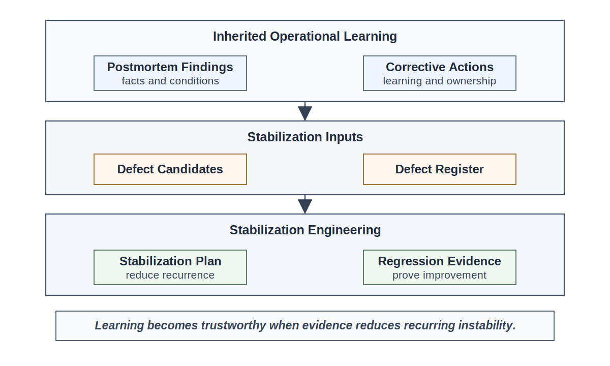
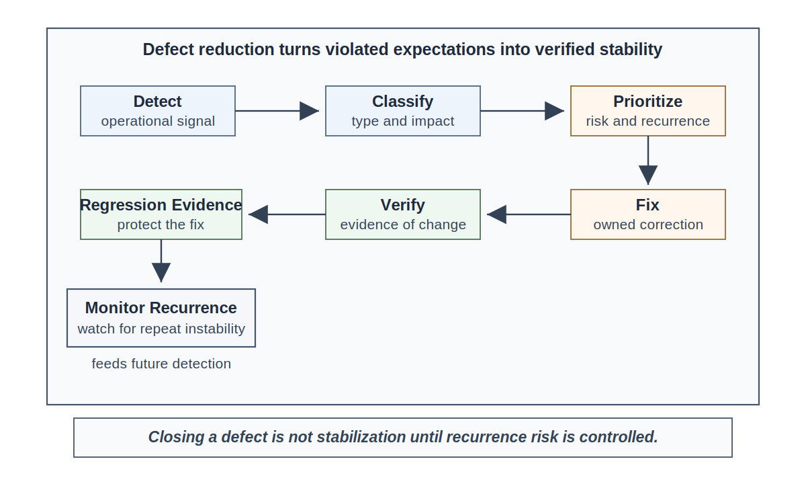
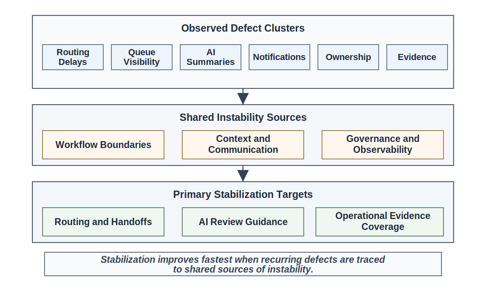
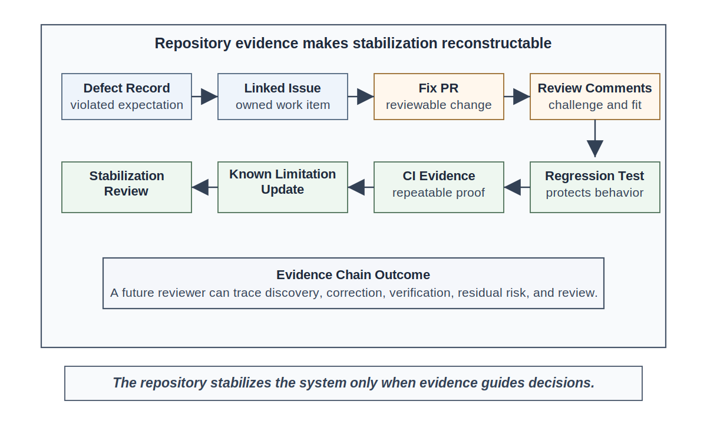
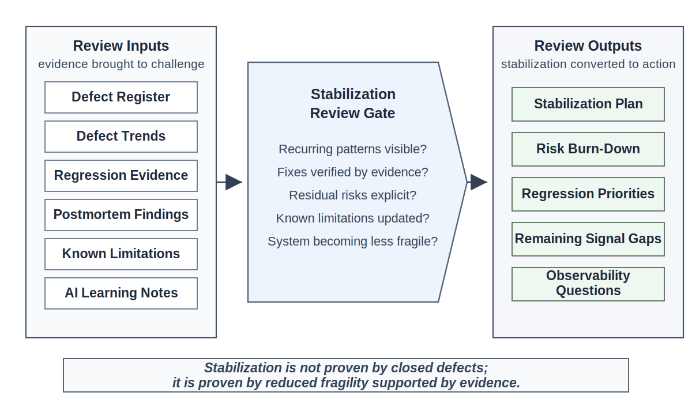

# Chapter 24<br><span class="chapter-title-main">Defect Reduction and Stabilization
---

### Chapter Governing Line

> A system is not stable because defects are closed. It is stable when recurring instability is reduced, regression risk is controlled, and remaining risk is visible and owned.

---

## Opening Scenario: The Postmortem Created Learning. It Did Not Stabilize the System.

The COICP postmortem was useful. That was the good news.

The team reconstructed the pilot event, separated facts from interpretations, identified contributing conditions, documented the confusing AI-assisted notification draft, named the unclear handoff between Community Outreach and Student Services, and recorded several operational evidence gaps. The postmortem did what Chapter 23 said a postmortem should do: it converted operational surprise into durable learning.

The learning was real.

But the system was not yet stable.

Over the next several pilot days, LMU saw a pattern that was easy to explain away if the team looked only at individual issues. Several requests were routed correctly but later than stakeholders expected. A notification status sometimes changed in the user interface before the downstream department could see the request. Two AI-assisted summaries omitted urgency context that human reviewers assumed would be obvious. One handoff problem was marked closed, then reappeared when the request entered through a slightly different intake path. Support staff began keeping a side spreadsheet because they no longer fully trusted queue status during busy periods.

None of these defects proved that COICP was a failed system. They did prove something important: operational learning had not yet become operational stability.

That distinction is the point of this chapter.

A postmortem can tell the organization what reality exposed. It can preserve facts, contributing conditions, corrective actions, owners, and missing evidence. But a postmortem does not by itself reduce recurrence. A learning backlog is not a fix. A corrective-action register is not proof that behavior improved. A defect issue marked closed is not evidence that the system is becoming less fragile.

Chapter 24 begins where Chapter 23 ends. LMU has learned from operational reality. Now the team must use that learning to reduce instability.

The first stabilization work should be traceable to the Chapter 23 artifacts already in the repository:

```text
/docs/operations/postmortems/coicp_pilot_postmortem_001.md
/docs/operations/corrective_actions/corrective_action_register.md
/docs/operations/learning_backlog/learning_backlog.md
/docs/operations/incidents/operational_event_record_001.md
/docs/operations/operational_evidence/operational_evidence_index.md
/docs/governance/ai_governance/ai_operational_learning_notes.md
/docs/governance/reviews/postmortem_learning_review_record.md
```

Those files matter because stabilization cannot begin from vague memory. It begins from evidence.


*Figure 24.1 — From Postmortem Learning to Stabilization Work*

LMU leadership asks a reasonable question: is COICP stable enough to continue the pilot?

The weak answer is, "Yes, because we fixed the bugs."

The equally weak answer is, "No, because defects appeared."

The engineering answer is more disciplined: COICP can continue only under an evidence-backed stabilization plan that shows which instability patterns are being reduced, which risks remain, which owners are accountable, what regression protection exists, and what operational evidence is still missing.

That is stabilization engineering.

---

## 24.1 Defects Are Evidence, Not Just Bugs

Students often learn to treat defects as things to fix. That is necessary, but it is not mature enough for operational trust.

A defect is evidence that some expectation was violated.

The expectation may be functional: the system did not do what a requirement said it should do. It may be workflow-based: the software performed a local step correctly but failed the organizational handoff. It may be communicative: the message was technically accurate but misled the recipient. It may be governance-related: the system allowed uncertainty around authority, ownership, approval, escalation, or risk. It may be AI-related: a generated summary, classification, recommendation, or draft appeared plausible but weakened the human decision process.

A defect is therefore not merely a coding error. It is an operational signal.

Defects and near misses often reveal the same underlying weaknesses. A defect may expose instability after impact occurs. A near miss may expose the same instability before significant harm is visible. Mature stabilization practices learn from both.

For COICP, a delayed routing event is not only a queue-processing bug. It may reveal an unrealistic timing assumption. A confusing notification is not only a message-template defect. It may reveal missing tone criteria for AI-assisted drafts. A repeated handoff defect is not only a reopened issue. It may reveal that the team fixed one path while leaving the underlying workflow ambiguity unresolved.

This is why defect records must preserve more than a title and status. A useful defect record asks:

- What expectation was violated?
- Who was affected?
- What evidence shows the defect?
- Was this isolated or recurring?
- Which workflow, component, rule, decision, or AI-assisted behavior was involved?
- What prior evidence should have caught this?
- What future evidence will prevent recurrence?
- Who owns the correction?
- What residual risk remains?

In the repository, that record belongs in a defect register, not as a detached note:

```text
/docs/testing_and_quality/defects/defect_register.md
```

The defect register is not a spreadsheet for management theater. It is an engineering evidence artifact. It connects operational reality to stabilization work.

A useful defect register entry might include:

| Field | Example |
|---|---|
| Defect ID | `defect-024-003` |
| Source | COICP pilot postmortem and stakeholder report |
| Affected workflow | Intake routing and departmental handoff |
| Defect type | Workflow / governance / operational evidence |
| Severity | High operational trust impact |
| Priority | Stabilization priority 1 |
| Owner | Routing workflow owner |
| Linked postmortem | `/docs/operations/postmortems/coicp_pilot_postmortem_001.md` |
| Linked corrective action | `/docs/operations/corrective_actions/corrective_action_register.md` |
| Required evidence | Regression scenario, review record, updated limitation, operational signal |
| Status | Open / in stabilization plan |

That level of detail is not bureaucracy when it changes engineering behavior. It is the difference between defect tracking and stabilization evidence.


*Figure 24.2 — Defect Reduction Loop*

A defect tells the organization where confidence exceeded control. Stabilization begins when the team treats that signal seriously.

---

## 24.2 Defect Closure Is Not Stabilization

Closing a defect and stabilizing a system are not the same activity.

Closing a defect says that a specific issue has been addressed. Stabilizing a system says that recurring instability is being reduced. The first is local. The second is systemic.

A team can close many defects and still fail to stabilize. That happens when fixes are isolated, recurrence is ignored, regression tests are missing, severity is classified by convenience, governance-sensitive issues are treated as ordinary bugs, and operational workarounds are normalized.

In COICP, suppose the team fixes the request-routing rule that misclassified one student-services request. The issue can be closed. But the system may still be unstable if:

- similar requests enter through other intake forms
- department ownership remains ambiguous
- the AI-assisted summary still omits urgency context
- reviewers lack guidance for tone and handoff clarity
- regression tests cover only the exact failing example
- known limitations are not updated
- support staff continue using a side spreadsheet
- the team cannot detect recurrence without manual reports

The defect was closed. The instability remained.

That distinction is the trap.

Organizations often celebrate closure because closure is visible. Stability is harder to measure. A closed issue can create the appearance of progress while the underlying conditions continue producing confusion, workarounds, recurrence, and distrust.

Defect closure theater happens when issue status gives the appearance of progress without proving that behavior improved. The team points to a list of closed defects while stakeholders continue to experience confusion, delays, workarounds, or distrust. The repository looks active. The system remains fragile.

A mature stabilization practice asks a harder question:

**What evidence shows that this class of instability is less likely to recur?**

That question changes the work. The team must link the defect to an issue, a fix, a review, a test, a regression scenario, and a follow-up signal. A meaningful evidence chain might look like this:

```text
/docs/testing_and_quality/defects/defect_register.md
-> linked issue
-> fix branch
-> pull request
-> review comments
-> regression test
-> ci evidence
-> known limitation update
-> stabilization review record
```

The exact repository tooling can vary. The principle cannot: everything important leaves evidence.

Defect closure can be useful. But it must not become the team's substitute for stability.

---

## 24.3 Classifying Defects Without Creating Bureaucracy

The team cannot find patterns if every defect is simply labeled "bug."

But classification can also become bureaucratic theater. A complicated taxonomy that no one uses is not engineering maturity. It is paperwork with better formatting.

Chapter 24 should teach a practical defect taxonomy: just enough structure to reveal instability patterns, support prioritization, guide regression evidence, and make governance-sensitive issues visible.

For COICP, a useful taxonomy might include:

| Defect Type | Meaning | COICP Example |
|---|---|---|
| Functional defect | Behavior violates a stated system expectation | Request status does not update correctly |
| Workflow defect | A handoff or process fails across roles or departments | Request reaches the wrong departmental queue |
| Data defect | Data is incomplete, stale, inconsistent, or misleading | Queue status differs between requester and staff views |
| Communication defect | A message creates misunderstanding or weakens action | AI-assisted notification is accurate but tonally confusing |
| Governance defect | Authority, ownership, approval, escalation, or risk is unclear | No clear owner for a cross-department handoff |
| AI-assisted defect | AI-generated or AI-influenced output contributes to failure | Summary omits urgency context |
| Operational evidence defect | The team cannot reconstruct what happened | Logs show final state but not decision context |
| Regression defect | Previously corrected behavior returns | Handoff defect reappears through another intake path |

The taxonomy should be stored where future defect records can reference it:

```text
/docs/testing_and_quality/defects/defect_taxonomy.md
```

The goal is not to force every defect into a perfect category. The goal is to help the team see whether defects cluster around workflows, data, AI-assisted communication, governance boundaries, operational evidence, or recurrence.

Classification is valuable when it improves judgment.

For example, a communication defect involving AI-assisted notification tone may appear minor if evaluated only as text output. But if that message changes stakeholder behavior, delays handoff, or creates unclear authority, it becomes operationally significant. Classification helps prevent the team from hiding that risk inside a low-priority bug label.

The taxonomy should remain revisable. If the pilot reveals a new recurring defect type, the taxonomy should adapt. That is not instability in the taxonomy. That is learning.

---

## 24.4 Severity, Priority, and Trust Impact

Severity is often misunderstood.

Teams sometimes classify severity by technical inconvenience: how hard the defect is to fix, how visible the code issue is, or how embarrassing it feels to the developer. That is weak engineering.

In a trustworthy system, severity must include consequence.

A defect may be technically small but operationally serious. A message template may be easy to fix but still damage stakeholder trust. A routing delay may involve a small queue condition but create governance exposure if responsibility for student support becomes unclear. An AI-assisted summary may be factually close but risky if it omits urgency context that humans need for escalation.

Severity should consider:

- user impact
- stakeholder impact
- operational disruption
- recurrence
- governance exposure
- security or privacy implication
- AI authority or oversight risk
- trust impact
- recoverability
- visibility
- release or pilot constraint impact

Priority then asks which defects must be addressed first under real constraints.

Severity and priority are related, but they are not identical. A severe defect may have a temporary mitigation. A moderate defect may become high priority if it recurs frequently or blocks pilot learning. A low technical defect may become high priority if stakeholders begin building manual workarounds around it.

COICP's side spreadsheet is a warning sign. It is not merely an unofficial workaround. It means users are beginning to build a shadow process because they do not fully trust the system. That is a trust signal.

A mature defect register should therefore include both severity and priority, along with rationale:

```text
/docs/testing_and_quality/defects/defect_register.md
```

Example fields:

- severity level
- severity rationale
- priority level
- priority rationale
- affected stakeholder
- affected workflow
- governance exposure
- AI involvement
- recurrence indicator
- owner
- residual risk

Severity and priority must be reviewable. Otherwise the loudest voice, the easiest fix, or the most convenient narrative will drive stabilization.

Governance-sensitive defects require special attention. A defect involving authority, privacy, escalation, AI-assisted recommendation, or stakeholder obligation should not be treated as an ordinary cosmetic issue. It should trigger explicit review of ownership, risk, and evidence.

That is not overreaction. That is governance as architecture.

---

## 24.5 Finding Patterns and Recurrence

A defect list tells the team what has been reported. A defect pattern tells the team where the system is unstable.

Organizations rarely fail because of a single isolated defect. They fail because recurring patterns remain hidden long enough to accumulate risk.

That difference matters.

If COICP has eight open defects, the team can fix them one by one. But if five of those defects involve routing and handoff ownership, the real stabilization problem may not be five separate bugs. It may be an unclear responsibility model. If three defects involve AI-assisted summaries, the issue may not be three weak drafts. It may be insufficient context, weak evaluation scenarios, or unclear reviewer guidance. If several defects involve missing reconstruction evidence, the system may not yet be observable enough for operation.

The team needs a trend view:

```text
/docs/testing_and_quality/defects/defect_trend_log.md
```

The trend log should help answer:

- Which workflows produce the most defects?
- Which defects recur after closure?
- Which defects are related to handoffs?
- Which defects are related to AI-assisted output?
- Which defects expose missing operational evidence?
- Which defects affect governance or ownership?
- Which defects create stakeholder workarounds?
- Which defects were predicted by known limitations?
- Which defects reveal limitations that were not previously known?


*Figure 24.3 — Defect Pattern Map*

Pattern recognition is where systems thinking becomes practical.

The team may discover that the most important stabilization target is not a single broken function. It may be the boundary between intake classification, department ownership, and notification language. That boundary includes code, data, workflow, stakeholders, AI assistance, review criteria, and governance expectations.

This is the moment when isolated defects stop looking isolated.

What initially appeared to be separate problems begin to reveal shared conditions.

The system is larger than the code. Part I introduced that doctrine. Chapter 24 makes it operational.

---

## 24.6 Regression Evidence and Risk Burn-Down

A fix that is not protected by evidence is a temporary hope.

Regression evidence is how the team turns a defect into future memory. Once a defect exposes a weakness, the team should ask what future test, scenario, review question, or operational signal will detect the weakness if it returns.

This does not mean every typo needs a full regression suite. Engineering judgment matters. But meaningful defects should not disappear into closed issue history with no future protection.

For COICP, a routing defect might require:

- a new regression scenario for ambiguous student-services/community-partner requests
- an acceptance-criteria update
- a review of department ownership rules
- an AI-summary evaluation case
- a notification tone review checklist
- an operational signal for delayed handoff
- an updated known limitation if the risk remains during pilot

The regression evidence should be linked in the repository:

```text
/docs/testing_and_quality/regression/regression_test_index.md
/docs/testing_and_quality/stabilization/regression_priority_list.md
```

Without that memory, organizations often pay repeatedly to relearn the same lesson.

Risk burn-down then asks whether stabilization work is reducing known operational risk.

A risk burn-down record is not a decorative chart. It should show which instability risks have been reduced, which remain open, which have accepted mitigations, and which require escalation. It belongs with stabilization evidence:

```text
/docs/testing_and_quality/stabilization/risk_burn_down_record.md
```

The team should avoid false precision. Risk burn-down is not magic math. It is disciplined visibility into whether the system is becoming less fragile.

A useful stabilization record might include:

| Instability Pattern | Evidence | Stabilization Action | Regression Evidence | Residual Risk |
|---|---|---|---|---|
| Ambiguous routing ownership | Repeated handoff defects | Clarify ownership rules and update routing criteria | Regression scenarios for ambiguous requests | Some unusual cases still require manual review |
| AI summary urgency omission | Two pilot summaries omitted context | Add urgency-context evaluation cases and reviewer prompt | AI evaluation scenario added | Reviewer training still needed |
| Queue-status inconsistency | Stakeholder reports and UI timing mismatch | Fix status propagation and add consistency check | Integration test and CI evidence | Monitor under higher load |

Stabilization becomes credible when risk reduction is linked to evidence.

---

## 24.7 Repository-Centered Stabilization Evidence

By Chapter 24, the repository is no longer only a construction record or release evidence store. It is becoming the operating memory of the system.

That does not mean the chapter should become a GitHub tutorial. The manuscript should not walk through buttons, issue screens, branch commands, or pull request mechanics. Those are implementation details. The engineering lesson is that stabilization must be reconstructable.

A future engineer, reviewer, stakeholder, or instructor should be able to trace a stabilization decision from defect discovery to verified evidence:

```text
defect record
-> issue or work item
-> fix branch
-> pull request
-> review comments
-> test or evaluation evidence
-> ci result
-> known limitation update
-> stabilization review
```


*Figure 24.4 — Defect-to-Test-to-Release Evidence Chain*

Chapter 24 should introduce or mature these repository artifacts:

```text
/docs/testing_and_quality/defects/defect_register.md
/docs/testing_and_quality/defects/defect_taxonomy.md
/docs/testing_and_quality/defects/defect_trend_log.md
/docs/testing_and_quality/stabilization/stabilization_plan.md
/docs/testing_and_quality/stabilization/regression_priority_list.md
/docs/testing_and_quality/stabilization/risk_burn_down_record.md
/docs/testing_and_quality/regression/regression_test_index.md
/docs/governance/reviews/stabilization_review_record.md
/docs/release_evidence/known_limitations.md
/docs/release_evidence/release_readiness_record.md
```

The important rule is proportionality. Repository references should appear where they strengthen engineering evidence, accountability, governance, reviewability, or learning. They should not become a folder tour.

For COICP, the stabilization plan should answer:

- Which instability patterns are highest priority?
- Which defects are linked to each pattern?
- Which owners are responsible?
- Which regression tests or evaluation scenarios are required?
- Which known limitations must be updated?
- Which risks remain accepted?
- Which defects require governance review?
- Which signal gaps must Chapter 25 observability address?

That plan can live here:

```text
/docs/testing_and_quality/stabilization/stabilization_plan.md
```

The repository does not stabilize the system by existing. It stabilizes the system only when evidence is used to guide decisions, review work, and preserve learning.

---

## 24.8 AI-Generated Fixes and Stabilization Risk

AI can help during stabilization. It can summarize defect reports, suggest likely causes, propose patches, draft regression tests, identify clusters, and help compare related issues. Those are useful capabilities.

They are not authority.

An AI-generated fix is proposed engineering material. It is not a repair until engineers verify it, test it, review it, and own its consequences.

This matters because stabilization work is especially vulnerable to AI patch theater. A generated patch can make a failing test pass while preserving the underlying instability. A generated test can validate the same assumption that caused the defect. A generated summary can make weak evidence sound complete. A generated refactor can cross architecture boundaries that the model does not understand. A generated priority recommendation can ignore governance consequence.

For COICP, AI might propose a simple rule change to route ambiguous requests to Student Services by default. That may reduce one defect. It may also overload Student Services, hide Community Outreach ownership, or bypass an approval expectation. The patch might be technically plausible and operationally wrong.

Stabilization review of AI-generated fixes should ask:

- What defect does the generated fix claim to address?
- What evidence supports that diagnosis?
- Does the fix address a symptom or an instability pattern?
- Does the fix preserve architecture boundaries?
- Does it affect authority, privacy, escalation, or ownership?
- What regression tests validate the change?
- Did the generated test merely encode the same flawed assumption?
- Are known limitations updated?
- Does this scenario belong in future AI evaluation?
- Who owns the final decision?

The AI operational learning notes from Chapter 23 should remain active:

```text
/docs/governance/ai_governance/ai_operational_learning_notes.md
```

Chapter 24 may update those notes, but it should not solve controlled delegation. That belongs in Chapter 28. Here, the task is narrower: make sure AI-assisted stabilization does not create new instability while appearing to reduce old instability.

AI proposes; engineers verify.

---

## 24.9 The Stabilization Review

Part III review mechanisms preserve operational trust by challenging evidence at the moment when confidence could outrun reality.

Chapter 23 introduced the Postmortem Learning Review. Chapter 24 introduces the Stabilization Review.

The Stabilization Review does not ask whether the team is busy. It does not ask whether many issues were closed. It does not reward cosmetic cleanup. It asks whether instability is being reduced systematically.

The review inputs should include:

```text
/docs/operations/postmortems/coicp_pilot_postmortem_001.md
/docs/testing_and_quality/defects/defect_register.md
/docs/testing_and_quality/defects/defect_trend_log.md
/docs/testing_and_quality/stabilization/stabilization_plan.md
/docs/testing_and_quality/stabilization/regression_priority_list.md
/docs/testing_and_quality/regression/regression_test_index.md
/docs/governance/ai_governance/ai_operational_learning_notes.md
/docs/release_evidence/known_limitations.md
```

The review should ask:

- Are defects classified consistently?
- Are severity and priority based on operational consequence?
- Are recurring defects visible?
- Are governance-sensitive defects owned?
- Are AI-assisted defects reviewed beyond surface behavior?
- Are fixes linked to verification evidence?
- Are regression risks identified?
- Are known limitations updated?
- Are remaining stabilization risks explicit?
- Is the system becoming more stable, or are defects merely being closed?
- What unresolved signal gaps must Chapter 25 address?


*Figure 24.5 — Stabilization Review Gate*

The review is successful only when the evidence supports reduced fragility. Activity alone is not evidence.

The review output should be stored as:

```text
/docs/governance/reviews/stabilization_review_record.md
```

The Stabilization Review strengthens engineering judgment because it changes the question from "Did we fix the reported bugs?" to "Can we defend that the system is becoming less fragile?"

That is a different standard.

---

## 24.10 From Stabilization to Runtime Evidence

Stabilization can reduce known instability. It cannot eliminate what the team cannot see.

As COICP stabilizes early defects, the team will discover that some questions cannot be answered from defect reports alone:

- Are routing delays recurring under specific load conditions?
- Are queue-status inconsistencies visible before users report them?
- Are AI-assisted summaries omitting urgency more often than reviewers notice?
- Are manual workarounds increasing or decreasing?
- Are governance-sensitive handoffs happening outside the expected path?
- Are fixes reducing recurrence or only shifting defects elsewhere?

These are not only testing questions. They are runtime evidence questions.

That is why Chapter 25 follows Chapter 24.

Defect reduction and stabilization reveal what the team needs to observe. Stabilization produces the questions. Observability produces the runtime evidence needed to answer them.

The handoff artifacts should include:

```text
/docs/testing_and_quality/stabilization/stabilization_plan.md
/docs/testing_and_quality/stabilization/risk_burn_down_record.md
/docs/operations/operational_evidence/operational_evidence_index.md
/docs/governance/reviews/stabilization_review_record.md
```

The transition is straightforward:

Postmortems convert operational reality into learning. Stabilization converts learning into improved behavior. Observability makes future behavior inspectable at runtime.

---

## 24.11 Chapter Takeaways

1. Learning does not equal stabilization. Chapter 23 produced operational learning; Chapter 24 turns that learning into reduced instability.

2. Defects are evidence. They reveal violated expectations across code, workflow, data, governance, communication, AI behavior, and operational visibility.

3. Defect closure is not stabilization. A closed issue does not prove that recurring instability has been reduced.

4. Classification should support judgment, not bureaucracy. A useful taxonomy helps the team find defect patterns and prioritize stabilization work.

5. Severity must include trust impact. Governance exposure, stakeholder confidence, AI authority, recurrence, visibility, and recoverability matter.

6. Patterns matter more than isolated defects. Stabilization begins when the team sees clusters, recurrence, and shared contributing conditions.

7. Regression evidence turns fixes into memory. Significant defects should produce future protection through tests, evaluation scenarios, review questions, or runtime signals.

8. AI-generated fixes remain proposed material. Engineers must verify architecture fit, governance impact, regression risk, and human ownership.

9. Stabilization Review challenges whether the system is becoming less fragile, not whether the team is busy.

10. Stabilization leads naturally to observability. The next question is what runtime evidence the system must produce to make future instability visible.
---

## 24.12 Exercises

### Exercise 1: Build a Defect Register

Create the repository artifact:

`/docs/testing_and_quality/defects/defect_register.md`

Using the COICP pilot stabilization scenario, build a defect register that includes:

- Defect ID
- Description
- Source
- Affected workflow
- Defect type
- Severity
- Priority
- Owner
- Linked postmortem
- Linked issue or pull request
- Linked regression test or evaluation scenario
- Residual risk
- Status

Identify which defects present the greatest operational risk and explain why.

### Exercise 2: Develop a Defect Taxonomy

Create the repository artifact:

`/docs/testing_and_quality/defects/defect_taxonomy.md`

Classify COICP defects into meaningful categories such as:

- Functional
- Workflow
- Data
- Communication
- Governance
- AI-assisted
- Operational evidence
- Regression

For each category, explain:

- Why the category exists
- What patterns it reveals
- How it supports stabilization activities

Evaluate whether the taxonomy helps guide engineering action or merely labels work.

### Exercise 3: Build a Stabilization Plan

Create the repository artifact:

`/docs/testing_and_quality/stabilization/stabilization_plan.md`

The stabilization plan must include:

- Major instability patterns
- Stabilization objectives
- Affected workflows
- Related defect groups
- Owner assignments
- Regression priorities
- Known-limitation updates
- Residual risks
- Review date

Prioritize the stabilization activities and justify the sequencing.

### Exercise 4: Add Regression Protection

Create or update the repository artifact:

`/docs/testing_and_quality/regression/regression_test_index.md`

Map each significant defect to:

- Regression test or evaluation scenario
- Defect ID
- Expected behavior
- Evidence source
- CI or review evidence
- Responsible owner

Identify any significant defects that lack adequate regression protection and recommend corrective actions.

### Exercise 5: Conduct a Stabilization Review

Create the repository artifact:

`/docs/governance/reviews/stabilization_review_record.md`

Evaluate the following questions:

- Are defects classified consistently?
- Are recurring patterns visible?
- Are governance-sensitive defects owned?
- Are fixes verified?
- Are regression tests linked?
- Are known limitations updated?
- Are AI-generated fixes reviewed?
- What observability gaps remain?
- Can the team defend the claim that COICP is becoming less fragile?

Document:

- Findings
- Evidence gaps
- Corrective actions
- Owner assignments
- Residual risks
- Follow-up obligations

Determine whether the stabilization effort should be considered acceptable, conditionally acceptable, or insufficient.

---

## 24.13 Repository Artifact Summary

| Repository Artifact | Purpose | Chapter 24 Role | Future Use |
|---|---|---|---|
| `/docs/testing_and_quality/defects/defect_register.md` | Preserve defect records, severity, owners, and links | Core stabilization artifact | Feeds trend analysis, regression planning, and review |
| `/docs/testing_and_quality/defects/defect_taxonomy.md` | Classify defect types consistently | Prevents bug-list chaos | Supports pattern recognition and prioritization |
| `/docs/testing_and_quality/defects/defect_trend_log.md` | Track recurrence and clustering | Reveals instability patterns | Feeds observability and reliability analysis |
| `/docs/testing_and_quality/stabilization/stabilization_plan.md` | Define stabilization priorities and evidence | Converts defects into strategy | Feeds Chapter 25 runtime evidence needs |
| `/docs/testing_and_quality/stabilization/regression_priority_list.md` | Identify regression priorities | Links stabilization to future protection | Feeds regression test planning |
| `/docs/testing_and_quality/stabilization/risk_burn_down_record.md` | Track reduction of operational risk | Shows stabilization progress | Feeds release governance and operational confidence |
| `/docs/testing_and_quality/regression/regression_test_index.md` | Link defects to regression coverage | Turns fixes into memory | Feeds CI evidence and review |
| `/docs/governance/reviews/stabilization_review_record.md` | Preserve review-board challenge | Formalizes stabilization review | Feeds Part III review progression |
| `/docs/release_evidence/known_limitations.md` | Update limitations after defect findings | Keeps release posture honest | Feeds future release governance |
| `/docs/operations/operational_evidence/operational_evidence_index.md` | Track unresolved signal gaps | Prepares observability work | Feeds Chapter 25 |

---

## 24.14 Closing Transition

The COICP team did not stabilize the system by closing a few issues. It stabilized the system only to the extent that it reduced recurring instability, added regression evidence, clarified ownership, updated known limitations, reviewed AI-assisted fixes, and made remaining risk visible.

That is the difference between activity and engineering maturity.

Defect reduction is not glamorous. It does not look like a new feature. It may not impress anyone in a demo. But it is one of the places where trustworthiness becomes real. A system that keeps surprising its users, confusing its operators, repeating the same defects, and hiding residual risk will not be trusted for long.

By the end of Chapter 24, LMU has a stabilization plan. COICP has a defect register, a defect taxonomy, a trend log, regression priorities, risk burn-down evidence, known limitation updates, and a Stabilization Review record. The team can now say more than "we fixed bugs." It can say what instability patterns it is reducing and what evidence supports that claim.

But stabilization also exposes a new boundary.

The team can reduce known defects. It can add regression protection. It can clarify ownership. It can improve workflows. It can reduce recurring instability.

None of those actions automatically make future behavior visible.

The organization still needs evidence from the running system.

It cannot know whether routing delays recur under load unless the system produces runtime signals. It cannot know whether AI-assisted summaries continue creating subtle misunderstandings unless those effects become observable. It cannot know whether manual workarounds are disappearing or spreading unless operational behavior leaves evidence.

Stabilization reduces fragility.

Observability reveals reality.

The next chapter therefore asks the next operational question:

What evidence must a system produce at runtime so engineers can understand behavior, diagnose failure, detect recurrence, and defend operational trust?

That is the work of Chapter 25: Observability and Runtime Evidence.
