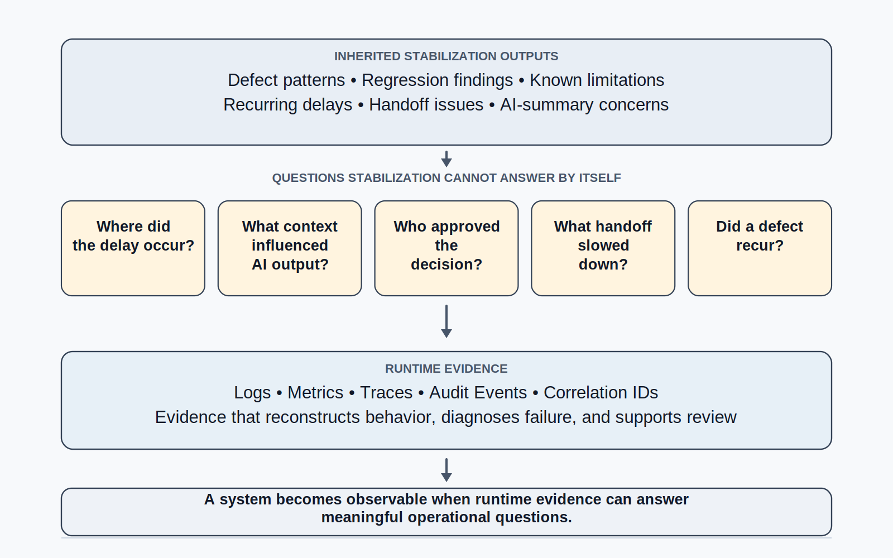
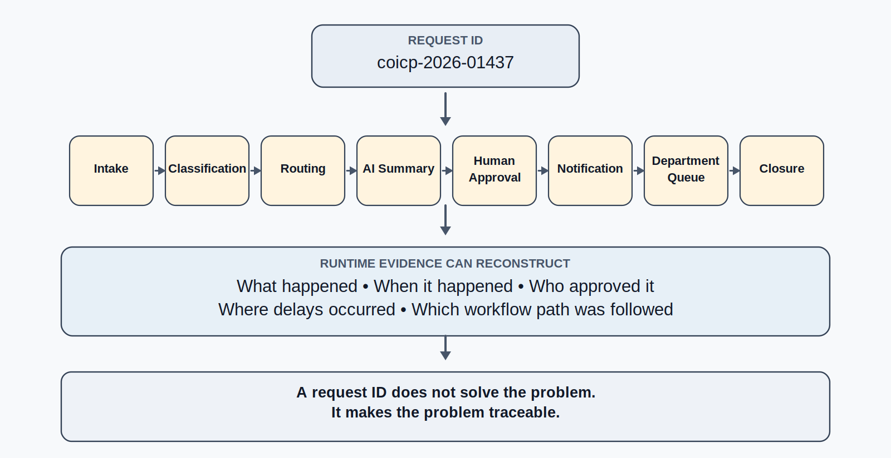
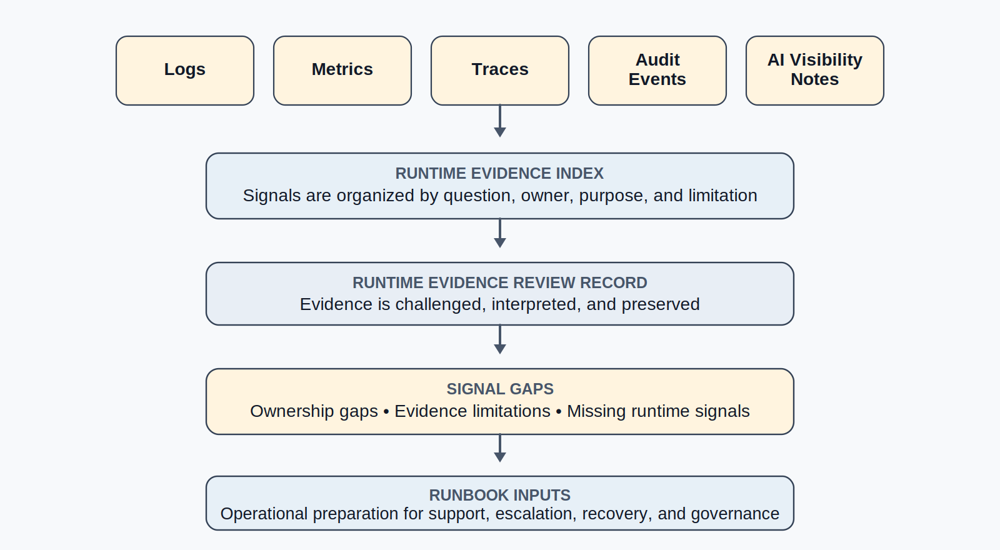
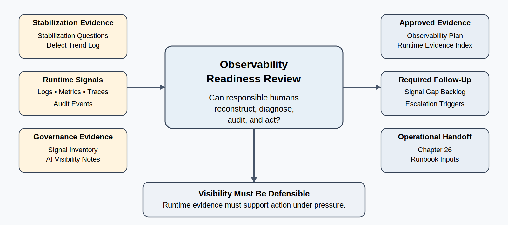

# Chapter 25 Observability and Runtime Evidence
---

### Chapter Governing Line

> A system is not observable because it emits data. It is observable when engineers can reconstruct behavior, diagnose failure, understand impact, and govern action from runtime evidence.

---

## Opening Scenario: The System Was Stabilizing, but Still Hard to See

The COICP team had done the right things after the first pilot learning events. The postmortem was not a blame ritual. It preserved facts, impact, contributing conditions, corrective actions, owners, and missing evidence. The stabilization work that followed was also real. Several recurring defects were classified. Regression scenarios were added. Known limitations were updated. The defect register no longer looked like a loose list of complaints; it had begun to show patterns around routing delay, notification timing, AI-assisted summaries, queue visibility, and handoff ownership.

That was progress. It was not yet operational visibility.

On a Monday morning during the continuing COICP pilot, Community Outreach noticed that several intake requests appeared to be moving more slowly than expected. Student Services said they had not received one request until after the requester had already called for an update. IT could show that the routing rule had executed. A developer could inspect the database and find a final queue state. A support staff member could find a timestamp in one log file. The AI-assisted summary attached to the request looked reasonable, but no one could quickly reconstruct which context the summary had used, when the human reviewer approved it, whether urgency wording changed during review, or exactly where the handoff slowed down.

The system was not failing dramatically. That made the problem more common and more dangerous. LMU had enough evidence to know that something was happening, but not enough runtime evidence to explain it cleanly under pressure.

The question changed. Chapter 24 asked whether instability was being reduced. Chapter 25 asks whether live behavior can be seen, reconstructed, diagnosed, reviewed, and governed. A team cannot operate responsibly if it must rely on memory, screenshots, side spreadsheets, or heroic debugging whenever reality becomes inconvenient.

This is why observability belongs here. It is not a fashionable DevOps term. It is not a dashboard. It is not a pile of logs. It is not a vendor product. In trustworthy engineering, observability is runtime evidence. It is the discipline of designing the system so that humans can understand what happened, why it happened, who or what was affected, where uncertainty remains, and what action is justified.

*Figure 25.1 — From Stabilization Questions to Runtime Evidence*

## 25.1 Observability Is Runtime Evidence, Not Dashboard Decoration

The word observability is often used carelessly. Teams say they have observability because they have dashboards. They say they are observable because they ship logs to a central service. They say they have operational visibility because a tool shows CPU, memory, request counts, or error rates. Those things can help. None of them proves the system is observable.

A system is observable when engineers can answer meaningful questions about live behavior from the evidence the system produces. The emphasis is on questions, not tools.

Observability is valuable not only after visible failures. It is equally important for detecting weak signals, near misses, emerging trends, and subtle behavior changes before they become operational incidents.

For COICP, the meaningful questions are not abstract. Did this request enter the right workflow? Was it classified correctly? Did a routing rule execute? Did an AI-assisted summary influence a human decision? Did the reviewer approve, edit, or override the draft? Did a notification leave the system? Did the downstream department receive it? Did the queue status visible to staff match the state visible to the requester? Did a delay come from intake, routing, notification, departmental handoff, or external dependency? Did a prior defect recur through a different path?

A dashboard may show that requests are flowing. A log may show that a route was assigned. A metric may show average processing time. A trace may show a workflow path. An audit event may show that a human approved an AI-assisted draft. Each signal is useful only if it helps answer an operational question.

More data is not more understanding. In fact, more data can hide weakness if it produces noise without diagnosis. A thousand unstructured log lines may be less useful than five structured events tied to a request ID, workflow step, actor, decision, and outcome. A colorful dashboard may be less mature than a plain runtime evidence index that tells engineers which signals answer which questions.

Visibility is not measured by how much data exists.

It is measured by how quickly responsible people can understand what happened and decide what to do next.

This is the professional distinction students must learn. Observability is not decoration on top of operations. It is an engineering responsibility that connects runtime behavior to evidence, review, accountability, and recovery.

## 25.2 Diagnostic Questions Come Before Signals

The immature observability question is, “What should we log?” The mature question is, “What will we need to know when the system behaves unexpectedly?”

That order matters. If a team begins with signal types, it usually collects whatever is easy to collect. If it begins with diagnostic questions, it designs evidence around operational decisions. COICP does not need logs because logs are fashionable. It needs logs because engineers, support staff, reviewers, and governance owners need to reconstruct intake, routing, AI influence, human approval, notification, handoff, and closure.

A useful diagnostic question has three properties. First, it is tied to an operational decision. Second, it identifies evidence that could answer the question. Third, it makes remaining uncertainty visible. For example, “Was the request routed correctly?” is useful only if the system records the request ID, intake source, classification basis, routing rule, target queue, timestamp, and later handoff state. “Did AI affect the communication?” is useful only if the system preserves the generated draft, relevant source context, reviewer action, final approved text, and downstream outcome at an appropriate level of detail.

Diagnostic questions also prevent dashboard theater. A dashboard showing “requests processed today” may be useful for capacity awareness, but it does not explain why one urgent request waited too long in the wrong queue. A graph showing average response time may hide a small number of high-impact cases. A green status indicator may conceal a governance-sensitive defect if the team has not defined what must be visible.

For Chapter 25, the central teaching move is this: runtime evidence must be designed around the questions trustworthy engineers will be asked under operational pressure.

| Diagnostic Question | Evidence Needed | Why It Matters |
| --- | --- | --- |
| Where did this request go? | Request ID, intake source, routing rule, assigned queue, handoff event. | Supports diagnosis of routing and handoff defects. |
| Why was the request delayed? | Timestamps across intake, routing, notification, queue receipt, and human action. | Separates code delay, workflow delay, and organizational delay. |
| Did AI influence the outcome? | AI draft or recommendation, source context, reviewer approval/edit, final action. | Prevents invisible AI influence and supports human accountability. |
| Did a known defect recur? | Defect link, regression scenario, runtime event, recurrence marker. | Connects stabilization evidence to live behavior. |
| Was an authority-sensitive action approved? | Actor, role, approval event, action taken, audit trail. | Supports governance, auditability, and reviewability. |

## 25.3 Logs Preserve Runtime Facts

Logs are the most familiar form of runtime evidence, but familiarity does not guarantee usefulness. A log is valuable when it preserves a fact that someone will need later. A log is weak when it records noise, hides context, or forces humans to infer the operational story from scattered fragments.

For COICP, useful logs should not merely say “route assigned” or “notification sent.” They should preserve enough structure to support reconstruction: request ID, workflow step, timestamp, component, decision type, rule or policy reference where appropriate, outcome, and relevant actor or system identity. The goal is not to log everything. The goal is to log facts that answer operational questions.

Structured logs matter because operational reality is reconstructed under time pressure. A support engineer should not have to search five systems and guess whether two records refer to the same request. A review board should not have to accept “we think the AI summary was reviewed” because the approval event was not preserved. A developer should not have to read application code to understand which workflow step generated a status change.

Logging also has governance and privacy boundaries. Runtime evidence should not become careless data exposure. Logs must be useful without turning sensitive student, community, or departmental information into unnecessary operational exhaust. The team should preserve identifiers, state transitions, decisions, and diagnostic context while avoiding avoidable storage of sensitive narrative content. Where sensitive content must be preserved for accountability or audit, the repository and operating environment need access rules and retention expectations.

This balance is part of trustworthy engineering. Weak logging makes the system invisible. Reckless logging creates security and privacy risk. Mature logging preserves the right facts, at the right level, for the right operational purpose.

## 25.4 Request IDs Create a Diagnosis Path

A single log event is rarely enough. Operational diagnosis requires continuity. The team needs a way to connect intake, routing, AI-assisted drafting, human review, notification, departmental receipt, queue update, and closure into one reconstructable path.

That is the role of a request ID or correlation ID. It gives the organization a thread through runtime behavior.

For COICP, a request ID should travel with the request from the moment it enters the system. It should appear in relevant logs, workflow events, notification records, AI-assisted draft records where appropriate, approval events, queue updates, and support notes. This does not mean every user sees the internal identifier. It means the engineering and support system can reconstruct the path without relying on memory.

Request IDs are especially important when defects cross boundaries. A routing delay may begin in intake validation, appear in queue processing, affect a notification, and become visible only when Student Services asks why a request arrived late. Without a shared identifier, each team sees its own fragment. With a shared identifier, the organization can ask a disciplined question: what happened to request coicp-2026-01437 from intake to current state?

This is where observability becomes systems thinking. The system is larger than the code, and runtime evidence must be larger than any one component. A request ID does not solve the operational problem. It makes the problem traceable enough that engineers can reason about it.

*Figure 25.2 — Request ID Diagnosis Path*

## 25.5 Metrics Reveal Patterns and Trends

Logs help reconstruct specific events. Metrics help reveal patterns. A metric is a measured signal over time: request volume, routing latency, queue age, error rate, notification delay, retry count, AI-summary review rate, manual override rate, escalation count, or percentage of requests requiring reassignment.

Metrics are powerful because operational trust often erodes through accumulation before it fails visibly. Many operational failures appear sudden only because the organization lacked the evidence needed to recognize the warning signs earlier. One delayed request may be explainable. A rising trend in queue age is a signal. One AI-assisted summary missing urgency context may be a defect. A growing manual-edit rate for AI-assisted summaries may reveal context weakness, prompt drift, stakeholder mismatch, or policy ambiguity. One support call may be anecdote. A pattern of support calls tied to request status confusion is operational evidence.

Metrics must be designed carefully. Average values can conceal high-impact outliers. A low overall error rate can hide defects in a sensitive workflow. A dashboard can look healthy while a small group of users is harmed by a repeated edge case. For COICP, a useful metric might not be “average requests processed per day.” It might be “percentage of urgent student-services requests waiting more than two business hours before departmental acknowledgment” or “number of requests reassigned after initial AI-assisted classification.”

Metrics support stabilization because they can show whether defect reduction is working. Chapter 24 asked whether instability patterns were being reduced. Chapter 25 gives the team runtime evidence to answer that question. If a stabilization fix claims to reduce routing delay, then runtime metrics should show whether the relevant delay pattern changes. If a regression scenario claims to protect a workflow, runtime evidence should help reveal recurrence.

Metrics also prepare Chapter 26. A runbook needs triggers. It needs to know when queue age is too high, when reassignment rates indicate confusion, when notification failures need escalation, when AI-assisted summaries require additional review, and when support teams should switch to a fallback procedure. Those triggers cannot be invented during an incident. They emerge from runtime evidence.

| Metric | Question It Helps Answer | Risk If Misused |
| --- | --- | --- |
| Queue age by department | Where are requests waiting too long? | May hide urgency if not segmented. |
| Routing latency by intake type | Which paths create delay? | Average latency may hide severe outliers. |
| Manual AI-summary edit rate | Are drafts requiring frequent correction? | Can become a vanity metric if edits are not categorized. |
| Reassignment count | Are requests reaching the wrong queue? | May hide informal workarounds outside the system. |
| Notification failure or retry rate | Are stakeholders receiving timely updates? | Technical success may not equal stakeholder understanding. |

## 25.6 Traces and Workflow Paths Expose Cross-Boundary Behavior

Some operational questions cannot be answered by isolated events or aggregate metrics. They require understanding a path across components, services, queues, human actions, and dependencies. That is where traces, workflow paths, or equivalent end-to-end runtime records matter.

In a large distributed system, a trace often means a technical record of a request moving across services. COICP does not need this chapter to become a distributed tracing tutorial. The broader concept is enough: engineers need evidence of how work moves across boundaries. For COICP, the relevant path may include the intake form, validation step, AI-assisted classification or summary, human review, routing service, notification service, departmental queue, and final closure.

The reason this matters is that many operational defects live between components rather than inside one component. A request may be valid at intake, correctly classified, delayed in routing, successfully notified, and then misunderstood by the receiving department. Each local step can look acceptable while the whole workflow fails the stakeholder. This is the same systems-thinking lesson the book has taught from the beginning: local success can still produce system failure.

A trace or workflow path gives engineers the evidence to ask where the system changed state, where it waited, where it retried, where a human approved, where AI influenced the flow, where data crossed a boundary, and where a stakeholder expectation was violated. It also supports governance by showing whether authority-sensitive steps occurred in the intended order.

For students, the important lesson is not the name of a tracing framework. The important lesson is that trustworthy systems preserve enough path evidence for humans to understand cross-boundary behavior.

## 25.7 Audit Events Make Authority Visible

Not all runtime evidence is the same. Some events are operational facts. Some are performance signals. Some are governance events. Audit events belong to the governance layer because they preserve evidence of authority-sensitive action.

COICP includes workflows where authority matters. A request may be routed to a department. A summary may influence human judgment. A notification may communicate status to a stakeholder. A human may approve, edit, override, reassign, close, reopen, or escalate a request. Some actions may affect student services, community partners, departmental accountability, or institutional communication.

For those actions, the system should preserve audit events that answer basic governance questions: who or what initiated the action, under what role or authority, when it occurred, what changed, what evidence or context was used, whether AI-assisted material was involved, whether a human approved it, and what downstream action followed.

Auditability is not bureaucracy. It is how an organization preserves accountability without relying on rumor, memory, or blame. If a stakeholder challenges why a request was routed a certain way, LMU needs evidence. If an AI-assisted draft was approved and later found confusing, LMU needs to know whether the problem was generation, context, review, policy, or workflow. If a request was escalated, LMU needs to know who had authority to escalate and when.

Audit events also discipline AI governance. The chapter does not yet teach controlled delegation in full; Chapter 28 will do that. But Chapter 25 must make clear that AI influence cannot be operationally invisible. Even when AI only drafts or recommends, the runtime record should preserve enough evidence for human accountability.

## 25.8 Runtime Evidence for AI-Assisted Behavior

AI-assisted behavior changes observability because it can influence decisions without looking like a traditional system action. A generated summary may shape how a reviewer understands urgency. A suggested routing category may frame a handoff. A notification draft may affect stakeholder trust. A recommendation may be accepted, edited, overridden, or ignored. If those steps are invisible, the organization cannot explain the behavior of the system it has deployed.

The model is not the system. The AI output is not the operational outcome. The operation includes context, prompt or task framing, source material, generated candidate output, human review, final approved action, downstream effect, and later feedback. Observability must therefore include AI-influenced workflow evidence at a level appropriate to risk, privacy, and governance.

What ultimately matters is not what the model produced in isolation. What matters is how that output influenced human decisions, organizational actions, and operational outcomes.

For COICP, that does not mean dumping every prompt and every token into a log. That would be careless and often useless. It means preserving the facts needed to answer operational questions. Was AI assistance used? Which workflow step did it support? What source category or context set was used? Did a human approve, edit, or reject the output? Did the final action differ from the generated suggestion? Was a later defect or stakeholder concern linked to that step?

This evidence should be proportionate. Low-risk drafting may require lightweight disclosure and review evidence. Authority-sensitive recommendations require stronger auditability. State-changing AI behavior, if later introduced, will require much stronger controls and belongs to the controlled delegation discussion in Chapter 28. Chapter 25 prepares that later work by establishing that invisible AI influence is operational risk.

Anti-hype discipline matters here. The chapter should not portray AI as mysterious or magical. It should not assume AI is the cause of every operational issue. It should not excuse human teams by saying “the model did it.” AI-assisted behavior is part of a sociotechnical workflow, and trustworthy engineers must make that workflow visible enough to diagnose and govern.

| AI-Assisted Step | Runtime Evidence That May Be Needed | Governance Purpose |
| --- | --- | --- |
| Summary draft | Use flag, source-context category, reviewer action, final approved text reference. | Separates generated suggestion from human-owned communication. |
| Routing suggestion | Suggested category, final category, reviewer/override event, confidence or rationale if used. | Shows whether AI influenced an authority-sensitive handoff. |
| Notification draft | Draft generation event, human edits, approval event, send event, stakeholder response signal. | Supports accountability for communication quality. |
| Escalation recommendation | Recommendation event, source evidence, approver, final action, audit record. | Prepares stronger controls for future delegated authority. |

## 25.9 Repository-Centered Observability Evidence

Runtime evidence is produced by the live system, but the plan, definitions, review records, and learning from that evidence must become durable engineering memory. That is where repository-centered engineering continues after release.

The repository should not become a dump of raw operational data. It should preserve the engineering artifacts that explain what runtime evidence exists, why it exists, what questions it answers, who owns it, how it supports review, and what gaps remain. Raw logs, metrics, and traces may live in operational systems. The repository preserves the observability plan and the evidence architecture.

For COICP, it makes sense to reference repository artifacts when they support engineering understanding. An observability plan might live at `/docs/operations/observability/observability_plan.md`. A runtime evidence index might live at `/docs/operations/observability/runtime_evidence_index.md`. A signal inventory might define logs, metrics, traces, audit events, and owners at `/docs/operations/observability/signal_inventory.md`. AI runtime visibility notes might be preserved at `/docs/governance/ai_governance/ai_runtime_visibility_notes.md`. The Observability Readiness Review record might belong at `/docs/governance/reviews/runtime_evidence_review_record.md`.

Those paths are not the lesson. The lesson is that operational evidence should be planned, reviewable, and durable. Future engineers should be able to understand why a metric exists, what question it answers, what limitation it has, and how it connects to stabilization, runbooks, incidents, and governance. Without that preserved context, organizations often inherit signals without understanding the decisions, risks, and lessons that originally justified them. If a signal exists only in one engineer’s head or one dashboard nobody understands, it is fragile. If it is connected to repository evidence, it becomes part of the organization’s engineering memory.

Repository-centered observability also prevents recurrence of earlier anti-patterns. It prevents dashboard theater by requiring signals to map to questions. It prevents memory decay by preserving definitions and ownership. It prevents AI laundering by preserving AI visibility notes. It prevents release-defense defensiveness by letting runtime evidence update known limitations when reality changes.

Everything important leaves evidence, including runtime behavior.

*Figure 25.3 — Runtime Evidence Chain*

## 25.10 Runtime Evidence / Observability Readiness Review

A review is where engineering claims become challengeable. Chapter 25 introduces the Runtime Evidence / Observability Readiness Review. This review does not ask whether COICP owns a monitoring tool. It asks whether the system can produce the runtime evidence needed for responsible operation.

The review should receive stabilization questions from Chapter 24: Which defect patterns require recurrence detection? Which workflow delays still worry stakeholders? Which known limitations need runtime visibility? Which AI-assisted behaviors have operational risk? Which handoffs are most likely to produce confusion? Which signal gaps make support or governance dependent on guesswork?

The review should then challenge the runtime evidence posture. Can a request be reconstructed across intake, routing, AI-assisted steps, human approval, handoff, notification, and closure? Can the team detect recurrence, degradation, delay, queue buildup, or workflow confusion? Can authority-sensitive actions be audited? Can AI-influenced behavior be diagnosed without treating the model as an unexplained black box? Do logs, metrics, traces, and audit events answer questions, or merely produce data? What signal gaps remain, who owns them, and what risks do they create?

The outputs of the review should be concrete. It should produce an approved observability plan or a list of required revisions. It should identify signal owners. It should record diagnostic paths for high-risk workflows. It should name remaining signal gaps and known limitations. It should identify metrics or audit events that should become escalation triggers. Most importantly, it should export evidence to Chapter 26, where operational readiness and runbooks turn runtime evidence into action.

This review strengthens engineering judgment because it forces the team to defend visibility, not activity. A team can have logs and still be unable to diagnose. It can have dashboards and still be unable to govern. It can have metrics and still miss stakeholder harm. The review asks the harder question: when something important happens in operation, will responsible humans be able to know enough to act? A system that cannot explain its behavior under pressure cannot be responsibly governed.

- What operational questions must the system answer under pressure?
- Can a request be reconstructed across workflow boundaries?
- Which signals reveal recurrence of Chapter 24 defect patterns?
- Which authority-sensitive actions require audit events?
- Can AI-influenced behavior be diagnosed and human ownership preserved?
- Which signal gaps remain, and who owns them?
- Which runtime signals should feed Chapter 26 runbooks and escalation paths?

*Figure 25.4 — Observability Readiness Review Gate*

## 25.11 Operational Takeaways

Chapter 25 should leave the reader with a professional standard: trustworthy systems do not merely run; they explain themselves well enough for humans to diagnose, govern, recover, and learn.

The following takeaways capture the chapter’s operational discipline.

- Observability is runtime evidence, not dashboard decoration.
- Diagnostic questions come before logs, metrics, traces, or tools.
- More data is not more understanding.
- Structured logs preserve facts; request IDs create diagnostic continuity; metrics reveal patterns; traces expose paths; audit events make authority visible.
- AI-assisted behavior must be visible enough to diagnose input, context, review, action, and outcome.
- Repository-centered engineering continues after release through observability plans, signal inventories, runtime evidence indexes, AI visibility notes, and review records.
- A system that cannot be diagnosed cannot be responsibly operated under pressure.

## 25.12 Exercises

### Exercise 1: Build a Diagnostic Question Inventory

Create a repository artifact:

`/docs/observability/diagnostic_question_inventory.md`

Identify five operational questions that COICP must be able to answer during pilot operation.

For each question, document:

- Why the question matters
- Who would ask it
- What evidence is required to answer it
- Which signals provide that evidence
- What uncertainty would remain if the evidence were unavailable

Explain how the questions influence observability design.

### Exercise 2: Design a Request-ID Diagnosis Path

Create a repository artifact:

`/docs/observability/request_id_diagnosis_path.md`

Design a request-ID tracing path from intake through closure.

The path must include:

- Request creation
- Routing decisions
- AI-assisted activities
- Human approvals
- Notifications
- Escalations
- Closure events

Identify where evidence could be lost and what controls should exist to preserve traceability across workflow boundaries.

### Exercise 3: Create a Runtime Signal Inventory

Create a repository artifact:

`/docs/observability/runtime_signal_inventory.md`

Select one COICP stabilization risk identified in Chapter 24.

Define the runtime evidence required to observe that risk, including:

- Logs
- Metrics
- Workflow records or traces
- Audit events

For each signal, explain:

- What question it helps answer
- What limitations it has
- What additional evidence may be required

Evaluate whether the proposed signals are sufficient for diagnosis.

### Exercise 4: Define AI Runtime Visibility Requirements

Create a repository artifact:

`/docs/observability/ai_runtime_visibility_requirements.md`

Define the evidence that should be preserved when AI assists with:

- Notification drafting
- Routing recommendations
- Priority suggestions
- Workflow support activities

For each activity, identify:

- Input context
- Generated output
- Human review requirements
- Approval records
- Modification history
- Final action taken

Explain how the evidence supports accountability and future review.

### Exercise 5: Conduct an Observability Readiness Review

Create a repository artifact:

`/docs/governance/reviews/observability_readiness_review_record.md`

Conduct an observability review using the Chapter 25 review questions.

Evaluate:

- Diagnostic coverage
- Signal quality
- Traceability
- Runtime visibility
- AI-observability requirements
- Evidence gaps
- Ownership assignments

Document:

- Findings
- Missing evidence
- Corrective actions
- Assigned owners
- Runbook implications

Determine whether the system is operationally observable, conditionally observable, or not yet observable.

## 25.13 Trustworthiness Mapping

Trustworthiness is strengthened when runtime behavior becomes visible and reviewable. It does not claim that observability alone makes a system trustworthy. Observability supports trustworthiness when it helps humans understand behavior, diagnose failure, govern authority, detect recurrence, and act responsibly.

| Pillar | How Runtime Evidence Strengthens It |
| --- | --- |
| Observability / Operational Visibility | Defines runtime evidence as the ability to reconstruct live behavior and see meaningful operational signals. |
| Recoverability | Prepares Chapter 26 by producing signals and diagnostic paths that future runbooks can use for response and recovery. |
| Traceability | Connects requests, workflow events, AI-assisted steps, human approvals, defects, limitations, and review records. |
| Reviewability | Introduces the Runtime Evidence / Observability Readiness Review as a challenge mechanism for signal sufficiency. |
| Governability | Uses audit events and AI runtime visibility to make authority-sensitive action visible. |
| Accountability | Requires owners for signal gaps, runtime evidence definitions, review outcomes, and AI-influenced behavior. |
| Human Oversight | Ensures humans have enough runtime evidence to approve, override, investigate, and learn. |
| Security and Privacy | Frames logging and auditability as balanced evidence practices that avoid careless data exposure. |

## 25.14 Closing Transition: From Seeing to Acting

By the end of Chapter 25, LMU has not solved every operational problem. That would be the wrong lesson. What has changed is that COICP can begin to explain its live behavior. The team can define diagnostic questions, connect runtime facts through request IDs, recognize patterns with metrics, follow workflow paths, preserve audit events, and make AI-assisted behavior visible enough for human accountability.

That is a major operational maturity step. It is not the end of operational trust.

Seeing a problem is not the same as responding to it.

Runtime evidence creates awareness. It does not create action.

A signal does not assign an owner. A dashboard does not decide when to escalate. A log entry does not tell support staff what to do. A trace does not automatically trigger rollback. An audit event does not communicate with stakeholders.

Runtime evidence creates the conditions for responsible action, but the organization still needs procedures, roles, escalation paths, fallback expectations, recovery steps, communication discipline, and operational authority.

That is the work of Chapter 26.

Chapter 24 asked whether instability was being reduced. Chapter 25 asked whether live behavior could be seen and explained. Chapter 26 asks whether LMU can operate, support, escalate, recover, and communicate when those signals show that action is required.

Observability makes reality visible.

Operational readiness determines what the organization does next.
