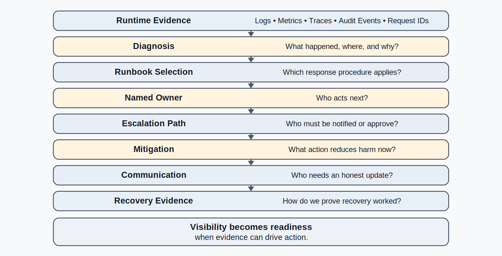
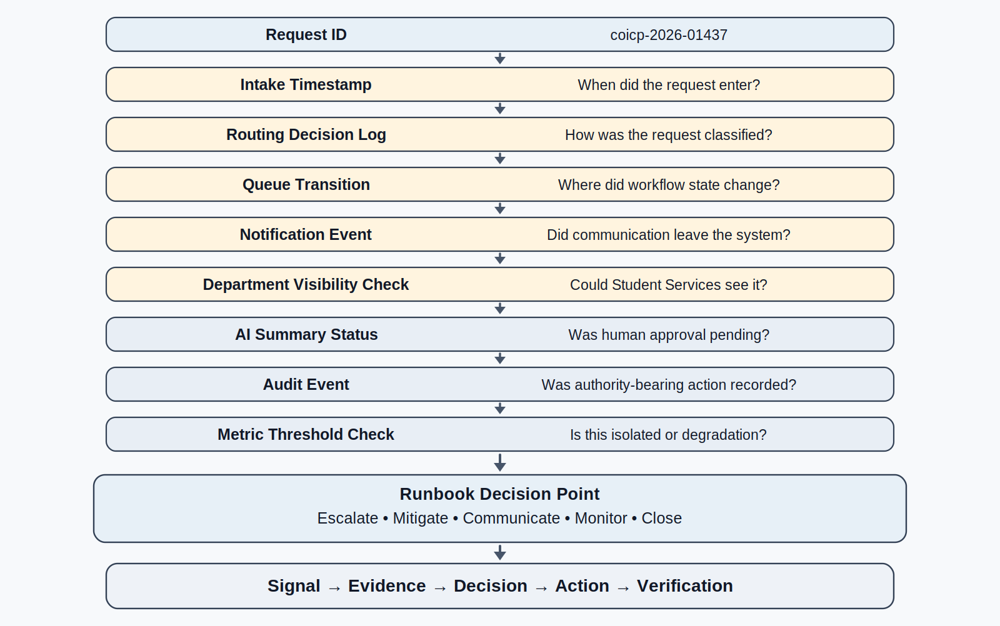
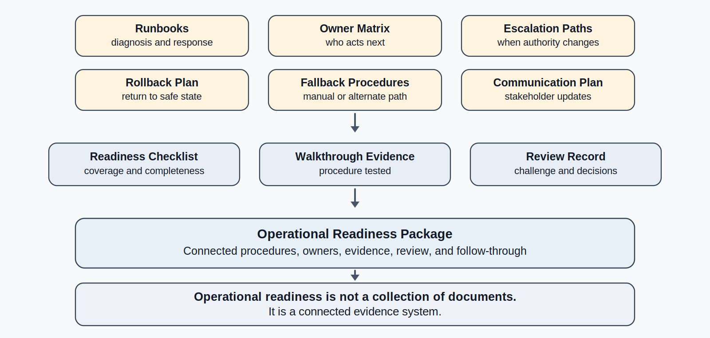
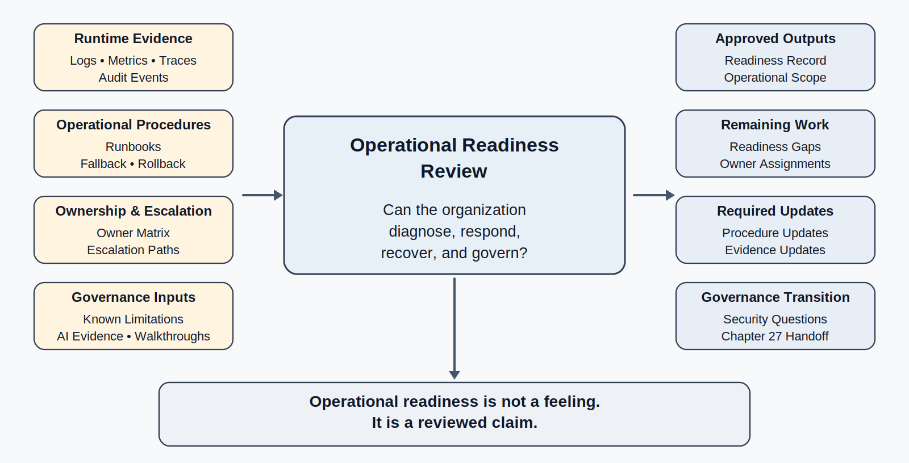

# Chapter 26<br><span class="chapter-title-main">Operational Readiness and Runbooks
---

### Chapter Governing Line

> A system is not operationally ready because it can run. It is operationally ready when people know how to diagnose, escalate, mitigate, recover, communicate, and prove what happened.

---

## Opening Scenario: The System Was Observable. The Team Was Not Ready.

The COICP team had made real progress.

After the first stabilization cycle, the Campus Operations and Incident Coordination Platform was no longer operating in the dark. Chapter 25 had forced LMU to stop treating logs as leftovers and dashboards as decoration. The team had added request IDs. It had introduced structured logs. It had defined operational metrics for routing latency, queue depth, notification delay, review backlog, and AI-assisted draft hold time. It had begun correlating intake events across routing, notification, departmental queue assignment, and human review. The system could now tell the team more than it could tell them a few weeks earlier.

That was the good news.

The first busy Monday after those changes exposed the next maturity gap.

A cluster of outreach requests arrived between 8:15 and 8:40 a.m. Several were routine. A few had student-service implications. Two involved community partners who had already contacted LMU by phone. COICP accepted the requests, assigned request IDs, recorded queue transitions, captured notification events, and preserved audit records for AI-assisted summary drafts that required human approval.

The runtime evidence was there.

The response was not.

IT could see elevated routing latency. Student Services could see that two requests reached the department later than expected. Community Outreach could see confused stakeholder follow-up. The COICP product owner could see that the queue was not failing catastrophically but was not behaving comfortably. The AI governance reviewer could confirm that AI had not taken unauthorized action; the drafts had been held for human review as intended. The review board could see that the system was producing evidence, but the organization did not yet have a disciplined answer to a simple operational question:

Who acts next?

One staff member checked the dashboard. Another searched logs by timestamp. A developer asked for a request ID. A student-services coordinator asked whether the workflow should be manually rerouted. Someone suggested waiting to see whether the queue cleared. Someone else asked whether a stakeholder update should be sent. The product owner asked whether this counted as an incident, a known limitation, a stabilization defect, or an expected pilot condition.

None of those questions were unreasonable. The problem was that the organization was improvising the answer.

This is the point where many teams misunderstand observability. They believe that once a system can be seen, it can be operated. That is false. Visibility is necessary, but it is not readiness. A dashboard is not an operator. A log is not a response plan. A metric threshold is not an escalation path. A trace is not a decision. An audit event is not recovery.

Operational readiness begins when runtime evidence is connected to human responsibility, documented procedures, escalation rules, fallback paths, communication expectations, and evidence-preserving closure.

Chapter 25 made COICP visible. Chapter 26 asks whether LMU is ready to act.


*Figure 26.1 — From Runtime Evidence to Operational Readiness*

The first lesson of this chapter is uncomfortable but necessary: a system can be observable and still not be operationally ready.

---

## 26.1 Operational Readiness Is More Than Deployment

Deployment means the system has been placed into an environment where users, stakeholders, workflows, data, dependencies, and organizational expectations can interact with it. Deployment is important, but it is not operational readiness.

Operational readiness means the organization can run the system responsibly under realistic conditions. 

Operational readiness should be exercised not only during visible incidents but also during near misses, minor degradations, and unusual conditions. Organizations that practice response only during major failures often discover readiness gaps when the stakes are highest.

That includes calm conditions, but the real test is pressure. Can the organization diagnose unexpected behavior? Can it identify who owns the first response? Can it escalate without confusion? Can it mitigate harm while preserving evidence? Can it use fallback procedures without creating ungoverned side channels? Can it roll back safely when necessary? Can it communicate honestly? Can it verify that recovery worked? Can it update the evidence record so the next team is not forced to relearn the same lesson?

Those questions are not administrative. They are engineering questions.

Operational readiness sits between observability and security governance. It inherits runtime evidence from Chapter 25 and prepares the security, privacy, access, and authority questions of Chapter 27. This position matters. If Chapter 26 came before observability, the runbooks would be procedural guesses without signals. If it came after security governance, the book would skip the moment when teams discover which operational actions need authority, auditability, and protection.

The maturity ladder is useful here:

| Maturity state | Question | Evidence |
|---|---|---|
| Deployable | Can the system run in the target environment? | Release record, deployment notes, configuration evidence |
| Observable | Can the team see meaningful runtime behavior? | Logs, metrics, traces, request IDs, audit events |
| Operable | Can people act on what they see? | Runbooks, owners, escalation paths, mitigation steps |
| Recoverable | Can the organization contain and correct failure? | Rollback plans, fallback procedures, recovery verification |
| Governable | Can authority and risk remain controlled under pressure? | Approval paths, audit records, access controls, review evidence |

COICP has moved through the first two states. It has a defended pilot release. It has runtime evidence. Now it must become operable.

This is where many student projects and early professional teams fail. They treat operations as something that begins after construction is done. In reality, operational readiness is a continuation of construction discipline. Requirements become expected behavior. Architecture defines responsibility boundaries. ADRs preserve consequential decisions. Tests define verified behavior. Release records preserve claims and limitations. Observability shows what is happening. Runbooks tell humans what to do with that information.

A system is not operationally ready because one experienced developer understands it. It is not operationally ready because the team can assemble a response in Slack. It is not operationally ready because someone can search logs if asked.

It is operationally ready when the organization has preserved enough procedure, ownership, evidence, and authority that response does not depend on memory, heroics, or luck.

Operational readiness exists when responsible action becomes repeatable.

Operational readiness is therefore a trustworthiness discipline. It strengthens recoverability, accountability, operational visibility, governability, reviewability, and human oversight. It also exposes weak areas. If the team cannot name the owner, the ownership model is weak. If the team cannot identify the first signal, observability is weak. If the team cannot describe fallback, recoverability is weak. If the team cannot determine who may approve a manual override, governance is weak.

Operational readiness is where hidden operational assumptions become visible.

---

## 26.2 What a Runbook Is - and Is Not

A runbook is an executable operational guide for a known class of condition, failure, degradation, or support need.

That definition has two important words: executable and operational.

Executable means a capable responder can follow it under pressure. It is not a narrative. It is not a policy essay. It is not a long architectural explanation. It should say what signal triggered attention, what evidence to check, what decision points matter, who owns action, when escalation is required, what mitigation is allowed, what fallback or rollback exists, what communication is needed, and what evidence must be preserved.

Operational means it is connected to actual system behavior, actual stakeholders, actual authority boundaries, actual support expectations, and actual risk. A runbook that does not match the system in operation is worse than useless because it creates confidence where none is deserved.

For COICP, a runbook might address routing delay, notification failure, AI-assisted summary review backlog, queue inconsistency, departmental handoff confusion, or data synchronization delay. Each one should begin from evidence, not folklore.

A useful runbook answers questions like these:

- What signal or condition triggers this runbook?
- What request ID, log event, metric, trace, audit event, or stakeholder report should be checked first?
- Who owns first response?
- Who is the backup owner?
- What severity threshold changes the response?
- When must the issue be escalated?
- Which mitigation is allowed without additional approval?
- Which mitigation requires approval?
- What fallback path exists?
- What rollback path exists?
- What communication is required?
- What evidence must be preserved before and after action?
- How does the team verify closure?
- What follow-up artifact must be updated?

A runbook should live where future operators and reviewers can find it. For COICP, repository references might appear only where they help preserve operational evidence. Examples include:

```text
/docs/operations/runbooks/coicp_routing_delay_runbook.md
/docs/operations/runbooks/coicp_notification_failure_runbook.md
/docs/operations/runbooks/coicp_ai_summary_review_runbook.md
/docs/operations/ownership/operational_owner_matrix.md
/docs/operations/escalation/escalation_path_register.md
```

Those paths are not the lesson by themselves. The lesson is that operational response must become durable, reviewable engineering memory.

A runbook is not a substitute for judgment. It cannot predict every condition. It cannot remove uncertainty. It cannot make a weak system strong. It cannot convert an untrained team into a mature operating organization overnight. It can, however, reduce confusion, preserve evidence, define ownership, prevent unsafe improvisation, and create a shared starting point for response.

A runbook is also not a compliance artifact. A beautiful runbook that no one can follow is runbook theater. A runbook copied from another system is runbook theater. A runbook that assumes the original author is present is runbook theater. A runbook that has never been walked through is runbook theater. A runbook that tells responders to "check the logs" without saying which logs, what fields, what request ID, or what threshold matters is runbook theater.

Operational readiness depends on runbooks, but it depends even more on the discipline behind them.

---

## 26.3 Diagnosis Paths: Turning Evidence into Action

Chapter 25 established that runtime evidence must help engineers reconstruct what happened. Chapter 26 adds the next requirement: runtime evidence must help responders decide what to do next.

That requires diagnosis paths.

A diagnosis path is the ordered connection between a symptom, the runtime evidence that explains it, the decision points that matter, and the operational response that follows. It prevents responders from starting with guesses. It also prevents teams from drowning in evidence. Modern systems can produce too much data as easily as too little. Without a diagnosis path, responders may search dashboards, logs, traces, tickets, and messages without knowing which signal should guide action. The goal is not to eliminate investigation. The goal is to prevent investigation from becoming random exploration under pressure.

For COICP, consider a stakeholder report: "A community-partner request has not reached Student Services."

A weak response begins with broad speculation:

Maybe the routing service is slow. Maybe the notification failed. Maybe AI classification was wrong. Maybe Student Services missed the queue update. Maybe the requester entered the wrong category. Maybe the system is fine and the stakeholder is impatient.

A stronger response begins with a diagnosis path:

```text
stakeholder report
-> request ID
-> intake timestamp
-> routing decision log
-> queue transition timestamp
-> notification event
-> departmental queue visibility check
-> AI-assisted summary status, if applicable
-> audit event
-> metric threshold comparison
-> runbook decision point
```

The request ID matters because it gives the team a stable handle. The intake timestamp establishes the starting point. The routing decision log shows how the system classified the request. Queue transition timestamps show movement across workflow boundaries. Notification events show whether communication occurred. Queue visibility checks show whether downstream departments could actually see the request. AI-assisted summary status shows whether generated material was waiting for human approval. Audit events show whether authority-bearing actions occurred. Metrics show whether the case is isolated or part of broader degradation.


*Figure 26.2 — Request ID to Runbook Diagnosis Path*

Diagnosis paths also reveal whether the team has the right evidence. If the runbook asks for a queue transition timestamp but the system does not record it, that is an observability gap. If the runbook asks whether human approval occurred but the system cannot show it, that is an auditability gap. If the runbook asks who owns the handoff and no role is named, that is an accountability gap. If the runbook asks whether rollback is allowed but no release condition says so, that is a governance gap.

This is why operational readiness should feed back into observability. A runbook is one of the best tests of whether runtime evidence is useful. If responders cannot use evidence to decide, the evidence is not yet operational.

The repository can preserve this connection in a concise way:

```text
/docs/observability/runtime_evidence_index.md
/docs/observability/logging/request_id_logging_standard.md
/docs/observability/metrics/operational_metrics_catalog.md
/docs/operations/runbooks/coicp_routing_delay_runbook.md
```

Again, the purpose is not to admire the directory structure. The purpose is to make the operational chain reconstructable: signal, evidence, decision, action, verification.

---

## 26.4 Ownership and Escalation

A runbook without ownership is documentation pretending to be readiness.

When a system is under pressure, "the team" is not an owner. "Someone from IT" is not an owner. "The developer who knows the routing code" is not a sustainable owner. "Ask in the channel" is not an escalation model. Vague ownership creates delay, duplicate work, conflicting action, and unmanaged risk.

Operational readiness requires named roles.

For COICP, the owner model may include several distinct responsibilities:

| Role | Responsibility |
|---|---|
| First responder | Confirms the signal, gathers initial evidence, opens or updates the operational record |
| Technical owner | Diagnoses system behavior, service condition, logs, metrics, traces, and deployment state |
| Workflow owner | Interprets departmental handoff and operational process impact |
| Product owner | Decides pilot-scope implications and stakeholder priority |
| Governance owner | Evaluates authority, approval, AI-use, privacy, or risk implications |
| Communication owner | Coordinates stakeholder updates and internal status language |
| Backup owner | Acts when the primary owner is unavailable |

The point is not to create bureaucracy. The point is to prevent confusion under pressure.

Escalation is the next layer. Escalation is not failure. Escalation is an authority pathway. It says when a condition has exceeded normal response and requires additional decision-making authority, expertise, communication, or risk acceptance.

A useful escalation path defines:

- what threshold triggers escalation,
- who escalates,
- who receives escalation,
- what evidence must accompany escalation,
- what authority the escalation owner has,
- what communication is required,
- what record must be updated.

For COICP, escalation might occur when routing latency exceeds a defined threshold for a sustained period, when a request with student-support implications is delayed beyond an agreed window, when notification failure affects multiple departments, when AI-assisted summaries repeatedly omit urgency context, or when a manual bypass is requested.

A repository artifact such as `/docs/operations/escalation/escalation_path_register.md` is useful only if it changes behavior. It should not be a list of names detached from runbooks. It should be linked from relevant procedures and reviewed when the team learns from incidents, postmortems, readiness drills, or staffing changes.

Ownership also connects to accountability. Accountability is not blame. It is the ability to say who is responsible for acting, deciding, preserving evidence, communicating, and following through. Chapter 23 separated blame from learning. Chapter 24 separated defect closure from stabilization. Chapter 26 separates operational readiness from informal heroics.

If no one knows who acts next, the system is not ready.

---

## 26.5 Mitigation, Fallback, and Rollback

Operational response requires more than diagnosis. Once the team understands what is happening, it must know which actions are allowed.

Three response concepts matter: mitigation, fallback, and rollback.

Mitigation reduces impact while the system continues operating. For example, if COICP routing latency is elevated but requests are still flowing, the team may temporarily increase human review attention for high-priority categories or notify departments that queue updates may lag.

Fallback uses a safer alternate workflow when the normal path is unreliable. For example, if the automated notification path is delayed, LMU may use a predefined manual notification procedure for certain request categories. A fallback is not an excuse for ungoverned side spreadsheets or private workarounds. It must be known, authorized, documented, and eventually reconciled with the system of record.

Rollback returns software, configuration, or workflow behavior to a prior known state. Rollback is appropriate when a recent change has introduced unacceptable risk and a prior state is safer. But rollback is not magic. It can lose data, create inconsistency, confuse users, or reintroduce known limitations. A rollback plan must identify what can be rolled back, what cannot, what data must be protected, who approves the action, and how recovery will be verified.

A mature runbook distinguishes these options. A weak runbook says "fix the issue." A useful runbook says what kind of response is permitted under which conditions.

For COICP, a routing-delay runbook might include:

| Condition | Allowed response | Approval required? | Evidence required |
|---|---|---|---|
| Isolated request delay under threshold | Monitor and record | No | Request ID, timestamp, queue state |
| Repeated delay for one department | Escalate to workflow owner | Yes, workflow owner | Trend evidence, affected requests |
| High-priority request delayed | Manual review and stakeholder update | Yes, product/workflow owner | Request ID, impact note, action record |
| Recent routing configuration caused broad misrouting | Configuration rollback | Yes, technical and governance owner | Change record, rollback plan, validation evidence |
| AI-assisted summaries held beyond threshold | Temporarily prioritize human review queue | Yes, AI/workflow owner | Summary queue state, approval evidence |

Repository paths may support these procedures:

```text
/docs/operations/recovery/rollback_plan.md
/docs/operations/recovery/fallback_procedures.md
/docs/release_evidence/known_limitations.md
/docs/operations/readiness/operational_readiness_checklist.md
```

Known limitations matter here. If a limitation was accepted during release readiness but becomes operationally painful, the runbook should not pretend the limitation is gone. It should name the limitation, describe the expected response, and identify the owner. Honest engineering remains mature engineering after deployment.

The most dangerous fallback is the informal workaround that becomes permanent. Support staff keeping a side spreadsheet may be understandable during confusion, but if it becomes the real operating system, COICP loses traceability, governance, and trust. A fallback must preserve evidence or include a reconciliation step that restores evidence to the system of record.

Mitigation, fallback, and rollback are not signs of weakness. They are signs that the organization has prepared for reality.

---

## 26.6 AI-Assisted Operational Behavior Requires Special Runbook Coverage

AI is not the center of Chapter 26, but AI cannot be ignored.

COICP includes AI-assisted behavior: classification support, escalation recommendation support, notification drafting, and summary assistance. The architecture established earlier in the book keeps authority bounded. AI proposes; engineers verify. Human approval remains necessary for authority-sensitive action. Chapter 26 asks what happens when those AI-assisted behaviors appear inside operational response.

A runbook involving AI-assisted behavior must answer a few additional questions:

- Was AI output involved in the operational condition?
- What input or context was provided to the model?
- What output did the model produce?
- Was the output approved by a human?
- Was the output modified before approval?
- Did the approved output affect routing, stakeholder communication, escalation, or prioritization?
- Can the action be reversed or corrected?
- What audit evidence exists?
- Does this reveal a context-control problem, a review problem, an evaluation gap, or an operational workflow issue?

Without those questions, teams fall into predictable traps. They may blame the model for a human-approved communication. They may treat AI output as operational fact. They may correct the prompt without correcting the workflow. They may change system behavior without updating evaluation scenarios. They may summarize an incident with AI and then forget that the summary itself needs verification.

For COICP, suppose an AI-assisted summary omits urgency context. The runbook should not simply say, "Regenerate the summary." It should guide the responder through operational evidence:

```text
request ID
-> original intake text
-> AI-assisted draft summary
-> reviewer approval or modification record
-> notification event
-> stakeholder impact
-> evaluation scenario gap
-> corrective action or limitation update
```

The relevant repository evidence might include:

```text
/docs/governance/ai_governance/ai_use_log.md
/docs/governance/ai_governance/ai_operational_learning_notes.md
/docs/operations/runbooks/coicp_ai_summary_review_runbook.md
/docs/testing_and_quality/evaluation/ai_evaluation_scenarios.md
```

The last path is included only when it makes sense: if operational evidence reveals that evaluation did not cover a scenario, that learning should eventually feed back into testing and evaluation evidence.

Chapter 28 will handle controlled delegation in depth. Chapter 26 should not preempt that chapter. Its job is narrower: make sure that operational readiness includes AI-related diagnosis, auditability, approval, fallback, and human ownership. AI-assisted operational behavior is not mature unless humans can reconstruct what happened and act responsibly.

The model is not the system. The AI output is not the operational truth. The approved, logged, governed workflow is what the organization must own.

---

## 26.7 The Operational Readiness Package

By this point, the chapter has introduced operational readiness, runbooks, diagnosis paths, ownership, escalation, mitigation, fallback, rollback, and AI-specific operational coverage. Those pieces need to come together as an operational readiness package.

**The package is not a binder. It is a connected evidence system.**

For COICP, an operational readiness package might include:

```text
/docs/operations/runbooks/
/docs/operations/ownership/operational_owner_matrix.md
/docs/operations/escalation/escalation_path_register.md
/docs/operations/recovery/rollback_plan.md
/docs/operations/recovery/fallback_procedures.md
/docs/operations/communications/operational_communication_plan.md
/docs/operations/readiness/operational_readiness_checklist.md
/docs/operations/readiness/runbook_walkthrough_record.md
/docs/governance/reviews/operational_readiness_review_record.md
```

These artifacts should be connected to existing evidence, not isolated from it. A routing-delay runbook should link to observability evidence. A rollback plan should link to release evidence and known limitations. An AI-summary runbook should link to AI-use governance evidence. An escalation register should link to ownership and review records. A readiness review should challenge whether the entire package can actually support operation.


*Figure 26.3 — Operational Readiness Package*

A useful operational readiness package does three things.

First, it reduces dependency on memory. If only one developer knows how to diagnose routing delay, LMU is not operationally ready. If only the product owner knows when to notify stakeholders, LMU is not operationally ready. If only a senior staff member knows the manual fallback procedure, LMU is not operationally ready.

Second, it supports review. A review board cannot challenge operational readiness if readiness exists only in conversations. It needs artifacts: runbooks, owners, escalation thresholds, recovery steps, evidence expectations, walkthrough records, and unresolved gaps.

Third, it prepares the next maturity step. Once runbooks name who can act, what data they can access, what approvals are needed, and what evidence must be preserved, security and governance questions become visible. That is the bridge to Chapter 27.

The operational readiness package is not proof that nothing will go wrong. It is proof that the organization has prepared to respond when something does.

---

## 26.8 Testing the Runbook

A runbook that has never been tested is an assumption.

Teams often discover this too late. The runbook looks reasonable when written. It uses confident verbs. It names systems. It includes steps. It may even have screenshots or examples. Then a real event occurs, and the responder discovers missing permissions, unclear thresholds, stale owners, unavailable dashboards, ambiguous escalation language, incomplete rollback steps, or communication expectations that no one approved.

Testing a runbook does not require creating a major incident. It can begin with a tabletop walkthrough. A few people take a realistic scenario and walk through the runbook step by step. They ask whether a new responder could follow it. They check whether evidence exists. They confirm whether owners are reachable. They test whether escalation language is clear. They verify whether fallback and rollback steps are realistic. They identify what evidence must be preserved and what follow-up artifacts must be updated.

For COICP, a routing-delay walkthrough might ask:

- Can the responder identify the request ID?
- Can they find the relevant structured logs?
- Do the metrics define what counts as elevated latency?
- Does the runbook distinguish isolated delay from broad degradation?
- Is the workflow owner named?
- Is the backup owner named?
- Does the runbook say when Student Services must be notified?
- Does the fallback path avoid ungoverned side records?
- Does the runbook preserve evidence for later postmortem or stabilization review?
- Does the runbook identify whether the known limitations record must be updated?

The walkthrough should produce evidence of its own:

```text
/docs/operations/readiness/runbook_walkthrough_record.md
/docs/operations/readiness/readiness_drill_notes.md
```

The walkthrough record should not be ceremonial. It should preserve what was tested, who participated, what scenario was used, which gaps were found, who owns each correction, and when the runbook will be reviewed again.

This is where operational readiness becomes measurable without becoming checklist theater. The question is not whether the team checked a box saying "runbook exists." The question is whether the runbook helped people move from signal to diagnosis to action to evidence-preserving closure.

Runbook testing also reveals training needs. If responders cannot interpret the metric, the problem may be training. If they cannot access logs, the problem may be permissions. If they cannot decide whether escalation is required, the problem may be governance. If they cannot explain the AI approval record, the problem may be AI oversight or auditability. If they cannot communicate status without overclaiming, the problem may be operational communication discipline.

A tested runbook is not perfect.

It is simply less imaginary.

The goal is not to prove that every future response will succeed. The goal is to discover uncertainty, ambiguity, missing evidence, stale ownership, and unrealistic assumptions before operational pressure discovers them first.

---

## 26.9 Operational Communication Under Pressure

Operational readiness includes communication.

This is easy to overlook because communication can sound less technical than logs, metrics, rollback, or escalation. But under operational pressure, communication becomes part of the system. Poor communication can create duplicated work, stakeholder distrust, premature escalation, hidden risk, or false confidence. A technically correct response can still fail if the right people do not know what is happening, what is known, what is unknown, what is being done, and what should happen next.

COICP operates across departments. Community Outreach, Student Services, IT, governance reviewers, and sometimes leadership may need different kinds of information. Not everyone needs raw logs. Not everyone needs implementation details. But each audience needs honest, role-appropriate operational truth.

Operational communication should distinguish:

- confirmed facts,
- current impact,
- suspected causes,
- actions underway,
- decisions needed,
- expected next update,
- known limitations,
- unresolved uncertainty.

The distinction between fact and interpretation is especially important. Chapter 23 established that postmortems begin with facts before interpretation. The same discipline matters during active response. A responder should not say, "The AI summary caused the delay," unless evidence supports that claim. They may say, "Two affected requests include AI-assisted summaries awaiting human approval; we are checking whether that contributed to routing delay." That language preserves truth while action continues.

Communication plans can be preserved in the repository when they support operational accountability:

```text
/docs/operations/communications/operational_communication_plan.md
/docs/operations/communications/stakeholder_update_template.md
```

Those artifacts should not become marketing language. They should help the organization communicate clearly without hiding uncertainty or creating panic. They should also define who is allowed to communicate what. That authority question prepares Chapter 27.

Operational communication is not public relations. It is part of recovery.

---

## 26.10 Operational Readiness Review

At some point, LMU must decide whether COICP is operationally ready enough for the next stage of pilot operation.

That decision should not be made by confidence. It should not be made by a polished walkthrough. It should not be made because the system has dashboards. It should not be made because the team wrote runbooks. It should be made through review.

The review mechanism for this chapter is the Operational Readiness Review.

The purpose of the Operational Readiness Review is to challenge whether the organization can operate, support, escalate, degrade, recover, and communicate under expected conditions. The review does not ask whether the team hopes it can respond. It asks what evidence shows that response is ready.

Core review questions include:

- Which operational conditions are expected during the next stage of COICP operation?
- Which runbooks exist for those conditions?
- Are runbooks connected to real runtime evidence?
- Can responders move from request ID to diagnosis to action?
- Are owners and backup owners named?
- Are escalation paths explicit?
- Are mitigation, fallback, and rollback options defined?
- Are communication responsibilities clear?
- Are AI-assisted operational behaviors auditable and human-owned?
- Are known limitations reflected in procedures?
- Have runbooks been walked through or tested?
- What readiness gaps remain?
- Who owns each readiness gap?
- What evidence must be updated before expanding operational scope?


*Figure 26.4 — Operational Readiness Review Gate*

A review record might be stored at:

```text
/docs/governance/reviews/operational_readiness_review_record.md
```

The review should produce more than approval or rejection. It should produce conditions. Some runbooks may be accepted. Some may need walkthroughs. Some operational scenarios may remain out of scope. Some mitigations may require governance review. Some fallback paths may require security approval. Some AI-related procedures may need stronger audit evidence.

This is how review strengthens engineering judgment. It forces the team to explain not only what exists, but why it is enough for the next operational step.

Operational readiness is not a feeling. It is a reviewed claim.

---

## 26.11 Anti-Patterns: Runbook Theater and Heroic Operations

The primary anti-pattern of this chapter is runbook theater.

Runbook theater occurs when an organization creates documents that look like readiness but do not improve response. The runbook exists. It may be formatted well. It may live in the right repository folder. It may include numbered steps. But under pressure, responders cannot use it.

Runbook theater appears in familiar forms:

- The runbook says "check logs" but does not identify which logs or fields.
- The runbook names an owner who is no longer responsible.
- The runbook assumes permissions the responder does not have.
- The runbook uses thresholds no one understands.
- The runbook links to dashboards no one reviews.
- The runbook has rollback steps that were never tested.
- The runbook describes a manual fallback without reconciliation.
- The runbook ignores AI-assisted behavior involved in the workflow.
- The runbook is so long that no one reads it during pressure.
- The runbook is so vague that every responder interprets it differently.

The second anti-pattern is heroic operations.

Heroic operations occur when the organization survives because one or two experienced people remember what to do. Heroics can feel impressive. They are often celebrated. But they are not mature. Heroics hide fragility. Organizations should celebrate learning, preparation, and repeatable response more than rescue efforts that succeed only because a particular individual happened to be available. They create dependency on individuals. They resist review because the real procedure is in someone's head. They make recovery hard to teach, test, or improve.

A trustworthy organization does not rely on heroics as its operating model. It preserves enough evidence, procedure, ownership, and review that capable people can act without starting from scratch.

Other anti-patterns appear around the edges:

- ownerless escalation,
- stale runbooks,
- dashboard dependence,
- untested recovery paths,
- AI operational confusion,
- communication drift,
- workaround normalization,
- known limitation decay.

Trustworthy engineering counters these patterns through evidence-linked procedures, named owners, tested runbooks, explicit escalation, authorized fallback, rollback planning, communication discipline, and review-board challenge.

The goal is not to eliminate judgment. The goal is to give judgment a disciplined operating surface.

---

## 26.12 Operational Takeaways

Operational readiness begins where observability ends. A system that can produce evidence but cannot guide action is visible but not ready.

A few principles should remain with the reader:

1. A system is not operationally ready because it runs.
2. Observability produces evidence; runbooks turn evidence into action.
3. A log is not a response plan.
4. A dashboard is not an operator.
5. A runbook without owners is not readiness.
6. Escalation is governance under pressure.
7. Mitigation, fallback, and rollback must be known before they are needed.
8. AI-assisted operational behavior requires auditability, human ownership, and recovery paths.
9. Recovery must be tested before it is trusted.
10. Operational readiness is evidence, not confidence.

These principles are practical. They are also philosophical. They reinforce a central lesson of trustworthy engineering: trust depends on evidence, governance, observability, reviewability, recoverability, operational accountability, and disciplined human judgment.

Chapter 26 should leave the reader with a sober professional feeling: operation is not a stage after engineering; operation is engineering under pressure.

---

## 26.13 Exercises

### Exercise 1: Create a COICP Routing-Delay Runbook

Create the repository artifact:

`/docs/operations/runbooks/coicp_routing_delay_runbook.md`

The runbook must include:

- Trigger conditions
- Request-ID lookup procedures
- Evidence sources
- First-responder responsibilities
- Escalation thresholds
- Mitigation options
- Fallback conditions
- Communication expectations
- Closure criteria
- Required follow-up artifacts

Explain how the runbook supports operational recovery, accountability, and evidence preservation.

### Exercise 2: Build an Operational Owner Matrix

Create the repository artifact:

`/docs/operations/ownership/operational_owner_matrix.md`

Include the following operational roles:

- First responder
- Technical owner
- Workflow owner
- Governance owner
- Communication owner
- Backup owner
- Escalation authority

For each role, identify:

- Responsibilities
- Decision authority
- Escalation obligations
- Evidence ownership

Explain how ownership reduces ambiguity during operational pressure.

### Exercise 3: Draft an Escalation Path Register

Create the repository artifact:

`/docs/operations/escalation/escalation_path_register.md`

Define escalation paths for:

- Routing delay
- Notification failure
- AI-assisted summary backlog
- Data-synchronization delay
- Cross-department ownership conflict

For each condition, identify:

- Trigger conditions
- Required evidence
- Escalation recipient
- Decision authority
- Communication requirements

Evaluate which escalation paths are most sensitive to delayed response.

### Exercise 4: Define Fallback and Rollback Procedures

Create the repository artifacts:

`/docs/operations/recovery/fallback_procedures.md`

`/docs/operations/recovery/rollback_plan.md`

Select one COICP operational condition and document:

- Mitigation options
- Fallback procedures
- Rollback procedures
- Required approvals
- Evidence-preservation requirements
- Recovery-verification criteria

Explain the operational risks of relying on untested fallback assumptions.

### Exercise 5: Extend a Runbook for AI-Assisted Operations

Create the repository artifact:

`/docs/operations/runbooks/coicp_ai_summary_review_runbook.md`

Extend an operational runbook to support AI-assisted summaries.

Document how responders reconstruct:

- Original input
- Available context
- Generated output
- Human approval
- Modifications made
- Final action
- Operational outcome

Identify what evidence must be preserved to support future review and governance activities.

### Exercise 6: Conduct an Operational Readiness Review

Create the repository artifact:

`/docs/governance/reviews/operational_readiness_review_record.md`

Using the runbooks and operational artifacts developed in the previous exercises, conduct an Operational Readiness Review.

Identify:

- Claims supported by evidence
- Unsupported assumptions
- Readiness gaps
- Missing owners
- Missing recovery procedures
- Required follow-up actions

For each finding, assign an owner and a recommended completion target.

Explain whether the operation is ready, conditionally ready, or not ready for sustained use.

---

## 26.14 Trustworthiness Mapping

Chapter 26 primarily strengthens recoverability, accountability, operational visibility, governability, and reviewability.

Recoverability is strengthened because the chapter defines mitigation, fallback, rollback, runbook testing, and recovery verification. Recovery is no longer a vague hope. It becomes an engineered capability with evidence.

Accountability is strengthened because operational ownership is made explicit. The chapter rejects "the team" as an adequate owner under pressure. It requires first responders, technical owners, workflow owners, governance owners, communication owners, and backup owners.

Operational visibility is strengthened because runtime evidence is connected to action. Logs, metrics, traces, request IDs, and audit events matter only when people can use them to diagnose and respond.

Governability is strengthened because escalation, manual fallback, rollback, AI-assisted behavior, and communication all involve authority boundaries. The chapter prepares Chapter 27 by making those authority questions visible.

Reviewability is strengthened because the Operational Readiness Review makes readiness a challengeable claim. The team must show runbooks, ownership, escalation paths, recovery procedures, communication plans, walkthrough evidence, and unresolved gaps.

Secondary pillars include traceability, human oversight, security/privacy, and correctness. Traceability appears through request IDs and evidence chains. Human oversight appears through AI-related operational procedures and approval evidence. Security/privacy appears because fallback, communication, and operational access can expose sensitive information if not governed. Correctness appears indirectly because operational response helps preserve intended behavior under pressure.

The chapter prevents checklist theater by refusing to treat the existence of runbooks as proof. Readiness requires executable procedures, evidence linkage, ownership, testing, and review.

---

## 26.15 Closing Transition: Readiness Exposes Security and Governance

By the end of Chapter 26, LMU has taken another important step. COICP is not merely observable. It is beginning to become operable.

The team has defined runbooks. It has connected runtime evidence to diagnosis paths. It has named owners and backups. It has clarified escalation. It has distinguished mitigation, fallback, and rollback. It has added AI-specific operational coverage. It has assembled an operational readiness package. It has tested procedures. It has submitted readiness to review.

That progress creates the next problem.

Once an organization defines who may act, who may escalate, who may approve fallback, who may communicate status, who may access logs, who may inspect AI-use evidence, who may perform rollback, and who may authorize manual procedures, it has moved directly into security and governance.

Operational readiness exposes authority.

Every operational procedure eventually becomes a question of who may act, under what conditions, using what evidence, and with what accountability.

Who may access logs?

Who may inspect audit records?

Who may perform rollback?

Who may authorize fallback?

Who may approve AI-assisted operational actions?

Who may communicate with stakeholders?

Who may accept operational risk?

Authority must be protected because authority shapes consequences.

Chapter 27 therefore becomes necessary. Security Engineering and Governance will ask how LMU protects systems, data, workflows, approvals, operational evidence, AI context, authority boundaries, and institutional trust while COICP operates under real conditions.

Chapter 26 closes with a simple inheritance chain:

Chapter 25 taught LMU to see the system.

Chapter 26 taught LMU to act on what it sees.

Chapter 27 must teach LMU how to protect the authority to act.
