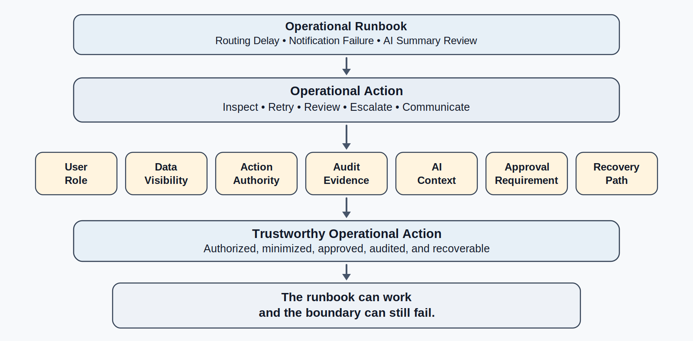
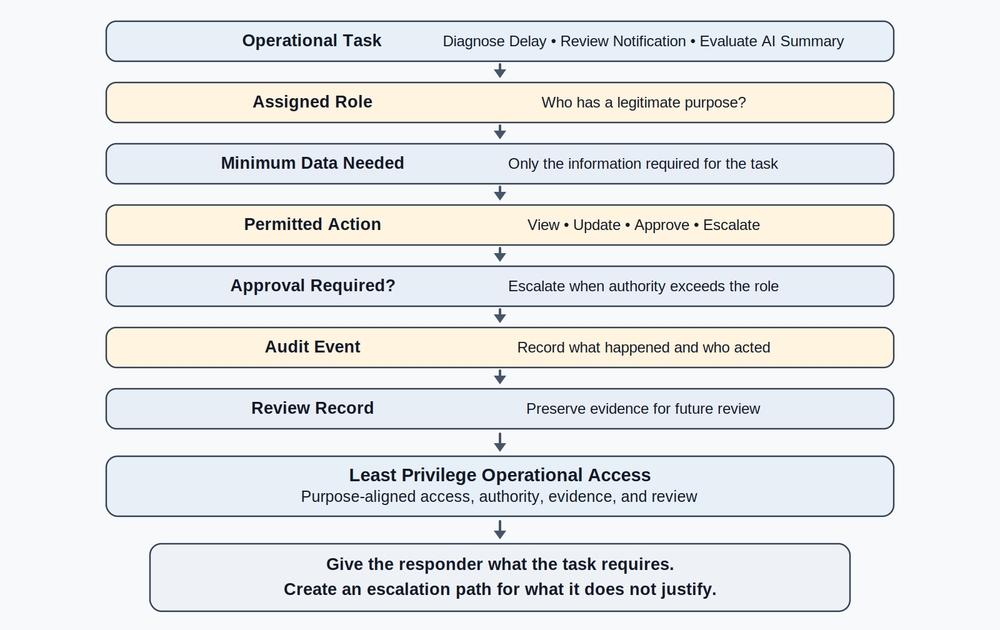
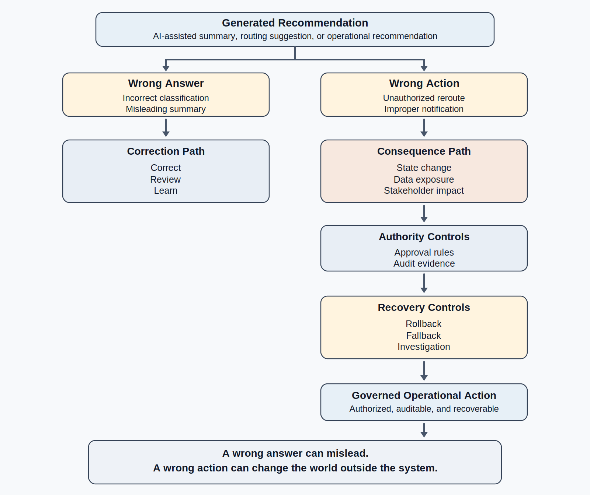
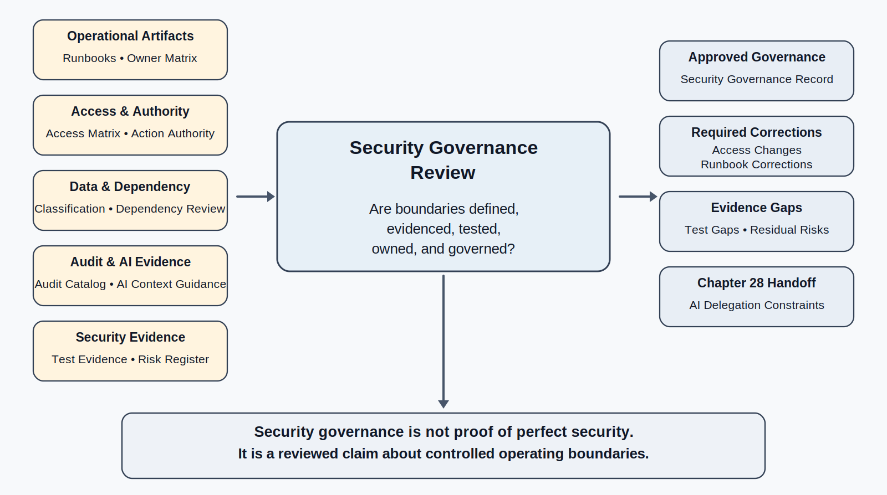

# Chapter 27<br><span class="chapter-title-main">Security Engineering and Governance
---

### Chapter Governing Line

> Security is not a late checklist. It is operational governance: the disciplined control of data, identity, authority, dependencies, evidence, and trust while the system is being used.

---

## Opening Scenario: The Runbook Worked. The Boundary Did Not.

The Chapter 26 runbook walkthrough seemed useful at first.

LMU had moved COICP into a more mature operating posture. The team had postmortem records from Chapter 23, stabilization evidence from Chapter 24, runtime evidence from Chapter 25, and operational readiness artifacts from Chapter 26. The repository now contained runbooks, an operational owner matrix, escalation paths, fallback procedures, rollback notes, readiness walkthrough records, and links back to runtime evidence. The system was no longer a defended release waiting to meet reality. It was an early-production system learning how to operate.

That was progress.

Then the routing-delay runbook exposed a new problem.

The runbook directed a support responder to inspect a delayed outreach request. The steps were clear. Locate the request ID. Check the intake timestamp. Review the routing decision. Verify the departmental queue transition. Confirm whether the notification was sent. Check whether the AI-assisted summary was held for human approval. Capture the outcome in the operational readiness record.

The process worked.

But during the walkthrough, someone noticed that the responder could see more student-related information than the runbook required. The responder did not need the full free-text intake note to determine whether routing was delayed. The responder did not need several historical contact fields to verify queue assignment. The responder did not need to see an entire AI-assisted summary draft to determine whether the summary was pending review. The system made the operational task possible, but it gave the responder more visibility than the task justified.

A second issue appeared a few minutes later. The notification-failure runbook included a retry step. That made sense operationally; if a notification failed, someone might need to resend it. But the runbook did not specify who had authority to trigger a resend, what message content could be reused, whether stakeholder-facing communication needed review, or whether a retry could create confusion if the original message had actually been delivered late.

Then the AI summary review runbook exposed the third issue. The team wanted responders to compare an AI-assisted summary with source request information. That also made sense. But the runbook did not say which source fields could be included in AI context, which fields should be masked, whether policy-sensitive information could be used, or how the team would prove that the AI-assisted workflow had not exposed unnecessary information.

No breach occurred. No villain appeared. No dramatic attack happened.

That is why the scenario matters.

Most security problems in enterprise systems do not begin with cinematic intrusion. They often begin with convenience access, unclear authority, broad default permissions, unexamined data exposure, dependency assumptions, missing audit evidence, and operational shortcuts that feel helpful at the time. A team tries to make support easier. A runbook gives responders a little more visibility. A dashboard exposes a little more information. A service account receives a little more permission. An AI workflow receives a little more context. A retry button saves a few minutes. Each decision may feel local and reasonable. Together, they create security and governance risk.

Chapter 26 taught that observability must become operational action. Chapter 27 teaches that operational action must remain secure, authorized, privacy-aware, auditable, and governed.

A system can be observable and still unsafe. A system can have runbooks and still overexpose data. A system can support recovery and still allow the wrong person to take the wrong action. A system can use AI responsibly in design and testing but still leak sensitive operational context after release. A system can appear helpful while weakening trust.

Security engineering is the discipline that prevents operational readiness from becoming unmanaged authority.

The repository already contains the evidence that creates this chapter's starting point:

```text
/docs/operations/runbooks/coicp_routing_delay_runbook.md
/docs/operations/runbooks/coicp_notification_failure_runbook.md
/docs/operations/runbooks/coicp_ai_summary_review_runbook.md
/docs/operations/ownership/operational_owner_matrix.md
/docs/operations/escalation/escalation_path_register.md
/docs/operations/readiness/runbook_walkthrough_record.md
/docs/observability/runtime_evidence_index.md
```

Those artifacts are useful. They are also incomplete until they are tested against security and governance boundaries.


*Figure 27.1 — Security and Governance Boundary Map*

The first lesson of this chapter is blunt: the runbook can work and the boundary can still fail.

---

## 27.1 Security Engineering Is Operational Governance

Security is often taught as a list of technical controls: authentication, authorization, encryption, input validation, logging, patching, dependency scanning, secrets management, and incident response. Those controls matter. This chapter does not dismiss them.

But trustworthy engineering requires a broader professional lens.

Security engineering is operational governance. Many important security lessons emerge from near misses rather than confirmed incidents. Weak authority boundaries, excessive access, unnecessary data exposure, and unclear approval paths often reveal themselves before visible harm occurs. It is the discipline of controlling who can see, who can act, what data is exposed, what dependencies are trusted, what AI context may be used, what actions require approval, what evidence is preserved, and how the organization detects and corrects misuse or failure.

That framing matters because COICP is not only code. It is a sociotechnical system involving students, community partners, support staff, departments, policies, workflows, operational evidence, AI-assisted summaries, review boards, and repository records. Security cannot be bolted onto that system after the fact. It must be part of how the system assigns authority, preserves accountability, and supports trust.

A narrow security view asks, "Did we add access control?"

A trustworthy engineering view asks better questions:

- Who needs access to this data to perform a legitimate task?
- What is the smallest access that still supports the work?
- What action can this role take?
- What action requires approval?
- What evidence proves the action was authorized?
- What sensitive data should not appear in logs, dashboards, exports, AI prompts, or notifications?
- What dependency can affect confidentiality, integrity, availability, or authority?
- How will the organization know if a control failed?
- Who owns remediation when a security or privacy weakness is found?

Those are engineering questions because their answers shape architecture, workflows, repositories, runbooks, tests, reviews, and operational response.

Security also changes the emotional posture of the chapter. Chapter 26 gave readers a practical feeling: we can prepare procedures. Chapter 27 should make them professionally cautious: every procedure grants or assumes some form of authority. A runbook tells someone what to inspect, what to change, what to retry, what to communicate, and when to escalate. Each of those verbs has a security dimension.

Inspecting may expose data. Changing may alter system state. Retrying may send a message. Communicating may disclose information. Escalating may grant wider visibility. Automating may delegate authority. AI assistance may move sensitive context into a new processing path.

This is why governance is architecture. Authority cannot be left as an informal social agreement. If authority is real, it must be designed into roles, permissions, workflows, approval gates, audit trails, repository evidence, and review mechanisms.

A useful repository artifact at this point is not a generic security checklist. It is a concise security governance overview that connects controls to the operating system:

```text
/docs/security/security_governance_overview.md
```

That document should not become a compliance binder. It should explain how COICP controls access, data exposure, action authority, audit evidence, dependency risk, AI context, and review responsibilities. It should link to the artifacts that make those controls real.

Security engineering therefore has a practical definition:

Security engineering is the design, verification, and governance of the boundaries that protect trustworthy operation.

Those boundaries include technical mechanisms, but they are not limited to technical mechanisms. They include human responsibility, review, documentation, evidence, and judgment.

Security fails when boundaries become unclear. Security succeeds when authority, access, data exposure, and responsibility remain understandable, reviewable, and controlled.

---

## 27.2 Least Privilege and Role-Based Operational Access

Least privilege is engineering humility made concrete. 

It assumes that future mistakes, misunderstandings, misconfigurations, and workflow changes are inevitable. The goal is not to predict every failure but to limit the consequences when failure occurs.

It says that a person, service, system, or AI-assisted workflow should have only the access needed to perform a legitimate purpose, for the necessary time, with appropriate auditability and review. That principle sounds simple. In real systems, it is difficult because convenience pushes in the opposite direction.

Convenience says: give the responder everything so they do not get blocked.

Least privilege says: give the responder what the task requires, and create an escalation path for what the task does not justify.

Convenience says: use one broad support role.

Least privilege says: separate first response, technical operation, workflow approval, data stewardship, and governance review when the risks differ.

Convenience says: let the tool access all fields so future use cases are easier.

Least privilege says: access granted for future speculation becomes present risk.

For COICP, role-based operational access might distinguish several responsibilities:

| Role | Legitimate operational need | Access boundary |
|---|---|---|
| First responder | Identify whether a request is delayed, stuck, or misrouted | Request ID, status, queue, timestamps, non-sensitive routing metadata |
| Workflow owner | Determine whether a handoff or queue rule failed | Routing decision evidence, queue history, limited request context |
| Student Services reviewer | Evaluate student-related impact and next steps | Student-service fields relevant to the assigned case |
| Notification approver | Approve or correct stakeholder-facing communication | Notification draft, delivery state, approved message templates |
| AI governance reviewer | Review AI-assisted summary behavior and context use | AI-use evidence, prompt/context metadata, review status, bounded sample data |
| Data steward | Evaluate privacy, retention, and data exposure concerns | Data classification, access logs, policy mapping |
| Technical operator | Diagnose service behavior and system health | Logs, metrics, traces, configuration state, deployment evidence |

The important point is not the exact roles. The point is that operational access should be aligned to purpose.

A runbook should not silently expand access. If the routing-delay runbook only requires queue state and timestamps, the first responder should not automatically see full intake narratives. If the notification runbook requires delivery status, it should not expose unrelated student details. If the AI summary runbook requires comparison with source content, the team must define which fields are appropriate for that comparison and which fields should be masked, summarized, or withheld.

The repository should preserve access decisions in a way that future teams can inspect. Useful artifacts may include:

```text
/docs/security/access_control_matrix.md
/docs/security/data_classification.md
/docs/security/access_review_record.md
/docs/operations/ownership/operational_owner_matrix.md
```

These files should be concise, current, and linked to operational reality. An access control matrix that is not connected to runbooks, roles, workflows, and review records becomes documentation theater.


*Figure 27.2 — Least Privilege Workflow*

Least privilege also applies to services and automation. A background job that updates notification status should not have permission to alter routing rules. A dashboard should not display sensitive fields just because the database query can retrieve them. A service account used for metrics should not have write access. An AI-assisted summarization component should not receive fields that are irrelevant to summary quality or inappropriate for the model context.

This is where AI-era engineering raises the stakes. AI systems often improve when given more context. Security engineering asks whether that context is justified, controlled, logged, and safe. More context is not automatically better engineering. Context is control, and uncontrolled context is uncontrolled risk.

Least privilege is not mistrust of people. It is respect for systems. It protects users, responders, engineers, and the institution by reducing the damage that mistakes, misunderstandings, defects, misconfigurations, or misuse can create.

---

## 27.3 Data Minimization, Privacy, and Operational Need

Security and privacy are related, but they are not identical.

Security asks whether data and authority are protected against unauthorized access, misuse, alteration, disclosure, or disruption. Privacy asks whether the organization is collecting, using, exposing, retaining, and sharing personal or sensitive information appropriately. A system can be technically secured and still expose more information than the operational task justifies. That is not trustworthy engineering.

COICP handles requests that may involve students, departments, community partners, support needs, event logistics, outreach history, notes, and stakeholder communications. Not every field has the same sensitivity. Not every role needs the same view. Not every workflow requires the same data. Not every log should preserve the same detail. Not every AI-assisted process should receive the same context.

Data minimization is the principle that the system should collect, display, transmit, log, retain, and expose only what is needed for a legitimate purpose.

The question is not how much data the system possesses. The question is how much data a specific task legitimately requires.

In Chapter 27, data minimization should become operational. It is not enough to say that COICP respects privacy. The system must show where privacy is protected in workflows, runbooks, logging, dashboards, notification templates, AI context, exports, and review records.

Consider the routing-delay runbook. A responder needs to know whether a request moved from intake to the correct queue. That may require request ID, intake time, category, routing decision, queue assignment, and notification state. It may not require full narrative text, student background information, prior interaction history, or internal notes unrelated to routing. If the responder later needs more context, that should be an escalation path, not the default view.

Consider the AI-assisted summary review runbook. A reviewer may need source text to evaluate whether the summary omitted urgency or distorted meaning. But the system should still ask what source text is appropriate, whether sensitive fields can be masked, whether the AI tool stores context, whether prompts are logged, and whether review samples can be preserved without exposing unnecessary data.

Useful repository artifacts include:

```text
/docs/security/data_classification.md
/docs/security/data_minimization_guidance.md
/docs/security/privacy_review_record.md
/docs/governance/ai_governance/ai_context_use_guidelines.md
```

Those files should not make the chapter a legal policy chapter. They serve the engineering lesson: privacy must be designed into operational behavior.

A practical data classification for COICP might use simple categories:

| Data type | Example | Operational handling |
|---|---|---|
| Public or low sensitivity | General outreach category | May appear in routine dashboards if useful |
| Internal operational | Queue state, assignment timestamp | Visible to operational responders with need |
| Sensitive student-related | Student support context | Limited to authorized role and purpose |
| Governance-sensitive | Approval notes, escalation rationale | Visible to reviewers and owners with audit trail |
| AI-context-sensitive | Prompt content, source text, model output | Logged and reviewed under AI governance rules |

This table is not a compliance framework. It is a thinking framework. Students should learn that data sensitivity is not abstract. It changes what screens show, what logs contain, what runbooks instruct, what AI receives, what notifications disclose, and what review boards inspect.

Privacy also affects operational evidence. Chapter 25 taught that evidence matters. Chapter 27 adds that evidence must be safe. Logs should help diagnose without becoming a second source of sensitive exposure. Metrics should reveal system behavior without exposing personal content. Traces should show workflow movement without leaking unnecessary fields. Dashboards should support decisions without creating broad visibility. AI-use logs should preserve accountability without reproducing sensitive prompts in places where they do not belong.

This is another example of mature engineering tradeoff. Too little evidence prevents diagnosis. Too much uncontrolled evidence creates privacy risk. The trustworthy engineer designs the evidence surface deliberately.

---

## 27.4 Authority, Approval, and Auditability

Access controls who can see. Authority controls who can act.

Those are different problems.

A responder may be allowed to view a delayed request without being allowed to reroute it. A workflow owner may be allowed to correct a queue assignment without being allowed to resend stakeholder communication. A notification approver may be allowed to approve a corrected message without being allowed to alter AI summary policy. A technical operator may be allowed to restart a service without being allowed to change data retention rules. A governance reviewer may be allowed to inspect evidence without being allowed to execute operational actions.

Trustworthy systems separate visibility from action.

Many governance failures occur not because the wrong person saw information, but because the wrong person was allowed to change something important.

Visibility creates risk.

Authority creates consequences.

Trustworthy systems must govern both.

COICP's operational runbooks make this separation urgent. The notification-failure runbook may include a retry step. That retry changes the world outside the system: someone receives a message. The routing-delay runbook may include manual reassignment. That changes responsibility across departments. The AI summary runbook may include approval or rejection of a generated draft. That affects what humans use to make decisions. These are not passive observations. They are authority-bearing actions.

Authority-bearing actions require approval rules and audit evidence.

Approval does not always mean a committee. It may mean the right role must confirm the action. It may mean two-person review for high-impact changes. It may mean pre-approved action under a defined threshold. It may mean automatic blocking when required evidence is missing. It may mean escalation to a governance owner when privacy or policy boundaries are involved.

Auditability means the organization can later reconstruct who acted, what was changed, why the action was allowed, what evidence supported it, and what happened afterward.

Useful repository artifacts include:

```text
/docs/security/action_authority_matrix.md
/docs/security/audit_event_catalog.md
/docs/governance/approval_paths.md
/docs/governance/reviews/security_governance_review_record.md
```

The action authority matrix should connect operational actions to roles and approvals. For example:

| Operational action | Who may perform it | Approval needed | Audit evidence |
|---|---|---|---|
| View routing status | First responder | No additional approval | Request ID lookup event |
| View sensitive student context | Student Services reviewer | Role-based authorization | Access event with purpose |
| Manually reroute request | Workflow owner | Required if cross-department | Reroute event and rationale |
| Retry stakeholder notification | Notification approver | Required above routine threshold | Message retry event and approved template |
| Approve AI-assisted summary | Authorized human reviewer | Required by AI governance policy | Approval event and source linkage |
| Change routing rule | Technical owner | Review and PR process | Issue, PR, test, deployment evidence |

The table should not be used as decoration. It should shape the system design, the runbooks, the tests, and the review questions.

This distinction between a wrong answer and a wrong action becomes increasingly important as systems become more capable. A wrong answer can mislead. A wrong action can change state, expose data, notify users, approve a workflow, escalate a case, or alter institutional behavior. AI-era systems make this distinction even more important because generated recommendations may be close enough to sound plausible while still encouraging the wrong operational action.


*Figure 27.3 — Wrong Answer vs Wrong Action*

A secure system does not merely ask whether users are authenticated. It asks what authenticated users are allowed to do, under which conditions, with whose approval, and with what evidence.

If access cannot be explained, it cannot be responsibly governed. If action cannot be audited, it cannot be responsibly trusted.

---

## 27.5 Dependency, Configuration, and Supply-Chain Risk

Security governance is not limited to users and roles. Systems depend on libraries, services, integrations, configuration, deployment environments, secrets, APIs, data stores, logging systems, AI services, and operational tooling. Each dependency can become part of the trust boundary.

In early student projects, dependencies often feel invisible. A package is installed. A service is configured. An API key is added. A logging library is imported. A dashboard tool is connected. An AI service is called. If the system works, the dependency is treated as solved.

That is not mature engineering.

COICP depends on components that affect security and governance. A notification service may handle stakeholder contact information. A database may store request fields with different sensitivity. A logging system may capture operational evidence. A metrics system may aggregate workflow timing. An AI summarization service may process request text. A CI/CD pipeline may deploy changes. A dependency scanner may identify vulnerable packages. A secrets store may protect credentials. An authentication provider may control identity and role membership.

These are not background details. They are part of the security architecture.

A dependency can create risk in several ways:

- It may expose data.
- It may fail and disrupt availability.
- It may process information under different retention or logging rules.
- It may receive broader permissions than needed.
- It may introduce a vulnerability.
- It may change behavior after an update.
- It may become a hidden system of record.
- It may create a recovery dependency during an incident.

The repository should preserve dependency and configuration evidence without becoming a tool manual. Useful artifacts may include:

```text
/docs/security/dependency_review_record.md
/docs/security/secrets_handling_guidance.md
/docs/security/configuration_baseline.md
/docs/architecture/dependency_register.md
/docs/operations/recovery/dependency_recovery_notes.md
```

These artifacts connect Part II architecture discipline to Part III operations. Chapter 13 taught that architecture is responsibility structure. Chapter 15 taught that consequential decisions need durable records. Chapter 17 taught that PR and CI evidence matter. Chapter 21 taught release readiness. Chapter 27 now shows that dependencies remain part of operational trust after release.

Configuration deserves special attention. Many serious failures do not require bad code. A misconfigured permission, logging setting, environment variable, API scope, data retention rule, or AI context option can weaken security while leaving core application logic unchanged.

Students should learn that configuration is engineering material. It should be reviewed, versioned where appropriate, protected, tested, and connected to operational evidence. A configuration baseline is not bureaucracy when it helps the team answer: what was supposed to be true, what changed, who approved it, and what evidence shows the system remained safe?

Secrets handling is similarly ordinary but consequential. Credentials, API keys, tokens, database passwords, and service keys should not appear in logs, screenshots, prompts, issue comments, or documentation examples. AI-assisted development raises this risk because developers may paste context into tools without recognizing that secrets or sensitive configuration are included. Chapter 27 should repeat the anti-hype stance: AI can assist security review, but AI does not remove professional responsibility for what context humans expose.

Dependency and configuration security prepare Chapter 28. Controlled AI delegation will require tool permissions, service boundaries, context sources, action scopes, and revocation paths. If those dependencies and configurations are already poorly governed, AI delegation will amplify the weakness.

---

## 27.6 AI Context Exposure and Security Governance

AI is not the center of Chapter 27, but AI changes the security problem.

The chapter should avoid becoming the full AI governance chapter. Chapter 28 owns controlled delegation. But Chapter 27 must establish a security foundation for AI-assisted operational work because COICP already uses AI-assisted summaries, draft notifications, classification support, or review aids. Those uses create context, data, audit, and authority questions.

The key issue is context exposure.

AI-assisted systems often need context to be useful. A summary tool may need request text. A routing suggestion may need category, urgency, department, and historical examples. A notification draft may need stakeholder type and message intent. An incident summarization assistant may need logs and timeline events. An operational support assistant may need runbook steps, request IDs, and known limitations.

Context improves usefulness, but context also creates risk.

The trustworthy engineer asks:

- What context is necessary for this AI-assisted task?
- Which fields are prohibited?
- Which fields must be masked or summarized before use?
- Is the context source authoritative?
- Is the context current?
- Is the AI output allowed to influence action?
- Is human approval required?
- Is the prompt or context logged?
- Does logging preserve accountability without reproducing sensitive data unnecessarily?
- Can the AI-assisted action be reversed or corrected?

This is where two core principles intersect: context is control, and everything important leaves evidence.

Context is control because AI behavior depends heavily on what the system provides. Everything important leaves evidence because the team must be able to reconstruct what context was used, what output was proposed, what humans accepted or rejected, and what action followed.

But evidence must not become exposure. This is the Chapter 27 nuance. The team must preserve enough AI-use evidence to support review, without creating a new repository of sensitive prompts, raw intake notes, or student-related information where it does not belong.

Useful repository artifacts include:

```text
/docs/governance/ai_governance/ai_context_use_guidelines.md
/docs/governance/ai_governance/ai_use_log.md
/docs/security/ai_context_exposure_review.md
/docs/security/data_minimization_guidance.md
```

Those artifacts should explain the boundaries of AI context, not celebrate AI capability. The question is not, "How powerful can the AI be?" The question is, "What context, authority, and evidence can be responsibly governed?"

This chapter should also distinguish AI assistance from AI action. A generated summary that waits for human review is different from an automated reroute. A notification draft is different from a sent notification. A suggested escalation is different from an executed escalation. A risk classification is different from an approved risk disposition. Chapter 27 prepares the reader to make those distinctions before Chapter 28 introduces controlled delegation more explicitly.

AI proposes; engineers verify. In Chapter 27, that phrase means engineers verify not only the content of AI output, but also the security and governance conditions under which the AI received context and influenced work.

---

## 27.7 Security Evidence in the Repository

Security work that lives only in conversation is not engineering evidence.

A team can discuss access boundaries, approve a temporary exception, review a dependency, update a runbook, change a logging policy, or constrain AI context. If those decisions are not preserved, future responders cannot reconstruct why the system behaves as it does. Security then becomes tribal knowledge, and tribal knowledge decays.

Repository-centered engineering applies to security the same way it applies to requirements, architecture, implementation, testing, release, postmortems, stabilization, observability, and runbooks. Important security decisions must leave evidence.

The repository should not become a dumping ground. The goal is not to create a forest of unused files. The goal is to preserve the evidence needed for review, operation, audit, recovery, and learning.

For COICP, a practical security evidence structure might include:

```text
/docs/security/security_governance_overview.md
/docs/security/access_control_matrix.md
/docs/security/action_authority_matrix.md
/docs/security/data_classification.md
/docs/security/data_minimization_guidance.md
/docs/security/dependency_review_record.md
/docs/security/secrets_handling_guidance.md
/docs/security/configuration_baseline.md
/docs/security/audit_event_catalog.md
/docs/security/security_risk_register.md
/docs/security/security_test_evidence.md
/docs/governance/reviews/security_governance_review_record.md
```

This list should not be thrown into the manuscript as a requirement for every small project. It should be introduced as an example of how security evidence can be organized when the system has operational, privacy, AI, and governance implications.

Each artifact has a role:

| Artifact | Purpose |
|---|---|
| Security governance overview | Explains the security model in operational terms |
| Access control matrix | Maps roles to data visibility and system access |
| Action authority matrix | Maps roles to permitted actions, approvals, and audit evidence |
| Data classification | Defines sensitivity categories and handling expectations |
| Data minimization guidance | Limits unnecessary exposure in screens, logs, AI context, and dashboards |
| Dependency review record | Preserves risk review of packages, services, integrations, and AI providers |
| Secrets handling guidance | Prevents credentials from leaking into code, logs, issues, prompts, or docs |
| Configuration baseline | Captures expected security-relevant configuration |
| Audit event catalog | Defines actions that must leave reconstructable evidence |
| Security risk register | Preserves residual security/privacy risk and ownership |
| Security test evidence | Shows controls were tested, not merely claimed |
| Security governance review record | Preserves review-board challenge and decisions |

Security evidence should connect to other parts of the repository. Access decisions connect to runbooks. Data classification connects to logging. AI context guidance connects to AI-use logs. Dependency review connects to architecture and CI/CD. Audit events connect to observability. Security tests connect to release evidence. Security risks connect to governance review.

This is what prevents checklist theater. The artifacts are not independent checkboxes. They are a connected evidence system.

Security review also benefits from issue/branch/PR discipline. A change that alters access, data handling, logging, AI context, secrets management, dependency scope, or authority-bearing action should not be hidden in an unrelated pull request. It should be visible, reviewable, testable, and linked to the appropriate security evidence.

The principle remains: everything important leaves evidence.

---

## 27.8 Testing Security Controls Without Theater

Security claims require evidence.

It is not enough to say that access control exists, sensitive fields are protected, secrets are not exposed, AI context is bounded, or audit events are preserved. The team must test the controls that matter.

Security testing in this chapter should remain appropriate to the book's audience. This is not a penetration-testing manual. It is not a vulnerability exploitation chapter. It is not a cybersecurity certification survey. The goal is to teach software engineers that security controls are engineering claims that require verification.

COICP security tests might ask:

- Can a first responder view only the fields needed for routing delay diagnosis?
- Can a first responder access sensitive student context without escalation?
- Does a notification retry require the correct approval?
- Is a manual reroute recorded with actor, reason, request ID, and timestamp?
- Are secrets absent from logs, issue comments, documentation examples, and AI prompts?
- Does the AI summary workflow mask or exclude prohibited fields?
- Are audit events produced for authority-bearing actions?
- Does a dependency review exist for services that handle sensitive data?
- Are security-sensitive configuration changes reviewed?
- Can reviewers reconstruct why a role has a given permission?

These tests can be manual, automated, review-based, or evidence-based depending on the control. The important point is that the team should test the behavior that supports trust, not merely assert that a control exists.

Useful repository artifacts include:

```text
/docs/security/security_test_plan.md
/docs/security/security_test_evidence.md
/docs/testing_and_quality/regression/security_regression_tests.md
/docs/governance/reviews/security_governance_review_record.md
```

Security regression matters because security can decay. A new dashboard may expose a sensitive field. A new runbook may recommend a manual action without approval. A new AI workflow may include context that prior guidance prohibited. A dependency update may change default logging behavior. A role change may broaden access. A configuration update may weaken auditability.

Security is not a one-time gate. It is a continuing engineering concern.

This is another place where AI can be useful but not authoritative. AI may help generate test ideas, summarize risk, inspect configuration patterns, or compare access matrices. But AI-generated security analysis is proposed material. Engineers must verify it, especially because fluent security language can create dangerous confidence. A plausible security checklist is not security evidence.

Security testing should also avoid false maturity. A team can run a scanner and still miss authority risk. It can check dependencies and still overexpose student data. It can encrypt storage and still log sensitive prompts. It can require authentication and still give every authenticated support user too much access. Tool output is evidence, but it is limited evidence.

The mature question is not, "Did the security tool pass?" The mature question is, "What security claim are we making, what evidence supports it, what remains uncertain, who owns the risk, and what operational behavior could violate it?"

---

## 27.9 Security Governance Review

Chapter 27's review-board mechanism is the Security Governance Review.

The purpose of this review is not to certify that COICP is perfectly secure. Perfect security is not an honest engineering claim. The purpose is to challenge whether security-sensitive operating boundaries are defined, evidenced, tested, owned, and connected to governance.

The review should occur after the team has connected runbooks, access controls, authority actions, data minimization, AI context, dependency review, audit events, and security tests into a coherent operating model.

Inputs to the review include:

```text
/docs/operations/runbooks/
/docs/operations/ownership/operational_owner_matrix.md
/docs/security/access_control_matrix.md
/docs/security/action_authority_matrix.md
/docs/security/data_classification.md
/docs/security/data_minimization_guidance.md
/docs/security/dependency_review_record.md
/docs/security/audit_event_catalog.md
/docs/security/security_test_evidence.md
/docs/security/security_risk_register.md
/docs/governance/ai_governance/ai_context_use_guidelines.md
```

The review asks questions such as:

- Do operational runbooks expose only the data needed for legitimate tasks?
- Are role permissions aligned with operational responsibility?
- Are authority-bearing actions separated from passive visibility?
- Which actions require approval, and is that approval evidenced?
- Are audit events sufficient to reconstruct important actions?
- Are sensitive fields protected in logs, dashboards, exports, notifications, and AI context?
- Are secrets protected from code, documentation, logs, tickets, and prompts?
- Have dependency and configuration risks been reviewed?
- Are security controls tested rather than merely described?
- Are residual security and privacy risks owned?
- Are AI-assisted workflows bounded by context, approval, and audit rules?
- What must be fixed before COICP expands operational scope?


*Figure 27.4 — Security Governance Review Gate*

The review should produce concrete outputs:

```text
/docs/governance/reviews/security_governance_review_record.md
/docs/security/security_risk_register.md
/docs/security/access_review_record.md
/docs/operations/runbooks/runbook_security_update_log.md
```

The review strengthens engineering judgment because it forces the team to connect security claims to operational evidence. It also prepares Chapter 28. Controlled AI delegation depends on knowing which actions exist, which roles may perform them, what data is involved, what audit evidence exists, what approvals are required, and what recovery paths are available.

Chapter 28 should inherit the Security Governance Review record as a constraint. It should not begin by asking whether COICP has authority boundaries. Chapter 27 must answer that question well enough for Chapter 28 to ask whether any AI-assisted or agentic behavior may operate within those boundaries.

---

## 27.10 Anti-Patterns: Security Afterthought and Authority Fog

The primary anti-pattern of this chapter is security afterthought.

Security afterthought occurs when teams design features, workflows, runbooks, dashboards, AI assistance, and operational procedures first, then ask security questions at the end. By then, the system may already assume broad access, weak auditability, vague authority, risky data exposure, and dependencies that are hard to replace. Security becomes a late objection rather than an engineering design condition.

Security afterthought is dangerous because it creates false choices. Teams begin to believe they must choose between shipping and security, operating and governing, helping users and protecting data, AI usefulness and privacy, speed and accountability. Mature engineering rejects that framing. Security is not the enemy of operation. Security is what makes operation responsibly sustainable.

Secondary anti-patterns include authority fog, overbroad permissions, checklist theater, security by tool output, context leakage, secret leakage, audit illusion, dependency invisibility, and wrong-action blindness.

Authority fog appears when no one can explain who may perform an operational action. In COICP, that might mean uncertainty over who may manually reroute a request, retry a stakeholder notification, approve an AI-assisted summary, view sensitive student context, update a routing rule, or accept residual privacy risk.

Overbroad permissions appear when roles receive more access than their purpose requires because fine-grained access feels inconvenient. The result is silent risk.

Checklist theater appears when a team completes a security checklist without connecting controls to actual workflows, data, roles, AI context, audit events, tests, and review decisions.

Security by tool output appears when scanner results, dependency reports, or green CI checks are treated as proof of security. Tools can find some problems. They cannot replace engineering judgment.

Context leakage appears when sensitive data enters prompts, logs, dashboards, exports, tickets, screenshots, or documentation examples without a legitimate need.

Secret leakage appears when credentials or tokens appear in source code, local notes, issue comments, build logs, AI prompts, or training examples.

Audit illusion appears when systems log that something happened but not enough to reconstruct who acted, why the action was allowed, what evidence supported it, or what changed afterward.

Dependency invisibility appears when services, packages, APIs, or configuration settings become part of the security boundary without review.

Wrong-action blindness appears when teams focus on whether AI or software generated the right answer but ignore whether the system can take the wrong action.

In modern intelligent systems, the ability to act is often more consequential than the ability to answer.

Trustworthy engineering counters these anti-patterns by making security part of architecture, operation, repository evidence, review, testing, AI governance, and operational readiness.

The chapter should not leave the reader afraid of security. It should leave the reader unwilling to accept shallow security.

---

## 27.11 Security as Part of Operational Trust

Security strengthens operational trust when it is integrated with the rest of the lifecycle.

Part II built the evidence chain: requirements, architecture, ADRs, implementation, PRs, reviews, tests, intelligent-system evaluation, release readiness, and release defense. Part III has now moved through postmortems, stabilization, observability, runbooks, and security governance. Security is not a new concern that appears from nowhere. It is the continuation of earlier trustworthiness work.

Requirements should have identified privacy and authority constraints. Architecture should have assigned boundaries and systems of record. ADRs should have recorded consequential choices. PRs should have made security-relevant changes reviewable. Tests should have verified behavior. Release readiness should have disclosed limitations. Postmortems should have preserved operational learning. Stabilization should have reduced recurring defects. Observability should have produced runtime evidence. Runbooks should have prepared response. Security governance now asks whether all of that operates within protected boundaries.

This chapter's primary trustworthiness pillars are security/privacy, governability, accountability, and human oversight. Secondary pillars include traceability, reviewability, recoverability, correctness, and operational visibility.

Security/privacy appears because the chapter directly controls data, access, secrets, dependencies, AI context, and exposure.

Governability appears because authority-bearing action must be controlled through roles, approval paths, audit events, and review.

Accountability appears because security decisions need owners, not vague institutional confidence.

Human oversight appears because AI-assisted workflows, operational actions, and exception handling require meaningful human control.

Traceability appears through repository records that connect security claims to evidence.

Reviewability appears through the Security Governance Review.

Recoverability appears because secure operation includes rollback, fallback, revocation, and correction.

Correctness appears because security controls are system behavior that must work as intended.

Operational visibility appears because audit events and runtime evidence must support diagnosis without becoming uncontrolled exposure.

This mapping should not become checklist theater. The chapter should repeatedly show that trustworthiness pillars interact. For example, audit logs improve accountability and visibility, but if they expose sensitive fields, they weaken security/privacy. AI context can improve correctness of summaries, but if context is excessive, it weakens governability and privacy. Broad access can improve response speed, but it weakens least privilege. Strong controls can protect data, but if they block legitimate response without escalation paths, they can weaken recoverability.

Mature security engineering is therefore tradeoff-aware. It is not control for control's sake. It is disciplined protection of operational trust.

---

## 27.12 Operational Takeaways

Security is not a late checklist. It is operational governance.

Least privilege is engineering humility made concrete.

A runbook is not secure unless its actions, data access, approvals, and audit evidence are governed.

Visibility and authority are different. Seeing a condition is not the same as being allowed to change it.

Data minimization applies to screens, logs, dashboards, exports, prompts, notifications, and review records.

Wrong answers are defects. Wrong actions are governance failures.

AI cannot safely act inside authority boundaries that humans have not defined.

Security evidence belongs in the repository, but the repository must not become a dumping ground or a new exposure surface.

Security controls must be tested as engineering claims.

A trustworthy system protects users, responders, engineers, and the institution by making authority visible, limited, reviewable, and recoverable.

---

## 27.13 Exercises

### Exercise 1: Access Control Matrix

Create a COICP access-control matrix for the following roles:

- First responder
- Workflow owner
- Student Services reviewer
- Notification approver
- Technical operator
- AI governance reviewer
- Data steward

Identify the minimum data each role requires to perform assigned responsibilities.

For each role, identify at least one access request that should require escalation, approval, or governance review.

---

### Exercise 2: Action Authority Matrix

Select five operational actions from the Chapter 26 runbooks.

For each action, identify:

- Authorized role
- Whether approval is required
- Required audit event
- Recovery or correction path if the action is performed incorrectly

Explain why authority-bearing actions require both accountability and recoverability.

---

### Exercise 3: Data Minimization Review

Review a sample routing-delay runbook.

Identify:

- Which data elements are necessary for diagnosis and response
- Which fields are excessive
- Which fields should be masked
- Which fields should never appear in logs, dashboards, reports, or AI context

Explain how data minimization supports operational trust while preserving useful engineering evidence.

---

### Exercise 4: AI Context Exposure Review

Analyze an AI-assisted summary workflow.

Define:

- Which context fields may be provided to the AI system
- Which fields must be excluded
- What level of human approval is required before use
- What AI-use evidence should be preserved for future review

Justify each decision using the security-governance principles established in Chapter 27.

---

### Exercise 5: Dependency Risk Analysis

Identify three COICP dependencies that could affect security, privacy, or operational trust.

For each dependency, describe:

- The associated risk
- Evidence that should be preserved
- Required monitoring or review activity
- The owner responsible for governance oversight

Explain how dependency failure could affect system trustworthiness even when COICP itself is functioning correctly.

---

### Exercise 6: Security Test Plan

Develop a concise security test plan that includes:

- One role-based access-control test
- One authority-bearing action test
- One audit-event verification test
- One data-minimization test
- One AI context-boundary test

For each test, identify:

- Objective
- Expected result
- Evidence that should be preserved

Explain how the resulting evidence would support a future Security Governance Review.

---

### Exercise 7: Security Governance Review

Conduct a Security Governance Review using the Chapter 27 review questions.

Produce a short review record that includes:

- Approved controls
- Unresolved risks
- Owner assignments
- Required corrective actions
- Residual risks
- Any constraints that Chapter 28 must inherit before controlled AI delegation can be considered

Identify which findings should be treated as governance obligations rather than optional recommendations.
   
---

## 27.14 Closing Transition: From Security Governance to Controlled Delegation

Chapter 27 began with a runbook that worked operationally but exposed weak boundaries. That is the right discomfort. Operational readiness is not enough if the organization cannot control who sees, who acts, what data is exposed, what AI receives, what dependencies are trusted, what approvals are required, and what evidence proves responsible behavior.

LMU now has a stronger security governance posture for COICP. It has a way to reason about least privilege, data minimization, authority-bearing actions, auditability, dependency risk, secrets handling, AI context exposure, security test evidence, and review-board challenge. It has begun to connect operational runbooks to protected operational authority.

That prepares the next question.

If humans and systems now have clearer boundaries, can any AI-assisted workflow be allowed to operate inside those boundaries? Can AI recommend an escalation? Can it draft a stakeholder update? Can it call a tool? Can it change state? Can it be trusted to act without approval? When must a human remain in the loop? When must the system block action? How can delegation be revoked? What evidence proves that delegated behavior remained controlled?

Those are not generic AI questions.

They are governance questions built on the security foundation of this chapter.

Without defined authority boundaries, controlled delegation is impossible. Delegation requires something meaningful to delegate and something meaningful to constrain.

That is the inheritance Chapter 28 receives.

Chapter 27 established who may see, who may act, what data may be used, what approvals are required, what evidence must be preserved, and how authority is reviewed. Those boundaries are no longer assumptions. They are governance conditions.

Chapter 28, *AI Governance and Controlled Delegation*, inherits those conditions and asks a harder question:

When, if ever, may intelligent systems operate inside authority boundaries without transferring authority itself?

The answer will not be hype.

It will be engineering.
