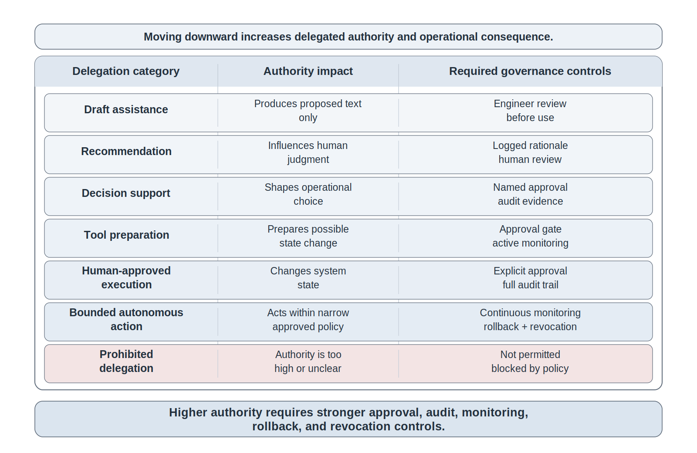
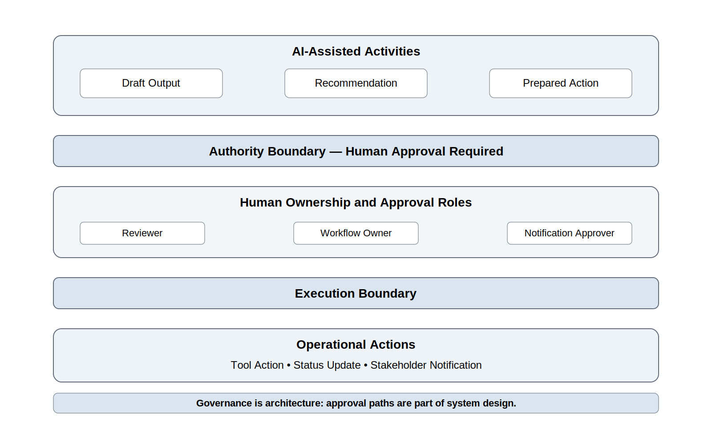
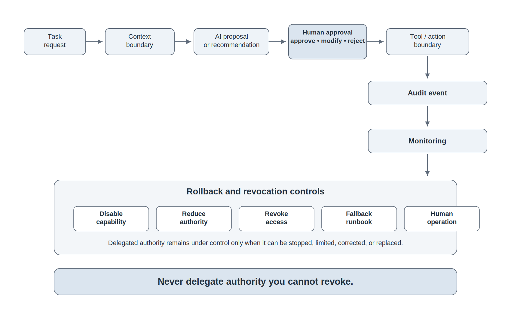
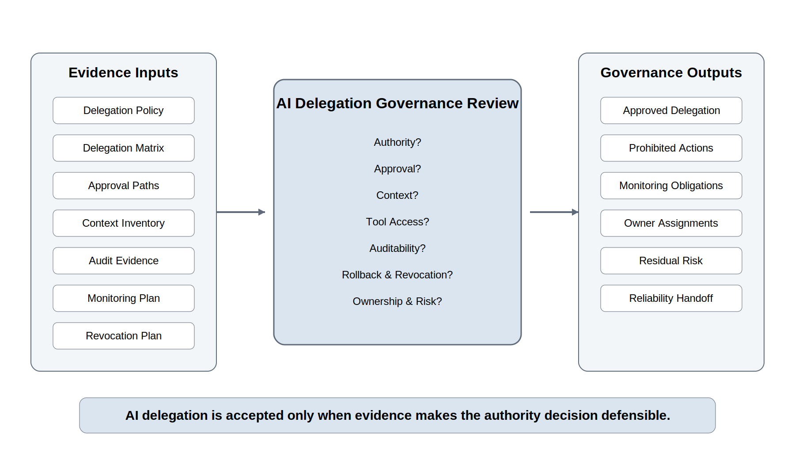

# Chapter 28<br><span class="chapter-title-main">AI Governance and Controlled Delegation
---

### Chapter Governing Line

> AI is not responsibly delegated because it is capable. It is responsibly delegated only when its authority is bounded, observable, reversible, auditable, revocable, and owned by accountable humans.

---

## Opening Scenario: The Boundary Was Secure. The Delegation Was Still Unclear.

The Chapter 27 Security Governance Review did not stop COICP. It made COICP safer. LMU had corrected overbroad access, clarified which support roles could see which fields, tightened notification retry authority, added audit expectations, and documented AI context boundaries for summary review. The system was no longer merely operationally ready. It was becoming security-governed operation.

That progress created the next question.

During a follow-up operational planning session, the COICP team considered whether AI assistance could reduce review delay during busy intake periods. The proposal sounded reasonable. AI was already helping draft summaries. Runtime evidence from Chapter 25 showed where requests slowed down. Chapter 26 runbooks described routing-delay response. Chapter 27 security work had defined role permissions and data-minimization rules. The team now asked whether AI could do more than draft. Could it recommend escalation? Could it prepare a notification? Could it suggest rerouting? Could it open a follow-up task? Could it call an internal tool to update request status when a human approved the recommendation?

The room became quiet because the question was no longer about AI output quality. It was about authority.

A wrong summary can be corrected before it reaches a stakeholder. A wrong recommendation can mislead a reviewer. A wrong tool call can change operational state. A wrong escalation can burden a department. A wrong notification can confuse a student, partner, or staff member. A wrong status update can make later diagnosis harder. Each step increases the verification burden because the AI is moving closer to operational action.

Capability and authority are not the same thing. The ability to perform a task does not automatically justify permission to perform it.

LMU could not answer the delegation question with a slogan. 'Keep a human in the loop' was not enough. Which human? At what point? With what evidence? Under what time pressure? Before or after the tool call? With what rollback path? With what audit event? With what revocation mechanism if behavior drifts? With what monitoring? With what owner?

Chapter 28 exists because AI governance becomes real when an organization decides what authority AI may receive. Security boundaries protect data and access. Controlled delegation protects action, authority, operational consequence, and institutional trust.

The repository already contains the inherited evidence that makes this chapter possible:

```text
/docs/security/security_governance_overview.md
/docs/security/access_control/role_permission_matrix.md
/docs/security/data_handling/data_minimization_rules.md
/docs/security/audit/audit_event_catalog.md
/docs/governance/ai_governance/ai_context_boundary_record.md
/docs/operations/runbooks/coicp_routing_delay_runbook.md
/docs/observability/runtime_evidence_index.md
```

Those artifacts do not answer the delegation question by themselves. They define the control surface that Chapter 28 must use.


*Figure 28.1 — Risk-Based AI Delegation Matrix*

The first lesson is blunt: AI delegation is not a productivity setting. It is an authority decision.

---

## 28.1 Controlled Delegation Means Authority With Boundaries

Delegation is the transfer of some work, judgment, or action from one actor to another. In ordinary organizations, delegation is everywhere. A manager delegates review to a team lead. A team lead delegates a task to an engineer. An operator follows a runbook that delegates authority to retry a failed notification under defined conditions. Delegation is not inherently reckless. Unbounded delegation is reckless.

AI changes delegation because the delegated actor may be probabilistic, context-dependent, tool-connected, difficult to inspect internally, and able to produce fluent explanations that exceed its actual understanding. That does not make delegation impossible. It makes delegation an engineering problem.

Controlled delegation means AI assistance operates inside explicit authority boundaries. Those boundaries define what the system may read, what it may infer, what it may propose, what it may prepare, what it may execute, what requires approval, what must be logged, what can be rolled back, what can be revoked, and who owns the outcome.

This chapter uses controlled delegation rather than autonomy as its central language. Autonomy is often too vague. It invites hype. It suggests a sliding scale of independence without forcing the hard questions. Controlled delegation is more precise. It asks what authority is being delegated, under which constraints, with what evidence, and with what accountability.

For COICP, AI may assist in several distinct ways. It may summarize intake text. It may classify a request category. It may recommend urgency. It may draft a notification. It may suggest which runbook applies. It may prepare a status update for human approval. It may call a tool to create a follow-up task. It may update routing state. These are not equivalent acts. Treating them as one generic AI feature would be bad engineering.

The engineering challenge is not determining whether AI is useful. The challenge is determining how much authority a useful capability should receive.

Capability answers what AI can do.

Governance answers what AI should be allowed to do.

A useful repository artifact for this distinction is:

```text
/docs/governance/ai_governance/ai_delegation_policy.md
```

That document should not be a broad ethics statement. It should classify AI-enabled actions by authority level, approval requirement, evidence requirement, monitoring expectation, and revocation path. A second artifact should make the classification operational:

```text
/docs/governance/ai_governance/ai_delegation_matrix.md
```

The matrix should answer a practical question: for each AI-assisted capability, what is the maximum authority allowed, what approval is required, what evidence must be preserved, and what fallback exists?

The doctrine from earlier chapters still governs this one: AI proposes; engineers verify. But Chapter 28 adds sharper language: the more an AI-enabled workflow can affect system state, stakeholder communication, operational priority, security exposure, or institutional commitment, the stronger the control requirements must be.

## 28.2 The Delegation Ladder: From Drafting to Authority-Bearing Action

Not every AI use requires the same level of governance. A grammar suggestion in internal notes is not the same as an automated escalation. A summary draft is not the same as changing request status. A recommendation is not the same as executing a tool call. The chapter therefore needs a delegation ladder.

At the lowest level, AI drafts material that humans review before use. The AI has no operational authority. It produces proposed text, candidate classifications, or candidate explanations. The control requirement is review, disclosure where appropriate, and evidence that the output was treated as proposed material.

At the next level, AI recommends. It suggests urgency, category, routing, escalation, or runbook selection. Recommendation introduces influence. Even if a human still decides, the recommendation can steer attention, frame risk, or create automation bias. The control requirement is stronger: the system must show the evidence behind the recommendation, preserve the recommendation and human decision, and make disagreement or override possible.

At the next level, AI prepares action. It drafts a notification, prepares a routing change, creates a proposed task, or stages a tool call. This level is more serious because the action is almost executable. The control requirement includes explicit human approval, preview, audit, and prevention of accidental execution.

At a still higher level, AI triggers a human-approved tool call. The tool call changes something after approval: a task is opened, a status is updated, a notification is sent, or a routing queue is changed. The control requirement includes role-based approval, audit event, rollback or correction procedure, and clear ownership.

Bounded autonomous action is narrower and should be rare in COICP at this maturity stage. It may be acceptable only for low-risk, reversible, well-observed, policy-bounded actions such as tagging a request as needing review or creating a non-stakeholder-facing draft record. Even then, monitoring, rate limits, revocation, and error handling must exist.

Some actions should remain prohibited. AI should not independently close a request, send sensitive stakeholder communication, override human escalation, expose additional student-related information, change security permissions, or accept residual risk. Prohibited does not mean impossible forever. It means not delegated under the current evidence, controls, maturity, and risk posture.

The delegation ladder should be preserved in the repository so that later reviews can inspect whether practice matches policy:

```text
/docs/governance/ai_governance/ai_delegation_matrix.md
/docs/governance/ai_governance/prohibited_ai_actions.md
/docs/governance/ai_governance/ai_approval_paths.md
```

These files are not bureaucratic extras. They prevent the team from smuggling authority into a workflow under the harmless label of assistance.

## 28.3 Authority, Approval, and Human Ownership

Human oversight is often weakened by vague language. Teams say a human is in the loop, but the loop is undefined. A person clicks approve without enough context. A reviewer receives too many low-value approvals and begins rubber-stamping. A manager is accountable for a system they cannot inspect. A support operator is asked to own an AI-assisted action without authority to correct it.

Chapter 28 must be more exact. Human ownership is not the same as human presence. Human ownership means an accountable person or role has enough context, authority, time, and evidence to approve, reject, modify, reverse, or escalate the AI-assisted action. Ownership without authority is governance theater. Authority without ownership is unmanaged risk.

For COICP, approval paths should be risk-based. A summary draft for internal triage may be approved by a first responder. An escalation recommendation affecting Student Services may require a workflow owner. A stakeholder-facing notification may require a notification approver. A data-sensitive AI context change may require a data steward or AI governance reviewer. A change to tool permissions may require security governance review.

A useful repository artifact is:

```text
/docs/governance/ai_governance/ai_approval_paths.md
```

This file should connect delegated actions to approval roles, required evidence, escalation conditions, and time constraints. It should not merely say human approval required. It should specify who approves what and what they must be able to see before approval.

Approval must also be observable. The system should preserve the AI recommendation, the evidence shown to the reviewer, the human decision, modifications made, the final action, and the outcome. Without that chain, the organization cannot learn whether humans are meaningfully overseeing AI or merely lending legitimacy to automation.

A corresponding evidence record belongs in:

```text
/docs/governance/ai_governance/ai_approval_evidence_record.md
```

That record can link to operational logs, request IDs, audit events, and review-board decisions. The point is not to create paperwork for every click. The point is to preserve evidence when AI participates in authority-sensitive workflows.


*Figure 28.2 — AI Authority Boundary Diagram*

The governing phrase should recur here: governance is architecture. Approval paths are not policy decoration. They are part of the system design.

---

## 28.4 Context Is Control, and Context Can Become Delegated Power

Earlier chapters established that context is control. Chapter 28 makes that principle operational. The context given to an AI-assisted workflow shapes what the AI can infer, recommend, prepare, or act upon. In a delegated workflow, context is not just input. It becomes part of delegated power.

If an AI assistant can see full intake narratives, student-related details, prior contact history, departmental notes, urgency rules, routing history, and stakeholder communication templates, it has a much richer basis for recommendations. It also has a larger risk surface. More context can improve output. It can also increase privacy risk, leakage risk, bias risk, overreach, and misplaced confidence.

Controlled delegation therefore requires context minimization. The AI should receive only the information required for the authorized task. A routing recommendation may need category, timestamp, queue state, and limited operational metadata. It may not need the full free-text note. A notification draft may need approved message templates and delivery state. It may not need unrelated historical fields. A runbook-selection assistant may need symptoms and signal references. It may not need policy-sensitive personal information.

Chapter 27 already established data minimization and AI context boundaries. Chapter 28 inherits those boundaries and uses them to govern delegation. Relevant repository records include:

```text
/docs/governance/ai_governance/ai_context_boundary_record.md
/docs/security/data_handling/data_minimization_rules.md
/docs/security/access_control/role_permission_matrix.md
```

Chapter 28 should add a delegation-specific context artifact:

```text
/docs/governance/ai_governance/delegated_context_inventory.md
```

This inventory should define approved context sources, excluded fields, masking rules, retention expectations, logging expectations, and source-of-truth references for each delegated AI capability.

The chapter must avoid prompt-engineering drift. The teaching point is not how to write a clever prompt. The teaching point is how to engineer context boundaries so AI-enabled recommendations and actions remain governable, auditable, privacy-aware, and accountable.

Context is especially dangerous when it is silently expanded. A team may add more fields to improve AI performance without reopening governance review. Performance improvements achieved through uncontrolled context expansion are often governance regressions disguised as optimization. That is architectural drift. The chapter should make this explicit: any change in AI-visible context is a governance-relevant design change when the AI participates in operational delegation.

---

## 28.5 Auditability, Observability, and the Delegation Evidence Chain

An AI-assisted action that cannot be reconstructed cannot be responsibly governed. Chapter 25 established runtime evidence. Chapter 27 established auditability as a security-governance requirement. Chapter 28 combines both into a delegation evidence chain.

The delegation evidence chain should allow LMU to answer practical questions after the fact. What did the AI receive? What did it propose? What evidence did it cite or rely on? What role reviewed it? What did the human approve, reject, or modify? What action occurred? What tool was called? What state changed? What stakeholder communication was sent? What outcome followed? What correction or rollback was available?

Those questions are not theoretical. They determine whether LMU can investigate an incorrect escalation, a confusing notification, a misrouted request, a delayed review, or a suspected context exposure. They also determine whether the review board can distinguish model error, context error, workflow design error, approval weakness, tool permission weakness, and operational pressure.

The repository should preserve delegation evidence expectations in a durable location:

```text
/docs/governance/ai_governance/ai_delegation_evidence_chain.md
/docs/governance/ai_governance/ai_use_log.md
/docs/security/audit/audit_event_catalog.md
/docs/observability/runtime_evidence_index.md
```

The AI-use log should mature in this chapter. Earlier AI-use logs could record assisted drafting, coding, test generation, and review support. Chapter 28 requires operational AI-use evidence. It must distinguish proposal, recommendation, prepared action, approved tool call, and bounded autonomous action. It should link AI activity to request IDs, approval records, audit events, runbook steps, and operational outcomes.

This is where repository-centered engineering becomes operationally serious. The repository is not storing AI paperwork. It is preserving the evidence required for learning, review, governance, rollback, and accountability. Without that evidence, controlled delegation becomes trust by assertion.

The anti-pattern to challenge here is invisible delegation. A team may believe humans remain responsible, but if AI influence is not logged, the organization cannot see how much of the operational decision path was shaped by AI. Invisible influence is still influence.

---

## 28.6 Rollback, Revocation, and Kill-Switch Thinking

Controlled delegation is incomplete without reversal. A delegated capability that cannot be stopped, limited, corrected, or rolled back is not under control. This is true even when the capability is useful.

Rollback means the organization can correct or reverse an operational effect. If AI prepares and a human approves a status update, the system needs a correction path if the update was wrong. If AI helps route a request, the system needs a reroute path. If AI drafts a notification, the system needs a correction or clarification path. If AI opens a follow-up task, the system needs a closure or reassignment path.

Revocation means the organization can remove or reduce delegated authority. If an AI-assisted workflow begins to show drift, excessive override rates, confusing recommendations, unexpected context use, or stakeholder harm, LMU must be able to disable the capability, narrow its context, reduce its authority level, or require stronger approval.

Kill-switch language can be useful, but it should not become theater. A kill switch is not a button drawn on a slide. It is an engineered control: who can invoke it, what it disables, how quickly it takes effect, what evidence it preserves, what fallback procedure replaces it, and how restoration is approved.

Repository artifacts should make reversal concrete:

```text
/docs/governance/ai_governance/ai_revocation_plan.md
/docs/operations/recovery/ai_delegation_rollback_plan.md
/docs/operations/runbooks/coicp_ai_delegation_fallback_runbook.md
/docs/governance/ai_governance/ai_capability_disable_record.md
```

Chapter 26 runbooks matter here. If an AI-assisted capability is disabled, people still need a way to operate COICP. Controlled delegation must never become dependency without fallback. The organization should know how to continue routing, reviewing, notifying, and escalating when the AI-assisted path is unavailable or prohibited.


*Figure 28.3 — Delegation Control Flow*

The governing phrase is simple: never delegate authority you cannot revoke.

Delegation should always be easier to reduce than to expand. Expanding authority is a governance decision. Reducing authority should be a routine safety mechanism.

Authority that cannot be withdrawn is no longer fully governed.

---

## 28.7 Monitoring Delegated AI Behavior After Approval

Approval is not the end of governance. It is the beginning of monitored operation. A delegated AI capability can behave acceptably during review and still drift during use. Context may change. Workload may change. Stakeholders may use the system differently. Policies may change. Model behavior may vary. Human reviewers may develop automation bias. Tool permissions may be expanded. Edge cases may accumulate.

Chapter 28 therefore requires monitoring. Monitoring delegated AI behavior does not mean watching a model leaderboard. It means tracking whether the capability continues to operate inside its approved authority boundaries and whether human oversight remains meaningful.

For COICP, useful signals might include recommendation acceptance rate, override rate, correction rate, escalation reversal rate, notification correction rate, tool-call failure rate, human-review latency, AI-context boundary violations, unauthorized action attempts blocked by policy, stakeholder complaint patterns, and incidents involving AI-assisted recommendations.

These signals should connect back to the observability and governance records:

```text
/docs/observability/metrics/ai_delegation_metrics_catalog.md
/docs/governance/ai_governance/ai_delegation_monitoring_plan.md
/docs/governance/ai_governance/ai_override_and_exception_log.md
/docs/operations/incidents/ai_related_incident_record.md
```

The monitoring plan should identify owners. It should specify review frequency, thresholds for escalation, conditions for revocation, and links to runbooks. If override rates rise, the team should ask whether the recommendation logic is weak, the context is stale, the approval workflow is confusing, or the delegated authority is too broad. If human approvals become nearly automatic, the team should ask whether oversight has become theater.

Monitoring also prepares Chapter 29. Reliability engineering and failure analysis will need evidence about how delegated AI capabilities fail, degrade, drift, or create operational pressure. Chapter 28 should not fully teach reliability. It should export monitored delegation evidence so Chapter 29 can reason about failure modes.

The chapter should preserve anti-hype discipline: monitoring is not proof that AI is intelligent. It is evidence that a delegated capability remains bounded, useful, reviewable, and safe enough under current conditions.

---

## 28.8 The AI Delegation Governance Review

Controlled delegation requires a formal challenge mechanism. Chapter 28 introduces the AI Delegation Governance Review. The review is not a vendor approval, ethics ceremony, or executive enthusiasm checkpoint. It is an engineering challenge of authority, evidence, risk, oversight, reversibility, and ownership.

The review board should ask direct questions. What capability is being delegated? What authority level is requested? What data and context are visible to the AI? What tool access exists? What human approval is required? What evidence will be logged? What can be rolled back? How can the capability be revoked? What monitoring exists? What failure modes are plausible? Who owns the outcome? What actions remain prohibited?

The review should inspect evidence from prior chapters: security boundaries from Chapter 27, runbooks from Chapter 26, runtime evidence from Chapter 25, stabilization patterns from Chapter 24, postmortem lessons from Chapter 23, and release-defense limitations from Chapter 22. Chapter 28 does not stand alone. It consumes the operational trust architecture built before it.

Expected review inputs include:

```text
/docs/governance/ai_governance/ai_delegation_policy.md
/docs/governance/ai_governance/ai_delegation_matrix.md
/docs/governance/ai_governance/ai_approval_paths.md
/docs/governance/ai_governance/delegated_context_inventory.md
/docs/governance/ai_governance/ai_delegation_evidence_chain.md
/docs/governance/ai_governance/ai_delegation_monitoring_plan.md
/docs/governance/ai_governance/ai_revocation_plan.md
/docs/security/access_control/role_permission_matrix.md
/docs/security/audit/audit_event_catalog.md
/docs/operations/recovery/ai_delegation_rollback_plan.md
```

The review output should be a durable record:

```text
/docs/governance/reviews/ai_delegation_governance_review_record.md
```

That record should state approved delegation level, prohibited actions, required approvals, monitoring obligations, open risks, owner assignments, conditions for revocation, and follow-up work. It should also identify what evidence Chapter 29 reliability analysis must inherit.


*Figure 28.4 — AI Delegation Governance Review Gate*

The review-board lesson is the professional center of the chapter: AI delegation is accepted only when evidence makes the authority decision defensible.

---

## 28.9 Failure Patterns in AI Delegation

The primary anti-pattern of Chapter 28 is silent authority. Silent authority appears when AI influence or action grows without explicit review, approval, audit, or ownership. The system may still claim that humans are responsible, but the operational path has quietly shifted authority toward the AI-enabled workflow.

Silent authority can begin innocently. An AI draft becomes the default. A recommendation is almost always accepted. A prepared action is approved without inspection. A tool call is treated as routine. A context expansion is made for convenience. A low-risk automation is reused in a higher-risk workflow. Nobody announces that authority changed. But the system has changed.

Several secondary anti-patterns support silent authority. Hidden tool access occurs when AI can call or prepare calls to systems that reviewers do not understand. Approval theater occurs when human approval exists but lacks context, time, or real ability to change the outcome. Context creep occurs when more data becomes AI-visible without governance review. Irreversible convenience occurs when automation produces effects faster than people can correct them. Delegation laundering occurs when teams describe an authority-bearing workflow as mere assistance to avoid governance scrutiny.

For COICP, these patterns could appear as automatic urgency recommendations that reviewers rarely challenge, AI-prepared notifications that are approved without reading, routing suggestions that become default actions, or tool permissions that allow state changes beyond the original design. None of these require malicious intent. They require only pressure, convenience, and weak evidence.

Trustworthy engineering counters these patterns with named authority levels, approval paths, context boundaries, audit events, monitoring, rollback, revocation, and review-board challenge. The solution is not to ban AI assistance. The solution is to prevent AI assistance from becoming unmanaged authority.

The failure-pattern section should be serious but not alarmist. The chapter should avoid treating AI as villain or miracle. It should show that unmanaged delegation is a normal engineering risk that disciplined teams can identify, bound, and govern.

This section also prepares Chapter 29. Once delegation is controlled, the next question becomes how delegated AI behavior fails, degrades, or interacts with system reliability.

---

## 28.10 Operational Takeaways

AI delegation is an authority decision, not a productivity setting.

Controlled delegation defines what AI may read, infer, propose, prepare, execute, log, and affect.

The more an AI-enabled workflow can change operational state, communicate externally, expose data, or influence priority, the stronger the required governance.

Human oversight must include context, authority, time, evidence, and the power to reject, modify, reverse, or escalate.

Context is control. Delegated AI should receive only the context required for the authorized task.

Auditability is not optional when AI participates in operational decisions or actions.

Never delegate authority you cannot revoke.

**Monitoring is part of governance. Approval without monitoring is temporary confidence.**

AI proposes; engineers verify. In delegated workflows, engineers must also bound, approve, audit, monitor, revoke, and own.

Trustworthy AI delegation is evidence-backed, reviewable, reversible where possible, and accountable to humans.

---

## 28.11 Exercises

### Exercise 1: Build a delegation ladder for COICP. 

Classify five AI-assisted capabilities as draft-only, recommendation, prepared action, human-approved tool execution, bounded autonomous action, or prohibited. For each, identify authority level, approval requirement, required evidence, rollback option, and owner. Repository artifact: ```/docs/governance/ai_governance/ai_delegation_matrix.md```.

### Exercise 2: Draft an AI approval path. 

Choose one COICP workflow, such as routing-delay escalation or notification retry. Define who approves the AI-assisted action, what evidence the approver sees, what can be modified, what is logged, and when escalation is required. Repository artifact: ```/docs/governance/ai_governance/ai_approval_paths.md```.

### Exercise 3: Create a delegated context inventory. 

Identify the minimum context needed for an AI-assisted routing recommendation. Mark excluded fields, masked fields, source-of-truth references, retention rules, and audit expectations. Repository artifact: ```/docs/governance/ai_governance/delegated_context_inventory.md```.

### Exercise 4: Design a delegation evidence chain. 

For an AI-prepared status update, map the request ID, AI input, AI proposal, human approval, final action, audit event, outcome, and possible correction path. Repository artifact: ```/docs/governance/ai_governance/ai_delegation_evidence_chain.md```.

### Exercise 5: Write a revocation and rollback plan. 

Define how LMU would disable AI-assisted escalation recommendations if monitoring shows high override rates or stakeholder confusion. Include owner, trigger, fallback runbook, evidence preserved, and restoration condition. Repository artifacts: ```/docs/governance/ai_governance/ai_revocation_plan.md``` and ```/docs/operations/recovery/ai_delegation_rollback_plan.md```.

### Exercise 6: Conduct an AI Delegation Governance Review. 

Use the review questions from this chapter to decide whether an AI-assisted notification workflow should be approved, approved with constraints, deferred, or prohibited. Repository artifact: ```/docs/governance/reviews/ai_delegation_governance_review_record.md.```

These exercises should not reward broad AI enthusiasm. They should reward precise authority classification, evidence design, control thinking, and honest risk ownership.

---

## 28.12 Trustworthiness Mapping

Chapter 28 primarily strengthens governability, human oversight, security/privacy, recoverability, accountability, and observability. It secondarily strengthens traceability, reviewability, correctness, and operational visibility.

Governability appears because delegated AI behavior must be controlled through policy, architecture, approval paths, context boundaries, audit events, monitoring, revocation, and review-board decisions. The evidence appears in delegation matrices, approval-path records, review records, and prohibited-action lists.

Human oversight appears because humans remain accountable for authority-bearing action. But the chapter refuses vague oversight. Meaningful oversight requires role clarity, evidence, decision rights, ability to reject or modify, and ownership of outcomes.

Security/privacy appears because delegation depends on what context AI can access and what actions it can take. Context minimization, role permissions, data-handling rules, and audit catalogs prevent AI assistance from becoming an uncontrolled exposure path.

Recoverability appears because rollback, fallback, and revocation are required for delegated authority. If an AI-assisted capability cannot be stopped or corrected, it cannot be responsibly delegated.

Accountability appears because every delegated workflow must name owners for approval, monitoring, exception handling, revocation, and outcome review.

Observability appears because delegated behavior must be reconstructable. Logs, audit events, AI-use records, request IDs, approval records, and monitoring metrics make operational AI influence visible.

Traceability and reviewability appear because delegation decisions must link back to requirements, security constraints, runbooks, observability evidence, and review-board records. Correctness appears because outputs still need evaluation and verification, but Chapter 28 insists that correctness alone is insufficient when AI influences action.

The chapter prevents checklist theater by refusing to treat AI governance as a policy document alone. Each governance claim must connect to repository evidence, runtime signals, approval paths, audit events, rollback procedures, and accountable review.

---

## 28.13 Closing Transition: From Controlled Delegation to Reliability and Failure Analysis

By the end of Chapter 28, LMU has not made AI autonomous. It has made AI delegation explicit. COICP now has a vocabulary for delegation levels, authority boundaries, approval paths, context limits, audit evidence, monitoring, rollback, revocation, and prohibited actions. That is a major maturity step.

It is not the end of operational trust.

Once a capability is delegated under control, the next engineering question is how it fails. Does the recommendation degrade under unusual request patterns? Does context drift reduce quality? Do humans override the AI more often during high-volume periods? Does a tool call fail halfway through? Does monitoring detect the problem early enough? Does fallback preserve service? Does AI variability create reliability risk even inside approved boundaries?

Those are Chapter 29 questions.

Reliability Engineering and Failure Analysis inherits the controlled delegation model from Chapter 28 and asks how COICP behaves under degradation, dependency failure, AI variability, monitoring gaps, recovery assumptions, and operational stress.

Chapter 29 should not reteach AI governance, approval paths, or delegation matrices. It should use them as inherited constraints.

Chapter 28 answered a governance question:

What authority may be delegated?

Chapter 29 answers an operational question:

What happens when delegated systems, dependencies, workflows, approvals, monitoring assumptions, or AI-assisted capabilities fail?

Governed authority is necessary for trust.

Reliability determines whether that trust survives contact with failure.
