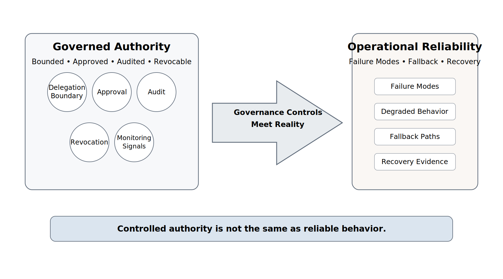
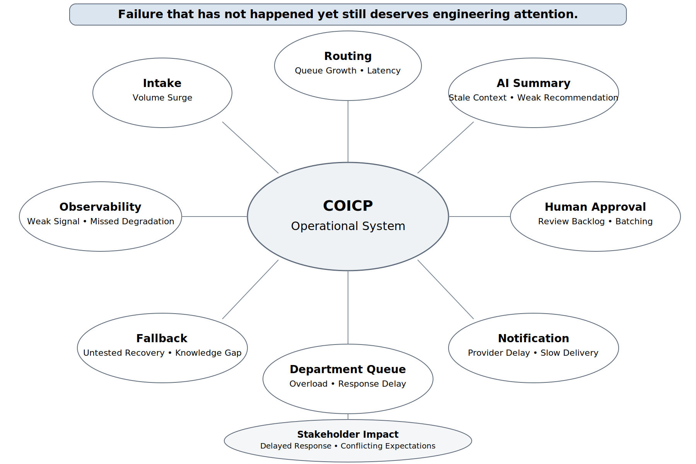
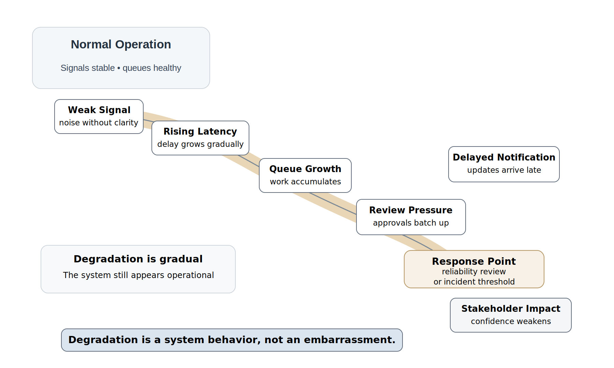
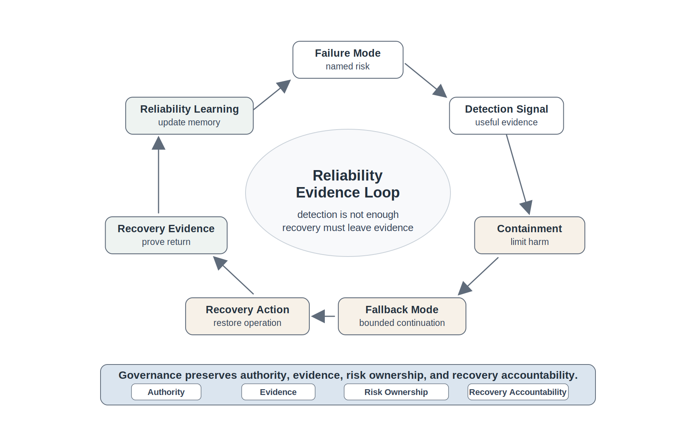
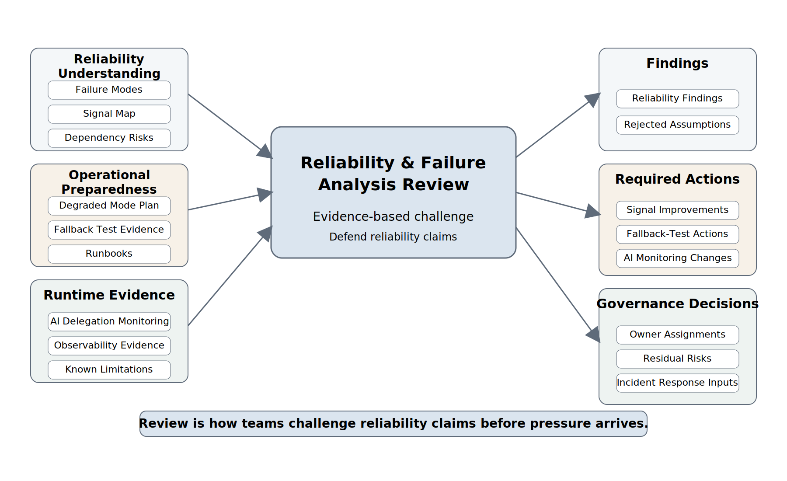

# Chapter 29 Reliability Engineering and Failure Analysis
---

### Chapter Governing Line

> Reliability is not an uptime slogan. It is failure reasoning made operational: the discipline of making degradation visible, bounded, recoverable, and learnable before operational pressure turns weakness into incident.

---

## Opening Scenario: The Delegation Was Controlled. The System Still Degraded.

LMU had not rushed into AI delegation.

That mattered. After Chapter 28, the COICP team had done what immature teams often skip. It had not given an AI assistant open authority to route requests, change workflow state, resend notifications, or escalate cases on its own. The team had identified assistance zones, recommendation zones, approval-required zones, and prohibited zones. It had defined which actions required human approval, which outputs were only advisory, which tool calls were not allowed, which records had to be logged, and how delegated capabilities could be revoked. The governance record did not merely say that AI was being used responsibly. It explained the boundaries.

That was progress.

It was not reliability.

Controls define acceptable behavior. Reliability tests whether acceptable behavior survives pressure.

During a heavy intake period late in the pilot, COICP began to degrade in a way that did not look like a dramatic outage. The system accepted requests. The dashboards stayed mostly green. The AI-assisted priority summary remained inside its approved delegation boundary; it could suggest urgency language, but it could not reroute or escalate without a human reviewer. Security controls held. Role permissions were not violated. Audit records were still being written.

Yet the operation was weakening.

Routing latency climbed gradually over two hours. The notification service slowed just enough that several departments saw updates later than expected. Queue depth increased but did not cross the threshold that would trigger the existing runbook. The AI-assisted summary component used a policy context source that was technically available but stale for several requests because a policy update had not propagated. Human reviewers, trying to keep up, began batching approvals instead of reviewing each request as soon as it appeared. No one did anything reckless. No single component was clearly broken. No security boundary failed. No AI tool exceeded its authority.

Still, stakeholders felt the degradation. Community Outreach heard from a partner who expected a faster confirmation. Student Services saw a set of requests arrive in a burst instead of a steady flow. IT operations saw noisy but inconclusive signals. The product owner could not honestly say whether this was ordinary pilot friction, emerging instability, dependency degradation, insufficient staffing, AI-context drift, or the early shape of an incident.

That is the reliability problem.

Chapter 28 established who or what may act. Chapter 29 asks what happens when the system acts within those boundaries but still behaves poorly under pressure. A system can be governed and unreliable. It can be secure and fragile. It can be observable and still hard to interpret if the team has not named its failure modes. It can have runbooks and still lack tested fallback. It can have AI controls and still suffer from context staleness, variable output quality, dependency delay, or review workload pressure.

Reliability engineering begins before the incident. It asks the uncomfortable questions while there is still time to do something useful with the answers.

What can fail? How would we know? How slowly could failure develop before anyone notices? What would users experience first? Which dependencies matter most? Which fallback has actually been tested? What evidence proves recovery? What AI-assisted behavior becomes unreliable under stale context, workload pressure, or degraded signals? Who owns the remaining risk?

Those are not pessimistic questions. They are engineering questions.

The repository already contains the evidence that makes this chapter possible:

`/docs/governance/ai_governance/ai_delegation_matrix.md`  
`/docs/governance/ai_governance/ai_oversight_record.md`  
`/docs/governance/ai_governance/ai_revocation_plan.md`  
`/docs/security/security_governance_review_record.md`  
`/docs/operations/runbooks/coicp_routing_delay_runbook.md`  
`/docs/observability/runtime_evidence_index.md`  
`/docs/operations/readiness/operational_readiness_review_record.md`

Those artifacts show that LMU has built controls. Chapter 29 asks whether those controls can survive degradation, dependency weakness, load variation, human review pressure, and AI variability.

*Figure 29.1 — From Controlled Delegation to Reliability Pressure*

The first lesson is blunt: controlled authority is not the same as reliable behavior.

---

## 29.1 Reliability Is Failure Reasoning Made Operational

Reliability is often flattened into uptime.

That is understandable. Uptime is easy to talk about. Dashboards can show availability percentages. Service reports can count outages. Leaders can ask whether the system was up. Engineers can point to monitoring panels that are mostly green. The language feels precise.

But trustworthy engineering needs a deeper definition.

Reliability is not merely whether a system is running. Reliability is the disciplined ability to anticipate, detect, contain, recover from, and learn from failure and degradation in the conditions where the system actually operates. It is not optimism. It is not a metric by itself. It is not the absence of incidents. It is not the belief that good teams avoid failure. Reliable systems fail better because engineers have named the ways they can fail and have designed evidence, boundaries, fallbacks, owners, and learning paths around those possibilities.

A system can be available and still unreliable from the user's perspective. COICP may accept a request while routing it too late to be useful. It may keep the web interface online while notification delays create stakeholder confusion. It may show that the AI assistant remained inside its delegation boundary while stale context caused reviewers to receive weaker recommendations. It may preserve logs while no one has defined which signal proves that degradation is significant.

Reliability therefore begins with failure reasoning.

The goal is not to predict every failure. The goal is to make important failures understandable enough that preparation, detection, containment, and recovery become possible.

Failure reasoning asks what behavior matters, what can weaken that behavior, how weakness would appear, how quickly it would affect people, what evidence would reveal it, what response is allowed, and how recovery would be proven. That reasoning belongs in engineering work, not only in operations meetings after something goes wrong.

For COICP, reliability does not mean that every request is routed instantly. It means that LMU understands expected routing behavior, acceptable delay, known degradation patterns, fallback options, stakeholder impact, AI-assistance limitations, escalation thresholds, and recovery evidence. A reliable COICP can still have delays. What makes it reliable is that delay is bounded, visible, owned, recoverable, and reviewable.

This distinction matters in the AI era. AI-assisted behavior can appear useful during demonstrations and normal cases while becoming unreliable under changed context, ambiguous input, workload pressure, policy drift, or dependency degradation. The model is not the system. The system includes the context source, prompt construction, approval workflow, human reviewer, queue state, audit trail, fallback path, and organizational response. Reliability must cover that whole system.

A useful starting artifact is a reliability engineering overview:

`/docs/operations/reliability/reliability_engineering_overview.md`

That file should not be a generic reliability manifesto. It should explain the reliability expectations for COICP: important workflows, known failure surfaces, operational thresholds, dependency assumptions, AI-related reliability concerns, fallback expectations, recovery evidence, and review responsibilities. It should link to the failure-mode register, reliability signal map, dependency register, runbooks, and review records.

Reliability also has a governance dimension. When LMU says that COICP is reliable enough for broader use, that is an authority-bearing claim. It affects users, departments, support staff, governance reviewers, and institutional trust. The claim must be backed by evidence. Everything important leaves evidence, including reliability assumptions.

Reliability engineering therefore has a practical definition:

Reliability engineering is the discipline of making important failure modes visible, bounded, recoverable, and learnable before operational pressure turns them into incidents.

Reliable organizations do not assume failure will be avoided. They assume failure will occur and engineer accordingly.

That definition intentionally links reliability to observability, runbooks, security, AI governance, repository evidence, and review-board challenge. It keeps reliability from becoming uptime theater.

---

## 29.2 Failure Modes Are Named Before They Are Managed

Teams cannot manage failure modes they refuse to name.

A failure mode is a way a system can fail, degrade, mislead, overload people, lose evidence, or violate an operational expectation. Some failure modes are technical: a service times out, a queue grows, a database query slows, a notification provider becomes unavailable. Some are sociotechnical: a human approval step backs up, ownership is unclear, a stakeholder receives conflicting communication, a runbook assumes a person is available when they are not. Some are AI-related: context is stale, summaries vary in quality, classification confidence drops, a recommendation looks plausible but weak, monitoring fails to detect drift, or human reviewers trust suggestions too quickly under pressure.

Failure modes are not blame statements. They are design inputs.

Teams that cannot discuss failure modes openly often discover them later under operational pressure.

The COICP team can begin with ordinary operational questions:

What happens if intake volume doubles for two hours?  
What happens if the notification service slows down but does not fail completely?  
What happens if the AI summary component receives stale policy context?  
What happens if human reviewers fall behind?  
What happens if a routing rule works correctly but the destination department is overloaded?  
What happens if audit records are written but not easy to connect to stakeholder impact?  
What happens if fallback requires a manual step that only one person knows how to perform?

Each question reveals a possible failure mode. The team then asks what signal would reveal it, what severity it might have, who owns it, what fallback exists, and what evidence would prove recovery.

A simple reliability failure-mode register gives the team a durable place to preserve this reasoning:

`/docs/operations/reliability/failure_mode_register.md`

A COICP entry might identify a routing-latency degradation mode. The trigger is sustained queue growth plus delayed queue transitions. The likely causes include intake surge, routing dependency delay, stale queue state, or reviewer backlog. The stakeholder impact is delayed departmental response. The detection signals include routing latency metrics, queue depth, request age, notification delay, and stakeholder follow-up records. The owner is the COICP operations lead, with Student Services and Community Outreach as impacted stakeholders. The fallback is manual routing with approval under the routing-delay runbook. Recovery evidence includes normalized queue depth, completed handoffs, notification confirmation, and an updated reliability review note.

That entry is not paperwork. It is operational memory.

Failure modes should be written at the level where engineering action is possible. "System failure" is too broad. "AI is wrong" is too vague. "Notification service unavailable" is useful. "AI-assisted priority summary uses stale policy context during policy update propagation" is useful. "Human review backlog causes approved summaries to arrive after routing decisions" is useful. Good failure modes describe behavior, context, impact, signals, and response.

*Figure 29.2 — Failure Mode Map for COICP*

Failure-mode thinking also corrects a common student mistake: treating reliability as a property added late. Reliability is not applied after the system is built. Reliability reasoning shapes architecture, observability, testing, runbooks, AI delegation, security governance, release decisions, and incident response. The earlier the team names plausible failure modes, the more cheaply and responsibly it can design signals and fallbacks.

Failure that has not happened yet still deserves engineering attention.

---

## 29.3 Degradation Is Often More Important Than Outage

Outages are easy to respect.

When the system is down, everyone understands that something has failed. The signal is loud. The pressure is obvious. The incident response path usually activates. People may disagree about cause or remedy, but they rarely disagree that there is a problem.

Degradation is harder.

A degraded system still works in some visible sense. Requests still enter COICP. Pages still load. AI summaries still appear. Notifications still send eventually. Dashboards may not be red. No one has a single clean failure to point to. Yet users experience delay, confusion, inconsistent behavior, or reduced confidence. Degradation is dangerous because it creates operational harm while preserving enough normal behavior to delay response.

Many organizations detect outages quickly because failure is obvious. They detect degradation slowly because success is still partially visible.

That is what makes degradation dangerous. It weakens trust while preserving enough normal behavior to delay recognition and response.

For COICP, degradation may appear as gradually rising routing latency, longer AI-assisted summary hold times, growing manual-review backlog, delayed notifications, stale context use, slower queue transitions, increased stakeholder follow-up, or inconsistent departmental response. No single signal proves incident status. The system is weakening across multiple surfaces.

This is why reliability engineering must distinguish outage from degradation.

An outage asks: what stopped?  
A degradation asks: what is weakening, how fast, who feels it, and when does it matter?

Degradation requires thresholds, but thresholds must be interpreted carefully. A routing delay threshold that is too sensitive creates false alarms and alert fatigue. A threshold that is too loose allows trust to erode before action begins. A threshold that ignores stakeholder impact misses the point. LMU must connect technical signals to operational meaning.

The repository should preserve these expectations in a reliability signal map:

`/docs/operations/reliability/reliability_signal_map.md`

That artifact should connect failure modes to signals, thresholds, warning levels, owners, runbooks, fallback triggers, and review questions. It should not merely list metrics. Metrics matter because they answer operational questions.

For example:

Routing latency is not important because latency is fashionable. It matters because delayed routing affects stakeholder response time. Queue depth is not important because queues are technical objects. It matters because growing queues reveal work that has not reached accountable humans. AI summary hold time is not important because AI is novel. It matters because summary delay can shift human workload and affect downstream routing. Context freshness is not important as a technical metadata field alone. It matters because stale context can make AI-assisted recommendations less reliable even when authority boundaries are intact.

*Figure 29.3 — Degradation Path: From Weak Signal to Operational Impact*

Degradation is a system behavior, not an embarrassment. Mature teams talk about it plainly. They do not hide behind green dashboards or wait for a dramatic outage to admit that reliability is weakening. Honest engineering is mature engineering.

---

## 29.4 Detection, Signals, and Reliability Evidence

Failure-mode reasoning becomes useful only when it changes what the system can reveal.

Chapter 25 taught observability as runtime evidence. Chapter 29 uses that evidence for reliability reasoning. The question is no longer simply whether engineers can reconstruct what happened. The question is whether the system produces signals early enough, clearly enough, and meaningfully enough to detect degradation before users lose trust.

Detection is not the same as data collection. Collecting evidence is useful only when the evidence helps someone recognize meaningful change and decide whether action is required. A team can collect many logs and still miss reliability failure. A dashboard can show many charts and still hide the signal that matters. An AI-monitoring report can show output counts while missing context drift. Reliability detection starts with failure modes and asks what evidence would reveal each one.

For COICP, reliability signals may include:

- intake volume by time window;
- routing latency by request category;
- queue depth and oldest request age;
- notification delivery delay;
- AI-assisted summary hold time;
- context-source freshness;
- human approval backlog;
- retry counts;
- fallback invocation frequency;
- stakeholder follow-up volume;
- audit-event correlation across AI suggestion, human approval, routing action, and outcome.

These signals need owners. A signal without an owner is not a reliability control. Someone must know what the signal means, when to investigate, when to escalate, what runbook applies, what evidence to preserve, and when the signal indicates acceptable variation rather than reliability concern.

Detection also requires correlation. A queue-depth metric alone may not tell the story. A stale-context warning alone may look minor. A delayed notification alone may be explainable. But when these signals occur together, they may indicate reliability degradation. Reliability evidence often emerges from patterns across signals, not from a single number.

A useful repository artifact is a reliability evidence index:

`/docs/operations/reliability/reliability_evidence_index.md`

This index should point to failure modes, signal definitions, dashboard references, test records, fallback walkthroughs, dependency notes, AI monitoring evidence, review records, and incident links. It should help a reviewer reconstruct why LMU believes COICP is reliable enough under defined conditions.

AI changes detection because AI-assisted behavior can degrade in ways that are not obvious through traditional technical metrics. The system may remain available while the usefulness of AI summaries declines. Context may be stale while the AI output remains fluent. Human reviewers may spend more time correcting outputs while the delegation boundary remains technically correct. Reliability signals for AI-assisted behavior therefore include not only model output but also context freshness, human correction rate, approval delay, override frequency, reviewer workload, and downstream operational outcomes.

AI proposes; engineers verify. Reliability signals help engineers know when verification burden is increasing.

Detection should also preserve uncertainty. Not every warning is a failure. Not every degradation becomes an incident. Reliability engineering does not require pretending to know more than the evidence supports. It requires making uncertainty visible enough for disciplined judgment.

---

## 29.5 Containment, Fallback, and Recovery Assumptions

Detection without response is only awareness.

Once LMU identifies a reliability failure mode, the next questions are practical. What contains the harm? What fallback is allowed? What recovery path exists? What evidence proves that recovery worked? Who is authorized to act?

Containment limits the spread of harm. In COICP, containment may mean pausing AI-assisted summary suggestions for a workflow if context freshness is uncertain. It may mean routing new requests through a simplified manual path while queue behavior is diagnosed. It may mean holding stakeholder notifications until message accuracy is verified. It may mean preventing a retry storm when the notification service is slow.

Fallback provides an alternate way to keep the operation safe or useful when the preferred path is degraded. A fallback is not automatically a full replacement. It may be slower, narrower, more manual, or less convenient. The point is not elegance. The point is bounded continuation under known limitations.

Recovery returns the system to an acceptable operating state and preserves evidence that the return is real. Recovery is not the moment someone says, "It looks better." Recovery requires evidence: normalized signal values, cleared queue backlog, confirmed notifications, completed human approvals, updated context source, successful fallback exit, stakeholder communication where needed, and review of what changed.

The repository should preserve fallback and recovery assumptions:

`/docs/operations/reliability/degraded_mode_plan.md`  
`/docs/operations/reliability/fallback_test_record.md`  
`/docs/operations/recovery/recovery_evidence_record.md`

A fallback that has never been tested is a hope, not a reliability strategy.

This principle matters because teams often write fallback language casually. "Manual routing is available." "Operators can retry notifications." "AI recommendations can be disabled." "The team can roll back." These statements sound reassuring until pressure arrives. Who performs manual routing? What fields may they see? What approval is required? How long can manual routing sustain the workload? What evidence proves that notifications were not duplicated? What happens to requests already in the AI-assisted path? Who decides to disable AI recommendations? How is that revocation logged? How is normal operation restored?

These are not details to be postponed. They are reliability design.

*Figure 29.4 — Reliability Evidence and Recovery Loop*

Containment and fallback also connect back to governance. A fallback may expose data differently. A degraded mode may require manual authority. A recovery action may affect stakeholders. An AI revocation may change workload. Governance is architecture because operational choices embed authority, evidence, and risk. Reliability engineering must not bypass the controls established in Chapters 27 and 28.

---

## 29.6 Dependency Failure and Coupled Systems

Reliability is rarely local.

The visible symptom is often the end of the dependency chain rather than the beginning of the problem.

A system that appears to fail in one place may actually be exposing weakness somewhere else. COICP reliability depends on intake forms, routing rules, queue storage, notification services, identity and permission systems, AI context sources, model service availability, human reviewers, departmental work queues, dashboards, logs, audit records, runbooks, and communication practices. A local symptom may emerge from a dependency chain.

Dependency failure can be obvious. A notification provider may be unavailable. A database may be slow. An authentication service may reject valid users. But dependency degradation can also be subtle. A context source may be stale. A policy document may update in one location but not another. A department may change its workflow without updating routing assumptions. A human approval queue may grow because staffing coverage changed. An AI-assisted component may rely on a retrieval path that still works but returns less useful context.

The reliability question is not, "Did our code work?" It is, "Did the operating system of people, software, data, AI assistance, dependencies, and governance behave within trustworthy limits?"

A dependency risk register belongs in the repository:

`/docs/operations/reliability/dependency_risk_register.md`

That register should identify dependencies, expected behavior, failure modes, detection signals, owners, fallback options, recovery assumptions, and residual risks. It should link to ADRs when dependency choices are architecturally significant:

`/docs/adr/adr-029-reliability-dependency-and-fallback-strategy.md`

This ADR should not be required for every minor dependency. It is appropriate when a dependency affects routing, notification, AI context, approval workflow, audit evidence, or recovery strategy. Repository references should remain evidence-oriented, not decorative.

AI delegation adds new coupling. If an AI-assisted summary depends on policy context, and the policy context depends on a retrieval index, and the reviewer depends on the summary to prioritize review, then stale context can create reliability pressure even when the AI system stays within its authority boundary. Reliability analysis must expose that coupling.

Dependency analysis also prevents blame. When a user experiences delay, it is tempting to blame the visible component, the last person in the workflow, or the AI suggestion. A systems-thinking reliability view looks across the chain. Was the queue overloaded? Was context stale? Was the notification delayed? Was human review capacity sufficient? Was the fallback tested? Was the threshold wrong? Was stakeholder expectation unrealistic? Was the runbook unclear?

Reliable systems are not systems without dependencies. They are systems whose important dependencies are understood, monitored, bounded, and recoverable.

---

## 29.7 Reliability Testing, Drills, and Evidence

Reliability claims must be exercised.

A test suite that verifies ordinary behavior is necessary, but it is not enough. Chapter 19 taught testing fundamentals. Chapter 20 extended testing to intelligent and AI-assisted behavior. Chapter 29 asks whether the system has been tested against degradation, dependency weakness, fallback assumptions, review workload, stale context, and recovery evidence.

Reliability testing does not have to begin with sophisticated chaos engineering. The most important lesson is more fundamental: test the failure modes that matter. Walk through them. Simulate them where possible. Tabletop them where simulation is too expensive. Preserve evidence. Review the results. Update runbooks, signals, fallback procedures, and known limitations.

Reliability improves when organizations deliberately practice failure before failure practices them.

For COICP, reliability exercises may include:

- simulate elevated intake volume and observe queue depth;
- delay the notification service in a test environment;
- use stale policy context in a controlled AI-summary scenario;
- create a human-review backlog and measure approval delay;
- invoke manual routing fallback;
- disable an AI-assisted recommendation path and verify revocation evidence;
- test recovery from degraded mode back to normal operation;
- confirm that audit records connect request, AI suggestion, human approval, action, and outcome.

A repository location for these records should be explicit:

`/docs/operations/reliability/reliability_test_plan.md`  
`/docs/operations/reliability/degradation_drill_record.md`  
`/docs/testing/reliability/reliability_test_evidence.md`  
`/docs/governance/ai_governance/ai_delegation_monitoring_record.md`

The purpose is not to create a paperwork burden. The purpose is to make reliability evidence durable enough for review and future incident response.

CI/CD can help, but it cannot carry the whole reliability claim. A green pipeline may show that automated checks passed. It does not prove that the fallback works under human workload pressure. It does not prove that stakeholders receive timely communication. It does not prove that AI context stays current. It does not prove that dependency degradation will be detected before harm accumulates.

A demo is not operational proof. A green build is not reliability proof.

Reliability testing should also update known limitations. If the team discovers that manual routing fallback can sustain only a limited intake rate, that belongs in evidence. If stale context can be detected only after a delay, that belongs in evidence. If human reviewers become overloaded after a certain queue depth, that belongs in evidence. Honest limitation disclosure strengthens trustworthiness more than vague confidence.

---

## 29.8 Repository-Centered Reliability Engineering

Reliability reasoning decays when it stays in people's heads.

A senior engineer may remember why a threshold was chosen. An operations lead may know which notification delay matters. A reviewer may understand that stale AI context creates extra verification burden. A developer may know that fallback is slower than the normal workflow. But if those facts are not preserved, future teams inherit confidence without reasoning.

Repository-centered reliability engineering prevents that decay.

The repository should not become a dumping ground for reliability documents. It should become a navigable evidence system where reliability claims can be inspected. The goal is not to create more files. The goal is to preserve the relationships among failure modes, signals, owners, tests, runbooks, fallback assumptions, AI controls, dependency risks, and review decisions.

A sensible reliability evidence structure might include:

`/docs/operations/reliability/reliability_engineering_overview.md`  
`/docs/operations/reliability/failure_mode_register.md`  
`/docs/operations/reliability/reliability_signal_map.md`  
`/docs/operations/reliability/dependency_risk_register.md`  
`/docs/operations/reliability/degraded_mode_plan.md`  
`/docs/operations/reliability/fallback_test_record.md`  
`/docs/operations/reliability/reliability_evidence_index.md`  
`/docs/testing/reliability/reliability_test_evidence.md`  
`/docs/governance/reviews/reliability_failure_analysis_review_record.md`

Those files should connect to existing operational and governance evidence:

`/docs/observability/runtime_evidence_index.md`  
`/docs/operations/runbooks/`  
`/docs/operations/escalation/escalation_path_register.md`  
`/docs/operations/recovery/rollback_plan.md`  
`/docs/governance/ai_governance/ai_delegation_matrix.md`  
`/docs/governance/ai_governance/ai_revocation_plan.md`  
`/docs/release_evidence/known_limitations.md`

This is how repository maturity advances in Chapter 29. Earlier chapters made the repository the system of record for construction, release, postmortems, stabilization, observability, runbooks, security, and AI governance. Chapter 29 adds reliability memory. It shows how the system may fail, how LMU expects to see it, what fallback exists, what evidence has been tested, and what remains risky.

Issue, branch, and PR discipline still matters. Reliability improvements should begin with issues that describe the failure mode or evidence gap. Branches should be focused. PRs should link to the failure-mode register, test evidence, runbook updates, observability changes, or ADRs. Review comments should challenge whether the change actually improves reliability or merely changes a number.

For example, raising a routing-latency threshold may reduce alerts, but it may also hide degradation longer. Adding a retry may improve notification delivery, but it may also create duplicate communication risk. Disabling an AI recommendation path may reduce context-risk exposure, but it may increase human review workload. Reliability work is tradeoff work.

Engineering judgment is the enduring skill.

---

## 29.9 Reliability and Failure Analysis Review

Reliability claims need challenge.

Confidence is easy to generate. Defensible reliability claims require evidence, review, and willingness to confront uncertainty.

A team can produce a failure-mode register and still miss important failure modes. It can define signals and still choose weak thresholds. It can write fallback plans and still fail to test them. It can claim AI delegation is monitored while ignoring human workload. It can update a known limitations file while leaving residual risk ownerless.

The Reliability and Failure Analysis Review exists to prevent those weaknesses from passing as maturity.

The review board should not ask only whether reliability documents exist. Existence is a low bar. The review should ask whether the evidence is good enough to support operational trust.

Core review questions include:

- What are the most important COICP failure modes, and why are they important?
- Which user or stakeholder impact appears first when each failure mode develops?
- Which signals detect degradation before incident pressure arrives?
- Which signals are missing, noisy, delayed, or poorly owned?
- Which fallback paths have been tested rather than assumed?
- What dependencies can degrade the workflow without producing a clean outage?
- How does controlled AI delegation change reliability risk?
- How are AI context freshness, output variability, correction rate, and review workload monitored?
- What recovery evidence proves the system returned to acceptable operation?
- Which reliability risks remain accepted, and who owns them?

The review inputs should include the failure-mode register, reliability signal map, dependency risk register, degraded-mode plan, fallback test record, reliability test evidence, AI delegation monitoring evidence, runbook updates, observability evidence, known limitations, and any ADRs tied to reliability decisions.

The review outputs should include approved reliability findings, rejected claims, required signal improvements, runbook updates, fallback test gaps, dependency-risk actions, AI-monitoring changes, owner assignments, known-limitation updates, and incident-response handoff notes.

`/docs/governance/reviews/reliability_failure_analysis_review_record.md`

*Figure 29.5 — Reliability and Failure Analysis Review Gate*

This review strengthens engineering judgment because it forces the team to defend reliability claims under evidence-based challenge. It also prepares Chapter 30. Incident response should not begin with blank-page panic. It should inherit failure modes, signals, owners, fallback assumptions, and evidence gaps already known to the team.

Review is how teams think together before pressure arrives.

---

## 29.10 AI Reliability Without AI Hype

AI is not the whole reliability story in Chapter 29.

That is deliberate. COICP reliability still depends on queues, notifications, routing rules, human approvals, dashboards, logs, runbooks, dependencies, and stakeholder communication. If the chapter treated reliability as only an AI problem, it would drift into hype and miss the actual system. The model is not the system.

But AI does change reliability.

AI-assisted behavior can vary across cases. Context can become stale. Retrieval can miss a policy update. A recommendation can be plausible but less useful under unusual input. A human reviewer can become overloaded by correction work. A monitoring dashboard can count outputs without measuring downstream operational usefulness. A delegated capability can remain inside its authority boundary while still contributing to delay, confusion, or workload imbalance.

Chapter 28 established that AI delegation must be bounded, auditable, revocable, and human-owned. Chapter 29 adds that delegated or assisted AI behavior must be reliable enough for its operational role. The relevant question is not, "Is the AI accurate in general?" The better question is, "Under the conditions where this workflow operates, what AI-related failure modes affect users, humans, evidence, authority, or recovery?"

For COICP, AI reliability evidence might include:

`/docs/governance/ai_governance/ai_context_freshness_record.md`  
`/docs/governance/ai_governance/ai_output_review_sample.md`  
`/docs/governance/ai_governance/ai_correction_rate_log.md`  
`/docs/governance/ai_governance/ai_delegation_monitoring_record.md`  
`/docs/governance/ai_governance/ai_revocation_test_record.md`

These are not intended to make AI the center of the chapter. They make AI one reliability surface within the system.

AI variability is a reliability concern when it changes operational behavior or human workload. If a summary requires more correction during high-volume periods, reliability is affected. If stale context makes urgency language weaker, reliability is affected. If revoking an AI suggestion path increases manual review time beyond expected capacity, reliability is affected. If monitoring detects only whether AI generated output but not whether the output increased reviewer burden, reliability evidence is incomplete.

Anti-hype AI reliability has two sides. It refuses magical claims that AI will make the system self-healing. It also refuses panic claims that AI makes reliability impossible. Reliable organizations treat AI as engineered system behavior: bounded, evidenced, reviewed, monitored, and owned.

AI proposes; engineers verify. Reliability engineering asks whether that verification remains possible, timely, and effective under operational pressure.

---

## 29.11 Exercises: Practicing Reliability Judgment

Reliability engineering is learned by naming failure and defending evidence.

The exercises for this chapter should force students to move beyond slogans. They should not ask students merely to define reliability, list metrics, or draw a dashboard. They should ask students to reason about failure modes, signals, fallback, dependency risk, AI variability, recovery evidence, and review-board challenge.

### Exercise 1: Build a Failure-Mode Register

Build a failure-mode register for COICP that identifies at least six failure modes across routing, notification, queue management, AI-assisted summaries, human approval, and stakeholder communication.

For each failure mode, identify:

- Description of the failure mode
- Potential stakeholder impact
- Detection signals
- Responsible owner
- Fallback procedure
- Recovery evidence
- Repository location

Explain which trustworthiness attributes are most affected by each failure mode.

### Exercise 2: Design a Reliability Signal Map

Create a reliability signal map that connects failure modes to:

- Detection signals
- Thresholds
- Warning conditions
- Owners
- Runbooks
- Escalation criteria

Identify at least three metrics that appear useful but provide little operational value, and explain why they should not be relied upon as primary reliability indicators.

### Exercise 3: Analyze Degradation Before Incident

A COICP deployment shows the following conditions:

- Routing latency is increasing
- AI context freshness is declining
- Human approval backlog is growing
- Notifications are delayed

Determine whether the situation represents:

- Normal operational variation
- Reliability degradation requiring action
- An incident requiring response activation

Justify your conclusion using available evidence, assumptions, and uncertainty.

### Exercise 4: Test a Fallback Assumption

Select one fallback capability, such as manual routing, notification hold procedures, or AI recommendation revocation.

Create a fallback test record that documents:

- Trigger conditions
- Required authority
- Operational steps
- Evidence produced
- Recovery criteria
- Limitations
- Residual risks

Evaluate whether the fallback is a proven capability or merely an assumed capability.

### Exercise 5: Review AI Reliability Evidence

Evaluate whether the following evidence is sufficient to support a controlled AI assistance zone:

- Context freshness monitoring
- Correction-rate tracking
- Reviewer workload monitoring
- Approval-delay monitoring
- Revocation evidence

Identify weaknesses in the evidence and recommend improvements while preserving appropriate human oversight and governance controls.

### Exercise 6: Conduct a Reliability and Failure Analysis Review

Conduct a Reliability and Failure Analysis Review using:

- Failure-mode register
- Reliability signal map
- Degraded-mode plan
- Fallback test record
- Dependency-risk register
- AI-monitoring evidence

For each reliability claim, determine whether it should be:

- Approved
- Conditionally approved
- Rejected

Document required corrective actions, owner assignments, evidence gaps, and follow-up obligations.

---

## 29.12 Operational Takeaways

Reliability is not an uptime slogan; it is failure reasoning made operational.

A system can be secure, observable, and governed and still be unreliable.

Controlled delegation does not eliminate failure. It changes the failure surface.

Failure modes must be named before they can be detected, contained, recovered from, or reviewed.

Degradation is often more important than outage because it weakens trust while preserving the appearance of normal operation.

Signals matter only when they answer operational questions and have owners.

A fallback that has never been tested is a hope, not a reliability strategy.

AI variability becomes a reliability concern when it affects operational behavior, human workload, stakeholder impact, or recovery.

Repository-centered reliability engineering preserves failure reasoning so future teams do not inherit confidence without evidence.

Reliability claims require review. They are not proven by green dashboards, demos, or short periods without incidents.

---

## 29.13 Trustworthiness Mapping

Chapter 29 primarily strengthens recoverability, observability, operational visibility, accountability, and governability.

Recoverability is strengthened because the chapter forces the team to define fallback, degraded-mode operation, recovery evidence, and recovery ownership before incident pressure. Recoverability is not treated as a comforting claim. It becomes reviewable evidence through degraded-mode plans, fallback test records, recovery evidence records, and known limitation updates.

Observability is strengthened because runtime evidence is connected to named failure modes and degradation signals. Chapter 25 established observability as runtime evidence. Chapter 29 uses that evidence to detect reliability weakness early enough to act.

Operational visibility is strengthened because the chapter asks how users, stakeholders, human reviewers, departments, queues, dependencies, and AI-assisted workflows experience degradation. Reliability is not reduced to infrastructure availability.

Accountability is strengthened because failure modes, signals, fallback decisions, residual risks, and review outputs require owners. Reliability without ownership becomes confidence theater.

Governability is strengthened because reliability claims affect release scope, AI delegation, fallback authority, incident thresholds, risk acceptance, and stakeholder communication. These claims must be reviewed and governed.

Secondary pillars include security/privacy, human oversight, traceability, reviewability, and correctness. Security and privacy remain relevant because fallback and degraded-mode operation can change data visibility and authority. Human oversight remains relevant because AI-assisted behavior and human review workload are part of reliability. Traceability and reviewability are strengthened through repository evidence. Correctness remains important because unreliable behavior can produce incorrect or late operational outcomes.

Chapter 29 prevents checklist theater by refusing to treat reliability as a list of metrics. Every reliability claim must connect to failure mode, signal, owner, fallback, evidence, and review.

---

## 29.14 Closing Transition: From Failure Analysis to Incident Response

Reliability engineering does not eliminate incidents.

That sentence matters. Mature teams can name failure modes, define signals, test fallback, review dependency risk, monitor AI-assisted behavior, and preserve recovery assumptions. They can reduce surprise. They can detect degradation earlier. They can prepare better response paths. They can assign owners before pressure arrives.

But real operation still produces ambiguity.

Signals arrive late. Dependencies fail in combinations no one fully anticipated. Stakeholders ask for answers before the team has complete evidence. A workaround creates a new risk. A human reviewer is unavailable. An AI context source degrades at the same time a queue grows. A notification delay becomes visible to users before the dashboard crosses a threshold. A condition that looked like degradation becomes an incident.

That is why Chapter 30 is necessary.

Chapter 29 gives LMU the failure-mode evidence, degradation reasoning, reliability signals, fallback assumptions, dependency risks, AI reliability concerns, review gaps, owner assignments, and recovery expectations that incident response must inherit. Chapter 30 will ask what the organization does when operational pressure is no longer theoretical. It will move from anticipated failure to active response: detection, triage, ownership, mitigation, communication, proof, recovery, and learning.

The handoff is direct:

`/docs/operations/reliability/failure_mode_register.md` becomes incident triage context.  
`/docs/operations/reliability/reliability_signal_map.md` becomes detection evidence.  
`/docs/operations/reliability/degraded_mode_plan.md` becomes response guidance.  
`/docs/operations/reliability/fallback_test_record.md` becomes confidence or limitation evidence.  
`/docs/governance/reviews/reliability_failure_analysis_review_record.md` becomes review-board memory.  
`/docs/governance/ai_governance/ai_delegation_monitoring_record.md` becomes AI-related incident context.  
`/docs/release_evidence/known_limitations.md` becomes honest communication material.

The next chapter should not reteach reliability theory. It should use Chapter 29's evidence under pressure.

Chapter 29 asked:

What can fail?

How would we know?

What fallback exists?

What evidence proves recovery?

Chapter 30 asks a different set of questions:

Who acts?

Who owns the response?

How is the incident classified?

What communication occurs?

What evidence must be preserved?

How is recovery coordinated?

Reliability prepares the organization for pressure.

Incident response reveals whether the preparation was sufficient.

Preparation becomes meaningful only when real operational pressure arrives.