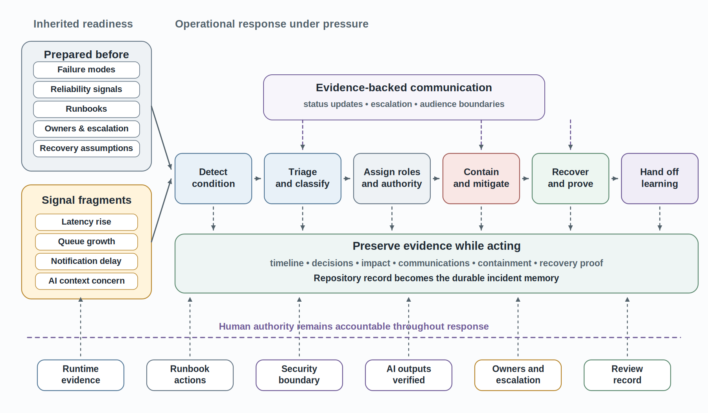
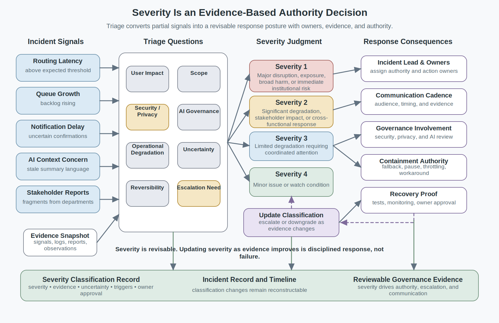
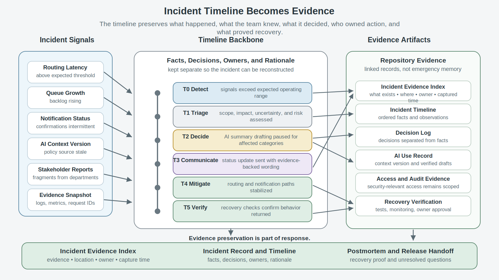
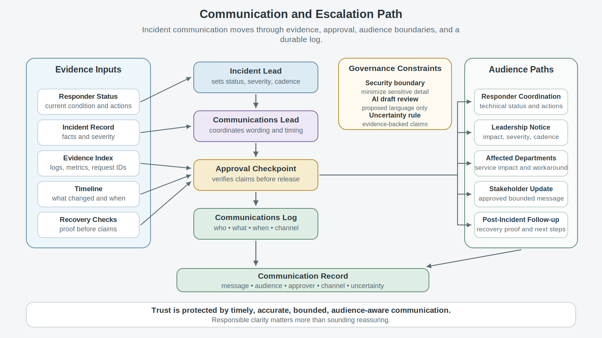
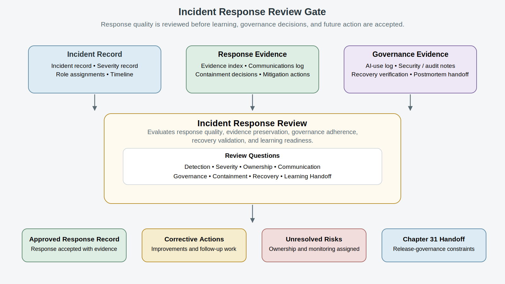

# Chapter 30<br><span class="chapter-title-main">Operational Incident Response
---

### Chapter Governing Line

> Incident response is not heroic improvisation. It is disciplined, evidence-preserving operational action under pressure: detect, triage, assign, communicate, contain, mitigate, recover, and hand off learning without losing accountability.

---

## Opening Scenario: The Failure Became an Incident

LMU had done the responsible work before the incident arrived.

That matters because Chapter 30 must not begin with surprise theater. COICP was not an unmanaged prototype. By this point in Part III, LMU had already moved the Campus Operations and Incident Coordination Platform through operational learning, stabilization, runtime evidence, operational readiness, security governance, controlled AI delegation, and reliability analysis. The team had postmortem learning from Chapter 23, defect-pattern evidence from Chapter 24, observability and runtime evidence from Chapter 25, runbooks and escalation paths from Chapter 26, security and access boundaries from Chapter 27, AI delegation controls from Chapter 28, and failure-mode reasoning from Chapter 29.

In other words, LMU had not ignored operational maturity. It had prepared.

Then COICP experienced an incident anyway.

The incident did not look cinematic at first. It began with weak signals during a heavy intake period. Routing latency rose faster than the Reliability and Failure Analysis Review had considered acceptable for several request types. The notification service slowed, then began returning intermittent delivery confirmations. A queue-depth dashboard showed increasing backlog but did not yet display a clean red state. The AI-assisted priority-summary component stayed inside its approved delegation boundary; it did not reroute requests or send messages on its own. But because one policy context source had not updated cleanly, several generated summary drafts contained stale prioritization language. Human reviewers noticed the problem, but the backlog pressure made the pattern hard to interpret quickly.

At first, different groups saw different fragments of the same event. IT operations saw latency and queue signals. Community Outreach saw partner follow-up messages asking why confirmations were delayed. Student Services saw routed requests arrive in uneven bursts. The COICP product owner saw a possible service-quality issue. The AI governance reviewer saw a context-staleness concern. The security governance reviewer worried that response steps might expose more student-related information than necessary if the team rushed diagnostics. No one was wrong. No one saw the whole incident alone.

This is the moment where incident response becomes engineering.

Reliability analysis had named plausible failure modes. Observability had produced signals. Runbooks described expected actions. Security governance defined what responders could see and do. AI governance defined what AI could propose but not decide. Those artifacts were necessary. They were not enough by themselves. Once the condition became active, LMU had to detect, triage, classify, assign, communicate, contain, mitigate, recover, and preserve evidence while people were under pressure.

The repository already contained the evidence that made response possible:

```text
/docs/operations/reliability/failure_mode_register.md
/docs/operations/reliability/degradation_signal_map.md
/docs/observability/runtime_evidence_index.md
/docs/operations/runbooks/coicp_routing_delay_runbook.md
/docs/operations/runbooks/coicp_notification_failure_runbook.md
/docs/operations/ownership/operational_owner_matrix.md
/docs/operations/escalation/escalation_path_register.md
/docs/security/access_control/role_permission_matrix.md
/docs/governance/ai_governance/ai_delegation_matrix.md
/docs/governance/ai_governance/ai_context_boundary_record.md
```

Those files did not automatically respond to the incident. They gave LMU a disciplined starting point. Preparation creates options. Incident response determines whether those options are used effectively under pressure. The team still had to turn evidence into action without improvising beyond authority, losing timeline accuracy, overstating what was known, exposing unnecessary data, treating AI-generated summaries as facts, or forgetting to preserve the record for postmortem and release-governance decisions.


*Figure 30.1 — Operational Incident Response Flow*

The first lesson is blunt: an incident is not the moment to discover your engineering discipline. It is the moment your discipline is tested.

---

## 30.1 An Incident Is an Operational Condition Requiring Coordinated Action

A useful incident definition has to be practical.

An incident is an operational condition that threatens service, safety, privacy, stakeholder trust, institutional commitments, system integrity, or responsible governance and therefore requires coordinated action beyond routine work. That definition matters because it avoids two weak extremes. It does not label every defect as an incident. It also does not wait for catastrophic outage before the team acts.

For COICP, a bug in a low-risk display label may be a defect. A slow notification that is noticed, bounded, and handled within normal support expectations may be an operational issue. But a routing and notification degradation that affects stakeholder expectations, creates uneven departmental workload, interacts with stale AI-assisted summary context, and requires cross-functional coordination is an incident. The difference is not drama. The difference is operational consequence and coordination need.

Incident response therefore begins with recognizing that normal work is no longer enough. The declaration of an incident is not an admission of failure. It is an acknowledgement that coordinated response is now required. The team must shift from feature delivery, routine defect work, or ordinary support into an incident mode where roles, decisions, evidence, communications, authority, and recovery proof are handled explicitly.

That shift should be recorded. A useful repository artifact is:

```text
/docs/operations/incidents/incident_record_001.md
```

The incident record should not be a polished story written after everyone agrees. It should begin early as a factual working record. It should identify the incident title, detection time, detected signal, initial reporter, affected workflows, suspected scope, severity classification, incident lead, communications lead, technical lead, governance or security contact where needed, AI governance contact where relevant, and links to runtime evidence. The record can change as understanding improves, but changes should remain accountable.

A second artifact should preserve the timeline:

```text
/docs/operations/incidents/incident_timeline_001.md
```

The timeline is not a diary. It is operational evidence. It records what was known, when it was known, what decision was made, who made it, what evidence supported it, and what changed later. Without a timeline, postmortems become memory contests. Without a timeline, release governance later depends on recollection rather than evidence.

The chapter should teach students that incident response is a coordination state, not a panic state. People will feel urgency. They should. But urgency does not justify abandoning reviewability, auditability, security, communication discipline, or human ownership. Under pressure, the rules become more important, not less important.

The repository connection is not bureaucratic overhead. It is how the organization keeps the incident from becoming folklore. Everything important leaves evidence, including what the team believed during the incident and why that belief later changed.

---

## 30.2 Detection Turns Signals Into a Response Trigger

Detection is the first incident-response discipline because teams cannot respond to what they do not recognize.

Many incidents begin as ambiguous conditions that appear explainable in isolation. Detection becomes possible when teams recognize patterns across signals rather than waiting for a single undeniable failure.

Chapter 25 taught that observability creates runtime evidence. Chapter 29 taught that reliability analysis names signals and degradation paths before pressure arrives. Chapter 30 now asks whether those signals are interpreted quickly enough to trigger coordinated response. Detection is not merely seeing a metric. Detection is deciding that available evidence indicates an operational condition requiring action.

In the COICP incident, detection comes from multiple signals rather than a single alarm. Routing latency exceeds the expected range for priority requests. Notification confirmation delays increase. Queue depth rises. Human reviewers report that AI-assisted priority-summary drafts appear to contain stale policy language. Community Outreach receives stakeholder follow-up messages. No single signal tells the whole story. The incident emerges when those signals are correlated.

Useful evidence paths include:

```text
/docs/observability/runtime_evidence_index.md
/docs/observability/metrics/routing_latency_metrics.md
/docs/observability/metrics/notification_delivery_metrics.md
/docs/observability/log_examples/request_id_diagnosis_example.md
/docs/operations/reliability/degradation_signal_map.md
```

The manuscript should avoid teaching detection as tooling. It should teach detection as interpretation. Dashboards can show symptoms. Logs can show events. Metrics can show trends. Request IDs can connect steps. Stakeholder reports can reveal user impact. The engineering work is connecting those fragments responsibly.

Detection also has a governance dimension. A team should not quietly decide that a condition is serious without notifying the correct owner. Nor should it suppress a condition because the dashboard is not red enough. Incident detection requires criteria, escalation expectations, and authority to declare or recommend declaration. In COICP, the operations lead may declare an incident once defined thresholds or stakeholder impacts appear. The product owner may help assess service impact. Security and AI governance contacts may be pulled in when data exposure, context staleness, or delegated AI behavior is involved.

The anti-pattern is weak-signal blindness. Teams often wait for a clean, undeniable failure because ambiguous degradation is uncomfortable. That delay is dangerous. By the time an incident is obvious to everyone, the team may have already lost evidence, user confidence, and recovery time.

Detection should be conservative but not theatrical. The right question is not, 'Are we absolutely certain this is an incident?' The better question is, 'Does the available evidence show a condition that requires coordinated response and evidence preservation now?'

---

## 30.3 Triage and Severity Classification Shape the Response

Once an incident is detected, the team needs triage.

Triage is the disciplined evaluation of scope, impact, urgency, uncertainty, risk, and response need. Severity classification is the team’s current judgment about how serious the incident is. Neither activity is perfect at the start. Both should be evidence-based and revisable.

COICP should avoid a severity model that sounds impressive but cannot be used under pressure. A practical incident severity model for LMU might include four levels. Severity 1 means major service disruption, privacy/security exposure, broad stakeholder harm, or institutional commitment at immediate risk. Severity 2 means significant workflow degradation, important stakeholder impact, or cross-functional response required. Severity 3 means limited operational degradation requiring coordinated attention but not broad disruption. Severity 4 means minor issue or watch condition that may become more serious if signals worsen.

The Chapter 30 incident likely begins as Severity 3 and may be escalated to Severity 2 when the team confirms that routing delays, notification uncertainty, stale AI-assisted summary context, and stakeholder follow-ups are interacting across multiple departments. The escalation is not a failure of judgment. It is evidence updating.

A useful artifact is:

```text
/docs/operations/incidents/severity_classification_record.md
```

The severity classification record should capture current severity, evidence supporting the classification, known affected workflows, known unaffected workflows, uncertainty, escalation triggers, downgrade conditions, and owner approval. It should be linked from the incident record and timeline.

Triage also decides what not to do. Not every hypothesis receives immediate implementation attention. Not every stakeholder receives a detailed technical explanation. Not every responder gets access to all data. Not every AI-generated summary is accepted. Incident response requires focus. Triage protects the team from spreading thin, chasing speculation, or creating new risk while trying to solve the old one.


*Figure 30.2 — Severity and Triage Decision Map*

The governance connection is direct. Severity determines who must be involved, who may communicate externally, what approvals are required, whether security or AI governance review is needed during response, and when leadership notification becomes mandatory. Severity is therefore not just a label. It is an authority decision.

---

## 30.4 Incident Roles Prevent Accountability Fog

Incidents create accountability fog quickly.

When ownership becomes unclear, coordination slows, communication diverges, and important decisions become difficult to reconstruct later.

Everyone wants to help. People open side conversations. Engineers chase logs. Product owners answer stakeholder questions. Leaders ask for updates. Someone suggests a mitigation. Someone else wonders whether the AI summary component should be disabled. Another person asks whether notifications should be resent. Without named roles, the team can look busy while losing coordination.

Chapter 7 introduced accountability as explicit ownership. Chapter 26 created operational owner matrices. Chapter 30 applies that discipline under pressure. The incident response must identify roles early and record them visibly.

A practical COICP incident role structure includes an incident lead, technical lead, communications lead, operations liaison, product/stakeholder lead, security governance contact when data or access may be implicated, AI governance contact when AI behavior, context, or delegated authority may be implicated, and recorder. Small teams may combine roles, but they should not leave roles unnamed.

Useful repository artifacts include:

```text
/docs/operations/incidents/incident_roles_and_owners.md
/docs/operations/ownership/operational_owner_matrix.md
/docs/operations/escalation/escalation_path_register.md
```

The incident lead coordinates the response, keeps the team focused, and ensures decisions are recorded. The technical lead investigates and proposes technical actions. The communications lead manages internal and stakeholder-facing updates. The recorder preserves timeline accuracy. Governance contacts challenge whether response actions respect security, privacy, AI delegation, data handling, and approval boundaries.

This role structure should not feel ceremonial. It prevents three common failures. First, it prevents duplicated or conflicting action. Second, it prevents communication drift, where different groups receive inconsistent statements. Third, it prevents hidden authority, where someone takes an action without having authority, approval, or evidence.

AI can support role work only as proposed material. An AI assistant may summarize current evidence, draft a status update, or propose a checklist of open questions. It must not assign roles, declare severity, authorize mitigation, send stakeholder communications, or rewrite incident facts without human review. During an incident, fluent text can create false confidence. AI-generated summaries must be labeled as drafts and checked against the timeline, logs, and owner decisions.

The anti-pattern is heroic firefighting. The hero solves something quickly but leaves weak evidence, unclear approval, untested side effects, or communication confusion. While the immediate problem may disappear, the organization often learns little about why the incident occurred or how to respond more effectively in the future. Mature incident response values disciplined coordination over dramatic rescue because resilient organizations should not depend on heroics to remain operational.

---

## 30.5 Evidence Preservation Is Part of the Response

Incident response is action, but it is not action alone.

If the team fixes the immediate problem while destroying or neglecting evidence, it weakens postmortem learning, release governance, accountability, and trust. Evidence preservation is not something done after response. It is part of response. Teams that preserve only conclusions often lose the evidence needed to understand how those conclusions were reached.

The COICP team needs to preserve logs, metrics, request IDs, queue snapshots, notification provider status, AI context source versions, AI-assisted summary examples, human approval records, security-relevant access logs, communications, decision records, mitigation actions, and recovery verification. Not every record belongs in the manuscript, but the chapter should teach students that evidence must be identifiable, linked, and protected.

Useful repository paths include:

```text
/docs/operations/incidents/incident_evidence_index.md
/docs/operations/incidents/incident_timeline_001.md
/docs/operations/incidents/decision_log_001.md
/docs/observability/runtime_evidence_index.md
/docs/governance/ai_governance/ai_use_log.md
/docs/security/audit/audit_event_catalog.md
```

The incident evidence index should identify what evidence exists, where it lives, who captured it, when it was captured, and what question it helps answer. The decision log should capture decisions separately from facts. A fact might be that routing latency exceeded the threshold for 37 minutes. A decision might be that the team temporarily disabled AI-assisted priority-summary drafting for affected request categories. A communication might be that Community Outreach sent a status update to partner offices. These should not be blurred together.

Evidence preservation has security and privacy implications. Incident responders should not copy sensitive student-related data into broad channels or unrestricted documents. Screenshots should be minimized or redacted where possible. Logs should be linked rather than pasted when access control matters. AI tools should not receive sensitive incident context unless the AI context boundary permits it and the use is logged. Chapter 27 and Chapter 28 remain active under incident pressure.


*Figure 30.3 — Timeline-to-Evidence Map*

The principle is simple: if the team cannot reconstruct what happened, what it knew, what it decided, and why, it did not preserve enough incident evidence.

Incident response creates operational facts. Evidence preservation is what prevents those facts from becoming opinions later.

---

## 30.6 Communication Discipline Protects Trust

Communication is not public relations during an incident. It is part of operational control.

Poor communication can worsen an incident even when the technical team is making progress. Silence creates speculation. Overconfident updates create later credibility problems. Inconsistent messages create confusion. Technical detail without context overwhelms stakeholders. AI-generated summaries treated as facts can spread errors quickly.

COICP needs a communication path that distinguishes responder coordination, leadership notification, affected department updates, stakeholder-facing notices, and post-incident follow-up. The communications lead should coordinate message content, approval, audience, timing, and uncertainty language.

Useful artifacts include:

```text
/docs/operations/incidents/incident_communications_log.md
/docs/operations/communications/incident_communication_templates.md
/docs/operations/escalation/escalation_path_register.md
/docs/security/data_handling/data_minimization_rules.md
```

The communications log should preserve what was communicated, to whom, by whom, when, through which channel, and with what approval. It should also preserve what was intentionally not communicated yet because the team lacked evidence. Mature communication does not pretend to know more than the evidence supports.

A COICP internal update might say that routing and notification delays are under active incident response, that intake remains available, that affected request IDs are being identified, that stakeholder-facing confirmation delays may occur, and that the next update will follow after recovery checks complete. It should not speculate about root cause before evidence supports it. It should not blame a vendor, a model, a team, or a person. It should not promise full recovery before recovery proof exists.

AI may help draft communications, but AI output is proposed material. The communications lead must verify every claim against the incident record, evidence index, timeline, and approved severity classification. AI-generated communication drafts should be especially constrained because they can sound polished while misrepresenting uncertainty.


*Figure 30.4 — Communication and Escalation Path*

Trust is protected when communication is timely, accurate, bounded, audience-aware, and honest about uncertainty. The goal is not to sound reassuring at any cost. The goal is to be responsibly clear.

---

## 30.7 Containment and Mitigation Are Different Decisions

Under pressure, teams often use containment and mitigation as if they mean the same thing. They do not.

Containment limits harm from spreading. Mitigation reduces the active impact. Recovery restores acceptable operation and proves it. Confusing those steps can create risk. A team may mitigate symptoms while leaving harm uncontained. Or it may contain too broadly, causing unnecessary service disruption. Or it may announce recovery after mitigation without proof.

For COICP, possible containment steps include pausing stakeholder-facing notification retries, temporarily narrowing AI-assisted priority-summary use for affected request categories, freezing automatic routing changes for certain queues, limiting incident diagnostic access to approved responder roles, or routing all affected requests through a manual review queue. Possible mitigation steps include clearing stuck queue transitions, resending verified notifications after approval, refreshing the stale policy context source, reprocessing affected summaries with human review, or applying a configuration change to restore normal routing behavior.

Useful repository artifacts include:

```text
/docs/operations/incidents/containment_decision_record.md
/docs/operations/incidents/mitigation_action_log.md
/docs/operations/runbooks/coicp_routing_delay_runbook.md
/docs/operations/runbooks/coicp_notification_failure_runbook.md
/docs/governance/ai_governance/ai_revocation_plan.md
/docs/operations/recovery/ai_delegation_rollback_plan.md
```

Containment decisions need authority. Who may disable an AI-assisted capability? Who may pause notification retries? Who may redirect requests to manual review? Who may expose additional logs? These questions were prepared by Chapters 26 through 28. Chapter 30 makes them immediate.

Mitigation decisions need evidence. A proposed mitigation should identify the observed problem, intended effect, expected risk, approval owner, implementation owner, verification method, rollback path, and communication need. A mitigation that cannot be verified is not mature. A mitigation that creates hidden authority changes is not trustworthy.

AI-generated hypotheses can be useful here, but dangerous if treated as conclusions. An AI assistant may help list possible causes based on the incident record or propose candidate checks from the runbook. The technical lead must verify every hypothesis against logs, metrics, traces, request IDs, configuration, and stakeholder impact. The model is not the system.

The anti-pattern is undocumented mitigation. The team changes something, the situation improves, and later no one can prove what changed, why it helped, whether it caused side effects, or whether it should remain in place. That is not response maturity. That is operational debt created during stress.

---

## 30.8 Recovery Requires Proof, Not Relief

The most dangerous moment in incident response is often the moment when everyone wants the incident to be over.

Relief is not recovery. A calmer team, a smaller backlog, or a healthier dashboard may indicate improvement. None of those conditions alone proves that operational trust has been restored. A graph looks better. A queue shrinks. Notifications appear to resume. Human reviewers say the backlog feels manageable. The AI-assisted summary component looks normal after context refresh. Those are positive signs. They are not sufficient by themselves.

Recovery requires evidence that the affected workflows have returned to an acceptable operating state and that the incident’s known impacts have been addressed or explicitly carried forward. For COICP, recovery proof might include normalized routing latency, confirmed notification delivery for affected request IDs, verified policy-context freshness, completed human review of stale summary drafts, absence of unauthorized access expansion, audit records for mitigation actions, and stakeholder communication confirming current status.

Useful repository artifacts include:

```text
/docs/operations/incidents/recovery_verification_record.md
/docs/operations/reliability/recovery_evidence_log.md
/docs/observability/metrics/routing_latency_metrics.md
/docs/observability/metrics/notification_delivery_metrics.md
/docs/security/audit/audit_event_catalog.md
```

Recovery verification should answer practical questions. What condition was restored? What evidence proves it? What affected records or stakeholders remain unresolved? What temporary containment remains in place? What needs postmortem analysis? What release or configuration decision must be revisited? What AI capability remains narrowed, revoked, or under monitoring?

Recovery also includes explicit exit criteria. The incident lead should not close incident response because the team is tired. Closure should require recovery evidence, communications status, owner agreement, remaining risk assignment, and postmortem handoff.

The chapter should distinguish recovery from root cause. A team can restore service before it fully understands root cause. That may be appropriate. But it must be honest.

The incident record should say recovery was achieved based on defined evidence while root-cause analysis remains pending.

Recovery answers whether operations have been restored.

Root-cause analysis answers why the incident occurred.

Those questions are related, but they are not the same question.

That honesty is a strength, not a weakness.

This section should slow the reader down. Incident response does not end when the system appears to work again. Trustworthy recovery must be verified, documented, communicated, and transitioned into organizational learning. A demo is not operational proof. A healthier dashboard is not recovery proof by itself. Recovery is established when evidence shows that the incident has been contained, service has been restored, risks are understood, stakeholders have been informed appropriately, and the organization is prepared to learn from what occurred.


---

## 30.9 AI-Assisted Incident Summaries Are Proposed Material

AI can be useful during incident response, but it must be kept in its place.

During the COICP incident, the team may use AI to draft an incident summary from the timeline, identify unresolved questions, compare runbook steps to recorded actions, summarize stakeholder updates, or prepare a postmortem starter outline. These uses can reduce coordination burden. They can also create risk if the AI summary invents causality, compresses uncertainty, omits dissenting evidence, overstates recovery, exposes sensitive information, or turns draft text into institutional memory before human review.

Chapter 30 should treat AI as secondary but important. The incident itself is not an AI incident-response hype story. AI is part of the operational environment because COICP already uses controlled AI delegation, and because responders may use AI assistance during response. But the core incident-response discipline remains human-owned.

Useful repository artifacts include:

```text
/docs/governance/ai_governance/ai_use_log.md
/docs/governance/ai_governance/incident_ai_summary_review_record.md
/docs/governance/ai_governance/ai_context_boundary_record.md
/docs/operations/incidents/incident_summary_draft.md
```

The AI-use log should record what incident information was provided to AI, what output was produced, who reviewed it, what was accepted, what was rejected, and where the verified summary appears. If sensitive or restricted data is involved, the AI context boundary must govern whether AI use is permitted at all.

A useful rule is: AI may summarize evidence, but it may not become evidence. The evidence remains the logs, metrics, request IDs, audit events, timeline, communications, decisions, and owner records. An AI-generated summary can help humans navigate evidence. It cannot replace it.

This section should preserve the book’s recurring doctrine: AI proposes; engineers verify. Context is control. The model is not the system. Everything important leaves evidence. Human accountability remains central.

The anti-pattern is AI summary treated as facts. It is especially dangerous because polished summaries can make messy incidents appear cleaner than they were. Trustworthy engineering requires preserving uncertainty, disagreement, timeline corrections, and unresolved questions.

---

## 30.10 Incident Records Become Operational Memory

An incident record is not a form. It is operational memory.

Organizations that fail to preserve incident memory often repeat the same response mistakes even when they remember the technical cause.

The record allows LMU to reconstruct what happened, what the team knew, what decisions it made, what actions it took, what communications it sent, what evidence proved recovery, and what questions remain for postmortem. Without that record, incident response becomes a story told by whichever memory is loudest later.

A complete COICP incident evidence set may include:

```text
/docs/operations/incidents/incident_record_001.md
/docs/operations/incidents/incident_timeline_001.md
/docs/operations/incidents/incident_evidence_index.md
/docs/operations/incidents/decision_log_001.md
/docs/operations/incidents/incident_communications_log.md
/docs/operations/incidents/containment_decision_record.md
/docs/operations/incidents/mitigation_action_log.md
/docs/operations/incidents/recovery_verification_record.md
/docs/operations/postmortems/postmortem_handoff_001.md
```

These artifacts should be linked, not scattered. A future reviewer should be able to start from the incident record and navigate to the timeline, evidence, decisions, communications, containment actions, mitigation actions, recovery proof, and postmortem handoff. Repository-centered engineering means the repository becomes operational truth, not just code history.

The record should also connect to issues and pull requests when changes are needed:

```text
/docs/operations/incidents/incident_action_items_001.md
issues/incident-001-routing-notification-degradation
branches/incident-001-routing-mitigation
pull requests linked to incident mitigation or follow-up tests
```

The manuscript should be careful not to turn this into a GitHub mechanics lesson. The point is not which exact issue tracker button to click. The point is that incident response creates durable, reviewable evidence that later engineering work can inspect. If a mitigation requires a code change, test update, runbook change, observability improvement, AI-context correction, or security review, the incident record must connect to that work.

Incident records also prepare release governance. Chapter 31 will ask whether COICP can expand, change release state, enable or disable AI capabilities, or accept residual risk after incident learning. That decision cannot be made responsibly if Chapter 30 leaves weak records.

---

## 30.11 The Incident Response Review

ETIS review boards are professional challenge mechanisms, not ceremonies. Chapter 30 introduces the Incident Response Review.

The Incident Response Review asks whether the response preserved safety, evidence, communication discipline, containment, recovery, accountability, and learning under pressure. It does not exist to blame responders. It exists to challenge the quality of the response before its lessons are passed forward.

The review should occur after immediate recovery evidence exists but before the incident is allowed to fade into routine work. It is not the full postmortem, although it feeds the postmortem. It is a response-quality review: did the team respond responsibly, preserve enough evidence, respect governance boundaries, communicate honestly, prove recovery, and prepare learning handoff?

Core review questions include:

What signal triggered the incident response? Was the detection evidence sufficient? Was severity classification reasonable and updated when evidence changed? Were roles assigned early and visibly? Was the timeline accurate enough to reconstruct decisions? Were communications timely, consistent, and approved? Were security and data-handling boundaries maintained? Were AI-generated summaries or hypotheses treated only as proposed material? Were containment and mitigation decisions recorded? Was recovery verified with evidence? Were remaining risks assigned? Was the postmortem handoff clear?

Useful review artifacts include:

```text
/docs/governance/reviews/incident_response_review_record.md
/docs/operations/incidents/incident_record_001.md
/docs/operations/incidents/incident_timeline_001.md
/docs/operations/incidents/recovery_verification_record.md
/docs/operations/postmortems/postmortem_handoff_001.md
```


*Figure 30.5 — Incident Response Review Gate*

The review strengthens engineering judgment because it forces the team to evaluate response quality while evidence is still fresh. It also protects responders from impossible expectations. The review does not require perfect prediction or flawless action. It requires responsible, evidence-aware action under uncertainty.

This is where governance becomes visible as architecture again. Incident response is not merely what people do in a channel during stress. It is a designed control structure: roles, authority, communications, evidence, containment, recovery, review, and learning.

---

## 30.12 Anti-Patterns: How Incident Response Fails

Chapter 30 should name incident-response failure patterns clearly because students will recognize them in professional life.

The primary anti-pattern is heroic firefighting. In this pattern, a person or small group jumps into action, makes undocumented changes, bypasses normal authority, announces partial information, and later receives praise because the visible symptom improved. The organization feels grateful, but trustworthiness has been weakened. Evidence is incomplete. Recovery is unclear. The mitigation may have side effects. The learning handoff is poor. The hero may be exhausted, and the system remains fragile.

Secondary anti-patterns include undocumented mitigation, communication drift, AI summary treated as facts, severity theater, role fog, evidence loss, containment overreach, recovery by relief, governance bypass, security shortcut, and postmortem amnesia.

Undocumented mitigation appears when the team changes configuration, reroutes requests, disables an AI-assisted capability, retries notifications, or patches code without recording what changed and why. Communication drift appears when product, operations, leadership, and stakeholders receive different versions of the incident. AI summary treated as facts appears when generated text becomes the incident narrative before evidence review. Severity theater appears when teams manipulate severity labels to reduce pressure or inflate importance. Role fog appears when everyone helps but no one owns. Evidence loss appears when logs, request IDs, and decisions are not preserved. Recovery by relief appears when the team closes the incident because the graphs look better. Governance bypass appears when urgency is used to ignore approval, audit, security, or data boundaries.

Trustworthy engineering counters these patterns through incident roles, evidence indexes, timelines, severity records, communication logs, containment records, mitigation logs, recovery verification, AI-use records, security/audit checks, review-board challenge, and postmortem handoff.

The chapter should not sound cynical. It should sound professionally honest. Incidents are stressful. People will make mistakes. Mature teams design response systems that reduce the chance that stress becomes disorder. Honest engineering is mature engineering.

This section should also prepare Chapter 31. Release governance can fail if incident evidence is weak. If the incident response record hides uncertainty, overclaims recovery, or omits AI/governance impacts, Chapter 31 will make poor approval decisions. Anti-pattern discipline is therefore not only about response. It protects future authority.

---

## 30.13 Operational Takeaways

Incident response is disciplined operational action under pressure.

Detection is not seeing a dashboard; it is interpreting signals well enough to trigger coordinated response.

Severity classification is an authority decision and must be evidence-based, revisable, and recorded.

Roles prevent accountability fog. Small teams may combine roles, but they should not leave ownership implicit.

Evidence preservation is part of response, not an after-action luxury.

Communication protects trust when it is timely, accurate, bounded, audience-aware, and honest about uncertainty.

Containment limits harm. Mitigation reduces active impact. Recovery requires proof. These are different decisions.

AI-assisted summaries can help responders navigate evidence, but they are proposed material. AI may summarize evidence; it must not become evidence.

Incident records become operational memory. They must link signals, timelines, owners, decisions, mitigations, communications, recovery evidence, and postmortem handoff.

The Incident Response Review challenges whether the response preserved safety, evidence, communication, containment, recovery, accountability, and learning under pressure.

The signature professional lesson is this: the incident does not create engineering discipline. It reveals whether discipline was already there.

---

## 30.14 Exercises

### Exercise 1: Declare or Do Not Declare

A COICP deployment exhibits the following conditions:

- Rising routing latency
- Notification uncertainty
- Increased stakeholder follow-up
- Stale AI context

Determine whether the situation should be:

- Monitored without declaration
- Declared as a reliability degradation
- Declared as an operational incident

If an incident should be declared, identify the severity level, supporting evidence, affected workflows, and immediate response actions.

Justify the decision using available evidence and explicitly identify remaining uncertainty.

### Exercise 2: Build an Incident Record

Create the repository artifact:

`/docs/operations/incidents/incident_record_001.md`

The record must include:

- Detection signal
- Incident severity
- Affected workflows
- Responsible roles
- Initial evidence references
- Known facts
- Current uncertainties
- Immediate actions
- Next review time

Explain how the record supports operational accountability and future review.

### Exercise 3: Construct an Incident Timeline and Evidence Index

Create the following repository artifacts:

`/docs/operations/incidents/incident_timeline_001.md`

`/docs/operations/incidents/incident_evidence_index.md`

Each timeline entry must be linked to one or more of the following:

- Detection signals
- Decisions
- Communications
- Mitigation actions
- Recovery checks

Identify any points where evidence is incomplete or uncertain.

### Exercise 4: Practice Incident Communication Discipline

Create entries for:

`/docs/operations/incidents/incident_communications_log.md`

Prepare:

- One internal incident update
- One stakeholder-facing incident update

Both communications must:

- State known facts
- Identify uncertainty
- Avoid unsupported root-cause claims
- Specify next update expectations
- Preserve accountability for communication decisions

Explain why operational trust can be damaged by premature conclusions.

### Exercise 5: Plan Containment, Mitigation, and Recovery

For the COICP incident scenario, identify:

- One containment action
- One mitigation action
- One rollback path
- One recovery-verification check

Document the actions in appropriate incident-response artifacts.

For each action, identify:

- Responsible owner
- Required authority
- Expected evidence
- Success criteria
- Potential risks

### Exercise 6: Review an AI-Assisted Incident Summary

Compare an AI-generated incident summary against:

- The incident timeline
- The incident evidence index
- The communications log

Identify:

- Unsupported claims
- Missing uncertainty
- Sensitive-context exposure
- Incomplete evidence references
- Acceptable revisions

Produce a corrected incident summary suitable for operational review.

### Exercise 7: Conduct an Incident Response Review

Perform an Incident Response Review using:

`/docs/governance/reviews/incident_response_review_record.md`

Evaluate whether the incident response was adequate in the areas of:

- Detection
- Severity classification
- Role assignment
- Evidence preservation
- Communication
- Containment
- Mitigation
- Recovery
- AI-assisted activity
- Postmortem handoff preparation

For each area, determine whether performance was:

- Acceptable
- Conditionally acceptable
- Unacceptable

Document corrective actions, owner assignments, evidence gaps, and follow-up obligations.

Explain which review findings should be inherited by Chapter 31 release-governance activities.

These exercises should be designed as engineering reasoning work, not memorization. They should require students to produce repository-ready artifacts and defend them with evidence.

---

## 30.15 Trustworthiness Mapping

Chapter 30 primarily strengthens recoverability, accountability, operational visibility, human oversight, governability, and observability.

Recoverability is central because the chapter teaches containment, mitigation, recovery verification, rollback awareness, and postmortem handoff. Evidence includes recovery verification records, mitigation logs, runbook links, and recovery evidence logs.

Accountability is central because incident roles, severity decisions, communication approvals, containment authority, mitigation ownership, and remaining-risk assignments must be named. Evidence includes incident roles, owner matrices, decision logs, severity records, and review records.

Operational visibility is central because incident response requires the organization to understand what is happening, who is affected, what is being done, what remains uncertain, and when the next update will occur. Evidence includes communications logs, timelines, evidence indexes, runtime evidence, and stakeholder updates.

Human oversight is central because AI-assisted summaries, recommendations, and incident hypotheses remain proposed material. Humans classify severity, assign roles, approve communications, authorize containment, verify mitigation, and own recovery decisions.

Governability is central because incident response involves authority under pressure: who may declare, escalate, disable, communicate, retry, reroute, expose logs, revoke AI assistance, or accept residual risk. Evidence includes escalation paths, governance review records, security/audit notes, and AI governance records.

Observability remains essential because response depends on runtime signals, logs, metrics, traces, audit events, request IDs, and stakeholder reports. Chapter 30 converts observability into action.

Secondary pillars include traceability, reviewability, security/privacy, and correctness. Traceability appears through timeline-to-evidence mapping. Reviewability appears through the Incident Response Review. Security/privacy appears through data-handling controls under pressure. Correctness appears through verified mitigation and recovery rather than asserted fixes.

The chapter prevents checklist theater by refusing to treat incident response as a form to complete. It frames response as live engineering judgment supported by evidence, roles, communication, containment, recovery, and review.

---

## 30.16 Chapter Closing: From Incident Evidence to Release Authority

By the end of Chapter 30, LMU has done more than respond to a COICP incident.

It has produced incident evidence. The team detected the condition, classified severity, assigned roles, preserved a timeline, controlled communications, separated containment from mitigation, verified recovery, reviewed AI-assisted summaries as proposed material, preserved incident records, and prepared a postmortem handoff. The incident did not become a heroic story. It became operational memory.

That memory changes what LMU can responsibly decide next.

If routing latency degraded under load, release governance must ask whether broader rollout is still appropriate. If notification confirmation was unreliable, release governance must ask whether additional monitoring, fallback, or supplier assumptions are required. If stale AI context affected summaries, release governance must ask whether the AI-assisted capability should remain narrowed, temporarily disabled, or reapproved under stronger controls. If communications exposed uncertainty, leadership must decide what stakeholders should be told before scope expansion. If recovery depended on a manual step that only one person knew, release authority must account for that fragility.

Chapter 31 exists because incident response changes release authority. After operational facts have challenged the system, release decisions cannot rely only on the original release-readiness package. They must consider incident evidence, residual risk, recovery proof, postmortem actions, AI governance constraints, security implications, stakeholder trust, and operational capacity.

Chapter 30 should close with a clear handoff: incident response preserved the facts under pressure; release governance must now decide what those facts authorize.

The next chapter should not reteach incident response. It should inherit the incident record, timeline, communications log, mitigation evidence, recovery verification, postmortem handoff, AI-use review, security/audit notes, and unresolved risks. It should ask who has authority to approve, defer, roll back, constrain, or expand COICP after the incident has changed the evidence.

The closing lesson is straightforward: operational trust is not protected by never having incidents. It is protected by how honestly, visibly, and responsibly an organization responds when incidents occur.

Incident evidence becomes release evidence.

Once operational reality has challenged the system, future decisions can no longer rely on assumptions, plans, or confidence alone.

Chapter 31 inherits a harder question:

Given everything the incident revealed, what authority does the evidence now support?

That is the work of release governance.
