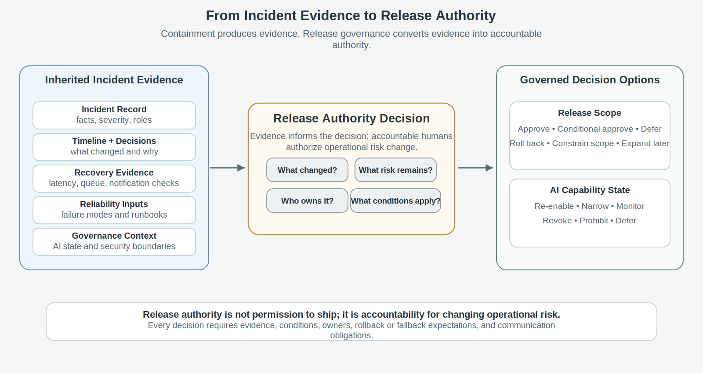
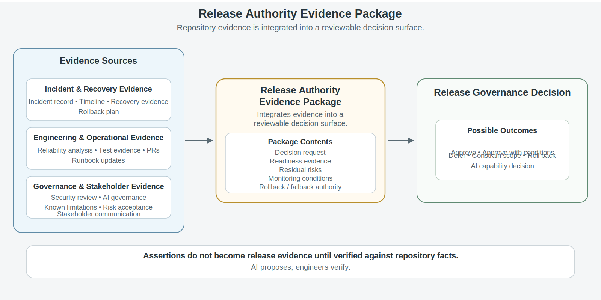
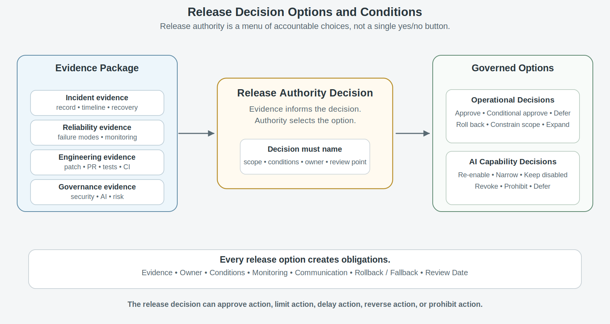
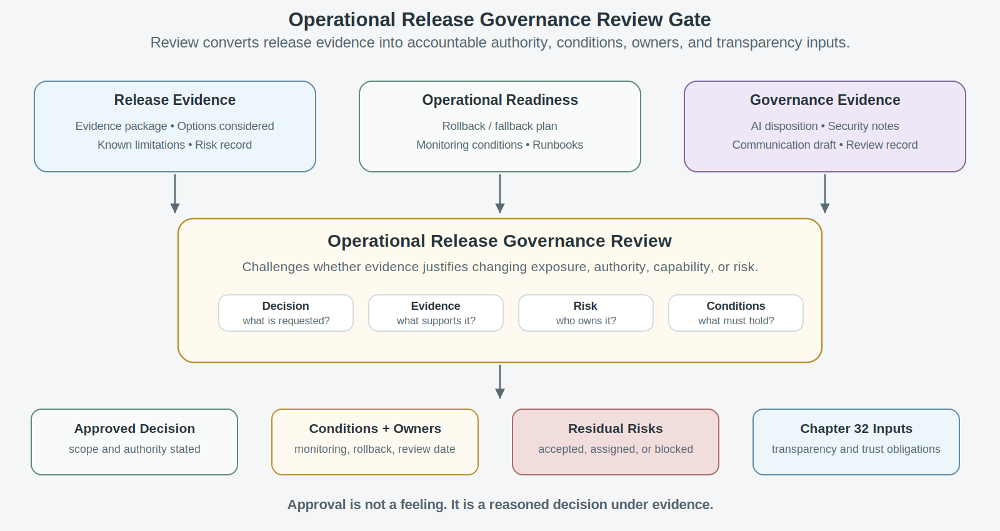

# Chapter 31<br><span class="chapter-title-main">Release Governance and Approval Authority
---

### Chapter Governing Line

> Release authority is not permission to ship; it is accountability for changing operational risk.

---

## Opening Scenario: The Incident Was Contained. The Release Decision Was Not Simple.

The incident was over, but the decision was not.

Lakeside Metropolitan University had handled the COICP incident with discipline. The team had detected the routing and notification degradation, assigned incident roles, classified severity, preserved evidence, communicated with affected stakeholders, mitigated the immediate condition, verified recovery, and handed the record forward for learning. The incident record was not perfect, but it was reconstructable. The timeline showed when weak signals became operational impact. The communications log showed what was said, when it was said, and who approved it. The mitigation record showed which temporary controls had been applied. The recovery evidence showed that queue depth, notification delay, routing latency, and stakeholder handoff behavior had returned to an acceptable state.

That was progress.

It was not release authority.

By Monday morning, the COICP team faced a harder question than whether the immediate incident had been contained. Engineering had a patch that corrected one routing-delay condition. Operations wanted to continue the temporary manual routing fallback until the patch had more runtime evidence. Student Services wanted assurance that the handoff pattern would not return during the next outreach surge. Community Outreach wanted a clear explanation of what had changed and what remained limited. The AI governance reviewer wanted to know whether the AI-assisted escalation recommendation, disabled during containment, could be re-enabled in a narrower form. The product owner wanted to expand the pilot to a second department because the original release plan had already slipped. The release manager wanted a decision. Everyone wanted movement.

The available options were not binary. LMU could approve the patch for a limited rollout. It could defer the patch until additional tests and monitoring were complete. It could keep the manual fallback in place while narrowing pilot scope. It could re-enable the AI-assisted escalation recommendation only for draft-only internal review. It could prohibit AI-assisted escalation until context freshness and monitoring improved. It could roll back part of the workflow. It could expand the pilot later, after a time-boxed evidence window. It could also approve a release with explicit conditions: monitoring thresholds, rollback triggers, stakeholder communication, named residual-risk owners, and a scheduled review.

The wrong answer would be to treat the incident as closed and the fix as self-authorizing.

A fix is not a release decision. A recovered system is not automatically ready for increased exposure. A quiet dashboard is not approval. A successful mitigation does not prove that future operation is trustworthy. An AI capability that was disabled during incident containment should not be re-enabled because the team feels better. Release governance exists because operational evidence changes what the organization knows, but evidence does not decide for itself.

The repository now contains the evidence that makes this chapter possible:

```
/docs/operations/incidents/incident_record_001.md
/docs/operations/incidents/incident_timeline_001.md
/docs/operations/incidents/incident_communications_log.md
/docs/operations/incidents/incident_decision_log.md
/docs/operations/incidents/recovery_evidence_record.md
/docs/operations/reliability/failure_mode_register.md
/docs/operations/runbooks/coicp_routing_delay_runbook.md
/docs/governance/ai_governance/ai_revocation_plan.md
/docs/governance/ai_governance/ai_delegation_matrix.md
```

Those artifacts preserve what happened and what was done. Chapter 31 asks what LMU is now authorized to do next.


*Figure 31.1 — From Incident Evidence to Release Authority*

The first lesson is blunt: containment is not permission to move forward.

---


## 31.1 Release Governance Means Authority Under Evidence

Release governance is the discipline of deciding whether operational evidence justifies changing system exposure, authority, capability, or risk.

That definition matters because release is often treated too narrowly. Some teams treat release as deployment: code moves from one environment to another. Some treat release as approval: a manager says yes. Some treat release as schedule completion: the date arrived, so the change goes out. Some treat release as confidence: the team believes the patch is ready. Some treat release as a technical event: CI is green, the tests pass, the artifact builds, and the pipeline deploys. Each of those views contains part of the truth. None is sufficient for trustworthy engineering.

Release governance is the process through which an organization converts operational evidence into accountable authority. It asks whether operational exposure should change and under what conditions. That change may be a code release, a configuration change, a scope expansion, a rollback, a pilot extension, a feature-flag change, an AI capability re-enable decision, a monitoring condition, or a communication commitment. The resulting decision may increase or decrease risk. It may expand access, restore a capability, narrow operation, defer change, impose conditions, or require additional evidence before action is authorized.

The central question is not, 'Can we deploy?' The better question is, 'What operational risk are we changing, who has authority to change it, what evidence supports the decision, what conditions attach, what residual risk remains, and who owns the consequence?'

For COICP, that question has immediate force. The routing patch may be technically ready, but release governance asks whether it has been tested against the failure mode that produced the incident, whether the runbook has been updated, whether observability can detect recurrence, whether Student Services understands the remaining limitation, whether manual fallback remains available, whether rollback can be executed, and whether AI-assisted escalation should remain disabled until additional evidence exists.

A useful repository artifact is:

`/docs/release_evidence/release_governance_record.md`

That document should not be a generic release checklist. It should preserve the specific release-governance decision: what is being approved, deferred, rolled back, constrained, expanded, or re-enabled; what evidence supports the decision; who has authority; what conditions apply; what risks remain; who owns those risks; what communication is required; and what follow-up evidence must be collected.

Another artifact makes the authority explicit:

`/docs/release_evidence/release_authority_record.md`

This record should identify the decision owner, review participants, evidence sources, approval scope, operating conditions, rollback authority, and next review point. If the release decision affects AI-assisted behavior, the record should link to the relevant AI governance evidence rather than hiding AI disposition inside a general release note.

The doctrine from earlier chapters still governs this one. Everything important leaves evidence. Governance is architecture. A demo is not operational proof. Honest engineering is mature engineering. Release governance is where those ideas stop being slogans and become authority.

Release governance also prevents a common organizational weakness: decision fog.

Decision fog occurs when many people participate in a release discussion but no one can later reconstruct who had authority, what evidence mattered, what conditions were accepted, and what risk was owned.

Decision fog is dangerous because it allows movement without accountability. The organization remembers that a decision was made but gradually loses the ability to explain why it was made, what evidence supported it, and who accepted the consequences.

A trustworthy release decision must be reconstructable. If a future review board cannot tell why LMU approved, deferred, rolled back, constrained, expanded, or re-enabled something, the decision did not leave enough evidence.

---

## 31.2 The Release Authority Evidence Package

Release governance needs an evidence package, not a pile of unrelated artifacts.

After an incident, evidence usually exists in many places. The incident record explains what happened. The timeline preserves sequence. The recovery evidence shows what normalized. The reliability register names failure modes. The defect record links to fixes. The PR shows code changes. Tests show verification. CI provides limited automation evidence. Runbooks show operational procedure. Security records show whether access, data, or authority boundaries changed. AI governance records show whether AI-assisted behavior was involved, disabled, narrowed, or monitored. Communications logs show stakeholder impact. Known limitations show what remains true. Risk records show what remains unresolved.

The release-governance task is to integrate that evidence into a decision surface.

For COICP, the release authority evidence package might include:

```
/docs/operations/incidents/incident_record_001.md
/docs/operations/incidents/incident_timeline_001.md
/docs/operations/incidents/recovery_evidence_record.md
/docs/operations/reliability/failure_mode_register.md
/docs/operations/reliability/degradation_signal_map.md
/docs/operations/reliability/fallback_validation_record.md
/docs/testing/regression_evidence/coicp_routing_delay_regression.md
/docs/operations/runbooks/coicp_routing_delay_runbook.md
/docs/security/security_review_record.md
/docs/governance/ai_governance/ai_capability_disposition_record.md
/docs/release_evidence/known_limitations.md
/docs/release_evidence/risk_acceptance_record.md
/docs/operations/recovery/rollback_plan.md
/docs/communications/stakeholder_release_update.md
```

A repository file can assemble those references:

`/docs/release_evidence/release_authority_evidence_package.md`

This package is not bureaucracy. It is the evidence surface that allows the release decision to be challenged. It should state what decision is being requested, what facts changed since the incident, what evidence supports readiness, what evidence is missing, what risks remain, what authority is required, what monitoring is attached, what rollback or fallback exists, what stakeholder communication is required, and what review date is set.

The release authority evidence package should distinguish evidence from assertion. 'The patch works' is an assertion. A linked PR, regression test, runtime verification record, and updated runbook are evidence. 'The AI assistant is safe to re-enable' is an assertion. A revised delegation matrix, context-boundary review, monitoring plan, approval-path record, and revocation procedure are evidence. 'Stakeholders have been informed' is an assertion. A stakeholder communication record is evidence.

This distinction is especially important in AI-assisted systems because fluent explanations can make weak evidence sound stronger than it is. AI-generated release notes, incident summaries, test descriptions, and risk summaries may be useful proposed material, but they do not become release evidence until humans verify them against repository facts. AI proposes; engineers verify.


*Figure 32.1 — Release Authority Evidence Package*

The evidence package also prevents checklist theater. A checklist can ask whether tests exist. A release authority evidence package asks whether the right evidence exists for this decision under these operating conditions.

---

## 31.3 Approve, Defer, Roll Back, Constrain, or Expand

Immature release governance treats approval as the only interesting decision.

That is too narrow. Mature release governance recognizes multiple authority options. A team may approve a release, approve with conditions, defer release, roll back a prior change, constrain scope, expand scope, re-enable a capability, narrow a capability, revoke a capability, or prohibit action under current evidence. These are different decisions. They require different evidence and create different obligations.

After the COICP incident, LMU may have several release options.

Option one is to approve the routing patch for the existing pilot only. That decision requires evidence that the patch addresses the observed failure mode, that regression tests cover the condition, that runtime monitoring can detect recurrence, and that rollback is available.

Option two is to approve the patch with conditions. Conditions might include a two-week monitoring window, continued manual fallback, daily review of queue-depth and routing-latency metrics, and a scheduled review before pilot expansion.

Option three is to defer the patch. Deferral may be responsible if evidence is incomplete, if the patch touches authority-sensitive routing logic, if testing is weak, or if deployment during a high-volume period would increase risk.

Option four is to roll back or keep the system in a constrained operating mode. This may be the right decision when the temporary mitigation is safer than the proposed change, even if it is less efficient.

Option five is to expand the pilot. That decision requires stronger evidence because more stakeholders, departments, and users will experience the system. Expansion should never be justified merely because the original calendar planned it.

Option six concerns AI capability disposition. LMU may re-enable the AI-assisted escalation recommendation, narrow it to draft-only support, keep it disabled, require additional monitoring, change approval paths, or prohibit re-enablement until context freshness and review workload are addressed. AI capability changes are release-governance decisions because they change operational authority, influence, evidence, and risk.

A useful repository artifact is:

`/docs/release_evidence/release_option_analysis.md`

This artifact should compare options, not simply defend the preferred option. It should record each option, evidence supporting it, risks, operating conditions, affected stakeholders, rollback/fallback expectations, AI capability impact, owner, and decision rationale. A second artifact can preserve conditions attached to an approved option:

`/docs/release_evidence/release_conditions.md`

Release conditions might include monitoring thresholds, communication requirements, manual fallback readiness, stop conditions, rollback triggers, stakeholder notification timing, AI monitoring obligations, review date, and named owners.


*Figure 31.3 — Release Decision Options and Conditions*

The figure should make one idea visually unavoidable: release authority is a menu of accountable choices, not a single yes/no button.

---

## 31.4 Residual Risk, Known Limitations, and Named Ownership

Release governance does not require the absence of risk. It requires honest risk ownership.

Some residual risk will remain after almost any meaningful release decision. The question is not whether risk exists. The question is whether it is understood, bounded, communicated, monitored, recoverable, and owned by someone with the authority to act.

For COICP, residual risk may include the possibility that routing latency could recur during a larger intake surge, that notification delay may still affect a small percentage of handoffs, that manual fallback increases staff workload, that AI-assisted escalation recommendations remain limited by policy-context freshness, or that pilot expansion could expose coordination gaps with a new department. None of those risks automatically blocks release. But none can be hidden inside optimism.

Known limitations must be updated after incident learning. If a limitation was discovered during incident response, the release decision must reflect it. If a mitigation reduces risk but does not eliminate the underlying dependency weakness, the known limitation should say so. If AI assistance is re-enabled only for internal draft recommendations, the limitation should say what it cannot do and under what conditions it must be disabled again.

Useful repository artifacts include:

```
/docs/release_evidence/known_limitations.md
/docs/release_evidence/risk_acceptance_record.md
/docs/risk/risk_register.md
/docs/governance/ai_governance/ai_capability_disposition_record.md
```

A risk acceptance record should not be vague. It should state the risk, evidence, impact, monitoring plan, owner, expiration or review date, rollback/fallback path, and communication requirement. 'Accepted by the team' is not enough. Risk accepted by everyone is often risk owned by no one.

Risk acceptance without an owner is risk abandonment.

A risk that belongs to everyone usually belongs to no one. Governance becomes meaningful only when someone with authority, visibility, and responsibility is accountable for monitoring the evidence and acting when conditions change.

This principle matters for students because they often assume release decisions are about technical confidence. Professional release decisions are about accountable consequence. A release may be technically acceptable and organizationally irresponsible if residual risk is unowned. A release may be imperfect and responsible if risks are explicit, bounded, monitored, and owned.

AI-era systems intensify this issue. AI behavior can degrade through stale context, changed prompts, hidden dependency updates, shifting evaluation data, review overload, and automation bias. If LMU accepts residual risk around AI-assisted escalation recommendations, that risk needs an owner. Someone must monitor the evidence, review overrides, maintain the context boundary, and revoke the capability if conditions fail.

The chapter should slow down here. The reader needs time to internalize that honest limitations are not a sign of weakness. They are a sign of mature governance. Honest engineering is mature engineering.

---

## 31.5 Rollback, Fallback, and Release Conditions

A release decision is not complete unless the organization knows how to stop, narrow, reverse, or recover from it.

Rollback and fallback are not embarrassment mechanisms. They are governance controls. They allow LMU to move forward without pretending the future is guaranteed. They make release authority safer because they reduce the cost of being wrong.

Rollback returns the system to a prior version, configuration, or capability state. Fallback provides an alternate operating procedure when the preferred path is unavailable, degraded, or unsafe. In COICP, rollback might disable the routing patch, restore a prior routing rule, or turn off an AI-assisted recommendation feature flag. Fallback might return to manual routing review, use a department liaison for urgent cases, or require human approval for all escalation recommendations during a monitoring window.

Release conditions define when those controls must be used. A release condition might state that if routing latency exceeds a threshold for fifteen minutes, the release manager must activate manual fallback. Another condition might state that if AI-assisted escalation disagreement rates exceed an agreed level, the AI capability is narrowed to draft-only support. Another might state that if stakeholder communication becomes inconsistent, the communications owner must pause outward-facing release claims until the record is corrected.

Useful repository artifacts include:

```
/docs/operations/recovery/rollback_plan.md
/docs/operations/recovery/fallback_plan.md
/docs/release_evidence/release_conditions.md
/docs/operations/runbooks/coicp_routing_delay_runbook.md
/docs/observability/runtime_evidence_index.md
/docs/governance/ai_governance/ai_revocation_plan.md
```

Release conditions connect release governance to observability. A condition that cannot be detected is not a useful condition. If LMU says the patch is approved as long as routing latency remains acceptable, the runtime evidence must define acceptable. If LMU says AI assistance may remain enabled as long as human override rates stay within a boundary, the system must preserve override evidence. If LMU says fallback must begin when queue depth crosses a threshold, the threshold must be visible to the people responsible for action.

Release conditions also connect governance to authority. Who may trigger rollback? Who may activate fallback? Who may disable an AI capability? Who may notify stakeholders? Who may expand scope? Who may accept continued degraded operation? These questions cannot wait until pressure returns.

A release decision without rollback, fallback, monitoring, and stop conditions is not mature courage. It is confidence without recoverability.

The doctrine is simple: do not approve a change unless you can explain how you will know it is failing, who can act, what action they may take, and what evidence will prove the result.

---

## 31.6 The Operational Release Governance Review

Chapter 31 introduces the Operational Release Governance Review.

This review is not a ceremony. It is the challenge mechanism that asks whether operational evidence justifies changing system exposure, authority, capability, or risk. It is the point where LMU must decide whether to approve, approve with conditions, defer, roll back, constrain, expand, re-enable, narrow, revoke, or prohibit a change.

The review should occur after incident response and recovery evidence exist, after release options have been described, after residual risks have been named, and before operational exposure changes. It inherits evidence from earlier reviews: Release Readiness Review, Engineering Release Defense, Postmortem Learning Review, Stabilization Review, Observability Readiness Review, Operational Readiness Review, Security Governance Review, AI Delegation Governance Review, Reliability and Failure Analysis Review, and Incident Response Review. It does not replace those reviews. It uses their outputs to decide authority.

A useful repository artifact is:

`/docs/governance/reviews/operational_release_governance_review_record.md`

The review board should ask direct questions:

What release decision is being requested?
What operational evidence changed since the incident?
What incident records, recovery evidence, reliability analysis, tests, runbook updates, security records, AI governance records, and communication records support the decision?
What options were considered besides approval?
What residual risks remain, and who owns them?
What release conditions, monitoring thresholds, rollback triggers, fallback procedures, and stop conditions apply?
What AI-assisted capabilities are affected, and what disposition is approved?
What stakeholders must be informed, and what claims are supported by evidence?
What evidence must be updated after release?
When will the decision be reviewed again?

The review output should be specific. It should not merely say approved. It should say approved for existing pilot scope only; approved with monitoring conditions; deferred until regression evidence is complete; AI-assisted escalation remains disabled; AI-assisted escalation re-enabled for draft-only internal recommendations; rollback authority assigned to operations lead; stakeholder communication required before expansion; review scheduled after two weeks of runtime evidence.


*Figure 31.4 — Operational Release Governance Review Gate*

This review strengthens engineering judgment because it forces the reader to defend a release decision as a consequence-bearing professional act. Approval is not a feeling. It is a reasoned decision under evidence.

---

## 31.7 Communication Is Part of Release Authority

A release decision changes what others can reasonably believe about the system.

That is why communication is part of release authority. A team cannot approve a patch, constrain a pilot, defer expansion, or re-enable an AI-assisted workflow while leaving stakeholders to infer what happened. Trustworthy release governance requires truthful communication about what changed, what did not change, what remains limited, what is being monitored, what users should expect, and who owns follow-up.

In COICP, several audiences need different levels of communication. Student Services may need operational detail about expected handoff behavior and fallback. Community Outreach may need stakeholder-facing language about response timing and next steps. IT operations may need release conditions, monitoring thresholds, and rollback triggers. Governance reviewers may need evidence links and risk acceptance records. Executive sponsors may need a concise explanation of whether the pilot remains constrained or can expand. Users may need no technical detail, but they should not be misled by overconfident claims.

Useful repository artifacts include:

```
/docs/communications/stakeholder_release_update.md
/docs/release_evidence/release_notes.md
/docs/release_evidence/known_limitations.md
/docs/governance/reviews/operational_release_governance_review_record.md
```

Release communication should be evidence-aligned. It should not say the issue is fixed if the release decision only approves a monitored mitigation. It should not say AI escalation is restored if AI assistance is re-enabled only for draft-only internal review. It should not say the pilot is ready to expand if expansion is deferred pending evidence. It should not hide known limitations because they sound uncomfortable.

This is where Chapter 31 begins preparing Chapter 32. Trust, transparency, and organizational confidence do not begin with public relations. They begin with release decisions that preserve truth. The organization cannot communicate honestly later if release governance hides or blurs the evidence now.

AI-assisted communication can help draft release notes, stakeholder updates, and summaries, but those drafts are proposed material. They must be checked against the release-governance record, known limitations, risk acceptance, and communication authority. An AI-generated stakeholder update that overstates readiness is not harmless. It can turn a careful release decision into a misleading institutional claim.

Communication drift is a release-governance failure. It happens when the decision record says one thing, the release note says another, and stakeholder messaging implies something stronger than the evidence supports. The repository must preserve enough evidence for future reviewers to reconstruct the claim chain from release decision to communication.

---

## 31.8 Failure Patterns in Release Governance

The primary anti-pattern of Chapter 31 is approval theater.

Approval theater occurs when a release decision appears governed because a meeting, checklist, or sign-off occurred, but the decision is not grounded in integrated evidence, explicit ownership, residual-risk disposition, rollback/fallback readiness, stakeholder communication, or accountable authority. The organization performs the shape of governance without the substance of governance.

Approval theater is dangerous because it creates confidence while weakening accountability. Everyone remembers that approval happened. Fewer people can explain why. Fewer still can identify what evidence supported the decision, what risks remained, who owned them, or what conditions attached.

Several secondary anti-patterns appear around it.

Release by confidence occurs when leaders feel reassured after recovery and treat reassurance as evidence. Confidence may be useful as a human emotion, but it is not a release artifact.

Fix equals release occurs when the existence of a patch is treated as proof that the system should move forward. A patch may correct one behavior while changing another. Release governance asks whether the patched system is ready under operational conditions.

Risk abandonment occurs when residual risks are listed without owners, review dates, monitoring, communication, or authority to act.

Authority fog occurs when no one can reconstruct who approved what, under what scope, and with what conditions.

AI re-enable by optimism occurs when an AI-assisted capability disabled during incident response is restored because the incident feels resolved, not because context boundaries, monitoring, approval paths, and revocation controls are ready.

Communication drift occurs when stakeholder messaging becomes stronger, cleaner, or more confident than the evidence supports.

Rollback shame occurs when teams treat rollback or constrained release as failure rather than responsible operational control.

Green-check approval occurs when CI, tests, or pipeline success is treated as release authority. Green checks are evidence. They are not governance.

Trustworthy engineering counters these patterns by making release authority explicit. It preserves evidence, names owners, states options, records decisions, attaches conditions, prepares rollback/fallback, verifies AI capability disposition, aligns communication, and schedules follow-up review.

The chapter should not portray these anti-patterns as moral failures by bad people. In real organizations, approval theater often emerges from pressure: stakeholders want speed, teams want closure, leaders want certainty, and incident fatigue makes everyone eager to move on. The mature response is not cynicism. It is disciplined release governance.

---

## 31.9 Operational Takeaways

Release authority is not permission to ship; it is accountability for changing operational risk.

A fix is not a release decision.

Containment is not approval.

Recovery evidence is an input to release governance, not a substitute for it.

Approval without evidence is approval theater.

Risk acceptance without an owner is risk abandonment.

Release decisions are not binary. Approve, approve with conditions, defer, roll back, constrain, expand, re-enable, narrow, revoke, and prohibit are all governance options.

Rollback and fallback are governance controls, not signs of embarrassment.

AI capabilities disabled during incident response should not be re-enabled by optimism.

Stakeholder communication must match release evidence.

Everything important leaves evidence, including the decision to move forward.

---

## 31.10 Exercises

### Exercise 1: Build a Release Authority Evidence Package

Create the repository artifact:

`/docs/release_evidence/release_authority_evidence_package.md`

Using the COICP incident record, reliability evidence, test evidence, runbook updates, known limitations, recovery evidence, and operational-review findings, assemble a release-authority evidence package.

The package should identify:

- Requested decision
- Scope of release
- Supporting evidence
- Remaining risks
- Known limitations
- Monitoring obligations
- Responsible owners
- Required approvals

Explain why release authority must be evidence-based rather than confidence-based.

### Exercise 2: Compare Release Options

Create the repository artifact:

`/docs/release_evidence/release_option_analysis.md`

For the post-incident COICP decision, evaluate the following options:

- Approve
- Approve with conditions
- Defer
- Roll back
- Constrain scope
- Expand pilot
- AI capability disposition alternatives

For each option, identify:

- Supporting evidence
- Operational risk
- Stakeholder impact
- Responsible owner
- Required conditions
- Expected monitoring obligations

Justify the preferred option using available evidence and explicitly identify remaining uncertainty.

### Exercise 3: Write a Risk Acceptance Record

Create the repository artifact:

`/docs/release_evidence/risk_acceptance_record.md`

Select one residual operational risk that remains after incident recovery.

The record must include:

- Risk description
- Potential impact
- Supporting evidence
- Risk owner
- Monitoring plan
- Review date
- Rollback or fallback path
- Communication obligation

Explain why accepting risk is different from ignoring risk.

### Exercise 4: Define Release Conditions

Create the repository artifact:

`/docs/release_evidence/release_conditions.md`

For a limited COICP routing-patch release, define:

- Monitoring thresholds
- Rollback triggers
- Manual fallback procedures
- AI capability restrictions
- Communication requirements
- Review timing
- Escalation triggers

For each condition, identify:

- Responsible owner
- Required evidence
- Success criteria
- Consequence of condition failure

Explain how release conditions reduce operational uncertainty.

### Exercise 5: Decide AI Capability Disposition

Create the repository artifact:

`/docs/governance/ai_governance/ai_capability_disposition_record.md`

Evaluate the AI-assisted escalation recommendation capability that was disabled during incident response.

Determine whether the capability should:

- Remain disabled
- Be narrowed
- Be re-enabled
- Be revoked
- Be prohibited

For the selected disposition, document:

- Supporting evidence
- Risks
- Governance considerations
- Required controls
- Monitoring requirements
- Responsible owners

Explain why AI capability decisions must be evidence-driven rather than feature-driven.

### Exercise 6: Conduct an Operational Release Governance Review

Perform an Operational Release Governance Review using:

`/docs/governance/reviews/operational_release_governance_review_record.md`

Evaluate whether the release decision is adequate in the areas of:

- Release evidence
- Reliability evidence
- Operational readiness
- Monitoring readiness
- Risk acceptance
- AI capability disposition
- Governance compliance
- Communication readiness
- Recovery preparedness
- Stakeholder impact

For each area, determine whether performance is:

- Acceptable
- Conditionally acceptable
- Unacceptable

Document:

- Corrective actions
- Owner assignments
- Evidence gaps
- Release conditions
- Follow-up obligations

### Exercise 7: Draft Evidence-Aligned Stakeholder Communication

Create the repository artifact:

`/docs/communications/stakeholder_release_update.md`

Prepare a stakeholder-facing release update that accurately reflects:

- Release decision
- Scope of release
- Known limitations
- Monitoring conditions
- Residual risks
- Next review date

The communication must:

- State known facts
- Identify uncertainty
- Avoid unsupported readiness claims
- Preserve accountability
- Define next-update expectations

Identify any language that would overstate readiness or certainty.

### Exercise 8: Identify Approval Theater

Review a release-governance decision that states:

> Approved after discussion.

Identify missing elements such as:

- Missing evidence
- Missing owners
- Missing release conditions
- Unowned residual risks
- Missing AI disposition decisions
- Missing monitoring requirements
- Missing communication obligations

Rewrite the decision as a repository-ready release-governance record with explicit accountability, evidence references, conditions, and ownership.

### Exercise 9: Defend a Release-Governance Decision

Prepare and defend a release-governance recommendation before a review board.

Use evidence from:

- Release authority package
- Reliability records
- Incident-response review findings
- Risk acceptance records
- AI disposition records
- Release conditions

The board may challenge:

- Readiness claims
- Monitoring assumptions
- Risk acceptance decisions
- AI capability decisions
- Recovery assumptions
- Communication plans

Document the final decision, challenged assumptions, required modifications, and resulting governance obligations.

Explain how review-board challenge improves release quality and organizational trust.

These exercises should be designed as engineering reasoning work, not memorization. They should require students to produce repository-ready artifacts, defend release-governance decisions with evidence, and demonstrate accountability under operational uncertainty.

---

## 31.11 Trustworthiness Mapping

Chapter 31 primarily strengthens governability, accountability, recoverability, operational visibility, reviewability, and human oversight.

Governability is strengthened because release decisions become explicit authority decisions with evidence, owners, conditions, and review. The chapter turns approval into a governed change in operational exposure rather than a vague managerial permission.

Accountability is strengthened because release decisions name decision owners, residual-risk owners, rollback authority, communication owners, AI capability owners, and review obligations. Accountability becomes operationally visible.

Recoverability is strengthened because rollback, fallback, stop conditions, monitoring thresholds, and recovery evidence are required inputs to release authority. The chapter refuses to treat forward movement as mature unless reversal or containment remains possible.

Operational visibility is strengthened because release governance relies on runtime evidence, incident evidence, reliability signals, communication records, and follow-up monitoring. Stakeholders can understand what changed and what remains limited.

Reviewability is strengthened because the release authority evidence package and Operational Release Governance Review make the decision challengeable. A future reviewer can inspect the record and understand why LMU moved forward, deferred, constrained, rolled back, or re-enabled a capability.

Human oversight is strengthened because release authority remains human-owned. AI may draft summaries, release notes, option comparisons, or proposed risk language, but accountable humans verify the record, own the decision, and accept or reject operational risk.

Secondary pillars include traceability, security/privacy, correctness, and observability. Traceability appears through links among incidents, PRs, tests, runbooks, risks, release records, AI governance artifacts, and communications. Security/privacy appear when release decisions affect data exposure, permissions, stakeholder communication, or AI context. Correctness appears through patch evidence and regression testing. Observability appears through monitoring conditions and runtime thresholds.

The chapter prevents checklist theater by insisting that the presence of a checklist is not the same as a justified release decision. Trustworthiness grows when evidence is integrated, challenged, owned, conditioned, and communicated.

---

## 31.12 AI Governance Mapping

AI is not the center of Chapter 31, but it is structurally important.

The chapter treats AI as a release-governance concern when AI-assisted capabilities affect operational recommendations, summaries, communications, escalation, routing influence, stakeholder-facing language, tool preparation, or workflow state. The question is not whether AI was useful. The question is whether any AI capability changes operational exposure, authority, risk, monitoring, verification, or stakeholder trust.

After the COICP incident, the AI-assisted escalation recommendation was temporarily disabled during containment. Chapter 31 asks whether that capability may be re-enabled, narrowed, kept disabled, revoked, or prohibited. That decision must use the delegation matrix, approval paths, AI monitoring plan, context-boundary records, revocation plan, and incident evidence. It should not be made through optimism or tool enthusiasm.

Relevant repository artifacts include:

```
/docs/governance/ai_governance/ai_delegation_matrix.md
/docs/governance/ai_governance/ai_approval_paths.md
/docs/governance/ai_governance/ai_monitoring_plan.md
/docs/governance/ai_governance/ai_revocation_plan.md
/docs/governance/ai_governance/ai_capability_disposition_record.md
/docs/governance/ai_governance/ai_use_log.md
```

AI-assisted incident summaries, release notes, option analyses, and stakeholder communications remain proposed material. They may accelerate drafting, but they must be verified against incident records, release evidence, known limitations, and governance decisions. The model is not the system. Context is control. AI proposes; engineers verify.

Risk-based delegation implications are direct. A draft-only AI capability may require review and disclosure. A recommendation that influences escalation requires evidence, monitoring, and human approval. A tool-connected AI capability requires stronger approval, audit, rollback, and revocation. A stakeholder-facing AI-generated communication requires careful verification and communication authority. A capability disabled during incident response requires explicit disposition before re-enablement.

The anti-hype position is simple: release governance does not ask whether AI is impressive. It asks whether AI-assisted capability should be allowed under current evidence, current controls, current context quality, and current operational risk.

---

## 31.13 Transition to Chapter 32

Chapter 31 closes Part III's authority arc by showing that operational evidence must become accountable release governance before it can become organizational trust.

Chapter 30 taught LMU how to respond under incident pressure without losing evidence, accountability, communication discipline, or recovery focus. Chapter 31 taught LMU how to decide what may change after that evidence exists. The next question is not whether the team can approve a release. The next question is whether the organization can communicate its system maturity honestly enough to sustain confidence.

Chapter 32, Trust, Transparency, and Organizational Confidence, inherits the release-governance record, known limitations, risk acceptance record, stakeholder communication update, operational evidence package, incident learning, reliability evidence, AI capability disposition, rollback/fallback conditions, and review-board decision. It should not reteach release governance. It should use Chapter 31's evidence to ask how LMU communicates trust without overclaiming, hiding limits, or turning transparency into performance.

Release governance creates the truthful evidence base from which organizational confidence can be earned.

Without disciplined release governance, confidence becomes vulnerable to optimism, incomplete information, and unsupported claims. When release decisions are grounded in evidence, ownership, conditions, limitations, monitoring, and accountable authority, organizations can communicate system maturity honestly without overstating readiness.

Confidence is not evidence.

Confidence should emerge from evidence.

Trust is not asserted. It is earned through evidence, strengthened through transparency, bounded by honest limitations, and sustained through responsible governance.

Everything important leaves evidence, including the decision to move forward.

Chapter 32 asks how organizations communicate that evidence honestly enough to deserve confidence.
