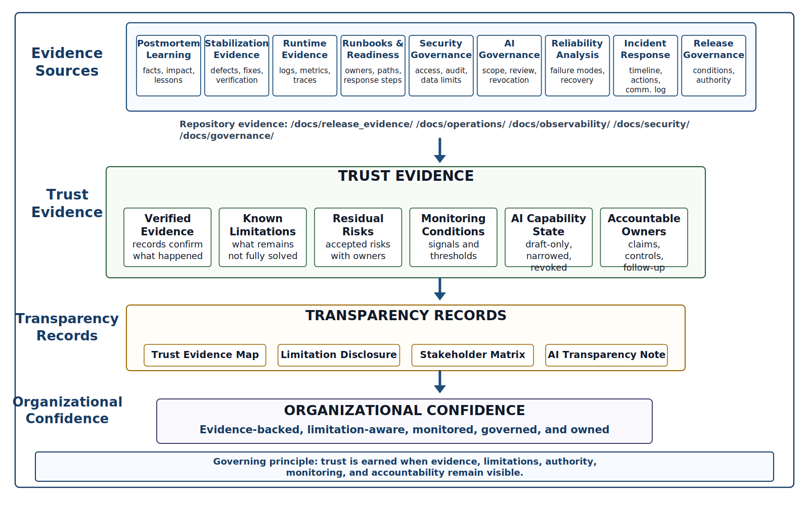
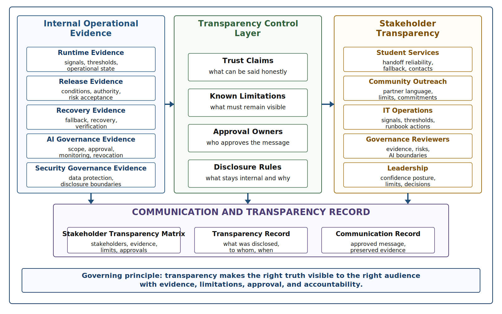
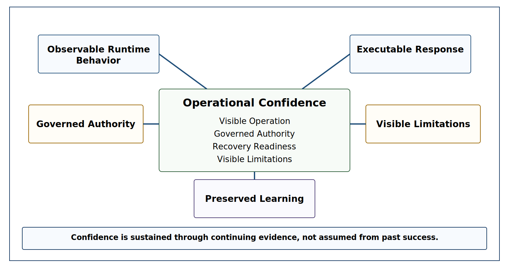
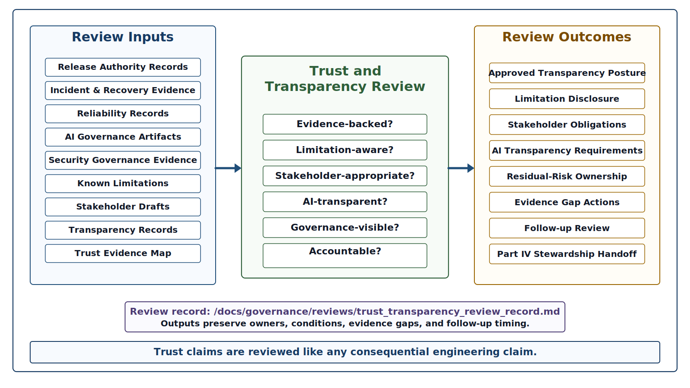

# Chapter 32 Trust, Transparency, and Organizational Confidence
---

### Chapter Governing Line

> Trust is not earned by assertion. It is earned when an organization can show what is working, what is limited, what is monitored, what is governed, what has failed, what was learned, and who remains accountable.

---

## Opening Scenario: The Release Was Governed. Trust Still Had to Be Earned.

The release decision had been made.

The trust question remained.

Lakeside Metropolitan University had not rushed COICP back into broader use after the operational incident. The team had done what a mature engineering organization should do. It had detected the routing and notification degradation, classified the incident, preserved the incident timeline, communicated with affected stakeholders, mitigated the immediate problem, verified recovery, reviewed the release options, and made a conditioned release-governance decision.

That decision was deliberately restrained. The routing patch was approved only for the existing pilot scope. The temporary manual fallback stayed in place for selected high-risk handoffs. The AI-assisted escalation recommendation remained narrowed to draft-only internal review. Pilot expansion was deferred until a defined monitoring window produced more evidence. Student Services received operational guidance. Community Outreach received a status update. The release authority owner recorded the decision, the conditions, the residual risks, and the next review date.

The repository contained the facts that made the decision reconstructable:

`/docs/release_evidence/release_governance_record.md`  
`/docs/release_evidence/release_authority_record.md`  
`/docs/release_evidence/release_conditions.md`  
`/docs/release_evidence/risk_acceptance_record.md`  
`/docs/operations/incidents/incident_record_001.md`  
`/docs/operations/incidents/recovery_evidence_record.md`

That evidence mattered. It prevented LMU from confusing relief with readiness. It kept the team from treating a quiet dashboard as approval. It made the release decision visible enough to be challenged later.

But it did not answer every question stakeholders now had.

Community Outreach wanted to know whether it could tell partner organizations that COICP was reliable again. Student Services wanted to know whether departments should depend on the platform during the next high-volume intake period. IT operations wanted to know which signals would justify escalation if latency returned. The AI governance reviewer wanted clear language explaining whether AI was making decisions. The security governance reviewer wanted to make sure transparency did not expose sensitive student-related details. The product owner wanted confidence, but not confidence theater. The release authority owner wanted the organization to be honest about the limited nature of the approval.

The question had changed.

It was no longer only, "May we release?" Chapter 31 answered that question through release governance. The question now was, "What can we responsibly say, show, limit, monitor, and own?"

That is the work of Chapter 32.

Organizational confidence is not the same as organizational optimism. It is not a leadership tone. It is not a polished announcement. It is not a dashboard screenshot or a release note with careful wording. Confidence becomes trustworthy only when it is grounded in visible evidence, honest limitations, governed authority, operational monitoring, recovery readiness, AI transparency, and accountable ownership.

LMU needed to communicate COICP's maturity honestly. That did not mean dumping the repository on stakeholders. It did not mean publishing every incident note, every log excerpt, every risk record, or every internal debate. Raw artifacts are not automatically transparency. Mature transparency means making the right operational truth visible to the right audience at the right level of detail.

The first lesson is blunt: a release decision can be governed and still not yet be trusted. Trust has to be earned in the open.

*Figure 32.1 — Trust Evidence Map*

---

## 32.1 Trust Is an Engineering Claim, Not an Organizational Mood.

Teams often talk about trust as if it were a feeling.

Stakeholders trust the team. Users trust the platform. Leadership trusts the release. Departments trust the workflow. The public trusts the institution. Those phrases are common, but they are dangerous if they are not tied to evidence. In engineering, trust cannot be treated as mood, brand, reputation, institutional tone, or stakeholder patience. Those things may influence how people feel, but they do not prove that a system is trustworthy.

Trust is an engineering claim.

Trustworthy organizations do not ask stakeholders to assume reliability, governance, or accountability. They provide enough evidence that those conclusions can be reached independently.

A trust claim says that a system can be responsibly relied upon under stated conditions, with known limits, visible controls, accountable owners, and recoverable failure paths. The phrase "under stated conditions" matters. A system may be trustworthy for one scope and not another. COICP may be trustworthy for the current pilot but not yet trustworthy for full university-wide expansion. An AI-assisted summary may be trustworthy as draft material reviewed by a human but not trustworthy as an automated routing decision. A notification workflow may be trustworthy under normal load but require manual fallback during intake surges.

Trust becomes dishonest when those conditions disappear from the claim.

If LMU says, "COICP is reliable," the statement is too broad. Reliable for whom? For which workflows? Under what load? With which AI capabilities enabled? With what monitoring? With what fallback? With what remaining limitations? With what evidence after the incident? The more consequential the system becomes, the more dangerous vague trust language becomes.

A better trust claim is more specific:

COICP is approved for continued use in the current pilot scope. The routing patch has been released under monitoring conditions. Manual fallback remains active for selected high-risk handoffs. AI-assisted escalation remains draft-only and requires human review. Queue depth, routing latency, notification delay, and escalation-review backlog are being monitored daily during the evidence window. Known limitations remain recorded and owned.

That statement is less glamorous. It is also more trustworthy.

Trust by assertion is one of the central failure patterns in this chapter. It appears when an organization says "trust us" without showing the conditions, evidence, limits, controls, and accountability that would make trust reasonable. It often sounds polished. It may even sound reassuring. But if a future reviewer cannot reconstruct why the claim was justified, the claim was not mature engineering.

A useful repository artifact for this chapter is:

`/docs/governance/trust_transparency/trust_evidence_map.md`

That file should not become a marketing artifact. It should map the claims LMU is making about COICP to the evidence that supports them. For example, a claim about routing stability should connect to release conditions, regression evidence, runtime monitoring, incident recovery evidence, and known limitations. A claim about AI-assisted escalation should connect to the AI delegation matrix, capability disposition record, context-boundary record, human-review requirement, monitoring plan, and revocation path. A claim about stakeholder readiness should connect to communication records, runbooks, ownership, and support expectations.

Another useful artifact is:

`/docs/governance/trust_transparency/organizational_confidence_record.md`

This record should preserve the confidence posture LMU is willing to defend. It should state what confidence is being claimed, what evidence supports it, what scope it applies to, what limitations remain, what monitoring is active, who owns risk, and when confidence should be reviewed again.

This is not bureaucracy. It is protection against institutional self-deception.

Trust is earned when confidence can be inspected. Trust weakens when confidence depends on memory, charisma, status, or optimism.

A trustworthy engineering organization does not merely say the system is ready. It can explain why the system is reasonably dependable for a defined purpose, what remains uncertain, what will be watched, and what will happen if the evidence changes.

Confidence becomes trustworthy only when it remains connected to evidence.

That distinction prepares the central concept of the chapter: transparency.

---

## 32.2 Transparency Means Making the Right Truth Visible.

Transparency is often misunderstood.

Some teams think transparency means sharing everything. They publish long reports, dashboards, logs, tables, review notes, and status documents until stakeholders drown in detail. Other teams treat transparency as carefully managed reassurance. They share positive summaries, hide limitations, and avoid uncomfortable facts because they fear that honesty will reduce confidence. Both patterns are weak.

Transparency is not artifact dumping. Transparency is not institutional self-protection. Transparency is the disciplined act of making the right truth visible to the right audience so that people can understand the system's real state, limits, risks, controls, and responsibilities. The goal is not maximum disclosure. The goal is sufficient understanding for responsible action.

For COICP, different audiences need different levels of transparency.

Student Services needs to know whether request handoffs can be relied on during operational surges, what fallback exists, and whom to contact when handoff patterns look abnormal. Community Outreach needs language it can use with partners without overstating system maturity. IT operations needs the runtime signals, thresholds, escalation criteria, and runbook links. The AI governance reviewer needs evidence of AI boundary control, context freshness, human approval, monitoring, and revocation. Security governance needs to know what can be disclosed without exposing student-related data or internal controls. Leadership needs a truthful confidence posture, not a polished headline.

A single message cannot serve all of those needs well.

That is why Chapter 32 should introduce:

`/docs/governance/trust_transparency/stakeholder_transparency_matrix.md`

The matrix should identify stakeholder groups, what they need to know, what evidence supports the message, what limitations must be disclosed, what details should remain internal for security or privacy reasons, who approves the message, and where the communication record is preserved.

This matrix is not a communications trick. It is an engineering artifact because it controls how operational truth moves through the organization. Bad transparency can create operational harm. Saying too little can produce false confidence. Saying too much can expose sensitive data, overwhelm stakeholders, or create confusion. Saying the wrong thing can misrepresent the system state. Saying something unsupported by evidence can become trust by assertion.

A related artifact is:

`/docs/governance/trust_transparency/transparency_record.md`

This record should preserve what LMU disclosed, to whom, when, based on what evidence, with what limitations, and under whose approval. It should connect to communication records such as:

`/docs/communications/stakeholder_release_update.md`

The point is not to turn the manuscript into a communications manual. The point is that in trustworthy engineering, communication is part of the system's operational control surface. Stakeholders act based on what they are told. Departments staff based on what they expect. Users rely on workflows based on what they believe is true. Review boards judge maturity based on what the organization can show. If communication is unsupported, vague, or overconfident, it can create operational risk just as surely as a weak test or missing runbook.

Good transparency has three properties.

First, it is evidence-backed. It does not say COICP is stable merely because the team feels better. It links stability claims to release conditions, runtime monitoring, recovery evidence, and known limitations.

Second, it is limitation-aware. It does not hide the fact that AI-assisted escalation remains draft-only or that pilot expansion has been deferred. It explains those limits as mature controls, not embarrassments.

Third, it is audience-appropriate. It gives stakeholders enough truth to act responsibly without forcing them to interpret raw engineering evidence beyond their role.

Transparency is therefore a translation discipline. It translates operational evidence into accountable organizational understanding.

*Figure 32.2 — Transparency and Limitation Disclosure*

---

## 32.3 Honest Limitation Disclosure Protects Trust.

Limitations are often treated as threats to confidence.

That instinct is understandable. Teams work hard to build systems. Leaders want momentum. Stakeholders want assurance. Students and community partners want services to work. After an incident, everyone wants the next message to be positive. In that environment, limitations can feel like weakness.

They are not weakness.

Honest limitation disclosure is one of the strongest signals of engineering maturity. Organizations often fear that limitations weaken confidence. In practice, undisclosed limitations usually damage confidence far more when they are eventually discovered. It tells stakeholders that the organization knows the difference between what is working, what is controlled, what is still uncertain, and what should not yet be promised. It protects trust by preventing surprise. It protects engineers by making risk visible. It protects leadership by preventing confidence from outrunning evidence.

COICP's limitations after Chapter 31 are not signs that the system has failed. They are signs that LMU is governing the system responsibly. The pilot remains constrained because operational evidence is still being collected. Manual fallback remains available because recovery should not depend on optimism. AI-assisted escalation remains draft-only because capability is not the same as authority. Monitoring remains active because recent incident evidence changed the risk posture. Known limitations remain visible because hiding them would make future confidence dishonest.

A useful artifact is:

`/docs/governance/trust_transparency/limitation_disclosure_record.md`

This record should state the limitation, the reason it exists, the evidence behind it, the stakeholder impact, the current mitigation, the owner, the review date, and the condition that would allow the limitation to be revised. It should link where appropriate to:

`/docs/release_evidence/known_limitations.md`  
`/docs/release_evidence/risk_acceptance_record.md`  
`/docs/operations/reliability/failure_mode_register.md`

The limitation disclosure record should avoid two weak patterns.

The first is limitation burial. That happens when the limitation exists somewhere in a document but is surrounded by enough positive language that no one notices it. The organization can later claim it disclosed the limitation, but stakeholders were not realistically informed.

The second is limitation dramatization. That happens when every remaining risk is described in a way that makes the system sound unstable or unusable. That is not maturity either. Mature limitation disclosure is accurate, proportional, and tied to control.

For example, LMU should not say, "COICP is fully reliable after the release." That is overclaiming. It should also not say, "COICP may still fail unpredictably." That is too vague to be useful. A better statement is:

The current pilot remains approved under monitored conditions. Routing latency and notification delay have returned to acceptable levels after the patch, but pilot expansion is deferred until the two-week evidence window confirms stable behavior during higher intake volume. Manual fallback remains available for high-risk handoffs.

That statement is honest, specific, and operationally useful.

AI-related limitations require special care. If COICP uses AI-assisted summaries or escalation recommendations, LMU must be clear about whether AI is drafting, recommending, ranking, routing, notifying, or acting. Those distinctions are not cosmetic. A stakeholder may accept AI-drafted text that a human reviews. The same stakeholder may not accept AI-initiated routing changes without approval. The trust claim depends on the authority boundary.

This is why honest limitation disclosure strengthens trust. It shows that the organization is not asking stakeholders to believe a vague claim. It is showing them how the system is bounded, governed, monitored, and improved.

A trustworthy team does not hide limitations to preserve confidence. It discloses limitations so confidence has a place to stand.

---

## 32.4 AI Transparency Requires Boundaries, Oversight, and Revocability.

AI is not the center of Chapter 32, but it cannot be treated as a footnote.

By this point in the book, COICP has used AI in bounded ways: drafting summaries, assisting classification, suggesting escalation language, helping reviewers organize information, and supporting operational analysis. Earlier chapters established the controlling doctrine. AI proposes; engineers verify. Context is control. The model is not the system. Governance is architecture. Everything important leaves evidence.

Chapter 32 asks what those principles mean when LMU communicates trust.

AI transparency does not mean providing a vague statement that "AI is used responsibly." Stakeholders do not need marketing language about AI. They need to understand what authority AI possesses, what authority it does not possess, and how human accountability is preserved. It does not mean naming a model, publishing a policy, or adding a disclosure sentence that stakeholders do not understand. It means making the operational role of AI clear enough that affected people can understand what AI does, what it does not do, where humans remain responsible, what evidence supports the use, what failure modes remain, and what controls exist.

For COICP, the difference between AI assistance and AI authority is critical.

If AI drafts a priority summary for a human reviewer, that is one trust claim. If AI recommends escalation but cannot send the escalation without approval, that is another. If AI can route requests automatically, that is a much stronger claim and requires much stronger governance. If AI can notify departments, modify records, or trigger workflows, the trust burden rises again.

Chapter 32 should reinforce the risk-based delegation posture from earlier chapters. The acceptable level of AI delegation depends on operational impact, authority scope, integration depth, recoverability, observability, security/privacy implications, and stakeholder consequence. The more an AI capability can affect state, workflow, data, or people, the more visible the controls must become.

Relevant repository evidence includes:

`/docs/governance/ai_governance/ai_delegation_matrix.md`  
`/docs/governance/ai_governance/ai_capability_disposition_record.md`  
`/docs/governance/ai_governance/ai_context_boundary_record.md`  
`/docs/governance/ai_governance/ai_revocation_plan.md`  
`/docs/governance/trust_transparency/ai_transparency_note.md`

The AI transparency note should not be promotional. It should answer practical questions:

What AI capability is active? What is disabled? What is draft-only? What requires human approval? What context sources does the AI use? What context is prohibited? What monitoring exists? What failure modes were observed or anticipated? What revocation path exists? Who owns the outcome?

This kind of transparency avoids two weak extremes.

The first extreme is hiding AI use. Hiding AI involvement may reduce immediate stakeholder questions, but it creates long-term trust risk. If stakeholders later learn that AI influenced summaries, prioritization, escalation language, or operational analysis without clear disclosure, confidence can collapse.

The second extreme is overclaiming AI capability. This happens when the organization uses AI language to imply maturity that has not been earned. Phrases like "AI-powered coordination" or "intelligent escalation" can sound impressive while hiding the more important engineering questions: What is the authority boundary? What evidence supports the recommendation? Who approves it? What happens when the context is stale? Can the capability be revoked?

Trustworthy AI transparency is sober. It does not apologize for using AI where AI is useful. It does not glamorize AI where governance is the real achievement. It makes AI understandable as part of a larger engineered system.

The right message is not, "AI makes COICP trustworthy." The right message is, "COICP uses AI only within defined boundaries, under human review, with monitored context, recorded decisions, and revocation paths."

That is the difference between AI trust and AI theater.

---

## 32.5 Operational Evidence Becomes the Confidence Surface.

No single artifact proves that COICP is trustworthy.

Trustworthiness emerges from convergence. Independent evidence sources reinforce one another until the organization's claims become increasingly defensible.

A passing test does not prove operational maturity. A runbook does not prove recovery. An incident record does not prove learning. A release approval does not prove confidence. A dashboard does not prove understanding. An AI governance record does not prove safe delegation by itself. Trust emerges when these artifacts converge into a visible pattern of disciplined operation.

Part III has been building that pattern since Chapter 23.

The postmortem records showed that LMU could learn from operational facts rather than hide embarrassment. The stabilization records showed that recurring defects could be analyzed and reduced. The observability evidence showed that runtime behavior could be inspected rather than guessed. The runbooks showed that response could be executed rather than improvised. The security governance records showed that data, access, roles, and authority remained protected. The AI governance artifacts showed that delegation was bounded, monitored, and revocable. The reliability records showed that failure modes and degradation paths were anticipated. The incident records showed that LMU could act under pressure while preserving evidence. The release governance records showed that operational evidence could become accountable authority.

Chapter 32 synthesizes all of this.

The confidence surface is the evidence that allows LMU to say what it can responsibly say about COICP. That surface may include:

`/docs/operations/postmortems/`  
`/docs/operations/stabilization/`  
`/docs/observability/runtime_evidence_index.md`  
`/docs/operations/runbooks/`  
`/docs/security/security_governance_review_record.md`  
`/docs/governance/ai_governance/`  
`/docs/operations/reliability/`  
`/docs/operations/incidents/`  
`/docs/release_evidence/`  
`/docs/governance/trust_transparency/trust_evidence_map.md`

The chapter should mention these paths where they clarify the evidence chain, but it must not become a directory tour. The point is not that a trustworthy organization has many folders. The point is that a trustworthy organization preserves the right kinds of evidence and can use that evidence to explain operational truth.

For COICP, the confidence claim might rest on several evidence categories.

First, runtime behavior is observable. Request IDs, queue-depth metrics, routing-latency measures, notification-delay signals, escalation-review backlog, and audit events allow the team to see whether the system remains within expected operating conditions.

Second, response is executable. Runbooks define who acts, what signals matter, what fallback exists, when to escalate, how to communicate, and how recovery is verified.

Third, authority is governed. Release decisions, AI capability disposition, security boundaries, and residual risk ownership are recorded and reviewable.

Fourth, limitations are visible. Pilot scope, AI authority limits, manual fallback, monitoring windows, deferred expansion, and known failure modes are not hidden.

Fifth, learning is preserved. Incidents, postmortems, stabilization actions, reliability findings, and follow-up reviews do not disappear after symptoms improve.

Together, these categories create operational confidence.

The word "confidence" should not be confused with certainty. Trustworthy engineering rarely provides certainty. It provides reasoned confidence under stated conditions. COICP can be trusted for its approved operating scope because LMU can show what is true, what is limited, what is monitored, what can be recovered, and who is accountable.

*Figure 32.3 — Operational Confidence Model*

---

## 32.6 Governance Builds Confidence When Authority Is Visible.

Governance is often invisible to stakeholders until it fails.

When governance works, approvals happen, risks are owned, controls are followed, exceptions are reviewed, and authority stays inside defined boundaries. When governance fails, people discover too late that no one knew who could approve, who could override, who could re-enable an AI capability, who could accept residual risk, who could communicate externally, or who could declare recovery.

Chapter 32 should make a stronger claim: governance builds confidence when authority is visible.

Visible authority does not mean every decision is public. It means consequential decisions remain reconstructable.

This does not mean every stakeholder sees every internal governance record. It means the organization can explain the authority structure behind its trust claims. If LMU says COICP is approved for the current pilot, it should be able to show who approved that scope, what evidence was reviewed, what conditions apply, and who owns residual risk. If LMU says AI-assisted escalation remains draft-only, it should be able to show who made that decision, what evidence supported it, how the limitation is enforced, and when the decision will be reviewed again.

Relevant records include:

`/docs/governance/reviews/operational_release_governance_review_record.md`  
`/docs/governance/reviews/trust_transparency_review_record.md`  
`/docs/release_evidence/release_authority_record.md`  
`/docs/release_evidence/risk_acceptance_record.md`  
`/docs/operations/ownership/operational_owner_matrix.md`

These artifacts matter because trust collapses quickly when authority is vague. Authority fog is especially dangerous after incidents. Many people may have opinions about the system's status. Product owners may want progress. Operations may want caution. Governance reviewers may want stronger evidence. Stakeholders may want assurance. If authority is not visible, confidence becomes political negotiation rather than engineering judgment.

The operational owner matrix should identify who owns runtime operation, who owns stakeholder communication, who owns AI capability disposition, who owns security review, who owns release authority, and who owns residual risk. This is not about blame. It is about reconstructability. When something consequential is claimed or approved, the organization should know who had authority and what evidence they relied on.

Governance visibility also protects AI transparency. If an AI capability is narrowed, disabled, or re-enabled, the decision should not be hidden in an implementation detail or informal meeting note. AI capability disposition is an authority decision. It changes what the system may do, what humans must review, what stakeholders may rely on, and what failure modes must be monitored.

Governance builds confidence by making trust claims challengeable. If a claim cannot be challenged, it cannot be trusted deeply. A trustworthy organization can survive challenge because its evidence, conditions, decisions, and owners are visible.

This is the opposite of approval theater. Approval theater says yes because the organization wants to move forward. Mature governance says yes, no, not yet, only under these conditions, only for this scope, or only after this evidence window, and it leaves a record.

By Chapter 32, the reader should understand that governance is not the enemy of trust. Governance is one of the ways trust becomes real.

---

## 32.7 Communication Is Part of Operational Trust.

Communication is often treated as something that happens after engineering work is done.

That is a mistake.

In operational systems, communication is part of the engineering system because people act on the messages they receive. A department may staff differently because COICP is described as stable. A partner organization may rely on a routing workflow because an update says delays have been resolved. A student-services team may stop using manual fallback because a release note sounds final. A governance reviewer may assume AI remains disabled unless the capability disposition is clearly communicated.

Communication changes behavior. Because communication influences operational decisions, inaccurate communication becomes an operational risk. Therefore, communication must be evidence-backed.

For COICP, a stakeholder release update should not be a generic announcement. It should state the current operating status, the approved scope, the monitored conditions, the relevant limitations, the escalation path, and the next review point. It should not expose private incident details or raw student-related records. It should not overstate stability. It should not bury the fact that pilot expansion is deferred. It should not describe AI-assisted escalation in vague promotional language.

Useful records include:

`/docs/communications/stakeholder_release_update.md`  
`/docs/communications/operational_status_update.md`  
`/docs/governance/trust_transparency/stakeholder_transparency_matrix.md`  
`/docs/operations/incidents/incident_communications_log.md`

The manuscript should make clear that communication has its own engineering discipline.

First, communication must distinguish facts from interpretation. "Routing latency returned to acceptable levels during the recovery window" is a fact if supported by runtime evidence. "The system is now fixed" is an interpretation that may be too broad.

Second, communication must distinguish current state from future expectation. "The patch is approved for the current pilot" is different from "the system is ready for expansion."

Third, communication must distinguish AI assistance from AI authority. "AI drafts internal escalation summaries for human review" is different from "AI prioritizes cases."

Fourth, communication must include limitation language where stakeholders need it to make responsible decisions.

Fifth, communication must preserve ownership. Stakeholders should know where to report anomalies, who owns follow-up, and when the next review occurs.

This does not make engineering communication cold or legalistic. Good operational communication is clear, truthful, proportionate, and usable. It reduces ambiguity. It prevents rumor. It avoids overconfidence. It treats stakeholders as participants in operational trust rather than audiences for reassurance.

A strong Chapter 32 message is that communication is not public relations when it is grounded in evidence. It is part of operational accountability.

---

## 32.8 The Trust and Transparency Review

By this point in the book, the reader has seen many review mechanisms.

Requirements were reviewed before they became downstream commitments. Architecture was reviewed before structural decisions hardened. AI-assisted work was reviewed before generated artifacts became accepted engineering work. Tests were reviewed before release claims were defended. Release readiness was reviewed before deployment. Postmortems, stabilization, observability, runbooks, security, AI delegation, reliability, incident response, and release governance each had review mechanisms because each lifecycle transition created consequence.

Chapter 32 introduces the Trust and Transparency Review.

The purpose of this review is to challenge whether LMU's trust claims about COICP are evidence-backed, limitation-aware, stakeholder-appropriate, AI-transparent, governance-visible, and accountable.

The review should not ask, "Do we feel confident?" It should ask, "What confidence claim are we making, what evidence supports it, what limitations remain, what stakeholders need to know, what must not be disclosed broadly, who owns residual risk, and what would cause the claim to be revised?"

A review record should live at:

`/docs/governance/reviews/trust_transparency_review_record.md`

Related trust transparency artifacts include:

`/docs/governance/trust_transparency/trust_evidence_map.md`  
`/docs/governance/trust_transparency/transparency_record.md`  
`/docs/governance/trust_transparency/limitation_disclosure_record.md`  
`/docs/governance/trust_transparency/organizational_confidence_record.md`  
`/docs/governance/trust_transparency/ai_transparency_note.md`

The review should examine several evidence inputs.

It should examine release authority records to determine what LMU actually approved and under what conditions. It should examine known limitations and risk acceptance records to determine what remains constrained. It should examine incident and recovery evidence to determine what happened and what changed. It should examine reliability evidence to determine whether the system's failure modes are understood. It should examine AI governance records to determine whether AI capabilities are accurately described. It should examine security governance records to ensure transparency does not expose protected information. It should examine stakeholder communication drafts to determine whether messages are clear, truthful, and usable.

The review board should ask direct questions:

What trust claim is LMU making?  
What evidence supports the claim?  
What is the approved operating scope?  
What limitations remain?  
Which limitations must stakeholders know?  
Which details should remain internal for privacy or security reasons?  
What AI capabilities are active, narrowed, disabled, or monitored?  
Where is human approval required?  
What operational signals are being watched?  
What would cause confidence to be revised?  
Who owns residual risk?  
When will the claim be reviewed again?

The output of the review is not merely approval of language. It is a governed transparency posture. The review may approve a stakeholder update, require clearer limitation disclosure, reject overbroad AI language, require an evidence gap to be closed, assign an owner to residual risk, or schedule a follow-up confidence review after the monitoring window.

This review is the Part III capstone review mechanism. It converts operational maturity into reviewable organizational trust.

*Figure 32.4 — Trust and Transparency Review Gate*

---

## 32.9 Failure Patterns: Trust by Assertion and Transparency Theater

Chapter 32 must be explicit about failure patterns because trust language can become slippery.

The primary anti-pattern is trust by assertion. It appears when an organization claims a system is trustworthy without providing sufficient evidence, boundaries, limitations, monitoring, governance, and accountability. Trust by assertion often sounds confident. It may come from good intentions. It may be motivated by stakeholder pressure, leadership optimism, or desire to recover momentum after an incident. But it replaces evidence with language.

A related anti-pattern is transparency theater. Transparency theater appears when an organization performs openness without making operational truth usable. It may publish a long report nobody can interpret. It may share dashboards without explaining what they mean. It may disclose limitations in a way that technically satisfies a requirement but fails to inform stakeholders. It may provide AI-use statements so vague that no one can tell what AI actually does.

Hiding limitations is another failure pattern. It appears when known constraints are omitted, buried, softened, or delayed because the organization fears that honesty will reduce confidence. In reality, hidden limitations create the conditions for future trust collapse.

Overclaiming AI capability is especially tempting. AI language can make a system sound mature, modern, and intelligent. But if the organization says AI is improving coordination without explaining that recommendations are draft-only, human-reviewed, monitored, and revocable, the claim is misleading. If the AI capability is still limited because of context freshness or review workload, that limitation should be visible where it matters.

Dashboard theater is another risk. Dashboards can support transparency, but they can also create false confidence. A dashboard that shows green status without explaining thresholds, evidence windows, known limitations, or degraded-but-acceptable conditions may reassure without informing.

Raw artifact dumping is the opposite failure. It appears when teams equate transparency with overwhelming stakeholders. Providing a folder full of records is not transparency if stakeholders cannot tell what the records mean, which claims they support, or what actions they should take.

Confidence laundering is subtler. It happens when uncertain evidence passes through polished language until it sounds stronger than it is. A limited pilot becomes "successful rollout." A monitored patch becomes "resolved." A draft-only AI recommendation becomes "AI-assisted escalation." A deferred expansion becomes "phased deployment." These phrases may not be false, but they can hide the real operational state.

Trustworthy engineering counters these patterns with disciplined transparency.

State the claim. Show the evidence. Name the limitation. Identify the audience. Preserve the record. Assign ownership. Define follow-up. Make confidence reviewable.

That pattern is the practical corrective to trust by assertion.

---

## 32.10 Exercises

### Exercise 1: Build a Trust Evidence Map

Create the repository artifact:

`/docs/governance/trust_transparency/trust_evidence_map.md`

Select three trust claims about COICP.

Examples may include:

- The system is operationally reliable.
- AI-assisted recommendations remain under human authority.
- Stakeholders are informed of important limitations.

For each claim, identify:

- Supporting evidence
- Responsible owners
- Relevant reviews
- Known limitations
- Monitoring evidence
- Conditions under which the claim would no longer be valid

Explain why trust claims must remain traceable to evidence.

### Exercise 2: Create a Limitation Disclosure Record

Create the repository artifact:

`/docs/governance/trust_transparency/limitation_disclosure_record.md`

Document one significant COICP limitation.

The record must include:

- Limitation description
- Reason the limitation exists
- Affected stakeholders
- Current mitigation
- Responsible owner
- Monitoring approach
- Evidence required for revision or removal

Explain why limitation disclosure strengthens organizational trust.

### Exercise 3: Translate Governance Decisions into Transparency Language

Using a Chapter 31 release-governance decision, prepare transparency communications for two audiences:

- IT Operations
- Community Outreach

Create:

`/docs/governance/trust_transparency/stakeholder_transparency_communications.md`

Each communication must:

- State supported facts
- Identify relevant limitations
- Avoid unsupported claims
- Explain stakeholder impact
- Preserve accountability

Explain how audience needs affect transparency.

### Exercise 4: Review an AI Transparency Note

Create:

`/docs/governance/trust_transparency/ai_transparency_note.md`

Evaluate whether the note adequately explains:

- AI role
- Authority boundary
- Human approval requirements
- Monitoring approach
- Known limitations
- Failure modes
- Revocation path

Identify missing information, unsupported claims, and areas requiring revision.

Explain why transparency differs from marketing.

### Exercise 5: Build a Stakeholder Transparency Matrix

Create the repository artifact:

`/docs/governance/trust_transparency/stakeholder_transparency_matrix.md`

For each stakeholder group, identify:

- Information needs
- Supporting evidence
- Relevant limitations
- Communication frequency
- Responsible owner
- Information that should remain restricted for security, privacy, or governance reasons

Explain how transparency and confidentiality can coexist.

### Exercise 6: Conduct a Trust and Transparency Review

Perform a Trust and Transparency Review using:

`/docs/governance/reviews/trust_transparency_review_record.md`

Evaluate whether organizational communications are adequate in the areas of:

- Evidence alignment
- Limitation disclosure
- AI transparency
- Stakeholder communication
- Accountability
- Governance consistency
- Monitoring transparency

For each area, determine whether performance is:

- Acceptable
- Conditionally acceptable
- Unacceptable

Document:

- Corrective actions
- Owner assignments
- Evidence gaps
- Communication obligations
- Follow-up reviews

### Exercise 7: Challenge an Organizational Confidence Statement

Review a statement such as:

> COICP is fully reliable and ready for broad deployment.

Determine whether the statement should be:

- Approved
- Revised
- Constrained
- Rejected

Identify:

- Supported claims
- Unsupported claims
- Missing limitations
- Missing evidence
- Missing ownership

Rewrite the statement so that it accurately reflects available evidence.

Explain why confidence without evidence can weaken trust.

These exercises should be designed as engineering reasoning work, not memorization. They should require students to produce repository-ready artifacts, connect trust claims to evidence, defend transparency decisions, and demonstrate accountability for organizational confidence.

---

## 32.11 Trustworthiness Mapping

Chapter 32 strengthens several trustworthiness pillars at once because it is the Part III capstone.

The primary pillars are accountability, operational visibility, human oversight, and governability.

Accountability is central because trust claims require named owners. If LMU says COICP is approved for a defined operating scope, someone owns that claim. If limitations remain, someone owns follow-up. If AI-assisted escalation remains draft-only, someone owns that boundary. If stakeholders are told the system is monitored, someone owns the monitoring and escalation response.

Operational visibility is central because stakeholders need a truthful view of system state. They do not need every internal artifact, but they do need enough visibility to understand what works, what is limited, what is monitored, and what to do when conditions change.

Human oversight is central because AI-related trust depends on meaningful human control. Stakeholders should not have to guess whether AI is drafting, recommending, deciding, routing, notifying, or acting. Human approval, review, override, and revocation must be clear where they affect trust.

Governability is central because authority, approval, limitation, release, rollback, AI capability disposition, communication, and residual risk all require visible control.

Secondary pillars include traceability, reviewability, observability, recoverability, security/privacy, and correctness.

Traceability appears because trust claims must link to evidence. Reviewability appears because confidence must be challengeable. Observability appears because runtime behavior supports or weakens claims. Recoverability appears because stakeholders trust systems more when failure can be contained and corrected. Security/privacy appears because transparency must not expose protected information. Correctness remains present because no transparency practice can compensate for behavior that does not meet validated intent.

Chapter 32 also prevents checklist theater. It does not say a system is trustworthy because it has a transparency record, a dashboard, an AI note, or a review document. Those artifacts matter only when they support real judgment. The chapter should repeatedly emphasize that trustworthiness is cumulative and evidence-backed. A system may be functional without being governable. It may be observable without being recoverable. It may have AI disclosures without meaningful oversight. It may have communication without transparency.

Trustworthiness emerges when the evidence chain holds together.

---

## 32.12 From Operational Trust to Stewardship

Part III began with a simple but demanding claim: release defense is not operational proof.

Chapter 23 showed that operational surprise must become learning. Chapter 24 showed that recurring defects must become stabilization work. Chapter 25 showed that live behavior must become runtime evidence. Chapter 26 showed that evidence must become executable runbooks. Chapter 27 showed that operation must protect data, identity, access, and authority. Chapter 28 showed that AI delegation must be bounded, monitored, revocable, and human-owned. Chapter 29 showed that reliability requires failure-mode reasoning. Chapter 30 showed that incidents require disciplined action under pressure. Chapter 31 showed that release authority after operational learning must be governed. Chapter 32 now shows that organizational confidence must be earned through transparency.

The reader has moved from release evidence defender to operational trust defender.

That movement matters because the next part of the book raises the stakes. Part IV will not merely ask whether COICP can be operated responsibly in its current form. It will ask how trustworthy engineers govern intelligent systems as AI becomes more agentic, more context-dependent, more embedded in enterprise workflows, and more capable of taking action.

Agentic workflows will require trust evidence. Enterprise AI context will require transparency about sources, freshness, authority, and boundaries. Mature human oversight will require visible control that does not collapse under cognitive load. Understandability will require systems that humans can explain, review, and govern. Operational repositories will become the memory that both humans and AI-assisted tools depend on. Stewardship will require long-term accountability for systems that continue to evolve.

Chapter 32 therefore closes Part III and opens the door to Part IV.

The closing lesson is not that COICP is perfect. It is that LMU has learned how to make trust reviewable. It can say what works. It can say what remains limited. It can show what is monitored. It can explain how AI is bounded. It can preserve incident learning. It can govern release authority. It can communicate honestly. It can name owners. It can revise confidence when evidence changes.

That is what operational trust looks like when it becomes organizational confidence.

Confidence remains trustworthy only as long as it remains connected to evidence, limitations, ownership, and review.

A trustworthy organization does not ask people to believe harder. It shows enough truth to deserve belief.

Part III therefore closes with a simple conclusion:

Trust is not preserved by optimism.

Trust is preserved by evidence, transparency, accountability, and stewardship.

Part IV begins by asking how those responsibilities endure as intelligent systems become more capable, more connected, and more consequential.
