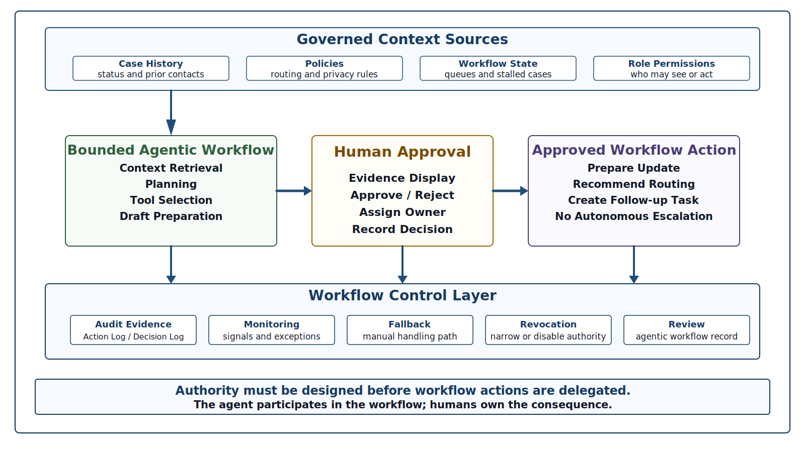
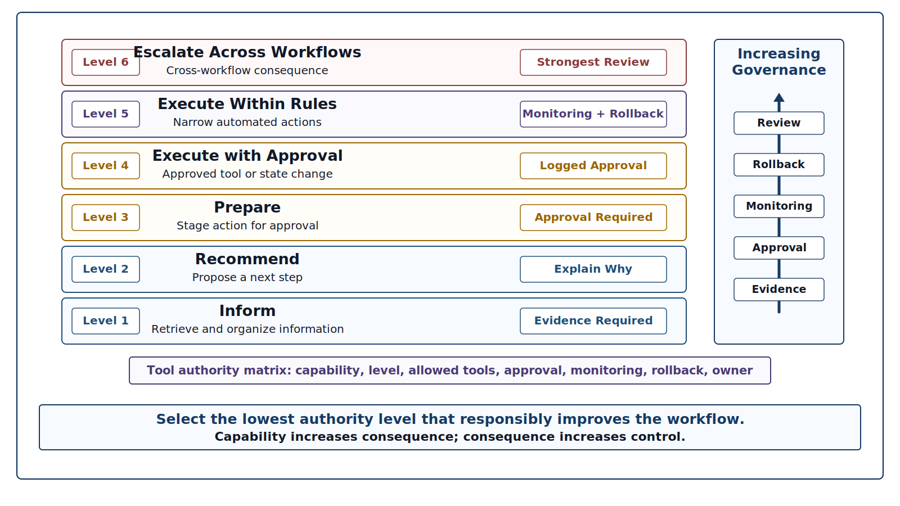
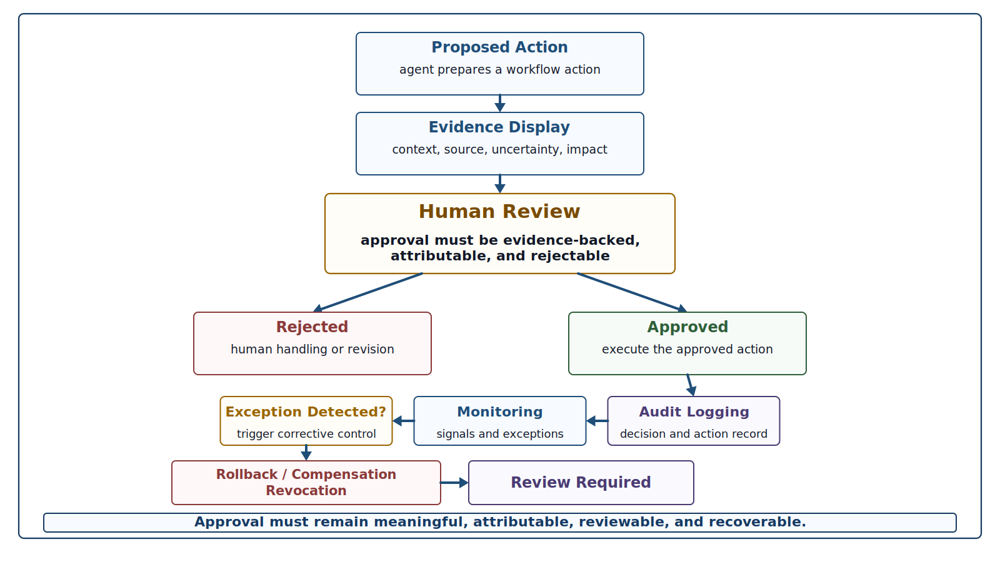
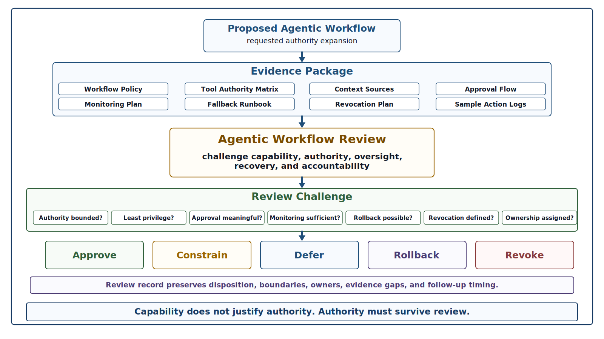

# Chapter 33 Agentic Systems and Workflow Orchestration
---

### Chapter Governing Line

> Capability is not authority.

---

## Opening Scenario: When Assistance Starts to Act

The Student Support Office had a practical request.

After several months of operating the Campus Operations and Incident Coordination Platform (COICP), staff members were spending significant time on routine follow-up work. They checked whether community partners had responded, assembled case histories before supervisor reviews, prepared status updates for students, and identified cases that appeared stalled between offices.

The question seemed reasonable.

Could an AI workflow agent watch for stalled cases, gather relevant evidence, draft updates, prepare routing recommendations, and, when confidence was high enough, move a case to the next queue?

The proposal was not foolish. In fact, it was exactly the kind of operational improvement a mature organization should consider.

By this point, Lakeside Metropolitan University had already learned difficult lessons about operational trust. COICP was no longer a release candidate defended in a conference room. It was a live institutional system. It had postmortem records, stabilization evidence, runtime signals, runbooks, security boundaries, controlled AI delegation, reliability analysis, incident-response discipline, release-governance authority, and transparency records that allowed responsible people to say what was working, what remained limited, and who owned the remaining risk.

A bounded agentic workflow appeared to fit naturally into that environment. COICP already had logs, status histories, role permissions, runbooks, release-governance records, and transparency obligations. An intelligent workflow actor could reduce delay, improve consistency, and help staff focus on judgment rather than repetitive coordination.

But the review board did not ask, "Can the model do it?"

That was the wrong question.

The board asked:

- What would the system be allowed to see?
- What would it be allowed to infer?
- What would it be allowed to prepare?
- What would it be allowed to trigger?
- What would it be allowed to change?
- What would it be allowed to notify?
- What would it be allowed to escalate?
- What evidence would remain after an action occurred?

The discussion quickly became more difficult.

How would an agent distinguish a routine delay from a policy-sensitive exception? What would happen if it prepared the right message for the wrong stakeholder? What if it moved a case forward before a human reviewed a privacy-sensitive note? Could an action be reversed? Who would know it happened? Who would own the consequence?

That is the point where AI assistance becomes workflow authority.

Chapter 33 begins Part IV at that boundary. Agentic systems are not magical assistants, autonomous workers, or chatbot upgrades. They are controlled workflow actors operating inside sociotechnical systems. Once an intelligent system can plan steps, call tools, prepare actions, coordinate records, or change system state, the engineering problem changes.

The issue is no longer only whether the output is plausible.

The issue is whether authority has been designed, bounded, observed, reviewed, recoverable, and human-owned.

Part III taught that a demo is not operational proof.

Chapter 33 extends that lesson:

**Capability is not authority.**

A system that can act must be engineered as an accountable workflow participant, not celebrated as an autonomous hero.

---

## 33.1 From AI Assistance to Workflow Authority

The first wave of AI assistance in software and enterprise systems was easy to describe because the boundary was visible. A person asked for help. A model produced text, code, a summary, a classification, or a recommendation. A human accepted, revised, rejected, tested, or ignored the result. The model proposed; engineers and accountable staff verified.

Agentic systems blur that boundary. They do not merely answer. They can plan. They can select tools. They can chain steps. They can retrieve context. They can inspect system state. They can prepare a transaction. They can trigger a notification. They can monitor a condition and attempt a follow-up. In some configurations, they can change records or coordinate actions across systems.

That shift is not merely technical. It is institutional. An agentic workflow introduces questions of authority, timing, evidence, privacy, accountability, and recovery. The organization is no longer asking whether AI can generate a useful artifact. It is asking whether AI may participate in work.

The distinction matters because many failures in intelligent systems do not begin with obviously bad answers. They begin with reasonable-looking outputs used in the wrong place, at the wrong time, with the wrong authority. A suggested routing action is different from an approved routing action. A prepared email is different from a sent email. A retrieved policy excerpt is different from a policy decision. A draft escalation note is different from an escalation. A workflow recommendation is different from a state change.

The central movement of Chapter 33 is therefore from output quality to workflow authority. Output quality still matters. Correctness, traceability, evaluation, and testing remain essential. But as AI moves into orchestrated workflows, the trustworthiness question becomes larger than output quality alone. What actions can the system initiate? What evidence supports those actions? What human control exists? What happens when the action is wrong?

A useful way to reason about the shift is to imagine a ladder of authority. At the lowest level, an AI system summarizes information for a human. At the next level, it recommends an action. Then it prepares an action for approval. Then it performs an approved tool call. Then it performs bounded state changes inside predefined rules. At the highest level, it initiates actions with limited supervision. Each rung increases consequence. Each rung therefore requires stronger evidence, stronger control, stronger monitoring, and stronger human accountability.

This is why Part IV cannot begin with agent excitement. It must begin with authority design. The trustworthy engineer does not ask only what an agent can do. The trustworthy engineer asks what an agent should be allowed to do, under what evidence, with what review, with what limits, and with what recovery path.

Repository evidence should appear as soon as agentic workflow authority is proposed. A team that cannot point to a controlled authority model is not ready to discuss autonomous action. For COICP, early evidence might belong under `/docs/governance/agentic_workflows/agentic_workflow_policy.md`, `/docs/governance/agentic_workflows/tool_authority_matrix.md`, and `/docs/governance/agentic_workflows/action_approval_flow.md`. These files are not decorative. They are the first signs that the organization understands agentic capability as governed workflow authority rather than as a feature demo.

*Figure 33.1 — Agentic Workflow Orchestration Map*

---

## 33.2 What Makes a System Agentic

The word agentic is often used loosely. In some conversations it means a chatbot with a more confident tone. In others it means a model connected to tools. In marketing material it can mean almost anything that sounds autonomous. For engineers, vague definitions are not sufficient. The consequences of authority, action, accountability, oversight, and failure require a more disciplined understanding of what agentic behavior actually means.

In this chapter, an agentic system is an intelligent system that can pursue a goal across multiple steps by using context, selecting actions, invoking tools or services, monitoring results, and adapting its next step within a bounded workflow. The system may still require human approval. It may operate only in narrow circumstances. It may never be allowed to perform an irreversible action. But it differs from ordinary assistance because it participates in the sequence of work rather than merely producing a single response.

Several characteristics distinguish agentic behavior.

First, the system has a goal or task objective that persists beyond one prompt-response exchange. In COICP, the objective might be to prepare a complete supervisor review packet for a stalled outreach case. That requires gathering status history, checking the current queue, identifying missing evidence, reviewing prior communications, and preparing a recommended next step.

Second, the system uses context from more than the immediate user message. It may retrieve policy, workflow status, incident history, runbook guidance, role permissions, known limitations, or prior decisions. This makes context engineering a central follow-on problem for Chapter 34.

Third, the system can select or sequence actions. It may decide to query a status table before drafting an update, or to check role permissions before preparing an escalation. Even if those actions remain internal and reversible, they introduce design responsibilities.

Fourth, the system may call tools. Tool use changes the trust boundary. A model that drafts a message is one thing. A model that queries a student record system, opens a case, changes a status, creates a calendar event, or sends a notification has crossed into operational authority.

Fifth, the system produces evidence of its work. A trustworthy agentic workflow must leave a reconstructable action trail: what goal it pursued, what context it used, what tools it called, what it prepared, what it asked a human to approve, what the human decided, what action occurred, and what result followed.

Sixth, the system operates within bounded permission. An agentic system without boundaries is not mature. It is merely dangerous in a more impressive way.

This definition deliberately avoids science fiction. The useful enterprise question is not whether COICP has an autonomous agent in a grand sense. The useful question is whether a workflow component has been given enough goal-directed behavior and tool access that it now requires authority design, evidence preservation, monitoring, fallback, and human ownership.

Agentic systems do not require a new set of engineering principles. The same realities still apply. The model is not the system. The agent is not the organization. The workflow is sociotechnical. Governance is architecture. Context is control. Everything important leaves evidence.

The presence of autonomous behavior does not eliminate responsibility. It increases the importance of boundaries, oversight, accountability, recoverability, and evidence.

---

## 33.3 Agentic Systems as Controlled Workflow Actors

Agentic systems are best understood as controlled workflow actors. This framing matters because it prevents two common mistakes.

The first mistake is to treat agents as independent digital workers. That language may be convenient, but it hides the system around the agent. No agent acts alone in an enterprise. It acts through permissions, APIs, prompts, retrieval systems, workflow rules, logs, interfaces, dashboards, human approvals, exception paths, runbooks, and release decisions. The agent is only one component in a larger responsibility structure.

The second mistake is to treat agents as improved chat interfaces. That framing is too small. A workflow actor can affect timing, sequence, attention, evidence, state, and institutional consequences. Even when the final action is approved by a human, the agent may have shaped what the human saw, what options appeared available, and what evidence was emphasized or omitted.

A controlled workflow actor has a defined role. It has allowed inputs, allowed context sources, allowed tools, allowed outputs, approval requirements, logging obligations, monitoring expectations, and revocation procedures. It has a named human owner. It has known failure modes. It has a place in a runbook. It has release-governance conditions. It has review records.

For COICP, a controlled workflow actor might support stalled-case follow-up. Its role could be limited to identifying candidate cases, assembling evidence, drafting a status update, and preparing a recommended next step. It would not be allowed to send the message, change the case status, or escalate to a dean without human approval. It would use only approved context sources: case status, routing rules, relevant runbooks, prior communications visible to the reviewer, known limitations, and current role-permission rules. It would log the context used and the recommendation produced. It would display uncertainty when evidence was incomplete. It would stop when a case involved sensitive categories requiring direct human handling.

That is not glamorous. It is responsible.

The controlled workflow actor model also gives engineering teams a practical design language. Instead of arguing abstractly about autonomy, the team can specify capabilities. What can the actor observe? What can it infer? What can it propose? What can it prepare? What can it execute? What must it never do? What must it ask? What must it log? What can stop it?

This model connects directly to repository-centered engineering. The role definition belongs in an agentic workflow policy. Tool permissions belong in a tool authority matrix. Approval paths belong in an action approval flow. Human ownership belongs in review records and operational runbooks. Revocation belongs in an agent revocation plan. The repository becomes the place where agentic authority is not merely discussed but made reviewable.

The trustworthy engineer does not need to make agents less useful. The trustworthy engineer needs to make their usefulness governable.

---

## 33.4 The Authority Ladder: Suggest, Prepare, Request Approval, Act, Escalate

Agentic workflow design becomes clearer when authority is separated into levels. Teams often get into trouble because they use a single word, automate, for very different things. Generating a draft is not the same as sending it. Recommending a routing decision is not the same as applying it. Assembling evidence is not the same as closing a case.

The authority ladder below provides a disciplined way to classify agentic behavior.

Level 1: Inform. The system retrieves, summarizes, or organizes information for a human. It does not recommend action. It does not prepare a transaction. It does not change state. Evidence requirements are still real because summaries can mislead, omit, or overstate. But operational authority remains low.

Level 2: Recommend. The system proposes a next step, classification, routing decision, escalation path, or communication option. This increases risk because recommendations shape human attention. The system must show why it recommends the action, what evidence it used, what uncertainty remains, and what alternatives exist.

Level 3: Prepare. The system prepares an action for human approval. It may draft a message, assemble a tool call, populate a form, or stage a status update. This is a major threshold. Prepared actions can be accepted too quickly, especially under workload pressure. The user interface must make approval meaningful rather than automatic.

Level 4: Execute with approval. The system performs a tool call or state change only after explicit human approval. The approval must be logged, attributable, and tied to the action. A vague click-through is not meaningful oversight. The record should show what was approved, by whom, with what evidence visible at the time.

Level 5: Execute within bounded rules. The system performs narrow actions automatically when predefined conditions are met. This is a high-control scenario. It requires strong policy, monitoring, rollback, exception detection, and release-governance authority. The organization must be able to explain why the bounded action is safe enough to automate.

Level 6: Escalate or adapt across workflows. The system coordinates across multiple workflows, triggers escalation, changes priority, or initiates follow-up when conditions evolve. This level can be useful, but it is also where local automation becomes institutional consequence. It requires the strongest review.

Most enterprise systems should spend far more time at Levels 1 through 4 than marketing material suggests. The goal is not to climb the ladder quickly. The goal is to select the lowest authority level that responsibly improves the workflow.

Each movement upward on the authority ladder should be treated as a governance event rather than a feature enhancement. Expanding authority changes operational risk, oversight requirements, recovery expectations, and accountability obligations. Authority growth should therefore require evidence, review, approval, and release-governance consideration before additional workflow privileges are granted.

The ladder also helps prevent a common anti-pattern: autonomy creep. A feature begins as a draft assistant. Then it starts preparing actions. Then approvals become routine. Then some actions are auto-approved because staff are busy. Then exceptions are discovered after harm occurs. Autonomy creep is not always caused by bad intent. It often grows from convenience, workload pressure, and weak review.

A tool authority matrix should name each proposed agentic capability, its authority level, allowed tools, prohibited tools, approval requirement, evidence required, monitoring signal, rollback or revocation path, and human owner. For COICP, that matrix might live at `/docs/governance/agentic_workflows/tool_authority_matrix.md`. The matrix is not a paperwork exercise. It is the design surface where the organization refuses to let convenience quietly become authority.

*Figure 33.2 — Tool Authority Boundary*

---

## 33.5 Designing Agentic Workflow Boundaries

A boundary is not a refusal to innovate. It is the condition that makes responsible innovation possible. Agentic systems need boundaries because they operate where context, action, and consequence meet.

The first boundary is the context boundary. What information may the agent use? For COICP, allowed context might include the case status, routing policy, approved communication templates, relevant runbooks, known limitations, and current role permissions. Disallowed context might include private notes outside the user role, stale policy drafts, unsupported inferred student attributes, or operational logs that contain sensitive data not needed for the task. Chapter 34 will treat context engineering in depth, but Chapter 33 must establish that context is already an authority issue.

The second boundary is the tool boundary. What systems may the agent query or affect? Read-only access is different from write access. A status lookup is different from a status change. Preparing a notification is different from sending it. Tool permissions should be specific, narrow, and tied to workflow purpose.

The third boundary is the action boundary. What may the agent do with what it learns? It may summarize. It may recommend. It may prepare. It may request approval. It may execute only under limited conditions. Each action boundary should be explicit enough that a reviewer can decide whether the proposed workflow is safe, excessive, or under-controlled.

The fourth boundary is the exception boundary. When must the agent stop? Sensitive cases, missing evidence, conflicting policy, unclear role authority, unusual incident history, high-impact stakeholder communication, and repeated tool failures should trigger human review. A trustworthy agentic workflow is not one that always completes the task. It is one that knows when not to proceed.

The fifth boundary is the evidence boundary. What must be logged? A workflow that leaves no evidence cannot be governed. At minimum, a meaningful action log should include the workflow goal, the user or system trigger, context sources used, tool calls attempted, recommendation or prepared action, human approval if any, final action, result, exception, and follow-up requirement. COICP could preserve this evidence in `/docs/governance/agentic_workflows/agent_action_log.md` or, for operational records, in an appropriate system log referenced by repository documentation.

The sixth boundary is the recovery boundary. What can be undone? What must be compensated? What requires escalation? Not every action can be reversed. A sent message cannot be unsent in a meaningful institutional sense. A status change may be reversed technically but not socially if a stakeholder has already acted on it. Recovery design must account for operational reality, not just database state.

These boundaries should be reviewed before implementation, not discovered after deployment. Agentic workflow design that begins with a framework or library has already started in the wrong place. The engineering starting point is authority: who may act, on what evidence, through what system, under what review, with what recovery path.

---

## 33.6 LMU Scenario: A Bounded COICP Follow-Up Agent

LMU's first serious agentic workflow proposal is intentionally modest. The COICP team does not propose an agent that autonomously manages community outreach. It proposes a bounded follow-up agent for stalled cases.

The operational problem is real. Some outreach requests stall because responsibility crosses departments. A community partner may need to provide additional information. A student support coordinator may be waiting on a routing decision. A supervisor may need to review an exception. A case can appear quiet even when institutional obligations remain active.

The proposed agentic workflow has a clear goal: identify candidate stalled cases and prepare an evidence-backed follow-up packet for human review. The packet includes the current status, last action, elapsed time, responsible queue, relevant routing rule, known limitation if applicable, prior communication summary, and a recommended next step. The agent may draft a stakeholder update, but it may not send it. It may prepare a routing change, but it may not apply it. It may recommend escalation, but it may not escalate directly.

The workflow begins with a scheduled check. The agent queries approved COICP status data for cases that meet a stalled-case threshold. It retrieves only approved routing rules and runbook guidance. It excludes cases flagged for sensitive review. It assembles a review packet and marks uncertainty when evidence is incomplete. A human coordinator reviews the packet, approves or rejects the recommendation, edits any communication, and owns the final action.

This scenario shows why agentic systems are both useful and dangerous. The useful part is clear: the agent reduces coordination burden and helps humans see stalled work. The dangerous part is equally clear: if the agent uses stale policy, misses sensitive context, overstates confidence, prepares a misleading message, or makes approval too easy, the organization may act faster and worse.

The point of the scenario is not to prove that agents are bad. It is to prove that agentic value depends on controlled orchestration. The workflow becomes trustworthy only when its boundaries are explicit: allowed context, allowed tools, allowed actions, approval points, evidence records, monitoring signals, exception handling, rollback or compensation, and human ownership.

This is also where Part III inheritance becomes visible. Observability matters because the organization must see what the agent did. Runbooks matter because staff must know how to respond when the workflow fails. Security governance matters because the agent may see or prepare sensitive information. Controlled delegation matters because the agent is receiving bounded authority. Reliability matters because failure modes must be named before incidents occur. Incident response matters because agentic workflows can create operational incidents. Release governance matters because expanding authority changes operational risk. Trust and transparency matter because LMU must explain what AI can and cannot do.

The bounded follow-up agent is therefore a teaching device, not a toy example. It shows that responsible agentic systems are built on operational trust. Without Part III, Chapter 33 would collapse into hype or fear. With Part III, it becomes engineering.

---

## 33.7 Evidence, Auditability, and Agent Action Logs

Agentic workflows must be reconstructable. If the organization cannot reconstruct what the agent attempted, what context it used, what tool it called, what human approved, and what result occurred, then the workflow is not ready for operational use.

Auditability begins before deployment. The team should decide which actions require durable records and where those records belong. Some evidence belongs in operational logs. Some belongs in review records. Some belongs in repository documentation that defines the evidence model. The repository should not duplicate runtime logs, but it should document what logs exist, what fields matter, who owns them, and how review boards can inspect them.

For COICP, an agent action log model might include: workflow identifier, triggering event, agent version or workflow version, request or case identifier, context sources retrieved, policy versions used, tools called, decision or recommendation produced, confidence or uncertainty note, human approval record, final action taken, exception condition, rollback or compensation action, and monitoring outcome. A repository file such as `/docs/governance/agentic_workflows/agent_action_log.md` could define the required log fields and link to operational evidence locations.

The most important part of the log is not technical completeness. It is accountability. A log that records tool calls but not human approval is incomplete. A log that records the final action but not the context source is incomplete. A log that records a recommendation but not uncertainty is incomplete. A log that cannot be connected to a release decision, incident, postmortem, or review is operationally weak.

Agentic auditability also protects humans. Without evidence, staff may be blamed for outcomes they could not reasonably inspect. Conversely, organizations may blame the agent when a human approval process was shallow or rushed. Evidence makes responsibility inspectable.

This chapter should be blunt about AI-generated explanations. An agent's self-description of what it did is not enough. The system must produce independent operational evidence. Tool logs, retrieval records, approval events, workflow state changes, and monitoring signals matter more than a polished narrative. AI may help summarize evidence for review, but the summary is not the evidence.

This distinction continues the Part III operational worldview. A demo is not operational proof. A dashboard is not observability by itself. A generated incident summary is not an incident record. In the same way, an agent's explanation is not an audit trail. Everything important leaves evidence.

---

## 33.8 Monitoring, Fallback, Rollback, and Revocation

Agentic systems must be designed with the expectation that they will fail. The failures may be technical, contextual, operational, or social. A tool call may fail. A policy source may be stale. A retrieved record may be incomplete. A recommendation may be plausible but wrong. A human may approve too quickly. A workflow may create confusion across departments. Monitoring, fallback, rollback, and revocation are therefore not optional production details. They are part of the architecture.

Monitoring asks whether the workflow behaves within expected boundaries. For a COICP follow-up agent, monitoring might track the number of packets prepared, approval and rejection rates, human edits to prepared communications, exception frequency, tool-call failures, sensitive-case stops, time saved, stakeholder complaints, and post-action corrections. These are not vanity metrics. They help detect whether the agent is improving workflow or quietly introducing new risk.

Fallback asks what happens when the agent cannot proceed. A mature system does not improvise beyond its authority. It stops, explains why, routes to a human, and preserves evidence. If the agent cannot determine which policy applies, it should not invent a policy. If the status record conflicts with the communication history, it should not guess. If the case involves a sensitive category, it should hand off to the designated human process.

Rollback asks how a completed action can be reversed or corrected. Some actions can be technically rolled back. Others require compensation. A status change might be reversed with an audit note. A sent message might require a correction communication. An incorrect escalation might require supervisor review. Rollback design must be honest about what cannot truly be undone.

Revocation asks how authority can be removed. Agentic workflows should have revocation procedures because authority that cannot be quickly withdrawn is not truly governed. Revocation might disable a tool permission, suspend a workflow, narrow an action class, require additional approval, or roll back to recommendation-only mode. The revocation plan should be written before operational use and preserved in `/docs/governance/agentic_workflows/agent_revocation_plan.md`.

These controls connect directly to release governance. Expanding an agent from preparing actions to executing approved tool calls changes operational risk. Changing from approved execution to bounded automatic execution changes it again. Each expansion should pass review and leave release evidence. Agentic authority should not grow by configuration drift.

*Figure 33.3 — Action Approval Flow*

---

## 33.9 Agentic Workflow Failure Modes

Agentic systems fail in ways that ordinary output-generation systems do not. A generated paragraph can be wrong. A generated recommendation can be wrong and persuasive. An agentic workflow can be wrong and consequential.

One failure mode is context misuse. The agent retrieves information that is stale, incomplete, unauthorized, irrelevant, or misinterpreted. The output may look reasonable because the language is fluent, but the action is based on weak context.

A second failure mode is tool overreach. The agent uses a tool in a technically permitted way that exceeds the intended workflow purpose. This can happen when permissions are too broad or when tool descriptions are vague. Least privilege applies to agents as much as to humans and services.

A third failure mode is approval theater. The system technically asks for human approval, but the interface, workload, or organizational culture makes approval shallow. The human clicks because the agent looks confident, the queue is long, or the evidence is hard to inspect. Meaningful oversight requires time, context, authority, and the ability to say no.

A fourth failure mode is automation bias. Humans may accept agent recommendations because they appear objective or because challenging them requires extra effort. This is especially dangerous when the agent has assembled evidence selectively.

A fifth failure mode is exception blindness. The agent handles common cases well but fails to recognize cases that should leave the automated path. In COICP, sensitive student circumstances, unusual partner obligations, conflicting records, or active incident conditions should trigger human handling.

A sixth failure mode is action drift. A workflow that began as low-authority assistance gradually gains authority through small configuration changes, exception handling shortcuts, or operational pressure. Nobody formally decides to create a high-authority agentic system, but the system becomes one.

A seventh failure mode is evidence fragmentation. Tool logs, approval records, policy versions, and workflow outcomes exist in different places but cannot be connected. The organization has data but not reconstructable evidence.

An eighth failure mode is accountability fog. When something goes wrong, staff blame the model, vendors blame configuration, engineers blame policy, operators blame workload, and governance blames incomplete documentation. Trustworthy engineering prevents this fog by naming human owners before deployment.

Failure-mode analysis should appear in the Agentic Workflow Review. It should also connect to the existing reliability discipline from Chapter 29 and incident-response discipline from Chapter 30. Agentic systems do not get a special exemption from failure reasoning because they are new. If anything, their novelty makes the discipline more important.

Trustworthy engineering counters these failure modes by using bounded context, tool authority matrices, approval design, audit logs, monitoring signals, exception rules, revocation procedures, release-governance records, and postmortem learning. The result is not perfect safety. It is accountable control.

---

## 33.10 Agentic Workflow Review

Chapter 33 introduces the Agentic Workflow Review. This review is the Part IV successor to the Trust and Transparency Review that closed Part III. It asks whether agentic capability is ready to participate in enterprise work without outrunning evidence, governance, oversight, or recovery.

The Agentic Workflow Review is not a product demo. It is not a vendor evaluation. It is not a brainstorming session about what agents could do. It is an engineering challenge mechanism focused on authority.

The review should occur before an agentic workflow is released, and again whenever authority expands. Moving from recommendation to prepared action requires review. Moving from prepared action to approved tool execution requires review. Moving from approved execution to bounded automatic execution requires stronger review. Authority expansion is a release-governance event.

Core review questions include:

What workflow problem is being solved, and why does agentic orchestration fit that problem better than simpler automation or human process improvement?

What is the agent allowed to observe, infer, recommend, prepare, execute, and escalate?

Which tools may the agent use, and are those permissions least-privilege and purpose-bound?

Which context sources are authoritative, current, versioned, and permitted for this workflow?

What actions require human approval, and what evidence must be visible at approval time?

How does the system prevent approval theater and automation bias?

What must the agent never do?

What exception conditions force handoff to a human?

What evidence is logged before, during, and after action?

How are monitoring, fallback, rollback, and revocation handled?

Who owns the workflow, the residual risk, the review record, and the operational outcome?

What conditions would require suspension or rollback of the agentic capability?

The evidence package for the review should include the agentic workflow policy, tool authority matrix, action approval flow, context source list, failure-mode analysis, monitoring plan, fallback runbook, revocation plan, and sample action logs. For COICP, relevant files might include `/docs/governance/agentic_workflows/agentic_workflow_policy.md`, `/docs/governance/agentic_workflows/tool_authority_matrix.md`, `/docs/governance/agentic_workflows/action_approval_flow.md`, `/docs/operations/runbooks/agentic_workflow_fallback_runbook.md`, and `/docs/governance/reviews/agentic_workflow_review_record.md`.

*Figure 33.4 — Agentic Workflow Review Gate*

The review should produce one of several dispositions. Approve within stated boundaries. Approve only as recommendation or preparation. Defer pending additional evidence. Require narrower tool permissions. Require stronger monitoring. Require human approval for all state changes. Require additional runbook work. Reject the workflow because authority cannot be governed. Suspend or revoke an existing workflow because operational evidence changed.

This review strengthens engineering judgment because it forces the team to separate capability from authority. The question is not whether the agent can complete a happy-path demonstration. The question is whether the organization can govern what happens when the workflow meets real conditions. The review therefore cannot end with workflow authority. The review must also challenge the context on which that authority depends.

---

## 33.11 Repository Evidence for Agentic Systems

Repository-centered engineering becomes more important as agentic systems mature. The repository is not merely where the code sits. It is where authority, evidence, review, governance, and operational learning become durable.

For agentic systems, the repository should preserve at least five kinds of evidence.

First, policy evidence. The team needs a written agentic workflow policy that defines permitted use, prohibited actions, approval rules, evidence requirements, ownership, monitoring, exception handling, and revocation. This belongs in a location such as `/docs/governance/agentic_workflows/agentic_workflow_policy.md`.

Second, authority evidence. The tool authority matrix should define allowed tools, allowed operations, read/write permissions, approval requirements, and prohibited actions. This belongs in `/docs/governance/agentic_workflows/tool_authority_matrix.md` or a similar governed file.

Third, approval evidence. Action approval flows should show when humans review prepared actions, what evidence they see, how approval is recorded, and how rejection or escalation works. This might live at `/docs/governance/agentic_workflows/action_approval_flow.md`.

Fourth, operational evidence. The workflow must connect to action logs, monitoring signals, fallback runbooks, and incident records. Repository documentation can define the evidence model and link to operational systems without copying sensitive runtime data into the repository. A fallback runbook might live at `/docs/operations/runbooks/agentic_workflow_fallback_runbook.md`.

Fifth, review evidence. The Agentic Workflow Review record should preserve the claim, evidence reviewed, risks identified, decision made, conditions imposed, owners named, and follow-up required. This belongs with other review artifacts, such as `/docs/governance/reviews/agentic_workflow_review_record.md`.

This evidence does not replace issues, branches, pull requests, ADRs, CI/CD, tests, release evidence, observability records, operational readiness evidence, or AI-use logs. It extends them. Agentic workflow changes still need issue-linked work, architectural decisions where authority changes are consequential, reviewable PRs, tests, evaluation evidence, release-governance disposition, and operational monitoring.

A serious agentic workflow should usually create or update an ADR when it changes system responsibility structure. For example, if COICP introduces a bounded follow-up agent with approved tool execution, the architecture decision should record why this authority is needed, what alternatives were considered, what boundaries apply, and what review conditions govern future expansion.

The AI-use log also evolves. It is not enough to say AI was used to draft a document or generate code. The system may now include AI behavior as part of runtime workflow. The log should distinguish development-time AI assistance from operational AI delegation and agentic workflow behavior.

The repository must remain useful, not theatrical. Chapter 33 should mention directories and files when they support evidence. It should not become a directory tour. The principle remains: repository references appear when they make engineering claims inspectable.

---

## 33.12 Trustworthiness Mapping for Agentic Workflows

Agentic systems stress every trustworthiness pillar because they connect intelligent behavior to action. Chapter 33 strengthens several pillars directly.

Governability is primary. Agentic workflows must have explicit authority boundaries, approval rules, tool permissions, monitoring, revocation, and release conditions. Without governability, agentic systems become unmanaged operational actors.

Accountability is primary. A human organization remains responsible for the workflow. The agent does not own consequences. The design must name owners for policy, implementation, monitoring, approval, incident response, residual risk, and review follow-up.

Traceability is primary. The organization must trace agentic actions from goal to context source, tool call, recommendation, approval, action, outcome, and follow-up. Traceability is what allows review, incident response, release governance, and transparency to work.

Reviewability is primary. Humans must be able to inspect the workflow design, authority matrix, action evidence, approval record, and failure-mode analysis. If the system is too opaque to review, it is too opaque to govern.

Recoverability is primary. Agentic workflows need fallback, rollback, compensation, suspension, and revocation paths. The more authority a workflow has, the more recovery matters.

Observability and operational visibility are primary. The organization must be able to see what the agent did and what effect it had. Monitoring cannot be limited to model performance metrics. It must include workflow outcomes and operational consequences.

Security and privacy are primary because context and tools create exposure. An agent that retrieves too much, infers too much, or acts with broad permissions can create security and privacy failures even when its recommendation appears useful.

Correctness remains important, but it is not enough. A correct recommendation used without proper authority can still be a governance failure. A mostly accurate workflow can still be untrustworthy if it cannot be audited, stopped, or recovered.

Human oversight remains central. Oversight must be meaningful, risk-proportionate, and supported by evidence. A human cannot oversee what they cannot understand or challenge.

Chapter 33 prevents checklist theater by refusing to treat these pillars as labels. Each pillar must have evidence. Governability requires policy and authority records. Accountability requires named owners. Traceability requires logs and links. Reviewability requires review packages. Recoverability requires tested fallback or rollback plans. Security requires permissions and audit evidence. Oversight requires approval design and workload realism.

The chapter prepares later trustworthiness development by creating the need for Chapter 34. Once agentic workflows depend on context, the next problem becomes enterprise AI architecture and context engineering. Trustworthy action requires trustworthy context.

---

## 33.13 AI Governance: Capability, Delegation, and Human Ownership

AI is central to the discussion, but it is not treated as spectacle. It is treated as delegated workflow capability operating within a larger sociotechnical system. That perspective keeps attention focused on authority, accountability, oversight, evidence, and operational behavior rather than capability demonstrations, autonomy narratives, or marketing claims.

The risk-based delegation implications are direct. Low-risk assistance may require ordinary review. Recommendations require evidence display and human judgment. Prepared actions require approval design. Tool calls require auditability and permission control. State changes require release-governance authority and recovery procedures. Cross-workflow escalation requires strong review because the agent may affect institutional priorities.

The verification burden increases as authority increases. It is not enough to test whether the agent produces a plausible recommendation in sample cases. The team must verify context retrieval, tool permissions, approval flow, exception handling, logging, monitoring, fallback, and revocation. Verification expands from output evaluation to workflow evaluation.

Human oversight must become operational. The human reviewer needs the right information at the right time, the authority to reject or modify the action, and enough time to exercise judgment. Oversight that exists only as an approval button is not meaningful.

Governance timing matters. Agentic workflow governance must happen before authority is granted, not after the first incident. Review is required when authority expands. A configuration change that allows a new tool or action class is not a minor technical adjustment; it can be a governance change.

Context control becomes unavoidable. The agent's behavior depends on what it sees. If context sources are stale, conflicting, unauthorized, or poorly labeled, the agent may act badly while appearing reasonable. This is the bridge to Chapter 34.

Anti-hype positioning is essential. The chapter should not argue that agents are useless or dangerous by nature. It should argue that agentic usefulness without governance is not trustworthy. Mature organizations do not reject capability. They discipline it.

The principle remains unchanged: AI proposes; engineers verify. Agentic systems do not eliminate that responsibility. They expand it. When AI acts, engineers must bound authority, observe behavior, review outcomes, recover from failure, and own the consequences.

---

## 33.14 Exercises

### Exercise 1: Classify Agent Authority

Review a set of proposed COICP agentic capabilities. Classify each capability as:

- Inform
- Recommend
- Prepare
- Execute with Approval
- Execute within Bounded Rules
- Cross-Workflow Escalation

For each classification:

- justify the authority level,
- identify the operational consequence,
- identify the required governance controls,
- identify what additional evidence would be required before release.

Explain how governability, accountability, and reviewability change as authority increases.

### Exercise 2: Build a Tool Authority Matrix

Construct a tool authority matrix for a bounded COICP follow-up agent.

For each tool identify:

- allowed actions,
- prohibited actions,
- read boundaries,
- write boundaries,
- approval requirements,
- monitoring signals,
- rollback or compensation mechanisms,
- accountable owners.

Preserve the result as:

`/docs/governance/agentic_workflows/tool_authority_matrix.md`

Explain how the matrix limits authority creep while supporting operational usefulness.

### Exercise 3: Identify Approval Theater

Review a proposed action-approval workflow.

Identify locations where:

- approvals are ceremonial,
- reviewers lack sufficient evidence,
- ownership is unclear,
- approval cannot be meaningfully challenged.

Redesign the workflow to make oversight operationally meaningful.

Explain how the revised workflow improves human oversight, operational visibility, and accountability.

### Exercise 4: Design an Agent Action Log

Define the required fields for an agent action log supporting COICP operations.

Your design should support:

- incident response,
- observability,
- release governance,
- trust transparency,
- auditability,
- accountability.

Preserve the result as:

`/docs/governance/agentic_workflows/agent_action_log.md`

Explain how each field contributes to reconstructing operational behavior.

### Exercise 5: Conduct an Agentic Workflow Review

Conduct a simulated Agentic Workflow Review.

One team proposes a workflow capability.

A second team acts as the review board.

The review should evaluate:

- authority boundaries,
- evidence quality,
- approval requirements,
- monitoring plans,
- rollback and revocation readiness,
- residual-risk ownership.

The review must produce one disposition:

- Approve
- Constrain
- Defer
- Reject
- Require Revocation Conditions

Preserve the review outcome as:

`/docs/governance/reviews/agentic_workflow_review_record.md`

### Exercise 6: Analyze Agentic Workflow Failure Modes

Identify potential failure modes for a COICP agentic workflow.

For each failure mode:

- describe the failure,
- identify the operational consequence,
- identify detection signals,
- identify escalation criteria,
- identify fallback actions,
- identify rollback or revocation requirements.

Map each failure mode to one or more controls:

- Authority Boundary
- Monitoring Signal
- Fallback
- Rollback
- Revocation
- Human Escalation

Explain how the selected controls improve reliability, recoverability, and operational accountability.

---

## 33.15 The Enduring Engineering Problem

Agentic systems will change.

Frameworks will evolve. Vendors will appear and disappear. New orchestration patterns will emerge. New capabilities will become possible. Some current practices will eventually look outdated.

The enduring engineering problem remains the same.

When intelligent systems participate in work, authority must be bounded, evidence must be preserved, oversight must remain meaningful, and accountability must remain visible.

For that reason, Chapter 33 is not primarily about tools, prompts, frameworks, or products. Those implementation details matter, but they are not the chapter's central concern. The chapter focuses on workflow authority and the engineering responsibilities created when AI systems participate in operational activity.

Nor is this chapter a prediction about the future of work. Agentic workflows do not eliminate the need for engineers, managers, operators, reviewers, or governance structures. They change how work is coordinated and how authority must be controlled.

The chapter also does not treat agentic systems as inherently dangerous or inherently trustworthy. Agentic workflows can create substantial value when they operate within clear boundaries, meaningful oversight, visible evidence, accountable ownership, and recoverable operational controls.

The LMU and COICP examples therefore remain deliberately enterprise-realistic. Stakeholders, operational pressure, privacy obligations, evidence requirements, governance reviews, and institutional accountability continue to matter even when intelligent workflow participants are introduced.

The central lesson is simple.

Agentic systems are neither magic nor monsters. They are engineered workflow actors whose authority, controls, evidence, and oversight must be designed with the same discipline applied to every other consequential engineering system.

---

## 33.16 Chapter Synthesis: Capability Without Control Is Not Trustworthiness

Agentic systems do not reduce the need for engineering discipline. They increase it. As intelligent systems gain the ability to plan, retrieve context, use tools, prepare actions, and affect workflows, the engineering burden shifts toward authority design, evidence, oversight, monitoring, recovery, and stewardship.

The central lesson of Chapter 33 is simple: capability is not authority.

A model may be capable of drafting a message. That does not mean it may send it. A system may be capable of recommending a routing change. That does not mean it may apply it. An agent may be capable of querying multiple systems, assembling evidence, and preparing an escalation. That does not mean it owns the decision.

Trustworthy agentic systems require controlled workflow roles. They need clear authority boundaries, governed tool use, meaningful approval paths, visible evidence, operational monitoring, recovery mechanisms, and accountable human ownership. The specific artifacts may vary, but the engineering responsibilities do not.

LMU's COICP example shows the promise and discipline of this approach. A bounded follow-up agent can help reduce stalled work and improve coordination. But it becomes trustworthy only when its authority is explicit, its evidence is inspectable, its failures are anticipated, and its actions remain human-owned.

This chapter opens Part IV by changing the reader's professional identity. The reader is no longer only an operational trust defender. The reader is becoming an agentic workflow governor: a trustworthy engineer who can decide how intelligent systems may participate in enterprise work without surrendering judgment, accountability, or institutional trust.

The next chapter follows directly. If agentic workflows depend on context, then context becomes architecture. The organization must know which sources are authoritative, how context is retrieved, how freshness is preserved, how privacy is protected, how conflicts are resolved, and how evidence remains reviewable.

Chapter 34 therefore moves from agentic workflow authority to Enterprise AI Architecture and Context Engineering.

---

## Chapter 33 Key Terms

**Agentic system:** An intelligent system that can pursue a goal across multiple steps by using context, selecting actions, invoking tools or services, monitoring results, and adapting its behavior within a bounded workflow.

**Controlled workflow actor:** An agentic component operating within a defined role, bounded context, approved tools, approved actions, evidence requirements, monitoring controls, recovery mechanisms, revocation authority, and accountable human ownership.

**Workflow authority:** The permission to affect work through recommendations, prepared actions, tool calls, state changes, notifications, escalations, or other operational consequences.

**Authority ladder:** A classification model that distinguishes informing, recommending, preparing, executing with approval, executing within bounded rules, and escalating across workflows.

**Tool authority matrix:** A repository-preserved governance artifact that defines which tools an agent may use, for what purpose, under what approval conditions, with what logging requirements, and with what recovery or revocation path.

**Approval theater:** A failure mode in which human approval technically exists but is too shallow, rushed, opaque, or biased to provide meaningful oversight.

**Agent action log:** A repository-preserved evidence record that captures an agentic workflow's goals, triggers, context, tool use, recommendations, approvals, actions, outcomes, exceptions, and follow-up activity.

**Revocation plan:** A predefined method for narrowing, suspending, or removing agentic authority when evidence, risk, incident history, or governance decisions require it.

---

## Chapter 33 Review Questions

1. Why is agentic workflow authority different from ordinary AI assistance?

2. In the COICP follow-up scenario, which proposed actions should remain recommendation-only, which could be prepared for human approval, and which should never be delegated to an agentic workflow? Explain your reasoning.

3. What evidence should be visible to a human before approving an agent-prepared action?

4. How can approval theater appear in agentic workflows, and how can engineering design reduce it?

5. Why does a tool authority matrix belong in repository evidence rather than informal team discussion?

6. What agentic workflow failure modes are most likely in an enterprise system like COICP?

7. Why is an agent's explanation of its own behavior not sufficient as an audit trail?

8. What should trigger fallback, rollback, or revocation in a bounded agentic workflow?

9. Why do agentic workflows require the operational disciplines established in Part III, including observability, runbooks, governance, incident response, and release authority?

10. Why does Chapter 33 make Chapter 34 necessary?

---

## Applied Studio: COICP Agentic Workflow Review Packet

Prepare a governance review packet for a proposed COICP stalled-case follow-up agent. The packet should include:

- a short workflow purpose statement
- an authority ladder classification for each proposed agent action
- a context source list with permitted and prohibited sources
- a tool authority matrix
- an action approval flow
- required agent action log fields
- exception conditions requiring human handoff
- monitoring signals
- fallback, rollback, and revocation procedures
- named human owners
- a proposed Agentic Workflow Review disposition

The review packet should be stored conceptually under `/docs/governance/agentic_workflows/` and linked to `/docs/governance/reviews/agentic_workflow_review_record.md`.

Students should be prepared to defend why the workflow should be approved, constrained, deferred, rejected, or require revocation conditions.
