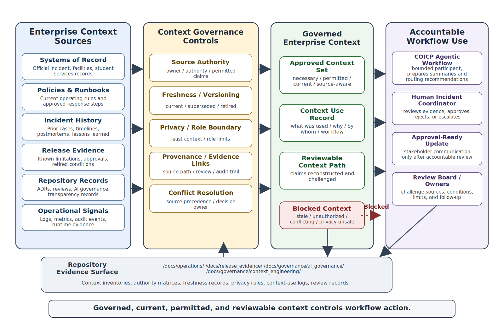
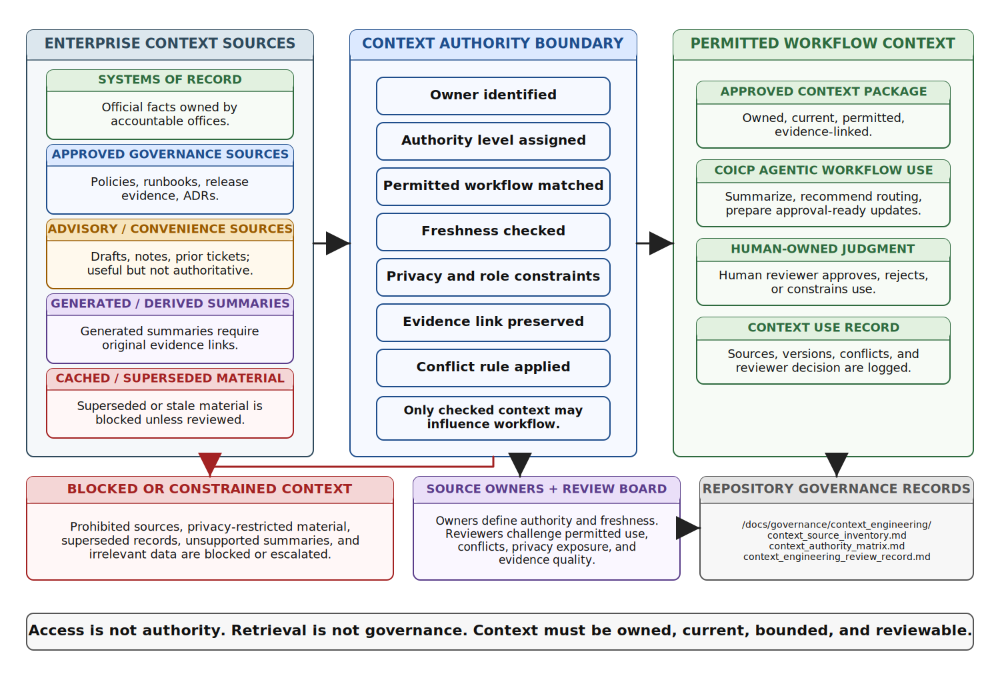
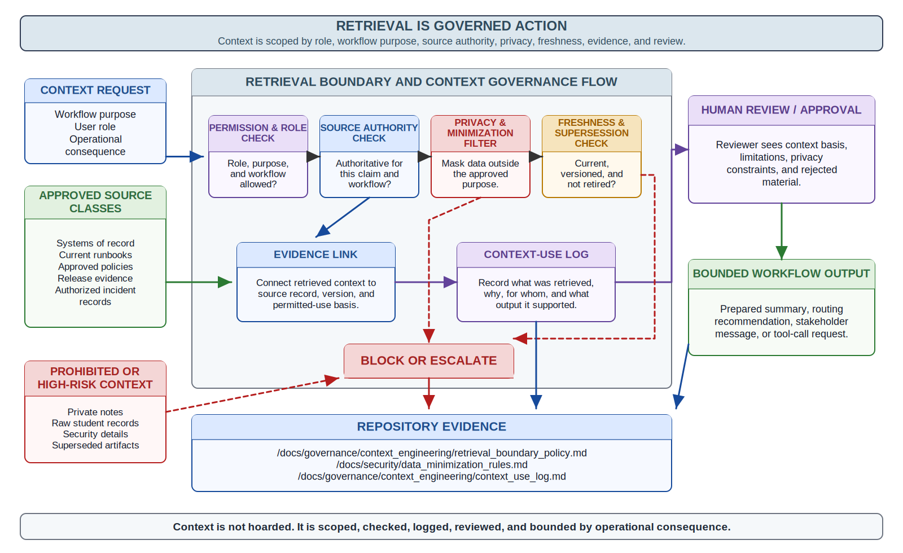
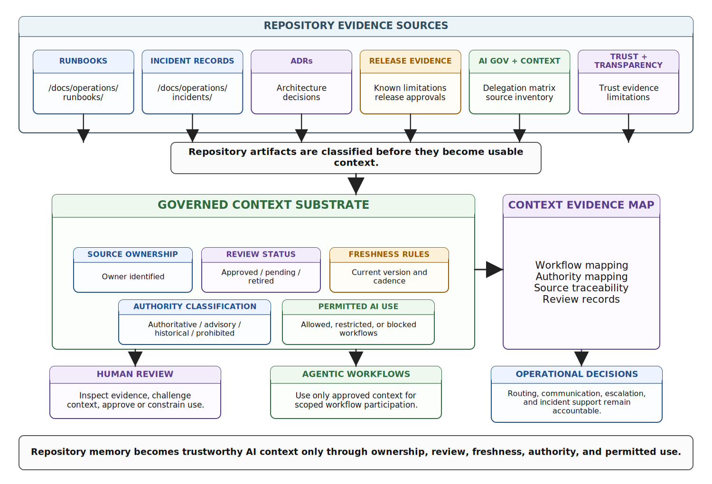
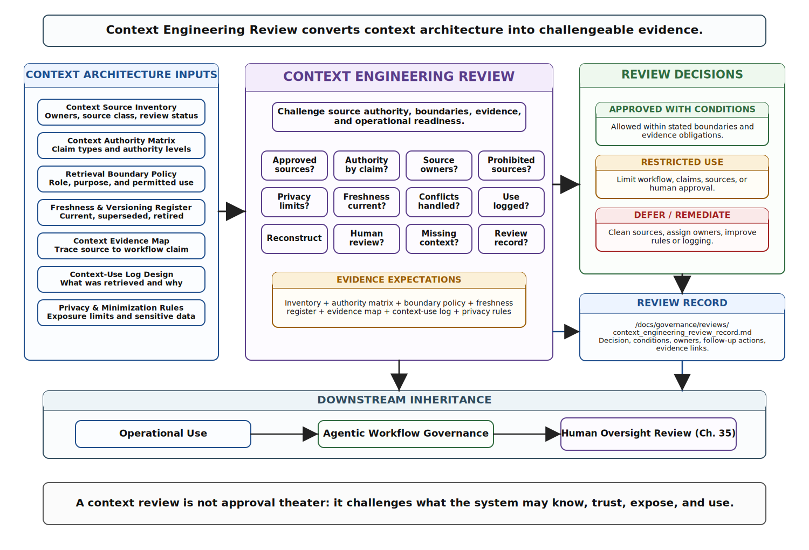

# Chapter 34 Enterprise AI Architecture and Context Engineering
---

### Chapter Governing Line

> Context is control at enterprise scale.

---

## Opening Scenario: The Workflow Was Governed, but the Context Was Not

The workflow appeared to be operating exactly as designed.

At Lakeside Metropolitan University, the Campus Operations and Incident Coordination Platform (COICP) had recently introduced a governed AI-assisted workflow to help prepare incident-routing recommendations. The workflow had passed review. Tool permissions were bounded. Approval requirements existed. Actions were logged. Rollback procedures had been documented. Human review remained mandatory before consequential action.

From a workflow-governance perspective, everything looked responsible.

Then a recommendation was challenged.

A facilities incident had been reported involving temporary access restrictions in a campus building. The workflow collected the incident record, assembled supporting information, reviewed previous incidents, consulted relevant procedures, and prepared a recommended response package for review.

The recommendation seemed reasonable.

The workflow suggested notifying several departments, preparing a temporary relocation notice, and escalating the issue to operations leadership. Nothing about the recommendation appeared unusual.

Then a reviewer noticed that one of the supporting sources contained outdated guidance.

A policy document had been superseded months earlier. A department contact list contained retired personnel. A prior incident summary omitted corrective actions that had changed current procedures. None of the individual errors were dramatic. The workflow had not exceeded its authority. The retrieval process had not failed technically. The recommendation was not hallucinated.

The problem was that the workflow had trusted context that should no longer have been trusted.

The workflow was governed.

The context was not.

That distinction matters because intelligent systems do not act only through code, tools, and permissions. They act through what they are allowed to know. Context influences what evidence is visible, which recommendations appear reasonable, which risks remain hidden, and which actions humans are asked to approve.

Chapter 33 established that intelligent systems require governed workflow authority. Chapter 34 asks the next question: what governs the information those workflows are allowed to retrieve, trust, combine, summarize, remember, expose, and use?

That is the context engineering problem.

In enterprise AI systems, context is not merely background information. It becomes part of the architecture of action. If engineers do not govern the context that intelligent systems consume, they cannot responsibly govern the conclusions, recommendations, actions, or communications those systems produce.

---

## 34.1 The Context Problem After Agentic Workflows

Lakeside Metropolitan University has completed the first serious review of controlled agentic workflow support for the Campus Operations and Incident Coordination Platform, or COICP. The approved workflow is intentionally limited. The agent may not close incidents. It may not send external notifications without approval. It may not change building status. It may not update public safety records. It may prepare a status summary, assemble related evidence, recommend a routing path, and prepare an approval-ready update for a human incident coordinator.

On paper, the authority model looks reasonable. The tool authority matrix is narrow. Approval gates exist. Agent actions are logged. A fallback runbook exists. The review board has prohibited direct state-changing actions without human authorization. Nobody at LMU has approved an autonomous incident-management agent.

Then a routine facilities incident exposes the next problem.

A water leak is reported in a campus building used by student services, evening classes, and a community partner program. COICP receives the report, links it to prior facilities notes, and triggers the controlled agentic workflow. The agent prepares a concise update for the campus operations coordinator. The update is well written. It summarizes the location, notes prior related work orders, references a runbook step for temporary relocation, identifies a contact in student services, and suggests that the coordinator notify affected departments using a prepared message.

The problem is not that the agent exceeded its tool authority. It did not. The problem is that the update combines context from sources with different authority and different freshness.

The facilities note is current. The runbook step is old. The student services contact list was superseded two weeks earlier. The release limitation referenced by the agent was retired after the last operational release. A policy summary pulled from a prior incident postmortem was never intended to govern current communication. The prepared message is fluent, plausible, and operationally dangerous.

The workflow behaved correctly. The context did not.

This is a different kind of failure from the obvious AI failures that receive public attention. The agent did not hallucinate wildly. It did not invent a building. It did not fabricate a policy. It did not take unauthorized action. It performed within the visible tool boundary. Yet the result was unsafe because the context boundary was poorly engineered.

That is why Chapter 34 belongs here. Chapter 33 established controlled action. Chapter 34 establishes controlled context.

A bounded agent can still produce a harmful result if it relies on stale, unauthorized, conflicting, incomplete, or unreviewed context. Tool authority controls what the system may do. Context engineering controls what the system may treat as true enough to influence action.

The mistake is to believe that adding retrieval solves the trust problem. Retrieval can reduce some forms of model invention, but it creates a new engineering surface: a context supply chain. Documents, records, policies, logs, incidents, runbooks, release notes, ADRs, postmortems, transparency records, and human annotations become inputs into intelligent behavior. If that supply chain is ungoverned, then AI can accelerate institutional confusion.

At LMU, the COICP repository already contains serious operational evidence: runbooks under `/docs/operations/runbooks/`, incident records under `/docs/operations/incidents/`, release-governance records under `/docs/release_evidence/`, AI-delegation artifacts under `/docs/governance/ai_governance/`, and trust-transparency records under `/docs/governance/trust_transparency/`. Those artifacts are valuable. They are not automatically safe AI context.

The engineering question is not simply, "Can the agent retrieve our documents?" The engineering question is, "Which sources may support which claims, under what authority, with what freshness, for which workflow, with what privacy boundary, and with what evidence trail?"

That is enterprise AI architecture.

*Figure 34.1 — Enterprise AI Context Architecture Map*

 ---

## 34.2 Context Is Control at Enterprise Scale

The phrase "context is control" appeared earlier in the book as a way to explain why AI-assisted work must be constrained by requirements, architecture, policies, repository evidence, and human judgment. In Chapter 34 the phrase becomes enterprise architecture.

Context determines what an intelligent system can perceive. Perception shapes inference. Inference shapes recommendation. Recommendation shapes action. Action shapes operational consequence. In enterprise systems, the chain from context to consequence is not theoretical. It shows up in routing decisions, escalation recommendations, stakeholder communication, privacy exposure, incident classification, release approval, limitation disclosure, and organizational trust.

Context is not merely information added to a prompt. Context includes all the structured and unstructured material a system may use to form a response or prepare action: records from systems of record, current policies, historical incidents, user roles, permissions, runbook steps, known limitations, review comments, operational metrics, logs, audit events, support tickets, release notes, decision records, and human instructions.

Some context is authoritative. Some is helpful but not authoritative. Some is outdated. Some is sensitive. Some is incomplete. Some is generated interpretation rather than original evidence. Some is valid for one workflow but not another. Some is safe for internal review but not safe for broad exposure. Some is true but irrelevant. Some is useful only if a human understands its limits.

Enterprise AI architecture begins when the engineering team stops treating context as a pile of available text and starts treating it as a governed control surface.

For LMU, a COICP agentic workflow cannot simply retrieve everything related to an incident. It must know which records are official, which are drafts, which are summaries, which are superseded, which are privacy-constrained, which are operationally current, and which are only historical learning records. A postmortem may explain why a prior failure occurred, but it may not define current policy. A release note may describe a limitation that has since been retired. A runbook may be valid only for certain incident classes. A department contact list may be authoritative only if it is owned and refreshed by the right office.

The model does not know these institutional distinctions by default. The architecture must express them.

This is where many AI-era systems become brittle. Teams assume that retrieval equals grounding. They assume that a citation equals evidence. They assume that a document store equals institutional memory. They assume that if the model can search the repository, the system is more trustworthy. Sometimes it is. Sometimes it is more confidently wrong.

Retrieval is not governance. Access is not authority. Freshness is not truth. Fluency is not evidence.

A trustworthy enterprise AI system requires explicit context architecture. That architecture should answer at least six questions.

First, what are the approved context sources for this workflow? Second, who owns each source? Third, what authority does each source have? Fourth, what privacy, security, or role constraints apply? Fifth, how is freshness, versioning, supersession, and retirement handled? Sixth, how is context use logged, reviewed, and challenged?

These questions are not documentation overhead. They are the conditions that make intelligent workflow behavior reviewable.

A useful repository artifact at this stage is `/docs/governance/context_engineering/context_source_inventory.md`. That inventory should not merely list documents. It should record source owner, source type, authority level, permitted workflows, prohibited uses, update cadence, privacy classification, review status, and evidence links. Without that inventory, the system may retrieve context, but the organization cannot explain why that context was appropriate.

Context engineering also requires architectural humility. The more context a system can consume, the more attractive it becomes to treat the system as broadly knowledgeable. That is precisely the danger. Broad access creates broad responsibility. An enterprise AI system should not know everything just because everything is technically retrievable. It should know what is necessary, permitted, current, and reviewable for the workflow it supports.

Context is control because context shapes action before action appears.

*Figure 34.2 — Source Authority and Context Boundary Model*

---

## 34.3 Source Authority and Systems of Record

Engineering teams often use the phrase "source of truth" too casually. In real enterprises, truth is distributed across systems, roles, policies, and time. A source may be authoritative for one claim and irrelevant for another. A system may be official for records but not for interpretation. A document may be approved but stale. A dashboard may be current but not complete. A summary may be useful but not authoritative.

Source authority is the discipline of deciding which source is allowed to support which kind of claim.

In COICP, different kinds of claims require different authorities. The current status of an incident may come from the incident record. Building-access status may come from facilities or public safety systems. Communication rules may come from an approved operations policy. Escalation roles may come from the current role-permission matrix. Known platform limitations may come from release-governance evidence. Reliability concerns may come from the failure-mode register. Historical lessons may come from postmortems. None of these sources is universally authoritative.

A trustworthy context architecture makes these distinctions visible.

LMU should not allow a COICP agent to treat a postmortem narrative, a chat transcript, a prior email, a stale runbook, and an approved operations policy as equivalent context. They may all be useful. They do not carry the same authority. If the agent prepares a recommendation, the system must be able to show which source supports which claim and whether that source is approved for the recommendation being made.

This is a professional engineering problem, not just a data-management problem. Source authority affects correctness, accountability, privacy, reviewability, release governance, and incident response. When an AI system uses weak context, the weakness often disappears into a polished output. Humans reviewing the output may see a confident recommendation but not the fragile context behind it.

The repository can help only if the repository preserves authority metadata. A file located under `/docs/operations/runbooks/` may be operationally important, but the path alone does not prove that the runbook is current, approved, or applicable to the incident class. A release record under `/docs/release_evidence/` may document a limitation, but the record must show whether the limitation is active, retired, replaced, or conditional. A decision record under `/docs/architecture/adrs/` may explain why an integration exists, but it may not define current operating procedure.

A practical artifact is `/docs/governance/context_engineering/context_authority_matrix.md`. That matrix should map context sources to claim types and workflow uses. For each source, it should identify owner, approval status, update cadence, effective date, supersession path, privacy classification, permitted AI use, prohibited AI use, and review evidence. It should also distinguish original evidence from generated interpretation.

For example, an incident timeline is original operational evidence. A generated summary of that timeline is an interpretation. The summary may be useful for a human reviewer, but if the system uses the summary as if it were original evidence, traceability weakens. If the summary contains an error, that error can propagate into workflow action. The same is true for AI-generated summaries of policies, runbooks, test results, release notes, or stakeholder constraints.

AI-generated summaries are proposed interpretations, not authoritative institutional truth.

This principle matters because enterprise AI systems often hide source distinction. A response may blend current policy, stale guidance, historical notes, and generated paraphrase into one fluent paragraph. That paragraph may feel coherent. It may not be governable.

A mature context architecture separates source, interpretation, and action.

Source authority also changes the review conversation. A review board should not ask only whether the AI answer looks reasonable. It should ask whether the sources behind the answer are authorized for that purpose. It should ask whether the source owner accepts that use. It should ask whether the context has an effective date and a retirement path. It should ask whether the context source is safe for the user role and workflow. It should ask whether the system can reconstruct what context was used when the recommendation was generated.

This is the move from content retrieval to institutional accountability.

---

## 34.4 Retrieval Boundaries, Privacy, and Data Exposure

Once source authority is defined, the next question is not how much context the system can retrieve. The next question is what context the system is permitted to retrieve, expose, summarize, retain, and use for a particular workflow.

Retrieval is an action. It may not change a business record, but it can still create risk. Retrieval can expose sensitive information. It can combine records in ways that create new privacy concerns. It can reveal details to a user who would not normally see them. It can surface incident information outside its intended audience. It can move operational knowledge from a controlled system into a generated output. It can create an audit obligation. It can create institutional harm even if no downstream tool call occurs.

This is why context engineering belongs with security and governance, not just architecture.

COICP deals with campus operations and incident coordination. That means context may include building-access details, public safety liaison notes, facilities reports, student-impact information, staff assignments, temporary relocation details, service disruptions, stakeholder communications, vendor interactions, and prior incident analysis. Some of that information may be harmless in isolation. Combined, summarized, or exposed to the wrong role, it can become sensitive.

A context architecture should enforce least privilege. The AI system should retrieve only the context needed for the workflow, only for the role, only for the purpose, only within the approved boundary, and only with appropriate logging. "The model might need it" is not an engineering justification.

This is where the boundary between enterprise AI architecture and operational security becomes visible. Chapter 27 argued that security is operational governance. Chapter 28 argued that AI delegation must be bounded. Chapter 33 argued that agentic tool authority must be controlled. Chapter 34 extends those principles into context access.

If an agent prepares a status update for a facilities coordinator, it may need incident status, affected location, approved communication template, current escalation path, and known operational limitation. It may not need private personnel notes, unrelated incident histories, raw student records, or internal security details. If a public-facing update is being prepared, the context boundary should be even narrower.

This boundary should be represented explicitly in repository evidence. Useful artifacts include `/docs/governance/context_engineering/retrieval_boundary_policy.md`, `/docs/security/data_minimization_rules.md`, and `/docs/governance/context_engineering/context_use_log.md`. The retrieval-boundary policy should define permitted source classes, prohibited source classes, role-based access, workflow-specific retrieval rules, retention expectations, citation requirements, and escalation conditions. The context-use log should preserve what context was retrieved, when, for what workflow, by what agent or service, under which approval boundary, and what output or recommendation it supported.

Without context-use evidence, review becomes guesswork. A human reviewer may approve an output without knowing what sources shaped it. An incident responder may later try to reconstruct why an agent recommended a particular escalation path and find only the final generated text. A release-governance review may evaluate an AI capability without knowing whether context access expanded beyond the approved boundary. That is not trustworthy engineering.

Context retrieval must be observable.

This does not mean every retrieval event must become noisy bureaucracy. It means the system must produce enough evidence to reconstruct consequential context use. Low-risk informational retrieval may need lightweight logging. Workflow recommendations, stakeholder communications, incident support, escalation preparation, and tool-call preparation require stronger evidence. The depth of context-use evidence should be proportional to operational consequence.

The key anti-pattern here is context hoarding. Teams give AI broad access because they fear missing useful information. The result is the opposite of disciplined engineering. Broad access makes system behavior harder to explain, harder to review, harder to secure, harder to test, harder to recover, and harder to trust.

In trustworthy systems, context is not hoarded. It is scoped.

*Figure 34.3 — Retrieval Boundary and Context Governance Flow*

---

## 34.5 Freshness, Versioning, and Context Drift

A context source can be authoritative and still dangerous if it is stale. It can be approved and still no longer applicable. It can be correct historically and wrong operationally. It can be useful for learning and unsafe for current action.

This is context drift.

Context drift occurs when the information available to an intelligent system no longer matches the operational reality that the system is influencing. Policies change. Runbooks are updated. release limitations are retired. contact lists are replaced. role assignments shift. systems are reconfigured. incident patterns evolve. monitoring signals improve. legal or compliance expectations change. A document that was correct last semester may mislead an agent today.

Humans deal with this imperfectly through memory, habit, informal communication, and experience. AI systems do not have institutional common sense. They need engineered freshness signals.

At LMU, the COICP agent's prepared update failed because it mixed current and stale context. The problem was not just retrieval. It was retrieval without freshness discipline. The system found relevant material, but relevance was not enough. Relevance answers, "Does this source appear related?" Freshness asks, "Is this source still valid for this purpose now?"

Freshness must be represented as part of the context architecture. A runbook should have an owner, effective date, review date, supersession rule, applicability conditions, and retirement status. A release limitation should indicate whether it is active, mitigated, retired, or replaced. A policy should link to the current approved version. A postmortem should be marked as learning evidence, not operating authority, unless specific corrective actions have been converted into current procedures.

A useful artifact is `/docs/governance/context_engineering/context_freshness_and_versioning_register.md`. That register should not be a passive list. It should define review cadence, expiration triggers, supersession links, deprecation markers, owner responsibilities, and workflow impact. If a source expires or is superseded, the system should not continue to treat it as active context without review.

Versioning also matters for incident reconstruction. Suppose an AI-assisted recommendation was generated during an incident. Weeks later, a review board asks why that recommendation was made. If the system only points to the current version of a policy, the evidence may be misleading. The relevant question is which version of the policy was available and retrieved at the time of the recommendation. Trustworthy review requires time-aware context evidence.

This is especially important for repository-centered engineering. Git history can preserve changes, but the existence of history is not the same as governance. A future reviewer should not have to reverse-engineer context state from raw commits. The repository should make context status visible through clear artifacts, review records, supersession links, and release notes. Version history supports trust only when engineers know what they are looking for and why it matters.

Freshness is not automatic. It must be owned.

Just as Chapter 33 treated authority expansion as a governance event, Chapter 34 treats context change as a governance event when the affected source participates in intelligent workflows. A modified runbook, revised policy, retired limitation, updated role assignment, or superseded procedure may change what an AI-assisted workflow retrieves, recommends, prepares, or presents for approval. Context-bearing changes therefore deserve review proportional to their operational consequence.

Context engineering therefore creates new operational responsibilities. Someone must own context sources. Someone must review them. Someone must retire them. Someone must approve their use in intelligent workflows. Someone must notice when operational reality changes. Someone must connect incident learning, release governance, and runbook updates back into the context substrate.

This is where Chapter 34 begins to prepare Chapter 35. Humans cannot meaningfully oversee intelligent systems if they cannot tell whether the context basis is current. Oversight without context visibility becomes approval theater. A reviewer who sees only the generated recommendation cannot judge whether the source authority, retrieval boundary, freshness, and conflict handling were acceptable.

The mature question is not, "Did the AI cite something?" The mature question is, "Did the system use the right source, in the right version, under the right authority, for the right workflow, with reviewable evidence?"

That question belongs in the architecture.

---

## 34.6 Repository Evidence as Governed AI Context

Repository-centered engineering begins with a simple observation: the repository is not merely where code lives. It is where engineering truth becomes durable. Requirements, issues, branches, pull requests, reviews, tests, architectural decisions, AI-use evidence, release records, operational evidence, postmortems, runbooks, incident records, reliability analysis, transparency records, and governance decisions collectively form the institutional memory of the system.

As systems become more intelligent, distributed, and autonomous, preserving that memory becomes increasingly important. Future engineers, reviewers, operators, and stewards must be able to understand not only what the system does, but why it behaves the way it does and how critical decisions were made.

In Chapter 34, that doctrine takes on a new role. The repository becomes not only memory for humans but also a potential context substrate for intelligent systems.

That is powerful, and it is dangerous.

A repository can ground AI-assisted work in actual engineering evidence. It can give an agent access to current runbooks, release limitations, incident records, ADRs, AI delegation policies, observability evidence, and review-board outcomes. It can help prevent generic model answers. It can make AI-assisted recommendations more specific, more traceable, and more operationally useful.

But a repository can also become a dumping ground. If documents are stale, duplicated, contradictory, unowned, unreviewed, or poorly linked, then exposing them to AI does not create trustworthy context. It creates document sprawl with a fluent interface. That is not repository-centered engineering. That is repository dumping.

A trustworthy repository context substrate must be curated, governed, and reviewable. It should distinguish active operating artifacts from historical learning artifacts. It should distinguish approved policies from drafts. It should distinguish original evidence from summaries. It should distinguish current limitations from retired limitations. It should distinguish authoritative architecture decisions from discussion notes. It should make source ownership visible. It should make review status visible. It should make AI-permitted use visible.

For COICP, the context architecture may include repository areas such as:

- `/docs/governance/context_engineering/context_source_inventory.md`
- `/docs/governance/context_engineering/context_authority_matrix.md`
- `/docs/governance/context_engineering/retrieval_boundary_policy.md`
- `/docs/governance/context_engineering/context_freshness_and_versioning_register.md`
- `/docs/governance/context_engineering/context_evidence_map.md`
- `/docs/governance/context_engineering/context_use_log.md`
- `/docs/governance/reviews/context_engineering_review_record.md`
- `/docs/operations/runbooks/`
- `/docs/operations/incidents/`
- `/docs/operations/repository_memory/`
- `/docs/governance/ai_context/`
- `/docs/governance/ai_governance/ai_delegation_matrix.md`
- `/docs/release_evidence/known_limitations.md`
- `/docs/governance/trust_transparency/trust_evidence_map.md`

These paths should not become a directory tour in the manuscript. Their purpose is to show that repository evidence becomes AI-era control only when it is organized around engineering meaning.

The context evidence map is especially important. `/docs/governance/context_engineering/context_evidence_map.md` should connect context sources to workflows, authority levels, source owners, review records, freshness rules, and permitted AI uses. It should allow a reviewer to trace a COICP agent recommendation back to the underlying evidence chain. The map should not ask the reader to trust the model; it should help the reader inspect what the model was allowed to use.

The repository also supports change control. If a context source changes, the change should be reviewed like any other consequential engineering change. A pull request that updates a runbook used by an agentic workflow is not ordinary documentation cleanup. It may change operational behavior. It may change what an AI-assisted recommendation says. It may change what a human approves. It may change incident response. That change deserves evidence, review, and ownership.

This does not mean every documentation edit requires heavy governance. It means context-bearing artifacts must be classified. Some repository files are informational. Some are operational. Some are authority-bearing. Some are AI-consumable. Some are prohibited from AI use. Some require review before an agentic workflow may rely on them. Treating all files the same is a failure of engineering judgment.

Repository-centered engineering becomes context-centered governance when the repository can answer three questions.

First, what evidence exists? Second, what is that evidence allowed to support? Third, how do humans and AI systems know that the evidence is current, authoritative, and bounded?

This is not glamorous. It is not a demo feature. It is the work that prevents intelligent systems from turning institutional memory into institutional risk.

*Figure 34.4 — Repository Memory as Governed AI Context Substrate*

---

## 34.7 Context Conflicts and Evidence Judgment

Enterprise context is rarely perfectly consistent. Policies may lag behind practice. Runbooks may be updated before training catches up. Incident records may contain early assumptions that later proved wrong. Release notes may describe a temporary limitation that is now resolved. Different departments may use different language for the same operational state. AI systems can retrieve all of this and make it appear unified.

That apparent unity is dangerous.

A trustworthy context architecture must include conflict handling. When sources disagree, the system should not silently blend them. It should identify the conflict, prefer the source with higher authority where appropriate, surface uncertainty, require human review when consequence is high, and preserve evidence of how the conflict was handled.

In COICP, imagine that the current runbook says one relocation procedure applies to a campus facility incident, while a recent incident record shows a workaround used during a specific weekend event. The agent should not automatically treat the workaround as current procedure. It should recognize the difference between a documented exception and an approved process. It may surface both, but it should not collapse them into one recommendation.

This is where engineering judgment remains central. AI can retrieve, compare, summarize, and highlight differences. It cannot own institutional authority. It cannot decide on its own that an exception has become policy. It cannot decide that a postmortem lesson supersedes an approved procedure unless the organization has encoded that authority through governance.

Conflict resolution is therefore not a retrieval problem. It is a governance problem. Retrieval may expose the disagreement. Human authority, review structures, source ownership, and organizational policy determine how the disagreement is resolved.

The model is not the system. The context is not automatically the truth. The summary is not the decision.

Context conflicts should be visible in review records. If a conflict is discovered during workflow use, it should produce an action item: update the source, clarify authority, retire stale material, revise the retrieval boundary, or add a review condition. These actions may belong in `/docs/governance/context_engineering/context_exception_log.md` or a related issue in the repository. If a conflict affects operational behavior, it may also require updates to runbooks, release evidence, or AI delegation records.

This is another place where evidence prevents theater. A team can claim that context is governed because it has a source inventory. But if conflicts are ignored, the inventory becomes decoration. Governance means the system has a way to handle uncertainty, not merely a way to list documents.

Context engineering should therefore include escalation rules. Low-risk conflicts may be flagged for routine cleanup. Moderate-risk conflicts may require a reviewer before the agent's output is used. High-risk conflicts, especially those involving incidents, safety, privacy, public communication, or authority-bearing actions, should block automatic use until a human resolves the issue.

Chapter 35 will return to the human side of this problem. The important point here is that oversight cannot be meaningful unless the architecture exposes conflicts. Humans cannot govern what the system hides from them.

---

## 34.8 Enterprise AI Architecture Is Sociotechnical Architecture

It is tempting to describe enterprise AI architecture as a technical stack: models, prompts, retrievers, embeddings, vector stores, APIs, orchestration services, tool connectors, monitoring pipelines, and access-control layers. Those elements matter. They are not the architecture by themselves.

The real architecture includes people, policies, systems of record, source owners, review boards, incident responders, release governors, privacy constraints, communication expectations, repository artifacts, operational history, and institutional trust. It includes what the system is allowed to know, what it is allowed to infer, what it is allowed to prepare, who reviews the result, how errors are detected, how context is refreshed, and who remains accountable.

Enterprise AI architecture is sociotechnical architecture.

This matters because many AI implementations fail by narrowing architecture too quickly. Teams ask, "Which model? Which retrieval approach? Which orchestration framework? Which memory layer?" Those questions may be necessary later. They are not first questions. The first questions are about authority, evidence, ownership, risk, workflow consequence, and governance.

For LMU, the relevant architecture includes the campus operations coordinator, facilities staff, public safety liaisons, IT support, privacy/compliance reviewers, student services, department representatives, and review boards. It includes COICP workflow state, incident records, runbooks, release limitations, escalation procedures, trust-transparency obligations, and operational evidence. It includes the repository as memory and the review process as judgment.

A model-centered architecture misses this. A vendor-centered architecture hides it. A prompt-centered architecture trivializes it.

A trustworthy architecture asks how institutional knowledge becomes usable without becoming uncontrolled. It asks how AI-assisted work remains linked to evidence. It asks how source owners remain visible. It asks how humans can challenge context use. It asks how operational learning changes the context substrate. It asks how privacy and least privilege shape retrieval. It asks how release governance affects what AI workflows may claim.

This is why Chapter 34 should remain sober and practical. It is not an argument against AI. It is an argument against pretending that intelligent behavior can be governed after the fact. Context must be engineered before consequential AI workflows depend on it.

The same lesson applies to educational teams. Students may be tempted to build an AI feature by feeding documents into a model and showing a good response. A professional engineer asks different questions: Which documents? Who owns them? Are they current? What claim may they support? What private information is excluded? What happens when sources conflict? How is context use logged? What review approved the boundary? How will the system change when the policy changes?

Those are not bureaucratic questions. They are architecture questions.

---

## 34.9 Context Engineering Review

Chapter 34 introduces the Context Engineering Review. This review is the formal challenge mechanism for enterprise AI context architecture. It inherits the Agentic Workflow Review from Chapter 33 and prepares the Mature Human Oversight Review in Chapter 35.

The review should occur after an agentic workflow has been conceptually bounded but before that workflow relies on enterprise context in operational use. In other words, it belongs before the organization treats AI-assisted recommendations, summaries, prepared actions, or stakeholder communications as ready for operation.

The purpose of the Context Engineering Review is not to admire the architecture diagram. It is to challenge whether the context foundation is trustworthy enough for the intended workflow.

The review should ask:

- Which sources are approved for this workflow?
- Which sources are authoritative for which claim types?
- Who owns each source?
- What sources are prohibited?
- What role, privacy, or security limits apply?
- How is freshness determined?
- How are versions, supersession, and retirement handled?
- How are generated summaries distinguished from original evidence?
- How are conflicts detected and escalated?
- What context-use evidence is logged?
- How can a recommendation be reconstructed after the fact?
- What happens when context is missing, stale, conflicting, or unauthorized?
- What human review is required before the output is used?
- What repository artifacts preserve the review decision?

The expected evidence should include at least a context source inventory, context authority matrix, retrieval boundary policy, freshness and versioning register, context evidence map, context-use log design, privacy/data-minimization rules, and review record. For COICP, the review record should live at `/docs/governance/reviews/context_engineering_review_record.md` or an equivalent project-specific path.

The review should produce a decision, but the decision should not be a simplistic approve-or-reject stamp. A mature review may approve context use with conditions, limit the workflow to certain claim types, prohibit certain sources, require additional freshness checks, require human approval for conflict cases, require repository cleanup, require revised runbooks, or defer the workflow until context governance improves.

This matters because context architecture is often invisible until it fails. A system may appear intelligent during demos because the examples are curated, the documents are hand-selected, and the reviewer is focused on the output. The Context Engineering Review forces the team to examine the supply chain behind the output.

*Figure 34.5 — Context Engineering Review Gate*

A good Context Engineering Review strengthens engineering judgment. It teaches teams to challenge not only whether AI output is reasonable but whether the context basis is appropriate. It shifts attention from surface fluency to source authority. It forces human reviewers to ask what the system was allowed to see and why. It prevents context engineering from becoming an implementation detail hidden inside prompts, retrievers, or vendor configuration.

The review transforms context from information into accountable evidence.

The review also reinforces a core ETIS principle: context is not trusted because it exists. Context is trusted because its authority, ownership, freshness, permitted use, and operational relevance have been challenged and accepted through review.

---

## 34.10 Failure Story: Context Fog

The primary anti-pattern in Chapter 34 is Context Fog.

Context Fog occurs when enterprise AI systems retrieve, combine, summarize, or act on organizational information without clear source authority, ownership, freshness, privacy boundaries, or reviewable evidence. The system appears informed. The output appears grounded. The workflow appears efficient. But the organization cannot tell whether the context basis is trustworthy.

Context Fog is dangerous because it hides inside competence. It does not look like obvious failure. It looks like a polished answer, a smooth summary, a helpful recommendation, a complete evidence packet, or a confident status update. The danger is that the fluency masks weak context.

LMU's COICP scenario demonstrates this. The agent's update looked useful. It referenced real materials. It stayed inside tool boundaries. It prepared a message for human approval. Yet it mixed current incident information with stale runbook guidance and retired release limitations. The output was not random. It was context-confused.

Several secondary anti-patterns cluster around Context Fog.

Prompt-as-Policy occurs when teams place governance instructions inside prompts and treat them as sufficient control. A prompt may say, "Use only current approved policy," but unless the system can identify current approved policy, the instruction is aspirational. Governance cannot live only in prompt text.

Retrieval Theater occurs when teams assume that retrieved documents automatically ground AI behavior. The system may cite documents, but if those documents are not authoritative, current, permitted, or relevant to the claim, the citation becomes theater.

Context Hoarding occurs when teams give AI broad access to organizational information because they want better answers. This increases privacy risk, review burden, and behavioral unpredictability.

Repository Dumping occurs when teams expose large collections of repository documents without ownership, authority, freshness, or permitted-use metadata. The repository becomes a pile instead of a governed memory system.

Stale Context Confidence occurs when old information appears in fluent output as if it were current. This is especially dangerous in operations because procedures, roles, limitations, and escalation paths change over time.

Review Theater occurs when a review board approves context architecture because artifacts exist, not because the artifacts have been challenged.

Trustworthy engineering counters these anti-patterns through explicit context architecture: source inventory, authority matrix, retrieval boundary policy, freshness/versioning register, context evidence map, context-use logging, conflict escalation, and Context Engineering Review.

The goal is not to make AI timid. The goal is to make AI-assisted workflow participation accountable.

---

## 34.11 Exercises

### Exercise 1: Build a Context Source Inventory

Review the COICP incident-status-update scenario presented in this chapter.

Identify the context sources that could be used by an AI-assisted workflow, including incident records, runbooks, release limitations, facilities tickets, stakeholder communication templates, role-permission matrices, prior postmortems, and operational policies.

For each source, document:

* source owner
* authority level
* update cadence
* privacy classification
* permitted AI use
* prohibited AI use

Prepare a draft context source inventory and explain why each source should or should not be considered authoritative for operational decision-making.

**Suggested repository artifact:**

`/docs/governance/context_engineering/context_source_inventory.md`

### Exercise 2: Create a Source Authority Matrix

Using the context sources identified in Exercise 1, determine which sources may support specific categories of organizational claims.

Consider questions such as:

* Which sources may support operational decisions?
* Which sources may support stakeholder communications?
* Which sources may support policy interpretation?
* Which sources may support known limitation disclosures?
* Which sources may support incident-response actions?

Document where authority begins and ends for each source.

**Suggested repository artifact:**

`/docs/governance/context_engineering/context_authority_matrix.md`

### Exercise 3: Define Retrieval Boundaries

Assume a COICP workflow agent is preparing an internal incident-status update.

Define:

* context the agent may retrieve
* context the agent may summarize
* context the agent may expose to users
* context the agent may retain
* context the agent must exclude

Distinguish between:

* internal operational use
* stakeholder communication
* public-facing communication

Explain how your retrieval boundaries support privacy, security, accountability, and trustworthy operation.

**Suggested repository artifact:**

`/docs/governance/context_engineering/retrieval_boundary_policy.md`

### Exercise 4: Evaluate Freshness and Versioning

Review the following context set:

* an outdated runbook procedure
* a current incident record
* a retired limitation disclosure
* a postmortem recommendation

Determine:

* which sources may support current action
* which sources require review
* which sources should no longer be used
* what repository updates are required

Document the risks created when stale context is treated as authoritative.

**Suggested repository artifact:**

`/docs/governance/context_engineering/context_freshness_and_versioning_register.md`

### Exercise 5: Conduct a Context Engineering Review

Act as a Context Engineering Review Board evaluating a proposed COICP agentic workflow.

Review:

* context source inventory
* source authority matrix
* retrieval boundary policy
* freshness and versioning register
* context evidence map

Produce one of the following review dispositions:

* approve
* approve with conditions
* defer
* reject

Defend the decision using evidence from the review package.

**Suggested repository artifact:**

`/docs/governance/reviews/context_engineering_review_record.md`

### Exercise 6: Trace a Context Failure

Construct a realistic context-engineering failure scenario for COICP.

Examples might include:

* retrieval of stale information
* use of an unauthorized source
* conflicting policy sources
* incorrect stakeholder visibility
* outdated operational guidance

For the selected failure:

1. Identify the context breakdown.
2. Describe the operational consequence.
3. Determine how the failure could be detected.
4. Define the corrective action.
5. Identify the governance control that should prevent recurrence.

Explain how context engineering contributes to operational trustworthiness.

**Suggested repository artifact:**

`/docs/governance/context_engineering/context_failure_analysis.md`

---

## 34.12 Enduring Engineering Lessons

Enterprise AI architecture begins with source authority, not model capability.

Context is not background information. It is a control surface. It determines what intelligent systems can perceive, infer, recommend, expose, and prepare for action.

Retrieval is not governance. A retrieved document does not become authoritative because a model used it. A citation does not prove that a source is current, permitted, or appropriate for the claim.

Access is not authority. An AI system should not use every source it can technically reach. Context access must be scoped by role, workflow, privacy, source authority, and operational consequence.

Freshness matters. A stale runbook, retired release limitation, old contact list, or superseded policy can make a fluent output dangerous.

Repository evidence becomes AI-era control only when it is curated, owned, current, reviewable, and linked to permitted use. A repository dump is not context engineering.

Human oversight depends on context visibility. Reviewers cannot responsibly approve AI-assisted recommendations when the context basis is hidden, stale, conflicting, or unauthorized.

The Context Engineering Review is the chapter's formal challenge mechanism. It asks whether enterprise AI context is trusted, bounded, current, source-authoritative, privacy-aware, versioned, observable, reviewable, and human-owned.

Context is control at enterprise scale.

---

## 34.13 Trustworthiness Mapping

Chapter 34 strengthens several trustworthiness pillars, but it does so by refusing checklist theater. It does not say that a system is trustworthy because it uses retrieval, cites documents, or has a context policy. It asks whether context use can be governed, traced, reviewed, secured, reconstructed, and owned.

Governability is primary. Context sources, retrieval permissions, authority levels, freshness rules, and review gates become control structures. Evidence includes context inventories, authority matrices, retrieval policies, and Context Engineering Review records.

Traceability is primary. AI-assisted claims must trace to source, version, retrieval event, permitted use, and workflow context. Evidence includes context evidence maps, context-use logs, source-version links, and repository review records.

Reviewability is primary. Context architecture must be inspectable before intelligent workflows rely on it. Evidence includes review records, source ownership fields, freshness registers, and conflict logs.

Security and privacy are primary. Context retrieval is a data exposure boundary. Evidence includes retrieval boundary policies, data-minimization rules, role permissions, and prohibited-source definitions.

Accountability is primary. Context owners, workflow owners, approving humans, and review boards remain visible. AI-generated summaries do not own institutional truth.

Correctness is strengthened by source authority, freshness, and conflict handling. Correctness does not come from fluency. It comes from the relationship between claim, source, version, and permitted use.

Operational visibility is strengthened when context use can be reconstructed during review, incident response, release governance, or transparency work.

Human oversight is prepared. Chapter 34 does not solve oversight. It gives oversight something meaningful to inspect.

---

## 34.14 Closing Transition: From Governed Context to Human Oversight

Chapter 33 asked what authority intelligent systems should have. Chapter 34 asked what context intelligent systems should be allowed to trust. Those are necessary controls. They are not enough.

LMU can define tool authority. It can govern context sources. It can create a context inventory, authority matrix, retrieval boundary policy, freshness register, context evidence map, and Context Engineering Review. It can require context-use logging. It can restrict sensitive sources. It can distinguish original evidence from generated interpretation. It can make stale context visible.

Even then, somebody must remain accountable for judgment under uncertainty.

A human reviewer may receive an AI-prepared status update with source links, freshness indicators, conflict warnings, and approval conditions. That is better than a blind generated recommendation. But the reviewer still must understand the workflow, the operational consequence, the limits of the context, the risk of approval, and the conditions under which escalation is required. If the reviewer is overloaded, poorly trained, disconnected from authority, or reduced to rubber-stamping, the system still fails.

This is why Chapter 35 follows naturally.

Enterprise AI architecture and context engineering make intelligent workflows more governable. They do not eliminate human oversight. They make meaningful oversight possible.

Chapter 35, Human Oversight in Intelligent Systems, inherits the central question that remains after Chapter 34:

When intelligent systems have bounded authority and governed context, how do humans remain meaningfully in control?

That question cannot be answered with an approval button. It requires an oversight operating model.
