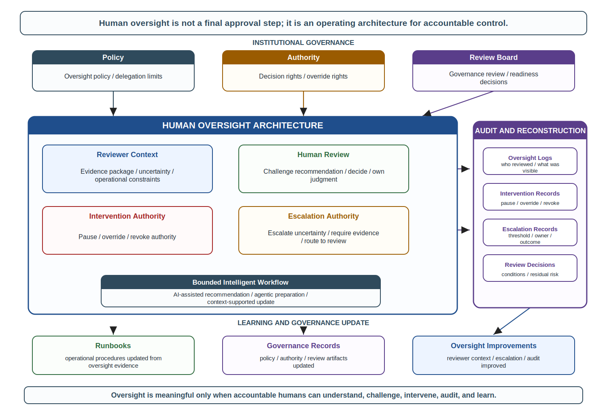
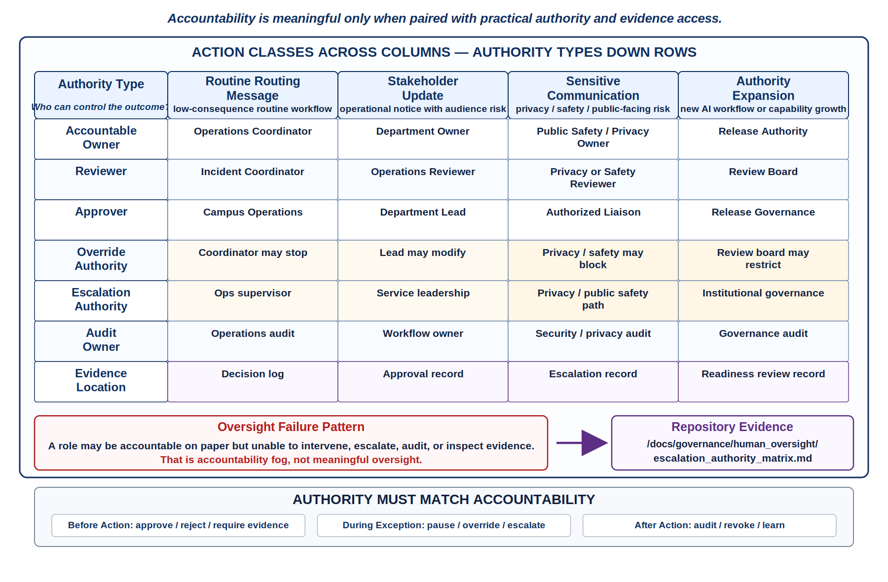
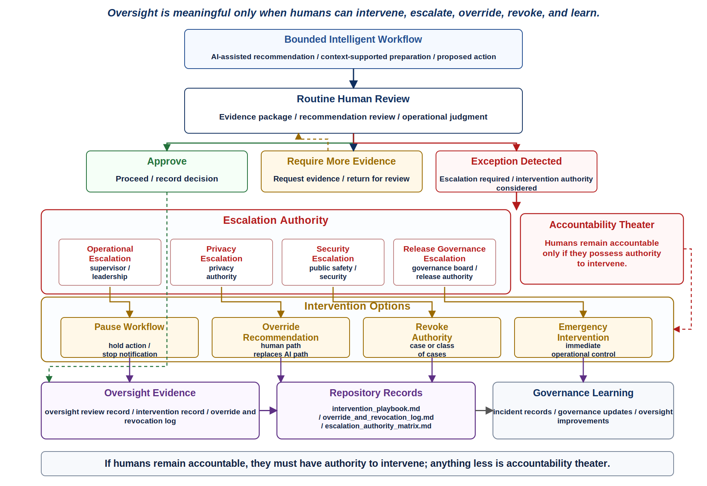
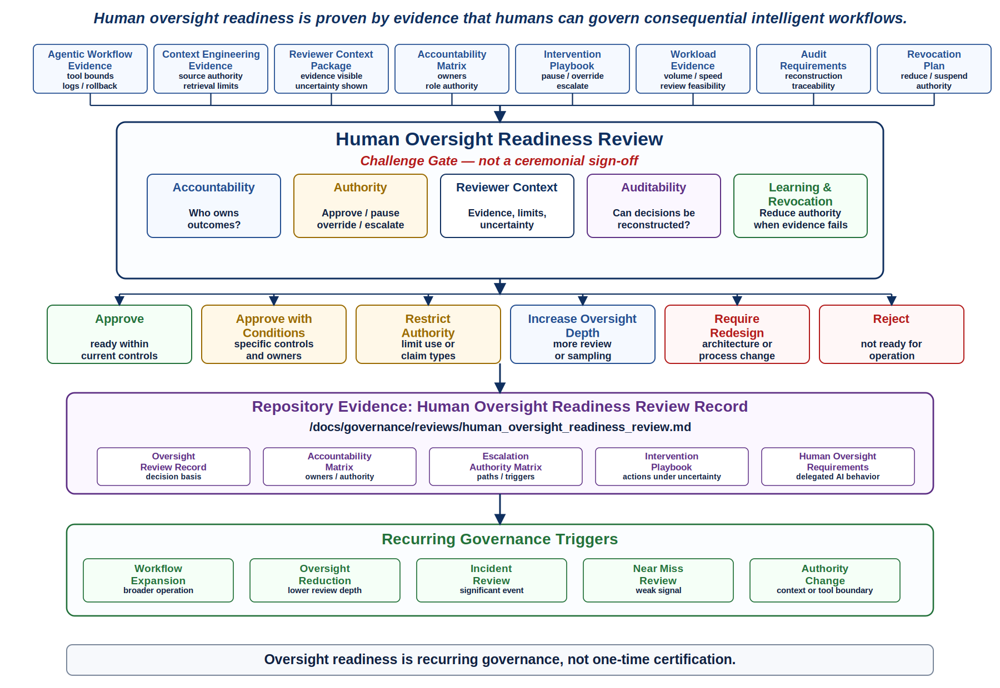

# Chapter 35 Human Oversight in Intelligent Systems
---

### Chapter Governing Line

> Oversight is not approval. Oversight is accountable control.

---

## Opening Scenario: The Recommendation Was Reasonable, but Someone Still Had to Decide

A facilities incident was reported late on a Thursday afternoon.

The affected building supported student services, evening classes, and a community partner program. The initial incident record suggested a utility disruption that might require temporary relocation of several scheduled activities. The Campus Operations and Incident Coordination Platform (COICP) collected the incident details, retrieved approved context, identified the applicable runbook, reviewed recent related incidents, and assembled a recommended response package.

The recommendation appeared reasonable.

The workflow proposed notifying several departments, activating a temporary relocation plan, preparing a campus update, and escalating the incident to operations leadership. The recommendation was supported by approved context sources. The workflow remained within its delegated authority. No policy violations were detected. No context conflicts were identified. The recommendation was explainable and evidence-backed.

Yet the campus operations coordinator hesitated.

One department was hosting a special event that evening. Public safety had not yet confirmed building-access restrictions. Student services was already operating under a separate communication constraint. None of those conditions invalidated the recommendation. They simply introduced factors that the workflow could not fully evaluate.

The recommendation was reasonable.

The decision was not obvious.

The question was no longer whether the workflow had exceeded its authority. It had not.

The question was no longer whether the workflow had used unapproved context. It had not.

The question was who remained responsible for the outcome.

The coordinator could approve the recommendation, modify it, escalate it, delay it, or reject it. Whatever happened next would not be owned by the workflow, the retrieval system, the context repository, or the AI model. It would be owned by people acting on behalf of the institution.

That is the human oversight problem.

Chapter 33 established that intelligent systems require governed workflow authority. Chapter 34 established that intelligent systems require governed context authority. Chapter 35 asks the next question: after workflow authority and context authority have both been governed, who remains accountable?

The answer cannot be the model. The answer cannot be the agent. The answer cannot be the workflow engine, retrieval layer, vector index, policy document, or audit log. Intelligent systems may propose, prepare, route, summarize, recommend, and even execute bounded actions. Humans and organizations remain accountable for the authority they grant, the consequences they accept, and the oversight they choose to make meaningful or symbolic.

---

## 35.1 The Oversight Problem After Governed Workflows and Governed Context

Lakeside Metropolitan University has done a great deal right. The Campus Operations and Incident Coordination Platform, or COICP, is no longer an experimental classroom-style application. It has gone through responsible construction, release defense, operational learning, stabilization, observability improvements, runbook development, security governance, controlled AI delegation, reliability analysis, incident response, release governance, and trust transparency. By the beginning of Chapter 35, COICP is operationally mature enough that LMU can consider intelligent workflow support without pretending that capability is trustworthiness.

Chapter 33 gave LMU a bounded agentic workflow model. A COICP agent may prepare a status update, assemble evidence, recommend a routing path, and prepare an approval-ready message. It may not close an incident, change building status, update public safety records, or send external communications without human authorization. The tool authority matrix is narrow. Approval gates exist. Agent actions are logged. Rollback and revocation plans exist.

Chapter 34 gave LMU a governed context architecture. The agent may use approved context sources only within defined boundaries. Context sources have owners, authority levels, freshness rules, privacy classifications, permitted uses, and review status. The repository now contains context-engineering evidence such as /docs/governance/context_engineering/context_source_registry.md, /docs/governance/context_engineering/context_trust_model.md, /docs/governance/context_engineering/context_refresh_policy.md, and /docs/governance/reviews/context_engineering_review_record.md. That context architecture matters because the system can only behave as responsibly as the context it is allowed to trust.

Then a real operational situation tests the next layer of maturity.

A facilities incident is reported late in the afternoon in a campus building that supports student services, evening classes, and a community partner program. The COICP workflow collects the incident record, retrieves approved context, assembles the current runbook step, identifies the active escalation path, and prepares a recommended update for the campus operations coordinator. The context is current. The sources are approved. The recommendation is not hallucinated. The workflow remains inside its authority boundary. The system does what LMU designed it to do.

But the recommendation still requires judgment. The system recommends notifying several departments immediately and preparing a temporary relocation notice. The evidence supports that path under ordinary conditions. Yet the operations coordinator knows that one department has a special event that night, public safety has not confirmed hallway access, and student services is already operating under a separate communication constraint. The generated recommendation is plausible, evidence-backed, and incomplete.

The question is no longer whether the system violated its authority boundary. It did not. The question is no longer whether the system used untrusted context. It did not. The question is whether the human reviewer can exercise meaningful oversight under time pressure, partial information, organizational consequence, and operational ambiguity.

This is where many intelligent-system governance programs fail. They build approval gates but not oversight capability. They require human signoff but do not give humans the evidence, time, authority, escalation path, or intervention tools needed to make signoff meaningful. They create policy language that says a human remains accountable while designing a workflow in which the human has little practical control.

Human oversight becomes real only when the human can affect the outcome. A person who can only click approve is not necessarily overseeing the system. A person who cannot see the evidence, inspect the context, challenge the recommendation, pause the workflow, escalate uncertainty, override the proposed action, revoke authority, or trigger review is not exercising meaningful oversight. They are being used as a governance shield.

*Figure 35.1 — Human Oversight Architecture*

---

## 35.2 Oversight Is an Operating Model, Not an Approval Moment

The phrase human oversight is easy to say and easy to abuse. In weak systems it means a human saw something. In slightly better systems it means a human clicked approve. In mature systems it means human judgment is embedded in the operating model: before action, during action, after action, during exception handling, during audit, during policy revision, and during system learning.

Approval is one possible oversight action. It is not the same thing as oversight. Oversight includes defining who has authority, what information they receive, what they are expected to challenge, what they may approve, what they may stop, what they may override, when they must escalate, what evidence is preserved, how samples are audited, how exceptions are handled, and how the system changes when oversight reveals weakness.

That distinction matters because intelligent systems can create a false sense of control. A workflow diagram may show a box labeled human approval. A policy may say that human review is required. A user interface may display an approve button. None of those prove that oversight is meaningful. The human may be overloaded. The evidence may be too thin. The recommendation may be too fluent. The escalation path may be unclear. The organization may punish delays. The reviewer may lack authority to override. The system may not preserve enough evidence for audit. In that case, the approval step is theater.

Oversight theater is dangerous because it lets an organization claim accountability while designing away control. It converts a human into a liability absorber. When something goes wrong, the organization can say a person approved the action. That may be procedurally true and professionally dishonest. The mature question is whether the oversight design gave that person a real opportunity to understand, challenge, intervene, and document the decision.

In COICP, meaningful oversight cannot be a generic approval step after an agent prepares a recommendation. A facilities coordinator reviewing an incident-routing recommendation needs a reviewer context package: current incident summary, sources used, context freshness status, unresolved conflicts, relevant runbook step, known limitations, role authority, privacy constraints, escalation options, and the consequence of approving or delaying action. The reviewer also needs authority to request more evidence, modify the prepared message, escalate to public safety, defer the recommendation, or revoke agent participation for that incident class.

The repository should preserve the oversight architecture. A practical starting point is /docs/governance/human_oversight/human_oversight_policy.md. That policy should define oversight scope, risk levels, required review depth, reviewer roles, prohibited rubber-stamp patterns, escalation thresholds, override authority, evidence expectations, and audit responsibilities. It should not be a ceremonial policy. It should shape workflow design and review-board decisions.

A second artifact is /docs/governance/human_oversight/accountability_matrix.md. The matrix should connect workflow action types to accountable roles, approving authorities, escalation authorities, backup owners, evidence requirements, and post-action review expectations. This is where accountability stops being a slogan and becomes an engineered responsibility structure.

Oversight is an operating model because it must work repeatedly under ordinary pressure. It must work when the system is correct. It must work when the system is uncertain. It must work when context is incomplete. It must work when reviewers are busy. It must work when an action is time-sensitive. It must work when organizational incentives favor speed. It must work after a near miss. It must work during audit. It must work when authority needs to be revoked. A single approval gate cannot carry that load.

---

## 35.3 Accountability Requires Authority

Accountability without authority is one of the oldest failures in organizational systems. Intelligent systems can make it worse because responsibility becomes easier to diffuse. The model generated the recommendation. The retrieval system supplied the evidence. The workflow engine routed the task. The policy allowed the action. The reviewer approved it. The operations team executed it. The release board accepted the risk. When everyone is partially involved, nobody may feel fully responsible.

Trustworthy engineering requires a sharper rule: the person or body held accountable for an outcome must have enough authority to influence that outcome. That does not mean one person controls everything. It means accountability must be matched with practical control: the ability to approve, reject, pause, modify, escalate, investigate, override, revoke, or require additional evidence.

In COICP, different oversight roles may have different authority. A campus operations coordinator may approve routine routing messages. A public safety liaison may approve safety-sensitive communications. A privacy officer may restrict exposure of sensitive incident details. A release authority may approve expansion of agentic workflow capability. A review board may impose conditions before an AI-assisted recommendation type is allowed into operation. These are not interchangeable roles. Each carries specific authority and evidence obligations.

This is why Chapter 35 must distinguish accountability, decision authority, intervention authority, escalation authority, and audit authority. Accountability names who owns the consequence. Decision authority names who may approve or reject a proposed action. Intervention authority names who may stop or modify a workflow in progress. Escalation authority names who may move a decision to a higher level of organizational judgment. Audit authority names who may inspect past action, challenge evidence, and require corrective action. A mature oversight model makes these visible.

When these authorities are separated poorly, organizations create accountability gaps. A reviewer may be blamed for a decision they could not meaningfully influence. An operator may be expected to intervene without authority to pause the workflow. A governance body may own policy without visibility into operational behavior. Trustworthy oversight requires that authority structures be visible before incidents reveal their weaknesses.

*Figure 35.2 — Accountability and Authority Matrix*

The repository artifact /docs/governance/human_oversight/escalation_authority_matrix.md should preserve the escalation side of this structure. For each workflow class, it should identify routine approver, exception approver, emergency escalation path, privacy escalation path, security escalation path, release-governance escalation path, and review-board escalation trigger. This document matters because escalation during operational pressure cannot depend on memory or informal relationships.

A common failure is to put a human in the loop without defining what authority that human has. The reviewer sees a generated recommendation, but the system design allows only approve or reject. The reviewer cannot ask the agent to show source conflicts. The reviewer cannot request a narrower context package. The reviewer cannot pause similar recommendations. The reviewer cannot flag the incident class for review. The reviewer cannot revoke the agent's authority. That is not meaningful oversight. It is a user interface around accountability fog.

A mature oversight model therefore asks four hard questions. First, who is accountable for this class of outcome? Second, what authority does that person or body have before action? Third, what authority do they have during exception or uncertainty? Fourth, what authority do they have after action if evidence shows the oversight model was weak? If those questions cannot be answered, the system is not ready for consequential intelligent workflow behavior.

---

## 35.4 Reviewer Context: Humans Cannot Oversee What They Cannot See

A human reviewer needs more than a generated recommendation. The reviewer needs the context needed to judge the recommendation. That sounds obvious, but it is often missed. Intelligent systems can produce fluent outputs that hide uncertainty, source quality, context gaps, policy conflict, or operational assumptions. A reviewer who sees only the final answer may approve a recommendation without knowing what was omitted or what weak evidence shaped it.

Chapter 34 established that enterprise context must be governed. Chapter 35 extends that doctrine: governed context must be made reviewable at the oversight point. It is not enough for the system to have used approved sources somewhere behind the scenes. The human reviewer must receive enough context to understand why the recommendation was made and what uncertainty remains.

For COICP, a reviewer context package should include the incident identifier, action being proposed, claim summary, source list, source authority status, freshness status, conflicting evidence, privacy constraints, known limitations, prior related incidents, relevant runbook step, escalation options, and residual uncertainty. It should also show whether the recommendation is routine, exception-bearing, time-sensitive, safety-sensitive, privacy-sensitive, or release-sensitive.

This does not mean every reviewer should receive every piece of raw evidence. That would create cognitive overload and privacy risk. Reviewer context must be designed. Low-risk routine updates may need a lightweight evidence summary and source links. High-impact escalation recommendations may need full context provenance, conflict indicators, audit trail, and escalation options. Privacy-sensitive cases may require redacted context or role-specific evidence views. Meaningful oversight requires the right evidence at the right depth for the role and risk.

A useful repository artifact is /docs/governance/human_oversight/reviewer_context_package.md. This file should define the standard structure of evidence presented to reviewers. It should identify required fields, risk-based variations, source links, uncertainty markers, privacy filters, escalation prompts, and audit logging requirements. It should also define what must never be hidden from a reviewer when a decision is consequential.

Another useful artifact is /docs/governance/human_oversight/oversight_evidence_requirements.md. This should connect decision classes to evidence depth. A routine internal routing recommendation may require source list, current status, and approval record. A public-facing communication may require policy authority, privacy review, stakeholder impact assessment, and communication approval. A state-changing workflow action may require tool authority, context provenance, rollback plan, approval evidence, and audit record.

Reviewer context is where human oversight and context engineering meet. If the context architecture is strong but the reviewer sees only a polished recommendation, oversight remains weak. If the reviewer receives every document without prioritization, oversight becomes cognitively impossible. The engineering problem is not to dump context on humans. The engineering problem is to design reviewable context.

This is also where AI can be useful and risky. AI may help assemble reviewer context, summarize evidence, identify conflicts, highlight missing information, and prepare decision packets. But those AI-generated reviewer aids are proposed interpretations, not authoritative truth. They must preserve source links, uncertainty, and limitations. A generated summary that hides conflict is worse than no summary at all because it increases confidence while reducing reviewability.

The signature rule is simple: humans cannot oversee what they cannot see, and they cannot responsibly see everything. Oversight requires designed visibility.

---

## 35.5 Oversight Under Uncertainty and Time Pressure

The easiest oversight models are designed for calm conditions. The hardest oversight decisions happen when information is incomplete, time is limited, and consequences are real. Intelligent systems intensify this pressure because they can generate recommendations faster than humans can investigate all underlying evidence. Speed creates value. Speed also creates pressure to approve without enough judgment.

COICP is a good example because campus operations involve ordinary incidents that can become consequential quickly. A water leak may be routine until it affects evening classes, public safety access, accessibility accommodations, vendor schedules, student services, or external communications. The AI-assisted workflow may prepare a recommendation before all human stakeholders have responded. The recommendation may be reasonable based on available context, but the situation may still be uncertain.

Oversight under uncertainty requires explicit design. Reviewers need uncertainty markers, escalation triggers, conservative default actions, pause authority, fallback procedures, and communication constraints. The system should distinguish evidence-backed facts from inferred recommendations. It should distinguish current known state from pending confirmation. It should show which sources were not available, which conflicts remain unresolved, and which assumptions were used.

This is where many approval interfaces fail. They present a generated recommendation as a completed answer. The human sees a clean paragraph, a confidence score, or a suggested action. The uncertainty is buried. The missing evidence is not visible. The reviewer may approve because the output looks complete. That is oversight theater under pressure.

Mature oversight design should make uncertainty harder to ignore. A reviewer should see labels such as current source verified, source pending confirmation, conflict detected, stale source excluded, privacy review required, escalation recommended, or human judgment required. These labels should not be decorative. They should affect workflow options. A conflict detected flag may disable routine approval and require escalation. A privacy review required flag may prevent external communication until a privacy role approves. A source pending confirmation flag may require a conservative communication template.

The repository artifact /docs/governance/human_oversight/intervention_playbook.md should define what reviewers may do under uncertainty. It should include pause conditions, override procedures, escalation criteria, evidence request steps, communication constraints, revocation triggers, and post-decision review requirements. The playbook should be operational, not aspirational. A reviewer under time pressure should not have to invent governance.

Oversight under uncertainty also requires proportionality. Not every uncertain recommendation should stop the workflow. Some uncertainty is acceptable when consequence is low and recovery is easy. Other uncertainty is unacceptable when the recommendation affects safety, privacy, public communication, institutional trust, or state-changing action. Risk-based oversight is not optional. It is the only way oversight can scale without becoming a bottleneck or a rubber stamp.

This chapter therefore rejects two extremes. One extreme demands human approval for everything and creates overload. The other delegates everything that appears routine and creates silent authority. Trustworthy oversight lives between those extremes. It assigns oversight depth based on risk, reversibility, authority scope, context quality, operational consequence, and available evidence.

Oversight under uncertainty is not a sign that the system has failed. It is a normal operating condition. The question is whether the system gives humans a disciplined way to act when certainty is unavailable.

Mature oversight therefore measures not only recommendation quality but decision quality under uncertainty. Organizations should evaluate whether reviewers receive sufficient evidence, whether escalation paths are used appropriately, whether uncertainty is visible when it matters, and whether operational outcomes improve when oversight intervenes. The goal is not to eliminate uncertainty. The goal is to govern it responsibly.

---

## 35.6 Intervention, Override, Escalation, and Revocation

Meaningful oversight requires the ability to intervene. A human who cannot change the outcome is not exercising control. Intervention can take several forms: pausing a workflow, rejecting a recommendation, modifying a prepared action, requiring more evidence, escalating to another authority, overriding the AI-assisted path, revoking agentic authority for a case or class of cases, or triggering post-action review.

These intervention rights must be designed before the incident. They cannot depend on heroics. When a reviewer sees a questionable COICP recommendation, the system should make available the actions that reviewer is authorized to take. A facilities coordinator may pause a routine notification. A public safety liaison may override an escalation route. A privacy officer may block disclosure of sensitive details. A release authority may suspend a newly enabled AI-assisted workflow. A review board may require changes to the oversight model before further expansion.

Intervention without evidence is improvisation. Evidence without intervention is passive observation. Mature oversight requires both. The reviewer must see enough evidence to understand the decision and possess enough authority to affect it.

*Figure 35.3 — Oversight Escalation Path*

The repository should preserve intervention and override evidence. The file /docs/governance/human_oversight/intervention_playbook.md should define intervention actions by role and risk class. The file /docs/governance/human_oversight/override_and_revocation_log.md should record consequential overrides, pauses, revoked authority, emergency interventions, and rationale. The file /docs/governance/human_oversight/escalation_authority_matrix.md should define who receives escalations and under what conditions.

Revocation deserves special attention. Chapter 33 introduced agent revocation as part of workflow governance. Chapter 35 connects revocation to oversight. If human reviewers repeatedly find that an agentic workflow produces recommendations that require correction, the oversight model should not merely increase reviewer workload. It should ask whether the workflow's authority should be reduced, whether context rules should be changed, whether the recommendation type should be suspended, or whether the system should return to a human-only path until evidence improves.

This is an important maturity line. Weak organizations respond to poor AI-assisted behavior by asking humans to check harder. Mature organizations treat repeated oversight corrections as system evidence. If humans are constantly catching the same class of weak recommendation, the problem is not human diligence. The problem is design, context, authority, evaluation, or governance. Everything important leaves evidence, including the evidence that oversight is carrying too much burden.

Escalation also requires clarity about time. Some decisions can wait for a review board. Some need immediate operational judgment. Some need emergency authority. COICP should not send a safety-sensitive recommendation through a slow committee process during an active incident. Nor should it let urgent conditions bypass all evidence. The escalation path must match operational tempo. That is why oversight architecture belongs to system design, not policy language after deployment.

The core principle is blunt: if humans remain accountable, they must have authority to intervene. Anything less is accountability theater.

---

## 35.7 Scalable Oversight Without Rubber Stamping

The most practical objection to human oversight is scale. If intelligent systems participate in more workflows, prepare more recommendations, assemble more evidence, and trigger more review points, humans cannot deeply inspect everything. That objection is valid. It is also not an argument against oversight. It is an argument for designing oversight intelligently.

Scalable oversight does not mean shallow oversight. It means risk-based oversight. The level of human review should depend on consequence, reversibility, authority scope, context quality, novelty, user impact, privacy sensitivity, security exposure, operational pressure, and historical performance. Routine low-risk recommendations may be sampled and audited. Moderate-risk recommendations may require explicit review. High-risk or state-changing recommendations may require stronger approval, escalation, and evidence. Novel or degraded conditions may trigger temporary heightened oversight.

For COICP, routine internal routing suggestions may be eligible for sampling after sufficient evidence shows stable performance. Public-facing communications should receive stronger human review. Safety-sensitive escalation recommendations should require clearly named authority. Privacy-sensitive summaries should require role-specific evidence and disclosure control. New AI-assisted workflow types should receive heightened review until operational evidence justifies reduced oversight depth.

Oversight depth should therefore be a design variable, not a fixed ritual. A useful artifact is /docs/governance/human_oversight/risk_based_oversight_model.md. It should define oversight levels, triggering conditions, evidence requirements, reviewer roles, sampling rules, audit cadence, escalation thresholds, and criteria for reducing or increasing oversight depth. It should also define what evidence is required before an organization may move from full review to sampling.

Sampling is not a shortcut if it is governed. Sampling can be mature when the system is low-risk, well observed, historically stable, reversible, and supported by audit evidence. Sampling becomes theater when it is used to avoid staffing oversight or when sample results do not change system behavior. A sample that finds a pattern of weak recommendations should trigger investigation, retraining or redesign where appropriate, context review, authority reduction, or oversight escalation.

Reviewer workload must also be treated as an engineering constraint. A human who receives too many approval requests will eventually skim, trust defaults, and click through. Reviewer overload creates rubber stamping even when the policy says review is required. The system should track review volume, review time, exception frequency, override frequency, escalation frequency, and reviewer fatigue signals. These are operational signals, not management trivia.

The repository artifact /docs/governance/human_oversight/oversight_workload_log.md can preserve workload evidence. This file should not become surveillance of individual reviewers. Its purpose is to evaluate whether the oversight model is feasible. If the workload model depends on humans making careful judgments at a volume and speed no human can sustain, the oversight design is defective.

Scalable oversight also requires interface honesty. Default choices, button placement, summary wording, confidence displays, and warning design can push reviewers toward approval. An approve button that is prominent while reject, escalate, or request evidence actions are hidden creates an approval dark pattern. The system may technically allow human control while subtly discouraging it. Mature oversight design treats user experience as governance infrastructure.

The goal is not to maximize human friction. The goal is to preserve human judgment where it matters. Intelligent systems should reduce unnecessary burden while making consequential decisions more reviewable, not less.

---

## 35.8 Human Oversight Readiness Review

Chapter 35 introduces the Human Oversight Readiness Review. This is the chapter's review-board mechanism. Its purpose is to determine whether human oversight is meaningful, scalable, auditable, and connected to real authority before an intelligent workflow is allowed to operate or expand.

This review inherits from several earlier mechanisms. The AI Oversight Review from Chapter 6 established that oversight must be risk-proportionate and human-owned. The AI Governance and Delegation Review from Chapter 28 established that delegation must be controlled, observable, revocable, and accountable. The Agentic Workflow Review from Chapter 33 established that workflow authority requires tool boundaries, approvals, logs, rollback, and revocation. The Context Engineering Review from Chapter 34 established that intelligent workflows require trusted, current, bounded, source-authoritative context. The Human Oversight Readiness Review asks whether humans can actually govern the resulting system in operation.

The review should challenge at least ten areas. First, accountability ownership: who owns the outcome if the recommendation is wrong or harmful? Second, decision authority: who can approve or reject the proposed action? Third, intervention authority: who can pause, modify, or stop the workflow? Fourth, override authority: who can override the AI-assisted path? Fifth, escalation authority: who decides when uncertainty requires higher-level review? Sixth, reviewer context: what evidence is visible to the human? Seventh, workload feasibility: can humans perform the required review at expected volume and speed? Eighth, auditability: can decisions and context be reconstructed later? Ninth, revocation: how can authority be reduced or suspended? Tenth, learning: how will oversight evidence change the system over time?

*Figure 35.4 — Human Oversight Readiness Review*

The primary repository record is /docs/governance/reviews/human_oversight_readiness_review.md. That review record should preserve the claim being made, the workflow or capability under review, evidence inspected, review questions, risks found, conditions imposed, owner assignments, approval or rejection decision, follow-up date, and escalation requirements. This file is not paperwork. It is the evidence that human oversight was challenged before intelligent capability was accepted.

Related artifacts should include /docs/governance/human_oversight/oversight_review_record.md, /docs/governance/human_oversight/accountability_matrix.md, /docs/governance/human_oversight/escalation_authority_matrix.md, /docs/governance/human_oversight/intervention_playbook.md, and /docs/governance/ai_governance/human_oversight_requirements.md. Each artifact answers a different question. The policy defines expectations. The accountability matrix names owners. The escalation matrix shows authority paths. The intervention playbook defines actions under uncertainty. The review record proves the model was challenged. The AI governance requirement file connects oversight to delegated AI behavior.

The review should be timed before consequential workflow expansion. It should occur before an agentic workflow moves from pilot to broader operation, before a recommendation type becomes routine, before oversight depth is reduced, after a significant incident or near miss, and whenever context or authority boundaries materially change. Oversight readiness is not a one-time certification. It is a recurring governance capability.

The review also strengthens engineering judgment because it forces the team to explain not only what the intelligent system can do, but what humans can responsibly control. This is a higher bar than showing a working demo or passing tests. It asks whether the organization has designed the human side of the intelligent system with the same seriousness as the technical side.

---

## 35.9 Evidence, Audit, and Learning From Oversight

Human oversight does not end when a decision is approved. Oversight decisions become operational evidence. They show how the system is actually being governed, where humans intervene, where recommendations are accepted, where exceptions occur, where context is insufficient, where authority is unclear, and where the oversight model itself needs redesign.

This is why oversight evidence must be preserved. An approval record should not merely show that a human clicked approve. It should preserve what action was proposed, what evidence was presented, what uncertainty was visible, who reviewed it, what authority they exercised, whether conditions were added, whether the recommendation was modified, whether escalation occurred, and what outcome followed. Not every low-risk decision needs heavyweight evidence, but consequential oversight must be reconstructable.

The repository should contain an oversight evidence trail. The file /docs/governance/human_oversight/oversight_decision_log.md can preserve consequential review events. The file /docs/governance/human_oversight/oversight_audit_plan.md can define sampling, audit cadence, audit questions, and escalation conditions. The file /docs/governance/human_oversight/oversight_findings_register.md can preserve recurring weaknesses, corrective actions, owners, and follow-up evidence. These artifacts turn oversight from a moment into a learning system.

Audit matters because the organization must be able to ask whether oversight is working. Are reviewers overriding recommendations? Are escalations occurring at the expected rate? Are certain recommendation classes generating repeated exceptions? Are reviewers approving too quickly? Are context conflicts being surfaced? Are privacy-sensitive workflows receiving appropriate review? Are approval rates suspiciously high? Are audit samples finding weak evidence? These questions are not punitive by default. They are maturity questions.

Oversight evidence also prevents hindsight distortion. After an incident, people often ask why a reviewer approved a recommendation. Without preserved evidence, the answer becomes speculation. With evidence, the organization can see what the reviewer saw, what uncertainty was visible, what authority they had, what time pressure existed, what the system presented, and what escalation options were available. That protects both the organization and the reviewer from false simplicity.

This is especially important for AI-assisted systems because generated recommendations can appear more complete than they are. If a reviewer approves a recommendation that later proves weak, the organization should be able to determine whether the issue was poor context, bad summarization, unclear authority, weak interface design, reviewer overload, missing escalation path, or genuine judgment under uncertainty. Different causes require different corrective actions.

Oversight learning should feed back into multiple parts of the repository. A recurring context issue may update /docs/governance/context_engineering/context_refresh_policy.md. A workflow authority issue may update /docs/governance/agentic_workflows/tool_authority_matrix.md. A reviewer workload issue may update /docs/governance/human_oversight/risk_based_oversight_model.md. A runbook issue may update /docs/operations/runbooks/. An incident may create a postmortem under /docs/operations/postmortems/. Oversight is connected to the full operational trust ecosystem.

A mature organization therefore treats oversight logs not as compliance residue but as engineering signal. If oversight does not produce learning, it will decay into ritual. If learning does not change the system, oversight evidence becomes theater. The purpose of evidence is not merely to exist. It is to influence future decisions.

This principle extends the repository-centered doctrine established throughout ETIS. Evidence gains value when it changes future engineering behavior. Oversight records that never affect policy, workflow design, context governance, authority boundaries, or operational practice are preserved history rather than operational learning.

---

## 35.10 Oversight Failure Modes and Anti-Patterns

Chapter 35 has one primary anti-pattern: oversight theater at scale. This occurs when an organization creates the appearance of human control while the actual workflow makes careful human judgment unlikely or impossible. Oversight theater may be obvious, but more often it looks professional. There is a policy. There is an approval step. There is a named reviewer. There is a log. There may even be a review board. But the human lacks time, context, authority, escalation path, or practical ability to intervene.

Rubber stamping is the most familiar form. A reviewer approves because the system usually works, the output looks polished, the queue is long, the interface nudges approval, or rejecting requires too much effort. Rubber stamping is not always laziness. Often it is a predictable response to bad oversight design. If the system asks humans to carefully inspect too much too quickly, it manufactures rubber stamping.

Reviewer overload is the scale version of the same pattern. Intelligent systems can generate more recommendations than humans can reasonably evaluate. The organization may respond by adding more approval points without changing workflow design. That makes oversight slower and weaker at the same time. The reviewer becomes a bottleneck and then a rubber stamp. The system appears governed but is actually training people to approve.

Approval dark patterns are more subtle. The user interface may make approval easy and escalation hard. It may hide uncertainty under a confidence score. It may present generated recommendations in authoritative language. It may require multiple steps to reject but one click to approve. It may bury source evidence behind links nobody has time to open. These are governance failures expressed as interface design.

Accountability without control is the most serious failure. A human is named as responsible but lacks authority to change the workflow, override the recommendation, revoke agent authority, or demand better evidence. When something goes wrong, the human becomes the person to blame. That is not human oversight. It is organizational risk transfer.

Authority fog also matters. Sometimes many people appear to share oversight responsibility: operations, IT, governance, privacy, public safety, release authority, and the review board. Shared concern is not shared accountability. If authority is unclear, escalation slows, decisions drift, and post-incident learning becomes political. The accountability matrix and escalation authority matrix exist to prevent this.

A final anti-pattern is evidence-light approval. The human approves an AI-assisted recommendation without knowing which sources were used, whether context was current, whether conflicts existed, whether privacy constraints applied, or whether the action is reversible. This directly links Chapter 35 back to Chapter 34. Context engineering that is invisible to reviewers does not create meaningful oversight.

Trustworthy engineering counters these anti-patterns by designing oversight as a control architecture: named authority, reviewable context, risk-based depth, intervention rights, escalation paths, audit records, workload monitoring, revocation triggers, and learning loops. The point is not to slow everything down. The point is to prevent speed from becoming unowned authority.

---

## 35.11 Designing Oversight Into the Intelligent-System Lifecycle

Human oversight should not be bolted onto an intelligent system after the workflow is built. It should be designed across the lifecycle. Requirements should identify consequential decisions, authority-sensitive actions, privacy-sensitive contexts, escalation needs, and human control expectations. Architecture should show where oversight occurs, what evidence is presented, what authority reviewers have, and how intervention works. Implementation should make those controls usable. Testing should validate not only system behavior but oversight behavior. Release governance should decide whether oversight is sufficient for operational exposure. Operations should audit whether oversight works under real conditions.

This connects Chapter 35 to the entire book. Part I established that engineering judgment and human oversight are central because the model is not the system. Part II showed that responsible construction requires evidence, review, architecture, tests, and release defense. Part III showed that operational trust requires observability, runbooks, security, controlled delegation, reliability, incident response, release authority, and transparency. Part IV now shows that intelligent systems require oversight operating models because workflow authority and context control still leave humans accountable.

A lifecycle view prevents the common mistake of treating oversight as an interface feature. An approve button is not enough. The requirements must state when human oversight is required. The architecture must show control points. The repository must preserve policy and evidence. The implementation must support intervention and audit. The tests must include oversight scenarios. The release package must include oversight readiness evidence. The runbook must include escalation and revocation steps. The incident process must preserve oversight evidence. The postmortem process must ask whether oversight worked.

The file /docs/governance/ai_governance/human_oversight_requirements.md can connect oversight to requirements and AI delegation. It should identify AI-assisted capabilities, oversight depth, required evidence, required human roles, approval conditions, override conditions, audit conditions, and prohibited delegation. This prevents oversight from being discovered only at release time.

Testing oversight is especially important. A team should not test only whether the agent prepares a correct recommendation. It should test whether the reviewer sees the right context, whether uncertainty appears, whether approval is logged, whether escalation works, whether override is possible, whether revoked authority takes effect, and whether audit evidence can be reconstructed. Oversight behavior is system behavior.

Release governance should also treat oversight as release evidence. A release package that includes AI-assisted workflow capability should include oversight policy, accountability matrix, reviewer context package, escalation authority matrix, intervention playbook, audit plan, and Human Oversight Readiness Review outcome. Without these, release approval rests on technical capability while ignoring human control.

Operationally, oversight must remain adaptable. If COICP expands to new incident types, new departments, new context sources, or new agentic actions, oversight requirements may change. If audit evidence shows reviewers are overloaded, the model must change. If incidents reveal unclear escalation, the matrix must change. If context updates change risk, the review depth may change. Oversight is a lifecycle capability because intelligent systems and organizations evolve together.

This is the professional point: trustworthy engineers do not merely add humans to workflows. They design the conditions under which human judgment can remain meaningful.

---

## 35.12 Exercises

### Exercise 1: Build an Accountability and Authority Matrix

Review a proposed COICP intelligent workflow. Identify:

- accountable owners
- approving authorities
- override authorities
- escalation authorities
- audit owners
- repository evidence locations

Determine whether any role is accountable without sufficient authority. Propose corrections where authority and accountability are misaligned.

### Exercise 2: Design a Reviewer Context Package

A COICP workflow has prepared an AI-assisted escalation recommendation.

Define the reviewer context package required for meaningful oversight.

Include:

- evidence the reviewer must see
- information that may be summarized
- information that must remain linked to original sources
- uncertainty indicators
- privacy constraints
- available reviewer actions

Explain how the package supports effective human oversight.

### Exercise 3: Conduct a Human Oversight Readiness Review

Evaluate a proposed intelligent workflow using a Human Oversight Readiness Review.

Decide whether to:

- approve
- approve with conditions
- restrict authority
- require redesign
- reject

Record your decision and supporting evidence using a review record modeled after:

`/docs/governance/reviews/human_oversight_readiness_review.md`

Explain the reasoning behind the decision.

### Exercise 4: Diagnose Oversight Anti-Patterns

Review a workflow that includes human approval steps.

Identify whether the workflow exhibits any of the following:

- oversight theater
- rubber stamping
- reviewer overload
- accountability without control
- approval dark patterns
- authority fog
- evidence-light approval

For each issue identified, propose engineering changes that would improve oversight quality.

### Exercise 5: Create an Intervention Playbook

Develop an intervention playbook for a COICP intelligent workflow.

Define actions for:

- pause
- override
- escalate
- request additional evidence
- revoke authority
- audit activity

For each action:

- identify responsible roles
- identify escalation conditions
- identify required evidence
- specify repository storage locations

Explain how the playbook supports meaningful oversight under operational pressure.

These exercises connect directly to COMP 330-style team projects. A team working on an AI-assisted feature should be able to explain who approves consequential AI output, what evidence reviewers see, how overrides work, how decisions are logged, and how oversight evidence would support a release defense. That is not extra paperwork. It is the difference between building a demo and engineering a trustworthy intelligent system.

---

## 35.13 Closing: The Human Must Remain Able to Govern

Human oversight in intelligent systems is not nostalgia for manual control. It is not resistance to automation. It is not a ceremonial reminder that people matter. It is an engineering requirement that follows from the nature of intelligent systems. When systems can recommend, route, summarize, prepare action, call tools, and shape operational decisions, accountability must remain tied to real human authority and usable evidence.

Chapter 35 therefore reframes oversight from a checkbox into a system capability. Meaningful oversight requires accountable owners, decision authority, reviewer context, intervention rights, escalation paths, override capability, revocation mechanisms, audit evidence, workload awareness, and learning loops. It must be risk-based because not every action deserves the same review depth. It must be observable because oversight that cannot be reconstructed cannot be trusted. It must be connected to repository evidence because governance without durable records decays into memory and assertion.

At LMU, COICP has now crossed another maturity threshold. The system is no longer merely operationally trusted, agentically bounded, and context-governed. It now has a human oversight operating model. LMU can ask not only whether an intelligent workflow can act, or whether its context is trustworthy, but whether humans can govern its consequences under real conditions.

That is progress. It is also not enough.

The final problem is that oversight itself depends on human understanding. A reviewer may have authority, evidence, escalation paths, and audit records, yet still struggle if the system is too complex to understand. Agentic workflows, enterprise context, exception handling, repository evidence, runtime signals, review records, governance policies, and organizational roles can accumulate until even responsible humans cannot see the whole system clearly enough to govern it.

That is why Chapter 36 must follow. Complexity, cognitive load, and understandability are not usability side issues. They are governance conditions. Humans cannot oversee what they cannot understand. Chapter 35 establishes meaningful oversight. Chapter 36 asks whether that oversight can survive the complexity of the intelligent systems we are building.
