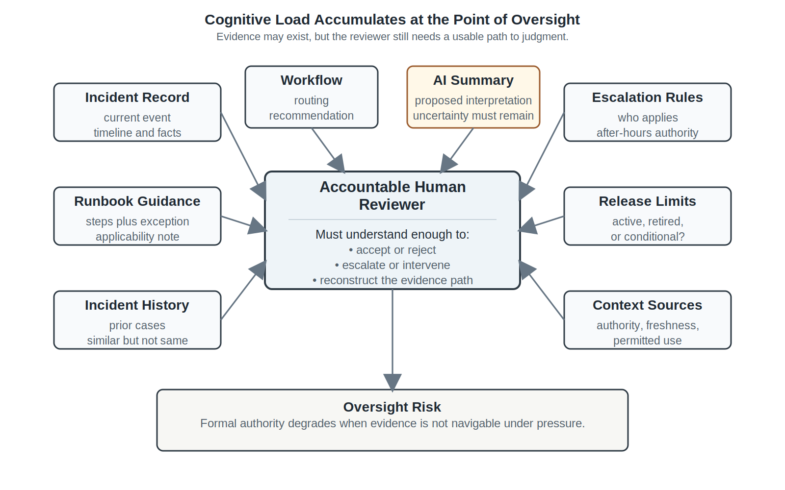
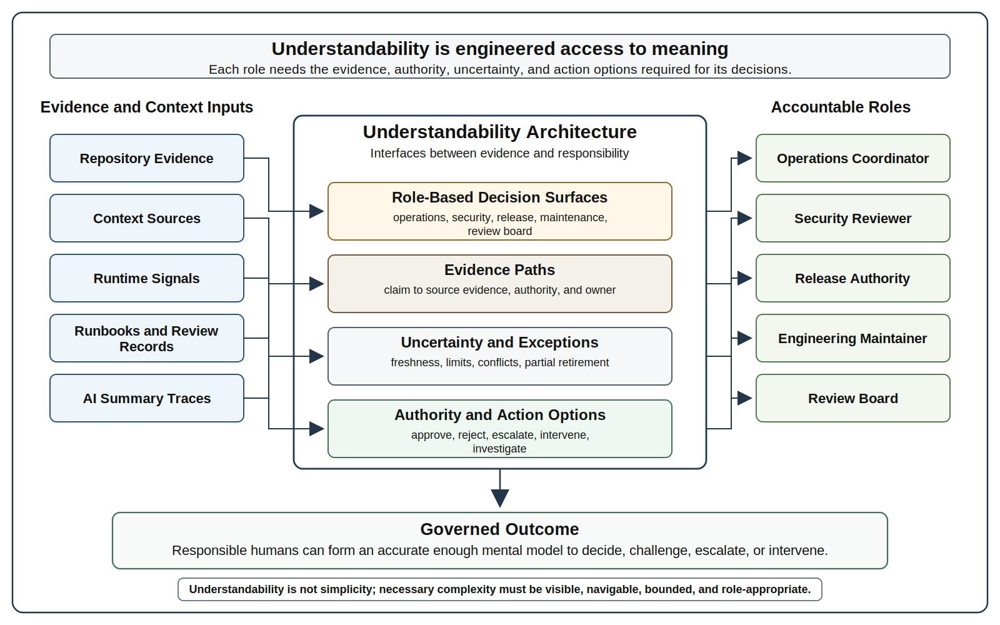
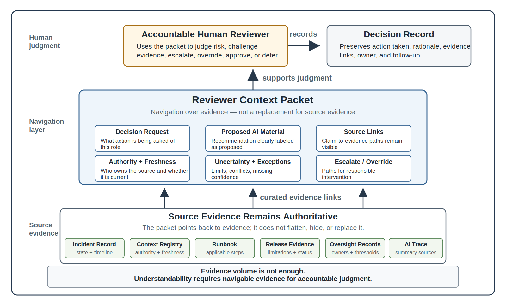
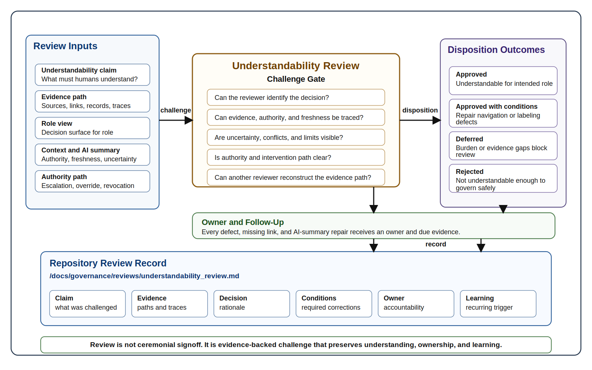

# Chapter 36 Complexity, Cognitive Load, and Understandability
---

### Chapter Governing Line

> Humans cannot govern what they cannot understand.

---

## Opening Scenario: The Evidence Existed, but Nobody Could See the Whole Picture

The incident review should have been straightforward.

The Campus Operations and Incident Coordination Platform had preserved everything. The original incident record existed. The escalation history was available. Runbook versions had been retained. AI-generated summaries were linked. Context retrieval logs existed. Prior incidents were searchable. Approval records had been preserved. Release limitations were documented. Oversight decisions were recorded. Nothing had been lost.

Yet the review team struggled to answer a simple question.

Why had the recommendation been accepted?

The evidence existed, but it was scattered across workflow records, context packages, repository artifacts, review documents, governance logs, incident history, and operational updates. Each artifact was individually understandable. The system as a whole was not.

The problem was not missing evidence.

The problem was cognitive load.

Chapter 35 established that human oversight cannot be reduced to approval clicks, passive monitoring, or ceremonial signoff. Oversight requires accountability, authority, escalation paths, intervention rights, audit evidence, and the ability to stop, override, revoke, or investigate intelligent-system behavior when risk demands it.

That is necessary. It is not sufficient.

---

## 36.1 The Oversight Problem After Human Oversight Architecture

Lakeside Metropolitan University has completed a Human Oversight Readiness Review for the Campus Operations and Incident Coordination Platform, or COICP. The result looks mature. Oversight roles are named. Escalation authority is defined. Intervention paths exist. The review board has approved human review thresholds for agentic workflow recommendations. The repository now contains a human oversight policy, an accountability matrix, an escalation authority matrix, an intervention playbook, and oversight review records under paths such as:

- `/docs/governance/human_oversight/human_oversight_policy.md`
- `/docs/governance/human_oversight/accountability_matrix.md`
- `/docs/governance/human_oversight/escalation_authority_matrix.md`
- `/docs/governance/human_oversight/intervention_playbook.md`
- `/docs/governance/reviews/human_oversight_readiness_review.md`

On paper, LMU has not left oversight to chance.

Then a real operational decision tests the system.

A campus building reports an access-control disruption during an evening event. The incident is not catastrophic, but it is time sensitive. The COICP workflow collects the incident record, prior access-control notes, current escalation rules, relevant runbook steps, an AI-generated routing recommendation, a summary of a prior postmortem, the current release limitation record, and a context freshness notice from the context engineering register. The agentic workflow prepares a reviewer packet for a campus operations coordinator.

The reviewer is accountable. The reviewer has authority. The reviewer can escalate. The reviewer can stop the prepared action. The reviewer can override the recommendation.

But the reviewer cannot quickly understand the evidence.

The incident timeline is in one repository location. The runbook is current, but its applicability depends on an exception note. The AI summary mentions a prior incident, but that incident involved a different building and a different public safety liaison. The context source registry shows that one policy source is authoritative, but the summary does not make that distinction obvious. The release limitation appears to be active, but the linked release governance record says it is partially retired. The escalation authority matrix names two roles, but the reviewer does not know which role applies to after-hours events. The dashboard shows a warning signal, but the warning is not linked to the underlying evidence. The agentic workflow recommendation is plausible, but the path from evidence to recommendation is hard to reconstruct under time pressure.

Nobody removed human oversight. Nobody bypassed governance. Nobody granted the AI unbounded authority. The problem is subtler and more dangerous: the human is formally in control but cognitively overloaded.

This is how oversight theater can return through the back door. It no longer appears as a missing approval gate. It appears as an approval gate surrounded by more evidence than a human can responsibly process. It appears as documentation that exists but cannot be navigated. It appears as dashboards that display signals without decision meaning. It appears as AI summaries that feel helpful but hide uncertainty. It appears as review packets that contain everything except a usable path to judgment.

A mature intelligent system does not become trustworthy merely by producing more evidence. Evidence must be understandable enough to support action.

The engineering question is not only, "Did the system leave evidence?" The next question is, "Can an accountable human use that evidence when it matters?"

*Figure 36.1 — Cognitive Load and Oversight Burden Map*

---

## 36.2 Understandability Is a Governance Requirement

Understandability is often treated as a documentation issue. Teams say the documentation needs cleanup. They say the diagrams are out of date. They say the README needs work. They say the dashboard needs better labels. Those statements may be true, but they are too small for intelligent systems that participate in operational workflows.

In trustworthy intelligent systems, understandability is a governance requirement.

A system is understandable when the people who are responsible for it can form an accurate enough mental model to make the decisions their roles require. That phrase matters: accurate enough, mental model, decisions, roles. Understandability does not mean that every person understands every implementation detail. It means that each accountable role can understand the aspects of the system needed to act responsibly.

A campus operations coordinator may need to understand the incident state, routing recommendation, escalation path, affected stakeholders, and whether a prepared communication is safe to approve. The coordinator does not need to inspect model internals. A security reviewer may need to understand data exposure, role permissions, audit events, and sensitive-context boundaries. A release authority may need to understand residual risks, known limitations, rollback options, monitoring expectations, and unresolved governance conditions. An engineering maintainer may need to understand dependencies, ADRs, failure modes, test evidence, and implementation consequences. A review board may need to understand how all of those views fit together.

The same system therefore requires multiple decision surfaces. A decision surface is the role-specific view of evidence, authority, uncertainty, and action needed for a human to make or challenge a decision. It is not merely a dashboard. It is not merely a report. It is a designed interface between evidence and responsibility.

For COICP, an understandability architecture might include:

- `/docs/architecture/understandability/understandability_architecture.md`
- `/docs/architecture/understandability/role_based_decision_surfaces.md`
- `/docs/architecture/understandability/complexity_map.md`
- `/docs/governance/evidence_navigation/decision_surface_inventory.md`
- `/docs/governance/evidence_navigation/evidence_navigation_guide.md`
- `/docs/governance/evidence_navigation/reviewer_context_packet.md`

These artifacts do not exist to satisfy paperwork. They exist because accountable humans need engineered access to meaning. They need to know what claim is being made, what evidence supports it, what authority applies, what context was used, what uncertainty remains, what exceptions matter, what action is proposed, who owns the decision, and where to go next.

This is why understandability belongs inside governance. Governance defines authority, boundaries, approvals, escalation, auditability, and accountability. But governance becomes hollow if the people inside those roles cannot understand what they are governing. A policy that cannot be applied under realistic conditions is not effective governance. A review gate that produces confusion is not a control. A repository that stores evidence nobody can navigate is not engineering memory. A summary that removes source distinctions is not explanation.

The chapter's governing line follows directly: humans cannot govern what they cannot understand.

This line does not excuse humans from learning. It does not lower the bar for professional engineering competence. It raises the bar for system design. A trustworthy engineering team must design systems, evidence structures, reviews, runbooks, dashboards, summaries, and repository navigation so that responsible humans can do responsible work.

Understandability is not the same as simplicity. Some systems must be complex because the enterprise is complex. COICP coordinates campus operations, incident intake, facilities response, public safety liaison work, stakeholder communication, release governance, context controls, AI assistance, and review-board decisions. Pretending that such a system is simple would be dishonest.

The objective is not to eliminate complexity. The objective is to ensure that complexity remains governable. Complexity that cannot be explained, navigated, challenged, reviewed, or reconstructed eventually becomes operational risk regardless of how technically correct the implementation may be.

Unnecessary complexity should be removed. Necessary complexity should be explained. Hidden complexity should be surfaced. Dangerous complexity should be governed. Operational complexity should leave evidence. AI-assisted complexity should remain reviewable.

That is understandability as governance.

*Figure 36.2 — Understandability Architecture*

---

## 36.3 Complexity Sources in Intelligent Systems

Complexity in intelligent systems rarely comes from one place. It accumulates.

Some complexity is technical: services, databases, dependencies, APIs, authentication, event flows, integration points, queue behavior, failure modes, deployment environments, and runtime signals. Some complexity is architectural: component boundaries, systems of record, ownership, interfaces, data authority, fallback paths, model boundaries, tool authority, and control planes. Some complexity is operational: runbooks, incidents, escalations, stakeholders, support roles, time pressure, degraded modes, release limitations, and recovery steps. Some complexity is governance-related: approvals, risk acceptance, audit expectations, privacy rules, delegated authority, oversight requirements, revocation conditions, and review-board decisions. Some complexity is contextual: policies, historical incidents, postmortems, current records, stale records, generated summaries, authoritative sources, advisory sources, and source freshness. Some complexity is AI-specific: nondeterministic behavior, model updates, prompt changes, context retrieval, tool calls, generated explanations, confidence cues, evaluation decay, and invisible assumptions.

No single diagram captures all of that. No single README solves it. No single dashboard makes it governable.

The first mature act is to name the sources of complexity. The second is to decide which complexity is necessary, which is accidental, which is hidden, which is dangerous, which is poorly surfaced, and which roles are affected.

At LMU, COICP did not become difficult to understand overnight. The difficulty accumulated through responsible progress. The team added observability in Chapter 25. It added runbooks in Chapter 26. It strengthened security governance in Chapter 27. It classified AI delegation in Chapter 28. It analyzed reliability and failure modes in Chapter 29. It created incident response evidence in Chapter 30. It formalized release governance in Chapter 31. It built trust and transparency records in Chapter 32. It added agentic workflow authority controls in Chapter 33. It added context engineering controls in Chapter 34. It added human oversight architecture in Chapter 35.

Each addition was reasonable. Together, they create cognitive load.

This is an important lesson. Complexity is not always a sign that earlier chapters failed. Sometimes complexity is the cost of doing mature engineering. The mistake is not the existence of evidence, governance, review records, and operational controls. The mistake is allowing those controls to become unmanageable, unsearchable, unprioritized, stale, disconnected, or role-blind.

A COICP complexity map should identify at least the following categories:

- workflow complexity: incident intake, routing, escalation, notification, closure, exception handling;
- authority complexity: who can approve, override, escalate, defer, revoke, or release;
- context complexity: which sources are authoritative, current, stale, advisory, restricted, or generated;
- AI complexity: where AI drafts, summarizes, recommends, retrieves, calls tools, or prepares action;
- repository complexity: where requirements, ADRs, PRs, tests, releases, incidents, reviews, runbooks, and governance records live;
- operational complexity: how operators detect, diagnose, communicate, mitigate, recover, and learn;
- review complexity: which review boards have already approved what, with what conditions and unresolved items;
- stakeholder complexity: which departments, offices, roles, and user groups are affected.

A useful artifact is `/docs/architecture/understandability/complexity_map.md`. Another is `/docs/governance/evidence_navigation/decision_surface_inventory.md`. These are not meant to freeze the system into a static picture. They help the team ask better questions. What does each role need to see? Which evidence paths are too long? Which decision depends on too many hidden assumptions? Which AI-generated explanation hides important source distinctions? Which review-board decision is hard to reconstruct? Which runbook step assumes knowledge only one person has?

Complexity becomes dangerous when it hides from the people who are accountable for it.

This is where systems thinking matters. The system is larger than code, and the complexity is larger than architecture diagrams. It includes people, policies, operational history, evidence structures, runtime signals, AI behavior, governance decisions, and organizational memory. A trustworthy engineer does not simply say, "The system is complicated." The trustworthy engineer asks, "Complicated for whom, under what decision, with what evidence, under what time pressure, and with what consequence?"

That question turns complexity into an engineering object.

---

## 36.4 Cognitive Load and Role-Specific Decision Surfaces

Cognitive load is the burden placed on human attention, memory, interpretation, and judgment. In software engineering, cognitive load usually appears as code complexity, unclear architecture, poor naming, confusing abstractions, or scattered documentation. In intelligent systems, the problem expands. The burden includes understanding AI output, context provenance, workflow authority, governance constraints, runtime signals, evidence history, incident records, and review-board conditions.

The mistake is to assume that more information means better oversight. More information can help, but only if it is organized for the decision being made. Otherwise, more information becomes noise.

A reviewer facing a COICP escalation recommendation does not need every artifact in the repository. They need the evidence relevant to that recommendation. They need the current incident state. They need the source of the recommendation. They need the context sources used. They need freshness and authority markers. They need the escalation rule. They need known limitations. They need the proposed action. They need uncertainty. They need the override path. They need the communication constraint. They need links to deeper evidence if the decision becomes contested.

That is a reviewer context packet.

A reviewer context packet is not an AI-generated summary alone. It is a structured evidence package designed for accountable human judgment. It can include generated summaries, but those summaries must preserve source links, authority distinctions, freshness indicators, and uncertainty. The packet should not hide the path back to evidence.

A COICP reviewer context packet might include:

- decision being requested;
- role of the reviewer;
- current workflow state;
- AI-generated recommendation, clearly labeled as proposed material;
- context sources used, with authority and freshness markers;
- known limitations affecting the decision;
- relevant runbook section;
- escalation and override options;
- privacy or communication constraints;
- links to incident record, release evidence, context registry, and oversight record;
- confidence limitations or uncertainty notes;
- required approval or follow-up evidence.

Repository support may live under:

- `/docs/governance/evidence_navigation/reviewer_context_packet.md`
- `/docs/governance/evidence_navigation/role_based_decision_surface.md`
- `/docs/governance/evidence_navigation/evidence_navigation_guide.md`
- `/docs/governance/evidence_navigation/source_trace_template.md`
- `/docs/governance/human_oversight/oversight_workload_register.md`

The purpose is not to reduce review to template completion. The purpose is to lower unnecessary cognitive burden so human judgment can focus on risk, evidence, authority, uncertainty, and consequence.

Different roles need different surfaces. A release authority needs release evidence, risk disposition, limitation status, rollback plan, monitoring expectations, and stakeholder impact. An incident coordinator needs operational state, timeline, runbook steps, escalation path, and communications. A security reviewer needs permissions, data exposure, audit trail, and privacy boundaries. A maintainer needs dependencies, ADRs, tests, PR history, failure modes, and implementation risk. A review board needs a synthesis that makes the relationships between those views visible.

This is not hiding complexity. It is making complexity usable.

Role-specific decision surfaces also prevent two opposite failures. The first failure is documentation overload: everything is available but nothing is prioritized. The second failure is summary theater: a short summary feels easy but removes the evidence needed for real judgment. A trustworthy decision surface sits between those failures. It provides enough structure to support responsible action and enough traceability to prevent blind trust.

*Figure 36.3 — Evidence Navigation and Reviewer Context Package*

---

## 36.5 Repository Evidence Navigation

Repository-centered engineering has been a core doctrine of this book from the construction chapters forward. The repository is the engineering system of record. It preserves requirements, issues, branches, commits, pull requests, reviews, tests, CI evidence, ADRs, release records, runbooks, incidents, postmortems, AI-use evidence, security governance, reliability analysis, release authority, transparency records, agentic workflow controls, context engineering records, and human oversight evidence.

That doctrine remains true. Chapter 36 adds a sharper requirement: the repository must be navigable by humans who are trying to understand the system under realistic conditions.

A repository can contain the right evidence and still fail as an understanding system. Evidence can be scattered. File names can be inconsistent. Older records can look current. Review records can omit conditions. ADRs can lack links to later incidents. Runbooks can refer to dashboards without explaining what signals mean. AI-use logs can preserve prompts without explaining what was accepted, rejected, or verified. Release notes can record limitations without showing whether those limitations are active, retired, or superseded. Context engineering records can list sources without showing how reviewers should use them.

The repository is not trustworthy because it is large. It is trustworthy when it helps humans reconstruct engineering truth.

For Chapter 36, repository evolution moves from evidence preservation to evidence navigation. The team must ask whether a future reviewer can move from a decision claim to its supporting evidence without depending on tribal memory. Can the reviewer trace a recommendation to context sources? Can the reviewer find the current runbook? Can the reviewer distinguish retired limitations from active ones? Can the reviewer determine who owns a risk? Can the reviewer see which AI output was accepted and why? Can the reviewer reconstruct what happened during an incident? Can the reviewer understand whether a review-board condition was satisfied?

Useful repository artifacts include:

- `/docs/governance/evidence_navigation/evidence_navigation_guide.md`
- `/docs/governance/evidence_navigation/reviewer_context_packet.md`
- `/docs/governance/evidence_navigation/decision_surface_inventory.md`
- `/docs/governance/evidence_navigation/source_trace_template.md`
- `/docs/operations/repository_memory/evidence_index.md`
- `/docs/operations/repository_memory/artifact_freshness_report.md`
- `/docs/architecture/understandability/understandability_architecture.md`
- `/docs/architecture/understandability/complexity_map.md`

The evidence index is especially important. It should not become a generic table of contents. It should organize evidence by engineering question. What proves the system was ready for release? What evidence supports AI delegation? What records define current context authority? What runbooks govern incident response? What limitations remain active? What postmortems created follow-up actions? What review decisions constrained later work?

A mature evidence index might group evidence by lifecycle claim:

- Requirements claim: stakeholder need, ambiguity resolution, acceptance criteria, traceability.
- Architecture claim: systems of record, ADRs, authority boundaries, fallback paths.
- Implementation claim: issue-linked PRs, reviews, tests, AI-use disclosure.
- Release claim: test evidence, known limitations, rollback plan, release approval.
- Operational claim: observability, runbooks, incident records, postmortems, stabilization evidence.
- AI governance claim: delegation matrix, tool authority, context sources, oversight records, revocation paths.
- Trust claim: transparency records, limitation disclosure, accountability, governance conditions.

This is how repository-centered engineering becomes understandability engineering.

The repository should also help manage freshness. A stale artifact can be worse than a missing artifact because it creates false confidence. Chapter 34 established context freshness for AI behavior. Chapter 36 extends the same concern to human understanding. If a reviewer sees an outdated runbook, retired release limitation, or superseded escalation matrix, the problem is not merely documentation quality. It is a governance risk.

Artifact freshness should be visible. Superseded records should point to current records. Review records should include decision status. Limitations should be active, mitigated, retired, or transferred. Runbooks should identify last review date and owner. Context sources should show authority and effective dates. Reviewer context packets should include freshness indicators rather than forcing humans to infer them.

Everything important leaves evidence. Chapter 36 adds: important evidence must be navigable.

---

## 36.6 AI Summaries, Explanations, and the Risk of False Understanding

AI can help humans understand complex systems. It can summarize long incident timelines. It can compare release records. It can extract action items from postmortems. It can assemble reviewer packets. It can explain a runbook. It can identify potentially relevant ADRs. It can draft an operational briefing. It can translate raw logs into a more readable narrative. Used carefully, AI can reduce cognitive load and improve navigation.

But AI can also create false understanding.

A summary can sound coherent while flattening source authority. It can make stale context appear current. It can omit uncertainty. It can merge a policy, a runbook, a postmortem lesson, and a generated interpretation into one smooth paragraph. It can overemphasize recent evidence. It can understate exceptions. It can hide conflicts. It can replace a difficult evidence path with a confident narrative that no one challenges.

That is not understanding. That is cognitive ease.

Cognitive ease is the feeling that something is clear because it is easy to read. In intelligent systems, cognitive ease can be dangerous. The reviewer feels informed, but the source structure has disappeared. The output feels complete, but important uncertainty has been removed. The explanation feels authoritative, but it may be an interpretation of evidence rather than evidence itself.

The principle remains: AI proposes; engineers verify.

In Chapter 36, that doctrine applies not only to code, requirements, tests, and workflow actions. It applies to explanations. An AI-generated summary is proposed understanding. It is not verified understanding.

LMU should therefore define rules for AI-generated summaries used in oversight, incident response, release governance, or review-board decisions. Those rules may live in:

- `/docs/governance/ai_governance/ai_summary_review_rules.md`
- `/docs/governance/evidence_navigation/summary_source_trace.md`
- `/docs/governance/context_engineering/context_source_registry.md`
- `/docs/governance/context_engineering/context_freshness_and_versioning_register.md`
- `/docs/governance/human_oversight/reviewer_context_packet.md`

A trustworthy AI summary should preserve source links. It should distinguish original evidence from interpretation. It should identify source authority. It should mark uncertainty. It should surface conflicts. It should show freshness. It should avoid hiding known limitations. It should say when evidence is missing. It should invite verification for consequential decisions.

For example, a poor AI summary says:

"The prior incident suggests the current access-control disruption should be escalated to public safety."

A better AI-assisted reviewer packet says:

"The current incident involves after-hours building access disruption. One prior incident in `/docs/operations/incidents/2026-02-access-control-delay.md` involved a similar symptom but a different building and a different escalation rule. The active escalation authority matrix in `/docs/governance/human_oversight/escalation_authority_matrix.md` should be checked before approving escalation. The related release limitation in `/docs/release_evidence/known_limitations.md` is marked partially retired as of the last release governance record. This recommendation is proposed and requires human review."

The second version is less sleek. It is more trustworthy.

This is a general pattern. Good explanations preserve friction where friction matters. They do not make risk disappear for the sake of readability. They help the human see where judgment is required.

AI can reduce cognitive load by helping humans navigate evidence. It must not reduce cognitive load by removing the evidence that makes judgment possible.

The mature goal is assisted understanding rather than delegated understanding. AI may help humans discover, organize, compare, summarize, and explain evidence, but responsibility for judgment remains tied to the evidence itself. A system that replaces evidence with narrative convenience may feel easier to use while becoming harder to govern.

---

## 36.7 Understandability Review

Chapter 36 introduces the Understandability Review.

The purpose of the Understandability Review is to determine whether an intelligent workflow, evidence package, repository structure, operational record set, AI-generated explanation, or governance process is understandable enough for accountable humans to govern, operate, review, intervene, recover, and steward it.

This review inherits earlier review mechanisms. From Context Engineering Review, it inherits source authority, freshness, provenance, context boundaries, and permitted use. From Human Oversight Readiness Review, it inherits accountability ownership, decision authority, escalation authority, override authority, oversight evidence, and operational responsibility. Understandability Review asks the next question: can the humans who inherit those responsibilities actually understand enough to act?

An Understandability Review should not ask whether the documentation is long. It should not ask whether the diagrams look polished. It should not ask whether the AI summary sounds clear. It should ask whether understanding is possible under realistic conditions.

Core review questions include:

- Can the accountable reviewer identify the decision being made?
- Can the reviewer see what evidence supports the decision?
- Can the reviewer distinguish authoritative sources from advisory or generated material?
- Can the reviewer identify which context sources were used and whether they are current?
- Can the reviewer see uncertainty, conflicts, limitations, and exceptions?
- Can the reviewer identify the relevant authority path?
- Can the reviewer determine who owns the outcome?
- Can the reviewer find the override, escalation, or revocation path?
- Can the reviewer reconstruct the decision later from repository evidence?
- Can a different qualified reviewer reach the same evidence path without relying on private tribal knowledge?

Evidence for the review may include:

- `/docs/architecture/understandability/understandability_architecture.md`
- `/docs/architecture/understandability/complexity_map.md`
- `/docs/governance/evidence_navigation/decision_surface_inventory.md`
- `/docs/governance/evidence_navigation/reviewer_context_packet.md`
- `/docs/governance/evidence_navigation/evidence_navigation_guide.md`
- `/docs/governance/ai_governance/ai_summary_review_rules.md`
- `/docs/governance/evidence_navigation/summary_source_trace.md`
- `/docs/governance/reviews/understandability_review.md`

The review should produce an explicit disposition. Possible outcomes include:

- Approved: evidence and decision surfaces are understandable enough for the intended role.
- Approved with conditions: specific navigation, labeling, freshness, summary, or role-view defects must be corrected.
- Deferred: cognitive burden or evidence gaps prevent responsible review.
- Rejected: the system or workflow is not understandable enough to govern safely.

The review should also assign owners. If a complexity map is missing, someone owns it. If a reviewer context packet hides source authority, someone fixes it. If an AI summary collapses uncertainty, someone revises the summary rules. If an ADR is not linked to current operational evidence, someone connects it. If a runbook cannot be used under incident pressure, someone repairs it.

Review is how teams think together. Understandability Review is how teams think about whether future thinking will still be possible.

A system may be technically correct, operationally functional, and governance compliant while still failing the understandability test. If accountable humans cannot reconstruct decisions, navigate evidence, interpret consequences, or exercise judgment under realistic conditions, the system has accumulated more complexity than the organization can responsibly govern.

*Figure 36.4 — Understandability Review Gate*

---

## 36.8 Operational Takeaways and Exercises

Chapter 36 is not asking teams to make intelligent systems easy. It is asking teams to make them governable by humans.

The operational takeaways are straightforward:

- Humans cannot govern what they cannot understand.
- Formal oversight fails when cognitive load exceeds human capacity.
- More evidence is not always more understanding.
- Documentation is not enough; evidence must be navigable by role and decision.
- AI-generated summaries are proposed understanding, not verified understanding.
- Good explanations preserve source links, uncertainty, authority, and limits.
- Necessary complexity should be surfaced; unnecessary complexity should be removed.
- Repository-centered engineering must evolve from evidence preservation to evidence navigation.
- Understandability is a condition of accountability, reviewability, recoverability, and stewardship.

---

## 36.9 Exercises

### Exercise 1: Build a Complexity Map

Create a complexity map for a COICP intelligent workflow. Include workflow steps, context sources, AI-assisted actions, governance rules, review records, incident history, release limitations, repository evidence, and human roles.

The complexity map should be stored at:

`/docs/architecture/understandability/complexity_map.md`

This exercise reinforces understandability, reviewability, governability, operational visibility, and human oversight by demonstrating that complexity extends beyond code into organizational, operational, repository, governance, and AI-assisted interactions.

### Exercise 2: Create a Reviewer Context Packet

Design a reviewer context packet for a COICP decision such as approving an escalation recommendation, authorizing a stakeholder communication, or accepting a runbook deviation.

The packet should identify:

- claim under review
- supporting evidence
- source authority
- freshness
- uncertainty
- known limitations
- requested action
- escalation path
- repository references

The packet should be stored at:

`/docs/governance/evidence_navigation/reviewer_context_packet.md`

This exercise reinforces accountability, reviewability, traceability, and human oversight by showing how evidence must be structured to support responsible decisions.

### Exercise 3: Audit an AI-Generated Summary

Review an AI-generated summary and compare it against the original evidence sources.

Identify:

- omitted uncertainty
- flattened source authority
- stale context
- unsupported claims
- missing limitations

Revise the summary to preserve source traceability and uncertainty disclosure.

Relevant repository artifacts include:

`/docs/governance/ai_governance/ai_summary_review_rules.md`

`/docs/governance/evidence_navigation/summary_source_trace.md`

This exercise reinforces AI governance, context control, reviewability, and operational visibility by demonstrating that AI-generated explanations require verification.

### Exercise 4: Conduct an Understandability Review

Perform an Understandability Review for a COICP workflow, decision package, or evidence collection.

Determine whether a designated reviewer can reasonably:

- understand the evidence
- navigate the repository artifacts
- identify uncertainty
- evaluate consequences
- exercise oversight authority

The review record should be stored at:

`/docs/governance/reviews/understandability_review.md`

This exercise reinforces governability, accountability, review-board judgment, and human oversight by treating understandability as a governance requirement rather than a convenience.

### Exercise 5: Repair an Evidence Navigation Failure

Given a collection of requirements, ADRs, pull requests, tests, runbooks, release notes, incident records, and governance decisions, create an evidence navigation guide and repository memory index that would allow a future reviewer to reconstruct the engineering history efficiently.

Relevant repository artifacts include:

`/docs/governance/evidence_navigation/evidence_navigation_guide.md`

`/docs/operations/repository_memory/evidence_index.md`

This exercise reinforces repository-centered engineering, evidence navigation, reviewability, and organizational memory. It also prepares the reader for Chapter 37, where the repository becomes operational engineering memory and a governed AI context substrate.

---

## 36.10 Trustworthiness Mapping

Chapter 36 strengthens several trustworthiness pillars directly.

Human Oversight is primary because oversight is meaningful only when humans can understand evidence, authority, uncertainty, and intervention options. If the reviewer cannot understand, the reviewer cannot govern.

Reviewability is primary because systems must be inspectable and challengeable by appropriate roles. Understandability Review tests whether review is possible, not merely whether review records exist.

Operational Visibility is primary because runtime and operational state must be visible in a way that supports diagnosis and action. Logs, metrics, traces, dashboards, incident timelines, action logs, and reviewer packets must help humans reason, not merely record signals.

Governability is primary because authority, escalation, approval, override, and revocation depend on humans understanding what they control. A governance structure that cannot be understood under pressure is brittle.

Traceability is secondary but essential. Understanding depends on evidence chains that connect claims to sources: requirements, ADRs, PRs, tests, release notes, incident records, context registries, review records, and operational evidence.

Recoverability is secondary because recovery depends on operators understanding failure state, runbook steps, rollback options, and verification evidence. A recovery path that cannot be understood during stress is not a reliable recovery path.

Accountability is secondary because named humans can own outcomes only when they can reason from evidence. Accountability without understandability becomes blame, not governance.

This chapter also protects against checklist theater. A team might point to documentation, dashboards, review records, or AI summaries and claim that understanding exists. Chapter 36 refuses that shortcut. The question is not whether artifacts exist. The question is whether accountable humans can use them to make, challenge, explain, and reconstruct decisions.

---

## 36.11 Closing: From Understandability to Repository-Centered Operational Engineering

Chapter 36 began with a troubling discovery: LMU had improved oversight, but oversight still strained under cognitive load. The chapter then reframed understandability as a governance requirement, mapped the sources of complexity, introduced role-specific decision surfaces, advanced repository evidence navigation, challenged AI-generated summaries, and introduced Understandability Review.

The result is a new requirement for trustworthy intelligent systems: evidence must not merely exist. Evidence must be organized into operational memory that humans and intelligent systems can navigate responsibly over time.

That requirement leads directly to Chapter 37.

If Chapter 36 teaches that humans cannot govern what they cannot understand, Chapter 37 teaches that humans cannot understand what the engineering organization fails to preserve, organize, refresh, connect, and steward in the repository.

The next chapter therefore returns to a doctrine that has been present throughout the book and raises it to operational scale: repository-centered engineering. The repository is no longer just construction memory. It is operational memory, governance memory, incident memory, AI context substrate, and stewardship memory.

Chapter 37 will ask whether the repository itself has become trustworthy enough to support long-term operation, review, AI assistance, recovery, governance, and stewardship.
