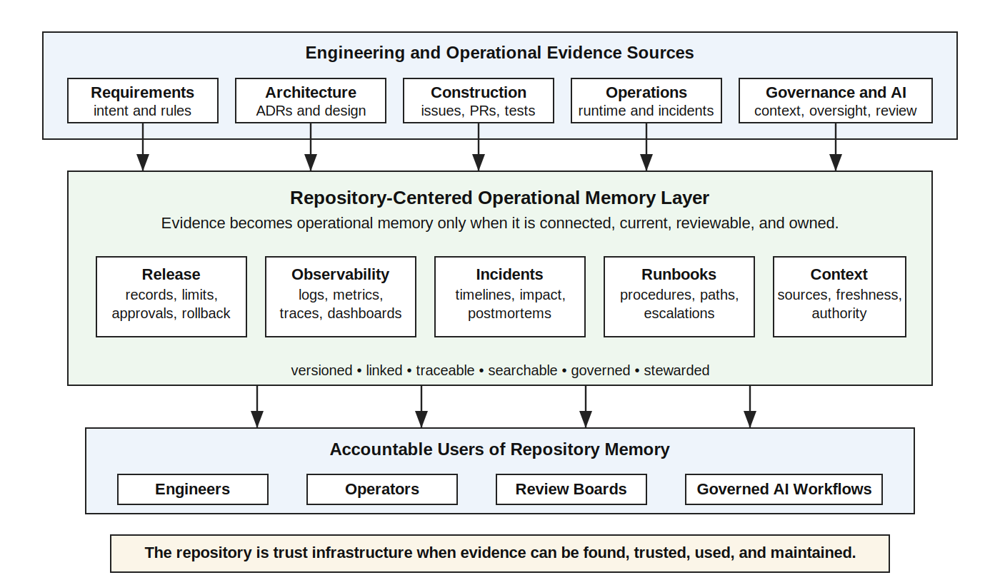
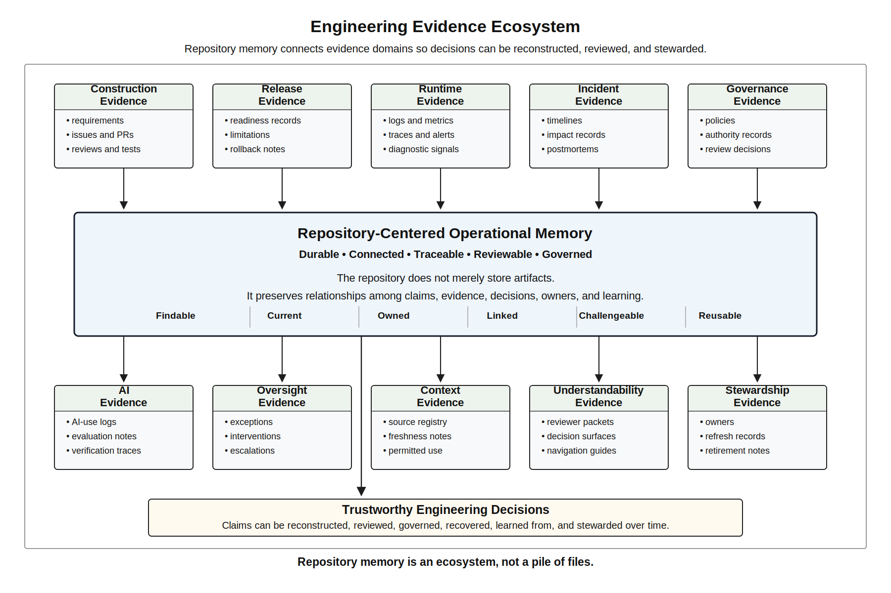
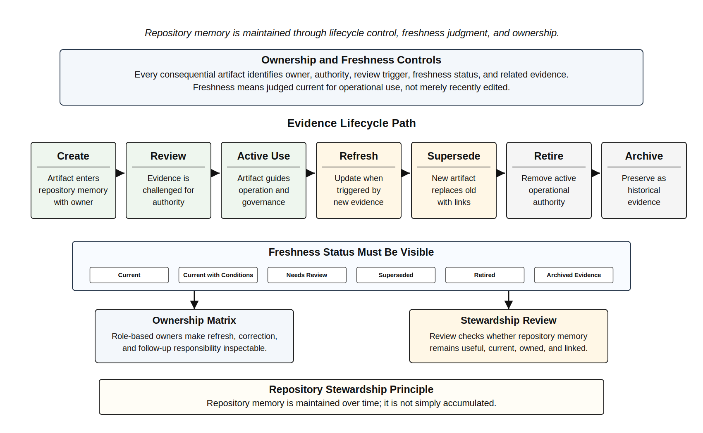
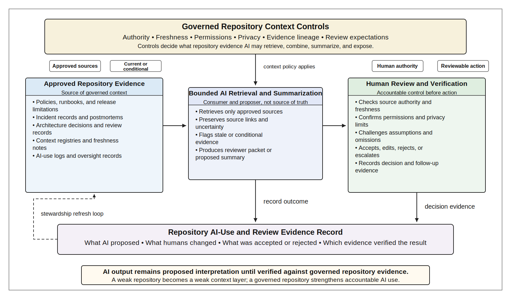
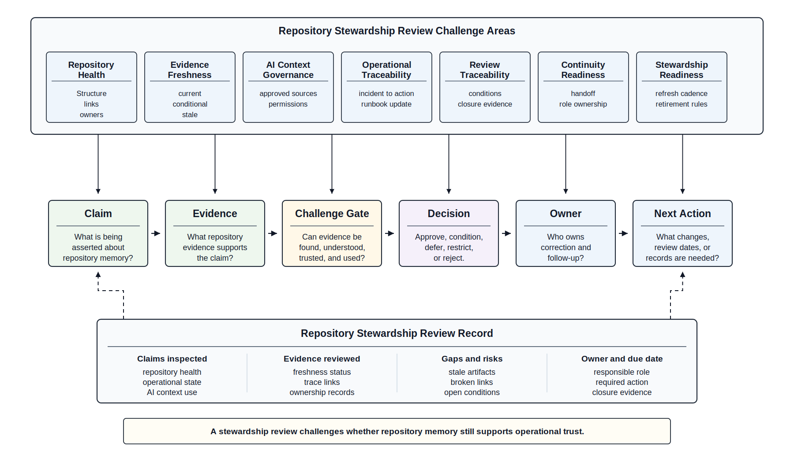

# Chapter 37 Repository-Centered Operational Engineering
---

### Chapter Governing Line

> The repository is not an archive; it is operational memory.

---

## Opening Scenario: The Evidence Existed, but Nobody Knew Where It Lived

The question seemed simple.

A year after the original COICP pilot, Lakeside Metropolitan University was preparing to expand the platform into several additional departments. Before approving the expansion, the review board wanted to revisit an earlier decision involving AI-assisted escalation recommendations.

The board needed to know why the original authority limits had been established.

The evidence existed.

Somewhere.

The original decision had been discussed during a release review. The approval conditions had been updated after an operational incident. A postmortem referenced the issue. The AI governance reviewer had documented concerns about context freshness. An architectural decision record described part of the rationale. Several pull requests referenced related implementation changes. Release notes mentioned temporary restrictions. A runbook contained operational guidance that depended on the decision.

Nothing had been lost.

Yet nobody could answer the question quickly.

The review board searched through repository folders, governance records, incident documentation, release evidence, architecture decisions, pull requests, and operational artifacts. Individual pieces of evidence were easy to find. Reconstructing the complete story was not.

The problem was not missing information.

The problem was missing organizational memory.

Chapter 36 established that humans cannot govern what they cannot understand. The review board now encountered the next consequence of that principle. Understanding depends on evidence, and evidence must remain available long after the people who created it have moved on to other responsibilities.

A trustworthy intelligent system cannot depend on institutional folklore. It cannot depend on a senior engineer remembering why a decision was made. It cannot depend on searching old email threads, meeting notes, private messages, spreadsheets, or personal documents. The evidence required to govern the system must be preserved, connected, discoverable, and maintainable.

That is the repository-centered engineering problem.

For trustworthy intelligent systems, the repository is not merely where code is stored. It is not merely where documentation is placed after the real work is done. It is not a compliance archive.

It is the engineered system of record for operational trust.

The repository is where requirements connect to decisions. It is where architecture connects to implementation. It is where pull requests connect to tests. It is where AI use connects to human verification. It is where release claims connect to evidence. It is where incidents connect to postmortems. It is where runbooks connect to operational reality. It is where governance decisions connect to authority.

Chapter 37 treats repository-centered engineering as operational engineering. The repository is no longer only construction memory. It becomes operational memory, governance memory, AI context substrate, review surface, and stewardship infrastructure.

Evidence that cannot be found, trusted, or refreshed cannot govern the system.

---

## 37.1 The Repository After Understandability

Lakeside Metropolitan University has completed an Understandability Review for the Campus Operations and Incident Coordination Platform, or COICP. The review board did not discover that COICP lacked evidence. The opposite was true. Evidence existed everywhere.

The repository contained runbooks, release records, incident notes, postmortems, context registries, AI-use logs, test evidence, human oversight records, escalation matrices, architecture decisions, and review-board minutes. Dashboards showed runtime signals. Tickets preserved operational requests. Pull requests preserved changes. The AI-assisted workflow produced reviewer packets. On paper, COICP looked mature.

Then a routine after-hours access-control disruption exposed the problem.

A campus operations coordinator needed to reconstruct why an AI-assisted workflow recommended a particular escalation path. The recommendation touched facilities operations, a public safety liaison workflow, a student-event schedule, a release limitation, a prior incident, a context-source freshness note, and an oversight exception. Nothing about the recommendation was obviously reckless. The issue was reconstructability.

The coordinator needed to answer several ordinary questions.

What current rule governed after-hours building access escalation? Was the rule in the current runbook or an older one? Which release limitation still applied? Did the prior incident involve the same building or only a superficially similar situation? Which context source was authoritative? Was the AI-generated summary based on current policy, archived guidance, or a mixture of both? Who approved the exception path? What evidence would the review board inspect if the escalation created stakeholder concern?

Each answer existed somewhere. But the answers did not behave like operational memory.

The incident timeline was under `/docs/operations/incidents/`. The runbook was under `/docs/operations/runbooks/`. The release limitation lived under `/docs/release_evidence/`. The context-source registry was under `/docs/governance/context_engineering/`. The oversight exception lived under `/docs/governance/human_oversight/`. The agent action record was under `/docs/governance/agentic_workflows/`. The relevant review decision lived under `/docs/governance/reviews/`. A prior postmortem was under `/docs/operations/postmortems/`. Several links worked. Some links pointed to superseded records. Some artifacts used older terminology. Some artifacts had owners. Some did not. Some had freshness dates. Others had no obvious review state.

The system did not fail because the team had ignored repository-centered engineering. It failed because the repository had matured from construction evidence into operational evidence without a corresponding operational repository discipline.

This is the difference Chapter 37 makes. Earlier chapters made evidence visible. This chapter makes evidence maintainable.

The mature question is no longer only, "Does evidence exist?" The question is, "Can accountable humans and governed intelligent workflows use the evidence responsibly over time?"

*Figure 37.1 — Repository-Centered Operational Engineering Architecture*

---

## 37.2 Repository-Centered Operational Engineering Defined

Repository-centered operational engineering is the discipline of designing and maintaining the repository as the durable evidence system for operating, governing, reviewing, recovering, learning from, and stewarding a software-intensive or intelligent system.

It extends the repository doctrine introduced earlier in the book. Chapter 9 established the repository as engineering memory during construction: requirements, issues, branches, commits, pull requests, reviews, tests, decisions, and release evidence. Part III extended that memory into operations: postmortems, defects, observability evidence, runbooks, security records, AI delegation records, reliability analysis, incidents, release governance, and transparency evidence. Part IV has added agentic workflow records, enterprise context governance, human oversight evidence, and understandability artifacts.

Chapter 37 consolidates those threads. The repository now carries operational meaning.

A repository-centered operational engineering posture treats the repository as five things at once.

First, it is operational memory. It preserves what happened, what changed, what failed, what was learned, what remains limited, and how the system should be operated. Operational memory includes runbooks, incident records, postmortems, release notes, known limitations, recovery evidence, and diagnostic guidance.

Second, it is governance memory. It preserves authority, approvals, risk acceptance, escalation rules, AI delegation boundaries, context-source ownership, oversight decisions, review-board outcomes, and policy changes. Governance that is not preserved in reviewable form becomes institutional rumor.

Third, it is evidence memory. It links claims to evidence. A release claim should link to tests, reviews, known limitations, defects, rollback notes, and operational readiness. A governance claim should link to policy, authority, review decision, owner, and audit expectation. An AI-assisted recommendation should link to context sources, logs, evaluation evidence, oversight records, and human verification.

Fourth, it is AI context substrate. Intelligent workflows increasingly retrieve, summarize, compare, and assemble repository material. If the repository is stale or ungoverned, AI assistance becomes a confident amplifier of weak memory. If the repository is current, owned, and source-aware, AI assistance has a better chance of producing reviewable, bounded, evidence-linked output.

Fifth, it is organizational continuity infrastructure. People leave teams. Semesters end. Vendors change. Incidents recur. Governance boards rotate. A mature repository allows future humans to reconstruct why the system behaves as it does and what responsibilities come with it.

These roles require design. They do not emerge automatically because files are committed.

Repository-centered operational engineering therefore treats repository structure, evidence relationships, ownership, freshness, traceability, and navigation as engineering concerns rather than administrative concerns. A repository becomes operational memory only when those properties are intentionally maintained over time.

A repository may contain many documents and still fail as operational memory. A repository may have hundreds of commits and still fail as evidence. A repository may have a wiki and still fail as governance. A repository may have AI-readable documents and still fail as trustworthy context.

The repository is not an archive; it is operational memory.

That statement changes how engineers think about repository work. Updating a runbook after an incident is not documentation cleanup. Linking a release decision to a known limitation is not administrative overhead. Recording an AI-use decision is not bureaucratic friction. Retiring stale context is not housekeeping. These are operational engineering acts.

In COICP, repository-centered operational engineering means the repository has a coherent front door. It means a maintainer can locate current runbooks under `/docs/operations/runbooks/`, incident evidence under `/docs/operations/incidents/`, postmortems under `/docs/operations/postmortems/`, release evidence under `/docs/release_evidence/`, AI governance records under `/docs/governance/ai_governance/`, agentic workflow evidence under `/docs/governance/agentic_workflows/`, context governance under `/docs/governance/context_engineering/` and `/docs/governance/context_governance/`, human oversight records under `/docs/governance/human_oversight/`, understandability artifacts under `/docs/architecture/understandability/`, and repository stewardship records under `/docs/governance/repository_stewardship/`.

Those paths matter only because they support evidence. They should not become a directory tour. The point is not that every trustworthy organization uses the exact same folder names. The point is that operational evidence needs durable homes, clear ownership, navigable relationships, and reviewable update paths.

*Figure 37.2 — The Plan Is an Engineering Claim*

---

## 37.3 The Operational Evidence Ecosystem

Operational repository maturity begins when the team stops treating artifacts as isolated documents and starts treating them as evidence relationships.

A runbook is not just a set of steps. It should connect to failure modes, owners, escalation paths, observability signals, rollback procedures, release limitations, and incident records. A postmortem is not just a narrative. It should connect to facts, impact, causes, corrective actions, owners, defects, tests, PRs, monitoring changes, and governance updates. A release readiness record is not just approval. It should connect to requirements, tests, review evidence, known limitations, risk acceptance, rollback, monitoring expectations, and authority. A context-source registry is not just a list. It should connect to source ownership, freshness, authority, access rules, privacy constraints, AI retrieval boundaries, and exception handling.

The operational evidence ecosystem is the network of artifacts that allows a team to move from question to evidence to judgment.

For COICP, the ecosystem might include:

`/docs/governance/repository_stewardship/evidence_inventory.md`

`/docs/governance/repository_stewardship/repository_stewardship_policy.md`

`/docs/governance/repository_stewardship/repository_stewardship_review.md`

`/docs/governance/repository_stewardship/continuity_plan.md`

`/docs/governance/repository_stewardship/organizational_learning_register.md`

`/docs/governance/repository_stewardship/repository_health_dashboard.md`

`/docs/governance/repository_stewardship/knowledge_retention_strategy.md`

`/docs/governance/repository_stewardship/evidence_freshness_register.md`

`/docs/governance/repository_stewardship/evidence_ownership_matrix.md`

These artifacts should not exist because a chapter told a team to create more paperwork. They exist because operational questions need reliable answers.

When a reviewer asks whether a release is safe to expand, the evidence inventory should point to the release governance record, current limitations, defect trends, test evidence, rollback plan, observability evidence, and unresolved risks. When a campus operations coordinator asks whether an AI escalation recommendation used current policy, the repository should expose the approved context sources, freshness state, AI-use record, agent action log, and human oversight decision. When a maintainer asks whether a runbook is current, the freshness register and ownership matrix should identify the owner, last review date, related incidents, and next review trigger.

A mature operational repository supports reconstructability. Reconstructability means that a future engineer can explain a decision, behavior, failure, or change from durable evidence rather than memory. Reconstructability is stronger than documentation. Documentation may describe what the team intended. Reconstructability shows what the team knew, decided, changed, tested, approved, operated, learned, and left unresolved.

This is why repository links matter. A link is not a convenience. It is a claim of relationship. If a postmortem links to a defect, it says the defect is part of the learning record. If a release note links to a risk acceptance record, it says the risk was known and owned. If an AI-use log links to a PR and test evidence, it says generated material was reviewed and verified. If a runbook links to an incident record, it says operational experience changed operational guidance.

Broken links are not cosmetic defects. They are memory failures.

The repository evidence ecosystem should also distinguish current authority from historical evidence. Mature repositories preserve history without confusing history for current policy. An old runbook may be important evidence, but it should not look like the active runbook. A retired context source may explain an older recommendation, but it should not appear as approved context for current AI workflows. A superseded ADR may remain valuable, but the repository must show what replaced it and why.

This is where repository-centered operational engineering differs from simple documentation discipline. Documentation asks whether something is written down. Operational repository engineering asks whether written evidence can support responsible action.

A repository that stores everything but explains nothing is evidence sprawl, not engineering memory.

---

## 37.4 Evidence Lifecycle, Freshness, and Ownership

Evidence decays.

It decays when policies change but context registries are not updated. It decays when runbooks preserve old escalation paths. It decays when release limitations are partially retired but still appear active in summaries. It decays when dashboards change without documentation. It decays when postmortem action items close but linked operational guidance remains stale. It decays when AI-use logs capture generation but not human verification. It decays when ownership changes but artifact owners do not.

The longer a system operates, the more important evidence lifecycle becomes.

An evidence lifecycle defines how an artifact is created, reviewed, approved, used, refreshed, retired, archived, and linked to related evidence. This lifecycle does not need to be heavyweight for every artifact. A low-risk note may need only simple ownership. A governance-sensitive runbook, context source registry, release limitation, AI delegation matrix, or oversight policy requires stronger lifecycle control.

For COICP, evidence lifecycle should be visible in repository artifacts. A runbook under `/docs/operations/runbooks/access_control_escalation_runbook.md` should identify owner, scope, authority, last reviewed date, review trigger, related incidents, and related release limitations. A context registry under `/docs/governance/context_engineering/context_source_registry.md` should identify authoritative sources, source owners, freshness expectations, permitted use, privacy constraints, and retired sources. A release record under `/docs/release_evidence/release_governance_record.md` should identify approved capability, residual risks, known limitations, rollback expectations, monitoring requirements, and follow-up owners.

Freshness is not the same as recent editing. A document can be modified yesterday and still preserve obsolete guidance. A document can be old and still be authoritative if it was reviewed and remains valid. Repository freshness means the artifact has been judged current for its operational role.

A simple repository freshness model can classify artifacts as:

- Current: reviewed and approved for active use.
- Current with conditions: usable, but only under stated limits.
- Needs review: not known to be wrong, but review is due or triggered.
- Superseded: preserved for history but replaced by a newer artifact.
- Retired: no longer operationally valid.
- Archived evidence: retained to explain past decisions, incidents, or releases.

This classification protects humans and AI systems from treating all files as equal. It also protects institutional memory. Retiring evidence should not erase history. It should clarify authority.

Ownership is equally important. Unowned evidence decays faster because no one is responsible for keeping it useful.

Ownership should also survive personnel changes. Trustworthy organizations assign stewardship responsibilities to roles and governance structures rather than relying on specific individuals. Repository memory should remain maintainable even when maintainers, reviewers, operators, or leaders change.

The repository should make ownership inspectable. The artifact itself may include an owner block. The repository may also include an ownership matrix such as:

`/docs/governance/repository_stewardship/evidence_ownership_matrix.md`

That matrix should not become a static chart that no one uses. It should support review. When evidence is stale, the team should know who owns the refresh decision. When an incident reveals a gap, the team should know who owns correction. When a governance review imposes conditions, the team should know who owns the follow-up.

Evidence lifecycle also requires reviewable change paths. Operational artifacts should not be casually edited in ways that erase history or bypass review. Changes to high-impact runbooks, AI delegation boundaries, context source authority, release governance, or oversight policy should leave issue, branch, pull request, review, and approval evidence where appropriate. Not every typo needs a board review. But operational meaning should not change silently.

*Figure 37.3 — Repository Stewardship Lifecycle*

---

## 37.5 Repository as Governed AI Context Substrate

Chapter 34 established that context is control. Chapter 37 adds a sharper operational conclusion: repository quality shapes AI behavior.

AI-assisted workflows do not use "context" in the abstract. They use specific sources: policies, runbooks, incident records, release notes, known limitations, action logs, governance records, architecture decisions, and summaries. When those sources come from the repository, the repository becomes part of the AI control surface.

That makes repository stewardship an AI governance concern.

If COICP uses an AI assistant to prepare reviewer packets, summarize incident history, compare current facts with prior postmortems, identify applicable runbook steps, or assemble escalation options, the assistant’s usefulness depends on the evidence substrate it can access. The AI may be technically capable of retrieval and summarization. That does not mean the retrieved material is current, authoritative, permissioned, complete, or safe to combine.

An AI-generated reviewer packet can hide repository weakness behind fluent language. It may summarize an old release limitation as current. It may treat a historical incident as equivalent to a current one. It may collapse the difference between authoritative policy and advisory guidance. It may omit that a runbook is marked "needs review." It may combine evidence from a retired context source with current operational data. It may produce apparent clarity while weakening actual understanding.

AI context is only as trustworthy as the evidence substrate it is allowed to use.

This does not mean AI should never use repository context. It means repository context must be governed.

A governed AI context substrate should identify approved context sources, source authority, freshness state, permitted retrieval scope, privacy constraints, evidence lineage, and review expectations. For COICP, some of this may live under:

`/docs/governance/ai_context/approved_repository_context_sources.md`

`/docs/governance/ai_context/repository_context_access_policy.md`

`/docs/governance/ai_context/context_freshness_requirements.md`

`/docs/governance/ai_context/ai_context_exception_log.md`

`/docs/governance/context_engineering/context_source_registry.md`

`/docs/governance/context_governance/context_trust_model.md`

`/docs/governance/ai_governance/ai_use_log.md`

These artifacts should answer practical questions. What repository evidence may AI use for reviewer packets? Which sources are authoritative? Which sources may be used only for historical comparison? Which sources contain sensitive data? Which sources require human verification before action? How are stale sources excluded? How are AI summaries linked back to source evidence? How does a reviewer challenge an AI-generated packet?

The repository should also preserve AI-use evidence. If AI assists in drafting a runbook, summarizing a postmortem, preparing a release note, generating a test case, or assembling an incident packet, the team should record what AI proposed, what humans changed, what was accepted, what was rejected, and what evidence verified the result. This may happen through PR disclosure, AI-use logs, review comments, or a dedicated record depending on risk.

The key is that AI output must remain proposed interpretation until verified.

Repository-centered operational engineering therefore strengthens the old doctrine: AI proposes; engineers verify. In Chapter 37, verification includes checking the repository substrate itself. The engineer asks not only whether the AI summary sounds reasonable, but whether the sources are approved, current, linked, permissioned, and correctly represented.

This is where repository quality becomes operational safety. A weak repository does not merely inconvenience maintainers. It can become an unsafe context layer for intelligent workflows.

*Figure 37.4 — Repository as Governed AI Context Substrate*

---

## 37.6 Repository Health, Navigation, and Decision Support

Repository health is operational health.

That does not mean every repository needs perfect formatting, exhaustive documentation, or enterprise knowledge-management tooling. It means the repository must be healthy enough to support the decisions people and intelligent workflows are expected to make.

Repository health has several dimensions.

Navigability asks whether a person can find the current evidence needed for a role or decision. Can a new maintainer find the active runbooks? Can a release authority locate open limitations and risk acceptance records? Can a reviewer find context-source authority? Can an incident responder find the current escalation path? Can a governance board find the latest AI delegation decision?

Link integrity asks whether evidence relationships still work. Do release notes link to tests and known limitations? Do postmortems link to corrective actions? Do runbooks link to incidents and owners? Do AI-use records link to PRs and verification evidence? Do governance reviews link to conditions and follow-up owners?

Freshness asks whether operational artifacts have been reviewed for current use. Is the escalation matrix current? Are context sources current? Are runbooks current? Are release limitations active, partially retired, or superseded? Are dashboards still tied to the signals described in the repository?

Authority clarity asks whether the repository distinguishes current policy, historical evidence, advisory notes, experimental artifacts, and retired material. This is especially important when AI tools retrieve or summarize repository content.

Ownership asks whether every significant artifact has an owner, review cadence, and update trigger. Unowned evidence becomes stale evidence.

Decision support asks whether the repository helps humans act. An evidence inventory that lists files but does not help a reviewer answer operational questions is weak. A repository health dashboard that counts documents but does not identify stale runbooks, broken links, unowned risks, or unresolved review conditions is weak.

A useful repository health dashboard might live at:

`/docs/governance/repository_stewardship/repository_health_dashboard.md`

It should not be a decorative scorecard. It might track high-value signals such as:

- Stale operational artifacts awaiting review.
- Broken evidence links in release, incident, or governance records.
- Unowned artifacts in governance-sensitive areas.
- Active release limitations without next review date.
- Runbooks without recent incident validation.
- Context sources marked needs review but still used by AI workflows.
- AI-generated artifacts lacking human verification evidence.
- Review-board conditions without closed follow-up.
- Postmortem action items without linked PRs, tests, or policy updates.

This kind of dashboard is not about surveillance. It is about operational memory health. It gives the team a way to inspect whether the repository can still support trust.

Navigation should also be role-aware. A campus operations coordinator, engineering maintainer, security reviewer, release authority, and review-board member do not need the same entry point. The repository should support role-specific routes to evidence. The top-level README or evidence index should guide people toward active operational artifacts, not merely present a generic list of directories.

A role-based evidence guide might live at:

`/docs/governance/repository_stewardship/role_based_evidence_guide.md`

For example, an incident responder may need incident intake, runbooks, escalation matrix, observability signals, and communication templates. A release authority may need release evidence, known limitations, defect status, rollback plan, monitoring expectations, and risk acceptance. An AI governance reviewer may need delegation matrix, approved context sources, action logs, AI-use logs, evaluation evidence, and oversight records.

Good repository navigation reduces cognitive load. It does not remove professional judgment. It gives judgment a reliable evidence path.

Chapter 36 taught that understandability is a governance requirement. Chapter 37 shows that repository navigation is one of the mechanisms that makes understandability sustainable.

---

## 37.7 Repository Stewardship Review

Repository-centered operational engineering requires review.

Without review, repository discipline decays into good intentions. Files accumulate. Links break. Owners move. Context stales. AI-generated summaries drift away from source authority. Release decisions remain visible but not current. Postmortem learning does not reach runbooks. Runbook changes do not reach training. Governance conditions remain open. The repository still exists, but operational memory weakens.

Repository Stewardship Review exists to challenge whether a repository genuinely supports operational trust rather than merely storing documents. The review examines whether critical engineering knowledge remains discoverable, understandable, reviewable, and usable by future contributors, operators, reviewers, and stewards.

A repository that preserves artifacts but fails to preserve understanding has not fully preserved organizational knowledge. Stewardship requires more than retention. It requires maintaining the conditions that allow evidence, decisions, operational learning, and engineering intent to remain meaningful over time.

The review should occur at meaningful operational moments: after major releases, after significant incidents, before enabling higher-risk AI workflow authority, during stewardship transitions, and periodically for long-lived systems. It should also occur when the repository becomes a context source for AI-assisted workflows.

Repository Stewardship Review asks questions such as:

- Can the team reconstruct current operational state from repository evidence?
- Are active runbooks current, owned, and linked to incidents or release limitations?
- Are release decisions linked to evidence, risks, known limitations, rollback, and monitoring?
- Are AI-use records linked to human verification and accepted/rejected output?
- Are context sources authoritative, fresh, permissioned, and clearly classified?
- Are oversight records linked to decision authority, escalation, intervention, and audit evidence?
- Are review-board conditions tracked to owners and closure evidence?
- Are retired artifacts clearly marked so humans and AI systems do not treat them as current?
- Are repository evidence paths navigable by the roles that need them?
- Are unresolved risks owned, visible, and connected to future work?
- Does the repository support continuity if key people leave?
- Does the repository support stewardship, or only historical storage?

The review should inspect evidence, not presentation claims. A team should not pass by saying, "We have a folder for that." The review should test whether the evidence can actually be used. A reviewer may choose a recent incident and attempt to trace it from detection to response to postmortem to corrective action to PR to test evidence to runbook update. A reviewer may choose an AI-assisted recommendation and trace it to approved context sources, AI-use logs, human verification, and oversight records. A reviewer may choose a release limitation and determine whether it is still current, owned, monitored, and communicated.

Repository Stewardship Review should produce a record, likely under:

`/docs/governance/repository_stewardship/repository_stewardship_review.md`

or, if the organization keeps review records together:

`/docs/governance/reviews/repository_stewardship_review.md`

The review record should identify claims, inspected evidence, gaps, risk level, owners, conditions, due dates, and follow-up evidence. It should not be a pass/fail ritual. It should improve the repository as operational trust infrastructure.

This review strengthens engineering judgment because it forces the team to reason from evidence relationships. It asks whether claims can be reconstructed. It exposes hidden assumptions. It makes stale evidence visible. It prevents repository work from becoming process theater. It also prepares Chapter 38 because stewardship begins with the ability to maintain operational memory over time.

*Figure 37.5 — Repository Stewardship Review*

---

## 37.8 Failure Modes: Evidence Sprawl, Archive Rot, and Tribal Knowledge

Repository-centered operational engineering exists because repository failure is predictable.

The primary anti-pattern is evidence sprawl. Evidence sprawl occurs when artifacts exist but are scattered, stale, duplicated, inconsistent, unowned, poorly linked, or impossible to use for decisions. It is the repository form of fake traceability and process theater. The team can point to many documents, but no one can reconstruct the operational truth quickly and confidently.

Evidence sprawl often appears in mature-looking organizations. There are folders, dashboards, reports, tickets, meeting notes, review records, and templates. Each artifact may have been reasonable when created. The failure is relational. The artifacts do not connect into a usable evidence system.

Archive rot is related. Archive rot occurs when the repository gradually becomes a museum of old intent. Documents remain, but their operational status becomes unclear. A runbook exists but no one knows if it is current. A release note lists a limitation but no one knows if it was resolved. A context source appears in a registry but has not been refreshed. A governance review imposed conditions but the conditions are not tied to closure evidence. A postmortem action item says "update monitoring" but no link shows whether that happened.

Context decay is the AI-era version of archive rot. If intelligent workflows retrieve from repository evidence, stale repository content becomes stale AI context. A human may notice that a document looks old. An AI summary may not. Worse, the summary may hide age, authority, and uncertainty behind polished prose.

Tribal knowledge dependency is another failure mode. Teams often survive because one or two people know where things are, which documents matter, what is obsolete, and which dashboard is trustworthy. That may work for a while. It is not stewardship. When those people leave, take vacation, change roles, or become overloaded, operational memory collapses.

Tribal knowledge is not a stewardship plan.

Repository theater is another anti-pattern. It occurs when teams create repository structures that look mature but do not affect engineering decisions. There may be folders for governance, operations, AI logs, postmortems, and release evidence, but reviews do not use them, PRs do not update them, incidents do not improve them, and AI workflows do not respect their authority. The repository becomes a decorative compliance layer.

Tool-centered governance is a subtler danger. Teams may believe a repository platform, wiki, issue tracker, or documentation generator solves operational memory. Tools can help. They cannot decide what evidence matters, what authority applies, what risk remains, who owns updates, or how stale context should be retired. Repository-centered engineering is not tool worship. It is evidence stewardship.

These failure modes map directly to the canonical anti-patterns introduced across the book: fake traceability, process theater, unowned risk, hidden AI usage, release by confidence, observability afterthought, and synthetic productivity. Chapter 37 does not introduce a new universe of failure. It shows how old engineering failures reappear when operational evidence is not maintained.

Trustworthy engineering counters these patterns through explicit evidence ownership, freshness rules, reviewable change paths, role-based navigation, source authority classification, AI context governance, repository health checks, and Repository Stewardship Review.

The goal is not a perfect repository. The goal is an honest, navigable, current-enough, owned, reviewable repository that supports responsible action.

Honest engineering is mature engineering.

---

## 37.9 Practicing Operational Repository Engineering

Repository-centered operational engineering becomes real through practice.

Students and early-career engineers often hear repository guidance as a list of chores: update the README, write release notes, link issues, create runbooks, preserve AI-use logs, document incidents. Those tasks matter, but the deeper lesson is professional judgment. The trustworthy engineer asks what evidence a future human will need to review, operate, recover, govern, or change the system.

A practical exercise can begin with an evidence inventory. Students inspect a repository and identify whether key evidence exists, where it lives, who owns it, whether it is current, and what decisions it supports. The result might be placed in:

`/docs/governance/repository_stewardship/evidence_inventory.md`

The exercise should not reward volume. It should reward meaningful relationships. A strong inventory explains how requirements connect to tests, how releases connect to limitations, how incidents connect to postmortems, how runbooks connect to operational signals, how AI-use records connect to review evidence, and how governance decisions connect to owners.

A second exercise can focus on evidence freshness. Students select several operational artifacts and classify them as current, current with conditions, needs review, superseded, retired, or archived evidence. They then justify the classification using repository evidence. The result can update:

`/docs/governance/repository_stewardship/evidence_freshness_register.md`

A third exercise can focus on AI context governance. Students identify which repository artifacts an AI assistant may safely use for summarization or reviewer packet generation. They classify sources by authority, freshness, sensitivity, permitted use, and required human verification. The result can update:

`/docs/governance/ai_context/approved_repository_context_sources.md`

and

`/docs/governance/ai_context/repository_context_access_policy.md`

A fourth exercise can simulate Repository Stewardship Review. One group presents a repository claim: for example, "COICP is ready for expanded AI-assisted escalation recommendations." Another group challenges the claim by tracing repository evidence: release records, AI delegation matrix, context sources, evaluation results, oversight records, runbooks, incident history, and known limitations. The review should produce conditions, owners, and follow-up evidence.

A fifth exercise can ask students to repair evidence sprawl. They receive a deliberately messy repository sample with duplicated runbooks, stale context notes, broken links, unowned risks, AI-generated summaries without source links, and release limitations with unclear status. Their task is not to beautify the repository. Their task is to make it governable.

These exercises reinforce traceability, reviewability, operational visibility, governability, recoverability, accountability, and human oversight. They also prepare students for Chapter 38. Stewardship is impossible if the system’s memory cannot be trusted.

The best student work will not be the longest. It will be the clearest, most navigable, most honest, and most decision-supportive.

---

## 37.10 From Operational Repository to Stewardship

Repository-centered operational engineering changes the meaning of professional responsibility.

A team that treats the repository as operational memory cannot say that engineering ends at merge, release, deployment, or presentation. The repository preserves what the team has obligated itself to maintain. It contains decisions that may need revision, limitations that may need retirement, runbooks that may need validation, context sources that may need refresh, AI boundaries that may need tightening, incidents that may need follow-up, and risks that may need ownership.

That is why Chapter 37 leads directly into stewardship.

Once the repository becomes operational memory, someone must keep that memory alive. Once the repository becomes governance memory, someone must ensure authority records remain current. Once the repository becomes AI context substrate, someone must ensure intelligent workflows do not consume stale or unauthorized evidence. Once the repository becomes organizational continuity infrastructure, someone must ensure future humans can understand, operate, govern, recover, and improve the system.

This is the work of the trustworthy engineer in the AI era.

The repository does not replace human judgment. It preserves the evidence that makes judgment possible. It does not replace review boards. It gives review boards something real to inspect. It does not replace governance. It makes governance durable. It does not make AI trustworthy by itself. It gives AI-assisted workflows a governed context substrate and gives humans a way to verify what AI used. It does not eliminate operational uncertainty. It allows uncertainty to be seen, owned, and revisited.

Chapter 37 began with a reconstruction problem at LMU. A campus operations coordinator needed to know why COICP recommended a particular escalation path. The evidence existed, but the operational memory was weak. By the end of this chapter, the engineering response is clear. COICP needs repository stewardship policy, evidence inventory, freshness register, ownership matrix, repository health dashboard, AI context governance, continuity plan, organizational learning register, and review-board challenge.

Those artifacts are not paperwork. They are the architecture of memory.

Just as architecture determines how software components interact, repository stewardship determines how organizational knowledge survives. Memory that cannot be refreshed, challenged, navigated, reviewed, and transferred eventually ceases to function as operational memory regardless of how much evidence remains stored.

The repository is not an archive; it is operational memory.

But memory alone is not enough. Memory must be maintained. Evidence must be refreshed. Governance must be revisited. Context must be retired or renewed. Lessons must become practice. Intelligent capabilities must be watched over time. Institutional trust must be earned repeatedly.

That is the next step.

Chapter 38 turns repository-centered operational engineering into Engineering Stewardship in the AI Era. It asks what it means to own a trustworthy intelligent system after the initial excitement, after the release, after the incident, after the governance review, and after the original builders have moved on.

Operational memory creates stewardship responsibility.

---

## 37.11 Operational Takeaways

The repository is not an archive; it is operational memory.

Evidence that cannot be found, trusted, or refreshed cannot govern the system.

Repository health is operational health.

AI context is only as trustworthy as the evidence substrate it is allowed to use.

A repository that stores everything but explains nothing is evidence sprawl, not engineering memory.

Tribal knowledge is not a stewardship plan.

The trustworthy engineer preserves the conditions under which future humans can understand and govern the system.

---

## 37.12 Review Questions

1. Can the current operational state of the system be reconstructed from repository evidence?
2. Which artifacts are current, current with conditions, stale, superseded, retired, or archived evidence?
3. Who owns the evidence that supports release, incident response, AI governance, context authority, and human oversight?
4. Which repository evidence may AI-assisted workflows use, and under what conditions?
5. Can a reviewer trace a recent incident from detection through mitigation, postmortem, corrective action, PR, test, runbook update, and closure evidence?
6. Are review-board conditions connected to owners and follow-up evidence?
7. Does the repository reduce cognitive load for accountable roles, or does it create evidence sprawl?
8. What would fail if the most knowledgeable maintainer left tomorrow?

---

## 37.13 Exercises

### Exercise 1: Reconstruct the Decision

Review a repository containing requirements, ADRs, pull requests, release records, incident documentation, governance records, and operational artifacts.

Select a significant operational or governance decision and attempt to reconstruct:

- what decision was made,
- what evidence supported it,
- who approved it,
- what risks were known,
- what limitations remained,
- and what follow-up obligations existed.

Identify any points where repository memory becomes difficult to follow. Determine whether the repository supports reconstructability or relies on tribal knowledge.

---

### Exercise 2: Evaluate Repository Health

Examine a software project repository and evaluate its operational-memory health.

Assess:

- navigability,
- evidence relationships,
- ownership visibility,
- freshness indicators,
- authority classification,
- operational traceability,
- governance traceability,
- and role-based evidence access.

Identify strengths, weaknesses, and areas where repository evidence could become stale, misleading, or difficult to govern.

---

### Exercise 3: Conduct an Evidence Freshness Review

Select a collection of operational and governance artifacts such as runbooks, release records, context registries, AI-use logs, oversight records, and postmortems.

Classify each artifact as:

- Current,
- Current with Conditions,
- Needs Review,
- Superseded,
- Retired,
- or Archived Evidence.

Explain the reasoning behind each classification and identify the operational risks associated with stale evidence.

---

### Exercise 4: Perform a Repository Stewardship Review

Assume the role of a review board conducting a Repository Stewardship Review.

Choose a recent release, incident, governance decision, or AI-assisted workflow and evaluate whether repository evidence is sufficient to support:

- reconstruction,
- accountability,
- oversight,
- operational learning,
- and future stewardship.

Document findings, conditions, owners, and recommended follow-up actions.

---

### Exercise 5: Repair Evidence Sprawl

Review a repository containing duplicated artifacts, stale operational records, broken links, unclear ownership, conflicting guidance, and AI-generated summaries without source traceability.

Develop a remediation plan that:

- improves navigability,
- restores authority clarity,
- repairs evidence relationships,
- establishes ownership,
- strengthens AI context governance,
- and improves repository health.

Focus on making the repository more governable rather than merely more organized.

---

## 37.14 Closing Thoughts

Repository-centered operational engineering is not primarily about repositories.

It is about preserving the conditions under which trustworthy engineering remains possible.

A team can write excellent code and still lose operational memory. A system can pass tests and still become difficult to govern. Governance can be carefully designed and still weaken if evidence becomes stale, disconnected, unowned, or impossible to navigate. Intelligent workflows can be technically sophisticated and still become dangerous if the repository context they consume is no longer trustworthy.

The repository exists to prevent those failures.

Throughout this book, the repository has gradually expanded in meaning. It began as engineering memory during construction. It became evidence memory through requirements, architecture, reviews, tests, and release records. It became operational memory through incidents, postmortems, observability, runbooks, and governance records. In Chapter 37 it becomes organizational memory: the mechanism through which future humans can reconstruct decisions, challenge assumptions, understand authority, verify AI-assisted work, and continue responsible stewardship.

This is why repository stewardship is not administrative work.

It is trust-preservation work.

The repository preserves the evidence that allows future engineers, reviewers, operators, governance boards, and intelligent workflows to act responsibly. When that evidence remains connected, current, reviewable, and owned, operational trust becomes sustainable. When it does not, organizations slowly drift toward folklore, tribal knowledge, stale context, and governance theater.

The trustworthy engineer therefore leaves more than code.

The trustworthy engineer leaves durable understanding.

Stewardship examines what responsibility means after implementation, after deployment, after incidents, after governance reviews, and after the original builders have moved on. It begins where many engineering discussions end.

The question is no longer whether the system can be built. The question is whether the responsibility for that system can be sustained over time.

Repository memory makes stewardship possible.

Stewardship keeps repository memory alive.
