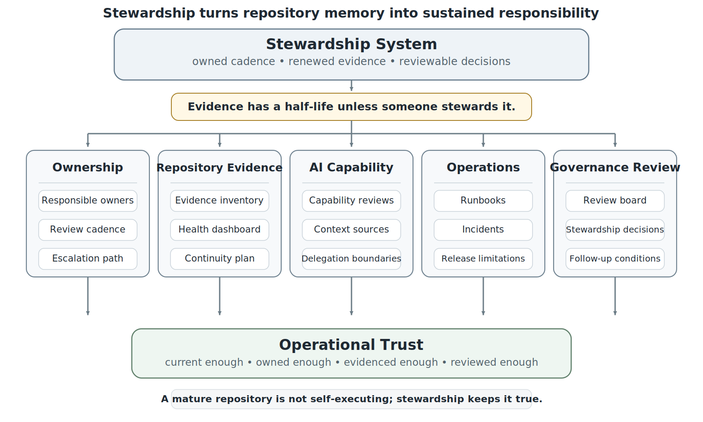
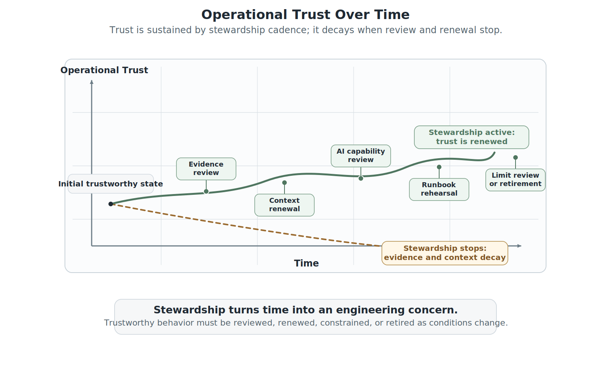
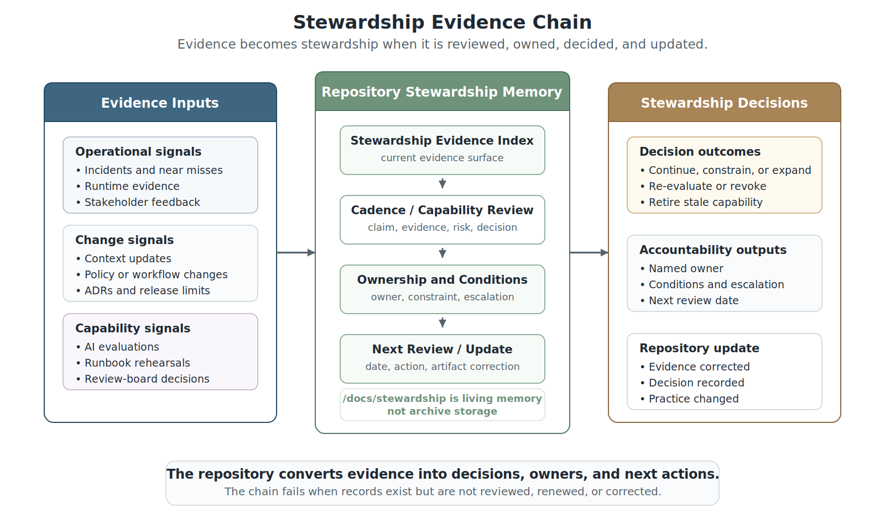
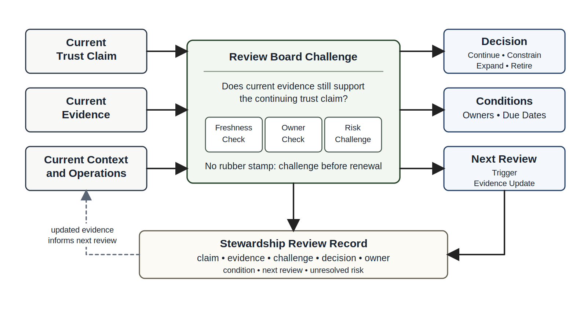

# Chapter 38 Engineering Stewardship in the AI Era
---

### Chapter Governing Line

> Trustworthy systems are not completed once; they are stewarded over time.

---

## Opening Scenario: The Repository Was Organized, but Trust Still Required Stewardship

The repository looked healthy.

A year after COICP expanded beyond its original pilot scope, Lakeside Metropolitan University had accumulated a substantial body of engineering evidence. Requirements were traceable. Architectural decisions were documented. AI governance records existed. Incident records had been preserved. Runbooks were available. Release evidence was organized. Review records could be located. The repository structure was disciplined and navigable.

On paper, the system appeared mature.

Then a routine governance review uncovered a problem.

A newly proposed AI-assisted workflow relied on a context source that had been approved months earlier. The source still appeared in the context registry. The approval record still existed. The authority matrix still referenced it. The workflow documentation still pointed to it.

The problem was that the source was no longer trustworthy.

The underlying policy had changed. Operational procedures had evolved. A related incident had produced lessons that were never incorporated into the workflow documentation. The context source remained discoverable, but its trustworthiness had quietly expired.

Nothing was technically broken.

The repository contained the evidence.

The evidence simply no longer reflected reality.

The review board discovered similar patterns elsewhere. A runbook remained easy to find but no longer matched current operational practice. A release limitation remained documented but had been overlooked during a later capability expansion. An AI delegation rule remained approved even though the surrounding workflow had changed substantially. Several postmortem lessons had been preserved but never translated into updated governance controls.

The problem was not repository organization.

The problem was stewardship.

Chapter 37 established that the repository is not a filing cabinet. It is operational memory, governance memory, incident memory, context memory, and review memory. It preserves the evidence that allows humans to understand what the system is, what it has done, what it is allowed to do, what it should not do, what has failed, what has changed, and who owns the next decision.

That is necessary.

It is not sufficient.

Trustworthy intelligent systems are not completed once. They are stewarded over time.

A repository can be navigable and still decay. A runbook can be easy to find and still be stale. A context source registry can be well structured and still point to a policy that no longer applies. A release limitation can be clearly recorded and still be forgotten when a new capability is enabled. A postmortem can teach a real lesson and still fail to change future practice. An AI delegation matrix can be approved and still become obsolete when the model, workflow, tool boundary, data source, or institutional risk changes.

Stewardship is the discipline of sustaining trustworthiness after the project phase ends, after the release is defended, after the repository is organized, after the first incident is resolved, and after the system becomes part of ordinary institutional life.

It is not vague responsibility. It is not ownership language on an organizational chart. It is not maintenance as a backlog category.

It is evidence-backed, reviewable, time-aware engineering responsibility for a living system.

This chapter moves the reader from operational repository engineer to engineering steward. The shift matters because intelligent systems do not remain trustworthy by remembering the past. They remain trustworthy when accountable people use memory to renew evidence, govern change, review AI capability, preserve operational learning, retire unsafe assumptions, and sustain institutional trust.

Stewardship is how operational trust survives change.

---

## 38.1 The Problem After Repository-Centered Operational Engineering

Lakeside Metropolitan University has reached a strong point in the maturity of the Campus Operations and Incident Coordination Platform, or COICP. The repository is no longer a scattered collection of files. It contains operational evidence, release records, runbooks, incident reports, postmortems, context source registries, AI governance artifacts, oversight records, understandability maps, repository health dashboards, and review-board decisions. The evidence inventory is current enough to support reviews. The repository health dashboard makes missing ownership and stale artifacts visible. The evidence navigation guide helps reviewers find what they need without wandering through folder trees.

The architecture looks responsible. The review board can reconstruct why an AI-assisted routing recommendation is allowed, what context sources it may use, what human oversight is required, what runbook applies when the workflow fails, what release limitation remains active, and what incident history matters. Chapter 37 made that possible. It turned repository evidence into operational memory.

Then ordinary institutional change begins to work against that maturity.

A campus operations policy changes because evening event staffing rules have been revised. A community partner updates its contact and escalation expectations. A vendor deprecates an API used by a facilities notification integration. A new student-services privacy interpretation changes what information may be included in incident summaries. The model used for draft routing summaries is updated by the provider. A key maintainer leaves LMU. A runbook still refers to the old escalation owner. The release limitation record says a constraint is temporary, but no one has reviewed it in two months. The AI capability review log is still present, but its evaluation cases no longer match current workflows.

Nothing has collapsed. There is no dramatic AI disaster. No one has maliciously bypassed governance. The repository is still navigable. The evidence is still there. The problem is that truth has a half-life.

This is the stewardship problem. Repository-centered operational engineering can make evidence findable, but it cannot make evidence stay true by itself. Evidence must be maintained. Context must be renewed. Ownership must be current. Governance decisions must be revisited. AI capability must be re-evaluated. Runbooks must be rehearsed and corrected. Limitations must be retired, renewed, or escalated. Postmortem lessons must be checked against actual practice.

A mature repository without stewardship becomes an evidence museum: impressive, organized, and increasingly detached from operational reality.

For COICP, LMU begins to see the difference between having repository memory and stewarding repository memory. The repository may contain `/docs/governance/repository_stewardship/evidence_inventory.md`, `/docs/governance/repository_stewardship/repository_health_dashboard.md`, and `/docs/governance/repository_stewardship/continuity_plan.md`. Those artifacts matter, but they are not self-executing. Someone must review them. Someone must own aging evidence. Someone must decide when a capability is no longer justified. Someone must make sure the system that was trustworthy last semester remains trustworthy this semester.

That someone is not a hero. It is a stewardship system.

*Figure 38.1 — Stewardship Responsibility Model*

---

## 38.2 Stewardship Is an Engineering Discipline

Stewardship is often misunderstood because the word sounds soft. It can sound like care, professionalism, or general responsibility. Those meanings are not wrong, but they are not precise enough for trustworthy intelligent systems.

In engineering terms, stewardship is the sustained practice of keeping system behavior, evidence, governance, context, operations, AI capability, and learning trustworthy over time. It includes ownership, cadence, review, renewal, retirement, evidence maintenance, risk disposition, capability control, and institutional learning. Stewardship is how a system continues to deserve trust after the original builders move on, after policies change, after incidents reveal new weaknesses, and after AI-enabled workflows evolve.

Stewardship is not the same as maintenance. Maintenance often focuses on keeping software running, fixing defects, updating dependencies, and responding to operational needs. Stewardship includes maintenance, but it is broader. A steward asks whether the system should still do what it does, whether the evidence still supports the trust claims, whether AI delegation is still appropriate, whether context remains authoritative, whether human oversight is still meaningful, whether operational risks have changed, and whether old decisions should be renewed or retired.

Stewardship is also not the same as governance in the narrow compliance sense. Governance defines authority, boundaries, approvals, auditability, and accountability. Stewardship keeps those governance controls alive under change. A governance policy that no one revisits becomes ceremonial. An approval matrix that names departed people becomes fiction. A delegation boundary that does not reflect a new tool integration becomes unsafe. A context trust model that is not refreshed becomes a source of false confidence.

At LMU, stewardship means naming durable ownership for the continuing trustworthiness of COICP. Campus operations may own workflow usefulness. IT may own technical reliability and runbooks. Compliance may own privacy constraints. The review board may own recurring challenge. Engineering maintainers may own repository evidence quality. A product or operational sponsor may own stakeholder trust. AI governance owners may own capability review, delegation boundaries, and revocation thresholds.

Those responsibilities should not remain implicit. They belong in repository evidence such as `/docs/stewardship/stewardship_charter.md`, `/docs/stewardship/stewardship_ownership_matrix.md`, `/docs/stewardship/stewardship_cadence.md`, and `/docs/stewardship/stewardship_evidence_index.md`. These files are not paperwork. They are the control surface that tells future reviewers who owns what, when it must be reviewed, what evidence matters, and what decision is overdue.

Stewardship turns time into an engineering concern.

Engineering traditionally focuses on correctness, performance, reliability, security, maintainability, and operational fitness. Stewardship adds temporal trustworthiness. The steward asks whether evidence, controls, assumptions, authority boundaries, and operational practices remain justified as the system, institution, and environment evolve.

Trustworthy systems are not completed once; they are stewarded over time.

*Figure 38.2 — Operational Trust Over Time*

---

## 38.3 What Must Be Stewarded

A team cannot steward a system responsibly if stewardship remains an abstract promise. The next question is concrete: what must be stewarded?

First, evidence must be stewarded. Repository evidence is only useful when it is current enough, linked enough, owned enough, and decision-relevant enough to support review. An evidence index that lists artifacts without freshness, owner, review status, and decision use can become fake traceability. Stewardship asks whether the evidence still supports the claims being made about the system.

Second, context must be stewarded. Chapter 34 established that context is control. That doctrine becomes more important over time. COICP may depend on policies, routing rules, campus calendars, building data, public safety liaison procedures, community partner expectations, release limitations, incident history, and repository records. Some of those sources change. Some become stale. Some conflict. Some require privacy review. If AI-assisted workflows use context, stewardship must include context ownership, refresh cadence, source authority, exception handling, and retirement.

Third, AI capability must be stewarded. The delegation decision that was acceptable at release may not remain acceptable after the model changes, after incident patterns emerge, after context sources shift, after users begin relying on generated summaries, or after tool access expands. AI capability stewardship asks whether the system should continue, constrain, expand, revoke, or retire a capability. The answer must be evidence-backed, not preference-driven.

Fourth, workflows must be stewarded. Agentic workflows and human workflows both drift. A workflow that originally prepared a routing recommendation may later become a de facto decision path because users trust it too much. A review gate may become routine approval. An exception path may become common practice. Stewardship keeps workflow behavior aligned with authority boundaries and operational purpose.

Fifth, runbooks and recovery paths must be stewarded. A runbook is not trustworthy because it exists. It is trustworthy when it reflects current architecture, current owners, current escalation paths, current rollback procedures, current communication expectations, and current evidence sources. A stale runbook can create false recoverability.

Sixth, incidents and postmortem learning must be stewarded. The point of a postmortem is not to create a document; it is to change future behavior. Stewardship checks whether postmortem actions were completed, whether mitigations worked, whether recurrence evidence exists, and whether the learning has changed tests, runbooks, monitoring, governance, or training.

Seventh, release decisions and limitations must be stewarded. A release approval is a point-in-time decision under known evidence. It is not permanent absolution. Known limitations must be reviewed. Risk acceptances must expire or be renewed. Rollback assumptions must be tested. Release expansion decisions must consider new evidence.

Eighth, users and institutional trust must be stewarded. Trust is not only a system property; it is an organizational relationship. Stakeholders need honest communication about capability, limits, failures, changes, and accountability. Stewardship keeps the system aligned with the people and institution it serves.

For LMU, these domains can be made explicit in `/docs/stewardship/stewardship_domain_register.md` and `/docs/stewardship/stewardship_backlog.md`. The domain register should not be a list of departments. It should identify the living domains of trustworthiness: evidence, context, AI capability, workflows, oversight, understandability, observability, security, reliability, release governance, transparency, and stakeholder trust. The backlog should not be a dumping ground. It should record stewardship work that protects trustworthiness: renew, retire, rehearse, re-evaluate, update, escalate, or decide.

A steward owns living relationships, not isolated documents.

---

## 38.4 Cadence, Renewal, and Capability Review

Stewardship requires cadence. Without cadence, stewardship becomes good intention waiting for a crisis.

Some stewardship work should occur on a time-based schedule. Context sources may require monthly or semesterly review. Runbooks may require rehearsal before major campus periods. AI capability evaluations may require recurring review after model updates, tool changes, workflow expansion, or incident patterns. Release limitations may require review before the next deployment window. Repository health may require recurring checks for stale owners, broken links, missing evidence, and outdated decisions.

Other stewardship work should be event-triggered. A policy change should trigger context review. A major incident should trigger runbook and monitoring review. A new tool integration should trigger AI delegation and security review. A personnel change should trigger ownership and continuity review. A stakeholder complaint should trigger trust and transparency review. A release expansion should trigger capability and limitation review.

Cadence is not bureaucracy when it protects trust. Bureaucracy asks people to perform rituals regardless of risk. Stewardship cadence asks whether evidence, authority, context, and capability remain valid because the system and institution have changed.

For COICP, a stewardship cadence might be preserved in `/docs/stewardship/stewardship_cadence.md`. That document should name recurring review intervals, event triggers, responsible owners, evidence inputs, decision outputs, and escalation thresholds. It should connect to `/docs/stewardship/capability_review_log.md`, `/docs/governance/ai_governance/delegation_review_record.md`, `/docs/governance/context_engineering/context_source_registry.md`, `/docs/operations/runbooks/`, and `/docs/release_evidence/release_governance_record.md`.

Capability review is especially important in AI-era systems. AI capability does not remain static. The model may change. The prompt or system instructions may change. Retrieval behavior may change. Available tools may change. User reliance may change. Context quality may change. Evaluation cases may become outdated. Monitoring evidence may reveal drift. A capability that was safe as a recommendation may become unsafe if users treat it as an instruction. A summary that was useful may become risky if it hides uncertainty or source distinctions.

A capability review should ask: What is the capability allowed to do? What evidence shows it is still performing acceptably? What context does it use? What has changed since approval? What failure modes have appeared? What incidents or near misses matter? What human oversight remains required? What can be revoked or rolled back? Should the capability continue, be constrained, be expanded, be re-evaluated, or be retired?

That review belongs in evidence. A record such as `/docs/stewardship/capability_review_log.md` should preserve the claim, evidence, risk, decision, owner, conditions, and next review date. The key is not the file name. The key is the engineering discipline: no living capability should depend on forgotten assumptions.

*Figure 38.3 — Stewardship Evidence Chain*

---

## 38.5 Repository Evidence as Stewardship Memory

Chapter 37 described the repository as operational memory. Chapter 38 adds that memory must be curated into stewardship memory. Operational memory helps people reconstruct what happened, what was decided, and what evidence exists. Stewardship memory helps people decide what must happen next.

The difference is subtle but important. A postmortem record is operational memory. A stewardship record asks whether the postmortem changed monitoring, tests, runbooks, ownership, AI evaluation, or governance. A release limitation record is operational memory. A stewardship record asks whether the limitation is still active, retired, renewed, or escalated. A context source registry is operational memory. A stewardship record asks whether each source remains authoritative, current, permissioned, and reviewed. An AI delegation matrix is operational memory. A stewardship record asks whether the delegation remains justified under current evidence.

This is where repository-centered engineering becomes more demanding. The repository cannot merely preserve documents. It must preserve relationships among evidence, decisions, owners, time, and consequences.

A useful stewardship evidence index might live at `/docs/stewardship/stewardship_evidence_index.md`. It should connect stewardship domains to evidence locations, freshness status, owner, last review date, next review trigger, related incidents, related ADRs, related release limitations, related AI capability records, and open stewardship actions. It does not need to be complex. It needs to be trustworthy enough that a reviewer can use it to challenge whether the system remains governed and operationally defensible.

Repository stewardship should also preserve retirement decisions. Engineers often record what they build and what they approve, but they are weaker at recording what they retire. In intelligent systems, retirement is a trustworthiness decision. A context source may be retired. A model version may be retired. A workflow capability may be constrained. A runbook may be replaced. A release limitation may be closed. A permission may be revoked. A stakeholder communication pattern may be changed. These decisions belong in the repository because future engineers need to know not only what exists, but what was deliberately stopped.

A retirement record such as `/docs/stewardship/retirement_decisions.md` should preserve what was retired, why, what evidence supported the decision, what replaced it if anything, who approved it, what risks remain, and what follow-up is required. Without retirement evidence, old assumptions remain available for accidental reuse.

Stewardship memory also supports AI context governance. If AI-assisted workflows use repository context, then stale or uncurated stewardship records become part of the system’s behavior. A generated recommendation may draw from old evidence unless context boundaries, freshness metadata, source authority, and retrieval rules are stewarded. This is why `/docs/governance/ai_context/approved_context_sources.md`, `/docs/governance/ai_context/context_refresh_review.md`, and `/docs/governance/context_engineering/context_exception_log.md` matter when they materially support the system. They are not AI plumbing. They are governance memory.

Everything important leaves evidence, but stewardship decides whether that evidence remains alive.

This is the practical difference between preservation and stewardship. Preservation keeps evidence available. Stewardship keeps evidence relevant. A repository can successfully preserve thousands of artifacts while still failing to help future engineers make responsible decisions if ownership, freshness, authority, and operational meaning are no longer maintained.

---

## 38.6 Stewardship Roles, Ownership, and Organizational Learning

Stewardship fails when everyone agrees it is important but no one owns the work. This is the familiar anti-pattern of unowned risk in a more mature form. At the beginning of a project, unowned risk might mean a defect, dependency, or requirement assumption has no owner. In a mature intelligent system, unowned risk can mean no one owns context freshness, AI capability review, runbook rehearsal, release limitation renewal, evidence retirement, model-change monitoring, stakeholder trust, or operational learning.

Stewardship ownership should be explicit. It should include primary owners, backup owners, review sponsors, escalation paths, and succession plans. A single person should not become the only source of system memory. That would replace repository-centered engineering with human folklore. The goal is not to make one heroic steward indispensable. The goal is to make stewardship institutional and reviewable.

LMU’s COICP stewardship model should distinguish several roles. An operational steward owns workflow usefulness, runbook fit, and stakeholder coordination. A technical steward owns architecture health, dependencies, deployment assumptions, and observability evidence. A governance steward owns review cadence, approval renewal, risk acceptance, and policy alignment. An AI capability steward owns delegation boundaries, evaluation evidence, monitoring, model/tool changes, and revocation thresholds. A repository steward owns evidence health, navigation, freshness, and continuity. A trust steward or sponsor owns communication with institutional stakeholders.

These roles can overlap in smaller organizations, but the responsibilities should not be invisible. A file such as `/docs/stewardship/stewardship_ownership_matrix.md` should make ownership explicit. A file such as `/docs/stewardship/succession_plan.md` should describe what happens when owners change. A file such as `/docs/stewardship/organizational_learning_register.md` should preserve lessons that affect future practice.

Organizational learning is the proof that stewardship is real. If incidents recur, if the same limitations remain unreviewed, if generated summaries keep hiding uncertainty, if runbooks remain stale, if context sources keep drifting, or if review boards keep asking the same unanswered questions, the organization is not learning. It is archiving.

Stewardship turns learning into changed evidence, changed behavior, changed controls, and changed expectations. A postmortem should update tests, runbooks, monitoring, training, governance, or architecture when appropriate. A stakeholder complaint should update communication practices, transparency notes, or capability boundaries when justified. A capability review should update delegation rules, evaluation cases, context controls, or revocation decisions. A policy change should update context registries, role rules, and reviewer packets.

The stewardship question is not, Did we learn something? The question is, Where did the learning change the system?

---

## 38.7 Failure Patterns in Unstewarded Intelligent Systems

The primary failure pattern of Chapter 38 is ship-and-forget. The system is released, documented, governed, and perhaps even well organized in a repository, but no one actively sustains its trustworthiness. The system keeps operating while its evidence, controls, and assumptions age around it.

Ship-and-forget is dangerous because it hides behind earlier maturity. The team can point to a release readiness record, a runbook, a postmortem, a context registry, a delegation matrix, an observability plan, an incident response record, and a repository health dashboard. Those artifacts may all be real. The problem is that the trust claim has moved from present evidence to historical evidence.

A second failure pattern is the evidence museum. The repository becomes a well-labeled archive of artifacts that no longer drive decisions. Evidence exists, but it is not reviewed, challenged, renewed, retired, or used. This is process theater with better filenames.

A third failure pattern is context decay. Human reviewers and AI systems rely on context sources that were once authoritative but are now stale, conflicting, permission-sensitive, or incomplete. Context decay is especially dangerous because AI-generated output may remain fluent while its evidence base weakens. Smooth summaries can make stale context feel current.

A fourth failure pattern is silent capability creep. An AI-assisted workflow begins by drafting or recommending. Over time, users rely on it more heavily, tool permissions expand, approval becomes routine, exception paths become normal, and the workflow effectively gains influence that was never reapproved. No single change seems dramatic, but the aggregate change alters authority.

A fifth failure pattern is ownerless system drift. Roles change. Sponsors leave. Maintainers graduate or transfer. Reviewers rotate. Vendors change. The system remains operational, but the people who understood its assumptions are gone. If the repository and stewardship plan do not preserve ownership continuity, institutional memory becomes personal memory, and personal memory leaves.

A sixth failure pattern is novelty chasing. The organization becomes more interested in adding the next AI capability than sustaining the trustworthiness of the capabilities it already has. This produces a dangerous inversion: new capability gets attention; existing risk gets deferred.

A seventh failure pattern is stewardship theater. The organization creates a stewardship plan, schedules reviews, and names owners, but the process does not change decisions. Artifacts are reviewed without challenge. Risks are carried forward without owners. Capability reviews approve continuation without evidence. Retirement decisions are avoided. Stewardship theater is governance after deployment wearing mature language.

Trustworthy engineering counters these patterns with cadence, ownership, evidence freshness, capability review, retirement decisions, repository stewardship, and review-board challenge. The corrective posture is not to create more documents. It is to make evidence drive action.

---

## 38.8 Stewardship Review

Chapter 38 introduces Stewardship Review. This review is not a status meeting and not a maintenance planning meeting. It is a professional challenge mechanism that asks whether the system remains trustworthy under current evidence, current context, current operations, current governance, and current AI capability.

A Stewardship Review should begin with claims. What is LMU claiming about COICP now? Is it claiming the system remains operationally reliable? That AI-assisted routing remains bounded and useful? That context sources remain authoritative? That runbooks remain current? That release limitations are understood? That oversight remains meaningful? That stakeholders can trust the system’s communication?

Each claim requires evidence. The review should inspect the stewardship evidence index, repository health dashboard, context source registry, capability review log, AI delegation review records, runbook rehearsal evidence, incident and postmortem actions, release limitation records, security/privacy updates, observability evidence, ownership matrix, and stakeholder feedback. The specific files matter less than the discipline: claims must remain tied to current evidence.

A useful Stewardship Review asks questions such as:

Are all stewardship domains named and owned?

Are backup owners and succession paths defined for critical stewardship responsibilities?

Which evidence artifacts are stale, unowned, contradicted, or no longer decision-useful?

Which context sources have changed since the last review?

Which AI capabilities have changed in model behavior, tool authority, evaluation evidence, monitoring signals, or user reliance?

Which runbooks have been rehearsed, updated, or invalidated by operational experience?

Which release limitations should be renewed, retired, escalated, or converted into planned work?

Which incidents, postmortems, defects, or stakeholder concerns should change the system?

Which governance decisions require expiration, renewal, or reconsideration?

Should any AI capability, integration, workflow, or release condition be continued, constrained, expanded, or retired?

The review output must be concrete. A Stewardship Review should produce decisions, owners, conditions, due dates, and evidence locations. It may continue a capability, constrain it, revoke it, require more evidence, update context, renew governance, schedule runbook rehearsal, retire a limitation, or escalate a risk. A review that only records that everything was discussed is not a control.

The review record might live at `/docs/governance/reviews/stewardship_review.md` or `/docs/stewardship/stewardship_review_record.md`. It should preserve claim, evidence, challenge, decision, owner, condition, next review trigger, and unresolved risk. It should also link back to prior reviews such as Human Oversight Readiness Review, Understandability Review, Operational Repository Review, AI Delegation Governance Review, and Trust and Transparency Review when those records materially support the stewardship decision.

Stewardship Review strengthens engineering judgment because it forces the reviewer to think across time. The review asks whether evidence remains trustworthy, whether authority remains justified, whether context remains current, whether ownership remains clear, and whether operational learning has actually changed the system.

The question is not only whether the system was trustworthy at release. The question is whether it remains trustworthy now, under current evidence and current conditions.

*Figure 38.4 — Stewardship Review Gate*

---

## 38.9 Engineering Practice: Building a Stewardship Plan

For students and early-career engineers, stewardship can feel large because it reaches beyond implementation. The practical entry point is a stewardship plan. A stewardship plan does not need to be elaborate. It needs to be specific enough that future people can sustain trust without guessing.

A COICP stewardship plan should identify the system’s stewardship domains. It should name owners and backups. It should define review cadence and event triggers. It should point to evidence locations. It should identify AI capabilities and their review requirements. It should list current release limitations and risk acceptances. It should preserve runbook rehearsal expectations. It should connect incidents and postmortems to learning actions. It should describe retirement criteria for stale context, deprecated workflows, obsolete runbooks, outdated model evaluations, and no-longer-justified capabilities.

A practical structure might include `/docs/stewardship/stewardship_plan.md`, `/docs/stewardship/stewardship_ownership_matrix.md`, `/docs/stewardship/stewardship_cadence.md`, `/docs/stewardship/stewardship_evidence_index.md`, `/docs/stewardship/capability_review_log.md`, `/docs/stewardship/retirement_decisions.md`, and `/docs/stewardship/organizational_learning_register.md`. These paths should appear only where they help the reader understand evidence and responsibility. The chapter is not asking students to memorize folder names. It is teaching them to preserve trustworthiness in a form future people can inspect and use.

The plan should be risk-proportionate. A low-risk classroom feature does not need the same stewardship depth as an AI-assisted operational workflow that affects campus incident routing. But even a small project can practice the professional pattern: name owners, preserve evidence, review AI use, update runbooks, disclose limitations, learn from defects, and decide what should be retired.

Exercises should reinforce this practice. Students can perform an evidence freshness audit by reviewing whether artifacts are current, owned, linked, and decision-useful. They can conduct an AI capability review by deciding whether a workflow should continue, be constrained, be expanded, or be retired. They can revise a runbook after a simulated incident. They can update a context source registry after a policy change. They can conduct a Stewardship Review simulation where every claim must be tied to evidence, owner, risk, and next action.

The point is not to make students into compliance officers. The point is to make them engineers who understand that systems outlive assignments, releases, tools, models, and sometimes their original teams. Trustworthy engineers leave future people with evidence they can use, decisions they can inspect, and systems they can responsibly evolve.

Stewardship is how professional work remains trustworthy after the original effort becomes history.

---

## 38.10 From Stewardship to the Future Trustworthy Engineer

Part IV began by confronting agentic systems and workflow orchestration. Chapter 33 insisted that agentic systems are bounded workflow actors, not magic assistants. Chapter 34 showed that context is enterprise control. Chapter 35 made human oversight meaningful by connecting accountability to evidence, authority, escalation, and intervention. Chapter 36 showed that humans cannot govern what they cannot understand. Chapter 37 made repository memory the operational substrate for evidence, governance, AI context, and continuity.

Chapter 38 now completes the last major capability before the manuscript can define the future trustworthy engineer. The reader has moved from building systems to defending releases, from operating systems to governing intelligent workflows, from preserving repository evidence to stewarding living trust.

The future trustworthy engineer is not valuable because they can type faster than an AI system. That battle is already the wrong frame. The future trustworthy engineer is valuable because they can judge what should be built, what should be delegated, what evidence is sufficient, what risk remains, what must be governed, what must be observed, what must be recoverable, what must be communicated, what must be retired, and who remains accountable.

An intelligent system without a steward becomes a risk with a repository.

That sentence is not anti-AI. It is pro-engineering. AI can assist, summarize, retrieve, recommend, generate, evaluate, and participate in workflows. But AI does not remove the need for stewardship. It increases it. The more systems can act, adapt, depend on context, and influence operations, the more the organization needs people who can preserve evidence, challenge claims, govern authority, maintain oversight, renew context, and sustain trust.

Stewardship is not the end of engineering. It is the condition that allows engineering work to remain trustworthy over time.

The professional identity that emerges from these responsibilities is not defined by a single role. A trustworthy engineer is not merely a coder, prompt user, reviewer, release defender, operator, or steward in isolation. Trustworthy engineering requires the integration of all of those capabilities.

Evidence, governance, repository memory, operational trust, human judgment, AI responsibility, and stewardship ultimately converge in the individual engineer. The future of intelligent systems depends not only on what technology can do, but on the people prepared to accept responsibility for what those systems become.

Trustworthy systems are not completed once; they are stewarded over time. The trustworthy engineer is the person prepared to do that work.

---

## 38.11 Chapter Review Questions

1. Why is stewardship different from maintenance?
2. Why can a repository remain organized while trustworthiness declines?
3. How does stewardship differ from governance?
4. What stewardship risks emerge when evidence becomes stale?
5. Why is AI capability review a recurring activity rather than a one-time approval?
6. What stewardship domains must be maintained in a trustworthy intelligent system?
7. Why are ownership continuity and succession planning important to operational trust?
8. How does stewardship convert operational memory into future action?
9. What is the difference between repository memory and stewardship memory?
10. Why is stewardship essential to sustaining trustworthiness over time?

---

## 38.12 Exercises

### Exercise 1: Conduct a Stewardship Domain Assessment

Select a software system and identify the stewardship domains that require ongoing review.

Consider:

- evidence,
- context,
- AI capability,
- workflows,
- runbooks,
- release limitations,
- operational learning,
- stakeholder trust.

For each domain, identify ownership, review cadence, and risks associated with neglect.

---

### Exercise 2: Perform an AI Capability Review

Choose an AI-assisted feature or workflow.

Evaluate:

- current authority,
- context sources,
- oversight requirements,
- monitoring evidence,
- known limitations,
- recent changes.

Determine whether the capability should:

- continue,
- be constrained,
- be expanded,
- be re-evaluated,
- or be retired.

Document the evidence supporting the decision.

---

### Exercise 3: Analyze Evidence Freshness

Review a collection of repository artifacts and determine whether each remains trustworthy.

Classify each artifact as:

- Current,
- Current with Conditions,
- Needs Review,
- Superseded,
- Retired,
- or Archived.

Explain how stale evidence could affect operational trust.

---

### Exercise 4: Conduct a Stewardship Review

Assume the role of a review board performing a Stewardship Review.

Evaluate a system's:

- ownership structure,
- evidence health,
- context governance,
- AI capability controls,
- runbook readiness,
- release limitations,
- learning mechanisms.

Produce findings, conditions, owners, and follow-up actions.

---

### Exercise 5: Investigate a Stewardship Failure

Analyze a scenario in which trustworthiness declines even though documentation, governance records, and repository evidence still exist.

Identify:

- the stewardship failures,
- the evidence that should have triggered intervention,
- ownership gaps,
- review failures,
- corrective actions.

Explain how the failure could have been prevented through disciplined stewardship.

---

## 38.13 Closing Thoughts

Stewardship is the final trustworthiness discipline because every other engineering discipline eventually depends on it.

Requirements may be approved. Architectures may be reviewed. Code may be implemented. Tests may pass. Releases may be defended. Incidents may be analyzed. Governance controls may be established. Human oversight may be designed. Context may be governed. Repository evidence may be preserved.

None of those achievements remain trustworthy automatically.

Time changes systems.

Policies evolve. Stakeholders change. Owners move on. Workflows expand. Context sources age. AI capabilities improve, drift, or acquire new dependencies. Operational assumptions that were once correct become incomplete. Evidence that once supported a decision may no longer support it. Controls that once reduced risk may no longer address the risks that matter.

Trustworthiness therefore cannot be treated as a project milestone.

It must be treated as a continuing responsibility.

Throughout this book, the reader has repeatedly encountered the same pattern. Trustworthy engineering is not the pursuit of perfect systems. It is the disciplined management of evidence, uncertainty, authority, accountability, risk, learning, and change. Stewardship brings those disciplines together. It asks whether the system remains deserving of trust under current conditions rather than historical conditions.

This is why stewardship is not maintenance with a better name.

Maintenance keeps systems running.

Stewardship keeps systems worthy of continued confidence.

A steward reviews assumptions before they become failures. A steward challenges evidence before it becomes stale. A steward renews context before it becomes misleading. A steward revisits delegation before it becomes authority creep. A steward updates runbooks before they become fiction. A steward turns incidents into learning, learning into action, and action into durable institutional improvement.

Most importantly, stewardship recognizes that trust is not preserved by remembering the past alone. Trust is preserved when organizations continuously compare what they believe to be true against what current evidence actually shows.

The repository remains important because it preserves memory. Governance remains important because it preserves accountability. Oversight remains important because it preserves intervention capability. Context engineering remains important because it preserves control. Stewardship connects all of them across time.

A trustworthy system is therefore not merely a system that was responsibly built.

It is a system that continues to earn trust through evidence, review, ownership, learning, and responsible change.

Trustworthy systems are not completed once; they are stewarded over time.

Stewardship is therefore not merely an operational responsibility. It is a professional obligation. The people who sustain trustworthy systems ultimately determine whether those systems remain worthy of trust. The question is no longer how trustworthy systems are governed. The question becomes who is prepared to accept responsibility for them.

At that point the discussion is no longer about systems alone. It becomes a question of professional identity. Intelligent systems ultimately inherit the strengths, weaknesses, judgment, and values of the people responsible for them.

