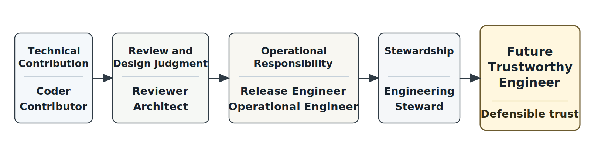
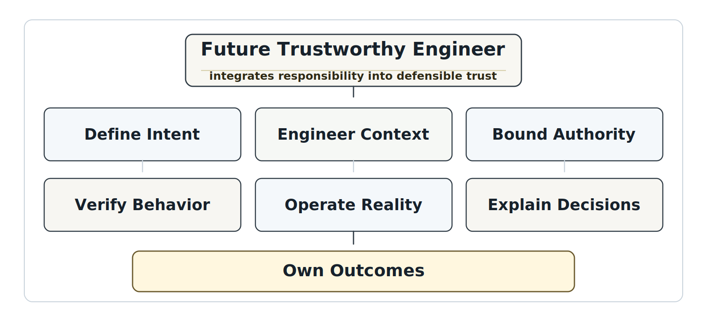
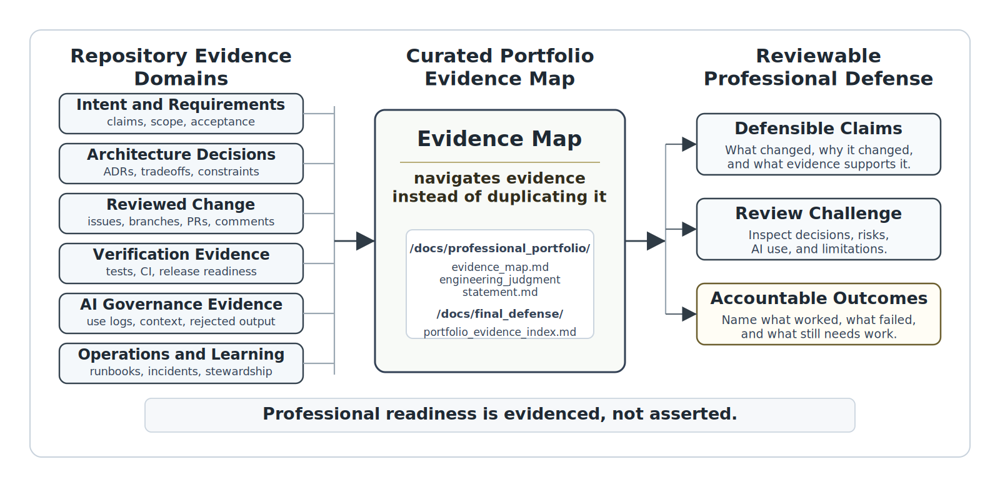
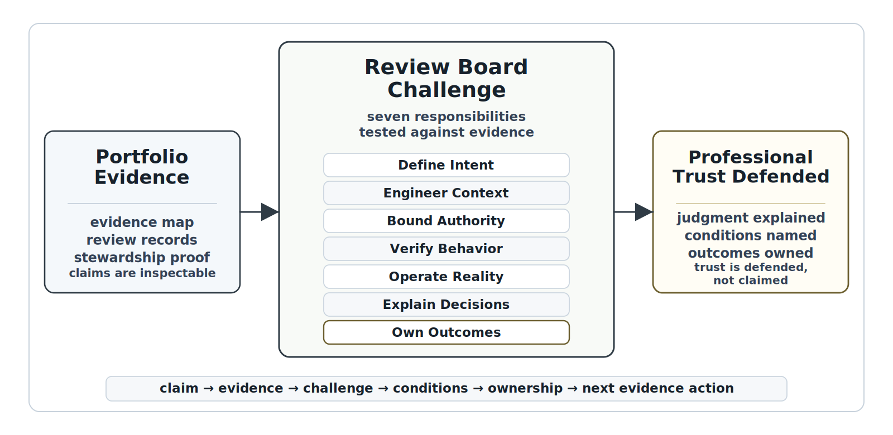

# Chapter 39 The Future Trustworthy Engineer
---

### Chapter Governing Line

> AI can produce artifacts. Trustworthy engineers create defensible trust.

---

## Opening Scenario: The System Worked. The Responsibility Remained.

The demonstration was successful.

After years of engineering effort, governance reviews, operational learning, and organizational change, the Campus Operations and Incident Coordination Platform had become part of ordinary life at Lakeside Metropolitan University. Incidents were routed more consistently. Stakeholders received clearer updates. Operational evidence was easier to find. AI-assisted workflows operated within governed boundaries. Context sources were reviewed. Human oversight was structured. Repository records connected decisions to evidence. The system was no longer an experiment.

The project had achieved many of its goals.

Yet the review board ended its final annual governance review with a question that seemed surprisingly simple.

What happens next?

The answer was not another feature.

It was not a larger model.

It was not a new workflow.

It was not a more sophisticated dashboard.

The answer was responsibility.

The system would continue to change. New staff members would join the university. Experienced engineers would move to other roles. Policies would evolve. Regulations would change. New AI capabilities would emerge. Operational pressures would increase. Future incidents would occur. New context sources would appear. Existing assumptions would become outdated. Every future change would require someone to decide what evidence was sufficient, what risks remained acceptable, what authority should be delegated, what limitations should be preserved, and what responsibilities could never be transferred to a machine.

That responsibility did not belong to the repository.

It did not belong to the workflow.

It did not belong to the model.

It belonged to engineers.

Lakeside Metropolitan University did not reach this point because one team wrote enough code, passed enough tests, completed enough tickets, or produced a convincing demonstration. COICP reached this point because evidence accumulated across the lifecycle. Requirements were challenged. Architecture decisions were recorded. Pull requests were reviewed. Tests were connected to claims. Releases carried limitations. Operational incidents produced learning. AI delegation was bounded. Context was governed. Human oversight became meaningful. Complexity was made understandable. Repository memory became operational infrastructure. Stewardship turned that memory into continuing responsibility.

The system did not become trustworthy all at once. It became more trustworthy because disciplined engineers kept asking harder questions.

What is the system allowed to do?

What context does it depend on?

What evidence supports this claim?

Who reviewed the decision?

What happens when it fails?

What can be recovered?

What does the organization know, and what does it merely assume?

Who owns the outcome after the demo is over?

Those questions are the real subject of this book.

They are also the professional identity of the future trustworthy engineer.

AI will continue to change how software is designed, coded, reviewed, tested, documented, operated, and explained. Some work that once required hours of typing will take minutes. Some artifacts that once required specialized skill will be generated quickly. Some workflows will become partially agentic. Some repository evidence will be summarized automatically. Some tests will be proposed by tools. Some documentation will be drafted from code, logs, tickets, and review history. Some operational signals will be interpreted by intelligent assistants.

None of that eliminates the need for engineering judgment.

It raises the stakes of judgment.

The bottleneck has moved. The durable professional value of the engineer is no longer the ability to produce the most artifacts. The durable value is the ability to decide what should be built, what must be constrained, what evidence is sufficient, what risk remains, what must be governed, what must be observed, what must be recoverable, and who remains accountable.

Tool fluency gets an engineer started.

Engineering judgment keeps an engineer valuable.

The future trustworthy engineer is not a prompt operator, a tool follower, a vendor enthusiast, or a faster typist.

The future trustworthy engineer is the professional who can make intelligent systems useful, safe, explainable, operable, governable, recoverable, and accountable over time.

*Figure 39.1 — Trustworthy Engineer Identity Progression*

---

## 39.1 The Question After Stewardship

Chapter 38 ended with stewardship because trustworthy systems are not completed once. They are stewarded over time. That was the necessary final system-level lesson before this chapter could name the professional identity that carries the work forward.

Stewardship answered one question: how does an organization keep an intelligent system trustworthy after release, after incident learning, after repository maturity, after governance decisions, after team turnover, and after AI capability change?

Chapter 39 asks the final question: what kind of engineer can sustain that responsibility when the tools keep changing?

That question matters because the future will not hold still. AI tools will change. Models will change. development environments will change. agentic platforms will change. evaluation methods will change. compliance expectations will change. user expectations will change. enterprise context will change. What cannot change is the obligation to engineer systems whose behavior can be justified with evidence and governed by accountable people.

At LMU, COICP is now mature institutional infrastructure. It supports campus operations and incident coordination. It carries operational workflows, stakeholder expectations, AI-assisted recommendations, repository evidence, governance records, runbooks, incident learning, context registries, oversight paths, limitations, and stewardship decisions. No single chapter of this book owns COICP anymore. The entire lifecycle owns it.

That is what makes the handoff into Chapter 39 different. The reader is no longer learning one more software engineering topic. The reader is being asked to become the kind of professional who can inherit the whole system.

A new engineer arriving at LMU cannot simply ask where the code lives. That is not enough. The engineer must ask where the intent lives, where the architecture decisions live, where the AI delegation boundaries live, where the context sources are governed, where the runbooks are tested, where incidents are preserved, where release limitations are tracked, where stewardship decisions are recorded, and where unresolved risks are owned.

A mature COICP repository might contain evidence such as:

- `/docs/professional_portfolio/trustworthy_engineer_portfolio.md`
- `/docs/professional_portfolio/evidence_map.md`
- `/docs/stewardship/stewardship_plan.md`
- `/docs/stewardship/capability_review_log.md`
- `/docs/governance/reviews/final_trustworthy_engineer_review.md`
- `/docs/governance/ai_governance/delegation_matrix.md`
- `/docs/governance/context_engineering/context_source_registry.md`
- `/docs/operations/runbooks/`
- `/docs/operations/incidents/`
- `/docs/operations/postmortems/`
- `/docs/release_evidence/release_governance_record.md`

Those paths are not decorative. They represent the professional memory of the system. They show that trustworthy engineering is not an invisible trait. It leaves evidence.

The future trustworthy engineer can walk into that evidence system and understand what the system is, what it is allowed to do, what has been learned, what remains risky, and what must be stewarded next.

That is the identity this chapter completes.

---

## 39.2 What Endures When Tools Change

The easiest mistake in the AI era is to confuse tool change with professional change.

Tools matter. They shape speed, workflow, cost, collaboration, testing, debugging, documentation, and deployment. A capable engineer should learn them. Refusing to learn useful tools is not professionalism. It is avoidance.

But tool fluency is not the same as engineering maturity.

A tool can generate code without knowing whether the requirement is legitimate. A tool can summarize a repository without knowing which evidence is obsolete. A tool can propose tests without knowing which risks matter. A tool can draft architecture alternatives without owning the consequences of a bad boundary. A tool can produce a confident explanation without being accountable for its truth. A tool can call an API without being responsible for the state change it creates.

The durable work remains human engineering work.

What endures is the ability to reason about intent, context, authority, evidence, operation, tradeoffs, and accountability.

The future trustworthy engineer does not build an identity around one model, one vendor, one framework, one programming language, one agent platform, one repository interface, or one workflow automation product. Those things change. Some will become standard. Some will disappear. Some will be absorbed into development environments. Some will become invisible infrastructure. Some will be replaced before students who learn them today are five years into their careers.

The durable identity is deeper.

The profession has experienced tool revolutions before. Languages changed. Platforms changed. Development methods changed. Cloud platforms changed. Open-source ecosystems changed. AI will change engineering as well. What survived every transition was not attachment to a tool. What survived was the ability to reason about systems, evidence, consequences, and responsibility.

The engineer must be able to ask whether the system's purpose is clear. The engineer must be able to distinguish source-of-truth context from convenient text. The engineer must be able to bound authority before automation acts. The engineer must be able to verify behavior beyond generated confidence. The engineer must be able to operate the system after users depend on it. The engineer must be able to explain decisions honestly. The engineer must be able to own outcomes.

LMU cannot define professional readiness by asking whether a candidate has used a particular AI assistant. It must ask whether the candidate can defend engineering claims. Can the candidate explain how COICP routes incidents? Can the candidate identify which context sources are authoritative? Can the candidate find the ADR that explains why a notification service was selected? Can the candidate trace an AI-assisted recommendation to evidence? Can the candidate show which tests protect escalation behavior? Can the candidate explain what happens if an integration fails? Can the candidate identify who can approve expansion of an AI capability? Can the candidate say what must be communicated to stakeholders when a limitation remains?

Those are not tool questions. They are trustworthy engineering questions.

This is why repository-centered engineering remains central. The repository is not merely where artifacts are stored. It is where professional judgment becomes inspectable. When tools change, repository evidence allows continuity. When people leave, repository evidence preserves memory. When AI-generated summaries are wrong, repository evidence provides source material. When governance is challenged, repository evidence supports decisions. When trust claims are made, repository evidence tests whether the claims are real.

A mature organization should therefore preserve tool-change evidence as part of its governance posture. A path such as `/docs/governance/ai_governance/ai_tool_change_review.md` can record when a new AI tool is introduced, what authority it receives, what data it can access, what outputs it may produce, what review expectations apply, what risks were identified, and what monitoring or revocation mechanisms exist. A path such as `/docs/professional_portfolio/professional_skill_map.md` can help an engineer show how their durable skills extend across changing tools.

The future trustworthy engineer adapts tools without surrendering judgment.

That is what endures.

---

## 39.3 The Seven Responsibilities of the Future Trustworthy Engineer

This book has introduced many practices: requirements, repositories, architecture, ADRs, reviews, tests, CI/CD, releases, postmortems, observability, runbooks, security governance, AI delegation, reliability, incident response, release governance, transparency, agentic workflows, context engineering, oversight, understandability, repository-centered operations, and stewardship.

A final chapter cannot merely list them again. The point is synthesis.

The future trustworthy engineer carries seven enduring responsibilities:

1. Define intent.
2. Engineer context.
3. Bound authority.
4. Verify behavior.
5. Operate reality.
6. Explain decisions.
7. Own outcomes.

These responsibilities are not a replacement for the trustworthiness framework. They are a professional identity expression of it. They describe what the engineer does when confronted with a changing intelligent system.

*Figure 39.2 — The Seven Responsibilities of the Future Trustworthy Engineer*

### Define intent

Trustworthy engineering begins before code. It begins with the question: what are we trying to accomplish, for whom, under what constraints, with what risks, and with what evidence of success?

AI can produce artifacts quickly, but fast production without clear intent creates synthetic productivity. It creates polished output that may not solve the right problem. In COICP, intent includes campus operations goals, incident coordination needs, stakeholder priorities, privacy constraints, public-safety interfaces, student impact, escalation expectations, and institutional trust. That intent belongs in requirements, use cases, acceptance criteria, stakeholder notes, risk registers, issue descriptions, and release decisions.

Repository evidence may include `/docs/requirements/requirements.md`, `/docs/requirements/use_cases.md`, `/docs/planning/risk_register.md`, and issue templates that require acceptance criteria and stakeholder context. The future trustworthy engineer treats those artifacts as steering inputs, not paperwork.

### Engineer context

Context is control. Intelligent systems do not reason in a vacuum. They depend on requirements, architecture, repository evidence, policies, logs, known limitations, incident history, runbooks, systems of record, user roles, and operational constraints.

Bad context makes smart models confidently wrong. Stale context can be worse than missing context because it carries the appearance of authority. The future trustworthy engineer asks where context came from, who owns it, how fresh it is, what it is allowed to influence, whether it contains sensitive data, and how it is verified.

For COICP, governed context may live in `/docs/governance/context_engineering/context_source_registry.md`, `/docs/governance/context_engineering/context_refresh_policy.md`, `/docs/governance/context_governance/context_trust_model.md`, and `/docs/governance/context_engineering/context_lineage_record.md`. These files allow humans and AI-assisted workflows to distinguish source-of-truth context from convenient text.

### Bound authority

The jump from answer to action is where professional engineering begins.

A wrong summary is a quality problem. A wrong state-changing action can become an institutional problem. If an intelligent workflow can update an incident, send a notification, change a status, approve a handoff, trigger an escalation, expose data, or modify a system of record, authority must be designed.

The future trustworthy engineer asks what the system may read, infer, propose, prepare, call, change, notify, approve, log, revoke, and recover. Authority must be explicit before automation acts.

COICP evidence may include `/docs/governance/agentic_workflows/tool_authority_matrix.md`, `/docs/governance/agentic_workflows/action_approval_flow.md`, `/docs/governance/ai_governance/delegation_matrix.md`, `/docs/governance/ai_governance/revocation_decision_log.md`, and `/docs/governance/human_oversight/escalation_authority_matrix.md`.

Never give an agent authority you cannot explain, control, audit, revoke, and recover from.

### Verify behavior

Generated output is proposed material. It is not verified engineering truth.

Verification includes tests, reviews, security checks, architecture-fit assessment, dependency review, scenario evaluation, adversarial cases, manual evidence, runtime evidence, and human judgment. A passing CI pipeline is useful evidence, but it proves only what it checks. A generated test suite is useful only if it tests the right behavior and not merely generated assumptions.

For COICP, verification evidence may appear in `/docs/testing/test_strategy.md`, `/docs/testing/ai_evaluation_cases.md`, `/docs/testing/manual_test_evidence.md`, `/docs/release_evidence/release_readiness_record.md`, and pull-request review records. Verification is not the moment where engineers slow down progress. It is the moment where progress becomes defensible.

### Operate reality

Software does not become trustworthy because it runs once. It must be operated under real conditions.

Operating reality means logs, metrics, traces, request IDs, audit events, runbooks, incident response, rollback, recovery, communications, known limitations, monitoring, and learning. It means asking not only whether the system works, but whether people can diagnose it, support it, recover it, and improve it when reality does not match the happy path.

COICP operational evidence may live under `/docs/operations/runbooks/`, `/docs/operations/incidents/`, `/docs/operations/postmortems/`, `/docs/observability/runtime_evidence.md`, and `/docs/operations/known_limitations.md`. The future trustworthy engineer does not treat operations as someone else's problem. If the system affects real users, operation is part of engineering.

### Explain decisions

Trustworthy engineering is not only doing the work. It is making the reasoning inspectable.

Architecture decisions, tradeoffs, risk acceptances, AI delegation decisions, release limitations, security exceptions, and stewardship choices must be explainable. Explanation does not mean public-relations polish. It means honest connection between claim, evidence, risk, owner, and next action.

ADRs, review records, release notes, postmortems, and transparency statements are professional evidence. COICP might preserve them in `/docs/architecture/adrs/`, `/docs/governance/reviews/`, `/docs/release_evidence/release_governance_record.md`, `/docs/trust/transparency_statement.md`, and `/docs/stewardship/stewardship_decision_register.md`.

The engineer who cannot explain a decision probably does not fully own it.

### Own outcomes

Accountability is the final responsibility because all other responsibilities can fail without it.

Owning outcomes does not mean pretending to control every variable. Mature engineering recognizes uncertainty, dependency, residual risk, and operational surprise. Owning outcomes means making responsibility visible. It means naming owners, constraints, limitations, risks, escalation paths, and follow-up decisions. It means not hiding behind the model, the tool, the process, the team, the vendor, the sprint, the dashboard, or the demo.

In the AI era, responsibility diffusion is easy. The model suggested it. The tool generated it. The agent executed it. The workflow routed it. The dashboard summarized it. The repository contained it. The review passed it.

The trustworthy engineer refuses that fog.

AI proposes. Engineers decide, verify, govern, and own.

---

## 39.4 Engineering Judgment as the Professional Core

The seven responsibilities are easy to say. They are hard to practice because each requires judgment under uncertainty.

Engineering judgment is not a personality trait. It is not instinct alone. It is the disciplined ability to connect evidence, risk, context, tradeoffs, constraints, operational consequences, governance obligations, and human accountability.

A junior engineer may ask, "Does the code work?" A mature engineer asks, "What evidence shows that this behavior satisfies the intended requirement under realistic conditions, and what risk remains?"

A junior engineer may ask, "Did the AI produce the output?" A mature engineer asks, "What context was used, what assumptions were introduced, what verification was performed, and what human decision accepted this material?"

A junior engineer may ask, "Did the release pass?" A mature engineer asks, "What limitations remain, who accepted them, what can be rolled back, what is monitored, and what must be communicated?"

A junior engineer may ask, "Is the repository updated?" A mature engineer asks, "Can another responsible engineer reconstruct the decision, operate the system, diagnose failure, govern authority, and continue stewardship from the evidence here?"

Judgment is not opposition to process. It is the reason process matters. Processes create evidence, structure decisions, expose assumptions, preserve accountability, and support review. Judgment determines whether that evidence is sufficient, whether those assumptions remain valid, and whether the resulting decision deserves confidence.

This is where checklist theater fails. A checklist can ask whether a risk register exists. Judgment asks whether the risks are real, current, owned, and connected to decisions. A checklist can ask whether an AI-use log exists. Judgment asks whether the AI use changed authority, introduced assumptions, weakened tests, or exposed data. A checklist can ask whether a runbook exists. Judgment asks whether a person could use it during pressure, whether it was rehearsed, and whether it reflects current operations.

A Chapter 39 portfolio artifact such as `/docs/professional_portfolio/engineering_judgment_statement.md` should not be a self-congratulatory essay. It should be an evidence-backed explanation of how the engineer made decisions. It should identify examples where the engineer clarified intent, constrained AI assistance, rejected generated output, revised architecture, strengthened tests, disclosed limitations, responded to failure, or updated stewardship evidence.

The future trustworthy engineer develops judgment by repeatedly confronting claims with evidence.

What is the claim?

What supports it?

What contradicts it?

What remains unknown?

What could fail?

Who is affected?

Who owns the decision?

What happens next?

Those questions are simple. Their consequences are not.

---

## 39.5 Repository-Centered Portfolio Evidence

In the AI era, saying "I built it" is weaker than showing how it was built, reviewed, verified, governed, operated, and learned from.

A demo shows a moment. Evidence shows engineering maturity.

This is why the repository becomes the engineer's witness.

A professional portfolio should not be a pile of screenshots, code samples, and claims. It should be a navigable body of evidence showing how the engineer thinks. It should allow a reviewer, employer, instructor, teammate, or future maintainer to see not only what changed, but why it changed, how it was reviewed, how it was tested, what risks remained, how AI assistance was governed, how operations were considered, and what was learned.

The final portfolio is not separate from repository-centered engineering. It is the professional expression of it. A trustworthy portfolio does not rely on claims about capability. It organizes evidence that allows others to understand responsibilities, decisions, contributions, judgment, and outcomes.

*Figure 39.3 — Repository-Centered Portfolio Evidence Map*

A trustworthy engineer portfolio might include:

- `/docs/professional_portfolio/trustworthy_engineer_portfolio.md`
- `/docs/professional_portfolio/evidence_map.md`
- `/docs/professional_portfolio/professional_skill_map.md`
- `/docs/professional_portfolio/engineering_judgment_statement.md`
- `/docs/professional_portfolio/final_evidence_summary.md`
- `/docs/final_defense/portfolio_evidence_index.md`
- `/docs/final_defense/responsibility_evidence_matrix.md`
- `/docs/final_defense/final_portfolio_defense.md`

Those files should not duplicate the entire repository. They should navigate it. The portfolio is a curated evidence map, not a second repository.

A strong evidence map might point to requirements that show intent, ADRs that show architectural reasoning, pull requests that show reviewed change, tests that show verification, AI-use logs that show controlled assistance, release records that show readiness, runbooks that show operational readiness, postmortems that show learning, and stewardship records that show long-term responsibility.

The future trustworthy engineer can present this evidence without exaggeration.

Here is the requirement that shaped the work.

Here is the issue that scoped the change.

Here is the ADR that captured the tradeoff.

Here is the pull request where review challenged the assumption.

Here is the test evidence.

Here is where AI assistance was used, modified, or rejected.

Here is the release limitation.

Here is the runbook.

Here is the incident learning.

Here is the stewardship follow-up.

Here is what still needs work.

That final sentence matters. Honest engineering is mature engineering. A portfolio that hides limitations is less trustworthy than one that names them responsibly.

A portfolio should demonstrate professional maturity across the lifecycle. It should show that the engineer can function as a contributor, reviewer, architect, release engineer, operational engineer, and steward. It should not imply perfection. It should demonstrate disciplined accountability.

This is especially important for students and early-career engineers. Many candidates will be able to show code. Many will be able to say they used AI. Many will have polished demos. Fewer will be able to show traceable engineering evidence. Fewer still will be able to explain how they governed AI assistance, verified behavior, handled risk, documented decisions, and prepared the system for operation.

The repository is the place where that difference becomes visible.

In a profession increasingly influenced by generated artifacts, repository evidence becomes one of the clearest ways to distinguish production from engineering. Artifacts show what was created. Evidence shows how decisions were made, how claims were verified, how risks were managed, and how accountability was preserved.

---

## 39.6 Governance, Oversight, and Accountability as Identity

A weak engineering culture treats governance as something outside engineering. It imagines that engineers build and other people govern.

That separation does not hold for trustworthy intelligent systems.

When software can route incidents, expose data, recommend escalation, draft messages, summarize sensitive context, call tools, change state, or influence institutional decisions, governance is not external paperwork. Governance is part of the system's architecture. It defines authority, permission, approval, auditability, rollback, revocation, escalation, oversight, and accountability.

The future trustworthy engineer therefore treats governance as part of professional identity.

This does not mean every engineer becomes a compliance specialist. It means every responsible engineer understands when a technical decision changes authority, evidence, risk, privacy, recoverability, or human control.

In COICP, governance questions might appear in ordinary engineering work.

Can the AI-assisted routing summary include student-sensitive details?

Can an agent prepare an escalation notice, or only recommend one?

Can a workflow update incident status automatically, or must a human approve?

Who can override an AI recommendation?

Where is the audit trail?

What happens if a context source is stale?

Who accepts residual risk for a known limitation?

When does a capability require renewal, constraint, or retirement?

These are engineering questions because they shape system behavior. They also shape institutional trust.

Repository evidence keeps governance from becoming theater. `/docs/governance/reviews/final_trustworthy_engineer_review.md` can define the capstone review. `/docs/governance/human_oversight/accountability_matrix.md` can identify who owns decisions and interventions. `/docs/governance/ai_governance/delegation_matrix.md` can distinguish assistance, recommendation, prepared action, approved tool call, state change, and prohibited authority. `/docs/governance/agentic_workflows/tool_authority_matrix.md` can define what tools an agent may use under what conditions. `/docs/governance/context_engineering/context_source_registry.md` can define what context may be trusted.

The future trustworthy engineer understands these files not as bureaucratic burden but as control surfaces.

Oversight is part of the same identity. A human-in-the-loop label means little if the human lacks context, time, authority, evidence, or intervention power. Meaningful oversight requires reviewer context packets, escalation paths, audit sampling, appeals, override mechanisms, workload limits, and policy feedback loops.

Accountability is also part of the same identity. Accountability without control is unfair. Control without accountability is dangerous. The future trustworthy engineer insists on both.

This identity is anti-hype because it rejects the fantasy that more capable AI eliminates responsibility. It is also anti-fear because it refuses the opposite fantasy that AI makes trustworthy engineering impossible. The mature position is harder and more useful: AI can help, but the authority, evidence, governance, and outcomes remain engineered and owned.

---

## 39.7 Operating and Stewarding Reality

A trustworthy engineer does not stop at artifact production.

The system has to run.

It has to fail in ways people can understand. It has to preserve evidence when incidents happen. It has to support diagnosis under pressure. It has to be recoverable. It has to be improved after learning. It has to remain governed when policies change. It has to remain understandable when features accumulate. It has to remain safe when AI tools become more capable. It has to remain stewarded when people leave.

This is why operational maturity has been a central arc of the book.

Cycle 1 asks whether the system can work. Cycle 2 asks whether the system can survive.

Chapter 39 asks whether the engineer can carry that survival responsibility into professional identity.

For COICP, operating reality includes campus operations coordinators using the system under time pressure, public-safety liaisons expecting accurate escalation, student services needing responsible communications, IT staff diagnosing failures, governance reviewers challenging AI capabilities, and institutional sponsors asking whether the platform still deserves trust.

That reality is not captured by a demo. It is captured by operational evidence.

Runbooks in `/docs/operations/runbooks/` show how to diagnose, mitigate, escalate, and recover. Incident records in `/docs/operations/incidents/` show what happened under pressure. Postmortems in `/docs/operations/postmortems/` show whether the organization learned. Observability evidence in `/docs/observability/` shows whether behavior can be understood. Stewardship records in `/docs/stewardship/` show whether the system remains current, owned, reviewed, and improved.

The future trustworthy engineer knows that operational facts can challenge design assumptions. A requirement may have been reasonable, but users may behave differently. An architecture decision may have been defensible, but an integration may fail more often than expected. A test may pass, but runtime evidence may show a performance pattern. An AI evaluation may look acceptable, but incident history may reveal a context drift problem. A release limitation may be accepted, but stakeholder trust may decline if it is not communicated.

Operating reality is where confidence meets evidence.

Stewardship extends operation across time. It asks whether runbooks remain current, context sources remain owned, AI delegation remains appropriate, limitations remain visible, postmortem actions remain closed, governance decisions remain valid, and professional knowledge remains transferable.

This is why a future trustworthy engineer cannot be merely a builder. The builder asks whether the system can be constructed. The steward asks whether the system can remain trustworthy.

The future profession needs both capacities in the same person.

---

## 39.8 Final Trustworthy Engineer Review / Portfolio Defense

Every major transition in ETIS has involved review. Review is how teams think together. Review challenges claims before those claims create downstream consequence.

Chapter 39 closes the review-board progression with the Final Trustworthy Engineer Review / Portfolio Defense.

This review is not a job interview script, a classroom presentation, or a motivational capstone. It is the final professional challenge mechanism of the book. It asks whether the engineer can defend evidence, judgment, governance, AI responsibility, operational stewardship, and learning.

*Figure 39.4 — Final Trustworthy Engineer Review / Portfolio Defense*

The review should ask questions across the seven responsibilities.

### Define intent

Can the engineer explain what the system is for, who it serves, what constraints matter, and what evidence shows that intent was understood?

Evidence may include requirements, stakeholder notes, use cases, acceptance criteria, issue records, and risk registers.

### Engineer context

Can the engineer explain what context the system and AI-assisted workflows depend on, which sources are authoritative, how freshness is governed, and how context risk is controlled?

Evidence may include context source registries, context trust models, context refresh policies, lineage records, and retrieval boundaries.

### Bound authority

Can the engineer explain what AI may recommend, prepare, call, change, approve, or never do?

Evidence may include delegation matrices, tool authority matrices, approval flows, audit logs, revocation plans, and human oversight records.

### Verify behavior

Can the engineer show how claims were tested, reviewed, evaluated, challenged, and accepted?

Evidence may include test strategy, automated tests, manual evidence, evaluation cases, PR reviews, CI records, security reviews, and release evidence.

### Operate reality

Can the engineer explain how the system is observed, diagnosed, supported, recovered, and improved after release?

Evidence may include logs, metrics, runbooks, incident records, postmortems, known limitations, operational readiness records, and recovery evidence.

### Explain decisions

Can the engineer explain consequential decisions with tradeoffs, options, rejected alternatives, risks, owners, and consequences?

Evidence may include ADRs, review-board records, release governance records, risk acceptance records, and transparency statements.

### Own outcomes

Can the engineer identify what they own, what the team owns, what the organization owns, what remains unresolved, and what must happen next?

Evidence may include ownership matrices, stewardship plans, capability review logs, final evidence summaries, and professional reflections.

A useful capstone review record might live at `/docs/governance/reviews/final_trustworthy_engineer_review.md`. The portfolio defense itself might live at `/docs/final_defense/final_portfolio_defense.md`, supported by `/docs/professional_portfolio/evidence_map.md` and `/docs/final_defense/responsibility_evidence_matrix.md`.

The review should not ask whether the engineer used AI. That is too shallow. It should ask whether the engineer used AI responsibly. What did AI propose? What was accepted? What was rejected? What was modified? What was verified? What authority did AI have? What context did it use? What evidence proves that human judgment remained active?

The review should not ask whether the repository is large. It should ask whether the repository is navigable, current, evidence-centered, and useful for future stewardship.

The review should not ask whether the system is impressive. It should ask whether the system can be responsibly trusted.

Professional trust is not claimed. It is defended.

---

## 39.9 Exercises

### Exercise 1: Build a Responsibility Evidence Matrix

Create a responsibility evidence matrix for a software system, project, or portfolio.

For each of the seven responsibilities of the trustworthy engineer:

- identify the responsibility,
- identify supporting evidence,
- identify the trust claim being made,
- identify the associated risks,
- identify remaining limitations.

Evaluate whether the evidence is sufficient to support the claim.

### Exercise 2: Defend an AI-Assisted Contribution

Select an artifact that was created or influenced by AI assistance.

Document:

- what AI contributed,
- what context was provided,
- what was accepted,
- what was rejected,
- what was modified,
- what was independently verified,
- who owns the final outcome.

Explain why the result remains trustworthy despite AI involvement.

### Exercise 3: Defend an Engineering Decision

Select an architecture decision, design choice, governance decision, release decision, or operational decision.

Explain:

- the problem,
- available alternatives,
- tradeoffs,
- risks,
- evidence considered,
- governance constraints,
- final decision,
- lessons learned.

Focus on engineering judgment rather than technical implementation details.

### Exercise 4: Demonstrate Operational Stewardship

Select an operational scenario involving failure, degradation, risk, or change.

Show how the system can be:

- observed,
- diagnosed,
- escalated,
- mitigated,
- recovered,
- reviewed,
- improved.

Use repository evidence to support each step.

### Exercise 5: Conduct a Final Trustworthy Engineer Review

Perform a simulated Trustworthy Engineer Review.

The reviewer should challenge:

- evidence quality,
- traceability,
- governance compliance,
- AI accountability,
- operational readiness,
- stewardship responsibilities,
- ownership clarity.

Document findings, strengths, weaknesses, unresolved risks, and required follow-up actions.

Determine whether trustworthiness claims remain defensible.

### Exercise 6: Construct a Trustworthy Engineer Portfolio

Create a professional portfolio that demonstrates trustworthy engineering practice.

Include evidence of:

- intent definition,
- architecture and design,
- implementation and verification,
- governance and review,
- operational responsibility,
- stewardship,
- AI accountability.

The portfolio should help a reviewer move from claim to evidence to judgment. It should demonstrate not merely what was built, but why the engineer can be trusted with intelligent systems.

---

## 39.10 The Future Trustworthy Engineer

This book began with a simple but disruptive claim: software engineering matters more in the AI era, not less.

That claim runs against the easiest story in the marketplace. The easy story says that AI will automate engineering away. The more useful story is harder: AI will change artifact production, but trustworthy systems still require disciplined engineering judgment.

Across thirty-nine chapters, the reader has moved through a professional transformation.

The reader began with the question of whether software works. The reader learned to ask whether software can be trusted.

The reader moved from code to sociotechnical systems.

From lifecycle labels to lifecycle judgment.

From AI speed to AI control.

From individual output to team accountability.

From repositories as storage to repositories as engineering memory.

From requirements as lists to requirements as evidence-backed intent.

From architecture as diagrams to architecture as responsibility structure.

From generated code to reviewed, tested, traceable work.

From release confidence to release defense.

From postmortem embarrassment to operational learning.

From logs as afterthought to runtime evidence.

From deployment to runbooks and recovery.

From security as checklist to security as governance.

From AI use to controlled delegation.

From reliability slogans to failure analysis.

From incidents as chaos to incident response.

From release approval to accountable authority.

From trust claims to transparency.

From AI as output generator to agentic workflow governance.

From prompting to context engineering.

From human signoff to meaningful oversight.

From capability growth to understandability.

From repository memory to operational repository engineering.

From operational memory to stewardship.

And finally, from stewardship to professional identity.

The future trustworthy engineer is not defined by nostalgia for pre-AI software work. The profession will continue to change. Many activities will be automated. New capabilities will emerge. New risks will appear. New forms of collaboration between humans and intelligent systems will become normal.

But the central responsibility remains.

Someone must define intent.

Someone must engineer context.

Someone must bound authority.

Someone must verify behavior.

Someone must operate reality.

Someone must explain decisions.

Someone must own outcomes.

That someone is the trustworthy engineer.

At Lakeside Metropolitan University, the Campus Operations and Incident Coordination Platform ultimately became more than a software system. It became evidence of the complete engineering lifecycle. It began as an idea. It became requirements, architecture, implementation, reviews, tests, releases, incidents, governance records, operational learning, oversight mechanisms, context controls, repository memory, and stewardship responsibilities.

Its evolution mirrors the reader's journey.

The lesson is not that every engineer must perform every role. The lesson is that trustworthy systems emerge when engineers understand how those responsibilities connect and where accountability ultimately resides.

The appendices that follow are intended to make that discipline reusable. They provide templates, reference materials, governance artifacts, repository structures, review mechanisms, operational records, and professional tools that can be adapted to future systems and future organizations.

The core manuscript closes here.

Not because the work is finished.

Because the responsibility now belongs to the reader.

AI can generate artifacts.

Trustworthy engineers create, sustain, and defend trust.

