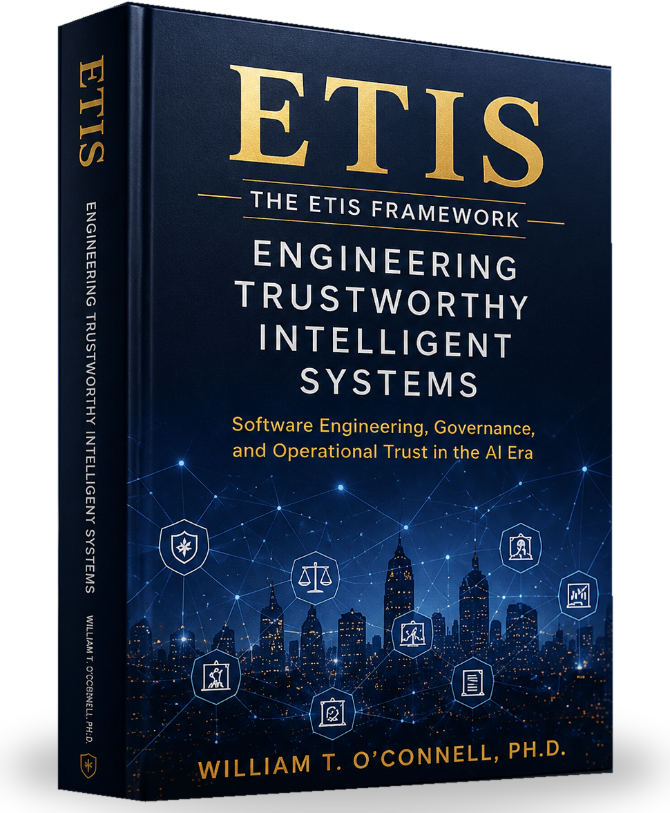

---
hide:
  - navigation
  - toc
---

<section class="etis-hero-final">
  

    

      
    

    

      
ETIS

      

      
The ETIS Framework

      <h1>Engineering Trustworthy Intelligent Systems</h1>

      

        Software Engineering, Governance, 
        and Operational Trust in the AI Era
      

      

        ETIS is a practical engineering framework for building, governing,
        operating, and continuously improving trustworthy intelligent systems
        throughout their lifecycle.
      

      

        <a class="etis-hero-button etis-primary-button" href="Front_Matter/01_Title_Page/">
          
            <svg viewBox="0 0 32 32" focusable="false" role="img" aria-hidden="true">
              <path d="M5.5 7.25c0-.83.67-1.5 1.5-1.5h6.45c1.12 0 2.03.36 2.55 1.07.52-.71 1.43-1.07 2.55-1.07H25c.83 0 1.5.67 1.5 1.5v17.2c0 .44-.36.8-.8.8h-7.05c-.96 0-1.86.32-2.58.91a.96.96 0 0 1-1.14 0 4.05 4.05 0 0 0-2.58-.91H6.3a.8.8 0 0 1-.8-.8V7.25Z" fill="none" stroke="currentColor" stroke-width="2.1" stroke-linecap="round" stroke-linejoin="round"/>
              <path d="M16 6.95v19.1" fill="none" stroke="currentColor" stroke-width="2.1" stroke-linecap="round"/>
              <path d="M8.6 9.2h3.9M8.6 12.25h3.9M19.5 9.2h3.9M19.5 12.25h3.9" fill="none" stroke="currentColor" stroke-width="1.65" stroke-linecap="round" opacity=".9"/>
            </svg>
          
          <strong>Read Online</strong><small>Start Reading</small>
        </a>
        <a class="etis-hero-button" href="Volumes/Volume_I/">
          <strong>Volume I</strong><small>Parts I–II</small>
        </a>
        <a class="etis-hero-button" href="Volumes/Volume_II/">
          <strong>Volume II</strong><small>Parts III–IV</small>
        </a>
        <a class="etis-hero-button" href="Appendices/Appendices/">
          <strong>Appendices</strong><small>Reference Material</small>
        </a>
       <a class="etis-hero-button" href="Resources/download/">
          
            <svg viewBox="0 0 32 32" focusable="false" role="img" aria-hidden="true">
              <path d="M16 5.5v14" fill="none" stroke="currentColor" stroke-width="2.2" stroke-linecap="round"/>
              <path d="M10.5 14.5 16 20l5.5-5.5" fill="none" stroke="currentColor" stroke-width="2.2" stroke-linecap="round" stroke-linejoin="round"/>
              <path d="M7.5 24.5h17" fill="none" stroke="currentColor" stroke-width="2.2" stroke-linecap="round"/>
            </svg>
          
          <strong>Download</strong><small>Full PDF</small>
        </a>
      

    

  

</section>

<section class="etis-main-grid">
  

    <h2>Why ETIS?</h2>
    

    
The acceleration of AI and intelligent systems demands a new standard: trust must be engineered, not assumed.

    <ul class="etis-checks">
      <li>AI systems introduce new risks and complexities.</li>
      <li>Trustworthy systems require disciplined engineering.</li>
      <li>Governance is architecture, not an afterthought.</li>
      <li>Evidence creates accountability and enables trust.</li>
      <li>Human judgment, verification, and oversight remain essential.</li>
    </ul>

    <a class="etis-inline-link" href="Appendices/Appendix_A/Appendix_A/">Learn more about the ETIS Framework →</a>
  

  

    <h2>ETIS Core Principles</h2>
    

    
<svg viewBox="0 0 64 64" aria-hidden="true"><path d="M32 10v40M16 24h32M20 24l-8 18h16l-8-18ZM44 24l-8 18h16l-8-18Z"/><path d="M24 54h16"/></svg>
<strong>AI Proposes; Engineers Verify</strong>
AI can propose, but engineers are responsible for verification, validation, and outcomes.

    
<svg viewBox="0 0 64 64" aria-hidden="true"><path d="M32 8l22 8v15c0 14-9 24-22 29C19 55 10 45 10 31V16l22-8Z"/><path d="M22 32l7 7 14-16"/></svg>
<strong>Governance is Architecture</strong>
Governance is not overhead; it is the architecture that enables trust and controls risk.

    
<svg viewBox="0 0 64 64" aria-hidden="true"><circle cx="32" cy="32" r="15"/><circle cx="32" cy="32" r="5"/><path d="M32 8v10M32 46v10M8 32h10M46 32h10"/></svg>
<strong>Context is Control</strong>
Meaning, intent, and context determine how systems behave and how decisions should be made.

    
<svg viewBox="0 0 64 64" aria-hidden="true"><path d="M18 10h22l8 8v36H18z"/><path d="M40 10v10h10M24 30h18M24 38h18M24 46h12"/></svg>
<strong>Everything Important Leaves Evidence</strong>
If it is not documented, it did not happen in a reviewable way.

    
<svg viewBox="0 0 64 64" aria-hidden="true"><path d="M32 14v12M20 50V38h24v12M14 50h12M38 50h12M32 26h-8v12M32 26h8v12"/><circle cx="32" cy="14" r="4"/></svg>
<strong>The Model Is Not the System</strong>
Models are components. The system includes data, interfaces, people, and processes.

    
<svg viewBox="0 0 64 64" aria-hidden="true"><path d="M26 10h12M29 10v16L17 52c-1 2 .5 4 2.6 4h24.8c2.1 0 3.6-2 2.6-4L35 26V10"/><path d="M23 42h18"/></svg>
<strong>A Demo Is Not Operational Proof</strong>
Demos impress. Operations prove. Operational trust is earned over time.

  

  

    <h2>The ETIS Framework</h2>
    

    
A four-part framework covering the full lifecycle of trustworthy intelligent systems.

    <a class="etis-framework-tile blue" href="Part_1/Chapter_01/Chapter_01/">
      
<svg viewBox="0 0 64 64" aria-hidden="true"><path d="M10 52h44M14 46h36M17 24h30M13 20l19-9 19 9M20 24v22M29 24v22M38 24v22M47 24v22"/></svg>

      
<strong>Part I Foundations</strong><small>Principles, context, and the engineering mindset.</small>

      
    </a>

    <a class="etis-framework-tile teal" href="Part_2/Chapter_08/Chapter_08/">
      
<svg viewBox="0 0 64 64" aria-hidden="true"><path d="M25 10h14l2 8 7 4 8-3 7 12-6 6v8l6 6-7 12-8-3-7 4-2 8H25l-2-8-7-4-8 3-7-12 6-6v-8l-6-6 7-12 8 3 7-4 2-8Z"/><circle cx="32" cy="36" r="9"/></svg>

      
<strong>Part II Engineering Practice</strong><small>Requirements, architecture, planning, implementation, verification, and delivery.</small>

      
    </a>

    <a class="etis-framework-tile purple" href="Part_3/Chapter_23/Chapter_23/">
      
<svg viewBox="0 0 64 64" aria-hidden="true"><path d="M25 15c-7 0-12 5-12 12 0 3 1 5 3 7-3 2-5 5-5 9 0 7 5 12 12 12 4 0 7-2 9-5 2 3 5 5 9 5 7 0 12-5 12-12 0-4-2-7-5-9 2-2 3-4 3-7 0-7-5-12-12-12-3 0-6 1-8 4-2-3-5-4-6-4Z"/><path d="M32 19v31M22 27h9M33 28h10M20 39h11M33 40h11"/></svg>

      
<strong>Part III Operational Trust</strong><small>Incidents, observability, security, reliability, governance, and release authority.</small>

      
    </a>

    <a class="etis-framework-tile gold" href="Part_4/Chapter_33/Chapter_33/">
      
<svg viewBox="0 0 64 64" aria-hidden="true"><path d="M32 8l22 8v15c0 14-9 24-22 29C19 55 10 45 10 31V16l22-8Z"/><path d="M22 32l7 7 14-16"/></svg>

      
<strong>Part IV Trustworthy Intelligent Systems</strong><small>Agentic systems, context engineering, oversight, stewardship, and engineering identity.</small>

      
    </a>

    <a class="etis-inline-link" href="Part_1/Chapter_01/Chapter_01/">Explore all chapters →</a>
  

</section>

<section class="etis-repo-section">
  

    <h2>Repository-Centered Engineering</h2>
    
ETIS uses a repository as the system of record. Every important decision, artifact, and outcome is captured, linked, and preserved.

    

      
☑<strong>Requirements</strong><small>Capture intent, constraints, and acceptance.</small>

      
›

      
▤<strong>ADRs</strong><small>Record key architecture and design decisions.</small>

      
›

      
👥<strong>Reviews</strong><small>Review board oversight and decision records.</small>

      
›

      
▣<strong>Evidence</strong><small>Verification, validation, and test results.</small>

      
›

      
🛡<strong>AI Governance</strong><small>AI use logs, prompts, evaluations, and model oversight.</small>

      
›

      
↗<strong>Operations</strong><small>Run records, monitoring, incidents, and continuous improvement.</small>

      
›

      
⬡<strong>Releases</strong><small>Release decisions, approvals, and deployment records.</small>

    

    
<strong>Everything important leaves evidence.</strong>

    

      
🛡<strong>Engineering First</strong><small>Sound engineering practices applied to intelligent systems.</small>

      
👥<strong>Human Oversight</strong><small>Engineers remain accountable for outcomes and impact.</small>

      
◎<strong>Operational Trust</strong><small>Systems earn trust in real-world operations.</small>

      
🏛<strong>Governance by Design</strong><small>Governance is built in, not bolted on.</small>

      
↗<strong>Continuous Improvement</strong><small>Learn, adapt, and improve through evidence.</small>

      
🌐<strong>For Every Role</strong><small>Students, engineers, architects, managers, and executives.</small>

    

  

</section>

<section class="etis-resource-strip">
  <a href="Appendices/Appendices/">▤
<strong>Appendices</strong><small>Reference framework and tools</small>
</a>
  <a href="Resources/Resources/">◫
<strong>Resource Center</strong><small>Downloads, templates, and guides</small>
</a>
  <a href="Resources/Teaching_with_ETIS/">▱
<strong>Teaching with ETIS</strong><small>Courses, assignments, and teaching materials</small>
</a>
  <a href="Resources/GitHub_Repository/">◉
<strong>GitHub Repository</strong><small>Source, examples, and ecosystem artifacts</small>
</a>
</section>

